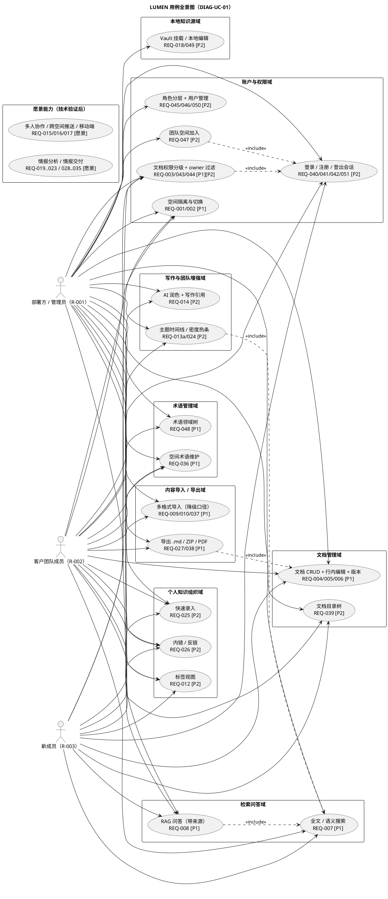

# 00 Scenario（项目背景与场景）

> 本文是工程基准想定，从产品愿景叙事 `docs/vision/product-vision.md` 抽取。
> 完整功能清单见 docs/01；阶段路线图见 docs/03 §3；愿景叙事本身不直接驱动开发。
> 本项目文档按「完整骨架 + 阶段增量」演进（见 ai/global-rules.md §8）。

## 0. 文档元信息

| 项 | 内容 |
|---|---|
| 输入来源 | `docs/vision/product-vision.md` v18 / v19 场景覆盖索引 |
| 入口模式 | Vision-first |
| 文档剖面 | Full |
| 当前状态 | 已确认（Phase1 Demo、Phase1.5A 个人可用 Alpha、Phase1.5B PDF 导出、Phase2A 个人知识组织均已完成；Phase1.5B 其余候选 / Phase2B / 愿景按阶段增量演进） |
| 最后更新 | 2026-08-04（Sprint-18 单文档 PDF 导出闭环：API-019 + TC-P1-017 通过） |

## 1. 背景与问题

LUMEN 是面向中小企业（典型：帮客户做 AI Agent 落地的初创公司 Nova）的团队知识库。
要解决的核心问题（当前痛点）：

- 团队知识分散在聊天 / 邮件 / 桌面旧文件 / 个人笔记库中，难以沉淀与复用；
- 新人入职难以快速建立"这个项目 / 客户是怎么走到今天的"全貌；
- 部署方与客户团队需要既协作又隔离的知识空间（私有资产不外泄，共享资产可推进）；
- 存量知识能被 AI 检索与问答引用，而不必先做痛苦的数据迁移。

业务机会：

- 用统一知识库 + 双空间隔离 + RAG 问答，把分散沉淀转化为可检索、可问答、可对齐口径的团队资产，降低新人 ramp-up 成本与跨客户知识复用门槛。

来源锚点：`docs/vision/product-vision.md` v18 / v19 场景覆盖索引（场景1..9）。

## 2. 目标用户

| 角色 ID | 角色 | 目标 | 痛点 | 成功标准 | 来源锚点 |
|---|---|---|---|---|---|
| R-001 | 部署方 / 管理员（Alice，系统部署方，持多空间管理员权限） | 隔离客户与内部知识空间，管理权限并维护共享内容 | 多客户知识既需协作又需隔离，混放易外泄；多空间管理负担重 | 能在 nova-internal / brightlite-team 等空间间管理，隔离客户与内部知识并维护共享内容 | `docs/vision/product-vision.md` 场景1 / 场景5 |
| R-002 | 客户团队成员（Lily 业务 / Mark 技术，客户方员工） | 检索共享知识、更新文档并获得带来源回答 | 仅能访问所属共享空间，其他空间不可见；知识分散难复用 | 能检索共享知识、更新文档并获得带来源回答，且不越权 | `docs/vision/product-vision.md` 场景1 / 场景4 |
| R-003 | 新成员（Kira，刚入职） | 快速建立"项目 / 客户走到今天"的全貌 | 缺乏背景难以上手；易跨空间误泄露信息 | 能快速建立项目全貌，且不跨空间泄露信息 | `docs/vision/product-vision.md` 场景6 / 场景9 |

> 以上人物 / 公司 / 产品名均为虚构，仅用于场景演示。

## 3. 典型场景

| 场景 ID | 参与角色 | 触发条件 | 场景叙事 | 期望结果 | 来源锚点 |
|---|---|---|---|---|---|
| SC-001 | R-001 / R-002 | 用户登录 LUMEN 或切换空间 | 登录后停留在所属空间，能感知最近更新；同一账号可切换不同隔离空间 | 只看到当前空间内容，切换后首页 / 搜索 / 问答上下文随空间变化 | `docs/vision/product-vision.md` 场景1 |
| SC-002 | R-001 / R-002 | 文档设为私有、团队共享或外部只读 | 文档权限决定谁能读取、搜索和问答引用 | 私有文档仅作者可见，不进入他人的检索 / 问答结果 | `docs/vision/product-vision.md` 场景4 / 场景8 |
| SC-003 | R-001 / R-002 | 空间中已有项目文档 | 用户创建、行内编辑、保存并查看历史版本 | 文档内容持久，版本可查看和恢复 | `docs/vision/product-vision.md` 场景2 / 场景5 |
| SC-004 | R-002 / R-003 | 空间中已有可检索文档与术语 | 用户用关键词或语义问题搜索 / 问答，定位项目历史约束（如延迟下限），并按当前空间术语解释客户习惯用语 | 结果带来源，不跨权限边界；术语解释优先使用空间定义 | `docs/vision/product-vision.md` 场景4 / 场景5b / 场景9 |
| SC-005 | R-001 / R-002 | 存量资料需要进入知识库 | Phase1 Demo 导入 `.md` / `.txt` 或已提取文本；真实 Word / PDF 解析与图片 OCR 作为后续真实化边界 | 导入内容可搜索、可被问答引用；真实解析 / OCR 不作为 Phase1 必过 | `docs/vision/product-vision.md` 场景5 |
| SC-006 | R-001 / R-002 / R-003 | 用户使用桌面浏览器访问 | 在 Chrome / Edge 中完成导入、检索、问答、编辑、版本和术语流程 | 桌面端主流程无阻断 | `docs/vision/product-vision.md` 场景8 / 场景9 |
| SC-007 | R-001 / R-002 / R-003 | 用户准备把 LUMEN 作为个人日常知识库使用 | 用户一次拖入多个 `.md` / `.txt` 或整个资料文件夹，系统批量入库并保留相对路径前缀；需要迁出或备份时，可下载单文档 `.md` 或导出当前空间 ZIP；需要对外排版分享时，可对可读文档发起 PDF 导出并获得导出任务结果 | 个人能快速把资料放进去，之后可搜索、可问答、可编辑、可备份，并能导出中文 PDF；PDF 导出不阻塞个人可用 Alpha，已作为个人增强 Beta 闭环 | 2026-07-15 人工新增诉求：尽快实现并投入个人使用；`docs/03-prd.md` P1.5 路线图 |
| SC-008 | R-001 / R-002 / R-003 | 空间资料已积累，需要建立个人知识组织结构 | 用户通过标签聚合同主题文档，在 Markdown 中用 `[[文件名]]` 建立内部链接并查看反向链接，用快速录入记录无原文的轻量条目 | 文档可互联、可组织、可快速沉淀；权限过滤不泄露不可见文档 | `docs/03-prd.md` Phase2A closure；`docs/09-verification.md` TC-P2-LINK/TAG/QUICK-001 |
| SC-009 | R-001 / R-002 / R-003 | 空间资料积累，需按目录层级组织（标签 / 内链之外） | 用户新建 / 移动 / 排序嵌套文件夹组织文档；导入文件夹保留真实目录结构 | 文档归属 folder 正确；导入保留结构；防环 / 跨空间 / 重名 / 删非空 folder 拒绝；folder 不独立权限，文档可见性仍按 permission 不泄露 | `docs/design/folder-tree.md`；TC-P2-FOLDER-001（待立项） |

## 3.1 场景边界与非目标

| 边界 ID | 内容 | 适用阶段 | 原因 / 来源 | 下游约束 |
|---|---|---|---|---|
| SCB-001 | Phase1 Demo 只承诺桌面浏览器主流程，不承诺移动端适配 | Phase1 | `docs/03-prd.md` §3 / `ai/project-rules.md` §1 | `03` 非目标、`08/09` 不把移动端列为 P1 必过 |
| SCB-002 | Phase1 内容导入按 `.md` / `.txt` 或已提取文本降级演示；真实 Word / PDF 解析和图片 OCR 留后续真实化 | Phase1 | `docs/03-prd.md` §3、`docs/09-verification.md` §2 / §6 | `02` REQ-009/010、`09` TC-P1-009/010 使用降级口径 |
| SCB-003 | 私有文档不得进入非作者的检索、问答或共享视图 | 全阶段 | `docs/vision/product-vision.md` 场景4 / 场景8 | `02` REQ-003、`07` 权限错误、`09` TC-P1-003 |
| SCB-004 | 库外问答必须明确“未找到”，不得编造答案 | 全阶段 | 产品红线，见 `docs/03-prd.md` Phase1 退出标准 | `02` REQ-008、`09` TC-P1-008 |
| SCB-005 | 高级视图、跨空间推送、协作、移动端、情报分析能力不进入 Phase1 | Phase1 | `ai/project-rules.md` §1 禁止清单 | `03` Phase 路线图、`08` Sprint 禁止事项 |
| SCB-006 | P1.5 个人可用 Alpha 优先批量导入与导出备份；PDF、真实 Word/PDF 解析、标签 / 内链、AI 润色均不得阻塞 Alpha | P1.5 | 2026-07-15 00-03 路线图重评估 | `03` Phase1.5A / 1.5B 拆分、`08` Sprint 排序、`09` TC-P1-015..017 |

## 3.2 上游来源映射

| 来源 ID | 来源位置 | 承接角色 / 场景 | 可信度 | 备注 |
|---|---|---|---|---|
| SRC-001 | `docs/vision/product-vision.md` 场景1 | R-001 / R-002、SC-001 | 已确认愿景锚点 | 双空间、空间切换、最近更新感知 |
| SRC-002 | `docs/vision/product-vision.md` 场景2 | SC-003 | 已确认愿景锚点 | 文档编辑、保存和版本历史 |
| SRC-003 | `docs/vision/product-vision.md` 场景4 | R-002 / R-003、SC-002 / SC-004 | 已确认愿景锚点 | 私有文档、搜索、问答和权限边界 |
| SRC-004 | `docs/vision/product-vision.md` 场景5 | R-001 / R-002、SC-003 / SC-005 | 已确认愿景锚点 | 导入、整理、跨空间候选能力；Phase1 仅承接已提取文本导入 |
| SRC-005 | `docs/vision/product-vision.md` 场景5b / 场景9 | R-003、SC-004 / SC-006 | 已确认愿景锚点 | 术语管理、新成员入职和桌面端 Demo 主路径 |
| SRC-006 | `ai/project-rules.md` §1、`docs/03-prd.md` §3 | SCB-001..SCB-005 | 阶段边界权威源 | 约束 Phase1 / Phase2 / 愿景边界 |
| SRC-007 | 2026-07-15 人工目标 + `docs/research/2026-07-15-requirements-00-03-route-audit.md` | SC-007 / SCB-006 | 已确认人工目标 | 优先个人可用：批量入库、导出备份、稳定性收口，再做 PDF / 轻量知识组织 |
| SRC-008 | 2026-07-20 Phase2A closure + `docs/09-verification.md` §2 / §5 | SC-008 | 已确认实现证据 | 个人知识组织：内链 / 反链、标签、快速录入 |

## 3.3 下游影响

| SC-ID | 影响 U-ID | 影响 REQ | 设计入口 | 验证入口 | 任务入口 | 备注 |
|---|---|---|---|---|---|---|
| SC-001 | U-01 / U-02 | REQ-001 / REQ-002 | MOD-001 空间与权限（`docs/design/permissions.md`） | TC-P1-001 / 002 | Sprint-1 | 空间隔离与空间切换底座 |
| SC-002 | U-03 / U-12 | REQ-003 | MOD-001 空间与权限（`docs/design/permissions.md`） | TC-P1-003 | Sprint-1 | 权限分级与私有文档边界 |
| SC-003 | U-04 / U-05 / U-06 | REQ-004 / REQ-005 / REQ-006 | MOD-002 文档管理 | TC-P1-004..006 | Sprint-2 | 文档 CRUD、行内编辑与版本历史 |
| SC-004 | U-07 / U-08 / U-42 | REQ-007 / REQ-008 / REQ-036 | MOD-004 检索问答（`docs/design/rag-retrieval.md`）、MOD-005 术语管理（`docs/design/term-management.md`） | TC-P1-007 / 008 / 012 | Sprint-4 / Sprint-5（task-009） | hybrid search、RAG 问答和空间术语对齐 |
| SC-005 | U-09 / U-10 | REQ-009 / REQ-010 | MOD-003 内容导入（`docs/design/ingestion.md`） | TC-P1-009 / 010 | Sprint-3 | Phase1 已提取文本导入与 OCR 降级边界 |
| SC-006 | U-11 | REQ-011 | COMP-001 前端 / COMP-002 后端 | TC-P1-011 | Sprint-6 | 桌面浏览器验收入口 |
| SC-007 | U-09 / U-33 / U-43 | REQ-037 / REQ-038 / REQ-027 | MOD-003 内容导入、MOD-007 写作 / 导出；`docs/07-api-spec.md` API-019/029/030 | TC-P1-015 / 016 / 017 | Sprint-16 / Sprint-17 / Sprint-18 | P1.5 个人可用：批量入库 + 导出备份已完成；PDF 导出已随 Sprint-18 实现并通过 TC-P1-017 |
| SC-008 | U-13 / U-31 / U-32 | REQ-012 / REQ-025 / REQ-026 | MOD-006 个人知识组织；`docs/07-api-spec.md` API-014/017/018/027/031/032 | TC-P2-TAG-001 / TC-P2-QUICK-001 / TC-P2-LINK-001 | Phase2A Task A/B 完成包 | Phase2A 已完成：标签、快速录入、内链 / 反链 |
| SC-009 | U-44 | REQ-039 / REQ-037 | MOD-006 个人知识组织（folder-tree）；`docs/07-api-spec.md` API-034..037 + API-029 改造 | TC-P2-FOLDER-001 / TC-P1-015 扩展 | Sprint-22（候选） | 文档目录树组织 + 导入保留结构 |

## 3.4 用例全景图（DIAG-UC-01）

> 需求分析层用例视图（对照 `docs/references/软件系统面向对象开发方法的过程要点及关系.md` 需求分析阶段「用例图」）：以 UML 用例图标准符号（参与者火柴人、水平椭圆用例、系统边界矩形、`<<include>>` 关系）表达 LUMEN 全量用户能力的可交互边界，挂 REQ 追溯（权威映射见 §3.3 与 `01` §6）。用例按域聚合，阶段标签 `[P1]` / `[P2]` / `[愿景]` 与 `03 §3` 一致；愿景域用例需 `05` 技术验证通过后才可进入某 Phase。
> 覆盖异常 / 权限路径：库外问答明确「未找到」不编造（REQ-008）；无权限访问返回空结果 / 403（REQ-001/003/043/044）；真实 Word/PDF 解析与图片 OCR 按降级口径（REQ-009/010）。本图为全景导航，不替代 `01` 逐 U-ID / REQ 的验收口径。
> **渲染**：mermaid 无原生用例图语法，故本图用 plantuml 标准用例图；GitHub 不原生渲染 plantuml，需本机 plantuml（VS Code PlantUML 插件 / jar / 在线服务）预览，格式偏好见 `ai/project-rules.md` §2.2（plantuml 备选）。

## 4. 关联文档

- 产品愿景叙事（愿景，**不直接驱动开发**）：docs/vision/product-vision.md
- 完整需求链：01-user-requirements → 02-srs → 03-prd（§3 阶段路线图）
- 当前阶段：**Phase2B（团队 MVP）进行中**（2026-07-30 切指针）；Phase1 Demo + Phase1.5A + Phase2A（个人知识组织）已完成；见 `ai/project-rules.md` §1 与 `docs/03-prd.md` §3

## 5. 待人工确认项

| ID | 待确认项 | AI 建议 | 建议依据 | 备选方案 | 取舍影响 / 阻塞关系 |
|---|---|---|---|---|---|
| — | 无新增确认项 | — | Phase1 Demo 边界已在 `docs/03-prd.md` 与 `docs/09-verification.md` 中记录 | — | — |

---

*人物（Alice / Lily / Mark / Kira）、公司（Nova / Helios / BrightLite）、产品（LUMEN）均为虚构，仅用于场景演示。*
