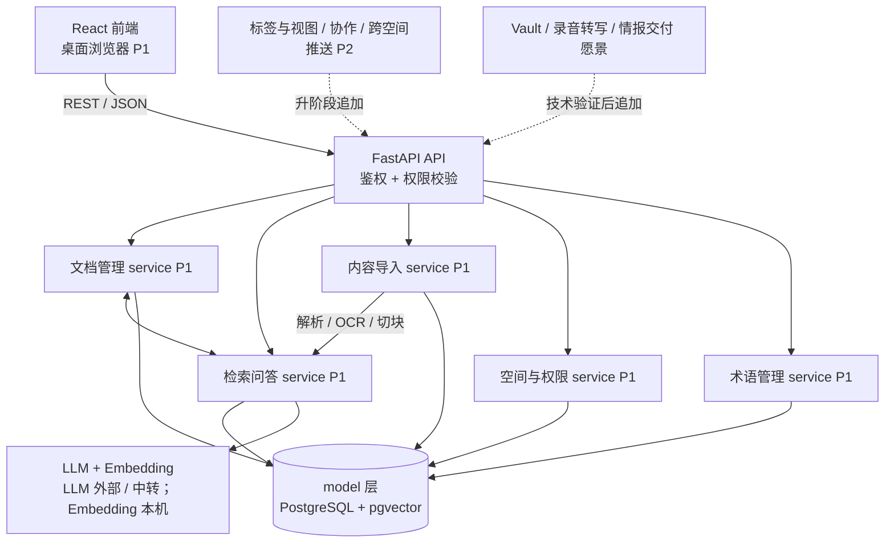
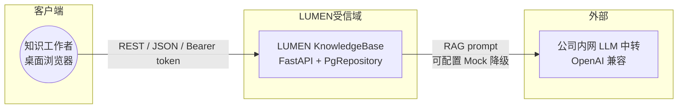
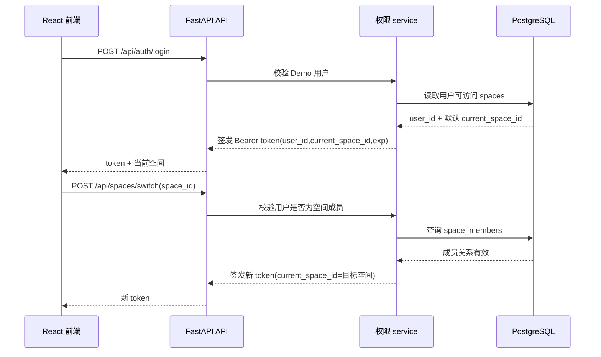
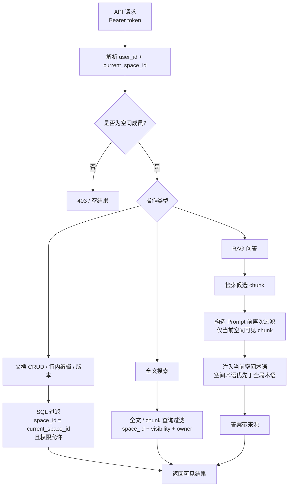

# 04 系统架构

> 按「完整骨架 + 阶段增量」演进（global-rules §8）。本文件铺出**完整愿景**的总体框架；
> 各子系统内部详细逻辑见 `docs/design/`；数据见 06；接口见 07。
> 子系统 / 模块均带阶段标签与状态。

## 0. 文档元信息

| 项 | 内容 |
|---|---|
| 输入来源 | `docs/02-srs.md`、`docs/03-prd.md`、`docs/env/local-env.md`、`ai/project-rules.md` |
| 覆盖功能 / REQ | Phase1：REQ-001..REQ-011、REQ-036；P2 / 愿景保留架构骨架 |
| 当前状态 | 目标架构基线已定；Sprint-7/8 后运行时已接入 PostgreSQL+pgvector、`PgRepository`、本机 Embedding 与 GLM LLM。仍降级：真实 Word/PDF 解析、OCR、search 向量化；逐模块实现状态见 §2 |
| 最后更新 | 2026-07-11（doc-standards 结构合规对齐） |

### 0.1 架构目标与约束

| 维度 | 内容 |
|---|---|
| 当前 Phase | Phase1（功能范围 `[P1]` · 交付物形态 **Demo**），见 `ai/project-rules.md` §1 |
| 交付物形态 | Demo：核心价值可演示，可用最简实现 / 明确 Mock，**保留产品红线**（库外问答回复"未找到"、不编造） |
| 运行环境 | 本机单机 Demo（React + FastAPI + Docker PostgreSQL+pgvector + 本机 Embedding + 内网 LLM 中转），详见 §4 |
| 项目形态裁剪 | Full 剖面；`06/07` 保留（持久化 + 对外 REST），见 `ai/project-rules.md` §3 |
| 禁止项 | 独立向量库、闭源 LLM SDK 绑定、移动端、实时协作、跨文档因果推理等；权威源 `ai/project-rules.md` §1 / §2、`docs/05-tech-spec.md` §3 |
| 权威源 | 阶段边界 = `ai/project-rules.md` §1；技术禁令 = §2 / `05 §3`；运行环境 = `docs/env/local-env.md` |
| 下游影响 | `05` 技术栈 / readiness gate；`06/07` 数据 / 接口边界；`docs/design/*` 模块详细设计；`08/09` Sprint / 验收路径 |

## 1. 整体架构图

> 注：上图为**当前 Phase1 Demo 架构**。Sprint-8 后 `db` 节点已由 PostgreSQL+pgvector / `PgRepository` 承载，`ai` 节点已接入 GLM LLM 与本机 `bge-small-zh` Embedding；`ingestion` 的真实 Word/PDF 解析与 OCR 仍降级（仅 `.md`/`.txt` 已提取文本）。逐模块实现状态见 §2，技术门禁见 `docs/05-tech-spec.md §5.1`。

### 1.1 系统上下文图（信任边界）

> 标外部参与者 / 系统与信任边界（对照 `ai/doc-standards/04-architecture.md` §3 系统上下文检查表）。明确哪些外部系统是真实 / Mock / 候选 / 默认关闭。

- **外部系统状态**：公司内网 LLM 中转 = **已接入**（GLM `glm-5.2`，RG-004 Go；可配置 Mock 降级）；飞书同步 / Vault 挂载 = 愿景候选（未实现）。
- **数据外发边界**：跨 LUMEN 受信域 → 外部 LLM 为唯一数据外发点。Sprint-7 起召回片段 / 术语定义可能发往 LLM；发往模型前须过滤敏感片段、优先避免发送真实团队文档（见 `ai/project-rules.md §2.5`、`docs/06-db-design.md §5`）。Embedding 本机运行，不外发。
- **输入 / 输出**：输入 = 用户 REST 请求（Bearer token，文档 / 搜索 / 问答 / 术语操作）；输出 = JSON 结果（可见范围内的文档、检索结果、带来源 RAG 答案）。跨受信域输出仅 LLM Prompt 片段（见上）。

### 1.2 容器 / 组件视图

| COMP-ID | 组件 / 进程 | 职责 | 部署位置 | 通信方式 | 阶段 | 状态 | 关联 REQ |
|---|---|---|---|---|---|---|---|
| COMP-001 | React 前端 SPA | 桌面浏览器 UI（文档 / 搜索 / 问答 / 术语） | 浏览器 | REST / JSON | [P1] | P1-已实现（代码原型 + smoke） | REQ-011、004~008、036 |
| COMP-002 | FastAPI 后端（api / service / model 三层） | REST API、权限校验、业务逻辑 | 本机单进程 | HTTP | [P1] | 已实现（PG 仓储 `PgRepository`，Sprint-8） | 全 P1 |
| COMP-003 | 数据存储 | PostgreSQL + pgvector | Docker Compose（lumen-pg:pg16） | SQL + pgvector | [P1] | 已接入（Sprint-8；RG-001 Go） | REQ-003~010、036 |
| COMP-004 | AI 服务 | LLM 中转（GLM）+ 本机 Embedding（bge-small-zh） | 本机 + 内网 | OpenAI 兼容 API | [P1] | 已接入（Sprint-7/8；RG-002/004 Go） | REQ-008、036 |

## 2. 子系统 / 模块划分（完整框架）

| MOD-ID | 子系统 | 职责 | 输入 → 输出 | 边界（不负责） | 关联组件 | 阶段 | 设计状态 | 实现状态（Phase1 Demo） | 详细设计 |
|---|---|---|---|---|---|---|---|---|---|
| MOD-001 | 空间与权限 | 多空间隔离、权限分级、查询时过滤 | 用户 / 空间成员关系 → 过滤后可见数据 | 不负责文档内容解析 | COMP-002 / 003 | [P1] | P1-已实现 | PostgreSQL 成员 / 文档权限过滤已接入；内存 `DemoRepository` 仅作单测 fake | docs/design/permissions.md |
| MOD-002 | 文档管理 | CRUD、行内编辑、版本历史 | 文档字段 → 持久化文档 / 版本 | 不负责检索 / 导入 | COMP-002 / 003 | [P1] | P1-已实现 | PostgreSQL 文档 / 版本持久化已接入 | （逻辑简单，见 06/07） |
| MOD-003 | 内容导入 | Word/PDF 解析、OCR、切块入库 | 文件 → 切块 + 文档 | 不负责检索 / 问答 | COMP-002 / 003 / 004 | [P1] | P1-部分实现 | `.md`/`.txt` 已提取文本导入 + 切块入 PG；真实 Word/PDF/OCR 仍降级（RG-003） | docs/design/ingestion.md |
| MOD-004 | 检索问答 | 全文搜索、RAG（向量+全文+引用） | 查询 → 结果 + 来源 | 不负责导入解析 | COMP-002 / 003 / 004 | [P1] | P1-部分实现 | search=关键词检索·PG；RAG=关键词 + pgvector 向量召回 + GLM LLM；向量搜索留后续 | docs/design/rag-retrieval.md |
| MOD-005 | 术语管理 | 空间级术语表、文档术语识别、问答口径对齐 | 术语 → 口径注入 | 不负责问答生成 | COMP-002 / 003 / 004 | [P1] | P1-已实现 | PostgreSQL 术语存储已接入；术语定义已注入真实 LLM Prompt | docs/design/term-management.md |
| MOD-006 | 标签与视图 | 标签 / 时间轴 / 关联图导航 | — | — | COMP-001 / 002 | [P2] | 骨架 | — | 待 P2 建 docs/design/ |
| MOD-007 | 协作与推送 | 多人编辑、跨空间只读推送 | — | — | COMP-001 / 002 | [P2] | 骨架 | — | 待 P2 |
| MOD-008 | 存量接入 | Vault 挂载、录音转写、飞书同步 | — | — | — | [愿景] | 骨架 | — | 待技术验证 |
| MOD-009 | 情报分析（i2 精神） | 关联图↔时间轴联动、路径推理、人物网络、矛盾检测、证据地图、信号追踪 | — | — | — | [愿景] | 骨架 | — | docs/design/intelligence-analysis.md |
| MOD-010 | 情报交付 | 对外只读简报、管理层摘要、分析包 A Kit | — | — | — | [愿景] | 骨架 | — | 待技术验证 |

## 3. 架构决策与取舍（ADR）

> 与 05 互补：这里讲"为什么"，05 讲"具体版本"。决策状态用 §7.1 横切状态词典；决策已采纳但实现未接入的，状态标「已确认（目标）」。

- **PostgreSQL + pgvector**：关系数据与向量检索一体，Phase1 少引一个独立向量库（Milvus/Qdrant），降低部署与一致性成本。
- **AI 调用边界**：LLM 不绑单一闭源 SDK，走 OpenAI 兼容接口；Embedding Phase1 本机运行 `bge-small-zh`（512 维），通过 adapter 保留迁移到内网 Embedding 服务的空间。
- **导入流水线收敛异构格式**：Word / PDF / 图片统一走"提取纯文本 → 切块 → Embedding"，检索侧只面对一种数据形态。
- **权限下沉到 SQL / 检索层**：空间隔离 + 文档权限在数据查询时过滤，不依赖应用层记忆，防漏过滤。
- **子系统拆分**：RAG / 导入 / 权限各自非平凡且可独立演进，单独成 docs/design/；文档 CRUD 简单，不单列。

### 3.1 ADR 矩阵

| ADR | 决策 | 状态 | 适用 Phase | 理由 | 替代方案 | 取舍影响 | 验证方式 |
|---|---|---|---|---|---|---|---|
| ADR-001 | PostgreSQL + pgvector 一体化存储 | 已接入（Sprint-8；RG-001 Go） | Phase1+ | 关系数据与向量检索一体，少引独立向量库，降部署与一致性成本 | Milvus / Qdrant 独立向量库 | 少一个组件、一致性成本低；强依赖 pgvector 扩展与 Docker | 已落地（lumen-pg + PgRepository + 向量召回） |
| ADR-002 | AI 走 OpenAI 兼容接口 + 本机 Embedding | 已接入（Sprint-7/8；RG-002/004 Go） | Phase1+ | LLM 不绑单一闭源 SDK；Embedding 本机运行并保留迁内网服务空间 | 绑定单一闭源 LLM SDK | 厂商解耦、可迁内网；需 adapter 适配 | LLM=GLM 中转、Embedding=bge-small-zh |
| ADR-003 | 导入流水线收敛异构格式为文本→切块→Embedding | 已确认（目标；当前仅 `.md`/`.txt`） | Phase1+ | 检索侧只面对一种数据形态，解析复杂度集中于导入 | 各格式独立检索路径 | 检索侧统一数据形态；解析复杂度集中于导入 | TC-P1-009 / 010（09 §2） |
| ADR-004 | 权限下沉到 SQL / 检索层（查询时过滤） | 已确认（当前内存等价实现） | Phase1+ | 空间隔离 + 文档权限在查询时过滤，不依赖应用层记忆，防漏过滤 | 应用层记忆当前空间 | 防漏过滤、安全边界强；强依赖查询层正确性 | TC-P1-001 / 003（09 §2） |
| ADR-005 | RAG / 导入 / 权限独立成 docs/design/ | 已确认 | Phase1+ | 三者非平凡且可独立演进，单列详细设计便于维护 | 全部并入 04 | 子系统可独立演进；多份详细设计需维护 | `docs/design/*` 已存在 |

## 4. 部署 / 运行拓扑约束

> 受 `ai/project-rules.md` §2.5 与 `docs/env/local-env.md` 约束。Demo 本机优先；资源不足再上公司服务器。

- 进程 / 端口（Demo）：FastAPI 后端 `uvicorn` :8000；React 前端 Vite :5173；PostgreSQL+pgvector `lumen-pg` :5432（Docker Compose）。

- 本机单机（Demo 默认）：React 前端 + FastAPI（api/service/model 三层）+ Docker Compose PostgreSQL+pgvector（lumen-pg）+ 本机 `bge-small-zh` Embedding + 公司内网 GLM LLM 中转。内存 `demo_repository` 保留为单测 fake；真实 Word/PDF 解析、OCR 与 search 向量化仍降级 / 后续。
- 数据边界：默认使用已标注的虚构 Demo 数据；允许按需导入部分真实团队文档，真实文档必须显式标注来源 / 敏感级别，并优先避免发送到外部模型。
- 资源边界：Demo 峰值内存 < 8GB、显存 < 4GB、磁盘 < 20GB；允许本机安装项目所需依赖与镜像。
- 远程 / 公司服务器边界：Phase1 Demo 暂不使用公司服务器；若本机 Embedding 在导入规模、响应时间或检索质量上不够用，再申请内网 Embedding / reranker 服务。
- 重资源项归属：禁止本机运行大参数 LLM / 大型 Embedding / reranker；`bge-small-zh` 本机 Embedding 属 Phase1 可接受范围。

## 5. 关键流程与权限过滤

> 本节固定 Sprint-1 权限底座的架构边界：空间、文档权限、搜索和 RAG 必须共用同一套权限过滤原则，禁止仅在前端隐藏或仅靠业务层记忆当前空间。

### 5.1 登录与空间切换（Flow-001）

> **Flow-001 登录与空间切换**：成功（签发 token + 切换签新 token）｜异常（账号无效 → 4001）｜权限拒绝（非空间成员切换 → 4003）｜降级（内存 Demo 账号，无真实账号系统）｜关联 API-001/002/003、TC-P1-001/002。

### 5.2 文档访问、搜索与 RAG 统一过滤（Flow-002）

> **Flow-002 文档访问 / 搜索 / RAG 统一过滤**：成功（成员校验 → 过滤 → 可见结果；RAG 走关键词 + pgvector 向量召回 + GLM LLM）｜异常（token 无效 → 4001）｜权限拒绝（非成员 → 403 / 空；私有文档对他人 → 空）｜降级（LLM 可切 Mock；search 向量化未启用）｜外部不可用（明确 Mock，不编造）｜关联 API-004~010、TC-P1-003~008。

### 5.3 权限实现原则

- **空间优先**：所有查询先限定 `current_space_id`，再判断文档级权限。
- **私有文档**：仅作者可见；不得进入同空间其他成员搜索结果、RAG 候选 chunk 或问答来源。
- **团队共享**：同空间成员可见；跨空间默认不可见。
- **外部只读**：Phase1 仅表达只读权限类型，不实现跨空间推送；跨空间推送属于 P2。
- **双层过滤**：SQL / 检索层必须过滤；RAG 构造 Prompt 前必须再次过滤候选 chunk。
- **前端不可作为权限边界**：前端隐藏入口只改善体验，不作为安全判断依据。

## 6. REQ / 功能 → 模块 / Flow 追溯矩阵

> 补 MOD-ID / Flow-ID / 覆盖状态列（对照 `ai/doc-standards/04-architecture.md` §4 追溯链 `REQ/NFR → Phase → COMP-ID → MOD-ID → Flow-ID → design/API/DB/TC`）。COMP 见 §1.2，MOD 见 §2，Flow 见 §5。

| REQ | Phase | COMP-ID | MOD-ID | Flow-ID | 下游设计 | 覆盖状态 |
|---|---|---|---|---|---|---|
| REQ-001 / 002 / 003 | [P1] | COMP-002 / 003 | MOD-001（+ MOD-002 / 004） | Flow-001 / 002 | `docs/design/permissions.md`、`docs/06-db-design.md`、`docs/07-api-spec.md` | P1-已实现（PG 权限过滤） |
| REQ-004 / 005 / 006 | [P1] | COMP-001 / 002 / 003 | MOD-002 | Flow-002 | `docs/06-db-design.md`、`docs/07-api-spec.md` | P1-已实现（PG 文档 / 版本） |
| REQ-007 / 008 | [P1] | COMP-002 / 003 / 004 | MOD-004 | Flow-002 | `docs/design/rag-retrieval.md`、`docs/06-db-design.md`、`docs/07-api-spec.md` | P1-部分实现（search 关键词·PG；RAG 向量 + LLM） |
| REQ-009 / 010 | [P1] | COMP-002 / 003 / 004 | MOD-003（+ MOD-004） | Flow-002 | `docs/design/ingestion.md`、`docs/06-db-design.md`、`docs/07-api-spec.md` | P1-部分实现（`.md`/`.txt`；真实 PDF/OCR 后续） |
| REQ-011 | [P1] | COMP-001 / 002 | 全 P1 模块（横切） | Flow-001 / 002 | `docs/08-dev-plan.md` Sprint-6、`docs/09-verification.md` | P1-已实现（桌面 smoke） |
| REQ-036 | [P1] | COMP-002 / 003 / 004 | MOD-005（+ MOD-004 / 002） | Flow-002 | `docs/design/term-management.md`、`docs/06-db-design.md`、`docs/07-api-spec.md` | P1-已实现（PG 术语 + LLM 注入） |
| REQ-012..017 / 024..027 | [P2] | — | MOD-006 / 007（+ MOD-002） | — | 升 Phase2 时细化 | 骨架 |
| REQ-018..023 / 028..035 | [愿景] | — | MOD-008 / 009 / 010 | — | 技术验证通过后细化 | 骨架 |

## 7. 待人工确认项

- 无新增确认项；P2 / 愿景模块在升阶段或技术验证通过后再拆详细设计。
