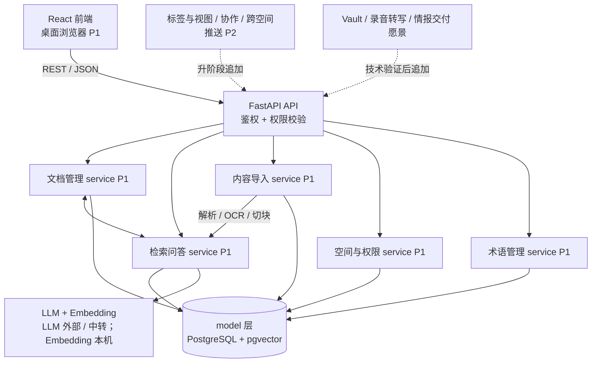
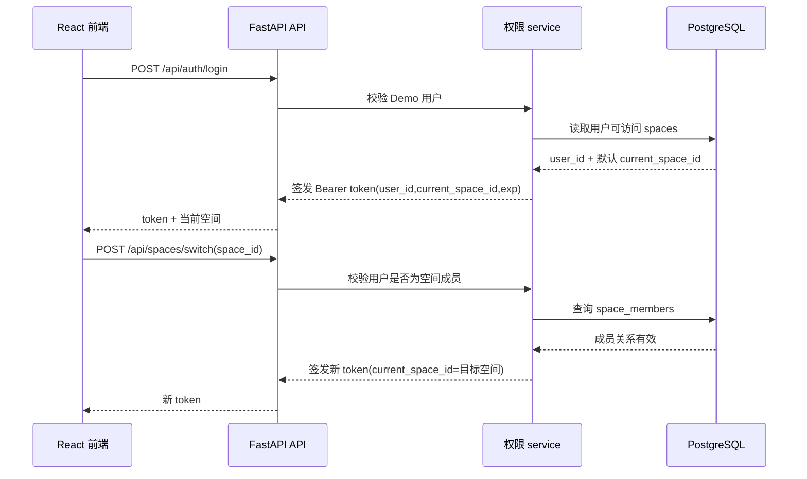
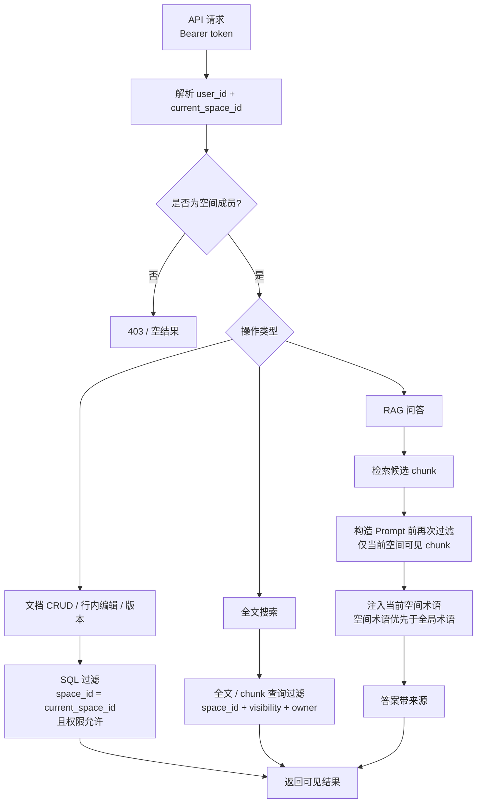

# 04 系统架构

> 按「完整骨架 + 阶段增量」演进（global-rules §8）。本文件铺出**完整愿景**的总体框架；
> 各子系统内部详细逻辑见 `docs/design/`；数据见 06；接口见 07。
> 子系统 / 模块均带阶段标签与状态。

## 0. 文档元信息

| 项 | 内容 |
|---|---|
| 输入来源 | `docs/02-srs.md`、`docs/03-prd.md`、`docs/env/local-env.md`、`ai/project-rules.md` |
| 覆盖功能 / REQ | Phase1：REQ-001..REQ-011、REQ-036；P2 / 愿景保留架构骨架 |
| 当前状态 | 已确认（Phase1 Demo 架构基线） |
| 最后更新 | 2026-07-03 |

## 1. 整体架构图

## 2. 子系统 / 模块划分（完整框架）

| 子系统 | 职责 | 阶段 | 状态 | 详细设计 |
|---|---|---|---|---|
| 空间与权限 | 多空间隔离、权限分级、查询时过滤 | [P1] | P1-已设计 | docs/design/permissions.md |
| 文档管理 | CRUD、行内编辑、版本历史 | [P1] | P1-已设计 | （逻辑简单，见 06/07） |
| 内容导入 | Word/PDF 解析、OCR、切块入库 | [P1] | P1-已设计 | docs/design/ingestion.md |
| 检索问答 | 全文搜索、RAG（向量+全文+引用） | [P1] | P1-已设计 | docs/design/rag-retrieval.md |
| 术语管理 | 空间级术语表、文档术语识别、问答口径对齐 | [P1] | P1-已设计 | docs/design/term-management.md |
| 标签与视图 | 标签 / 时间轴 / 关联图导航 | [P2] | 骨架 | 待 P2 建 docs/design/ |
| 协作与推送 | 多人编辑、跨空间只读推送 | [P2] | 骨架 | 待 P2 |
| 存量接入 | Vault 挂载、录音转写、飞书同步 | [愿景] | 骨架 | 待技术验证 |
| 情报分析（i2 精神） | 关联图↔时间轴联动、路径推理、人物网络、矛盾检测、证据地图、信号追踪 | [愿景] | 骨架 | docs/design/intelligence-analysis.md |
| 情报交付 | 对外只读简报、管理层摘要、分析包 A Kit | [愿景] | 骨架 | 待技术验证 |

## 3. 技术选型理由

> 与 05 互补：这里讲"为什么"，05 讲"具体版本"。

- **PostgreSQL + pgvector**：关系数据与向量检索一体，Phase1 少引一个独立向量库（Milvus/Qdrant），降低部署与一致性成本。
- **AI 调用边界**：LLM 不绑单一闭源 SDK，走 OpenAI 兼容接口；Embedding Phase1 本机运行 `bge-small-zh`（512 维），通过 adapter 保留迁移到内网 Embedding 服务的空间。
- **导入流水线收敛异构格式**：Word / PDF / 图片统一走"提取纯文本 → 切块 → Embedding"，检索侧只面对一种数据形态。
- **权限下沉到 SQL / 检索层**：空间隔离 + 文档权限在数据查询时过滤，不依赖应用层记忆，防漏过滤。
- **子系统拆分**：RAG / 导入 / 权限各自非平凡且可独立演进，单独成 docs/design/；文档 CRUD 简单，不单列。

## 4. 部署 / 运行拓扑约束

> 受 `ai/project-rules.md` §2.5 与 `docs/env/local-env.md` 约束。Demo 本机优先；资源不足再上公司服务器。

- 本机单机（Demo 默认）：React 前端 + FastAPI（api/service/model 三层）+ PostgreSQL/pgvector，Docker Compose 起库；Embedding 本机运行 `bge-small-zh`，LLM 走公司内网中转 / 外部 OpenAI 兼容 API 或明确 Mock。
- 数据边界：默认使用已标注的虚构 Demo 数据；允许按需导入部分真实团队文档，真实文档必须显式标注来源 / 敏感级别，并优先避免发送到外部模型。
- 资源边界：Demo 峰值内存 < 8GB、显存 < 4GB、磁盘 < 20GB；允许本机安装项目所需依赖与镜像。
- 远程 / 公司服务器边界：Phase1 Demo 暂不使用公司服务器；若本机 Embedding 在导入规模、响应时间或检索质量上不够用，再申请内网 Embedding / reranker 服务。
- 重资源项归属：禁止本机运行大参数 LLM / 大型 Embedding / reranker；`bge-small-zh` 本机 Embedding 属 Phase1 可接受范围。

## 5. 关键流程与权限过滤

> 本节固定 Sprint-1 权限底座的架构边界：空间、文档权限、搜索和 RAG 必须共用同一套权限过滤原则，禁止仅在前端隐藏或仅靠业务层记忆当前空间。

### 5.1 登录与空间切换

### 5.2 文档访问、搜索与 RAG 统一过滤

### 5.3 权限实现原则

- **空间优先**：所有查询先限定 `current_space_id`，再判断文档级权限。
- **私有文档**：仅作者可见；不得进入同空间其他成员搜索结果、RAG 候选 chunk 或问答来源。
- **团队共享**：同空间成员可见；跨空间默认不可见。
- **外部只读**：Phase1 仅表达只读权限类型，不实现跨空间推送；跨空间推送属于 P2。
- **双层过滤**：SQL / 检索层必须过滤；RAG 构造 Prompt 前必须再次过滤候选 chunk。
- **前端不可作为权限边界**：前端隐藏入口只改善体验，不作为安全判断依据。

## 6. REQ / 功能 → 模块追溯矩阵

| REQ | 功能范围 | 主要模块 / 子系统 | 下游设计 |
|---|---|---|---|
| REQ-001 / 002 / 003 | 空间隔离、空间切换、权限过滤 | 空间与权限、文档管理、检索问答 | `docs/design/permissions.md`、`docs/06-db-design.md`、`docs/07-api-spec.md` |
| REQ-004 / 005 / 006 | 文档 CRUD、行内编辑、版本历史 | 文档管理 | `docs/06-db-design.md`、`docs/07-api-spec.md` |
| REQ-007 / 008 | 全文搜索、RAG 问答 | 检索问答 | `docs/design/rag-retrieval.md`、`docs/06-db-design.md`、`docs/07-api-spec.md` |
| REQ-009 / 010 | Word / PDF / OCR 导入 | 内容导入、检索问答 | `docs/design/ingestion.md`、`docs/06-db-design.md`、`docs/07-api-spec.md` |
| REQ-011 | 桌面浏览器访问 | React 前端、FastAPI API、各 P1 子系统 | `docs/08-dev-plan.md` Sprint-6、`docs/09-verification.md` |
| REQ-036 | 术语管理 | 术语管理、检索问答、文档管理 | `docs/design/term-management.md`、`docs/06-db-design.md`、`docs/07-api-spec.md` |
| REQ-012..017 / 024..027 | P2 优化扩展 | 标签与视图、协作与推送、文档管理扩展 | 升 Phase2 时细化 |
| REQ-018..023 / 028..035 | 愿景功能 | 存量接入、情报分析、情报交付 | 技术验证通过后细化 |

## 7. 待人工确认项

- 无新增确认项；P2 / 愿景模块在升阶段或技术验证通过后再拆详细设计。
