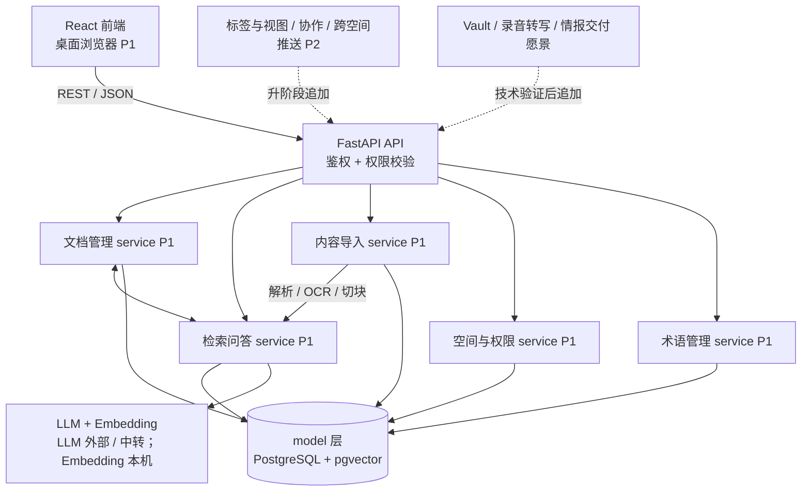
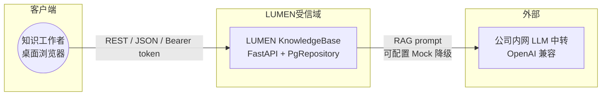
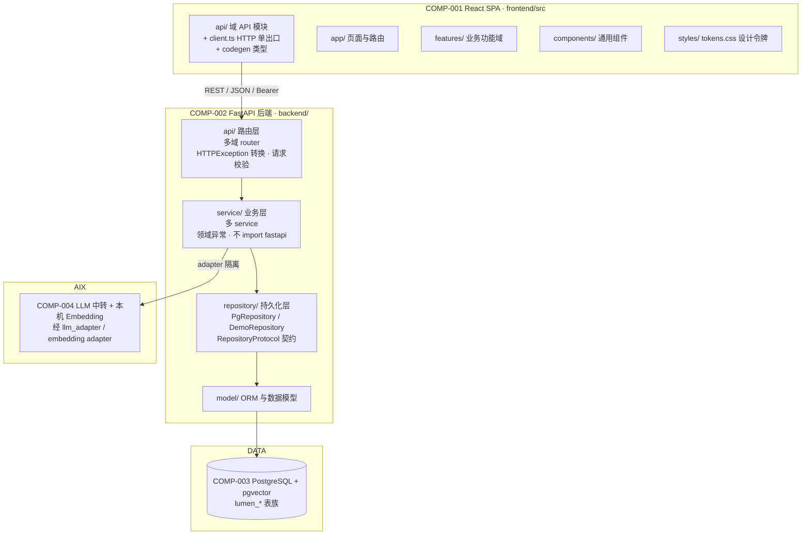
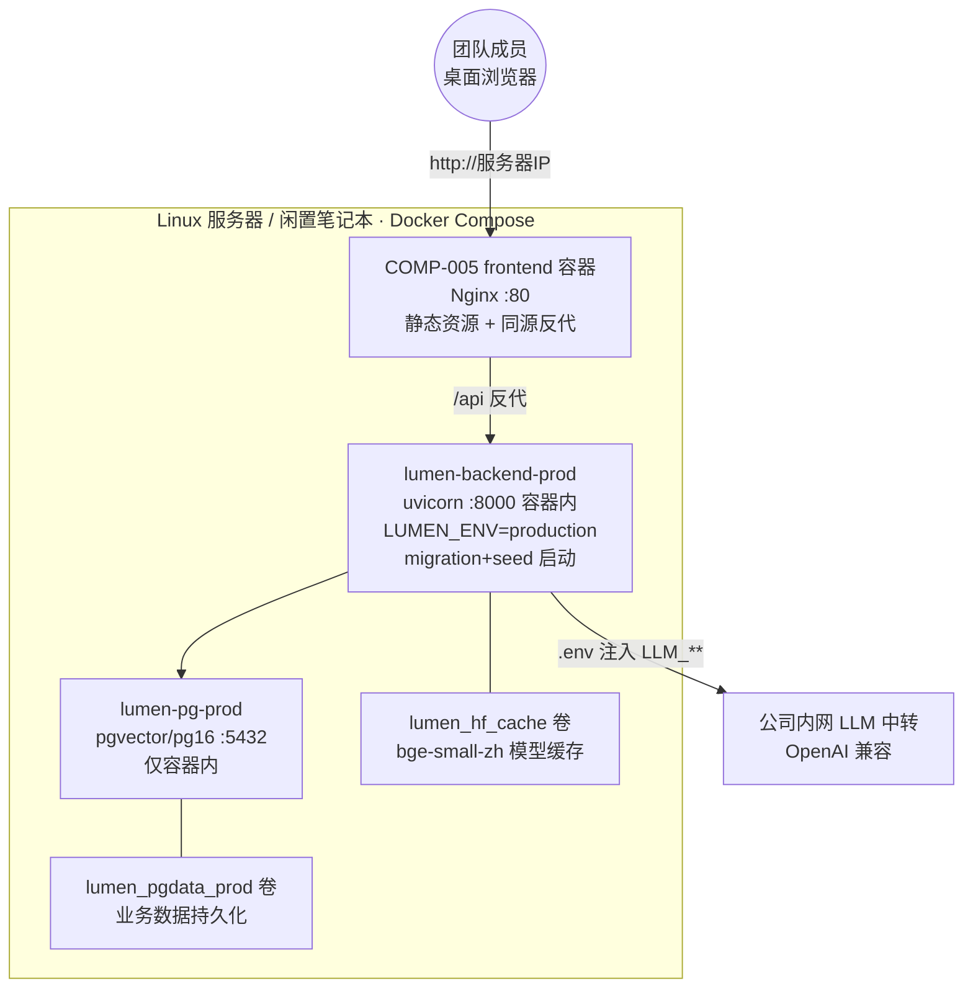
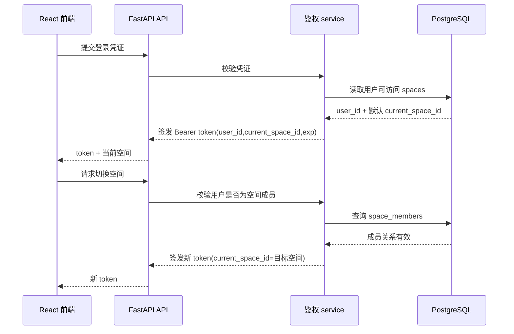
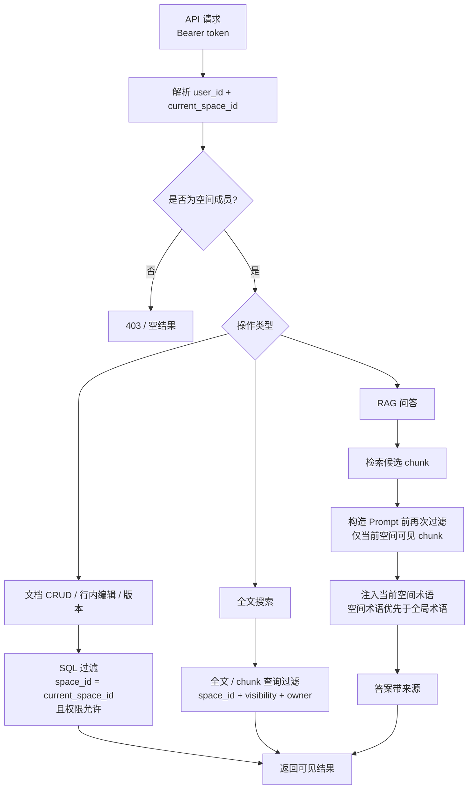
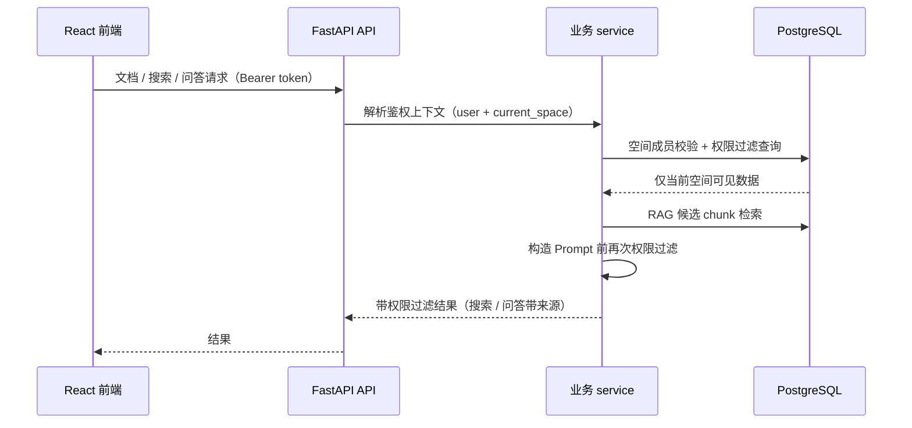
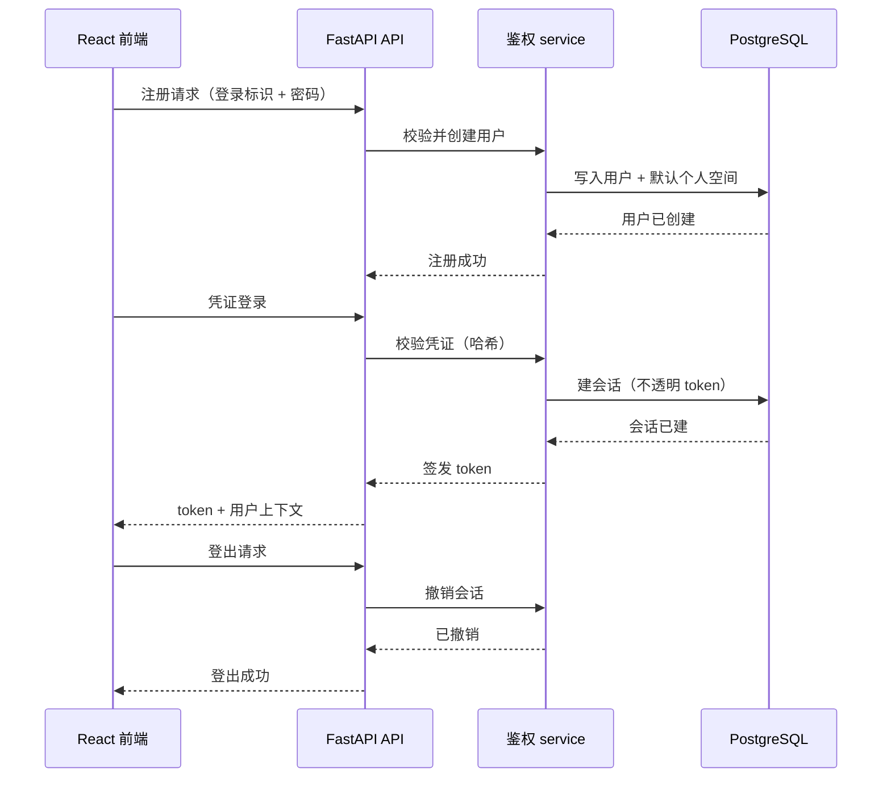

# 04 系统架构

> 按「完整骨架 + 阶段增量」演进（global-rules §8）。本文件铺出**完整愿景**的总体框架；
> 各子系统内部详细逻辑见 `docs/design/`；数据见 06；接口见 07。
> 子系统 / 模块均带阶段标签与状态。

## 0. 文档元信息

| 项 | 内容 |
|---|---|
| 输入来源 | `docs/00-scenario.md`、`docs/01-user-requirements.md`、`docs/02-srs.md`、`docs/03-prd.md`、`docs/env/local-env.md`、`ai/project-rules.md`、`docs/research/2026-07-15-overall-design-04-05-audit.md`、`docs/decisions/ADR-010-db-authority-derived-data-rebuildability.md` |
| 覆盖功能 / REQ | Phase1：REQ-001..REQ-011、REQ-036；Phase1.5A：REQ-037/038；Phase1.5B：REQ-027；Phase2A：REQ-012/025/026；Phase2B / 后续 / 愿景保留架构骨架 |
| 当前状态 | 目标架构基线已定，Phase1→Phase2D 各阶段架构事实均已实现并随代码反向同步（逐模块实现状态见 §2、验证见 `docs/09-verification.md`）；仍降级 / 候选：真实 Word/PDF 解析、OCR 与愿景能力；生产部署拓扑（⑪ 方案 A）已落盘（v3.5.0，见 §4） |
| 最后更新 | 2026-08-17（模板对齐调整：§0 当前状态精简、新增 §0.2 需求概述 + §5.7-5.10 接口 / 数据结构 / 安全 / 维护设计概述；同日完成 OO 方法论收敛 §5.1/§5.4/§1.3/§1.2.1/ADR-006 + 新增 §5.5/§5.6；无架构决策变更）；前次 2026-08-04（Sprint-18 PDF 导出产品闭环） |

### 0.1 架构目标与约束

| 维度 | 内容 |
|---|---|
| 当前 Phase | **Phase2D（账户与多人权限）已完成（2026-08-07 收口：Sprint-26/27/28 全部验收通过）**；Phase2C（本地知识源接入）已完成（2026-08-06）；Phase2B（团队 MVP）已完成（2026-08-05 收口）；Phase1 Demo + Phase1.5A + Phase2A（个人知识组织）已完成，见 `ai/project-rules.md` §1 |
| 交付物形态 | Demo / 个人可用 Alpha / 个人知识组织：Phase1 保证核心价值可演示；Phase1.5A 已解决批量入库与导出备份；Phase2A 已补标签、内链 / 反链、快速录入；Phase1.5B / Phase2B 后续确认；全程保留产品红线（库外问答回复"未找到"、不编造） |
| 运行环境 | 本机单机 Demo（React + FastAPI + Docker PostgreSQL+pgvector + 本机 Embedding + 内网 LLM 中转），详见 §4 |
| 项目形态裁剪 | Full 剖面；`06/07` 保留（持久化 + 对外 REST），见 `ai/project-rules.md` §3 |
| 禁止项 | 独立向量库、闭源 LLM SDK 绑定、移动端、实时协作、跨文档因果推理等；权威源 `ai/project-rules.md` §1 / §2、`docs/05-tech-spec.md` §3 |
| 权威源 | 阶段边界 = `ai/project-rules.md` §1；技术禁令 = §2 / `05 §3`；运行环境 = `docs/env/local-env.md` |
| 下游影响 | `05` 技术栈 / readiness gate；`06/07` 数据 / 接口边界；`docs/design/*` 模块详细设计；`08/09` Sprint / 验收路径 |

### 0.2 需求概述

> 罗列系统向用户提供的主要功能（层次化组织，对照概要设计说明书模板「任务概述·需求概述」）。功能全量用例视图见 `docs/00-scenario.md` §3.4（DIAG-UC-01）；功能范围 / 阶段路线图见 `docs/03-prd.md` §3；系统需求逐条见 `docs/02-srs.md` §1。

- **账户与权限域**：登录 / 注册 / 登出会话、空间隔离与切换、文档权限分级 + owner 过滤、角色分层 + 用户管理、团队空间加入。
- **文档管理域**：文档 CRUD + 行内编辑 + 版本、文档目录树。
- **检索问答域**：全文 / 语义搜索、RAG 问答（带来源）。
- **内容导入 / 导出域**：多格式导入（降级口径）、导出 `.md` / ZIP / PDF。
- **术语管理域**：空间术语维护、术语领域树。
- **个人知识组织域**：标签视图、快速录入、内链 / 反链。
- **本地知识源域**：Vault 挂载 / 本地编辑（仅本地挂载）。
- **写作与团队增强域**：AI 润色 + 写作引用、主题时间线 / 密度热条。
- **愿景能力**（技术验证后）：多人协作 / 跨空间推送 / 移动端、情报分析 / 情报交付。

## 1. 整体架构图（DIAG-ARCH-01）

> 注：上图承载 Phase1 Demo 基线，并已叠加 Phase1.5A 导入 / 导出与 Phase2A 个人知识组织能力。Sprint-8 后 `db` 节点已由 PostgreSQL+pgvector / `PgRepository` 承载，`ai` 节点已接入 GLM LLM 与本机 `bge-small-zh` Embedding；`ingestion` 的真实 Word/PDF 解析与 OCR 仍降级（仅 `.md`/`.txt` 已提取文本）。逐模块实现状态见 §2，技术门禁见 `docs/05-tech-spec.md §5.1`。
>
> **当前态（2026-08-17）**：图中虚线「P2 追加」内容大部分已实现——Phase2A（标签 / 内链 / 反链 / 快速录入）、Phase2B（AI 润色 / 时间线 / 目录树）、Phase2C（Vault 模式 B 仅本地挂载）、Phase2D（账户与多人权限，新增 `auth` / `users` / `admin` / `space_members` API 域，见 MOD-011）均已收口（2026-08-05~07）；维护态批1-30（2026-08-08~13）完成工程治理与增强。虚线保留作演进痕迹，**未实现项仅剩愿景层**（Vault 服务端增强、录音转写、飞书同步、情报分析 / 交付）及明确候选（REQ-016 多人实时协作、移除用户 / 邀请码、真实 Word/PDF 解析、OCR、zhparser）。运行形态已扩展至生产部署（§4）。

### 1.1 系统上下文图（信任边界 · DIAG-ARCH-01a）

> 标外部参与者 / 系统与信任边界（对照 `ai/doc-standards/04-architecture.md` §3 系统上下文检查表）。明确哪些外部系统是真实 / Mock / 候选 / 默认关闭。

- **外部系统状态**：公司内网 LLM 中转 = **已接入**（GLM `glm-5.2`，RG-004 Go；可配置 Mock 降级）；飞书同步 / Vault 挂载 = 愿景候选（未实现）。
- **数据外发边界**：跨 LUMEN 受信域 → 外部 LLM 为唯一数据外发点。RAG 问答 / 术语注入（Phase1 起）与 Phase2B AI 润色（REQ-014）均可能发往内网 LLM；**Phase2B AI 润色数据外发风险已人工接受（2026-07-30）：允许真实文档片段外发，护栏见 `ai/project-rules.md §2.1` 与 `docs/05-tech-spec.md` RG-008**（sources 权限过滤、草稿只存 hash + 摘要、不做敏感字段自动过滤、5030 降级）；非润色场景仍优先避免批量外发。Embedding 本机运行，不外发。
- **输入 / 输出**：输入 = 用户 REST 请求（Bearer token，文档 / 搜索 / 问答 / 术语操作）；输出 = JSON 结果（可见范围内的文档、检索结果、带来源 RAG 答案）。跨受信域输出仅 LLM Prompt 片段（见上）。

### 1.2 容器 / 组件视图

| COMP-ID | 组件 / 进程 | 职责 | 部署位置 | 通信方式 | 阶段 | 状态 | 关联 REQ |
|---|---|---|---|---|---|---|---|
| COMP-001 | React 前端 SPA | 桌面浏览器 UI（文档 / 搜索 / 问答 / 术语） | 浏览器 | REST / JSON | [P1] | P1-已实现（代码原型 + smoke） | REQ-011、004~008、036 |
| COMP-002 | FastAPI 后端（api / service / repository / model 四层） | REST API、权限校验、业务逻辑、持久化 | 本机单进程（开发 / Demo）；容器（生产） | HTTP | [P1] | 已实现（PG 仓储 `PgRepository`，Sprint-8；repository 独立成层见 project-rules §5.1） | 全 P1 |
| COMP-003 | 数据存储 | PostgreSQL + pgvector | Docker Compose（lumen-pg:pg16；生产 lumen-pg-prod） | SQL + pgvector | [P1] | 已接入（Sprint-8；RG-001 Go） | REQ-003~010、036 |
| COMP-004 | AI 服务 | LLM 中转（GLM）+ 本机 Embedding（bge-small-zh） | 本机 + 内网 | OpenAI 兼容 API | [P1] | 已接入（Sprint-7/8；RG-002/004 Go） | REQ-008、036 |
| COMP-005 | Nginx 反向代理（生产） | 前端静态资源 + `/api` 同源反代到 backend（无跨域） | 生产前端容器内 | HTTP 反代 | [P2] | 已落盘（v3.5.0 ⑪ 方案 A；生产专用，本地形态不启用） | 全部浏览器访问 |

### 1.2.1 分层架构视图（DIAG-ARCH-01b）

> 补齐 COMP（4+1 个部署单元）与 MOD（功能模块）之间的分层结构：浏览器 SPA → 后端四层 → 存储 / 外部 AI。目录边界权威源 = `ai/project-rules.md` §4 / §5.1 与 `docs/05-tech-spec.md` §4.1；本图承载结构事实，不展开业务逻辑。

| 层 | 职责 | 关键约束（权威源 project-rules §5.1） |
|---|---|---|
| 前端 `api/` + `client.ts` | 后端调用唯一出口；域模块 → barrel 追加 `export *` | 禁绕过 client.ts 直接 fetch |
| 后端 `api/` | 对外接口唯入口；web 适配（Depends / HTTPException）只在此层 | service 不得 import fastapi |
| 后端 `service/` | 业务逻辑 + 领域异常；读可直连 repository，写必经 service | 错误码业务语义（4001/4030/5030…） |
| 后端 `repository/` | 持久化抽象；PG / Demo 双实现共享 RepositoryProtocol 契约 | 多实现机器可检契约（CQ-P1-002） |
| 后端 `model/` | ORM 模型与迁移映射 | 表契约权威在 `docs/06-db-design.md` |

### 1.3 Web App Structure Profile / Walking Skeleton Gate（Batch A 回填）

> 对照 `template-docs/web-fullstack-profile.md`。本项目同时启用 `frontend/` 与 `backend/`，存在前端调用后端 API，且交付物需要浏览器点击演示；因此采用轻量 WSG 矩阵。**显性豁免声明（2026-07-15 校准）**：Phase1 业务 Sprint（1~10）在 WSG 落地前已完成，既有 `App.tsx` / `styles.css` 单文件膨胀与仓储单例 hack 作为 Demo 框架豁免 Sprint 0；经框架评估（见 `docs/research/2026-07-15-system-completion-audit.md` §四 / §五），决定插入 `docs/08-dev-plan.md` **Sprint-0′ 框架补课**（P1.5 前置）主动对齐 WSG-002 / WSG-004，P1.5 / Phase2 起强制遵守目录边界与文件阈值。WSG 矩阵不再仅作 Phase2 门禁。

| WSG-ID | Gate | 当前架构事实 | 证据 / 锚点 | P1.5A / Phase2A/B 实现前要求 |
|---|---|---|---|---|
| WSG-001 | App Shell | P1B 已形成 TopBar + Nav Rail + Context Pane + Workspace 三层工作台；P1.5A 默认沿用该 Shell，不新增一级导航泛滥 | `docs/design/frontend-workspace-redesign.md`、`docs/design/frontend-interaction.md` §9.3 | Sprint-16/17 仅在现有导入区、详情页和工具栏增加入口；若调整 Shell，先回填 `frontend-interaction` |
| WSG-002 | 目录边界 | 当前前端已向轻量分层收敛；后端已分 `api / service / model`，P1.5A 起新增 API client / state hooks 需遵守拆分边界 | `docs/05-tech-spec.md` §4.1、`docs/08-dev-plan.md` Sprint-0′ | Sprint-16/17 不得把批量导入 / 导出逻辑堆回 `App.tsx`；新增 API 只进 `api` 层，业务逻辑进 service |
| WSG-003 | Vertical Slice | P1 已有登录、文档、搜索、问答、术语多条前端 → API → service → PG / LLM → smoke 纵切；P1.5A 首个纵切为批量导入，其次导出备份 | Sprint-9/10 smoke、`docs/09-verification.md` §5、TC-P1-015/016 | 先完成 REQ-037/038 两条最小纵切；Phase2A 再选 REQ-026 / 012 / 025，不一次实现全部 P2 UI |
| WSG-004 | 文件膨胀阈值 | P1B 已做轻量组件与 CSS token 分层；P1.5A 起继续堆主入口 / 全局 CSS 前需先拆分 | `docs/05-tech-spec.md` §4.1 | 主应用、页面、CSS、service、测试文件超阈值即拆分；批量结果列表 / 导出按钮优先做 feature / component |
| WSG-005 | 验证入口 | P1A/P1B 已有 `npm.cmd run build` + Chrome / Edge 900px smoke；P1.5A 需补 TC-P1-015/016 的后端 tests + Chrome smoke | `docs/08-dev-plan.md`、`docs/09-verification.md` | Sprint-16/17 完成后写入 TC-P1-015/016 证据；P2 UI smoke 仍须另跑 TC-P2-WSG-001 与 TC-P2-UI-001..005 |
| WSG-006 | UI 链路对齐 | UI inputs → reference analysis → prototype → experience brief → frontend-interaction → 08/09 草案已闭合为候选链 | `docs/design/frontend-experience-brief.md`、`docs/design/frontend-interaction.md` | P1.5A 仅复用现有导入 / 文档详情 / 工具栏模式；Phase2A/B 候选体验未确认前不编码 |

## 2. 子系统 / 模块划分（完整框架）

| MOD-ID | 子系统 | 职责 | 输入 → 输出 | 边界（不负责） | 关联组件 | 阶段 | 设计状态 | 实现状态（Phase1 Demo） | 详细设计 |
|---|---|---|---|---|---|---|---|---|---|
| MOD-001 | 空间与权限 | 多空间隔离、权限分级、查询时过滤 | 用户 / 空间成员关系 → 过滤后可见数据 | 不负责文档内容解析 | COMP-002 / 003 | [P1] | P1-已实现 | PostgreSQL 成员 / 文档权限过滤已接入；内存 `DemoRepository` 仅作单测 fake | docs/design/permissions.md |
| MOD-002 | 文档管理 | CRUD、行内编辑、版本历史 | 文档字段 → 持久化文档 / 版本 | 不负责检索 / 导入 | COMP-002 / 003 | [P1] | P1-已实现 | PostgreSQL 文档 / 版本持久化已接入 | （逻辑简单，见 06/07） |
| MOD-003 | 内容导入 | `.md` / `.txt` 单文件与批量 / 文件夹导入、切块入库；真实 Word/PDF 解析、OCR 留后续 | 文件 / 文件夹 → 文档 + 切块 + 逐条导入结果 | 不负责检索 / 问答；不在 P1.5A 建真实目录表 | COMP-001 / 002 / 003 / 004 | [P1] | P1.5A-已实现 | `.md`/`.txt` 已提取文本导入 + 切块入 PG；批量 / 文件夹导入已随 Sprint-16 完成；真实 Word/PDF/OCR 仍降级（RG-003） | docs/design/ingestion.md |
| MOD-004 | 检索问答 | 全文搜索、RAG（向量+全文+引用） | 查询 → 结果 + 来源 | 不负责导入解析 | COMP-002 / 003 / 004 | [P1] | P1-条件通过（hybrid search + RAG） | search=substring + `ts_vector` SQL 候选 + pgvector 语义召回；RAG=关键词 + pgvector 向量召回 + GLM LLM | docs/design/rag-retrieval.md、docs/design/ai-assistant.md |
| MOD-005 | 术语管理 | 空间级术语表、文档术语识别、问答口径对齐 | 术语 → 口径注入 | 不负责问答生成 | COMP-002 / 003 / 004 | [P1] | P1-已实现 | PostgreSQL 术语存储已接入；术语定义已注入真实 LLM Prompt | docs/design/term-management.md |
| MOD-006 | 个人知识组织 | 标签体系、内部链接 + 反向链接、快速录入索引条目；时间轴 / 关联图留 Phase2B / 后续 | 文档 + 标签 / `[[文件名]]` / 轻量条目 → 标签聚合视图、反向链接索引、可检索条目 | 不负责文档内容生成 / 问答；不负责团队协作 | COMP-001 / 002 / 003 | [P2] | P2-已实现（TC-P2-LINK/TAG/QUICK-001 通过） | — | docs/design/frontend-interaction.md、docs/design/folder-tree.md、docs/design/timeline.md |
| MOD-007 | 导出交付与写作增强（协作 / 推送延后） | 单文档 `.md` 下载、空间 ZIP 导出备份、单文档 PDF；Phase2B AI 润色 + 写作引用 | 文档 / 空间 → `.md` / ZIP / PDF；选中文本 / 写作上下文 → 润色建议 + 引用块 | 不负责实时协作（延后）、不负责检索 / 问答；P1.5A 不做 PDF | COMP-001 / 002 / 003 / 004（润色走 LLM） | [P1] / [P2] | P1.5A-已实现；P1.5B PDF 已实现；Phase2B AI 已实现 | `.md` / ZIP 已随 Sprint-17 完成；PDF 已随 Sprint-18 完成；AI 润色已闭环 | docs/design/export-delivery.md；docs/design/ai-polish.md |
| MOD-008 | 存量接入 | Vault 兼容（导入数据库 / 仅本地挂载）、录音转写、飞书同步 | 本地文件夹 / 外部源 → LUMEN 文档或个人本地来源 | 不把仅本地挂载内容默认写入团队知识库；不绕过文档权限进入共享 RAG | COMP-001 / 002 / 003 / 004 | [P2]（Vault REQ-018 模式 B）/ [愿景]（录音/飞书） | Vault 模式 B Phase2C·已设计（RG-009 Go）；录音转写 / 飞书同步仍愿景 | DB 为正式知识库权威；本地挂载为个人连接器 | docs/design/ingestion.md（Flow-D-014）+ docs/design/frontend-interaction.md §9.3（CMP-P2-TREE） |
| MOD-009 | 情报分析（i2 精神） | 关联图↔时间轴联动、路径推理、人物网络、矛盾检测、证据地图、信号追踪 | — | — | — | [愿景] | 骨架 | — | docs/design/intelligence-analysis.md |
| MOD-010 | 情报交付 | 对外只读简报、管理层摘要、分析包 A Kit | — | — | — | [愿景] | 骨架 | — | 待技术验证 |
| MOD-011 | 账户与认证（多人权限） | 真实多用户账号（注册 / 凭证登录 / 登出会话）、owner 过滤与跨用户隔离、全局角色 admin/member、admin 用户管理、space 域成员 CRUD、忘记密码自助重置（token 写日志降级） | 注册 / 凭证 / 会话 → 认证上下文 + 用户 / 成员治理能力 | 不负责 REQ-016 多人实时协作、邀请码 / 移除用户（候选）；不负责空间内文档权限规则本体（属 MOD-001） | COMP-001 / 002 / 003 | [P2] | Phase2D·已实现（2026-08-07 三 slice 收口） | 统一鉴权；demo 模式 env 开关 + 物理隔离护栏（PG 仓储强制真实认证） | docs/design/accounts-auth.md |

## 3. 架构决策与取舍（ADR）

> 与 05 互补：这里讲"为什么"，05 讲"具体版本"。决策状态用 §7.1 横切状态词典；决策已采纳但实现未接入的，状态标「已确认（目标）」。

- **PostgreSQL + pgvector**：关系数据与向量检索一体，Phase1 少引一个独立向量库（Milvus/Qdrant），降低部署与一致性成本。
- **DB 权威运行态 + 衍生数据可重建**：LUMEN 不采用 `.md` / frontmatter 唯一权威模型；DB 承载运行态业务事实，chunks / embedding / 反链索引 / 计数等派生数据必须可从权威文档内容与元数据重建（见 `docs/decisions/ADR-010-db-authority-derived-data-rebuildability.md`）。
- **AI 调用边界**：LLM 不绑单一闭源 SDK，走 OpenAI 兼容接口；Embedding Phase1 本机运行 `bge-small-zh`（512 维），通过 adapter 保留迁移到内网 Embedding 服务的空间。
- **导入流水线收敛异构格式**：Word / PDF / 图片统一走"提取纯文本 → 切块 → Embedding"，检索侧只面对一种数据形态。
- **权限下沉到 SQL / 检索层**：空间隔离 + 文档权限在数据查询时过滤，不依赖应用层记忆，防漏过滤。
- **子系统拆分**：RAG / 导入 / 权限各自非平凡且可独立演进，单独成 docs/design/；文档 CRUD 简单，不单列。

### 3.1 ADR 矩阵

| ADR | 决策 | 状态 | 适用 Phase | 理由 | 替代方案 | 取舍影响 | 验证方式 |
|---|---|---|---|---|---|---|---|
| ADR-001 | PostgreSQL + pgvector 一体化存储 | 已接入（Sprint-8；RG-001 Go） | Phase1+ | 关系数据与向量检索一体，少引独立向量库，降部署与一致性成本 | Milvus / Qdrant 独立向量库 | 少一个组件、一致性成本低；强依赖 pgvector 扩展与 Docker | 已落地（lumen-pg + PgRepository + 向量召回） |
| ADR-002 | AI 走 OpenAI 兼容接口 + 本机 Embedding | 已接入（Sprint-7/8；RG-002/004 Go） | Phase1+ | LLM 不绑单一闭源 SDK；Embedding 本机运行并保留迁内网服务空间 | 绑定单一闭源 LLM SDK | 厂商解耦、可迁内网；需 adapter 适配 | LLM=GLM 中转、Embedding=bge-small-zh |
| ADR-003 | 导入流水线收敛异构格式为文本→切块→Embedding | 已确认（目标；当前仅 `.md`/`.txt`） | Phase1+ | 检索侧只面对一种数据形态，解析复杂度集中于导入 | 各格式独立检索路径 | 检索侧统一数据形态；解析复杂度集中于导入 | TC-P1-009 / 010（09 §2） |
| ADR-004 | 权限下沉到 SQL / 检索层（查询时过滤） | 已确认（当前内存等价实现） | Phase1+ | 空间隔离 + 文档权限在查询时过滤，不依赖应用层记忆，防漏过滤 | 应用层记忆当前空间 | 防漏过滤、安全边界强；强依赖查询层正确性 | TC-P1-001 / 003（09 §2） |
| ADR-005 | RAG / 导入 / 权限独立成 docs/design/ | 已确认 | Phase1+ | 三者非平凡且可独立演进，单列详细设计便于维护 | 全部并入 04 | 子系统可独立演进；多份详细设计需维护 | `docs/design/*` 已存在 |
| ADR-006 | Phase1.5B PDF 导出方案 | 已采用 / 已实现 | Phase1.5B | 单文档需可排版导出 PDF（REQ-027），但不得阻塞个人可用 Alpha | WeasyPrint / 浏览器打印 | ReportLab 在 Windows + Python 3.14 下依赖链轻；已实现权限校验、版本绑定、失败态 5030 与受控 artifact 下载闭环 | RG-006 Go + TC-P1-017 通过（2026-08-04） |
| ADR-007 | 标签 + 反向链接索引用 PG 关系表 + `[[wikilink]]` 解析 | 已采用 / 已实现 | Phase2A | 复用现有 PG，少引图数据库（REQ-012 / 026） | 图数据库 / 全文索引 | 关系表 JOIN 成本；解析规则已按 Phase2A 最小版收敛 | TC-P2-TAG-001 / TC-P2-LINK-001 通过 |
| ADR-008 | Phase1.5A `.md` / ZIP 导出备份走标准文件流 | 已实现 | Phase1.5A | 个人可用 Alpha 需要可迁出、可备份；标准库 ZIP 风险低、不引重依赖（REQ-038 / U-43） | 直接做 PDF / 数据库整库导出 | 快速落地且权限边界简单；不保留富格式排版 | TC-P1-016 通过 |
| ADR-009 | Phase1.5A 批量 / 文件夹导入以标题相对路径保留目录感 | 已实现 | Phase1.5A | 用户要快速放入一批资料；不建真实目录表可避免 DB 迁移与范围扩张（REQ-037 / SC-007） | 新增 folder 表与真实目录树 | 低风险、快落地；后续若做真实目录需迁移 | TC-P1-015 通过 |
| ADR-011 | Vault 兼容采用“数据库权威 + 个人本地连接器”双模式 | 已确认（RG-009 PoC Go 2026-08-05）/ 浏览器路线采纳 | [P2] | LUMEN 的搜索 / RAG / 权限 / 版本能力依赖 PostgreSQL + chunks；用户也需要低摩擦查看 Obsidian vault | 把本地文件夹直接当团队知识库唯一源；或强制全部导入 DB | 导入数据库获得完整知识库能力；仅本地挂载保留个人 / 当前设备边界；Phase2C 浏览器 File System Access + IndexedDB 已验证（句柄持久化 + 刷新恢复 granted） | REQ-018；RG-009 Go / TC-P2-VAULT-001 |
| ADR-010 | DB 权威运行态 + 衍生数据可重建 | 已接受 | Phase1+ | 保留 PostgreSQL 作为权限 / 版本 / 文档权威，同时要求 chunks / embedding / 反链索引 / 计数等派生数据可从权威内容与元数据重建 | `.md` / frontmatter 唯一权威；DB 全权威不设重建约束 | 避免多头权威并降低索引漂移 / 灾备风险；不声明已实现重建脚本 | `docs/decisions/ADR-010-db-authority-derived-data-rebuildability.md`；06 §1.1 |

## 4. 运行形态与部署拓扑

> 受 `ai/project-rules.md` §2.1 与 `docs/env/local-env.md` 约束。系统支持三种运行形态：**本地开发**（日常编码 / 测试）、**本机 Demo**（单机演示 / 个人使用）、**生产部署**（团队多人访问，⑪ 方案 A 全容器化，v3.5.0 落盘）。操作步骤（clone / .env / 命令 / HTTPS 配置）见 `docs/env/deploy-guide.md` 与 `docs/env/local-demo-runbook.md`，本节只承载架构拓扑与约束。
>
> 历史口径（Phase1 时「暂不使用公司服务器」）已被 ⑪ 部署落地（2026-08-08，v3.5.0）取代；服务器资源预案（内网 Embedding / reranker）仍保留为触发式预案，见下。

### 4.1 三种运行形态对照

| 形态 | 进程 / 拓扑 | 端口 | 存储 / 登录 | 用途与约束 |
|---|---|---|---|---|
| 本地开发 | Vite dev server + `uvicorn` 后端直跑 + Docker `lumen-pg`（`docker/compose.yml`） | 前端 :5173 / 后端 :18000 / PG :15432（宿主映射） | PG `lumen` 库；demo 或凭证登录 | 日常编码、单测 / 集成测试、浏览器 smoke |
| 本机 Demo | `scripts/run-sprint16-demo.ps1`（内存）或同脚本 `-UsePostgres`（PG）+ Vite | 同上 | 内存（重启清空）/ `lumen-pg` 容器；alice 免密或凭证 | 单机演示、个人使用（详见 `local-demo-runbook.md`） |
| 生产部署（⑪ 方案 A） | **全容器化三服务**：`docker/docker-compose.prod.yml` 起 frontend（Nginx）+ backend + postgres，Nginx 同源反代 `/api` | 对外仅 :80（可改映射）；PG / backend 仅容器内 `expose`，不暴露宿主机 | `lumen_pgdata_prod` 卷；`LUMEN_ENV=production` 强制 PG 仓储 + 真实凭证（demo 免密 fail-fast） | 团队多人访问（内网服务器 / 闲置笔记本）；restart: unless-stopped；Embedding 模型缓存 `lumen_hf_cache` 卷 |

### 4.2 生产部署拓扑图（DIAG-ARCH-02）

拓扑要点：① 单入口 Nginx，浏览器只访问 :80，无跨域；② PG / backend 不暴露宿主机端口，缩小攻击面；③ 数据边界与外发口径不变（§1.1 信任边界对生产形态同样成立，唯一外发点仍是 LLM 中转）；④ 备份 = PG 数据卷（自动备份 job 未做，见 deploy-guide §7 遗留）。

### 4.3 通用约束（各形态共用）

- 数据边界：默认使用已标注的虚构 Demo 数据；允许按需导入部分真实团队文档，真实文档必须显式标注来源 / 敏感级别；RAG / 术语场景优先避免发送到外部模型，**Phase2B AI 润色（REQ-014）允许真实片段外发（风险已接受，见 §1.1 / `docs/05-tech-spec.md` RG-008）**。生产形态凭证 / 密钥经 `.env` 注入容器，不入 git。
- 资源边界：本机 Demo 峰值内存 < 8GB、显存 < 4GB、磁盘 < 20GB；生产底线 ≥ 8GB 内存 / ≥ 20GB 磁盘（torch CPU 镜像 ~2GB + 模型缓存）。允许安装项目所需依赖与镜像。
- 远程 / 公司服务器边界：生产部署已使用内网服务器 / 闲置笔记本（⑪ 方案 A）；若本机 / 服务器 Embedding 在导入规模、响应时间或检索质量上不够用，再申请内网 Embedding / reranker 服务（触发式预案，`docs/env/local-env.md`「服务器资源预案」）。
- 重资源项归属：禁止本机运行大参数 LLM / 大型 Embedding / reranker；`bge-small-zh` 本机 / 容器 CPU Embedding 属 Phase1 可接受范围。
- 部署遗留（未做，权威源 deploy-guide §7）：多节点 / 负载均衡、自动备份 job、邮件通道（REQ-051 忘记密码 token 写日志降级）、公网 HTTPS（内网 HTTP 可用）。

## 5. 关键流程与权限过滤

> 本节固定 Sprint-1 权限底座的架构边界：空间、文档权限、搜索和 RAG 必须共用同一套权限过滤原则，禁止仅在前端隐藏或仅靠业务层记忆当前空间。

### 5.1 登录与空间切换（Flow-001）

> **Flow-001 登录与空间切换**：成功（签发 token + 切换签新 token）｜异常（凭证无效 → 4001）｜权限拒绝（非空间成员切换 → 4003）｜降级（demo 模式无密码快速登录，env 开关 + 物理隔离护栏）｜关联 API-001/002/003（endpoint 契约见 07 §2）、TC-P1-001/002。

### 5.2 文档访问、搜索与 RAG 统一过滤（Flow-002）

> **Flow-002 文档访问 / 搜索 / RAG 统一过滤**：成功（成员校验 → 过滤 → 可见结果；RAG 走关键词 + pgvector 向量召回 + GLM LLM）｜异常（token 无效 → 4001）｜权限拒绝（非成员 → 403 / 空；私有文档对他人 → 空）｜降级（LLM 可切 Mock；search 向量化未启用）｜外部不可用（明确 Mock，不编造）｜关联 API-004~010、TC-P1-003~008。

### 5.3 权限实现原则

- **空间优先**：所有查询先限定 `current_space_id`，再判断文档级权限。
- **私有文档**：仅作者可见；不得进入同空间其他成员搜索结果、RAG 候选 chunk 或问答来源。
- **团队共享**：同空间成员可见；跨空间默认不可见。
- **外部只读**：Phase1 仅表达只读权限类型，不实现跨空间推送；跨空间推送属于 P2。
- **双层过滤**：SQL / 检索层必须过滤；RAG 构造 Prompt 前必须再次过滤候选 chunk。
- **前端不可作为权限边界**：前端隐藏入口只改善体验，不作为安全判断依据。

### 5.4 Phase1.5A/B 与 Phase2A/B 关键流程（骨架）

> Phase1.5A 批量 / 文件夹导入与 `.md` / ZIP 导出备份已闭合；Phase1.5B PDF 已随 Sprint-18 闭合；Phase2A 标签、内链 / 反链与快速录入已闭合。Phase2B 已完成 AI 润色 / 写作引用、主题时间线与文档目录树首批 slice；关联图等后续团队 MVP 候选待对应阶段再补详细设计。所有导出 / 检索 / 写作候选均沿用 Flow-002 权限过滤，不得以前端隐藏替代后端过滤。

- **Flow-003 标签浏览与内部链接跳转**（REQ-012 / 026，Phase2A）：按标签聚合 → 点击 `[[文件名]]` 跳转 / 反向链接面板；权限沿用 Flow-002 过滤。
- **Flow-004 快速录入索引条目**（REQ-025，Phase2A）：轻量条目（标题 / 来源 / 摘要）→ draft / 新文档 / 追加文档 → 索引入库参与检索；走 Flow-002 过滤。
- **Flow-005 AI 润色与写作引用**（REQ-014，Phase2B）：选中文本 → LLM 润色建议 / 检索引用块插入；复用 ADR-002 LLM adapter，候选 chunk 按权限过滤。
- **Flow-006 批量 / 文件夹导入**（REQ-037，Phase1.5A；REQ-039 扩展）：多文件 / 文件夹选择 → 逐文件读取 `.md` / `.txt` → 成功项入库并切块 → 逐条返回成功 / 失败 / 同名跳过结果；Phase1.5A 兼容标题保留相对路径前缀，Phase2B 导入保留真实目录结构（实现细节见 `docs/design/ingestion.md`）。
- **Flow-010 Vault 兼容来源**（REQ-018，Phase2C·已实现）：用户选择本地 vault / 文件夹 → 二选一：A 导入数据库（获得完整 LUMEN 权限 / 搜索 / RAG 能力，**模式 A 已随 Phase2B 交付**）；B 仅本地挂载（**模式 B Phase2C MVP·仅本地挂载**，内容留在本机，只在当前用户 / 当前设备左侧“本地挂载”分区可见，不默认进入团队空间、后端 RAG 或共享权限链）。实现细节见 `docs/design/ingestion.md` Flow-D-014 + `req-implementation-index`。
- **Flow-007 `.md` / ZIP 导出备份**（REQ-038，Phase1.5A）：单文档详情 → 下载当前版本 `.md`；空间工具栏 → 查询当前用户可见文档 → 打包 `.md` → 下载；不可见文档不进入 ZIP。
- **Flow-008 单文档导出 PDF**（REQ-027，Phase1.5B）：文档版本 → 创建导出任务 → 生成 PDF → 返回导出任务结果；导出前受文档权限约束，导出依赖不可用时返回 5030，不生成坏文件。实现细节见 `docs/design/export-delivery.md`。
- **Flow-009 主题时间线 / 密度热条**（REQ-013a / REQ-024，Phase2B）：文档时间字段 / 标签 / 链接 / 关键词命中 → 实时聚合时间线与密度提示；关联图 REQ-013b 仅保留骨架，留后续。实现细节见 `docs/design/timeline.md`。

### 5.5 出错处理与权限拒绝设计

> 概要层错误处理原则（对照 `docs/references/软件系统面向对象开发方法的过程要点及关系.md` 概要设计「出错处理设计」）。细颗粒错误码 / 请求响应契约权威在 `docs/07-api-spec.md` §3.4 / §3.5，本节只固化跨系统错误处理的总原则。

| 维度 | 原则 | 权威源 |
|---|---|---|
| 错误码分层 | service 抛领域异常（带业务码），api 层统一转 HTTP（`code` 业务码、`status_code` HTTP 码、`msg` 固定用户文案），禁 `str(exc)` 直传泄露内部细节 | `05 §4.2.1`、`07 §3.4` |
| 错误码族 | 4001 认证失败 / 4003 权限拒绝 / 4030 管理权限不足 / 4090 冲突 / 5030 依赖不可用；错误码单一含义，不与 HTTP 码混用 | `07 §1` / `05 §4.2` |
| 权限拒绝语义 | 无权限访问返回 403 / 空结果，且不泄露标题、摘要与问答引用（私有文档对他人搜索 / RAG 零命中） | Flow-002、`02` EX-001 |
| 外部不可用 / 降级 | LLM / 导出依赖不可用时返回 5030 或明确 Mock 降级，不编造、不生成坏文件；库外问答明确「未找到」 | REQ-008、RG-003/004/006 |
| 鉴权强制 | 权限必须由后端 API / service / DB 查询过滤执行；前端隐藏 / 禁用 / 路由守卫不是权限边界 | `document-lifecycle-rules §5.2` |

### 5.6 概要级交互图（DIAG-ARCH-SEQ-01 / 02）

> 概要设计层交互图：以「角色 / 子系统 → 子系统」消息级表达核心用例的交互（不写具体 endpoint 路径，接口契约见 07）。图 ID 规范：`DIAG-ARCH-SEQ-NN`（对照 `document-lifecycle-rules §13`）。

**DIAG-ARCH-SEQ-01 · Flow-002 文档访问 / 搜索 / RAG 统一过滤**

**DIAG-ARCH-SEQ-02 · Phase2D 认证升级（注册 / 凭证登录 / 登出）**

### 5.7 接口设计概述

> 概要级接口边界（对照概要设计说明书模板「接口设计」）。详细契约权威在 `docs/07-api-spec.md`（接口清单 / endpoint contract / 错误码 / 权限），本节只给外部 / 内部接口的域划分与职责。

| 接口域 | 职责 | 权威 |
|---|---|---|
| auth / users / admin / space_members | 账户认证、用户管理、成员治理 | `07` auth / admin / space 域 |
| documents / versions / folders | 文档 CRUD、版本、目录树 | `07` 文档域 |
| search / chat | 检索、RAG 问答 | `07` 检索域 |
| import / export / pdf | 导入、导出 | `07` 导入导出域 |
| terms | 术语管理 | `07` 术语域 |
| tags / links / quick-entries / timeline | 个人知识组织 | `07` 组织域 |
| vault | 本地挂载 | `07` vault 域 |

- **外部接口 · 用户界面**：桌面浏览器工作台（Chrome / Edge），交互入口见 `docs/00-scenario.md` §3.4 用例图（DIAG-UC-01）；细颗粒页面流 / 状态 / 组件职责见 `docs/design/frontend-interaction.md`。
- **外部接口 · 软件接口**：REST / JSON + Bearer token（浏览器 ↔ FastAPI）；外部 LLM 中转（OpenAI 兼容，`05 §2.1`）。
- **外部接口 · 硬件接口**：无特殊外设依赖。
- **内部接口**：前端 `api/` + `client.ts` 单出口 → 后端 api 层 → service → repository → DB（分层约束见 §1.2.1）。

### 5.8 系统数据结构设计概述

> 概要级数据结构（对照概要设计说明书模板「系统数据结构设计」）。概念模型 / 类图见 `docs/06-db-design.md` §0.5（DIAG-DOM-01），物理表 / 字段 / 索引权威在 `docs/06-db-design.md` §1/§2，REQ → 表追溯见 `docs/06-db-design.md` §6。

- **逻辑结构**：核心实体 = 用户 / 空间 / 成员 / 文档 / 版本 / 切块 / 标签 / 链接 / 术语 / 快速录入 / 会话 / 文件夹 / 导出任务 / AI 草稿 / 挂载（详见 `06 §0.5` 概念模型）。
- **物理结构**：PostgreSQL + pgvector，表前缀 `lumen_`；检索双路（全文 + 向量）；数据安全与留存见 `06 §5`。

### 5.9 安全保密设计

> 概要级安全边界（对照概要设计说明书模板「安全保密设计」）。信任边界见 §1.1（DIAG-ARCH-01a）；细颗粒安全 / 隐私 / 合规见 `docs/05-tech-spec.md` §5.2；数据安全与留存见 `docs/06-db-design.md` §5。

- **信任边界**：浏览器 ↔ LUMEN 受信域 ↔ 外部 LLM 中转（唯一数据外发点，可配 Mock 降级）。
- **权限执行**：空间隔离 + 文档权限在 SQL / 检索层过滤，RAG 构造 Prompt 前二次过滤；前端隐藏 / 禁用不是权限边界（§5.3）。
- **凭证安全**：密码哈希存储、token 可撤销、登录失败锁定、管理接口仅 admin（细颗粒见 `05 §5.2`）。
- **数据外发**：RAG / 术语注入 / AI 润色可能发往内网 LLM；Phase2B 润色数据外发风险已人工接受（RG-008，护栏见 `05 §5.2`）。

### 5.10 维护设计

> 概要级可维护性（对照概要设计说明书模板「维护设计」）。运行 / 部署 / 备份遗留见 `docs/env/deploy-guide.md` §7；DB 权威 + 衍生数据可重建见 `docs/decisions/ADR-010-db-authority-derived-data-rebuildability.md`。

- **可维护性**：DB 权威运行态 + 衍生数据可重建（ADR-010）；代码分层与编码基线见 `05 §4`。
- **部署与备份**：生产部署（⑪ 方案 A）见 §4.2；自动备份 job / 多节点 / 公网 HTTPS 为遗留（`docs/env/deploy-guide.md` §7）。
- **版本演进**：文档按「完整骨架 + 阶段增量」只增不删（global-rules §8）。

## 6. REQ / 功能 → 模块 / Flow 追溯矩阵

> 补 MOD-ID / Flow-ID / 覆盖状态列（对照 `ai/doc-standards/04-architecture.md` §4 追溯链 `REQ/NFR → Phase → COMP-ID → MOD-ID → Flow-ID → design/API/DB/TC`）。COMP 见 §1.2，MOD 见 §2，Flow 见 §5。

| REQ | Phase | COMP-ID | MOD-ID | Flow-ID | 下游设计 | 覆盖状态 |
|---|---|---|---|---|---|---|
| REQ-001 / 002 / 003 | [P1] | COMP-002 / 003 | MOD-001（+ MOD-002 / 004） | Flow-001 / 002 | `docs/design/permissions.md`、`docs/06-db-design.md`、`docs/07-api-spec.md` | P1-已实现（PG 权限过滤） |
| REQ-004 / 005 / 006 | [P1] | COMP-001 / 002 / 003 | MOD-002 | Flow-002 | `docs/06-db-design.md`、`docs/07-api-spec.md` | P1-已实现（PG 文档 / 版本） |
| REQ-007 / 008 | [P1] | COMP-002 / 003 / 004 | MOD-004 | Flow-002 | `docs/design/rag-retrieval.md`、`docs/06-db-design.md`、`docs/07-api-spec.md` | P1-部分实现（search 关键词·PG；RAG 向量 + LLM） |
| REQ-009 / 010 | [P1] | COMP-002 / 003 / 004 | MOD-003（+ MOD-004） | Flow-002 | `docs/design/ingestion.md`、`docs/06-db-design.md`、`docs/07-api-spec.md` | P1-部分实现（`.md`/`.txt`；真实 PDF/OCR 后续） |
| REQ-011 | [P1] | COMP-001 / 002 | 全 P1 模块（横切） | Flow-001 / 002 | `docs/08-dev-plan.md` Sprint-6、`docs/09-verification.md` | P1-已实现（桌面 smoke） |
| REQ-036 | [P1] | COMP-002 / 003 / 004 | MOD-005（+ MOD-004 / 002） | Flow-002 | `docs/design/term-management.md`、`docs/06-db-design.md`、`docs/07-api-spec.md` | P1-已实现（PG 术语 + LLM 注入） |
| REQ-037 | [P1] | COMP-001 / 002 / 003 / 004 | MOD-003 | Flow-006 | `docs/08-dev-plan.md` Sprint-16、`docs/07-api-spec.md` API-029、`docs/09-verification.md` TC-P1-015 | Phase1.5A-已实现（TC-P1-015 通过） |
| REQ-038 | [P1] | COMP-001 / 002 / 003 | MOD-002 / 007 | Flow-007 | `docs/08-dev-plan.md` Sprint-17、`docs/07-api-spec.md` API-030、`docs/09-verification.md` TC-P1-016 | Phase1.5A-已实现（TC-P1-016 通过） |
| REQ-027 | [P1] | COMP-001 / 002 / 003 | MOD-007 | Flow-008 | ADR-006、`docs/08-dev-plan.md` Sprint-18、`docs/09-verification.md` TC-P1-017 | Phase1.5B-已实现（TC-P1-017 通过） |
| REQ-012 / 025 / 026 | [P2] | COMP-001 / 002 / 003 | MOD-006 | Flow-003 / 004 | 导航交互见 `docs/design/frontend-interaction.md` §3 | P2-已实现（TC-P2-LINK/TAG/QUICK-001 通过） |
| REQ-013 / REQ-024 | [P2] | COMP-001 / 002 / 003 | MOD-006 | Flow-009 | `docs/design/timeline.md`（Phase2B 建） | Phase2B 首批·第二 slice（紧随 REQ-014）；P2-已实现（TC-P2-TL-001 通过） |
| REQ-014 | [P2] | COMP-001 / 002 / 003 / 004 | MOD-007 | Flow-005 | `docs/design/ai-polish.md`（Phase2B 建） | Phase2B 首批核心·P2-已实现（MVP 级，TC-P2-AI-001 通过）；数据外发风险已接受（RG-008 Go） |
| REQ-015 / 016 / 017 | [P2] | — | MOD-007 | — | 后续 Phase 时细化 | 不进 Phase2B 首批 |
| REQ-018 | [P2] | COMP-001 / 002 / 003 / 004 | MOD-008 | Flow-010 | `docs/design/ingestion.md` Flow-D-014 + `docs/design/frontend-interaction.md` §9.3 | Phase2C·已设计（模式 B 浏览器，RG-009 Go）；模式 A 已随 Phase2B |
| REQ-019..023 / 028..035 | [愿景] | — | MOD-008 / 009 / 010 | — | 技术验证通过后细化 | 骨架 |
| REQ-039 | [P2] | COMP-001 / 002 / 003 | MOD-003（导入结构）+ MOD-002 | Flow-006（`preserve_structure` 扩展） | `docs/07-api-spec.md` API-034..038、`docs/08-dev-plan.md` Phase2B 第三 slice | Phase2B-已实现（TC-P2-FOLDER-001 通过；`lumen_folders` 嵌套树 + 前端文件管理器；folder 不独立设权限） |
| REQ-040 / 041 / 042 | [P2] | COMP-001 / 002 / 003 | MOD-011 | Flow-001（真实凭证化升级） | `docs/design/accounts-auth.md`、`docs/06-db-design.md`（migration 014）、`docs/07-api-spec.md` auth 域 | Phase2D-已实现（Sprint-26，TC-P2-AUTH-001 通过；bcrypt + `lumen_sessions` 不透明 token） |
| REQ-043 / 044 | [P2] | COMP-002 / 003 | MOD-011（+ MOD-001 权限过滤扩展） | Flow-002（owner 过滤升级） | `docs/design/accounts-auth.md` §17、TC-P2-ACC-001 | Phase2D-已实现（Sprint-27；owner_id 跨用户过滤 + 跨用户隔离回归） |
| REQ-045 / 046 / 047 | [P2] | COMP-001 / 002 / 003 | MOD-011 | Flow-001 / 002 | `docs/design/accounts-auth.md` §18、migration 016、TC-P2-ACC-002 | Phase2D-已实现（Sprint-28；admin/member 角色 + admin 用户管理 + space 域成员 CRUD） |
| REQ-048 | [P1] | COMP-001 / 002 / 003 | MOD-005 | Flow-002 | `docs/07-api-spec.md` API-051..053、TC-P2-TERM-001 | 维护态增强-已实现（2026-08-07，migration 017，术语领域树） |
| REQ-049 | [P2] | COMP-001 | MOD-008（模式 B 浏览器侧） | Flow-010 | `docs/design/ingestion.md` Flow-D-014、`docs/08-dev-plan.md` REQ-049 批次 | 维护态-已实现（2026-08-08；本地挂载可编辑，纯前端 FSA 写路径） |
| REQ-050 | [P2] | COMP-001 / 002 / 003 | MOD-011 | — | `docs/07-api-spec.md` API-054、TC-P2-ACC-003 | 维护态批5-已实现（2026-08-08，Sprint-30；admin 用户空间可见性） |
| REQ-051 | [P2] | COMP-001 / 002 / 003 | MOD-011 | Flow-001 | `docs/07-api-spec.md` API-055/056、migration 018、TC-P2-AUTH-002 | 维护态批5-已实现（2026-08-08；忘记密码自助重置，无 SMTP → token 写日志降级） |

## 7. 待人工确认项

- （2026-08-17 修订注记）本次为架构文档反向同步（分层视图 + 部署拓扑 + Phase2D / 维护态 REQ 回填），**未改变任何架构决策**；生产部署为已落盘事实（v3.5.0）回填，非新增候选。若后续部署形态演进（多节点 / 公网 HTTPS / 独立 Embedding 服务），须先修订本节 §4 与 `docs/env/deploy-guide.md`。
- Phase1.5A Sprint-16/17 已完成；若后续扩展真实目录表、长期导出产物或新依赖，必须先同步修订 `05/06/07/08/09` 与对应 design。
- Phase1.5B PDF 已通过 RG-006 并随 Sprint-18 完成 REQ-027 / API-019 / TC-P1-017；v1.7.0 已补 PDF 下载端点与前端下载闭环；后续若做异步导出、过期清理 job 或水印，须先同步修订 `05/06/07/08/09`。
- Phase2B 团队 MVP 候选（AI 润色 / 写作引用、时间轴候选）需重新确认范围、进入 / 退出标准、详细设计与 UI / WSG 门禁；Phase2A 已完成能力如需扩展，先同步修订 `06/07/08/09`。
