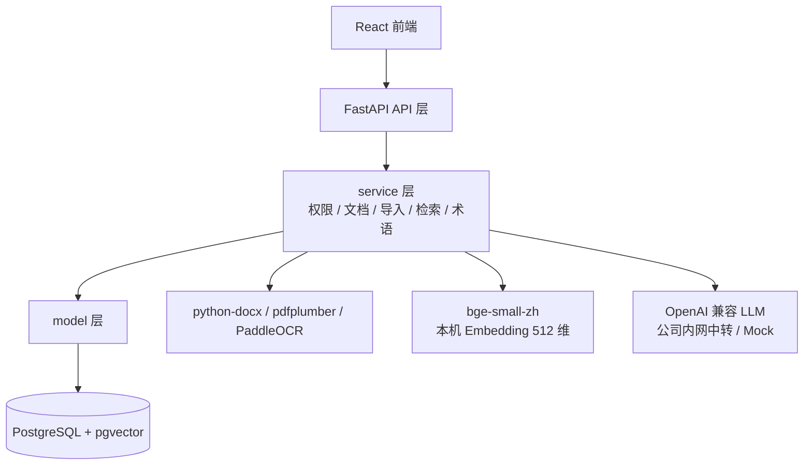

# 05 技术方案

> 技术栈版本与关键决策。"为什么"见 04，本文讲"具体版本与约束"。
> Phase 技术约束与 `ai/project-rules.md` §1 / §2 一致。

## 0. 文档元信息

| 项 | 内容 |
|---|---|
| 输入来源 | `docs/03-prd.md`、`docs/04-architecture.md`、`docs/env/local-env.md`、`ai/project-rules.md`、`docs/research/2026-07-15-overall-design-04-05-audit.md` |
| 覆盖架构组件 | FastAPI 后端、React 前端、PostgreSQL + pgvector、Embedding / LLM 适配、导入解析、导出备份、PDF 候选 |
| 当前状态 | 目标基线已定（Phase1 技术选型已钉死）。Sprint-7/8 + task-009 真实化后：**PostgreSQL+pgvector / Embedding / LLM 已接入，RAG 与 search 均可走向量召回**（RG-001/002/004 Go，见 §1「当前实现状态」列与 §5.1）；Phase1.5A 批量导入与 `.md` / ZIP 导出备份已完成；Phase1.5B PDF 导出已完成 API-019 / Sprint-18 产品实现；Phase2A 标签、反向链接与快速入口已完成；Phase2B 团队 MVP（REQ-014/013/024/039）、Phase2C 本地知识源接入（REQ-018）、Phase2D 账户与多人权限（Sprint-26/27/28）均已完成（见 `ai/project-rules.md` §1）。OCR / 真实 Word/PDF 文本提取与 zhparser 搜索增强仍需后续 RG / 选型；后续阶段实现期变更需先修订本文 |
| 最后更新 | 2026-08-04（Sprint-18 PDF 导出产品闭环：ReportLab + API-019 + TC-P1-017 通过） |

## 1. 技术栈与版本

> Phase1 固定以下运行基线。Sprint-8 / task-008 T7（PG-C-001）起，后端运行时以**本机实测的 Python 3.14.3** 为准（`backend/requirements.txt` 已锁 3.14 实测版本；原 3.12 锁定版在 3.14 下构建失败，见 tech-env 复核报告 §5.1/§12）。Node.js 22.17.1 / Docker 29.5.2 同为本机实测。

| 层 | 选型 | Phase1 基线（目标） | 当前实现状态 |
|---|---|---|---|
| 后端 | Python + FastAPI | Python 3.14.x（实测 3.14.3）；FastAPI 0.136.x；Uvicorn 0.49.x；Pydantic 2.13.x | **已接入**（api/service/model 三层运行；`backend/requirements.txt` 锁 3.14 实测版本，含 DB/Embedding 全栈） |
| 数据库 | PostgreSQL + pgvector | PostgreSQL 16.x；pgvector 0.8.x；SQLAlchemy 2.0.x；Alembic 1.18.x；psycopg 3.3.x | **已接入**（Sprint-8 / task-008 T1–T5：`docker/compose.yml` 起 lumen-pg:pg16；`model/orm.py` + `service/pg_repository.py` 仓储；8 张 `lumen_*` 表落地；单例 `repository` 切 PgRepository） |
| 向量索引 | pgvector hnsw | Embedding 维度 512；HNSW `m=16`、`ef_construction=64`、查询 `ef_search=40`；Demo 数据 < 1k chunks 可先用精确扫描 | **已接入（RAG + search）**（T6：`lumen_chunks.embedding vector(512)` + hnsw `vector_cosine_ops`；RAG 走向量 ANN + 关键词加法式召回，threshold 0.6。task-009：`/api/search` 复用向量召回 + `ts_vector` SQL 候选；`zhparser` 可选，当前 pgvector 镜像无扩展时回退 `simple`） |
| AI | LLM：OpenAI 兼容接口；Embedding：本机 `BAAI/bge-small-zh-v1.5` | Embedding 512 维；`sentence-transformers` 5.6.x；LLM Demo 默认走公司内网 OpenAI 兼容中转，未配置时显式 Mock | **LLM=已启用（GLM `glm-5.2` 中转站真实问答，Sprint-7 RG-004 Go）；默认 Mock 降级可切；Embedding=已启用（T4/T6：bge-small-zh 写入 `lumen_chunks.embedding`，RG-002 Go；约束 `HF_HUB_DISABLE_XET=1`）** |
| 前端 | React | React 18.2.x；Vite 5.4.x；TypeScript 5.5.x；Node.js 22.17.1；npm 11.11.0 | **已接入**（文档编辑 / 搜索问答 / 术语管理 UI） |
| 文档解析 | python-docx / pdfplumber | python-docx 1.1.x；pdfplumber 0.11.x | **未接入（候选）**：当前仅支持 `.md`/`.txt` 已提取文本，无 Word/PDF 解析 |
| OCR | PaddleOCR（可降级） | PaddleOCR 2.8.x；Phase1 允许关闭 OCR 并降级为已提取文本 | **未实现（降级）**：当前无 OCR；REQ-010 移至后续阶段 |
| 部署 | Docker Compose（本地起库与依赖） | Docker 29.5.2；Docker Compose v5.1.4；本地 PostgreSQL + pgvector 由 compose 编排 | **已接入**（Sprint-8 T1：`docker/compose.yml` 编排 lumen-pg；daemon live，TE-C-003 闭合） |
| 认证 / 密码哈希 | Python `bcrypt` 库 + `secrets` 不透明 token | bcrypt 5.0.x（cost 12）；不透明 token session（`lumen_sessions`，TTL / 撤销 / 续期）；demo 物理隔离（PG 强制真实 / 内存允许 demo） | **已接入（Sprint-26 / task-038，RG-011/012/013 Go）** |

> 各技术的用途 / 约束来源 / 密钥敏感性 / 验证方式见 §2.1 依赖与配置矩阵；技术栈禁令见 `ai/project-rules.md` §2 与本文 §3。

> 注：上图为**目标架构**，Sprint-7/8 后**大部分已落地**——DB 节点为 PostgreSQL+pgvector（lumen-pg 容器），Embedding（bge-small-zh）、LLM（GLM 中转）已接入；OCR / 真实 Word·PDF 解析仍降级（RG-003，后续阶段）。逐组件状态见 §1「当前实现状态」列，Go/No-Go 见 §5.1 Readiness Gate。

## 2. 关键技术决策

| TCD-ID | 决策 | 理由 | 替代 / 禁令 | 影响范围 | 验证状态 |
|---|---|---|---|---|---|
| TCD-001 | 向量检索用 pgvector | 关系数据与向量检索一体，Phase1 少引独立向量库 | 禁 Milvus / Qdrant（project-rules §2） | 检索 / RAG（REQ-007/008） | 已启用（RG-001 Go） |
| TCD-002 | AI 调用分层封装（LLM 走 OpenAI 兼容；Embedding 本机 `bge-small-zh` 经 adapter） | 厂商解耦；Embedding 保留迁内网服务空间 | 禁绑定单一闭源 LLM SDK | LLM / Embedding（REQ-008/036） | 已启用（RG-002/004 Go） |
| TCD-003 | 导入流水线收敛异构格式为 纯文本 → 切块 → Embedding → `lumen_chunks` | 检索侧只面对一种数据形态 | 各格式独立检索路径 | 内容导入（REQ-009/010） | 部分启用（`.md`/`.txt`；真实解析后续） |
| TCD-004 | RAG 向量 + 全文双路召回，答案带来源；P1 不做重排调优 | 兼顾语义与关键词；重排留后续 | 纯关键词或纯向量 | RAG（REQ-008） | 已启用（task-009 hybrid） |
| TCD-005 | 术语口径注入：构造 Prompt 前按当前空间查 `lumen_terms`，空间术语优先于全局 | 保证跨客户口径一致 | — | 术语管理（REQ-036） | 已启用 |
| TCD-006 | 鉴权用 Demo Bearer Token（HMAC-SHA256；载荷 `user_id` / `current_space_id` / `exp`，8h）；空间 + 文档两级校验，查询 / 检索 / 问答三层统一过滤 | Demo 可用且权限下沉到查询层 | 真实账号系统（后续） | 权限（REQ-001..003） | 已启用（Demo） |
| TCD-007 | 批量 / 文件夹导入按逐文件循环处理，保留相对路径标题前缀，部分成功不回滚，同名默认跳过 | Phase1.5A 要最快解决“资料放不进去”；不建真实目录表可避免 DB 迁移 | 新增 folder 表 / 真实目录树；失败一项回滚全部 | REQ-037、TC-P1-015 | 已实现（Sprint-16，TC-P1-015 通过） |
| TCD-008 | `.md` / ZIP 导出备份走标准文件流与 Python `zipfile`，导出前统一权限过滤 | Phase1.5A 要可迁出、可备份；标准库不引重依赖 | 先做 PDF；导出数据库整库；长期公开链接 | REQ-038、TC-P1-016 | 已实现（Sprint-17，TC-P1-016 通过） |
| TCD-009 | PDF 导出采用 ReportLab 首版路线，API-019 已实现同步任务返回；覆盖 Markdown 子集映射、权限过滤和 5030 失败态 | ReportLab 在 Python 3.14 / Windows 下安装顺利，可注册 `simhei.ttf` 并通过中文 PDF 渲染样例；比 WeasyPrint 少系统级依赖 | 直接引入 WeasyPrint / HTML 渲染链；跳过中文样例直接编码 | REQ-027、TC-P1-017 | 已实现（Sprint-18 / TC-P1-017 通过） |
| TCD-010 | Phase2B AI 润色 / 写作引用（REQ-014）复用 ADR-002 LLM adapter；polish 同步、citation 复用 RAG 来源检索 + LLM | 厂商解耦、复用既有通道；不引新 LLM SDK | 业务层直连 LLM；新增独立 AI 服务 | AI 润色（REQ-014） | 已实现；**RG-008 已升 Go**；TC-P2-AI-001 live UI smoke 2026-07-31 通过 |
| TCD-011 | Vault 兼容采用“双入口”：导入数据库走既有 ingestion / folder-tree；仅本地挂载走个人本地连接器 | 数据库内容才能获得完整权限 / 搜索 / RAG / 版本能力；本地挂载满足个人低摩擦查看整理，但不能默认共享或进入服务端 RAG | 只做 Obsidian 式本地文件夹为唯一权威；或强制所有 vault 全量导入 | REQ-018、REQ-037、REQ-039 | Phase2C·已确认（RG-009 Go 2026-08-05）/ 浏览器 File System Access 路线采纳 |
| TCD-012 | 密码哈希用 `bcrypt` 库（cost 12）+ 登录会话用不透明 token（`secrets.token_urlsafe` + `lumen_sessions`，TTL / 撤销 / 续期轮换）+ 统一 `get_current_user` 收敛 13 router | NIST 800-63B 长度优先 + OWASP 密码存储（bcrypt 可接受，cost≥12）；官方 `bcrypt` 库在 Python 3.14 实测通过，`passlib` 弃维护不采用；不透明 token 免 JWT 依赖、可撤销、支持 demo 物理隔离 | 禁 JWT / python-jose / 自实现 token 协议（project-rules §1） | REQ-040/041/042 | **RG-011/012/013 Go（2026-08-07）**；TC-P2-AUTH-001 自动化通过 |

> 关联详细设计：`docs/design/rag-retrieval.md`、`ingestion.md`、`term-management.md`、`permissions.md`。
> **错误码**：HTTP 状态码 + `{ code, msg, data }` 双层；`code=0` 成功，业务错误 4 位数字码（详见 `docs/07-api-spec.md` §1）。
> **切块 / Embedding 参数**：导入侧与检索侧共用同一套；按标题 / 段落优先切分，目标块长 512 tokens、重叠 64 tokens、单块最小 80 字符；模型 `BAAI/bge-small-zh-v1.5`（512 维，pgvector `vector(512)`，写入前归一化）；批量 batch size 32。
>
> **Phase1.5 / Phase2 技术决策状态**：Phase1.5A 的批量导入与 `.md` / ZIP 导出已按 TCD-007/008 完成；Phase1.5B 的 PDF 导出（REQ-027）已按 TCD-009 / ReportLab 首版完成；Phase2A 标签 + 反向链接索引模型（REQ-012 / 026）已采用 PG 关系表 + `[[wikilink]]` 解析并完成最小闭环；真实 Word/PDF 文本提取需另做选型；Phase2B AI 润色（REQ-014）为首批核心，采用 **TCD-010**（复用 ADR-002 LLM adapter）；数据外发边界已确认——风险已人工接受，护栏见 RG-008 与 `ai/project-rules.md §2.1`。

### 2.1 依赖与配置矩阵

> 对照 `ai/doc-standards/05-tech-spec.md` §3。密钥 / 敏感性列标注 secret / token / 隐私 / 无。

| 类型 | 名称 | 用途 | 启用阶段 | 当前状态 | 配置来源 | 密钥 / 敏感性 | 验证方式 |
|---|---|---|---|---|---|---|---|
| 数据库 | PostgreSQL 16 + pgvector 0.8 | 关系存储 + 向量索引（`lumen_*` 表、hnsw） | Phase1 | 已启用 | `docker/compose.yml`（lumen-pg:pg16） | 无 | RG-001 Go；74 后端 tests（PG 集成） |
| Python 包 | FastAPI / Pydantic / SQLAlchemy / Alembic / psycopg | 后端 API + ORM + 迁移 | Phase1 | 已启用 | `backend/requirements.txt`（锁 3.14 实测） | 无 | RG-005 Go；tests |
| Python 包 | sentence-transformers + torch（cpu） | 本机 Embedding `bge-small-zh`（512 维） | Phase1 | 已启用 | `backend/requirements.txt`；须 `HF_HUB_DISABLE_XET=1` | 无 | RG-002 Go；embedding tests |
| Node 包 | React 18 / Vite 5 / TypeScript 5 | 前端 SPA | Phase1 | 已启用 | `frontend/package.json` | 无 | 前端 build + 浏览器 smoke |
| 外部 API | OpenAI 兼容 LLM 中转（GLM `glm-5.2`） | RAG 问答 + 术语注入 | Phase1 | 已启用（可切 Mock） | `.env`（base_url / api_key） | **secret（api_key）** | RG-004 Go；真实问答验证 |
| Docker 服务 | Docker Compose（lumen-pg） | 本机起 PostgreSQL+pgvector | Phase1 | 已启用 | `docker/compose.yml` | 无 | daemon live（TE-C-003 闭合） |
| Python 标准库 | `zipfile` | 空间可见文档 `.md` 打包 ZIP 导出备份 | Phase1.5A | 已启用（Sprint-17） | Python runtime | 无 | TC-P1-016 通过 |
| Python 包 | `reportlab` / `pypdf` / `pdfplumber` / `pillow` | 单文档 PDF 导出与中文排版；产物校验 | Phase1.5B | **已安装 / 已启用（API-019 已实现）** | `backend/requirements.txt`；Windows 字体 `simhei.ttf`，无系统字体时回退 STSong-Light | 无；导出内容继承文档敏感性 | RG-006 样例通过；TC-P1-017 通过 |
| Python 包 | python-docx / pdfplumber | 真实 Word / PDF 文本提取 | Phase1.5B | **候选（未接入）** | 待选型 / RG | 无；真实文档敏感性需确认 | 待后续 tech-env-eval |
| Python 包 | PaddleOCR | 图片 / 白板 OCR | 后续 | **降级 / No-Go（RG-003）** | — | 无 | 待环境兼容验证 |
| Python 包 | `bcrypt` 5.0.0 | 注册 / 登录密码哈希（Sprint-26 账号体系） | Phase2D | **已安装 / RG-011 Go（2026-08-07）** | `backend/requirements.txt` | 无（含盐哈希，非明文） | RG-011 PoC：Python 3.14.3 hash/verify 通过（cost 12 ≈0.21s、恒定时序） |

## 3. Phase 技术约束

- **P1 允许**：见 project-rules §1。
- **P1 禁止**：独立向量库、闭源 SDK 绑定、移动端、实时协作。
- **高风险项不进 P1**：跨文档因果推理、问题热力矩阵——需本文先验证可行（对应 REQ-020/021）。
- **前端交互设计边界**：UI 型项目，前端交互设计与 UI 原型策略见 `ai/project-rules.md` §2.3 与 `docs/design/frontend-interaction.md`（代码原型 + mock，Sprint-6 Edge/Chrome smoke 已通过）。
- **Phase1.5A（个人可用 Alpha）**：允许 REQ-037 / 038 低依赖导入导出增强；不得以 PDF、真实 Word/PDF 解析、OCR、标签 / 内链、AI 润色作为退出门槛；新增实现必须遵守 WSG 文件阈值。
- **Phase1.5B（个人增强 Beta）**：REQ-027 单文档 PDF 已完成 RG-006 选型 + Sprint-18 产品实现（ReportLab 首版）；真实 Word/PDF 文本提取、zhparser 搜索增强需单独选型 / RG，不阻塞 Alpha。
- **Phase2A（个人知识组织）**：已完成 REQ-026 / 012 / 025 三个 vertical slice（TC-P2-LINK/TAG/QUICK-001 通过，2026-07-20 closure）。Phase2B（团队 MVP）契约与首个 vertical slice 待升阶段确认，不得一次性实现全部 P2 UI。
- **Phase2B（团队 MVP，已完成 2026-08-05 收口）**：REQ-014 AI 润色为首批核心、REQ-013 / 024 时间轴紧随第二 slice；**AI 润色数据外发风险已接受（真实外发 + 权限护栏，见 RG-008 + `ai/project-rules.md §2.1`），5030 / Mock 可降级**；REQ-015 / 016 / 017（推送 / 协作 / 移动端）不进首批，留后续 Phase。

## 4. 编码约定

- 后端使用 Python `snake_case`；目录按 `api / service / model` 分层，对外接口只进 api 层。
- 前端使用 JS/TS `camelCase`，React 组件使用 `PascalCase`。
- AI 调用统一走 OpenAI 兼容 adapter；不得在业务层直接绑定单一闭源 SDK。
- 新增依赖必须写入依赖文件，并说明用途；Sprint 内不得引入本节基线之外的依赖。

### 4.1 Web App Structure Profile：目录边界与文件膨胀阈值

> 对照 `template-docs/web-fullstack-profile.md` WSG-002 / WSG-004。**2026-07-15 校准**：原「不改既有 P1 代码结构」的定位已调整为——通过 `docs/08-dev-plan.md` **Sprint-0′ 框架补课**（P1.5 前置）主动对齐：前端拆 `app / pages / features / components / api / state / styles`、后端 `repository/` 独立；P1.5 / Phase2 起本节目录边界与文件阈值强制生效。Sprint-0′ 仍不新增依赖。

| 边界项 | 当前基线 | P1.5A / Phase2A/B 实现前要求 |
|---|---|---|
| App Shell / 视图入口 | P1B 已有 TopBar + Nav Rail + Context Pane + Workspace；P1.5A 默认沿用 | Sprint-16/17 只在导入区、文档详情和空间工具栏加入口；Phase2A/B 新视图先在 `frontend-interaction` 冻结 Page-ID / Flow-ID |
| API client | 现有前端调用应继续对齐 `docs/07-api-spec.md` API-ID | 新增 API 前先补 `07` endpoint contract；Sprint-16/17 对齐 API-029/030，不得在页面中散落未登记 URL |
| 前端状态 / hooks | 当前以轻量 React state 支撑 Demo | 批量进度 / 逐条结果如跨组件复用先抽 feature state / hooks；未经确认不引入路由库、全局状态库或组件库 |
| 样式 token | P1B 已有密度 / pane / toolbar / list-row / inspector 分层 | P1.5A / Phase2 新样式优先复用 token；超过阈值先拆 layout / component / page styles |
| 后端分层 | `backend/api` / `service` / `model` 已形成基本边界 | 新 API 只进 api 层；批量导入 / 导出逻辑进 service；字段 / DTO / ORM 进 model；持久化策略需与 06/07 对齐 |
| 测试 / smoke | P1 已有后端 tests、前端 build、Chrome / Edge smoke | Sprint-16/17 必须补 TC-P1-015/016 的后端 tests + Chrome smoke；Phase2 首个 vertical slice 另补 smoke 证据 |

| 文件类型 | 提醒阈值 | 超阈值处理 |
|---|---:|---|
| `frontend/src/App.*` / 主应用入口 | 300 行 | 先拆 App Shell、视图入口、providers 或 feature 容器，不继续堆 P2 功能 |
| 前端页面 / 视图文件 | 250 行 | 拆 panel、form、list、state hook 或 feature 子组件 |
| 全局 CSS / 样式文件 | 300 行 | 拆 tokens、layout、components、page styles；保留少容器清爽稿的密度约束 |
| 后端 service / controller | 250 行 | 拆 service、repository / gateway、schema、error handling |
| 单个测试 / smoke 文件 | 300 行 | 拆 contract、smoke、edge cases，避免单文件覆盖过多业务路径 |

> 若确需引入 router、组件库、全局状态库、PDF 库、文档解析库或新图形库，必须先回到本文 §2 / §5.1、`06/07`、`08/09` 和 open items 记录依赖、风险与验证方式。Sprint-16/17 已按不引新依赖完成；ZIP 使用标准库 `zipfile`。

### 4.2 代码层一致性基线

> 对照 `_proposals/TEMPLATE-UPGRADE-web-fullstack-code-consistency-baseline.md`（待回流模板）§9，以及 `ai/project-rules.md §5`。§4.1 管目录边界与文件膨胀；本节管代码内部一致性——错误处理、分层 import、类型契约、工程化护栏、命名语义在同一项目内的一致基线，避免 AI 自主编码时每个模块各写各的。每条标注 **【已落地】**（本项目强实践，新代码必须对齐）或 **【待对齐】**（已识别技术债，新代码不得再引入；旧代码登记为债、逐步迁移，当前维护态不强制回改）。

#### 4.2.1 错误与响应契约

- **【已落地】** 统一成功 envelope `{code:0,msg:"ok",data}`（`backend/api/*.py` 70+ 处一致）；前端 `api/client.ts` 单点解包、`envelope.code !== 0` 判错。
- **【已落地】** service 抛带 code 的领域异常（`AuthenticationError` / `AdminError` / `SpaceMemberError` / `SpaceAccessError`），api 层转 `HTTPException(detail={"code":...,})`；业务码留在 service、HTTP 映射在 api。
- **【待对齐】** `code` 字段二义：`main.py` `exception_handler` 的 else 分支回写 `code=exc.status_code`（HTTP 码），与 4 位业务码混用 → 收口为「`code` 永远是业务码，HTTP 码只放 `status_code`」，未分类用固定码（如 `5000`）。
- **【待对齐】** `code→HTTP` 映射散落 4 份（`api/auth.py:35` / `admin.py:25` / `space_members.py:25` / `users.py:17` 各一份 `_status_for`，键集不同）→ 收口为单一映射（建议 `model/error_codes.py` 用 Enum/IntEnum，映射只此一处）。
- **【待对齐】** 错误 `msg` 泄露内部细节：多处 `detail={"code":...,"msg":str(exc)}` 直传 service 异常原文（`api/tags.py`、`folders.py`、`terms.py`、`term_categories.py`、`quick_entry.py` 等）→ 禁 `str(exc)` 直传，`msg` 用固定用户文案，异常原文仅进日志。
- **【已落地·Sprint-32 Slice A】** 无兜底 5xx envelope：`main.py` 只注册了 `HTTPException` handler，service 未捕获异常走 FastAPI 默认响应、**不带 envelope** → 补 `@app.exception_handler(Exception)` 返回 `{code:5000,msg:"internal error",data:null}`，生产不回传堆栈 / 内部路径。
- **【待对齐】** 前端 `client.ts` 抛裸 `Error(msg)` 丢弃 `code` → 改抛结构化 `ApiError(code,msg,status)`，供调用方按 `code` 分流（401/4010→登出、5030→AI 降级提示、4090→冲突 UI）。
- **【待对齐】** 分页响应契约不统一（`tags` `{items,total}` vs `terms` `{items,total,page}` vs `documents` 裸 list）→ 统一 `{items,total,page,page_size}` 或全部裸 list。

#### 4.2.2 分层与装配纪律

- **【已落地】** service 抛领域异常、api 转换（`service/` 几乎不 import fastapi）；领域实体 `model/entities.py`（frozen dataclass）与 ORM `model/orm.py` 物理分离；`repository/` 独立第四层；ORM 只读写、不建表（schema 由 migration 管）。
- **【待对齐】** `service/auth_context.py` 是 FastAPI `Depends` web 适配器却放在 `service/` 且 `import fastapi`（分层活化石，无注释说明）→ 移到 api 层，或保留但显式标注 `# web adapter`。
- **【待对齐】** `main.py` 18 个 `if router is not None` 逐个 `include_router` → 改 `routers=[...]` 列表 + `for r in routers: if r: app.include_router(r)`。
- **【待对齐】** 17 个 api 文件各自复制 `try/except ImportError` fastapi 兜底块 → 抽公共 import 或用环境标记。
- **【待对齐】** api 越层直连 repository（`api/spaces.py`、`documents.py`、`auth.py` 读路径）→ 在 `project-rules §5` 明确「读可直连 repository / 写必走 service」约定并统一执行。
- **【待对齐】** admin 授权无 `Depends`、埋在 service 内部判角色抛 `AdminError` → 加 `require_admin` / `require_space_member` Depends 在路由声明期拦截，与认证（`get_current_user`）对称。
- **【待对齐·import 卫生】** `service/auth.py` 同文件 3 处 import 块（Phase1 demo-token 段 + Sprint-26 真实账号段历史拼接未收敛）→ 收敛到顶部；新代码 import 一律文件顶部，禁止追加式散落。

#### 4.2.3 类型与契约同步

- **【已落地】** 前端零 `any` + `ReturnType<typeof useXxx>` 导出类型零重复；泛型 `request<T>` 贯穿 API → hook → 组件。
- **【已落地】** 前端 HTTP 单出口：`fetch` 仅存于 `api/client.ts`（2 处），所有域模块经 `request()` / `downloadBlob()`；`api.ts` barrel re-export 渐进拆分（调用方 `import from './api'` 不变）。
- **【待对齐】** 前后端类型手工双写（`model/entities.py` `Document` ↔ `api/documents.ts` `KnowledgeDocument`），无 codegen、无 schema diff → 后端补 `response_model`，OpenAPI → `openapi-typescript` 生成前端类型，CI 加 schema diff 防漂移。
- **【待对齐】** repository 双实现靠鸭子类型 + docstring 声明对齐（无 Protocol / ABC）→ 定义 `RepositoryProtocol`，`DemoRepository` / `PgRepository` 显式 implement，避免单侧静默缺方法。
- **【待对齐】** service 函数 `repository` 形参全程无类型注解 → 标注 `RepositoryProtocol`，恢复 IDE 补全 / 安全重构。

#### 4.2.4 工程化护栏

- **【已落地】** 前端 `tsconfig.json` `strict:true`，`build = tsc -b && vite build`；`backend/requirements.txt` 全量 `==` 锁版；`frontend/Dockerfile` 多阶段 + `nginx.conf` SPA fallback / 同源反代 / assets immutable；生产 compose 不暴露 PG 到宿主。
- **【已落地·P0-2 2026-08-11】** CI 代码门：`.github/workflows/project-check.yml` 加 `backend-test`（pytest `-m "not integration" --strict-markers`，CI 运行不强制阻断）、`frontend-build`（`tsc -b && vite build`，CI 运行不强制阻断）、`backend-lint`（ruff `E4/E7/E9/F`，恒 advisory 记 41 旧债基线）三 job；`frontend-lint`（eslint）**已落地·维护态批13 / Sprint-38（required）**——见本节下条。
- **【部分落地·维护态批13】** 前端已引入 ESLint（`eslint.config.js` flat config + `npm run lint` 脚本 + CI `frontend-lint` required）；零测试 + 零 prettier 仍待对齐。
- **【部分落地·P0-2】** 后端 lint：根 `ruff.toml`（py314、`E4/E7/E9/F`）+ `backend/requirements-dev.txt`（pytest / httpx / ruff）已建；coverage 等仍待对齐；**mypy 已引入·维护态批14（advisory 起步，见下条）**。
- **【待对齐】** 测试不分层（`tests/backend/` 扁平、unit 与 PG 集成混放靠 `setUpClass` 抛 `SkipTest` 区分，无 marker / 无 coverage）→ 分 `tests/unit` vs `tests/integration` + pytest marker，CI 默认跑 unit。
- **【部分立项·Sprint-32 Slice A】** API 测试不经 HTTP 层（直接 import 并调端点函数），全局 `exception_handler`（envelope 序列化层）**无回归保护** → 补 `fastapi.testclient.TestClient` 断言 HTTP 响应体 `{code,msg,data}`（Slice A 先补 handler 级 TestClient 断言；端点级 HTTP 测试仍待对齐）。
- **【待对齐】** env 散落 6+ 处无集中 Settings（`main.py` / `auth.py` / `db.py` / `llm_adapter.py` / `embedding.py`）+ 弱默认 `LUMEN_DEMO_TOKEN_KEY="local-demo-signing-key"` 无生产校验（`main.py:32` 生产护栏只挡 demo 仓储不挡弱 key）→ 建 `backend/config.py`（pydantic-settings），启动期校验关键 secret 非默认值。
- **【待对齐】** `print()` 与 `logging` 混用（`main.py:44,46`、`pg_repository.py:324`）+ 降级 `except` 静默吞无日志（`service/document.py:201` 索引回填、`rag.py:234,259` LLM 失败）→ 禁 `print`，降级路径必须 `logger.warning(...)` 记原因。
- **【已立项·待执行】** P0 工程治理（Sprint-31 / task-041/042，2026-08-11 立项）：落地本节 CI 零代码门 → `backend-test`/`frontend-build` required（**A1**：advisory 起步 → 合并前升 required）+ `backend-lint`(ruff) advisory；后端 lint 工具 → 根 `ruff.toml` + `backend/requirements-dev.txt`；测试分层 → pytest `integration` marker + unit/integration 分层 + 独立 `lumen_test` 库三重 fail-closed guard（NFR-005）。`frontend-lint`(eslint) **已落地·维护态批13 / Sprint-38（required）**。实施口径见 `docs/research/2026-08-10-code-governance-rollout-plan.md` §3 + `tasks/task-045-frontend-eslint.md`。
- **【已识别·2026-08-12 Slice C】** PG integration 首次全量跑（`-m integration`）暴露 7 个存量失败（此前被默认 `-m "not integration"` 跳过）：① **pending-id 类**——`PgRepository.create_term` 等 `create_*` 返回 `id=None`（`_to_xxx` 在 commit 前读主键；`create_import_job` 同类已随 Slice C 修复=读 id 前显式 `flush`，`test_import_lifecycle` 由 KeyError→PASSED）→ 排查全部 `create_*` 的 `_to_xxx`；② **datetime 序列化**——`'Comparator' object has no attribute 'isoformat'`（`test_update_document_creates_new_version`、`test_api_routes` document_crud / login_list_spaces / terms_api）→ 收口时间戳字段序列化；③ **LLM 环境**——`test_ai_polish`（mocked_llm 依赖外部 LLM/embedding）。建议单独立项整治（pending-id 优先，系统性）+ 评估 integration 全量入 gate（当前 CI 仅 `not integration`）。
- **【已整治·2026-08-12 维护态批10 / Sprint-35，v3.8.7】** 7 个存量 integration 失败全部修复（单文件 `backend/repository/pg_repository.py`，补 17 处缺失的 `session.flush()`）：① **pending-id 类 8 处 create_***——`create_session`/`create_tag`/`create_quick_entry`/`create_ai_draft`/`create_doc_export`/`create_term`/`create_folder`/`create_term_category` 的 `_to_xxx` 读 `row.id` 前缺 flush（SQLAlchemy autoflush 不因访问 pending 主键触发 → 返回 `id=None`）；② **datetime 类 9 处**——`update_session_space`/`update_document`/`restore_document_version`/`update_term`/`rename_folder`/`move_folder`/`rename_term_category`/`move_term_category`/`update_doc_export` 的 `= func.now()` 后立即转换未 flush（属性持有 SQL `now()` 表达式 Comparator → `'Comparator' object has no attribute 'isoformat'`），flush 后 server-side 时间戳 reload 成真 datetime（已实验证实）。**原登记 ③ `test_ai_polish` 为「LLM 环境」系误判**——LLM 已 `patch.object llm_adapter.load_config/chat` mock，实为 `create_ai_draft` 缺 flush 致 `draft_id=None`（同属 pending-id 类）。验证：integration 全量 **48 passed**（41+7）零失败 + 默认 **306 passed** 零回归 + ruff **37 不增**。`integration` 全量入 CI gate 已随维护态批11（Sprint-36 / v3.8.8）落地，见下条。
- **【已落地·2026-08-12 维护态批11 / Sprint-36，v3.8.8】** PG integration 全量入 CI gate：`.github/workflows/project-check.yml` 新增独立 `backend-integration` job——`pgvector/pgvector:pg16` 服务容器（healthcheck `pg_isready -h 127.0.0.1` 走 TCP、不挂 `/docker-entrypoint-initdb.d/`[服务容器先于 checkout 启动，缺失源 bind-mount 成空目录会炸容器]）+ guard 三 env + fail-closed 预检（复用 `pg_test_support.assert_test_database_safe` → 连 `DATABASE_URL` → `InvalidCatalogName` 幂等补建 `lumen_test` → 校验 `pg_available_extensions` 含 vector）+ pytest `-m integration`（48 用例）+ 行尾 grep `passed` 防全 skip 假绿。验证：本地 integration 48 passed（32s 零 skip 零失败）+ 负向 smoke（开发库 `lumen` / 缺 `ALLOW_DESTRUCTIVE_TEST_DB` → `UnsafeTestDatabaseError` 硬失败）+ 默认 306 passed 零回归 + ruff 37 不增 + PR CI `backend-integration` 绿。（备注）免费版私有仓库无分支保护，`backend-integration` 未强制 required；merge 前人工核对后端 checks 绿为流程约定。
- **【已清零·2026-08-12 维护态批12 / Sprint-37，v3.8.9】** ruff 37 条存量旧债清零（F841×15 / E402×11 / F401×10 / F811×1）：自动修 26 条（`--fix --unsafe-fixes`：删未用 import / 重复 import / 未用局部变量赋值保留调用）+ 手工 11 条 E402（`auth.py` 6 处 + `test_document.py` 4 处 import 上移文件顶部）；`api/auth.py` `TOKEN_SIGNING_KEY` 为 re-export（测试经 `backend.api.auth` 读取）保留并 `# noqa: F401` 标注。验证：ruff **37→0** + 默认 306 passed 零回归。实施口径 `tasks/task-044-ruff-debt-cleanup.md`。
- **【已落地·2026-08-12 维护态批13 / Sprint-38，v3.8.10】** 前端 ESLint 引入全闭环（eslint B1，NFR-006 P1 落地）：**Slice A**（PR #146）装 eslint^9 / @eslint/js^9 / typescript-eslint^8 / eslint-plugin-react-hooks^5.2 / globals^15 + flat config（typescript-eslint recommended 非 type-checked 避开 tsc strict 重叠 + react-hooks `rules-of-hooks` error / `exhaustive-deps` warn + `no-explicit-any` / `no-unused-vars`）+ `npm run lint` 脚本 + CI `frontend-lint` job（advisory 起步）；**Slice B**（PR #147）5 error 清零（**QuickEntryFeature `rules-of-hooks` 真 bug**——`useRef`/`useEffect` 原在 `if(!isOpen)` early return 之后调用，移到之前；tsc 完全没拦住 + 3 trivial：`local-vault-index`/`MarkdownBlock` `no-useless-escape` + `markdown-toc` `no-irregular-whitespace` 全角空格改 unicode escape）+ 5 warning 清零（`useLocalVaultMount` createFile 加 `mountNameOf` 依赖 + `useCommandPalette` items `useMemo` + `App`/`DocumentsFeature` `exhaustive-deps` 有意忽略加 disable + `DocumentsFeature` 删冗余 disable）+ 升 required（移除 `continue-on-error`）。验证：`npm run lint` **0 problem** + `npm run build` **301 modules** 零回归 + CI `frontend-lint` required 绿（21s）。实施口径 `tasks/task-045-frontend-eslint.md`；实证 `docs/research/2026-08-12-frontend-eslint-b1-assessment.md`。
- **【已落地·2026-08-12 维护态批14 / Sprint-39，v3.8.11】** 后端 mypy 类型检查全闭环（mypy B1，NFR-006 P1 落地 / CQ-P1-002 Slice C 收益兑现前提）：**Slice A**（PR #148 `de88d3a`）装 `mypy==2.3.0`（支持 `python_version=3.14`）+ 根 `mypy.ini`（默认非 strict，查 `backend/` 不含 tests；ASCII 注释避 Windows gbk 编码坑）+ CI `backend-typecheck` job（advisory 起步，首跑基线 **190 error / 28 files**）；**Slice B-1**（PR #149 `18a6a63`）current_space_id C 方案（`TokenContext.current_space_id` `int|None`→`int` + `get_current_user` fail-closed guard，清 45 api arg-type None 传播契约缺口）+ reportlab override（8）+ 真实 bug ~18（export re.match if/elif / uow _token 注解 / pg_repository cast(CursorResult) rowcount + user None guard / demo replace dict[str,Any] / quick_entry/db/tag guard），190→119；**Slice B-2**（本 PR）§3 删 try/except（19 文件，`except ImportError: APIRouter=None` 系有意保留的防御模式，fastapi 必装故删）+ 补 6 处 service `repository.move/rename/update_X` 返回 `X|None` 临时变量 narrow（term_category/folder/quick_entry）+ 移除 `continue-on-error` 升 required，119→0。**关键价值**：mypy 抓到 ruff/tsc 都抓不到的 current_space_id `int|None`→service(int) None 传播缺口 45 + 真实类型 bug ~20。验证：mypy **190→0** + ruff passed + pytest **307**（+1 None guard 单测）零回归 + CI `backend-typecheck` required 绿。实施口径 `tasks/task-046-backend-mypy.md` + 实证 `docs/research/2026-08-12-backend-mypy-b1-assessment.md`。

- **【已落地·2026-08-13 维护态批15 / Sprint-40，v3.8.12】** 权限查询边界 scoped query（CQ-P1-004，轨道3 P1）：用户态查询先全量读取再内存过滤（timeline / search / rag / folder / export / tag / imports / api documents 8 处 `repository.list_documents()` + `filter_visible_documents`），安全正确性依赖调用者记忆 → `RepositoryProtocol` 新增 `list_visible_documents(user_id, space_id)` 安全默认查询（pg 两段式 SQL 下推 `space_id` + 非 private 或 owner；demo 复用过滤谓词）+ 全量方法标 internal 限制调用位置 + repository 级 cross-space / cross-user 负向测试。**验证**：mypy 0 error（55 files）+ ruff passed + 默认 pytest 304 passed / 4 skipped 零回归 + CI PR #151 7 job 全绿（含 backend-integration 48 用例）；PR #151 squash merge main `945bf8f`。实施口径 `tasks/task-047-scoped-query.md`。
#### 4.2.5 命名语义一致

- **【待对齐】** `*-store.ts` 命名误导：`pane-layout-store` / `pane-width-store` / `split-layout-store` / `local-mount-height-store` / `pane-section-height-store` / `onboarding-store` / `session-store` 共 7 个，实为 localStorage 序列化纯函数（`load/persist/clamp`），状态在各 `useXxx` 的 `useState`，**非响应式 store**（全仓零 `useSyncExternalStore` / 零 Context）→ 重命名 `*-persist.ts`，或在 `project-rules §5` 明确「本项目 `*-store` = localStorage 序列化层，非响应式」。
- **【待对齐】** 端点函数后缀混用（`list_documents` 无后缀 vs `create_document_endpoint` / `get_document_endpoint` 带后缀）→ 同项目内统一一种风格。
- **【待对齐】** `app/` 目录混放 hooks + persist + 组件（`TopBar` / `ContextPane` / `FolderTree` / `WorkspaceMain` 等 .tsx），`components/` 仅 2 文件形同虚设；`app/ContextPane.tsx` 反向 `import '../features/LocalMountPane'`（层级倒置）→ `app/` 只放 hooks（`useXxx.ts`）+ persist（`*-persist.ts`）+ 常量；通用组件 → `components/`、业务组件 → `features/`、布局壳 → 保留 `app/` 但只放布局；依赖方向严格 `features/ → app/ → api/`，禁 `app/ → features/` 反向 import。
- **【已落地】** API 类型与域模块同文件（`api/documents.ts` 类型贴 CRUD 函数）；`app/types.ts` 只放跨域 UI 态类型。
- **【已落地】** 每个 hook 头部 JSDoc 写明职责 / 依赖注入约定 / 跨域回调语义 / 拆分溯源（关联 APP-SIZE ticket）；新 hook 照此格式。

> **本节待对齐项不强制当前维护态回改**：新增代码必须对齐【已落地】项、不得再引入【待对齐】项的同类问题；【待对齐】项登记为技术债，若启动重构 Sprint，优先处理 **§4.2.1 错误契约收口** 与 **§4.2.4 CI 代码门** 两类（契约稳定性与回归保护风险最高）。超长文件（`repository/pg_repository.py` 1621 行、`demo_repository.py` 1251 行、`App.tsx` 545 行、`styles/workspace.css` 722 行等）按 §4.1 阈值另列拆分计划。

## 5. 运行环境与资源评估

> 受 `ai/project-rules.md` §2.1 与 `docs/env/local-env.md` 约束。给出本机 Demo 可行性、瓶颈、降级 / Mock 与服务器预案。

- 本机 Demo 可行性：PostgreSQL+pgvector、FastAPI、React 均可本机 Docker 运行；Embedding 采用本机 `bge-small-zh`（512 维），不依赖公司 Embedding 资源。
- 数据范围：默认使用已标注的虚构 Demo 数据；允许按需导入部分真实团队文档。真实文档必须显式标注来源 / 敏感级别；RAG / 术语场景优先避免发送到外部模型，**Phase2B AI 润色（REQ-014）允许真实片段外发（风险已接受，见 §5.2 / RG-008）**。
- 依赖 / 镜像：允许本机安装项目所需 Python / npm 依赖并拉取 Docker 镜像；新增依赖必须进入依赖文件并说明用途，不得替换既定技术栈。
- 资源软上限：Demo 峰值内存 < 8GB、显存 < 4GB、磁盘 < 20GB；依据见 `docs/env/local-env.md` 自动采集值与人工确认项。
- 资源瓶颈：大文档批量导入的内存占用、向量索引构建开销；超限先优化批处理、增量索引与 chunk 策略。
- 降级 / Mock 策略：LLM 可降级为明确 Mock 回答或远程 API；OCR 可降级为已提取文本；真实文档场景下需优先避免把敏感片段发送到外部模型。
- 服务器资源预案：本机 Embedding 不够用时，申请公司内网 Embedding / reranker 服务，后端通过 adapter 调用 OpenAI-compatible `/v1/embeddings`，并按新维度重建向量与索引（见 `docs/env/local-env.md`「服务器资源预案」段）。

### 5.1 Readiness Gate（真实依赖进入 Sprint 前门禁）

> 本节为 P1 回梳新增（对照 `ai/doc-standards/05-tech-spec.md §5`）。Sprint-7/8 真实化后 RG-001/002/004 已 Go（pgvector / Embedding / LLM 接入）；RG-003（OCR）仍 No-Go；RG-006（PDF）与 RG-007（真实 Word/PDF 文本提取）不阻塞 Phase1.5A。结论引用 `docs/research/2026-07-09-tech-env-evaluation-phase1-reeval.md`（§12 后续更新记录 RG-001 解除）。

| RG-ID | 真实依赖 | 结论 | 阻塞 / 依据 | 解锁条件 | 验证证据 / 对应 TC | 影响 REQ |
|---|---|---|---|---|---|---|
| RG-001 | PostgreSQL + pgvector | **Go**（Sprint-8 / task-008 T1–T6） | Docker daemon live（TE-C-003 闭合）；`docker/compose.yml` 起 lumen-pg:pg16；`pg_repository.py` + ORM 接入；RAG 向量召回已验证（T6，bge 余弦 topK threshold 0.6） | — | 74 后端 tests（PG 集成）；TC-P1-007/008 | REQ-007/008（检索问答真实化） |
| RG-002 | Embedding（bge-small-zh，本机） | **Go（已启用）**（T4/T6） | VC++ Redist 修复后 torch 2.13.0+cpu import OK；bge-small-zh-v1.5 生成 512 维 float32，T6 起写入 `lumen_chunks.embedding`（见复核报告 §5.3/§12） | 须设 `HF_HUB_DISABLE_XET=1`（公司网络） | embedding tests；TC-P1-007/008 | REQ-007/008 |
| RG-003 | OCR（PaddleOCR） | **No-Go（降级）** | PaddleOCR 2.8.x 与运行环境不兼容；当前无 OCR | OCR 引擎定版 + 环境兼容验证 | —（未验证） | REQ-010（移至后续阶段） |
| RG-004 | LLM（OpenAI 兼容） | **Go（GLM-5.2 已验证）** | `llm_adapter.py` 已接入；中转 2026-07-11 迁至 `192.168.15.190:7777/v1`（旧 `47.107.134.2` key 停用），GLM `glm-5.2` 真实问答复测通过（Sprint-7 2026-07-09 首验 + 2026-07-11 迁移复测）；GPT/ollama 配置位就绪未验证 | — | GLM-5.2 真实问答；TC-P1-008 | REQ-008（问答真实化） |
| RG-005 | Web / ORM 基础栈（FastAPI/Pydantic/React） | **Go** | 已接入并跑通 74 后端 tests（含 PG 集成 + embedding）+ 前端 build + 浏览器 smoke；requirements.txt drift 已解决（T7 PG-C-001） | — | 74 后端 tests + 前端 build + smoke；TC-P1-001..012 | REQ-001..006/011/036 |
| RG-006 | Phase1.5B PDF 导出库（ReportLab） | **Go + 产品闭环（2026-08-04）** | ReportLab / pypdf / pdfplumber / Pillow 已安装并锁入 `backend/requirements.txt`；Windows 中文字体 `simhei.ttf` 可注册；Poppler `pdftoppm` / `pdfinfo` 可用；中文 PDF 样例渲染与文本抽取通过；Sprint-18 已补 API-019、Markdown 子集映射、权限过滤和 5030 失败态；v1.7.0 已补 PDF artifact 下载端点和前端下载闭环 | 已解锁；后续若需要异步队列、过期清理 job 或水印，另开设计 | `scripts/smoke-pdf-rg006.py --json-out tmp/pdfs/rg006-summary.json`；`docs/research/2026-08-04-tech-env-evaluation-rg006-pdf-export.md`；TC-P1-017 通过 | REQ-027 |
| RG-007 | Phase1.5B 真实 Word / PDF 文本提取（候选 python-docx / pdfplumber） | **待评估 / 不阻塞 P1.5A** | 依赖未接入，真实文档隐私与格式兼容性未验证 | 最小样例导入 + 资源 / 隐私边界验证 | 待 tech-env-eval | REQ-009 |
| RG-008 | Phase2B AI 润色数据外发风险接受（REQ-014） | **Go（Sprint-19 vertical slice 已通过，2026-07-31 前端闭环）** | 数据外发风险已人工接受（2026-07-30，真实外发 + 权限护栏）；sources 权限过滤复用 Phase1 既有查询层过滤（citation 复用 `rag._find_candidate_chunks`，越权 chunk 不进 prompt / 不返回，`test_ai_polish` 验证）；草稿只存 `input_excerpt_hash`（sha256）+ `prompt_summary`（摘要，测试断言不含原文 / key）、不存完整敏感原文；不做敏感字段自动过滤（用户自判）；LLM 不可用→5030、不落库不编造（区别于 RAG 静默降级） | ~~首个 vertical slice 实跑升 Go~~ → **已通过**：`tests.backend.test_ai_polish` service 9/9 绿（权限过滤 / 5030 不落库 / hash 留存）+ 全量后端 125 OK(skipped=3) + 前端 live UI smoke 2026-07-31 通过 | TC-P2-AI-001（已通过） | REQ-014（AI 润色已落地） |
| RG-009 | 本地 Vault 挂载 / 连接器 | **Go（PoC 验证 2026-08-05 通过）/ 不阻塞当前 Phase** | **已知天花板**：浏览器 File System Access 句柄只活在浏览器进程、后端读不到 → 仅本地挂载内容无法进服务端 RAG / 全文搜索；要进 RAG 必须 (a) 本地 agent / 桌面端增量索引 或 (b) 导入 DB。此外浏览器授权持久化、IndexedDB 句柄保存、只读/可写策略、增量扫描、删除/重命名冲突、本地索引规模与隐私边界未验证；若走桌面客户端则需另定运行形态 | 最小 PoC：选择 1000+ 文件 vault，展示本地树、读取/搜索单机索引、重启后权限恢复或明确失效、与 DB 文档分区显示；仅挂载内容不上传服务端 | TC-P2-VAULT-001 | REQ-018 |

| RG-010 | 本地挂载自动监听（FileSystemObserver） | **Go（2026-08-06，Edge 139 实测）** | Edge 139 默认暴露 `window.FileSystemObserver`，构造 + observe(OPFS 目录句柄) + 写入 / 删除变更回调均通过（headless CDP 实测，详见评估报告）；无需 flag；Chrome 同 Blink 可预期一致 | 真实挂载目录（picker 句柄）在 Wave 3 实现时复测；Firefox / Safari 不在 demo 目标 | `docs/research/2026-08-06-tech-env-evaluation-rg010-file-system-observer.md`；TC-P2-VAULT-003 | REQ-018 |
| RG-011 | 密码哈希选型（`bcrypt` 库，Python 3.14） | **Go（2026-08-07 PoC）** | bcrypt 5.0.0 在 Python 3.14.3 安装 + hash/verify 通过；cost 12 ≈0.21s；错误 / 正确密码验证耗时一致（恒定时序）；>72B 密码抛 ValueError → 注册密码做 max 长度约束；不采用 passlib（弃维护） | — | RG-011 PoC 脚本输出（hash cost 12 0.21s / verify 0.204s / 72B 边界）；TC-P2-AUTH-001 | REQ-040/041 |
| RG-012 | token session 安全（密钥 env 注入、TTL、撤销、续期轮换、恒定时序） | **Go（2026-08-07 单测覆盖）** | 设计见 `docs/design/accounts-auth.md` §5 / §10；实现：`secrets.token_urlsafe` + SHA-256 摘要入库、`LUMEN_DEMO_TOKEN_KEY` 兼容旧 demo HMAC | `tests/backend/test_auth.py` 覆盖撤销 / 过期 / 续期后旧 token 失效 / 枚举（20/20 通过） | TC-P2-AUTH-001 | REQ-042 |
| RG-013 | 跨用户隔离回归 | **Go（2026-08-07）** | 复用既有 owner_id 过滤底座；新增「注册用户私有文档仅 owner 可见」验证（`tests/backend/test_auth.py` 注册用户 + 个人空间隔离断言） | 注册两个真实用户 + 私有文档可见性断言；全量 222 OK | TC-P2-AUTH-001 | REQ-040/041 |
> 风险与验证映射：本表 RG-ID 与 `docs/09-verification.md §6` 风险项对齐（待 09 补 Risk-ID 列后双向链接）。

### 5.2 安全、隐私与合规

> 对照 `ai/doc-standards/05-tech-spec.md` §2。权威源：`ai/project-rules.md §2.1`、`docs/04-architecture.md §1.1`（数据外发边界）、`docs/06-db-design.md §5`。

| 项 | 要求 | 阶段 | 状态 | 权威源 | 验证入口 |
|---|---|---|---|---|---|
| 权限隔离 | 空间 + 文档两级权限，查询 / 检索 / 问答三层统一过滤；前端隐藏不作为权限边界 | Phase1 | 已实现 | `04 §5.3`、`docs/design/permissions.md` | TC-P1-001 / 003 |
| 私有文档隔离 | 私有文档不进他人检索 / 问答 / 共享视图 | Phase1 | 已实现 | `04 §5.3` | TC-P1-003 |
| 库外问答红线 | 无相关内容明确"未找到"，不编造 | 全阶段 | 已实现（产品红线） | `03 §3` Phase1 退出标准 | TC-P1-008 |
| 数据外发过滤 | RAG / 术语：发往 LLM 前过滤敏感片段，优先避免发送真实团队文档；**Phase2B AI 润色（REQ-014）：允许真实文档片段外发，风险已接受，护栏见 RG-008**（sources 权限过滤、hash 留存、不做自动过滤、5030 降级）；Embedding 本机不外发 | Phase1 / Phase2B | Phase1 已实现（口径）；Phase2B 后端已通过（RG-008 Go，2026-07-30） | `04 §1.1`、`project-rules §2.1`、RG-008 | TC-P1-008；TC-P2-AI-001 |
| 真实文档标注 | 真实文档导入须显式标注来源 / 敏感级别 | Phase1+ | 后续阶段待细化 | `project-rules §2.1` | 后续真实导入任务 |
| Demo 数据边界 | 默认虚构 Demo 数据；真实文档按需导入并标注 | Phase1 | 已执行 | `project-rules §2.1` | — |
| Token 鉴权 | Demo Bearer Token（HMAC-SHA256，8h） | Phase1 | 已实现 | `04 §5.1`、TCD-006 | 登录 / 切换 tests |
| 批量导入失败隔离 | 多文件 / 文件夹导入逐文件处理；成功项保留，失败 / 不支持 / 同名冲突逐条提示，不静默覆盖 | Phase1.5A | 已实现 | `04 §5.4` Flow-006、TCD-007 | TC-P1-015 通过 |
| 本地挂载隐私边界 | 仅本地挂载的 vault 内容默认不写入 LUMEN DB、不进入团队空间、不发送到服务端 RAG / LLM；只在当前用户 / 当前设备可见 | [P2]/Phase2C | Phase2C·已验证（RG-009 8 能力 + 5 场景通过） | TCD-011、RG-009、`04` ADR-011 | TC-P2-VAULT-001 |
| 导出产物权限 | 单文档 `.md`、空间 ZIP 与 PDF 均继承源文档 / 空间权限；ZIP 只包含当前用户可见文档，不生成长期公开链接 | Phase1.5A/B | Phase1.5A 已实现；Phase1.5B PDF 已实现 | `04 §5.4` Flow-007/008、TCD-008/009、`06 §5` | TC-P1-016 通过；TC-P1-017 通过 |
| 导出产物清理 | 若导出产物落盘，需限定本地临时路径、过期清理或不落盘直接流式响应 | Phase1.5A/B | Phase1.5A 已实现；Phase1.5B PDF 首版落 `tmp/pdf_exports`，无公开链接；过期清理 job 留后续 | `06` 导出产物边界、`08` Sprint-17/18 | TC-P1-016 通过；TC-P1-017 通过 |

## 6. 待人工确认项

- Phase1.5A Sprint-16/17 已完成且未引新依赖；若后续扩展批量导入或 ZIP 导出需要超出标准库 / 既有栈，必须先修订本文与 `06/07/08/09`。
- Phase1.5B PDF 导出已完成 Sprint-18 产品闭环；真实 Word/PDF 文本提取须先完成 RG-007 或独立 tech-env-eval，zhparser 仍为独立候选，均不得阻塞 P1.5A。
- Phase2B 启动准备已完成（2026-07-30）：数据外发风险已接受（**RG-008 已升 Go**，见 §5.1 / `ai/project-rules.md §2.1`）、AI 润色 TCD-010 与 06/07 契约已补；**Sprint-19 已完成（TC-P2-AI-001 live UI smoke 2026-07-31 通过）**；Sprint-20 主题时间线已实现并补齐运行态 API smoke、Edge headless 浏览器 smoke 与真实 PG 大数据性能 smoke。Phase2A 已实现能力如需扩展，按同一门禁补文档与验证。
