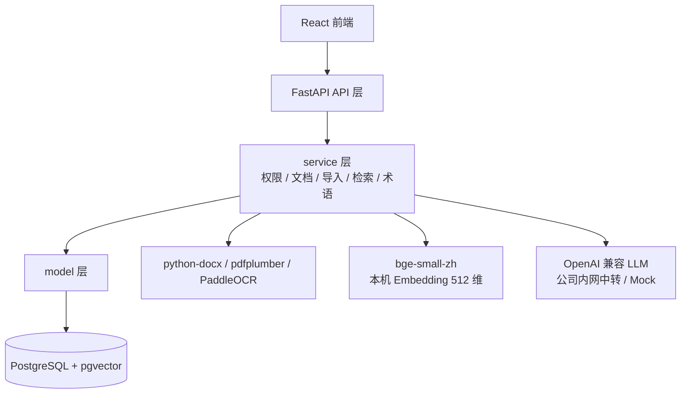

# 05 技术方案

> 技术栈版本与关键决策。"为什么"见 04，本文讲"具体版本与约束"。
> Phase 技术约束与 `ai/project-rules.md` §1 / §2 一致。

## 0. 文档元信息

| 项 | 内容 |
|---|---|
| 输入来源 | `docs/03-prd.md`、`docs/04-architecture.md`、`docs/env/local-env.md`、`ai/project-rules.md` |
| 覆盖架构组件 | FastAPI 后端、React 前端、PostgreSQL + pgvector、Embedding / LLM 适配、导入解析 |
| 当前状态 | 目标基线已定（Phase1 技术选型已钉死）。Sprint-7/8 + task-009 真实化后：**PostgreSQL+pgvector / Embedding / LLM 已接入，RAG 与 search 均可走向量召回**（RG-001/002/004 Go，见 §1「当前实现状态」列与 §5.1）；OCR / 真实 PDF 解析仍降级（RG-003，后续阶段）。实现期变更需先修订本文 |
| 最后更新 | 2026-07-11（doc-standards 结构合规对齐） |

## 1. 技术栈与版本

> Phase1 固定以下运行基线。Sprint-8 / task-008 T7（PG-C-001）起，后端运行时以**本机实测的 Python 3.14.3** 为准（`backend/requirements.txt` 已锁 3.14 实测版本；原 3.12 锁定版在 3.14 下构建失败，见 tech-env 复核报告 §5.1/§12）。Node.js 22.17.1 / Docker 29.5.2 同为本机实测。

| 层 | 选型 | Phase1 基线（目标） | 当前实现状态 |
|---|---|---|---|
| 后端 | Python + FastAPI | Python 3.14.x（实测 3.14.3）；FastAPI 0.136.x；Uvicorn 0.49.x；Pydantic 2.13.x | **已接入**（api/service/model 三层运行；`backend/requirements.txt` 锁 3.14 实测版本，含 DB/Embedding 全栈） |
| 数据库 | PostgreSQL + pgvector | PostgreSQL 16.x；pgvector 0.8.x；SQLAlchemy 2.0.x；Alembic 1.18.x；psycopg 3.3.x | **已接入**（Sprint-8 / task-008 T1–T5：`docker/compose.yml` 起 lumen-pg:pg16；`model/orm.py` + `service/pg_repository.py` 仓储；8 张 `lumen_*` 表落地；单例 `repository` 切 PgRepository） |
| 向量索引 | pgvector hnsw | Embedding 维度 512；HNSW `m=16`、`ef_construction=64`、查询 `ef_search=40`；Demo 数据 < 1k chunks 可先用精确扫描 | **已接入（RAG + search）**（T6：`lumen_chunks.embedding vector(512)` + hnsw `vector_cosine_ops`；RAG 走向量 ANN + 关键词加法式召回，threshold 0.6。task-009：`/api/search` 复用向量召回 + `ts_vector` SQL 候选；`zhparser` 可选，当前 pgvector 镜像无扩展时回退 `simple`） |
| AI | LLM：OpenAI 兼容接口；Embedding：本机 `BAAI/bge-small-zh-v1.5` | Embedding 512 维；`sentence-transformers` 5.6.x；LLM Demo 默认走公司内网 OpenAI 兼容中转，未配置时显式 Mock | **LLM=已启用（GLM `glm-5.2` 中转站真实问答，Sprint-7 RG-004 Go）；默认 Mock 降级可切；Embedding=已启用（T4/T6：bge-small-zh 写入 `lumen_chunks.embedding`，RG-002 Go；约束 `HF_HUB_DISABLE_XET=1`）** |
| 前端 | React | React 18.2.x；Vite 5.4.x；TypeScript 5.5.x；Node.js 22.17.1；npm 11.11.0 | **已接入**（文档编辑 / 搜索问答 / 术语管理 UI） |
| 文档解析 | python-docx / pdfplumber | python-docx 1.1.x；pdfplumber 0.11.x | **未接入（候选）**：当前仅支持 `.md`/`.txt` 已提取文本，无 Word/PDF 解析 |
| OCR | PaddleOCR（可降级） | PaddleOCR 2.8.x；Phase1 允许关闭 OCR 并降级为已提取文本 | **未实现（降级）**：当前无 OCR；REQ-010 移至后续阶段 |
| 部署 | Docker Compose（本地起库与依赖） | Docker 29.5.2；Docker Compose v5.1.4；本地 PostgreSQL + pgvector 由 compose 编排 | **已接入**（Sprint-8 T1：`docker/compose.yml` 编排 lumen-pg；daemon live，TE-C-003 闭合） |

> 各技术的用途 / 约束来源 / 密钥敏感性 / 验证方式见 §2.1 依赖与配置矩阵；技术栈禁令见 `ai/project-rules.md` §2 与本文 §3。

> 注：上图为**目标架构**，Sprint-7/8 后**大部分已落地**——DB 节点为 PostgreSQL+pgvector（lumen-pg 容器），Embedding（bge-small-zh）、LLM（GLM 中转）已接入；OCR / 真实 Word·PDF 解析仍降级（RG-003，后续阶段）。逐组件状态见 §1「当前实现状态」列，Go/No-Go 见 §5.1 Readiness Gate。

## 2. 关键技术决策

| TCD-ID | 决策 | 理由 | 替代 / 禁令 | 影响范围 | 验证状态 |
|---|---|---|---|---|---|
| TCD-001 | 向量检索用 pgvector | 关系数据与向量检索一体，Phase1 少引独立向量库 | 禁 Milvus / Qdrant（project-rules §2） | 检索 / RAG（REQ-007/008） | 已启用（RG-001 Go） |
| TCD-002 | AI 调用分层封装（LLM 走 OpenAI 兼容；Embedding 本机 `bge-small-zh` 经 adapter） | 厂商解耦；Embedding 保留迁内网服务空间 | 禁绑定单一闭源 LLM SDK | LLM / Embedding（REQ-008/036） | 已启用（RG-002/004 Go） |
| TCD-003 | 导入流水线收敛异构格式为 纯文本 → 切块 → Embedding → `lumen_chunks` | 检索侧只面对一种数据形态 | 各格式独立检索路径 | 内容导入（REQ-009/010） | 部分启用（`.md`/`.txt`；真实解析后续） |
| TCD-004 | RAG 向量 + 全文双路召回，答案带来源；P1 不做重排调优 | 兼顾语义与关键词；重排留后续 | 纯关键词或纯向量 | RAG（REQ-008） | 已启用（task-009 hybrid） |
| TCD-005 | 术语口径注入：构造 Prompt 前按当前空间查 `lumen_terms`，空间术语优先于全局 | 保证跨客户口径一致 | — | 术语管理（REQ-036） | 已启用 |
| TCD-006 | 鉴权用 Demo Bearer Token（HMAC-SHA256；载荷 `user_id` / `current_space_id` / `exp`，8h）；空间 + 文档两级校验，查询 / 检索 / 问答三层统一过滤 | Demo 可用且权限下沉到查询层 | 真实账号系统（后续） | 权限（REQ-001..003） | 已启用（Demo） |

> 关联详细设计：`docs/design/rag-retrieval.md`、`ingestion.md`、`term-management.md`、`permissions.md`。
> **错误码**：HTTP 状态码 + `{ code, msg, data }` 双层；`code=0` 成功，业务错误 4 位数字码（详见 `docs/07-api-spec.md` §1）。
> **切块 / Embedding 参数**：导入侧与检索侧共用同一套；按标题 / 段落优先切分，目标块长 512 tokens、重叠 64 tokens、单块最小 80 字符；模型 `BAAI/bge-small-zh-v1.5`（512 维，pgvector `vector(512)`，写入前归一化）；批量 batch size 32。

### 2.1 依赖与配置矩阵

> 对照 `ai/doc-standards/05-tech-spec.md` §3。密钥 / 敏感性列标注 secret / token / 隐私 / 无。

| 类型 | 名称 | 用途 | 启用阶段 | 当前状态 | 配置来源 | 密钥 / 敏感性 | 验证方式 |
|---|---|---|---|---|---|---|---|
| 数据库 | PostgreSQL 16 + pgvector 0.8 | 关系存储 + 向量索引（`lumen_*` 表、hnsw） | Phase1 | 已启用 | `docker/compose.yml`（lumen-pg:pg16） | 无 | RG-001 Go；74 后端 tests（PG 集成） |
| Python 包 | FastAPI / Pydantic / SQLAlchemy / Alembic / psycopg | 后端 API + ORM + 迁移 | Phase1 | 已启用 | `backend/requirements.txt`（锁 3.14 实测） | 无 | RG-005 Go；tests |
| Python 包 | sentence-transformers + torch（cpu） | 本机 Embedding `bge-small-zh`（512 维） | Phase1 | 已启用 | `backend/requirements.txt`；须 `HF_HUB_DISABLE_XET=1` | 无 | RG-002 Go；embedding tests |
| Node 包 | React 18 / Vite 5 / TypeScript 5 | 前端 SPA | Phase1 | 已启用 | `frontend/package.json` | 无 | 前端 build + 浏览器 smoke |
| 外部 API | OpenAI 兼容 LLM 中转（GLM `glm-5.2`） | RAG 问答 + 术语注入 | Phase1 | 已启用（可切 Mock） | `.env`（base_url / api_key） | **secret（api_key）** | RG-004 Go；真实问答验证 |
| Docker 服务 | Docker Compose（lumen-pg） | 本机起 PostgreSQL+pgvector | Phase1 | 已启用 | `docker/compose.yml` | 无 | daemon live（TE-C-003 闭合） |
| Python 包 | python-docx / pdfplumber | 真实 Word / PDF 文本提取 | Phase1 | **候选（未接入）** | — | 无 | 待后续阶段 |
| Python 包 | PaddleOCR | 图片 / 白板 OCR | 后续 | **降级 / No-Go（RG-003）** | — | 无 | 待环境兼容验证 |

## 3. Phase 技术约束

- **P1 允许**：见 project-rules §1。
- **P1 禁止**：独立向量库、闭源 SDK 绑定、移动端、实时协作。
- **高风险项不进 P1**：跨文档因果推理、问题热力矩阵——需本文先验证可行（对应 REQ-020/021）。
- **前端交互设计边界**：UI 型项目，前端交互设计与 UI 原型策略见 `ai/project-rules.md` §2.7 与 `docs/design/frontend-interaction.md`（代码原型 + mock，Sprint-6 Edge/Chrome smoke 已通过）。

## 4. 编码约定

- 后端使用 Python `snake_case`；目录按 `api / service / model` 分层，对外接口只进 api 层。
- 前端使用 JS/TS `camelCase`，React 组件使用 `PascalCase`。
- AI 调用统一走 OpenAI 兼容 adapter；不得在业务层直接绑定单一闭源 SDK。
- 新增依赖必须写入依赖文件，并说明用途；Sprint 内不得引入本节基线之外的依赖。

## 5. 运行环境与资源评估

> 受 `ai/project-rules.md` §2.5 与 `docs/env/local-env.md` 约束。给出本机 Demo 可行性、瓶颈、降级 / Mock 与服务器预案。

- 本机 Demo 可行性：PostgreSQL+pgvector、FastAPI、React 均可本机 Docker 运行；Embedding 采用本机 `bge-small-zh`（512 维），不依赖公司 Embedding 资源。
- 数据范围：默认使用已标注的虚构 Demo 数据；允许按需导入部分真实团队文档。真实文档必须显式标注来源 / 敏感级别，并优先避免发送到外部模型。
- 依赖 / 镜像：允许本机安装项目所需 Python / npm 依赖并拉取 Docker 镜像；新增依赖必须进入依赖文件并说明用途，不得替换既定技术栈。
- 资源软上限：Demo 峰值内存 < 8GB、显存 < 4GB、磁盘 < 20GB；依据见 `docs/env/local-env.md` 自动采集值与人工确认项。
- 资源瓶颈：大文档批量导入的内存占用、向量索引构建开销；超限先优化批处理、增量索引与 chunk 策略。
- 降级 / Mock 策略：LLM 可降级为明确 Mock 回答或远程 API；OCR 可降级为已提取文本；真实文档场景下需优先避免把敏感片段发送到外部模型。
- 服务器资源预案：本机 Embedding 不够用时，申请公司内网 Embedding / reranker 服务，后端通过 adapter 调用 OpenAI-compatible `/v1/embeddings`，并按新维度重建向量与索引（见 `docs/env/local-env.md`「服务器资源预案」段）。

### 5.1 Readiness Gate（真实依赖进入 Sprint 前门禁）

> 本节为 P1 回梳新增（对照 `ai/doc-standards/05-tech-spec.md §5`）。Sprint-7/8 真实化后 RG-001/002/004 已 Go（pgvector / Embedding / LLM 接入），仅 RG-003（OCR）仍 No-Go。结论引用 `docs/research/2026-07-09-tech-env-evaluation-phase1-reeval.md`（§12 后续更新记录 RG-001 解除）。

| RG-ID | 真实依赖 | 结论 | 阻塞 / 依据 | 解锁条件 | 验证证据 / 对应 TC | 影响 REQ |
|---|---|---|---|---|---|---|
| RG-001 | PostgreSQL + pgvector | **Go**（Sprint-8 / task-008 T1–T6） | Docker daemon live（TE-C-003 闭合）；`docker/compose.yml` 起 lumen-pg:pg16；`pg_repository.py` + ORM 接入；RAG 向量召回已验证（T6，bge 余弦 topK threshold 0.6） | — | 74 后端 tests（PG 集成）；TC-P1-007/008 | REQ-007/008（检索问答真实化） |
| RG-002 | Embedding（bge-small-zh，本机） | **Go（已启用）**（T4/T6） | VC++ Redist 修复后 torch 2.13.0+cpu import OK；bge-small-zh-v1.5 生成 512 维 float32，T6 起写入 `lumen_chunks.embedding`（见复核报告 §5.3/§12） | 须设 `HF_HUB_DISABLE_XET=1`（公司网络） | embedding tests；TC-P1-007/008 | REQ-007/008 |
| RG-003 | OCR（PaddleOCR） | **No-Go（降级）** | PaddleOCR 2.8.x 与运行环境不兼容；当前无 OCR | OCR 引擎定版 + 环境兼容验证 | —（未验证） | REQ-010（移至后续阶段） |
| RG-004 | LLM（OpenAI 兼容） | **Go（GLM-5.2 已验证）** | `llm_adapter.py` 已接入 + 本机中转站 GLM `glm-5.2` 真实问答验证通过（Sprint-7，2026-07-09）；GPT/ollama 配置位就绪未验证 | — | GLM-5.2 真实问答；TC-P1-008 | REQ-008（问答真实化） |
| RG-005 | Web / ORM 基础栈（FastAPI/Pydantic/React） | **Go** | 已接入并跑通 74 后端 tests（含 PG 集成 + embedding）+ 前端 build + 浏览器 smoke；requirements.txt drift 已解决（T7 PG-C-001） | — | 74 后端 tests + 前端 build + smoke；TC-P1-001..012 | REQ-001..006/011/036 |

> 风险与验证映射：本表 RG-ID 与 `docs/09-verification.md §6` 风险项对齐（待 09 补 Risk-ID 列后双向链接）。

### 5.2 安全、隐私与合规

> 对照 `ai/doc-standards/05-tech-spec.md` §2。权威源：`ai/project-rules.md §2.5`、`docs/04-architecture.md §1.1`（数据外发边界）、`docs/06-db-design.md §5`。

| 项 | 要求 | 阶段 | 状态 | 权威源 | 验证入口 |
|---|---|---|---|---|---|
| 权限隔离 | 空间 + 文档两级权限，查询 / 检索 / 问答三层统一过滤；前端隐藏不作为权限边界 | Phase1 | 已实现 | `04 §5.3`、`docs/design/permissions.md` | TC-P1-001 / 003 |
| 私有文档隔离 | 私有文档不进他人检索 / 问答 / 共享视图 | Phase1 | 已实现 | `04 §5.3` | TC-P1-003 |
| 库外问答红线 | 无相关内容明确"未找到"，不编造 | 全阶段 | 已实现（产品红线） | `03 §3` Phase1 退出标准 | TC-P1-008 |
| 数据外发过滤 | 发往 LLM 前过滤敏感片段，优先避免发送真实团队文档；Embedding 本机不外发 | Phase1 | 已实现（口径） | `04 §1.1`、`project-rules §2.5` | 人工验收 + RAG tests |
| 真实文档标注 | 真实文档导入须显式标注来源 / 敏感级别 | Phase1+ | 后续阶段待细化 | `project-rules §2.5` | 后续真实导入任务 |
| Demo 数据边界 | 默认虚构 Demo 数据；真实文档按需导入并标注 | Phase1 | 已执行 | `project-rules §2.5` | — |
| Token 鉴权 | Demo Bearer Token（HMAC-SHA256，8h） | Phase1 | 已实现 | `04 §5.1`、TCD-006 | 登录 / 切换 tests |

## 6. 待人工确认项

- 无开发前阻塞项；若实现期需要升级本节基线之外的版本或依赖，必须先修订本文并说明原因。
