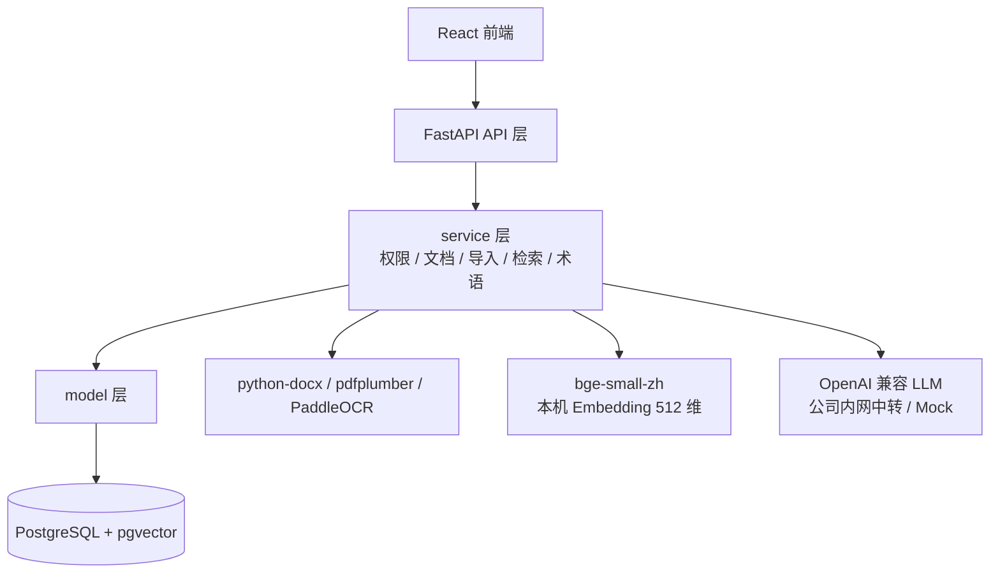

# 05 技术方案

> 技术栈版本与关键决策。"为什么"见 04，本文讲"具体版本与约束"。
> Phase 技术约束与 `ai/project-rules.md` §1 / §2 一致。

## 0. 文档元信息

| 项 | 内容 |
|---|---|
| 输入来源 | `docs/03-prd.md`、`docs/04-architecture.md`、`docs/env/local-env.md`、`ai/project-rules.md` |
| 覆盖架构组件 | FastAPI 后端、React 前端、PostgreSQL + pgvector、Embedding / LLM 适配、导入解析 |
| 当前状态 | 目标基线已定（Phase1 技术选型已钉死）；运行时为**降级内存实现**（见 §1「当前实现状态」列与 §5.1 Readiness Gate）。Phase1 接受降级基线；真实化（pgvector / Embedding / OCR / 真实 PDF / LLM）移至 Phase2 / MVP。实现期变更需先修订本文 |
| 最后更新 | 2026-07-09 |

## 1. 技术栈与版本

> Phase1 固定以下运行基线；本机已采集到 Python 3.14.3 / Node.js 22.17.1 / Docker 29.5.2，可用于辅助工具，但项目后端运行时以 Python 3.12 为准。

| 层 | 选型 | Phase1 基线（目标） | 当前实现状态 |
|---|---|---|---|
| 后端 | Python + FastAPI | Python 3.12.x；FastAPI 0.115.x；Uvicorn 0.34.x；Pydantic 2.10.x | **已接入**（api/service/model 三层运行；`requirements.txt` 仅 fastapi/uvicorn/pydantic） |
| 数据库 | PostgreSQL + pgvector | PostgreSQL 16.x；pgvector 0.7.x；SQLAlchemy 2.0.x；Alembic 1.14.x；psycopg 3.2.x | **未接入（候选）**：当前为内存 `demo_repository`；无 SQLAlchemy/Alembic/psycopg 依赖 |
| 向量索引 | pgvector hnsw | Embedding 维度 512；HNSW `m=16`、`ef_construction=64`、查询 `ef_search=40`；Demo 数据 < 1k chunks 可先用精确扫描 | **未接入（候选）**：当前内存关键词匹配，无向量检索 |
| AI | LLM：OpenAI 兼容接口；Embedding：本机 `BAAI/bge-small-zh-v1.5` | Embedding 512 维；`sentence-transformers` 3.0.x；LLM Demo 默认走公司内网 OpenAI 兼容中转，未配置时显式 Mock | **LLM=已验证（GLM `glm-5.2` 中转站真实问答，Sprint-7）；默认 Mock 降级可切；Embedding=未接入（评估报告 No-Go，torch 导入失败）** |
| 前端 | React | React 18.2.x；Vite 5.4.x；TypeScript 5.5.x；Node.js 22.17.1；npm 11.11.0 | **已接入**（文档编辑 / 搜索问答 / 术语管理 UI） |
| 文档解析 | python-docx / pdfplumber | python-docx 1.1.x；pdfplumber 0.11.x | **未接入（候选）**：当前仅支持 `.md`/`.txt` 已提取文本，无 Word/PDF 解析 |
| OCR | PaddleOCR（可降级） | PaddleOCR 2.8.x；Phase1 允许关闭 OCR 并降级为已提取文本 | **未实现（降级）**：当前无 OCR；REQ-010 移至后续阶段 |
| 部署 | Docker Compose（本地起库与依赖） | Docker 29.5.2；Docker Compose v5.1.4；本地 PostgreSQL + pgvector 由 compose 编排 | **未接入**：`docker/` 仅 `.gitkeep`，无 compose 文件；评估报告 Docker daemon No-Go。当前后端直连内存仓储 |

> 注：上图为**目标架构**。当前 Phase1 Demo 运行时为**降级内存实现**——DB 节点实为内存 `demo_repository`（无 pgvector），Embedding / OCR / 真实 Word·PDF 解析 / LLM 均未接入（LLM 为 Mock，RAG 不调用外部模型）。逐组件状态见 §1「当前实现状态」列，Go/No-Go 见 §5.1 Readiness Gate。

## 2. 关键技术决策

- **向量检索用 pgvector**，Phase1 不引 Milvus / Qdrant（见 project-rules §2）。
- **AI 调用分层封装**：LLM 统一走 OpenAI 兼容封装层；Embedding 通过本机 adapter 调 `bge-small-zh`，后续可替换为公司内网 OpenAI-compatible `/v1/embeddings` 服务。
- **导入流水线**：异构文件 → 纯文本 → 切块 → Embedding → 入 `lumen_chunks`（详见 docs/design/ingestion）。
- **RAG**：向量检索 + 全文检索双路召回，答案带来源（详见 docs/design/rag-retrieval）；P1 不做重排调优。
- **术语口径注入**：RAG 构造 Prompt 前按当前空间查 `lumen_terms`，空间术语优先于全局术语；文档阅读 / 编辑侧用术语表做轻量匹配提示（详见 docs/design/term-management）。
- **鉴权**：Phase1 使用 Demo Bearer Token；`POST /api/auth/login` 返回 HMAC-SHA256 签名 token，前端通过 `Authorization: Bearer <token>` 传递。Token 载荷包含 `user_id`、`current_space_id`、`exp`，有效期 8 小时；`POST /api/spaces/switch` 校验成员关系后返回带新 `current_space_id` 的 token。权限在空间 + 文档两级校验，查询 / 检索 / 问答三层统一过滤（详见 docs/design/permissions）。
- **错误码**：HTTP 状态码 + `{ code, msg, data }` 双层表达；`code=0` 表示成功，业务错误使用 4 位数字码（详见 `docs/07-api-spec.md` §1）。
- **切块与 Embedding 参数**：导入侧与检索侧共用同一套（避免 train/serve 偏差）；按标题 / 段落优先切分，目标块长 512 tokens、重叠 64 tokens，单块最小 80 字符；Embedding 模型为 `BAAI/bge-small-zh-v1.5`，维度 512，对应 pgvector `vector(512)`，写入前做向量归一化；批量 Embedding 默认 batch size 32。

## 3. Phase 技术约束

- **P1 允许**：见 project-rules §1。
- **P1 禁止**：独立向量库、闭源 SDK 绑定、移动端、实时协作。
- **高风险项不进 P1**：跨文档因果推理、问题热力矩阵——需本文先验证可行（对应 REQ-020/021）。

## 4. 编码约定

- 后端使用 Python `snake_case`；目录按 `api / service / model` 分层，对外接口只进 api 层。
- 前端使用 JS/TS `camelCase`，React 组件使用 `PascalCase`。
- AI 调用统一走 OpenAI 兼容 adapter；不得在业务层直接绑定单一闭源 SDK。
- 新增依赖必须写入依赖文件，并说明用途；Sprint 内不得引入本节基线之外的依赖。

## 5. 运行环境与资源评估

> 受 `ai/project-rules.md` §2.5 与 `docs/env/local-env.md` 约束。给出本机 Demo 可行性、瓶颈、降级 / Mock 与服务器预案。

- 本机 Demo 可行性：PostgreSQL+pgvector、FastAPI、React 均可本机 Docker 运行；Embedding 采用本机 `bge-small-zh`（512 维），不依赖公司 Embedding 资源。
- 数据范围：默认使用已标注的虚构 Demo 数据；允许按需导入部分真实团队文档。真实文档必须显式标注来源 / 敏感级别，并优先避免发送到外部模型。
- 依赖 / 镜像：允许本机安装项目所需 Python / npm 依赖并拉取 Docker 镜像；新增依赖必须进入依赖文件并说明用途，不得替换既定技术栈。
- 资源软上限：Demo 峰值内存 < 8GB、显存 < 4GB、磁盘 < 20GB；依据见 `docs/env/local-env.md` 自动采集值与人工确认项。
- 资源瓶颈：大文档批量导入的内存占用、向量索引构建开销；超限先优化批处理、增量索引与 chunk 策略。
- 降级 / Mock 策略：LLM 可降级为明确 Mock 回答或远程 API；OCR 可降级为已提取文本；真实文档场景下需优先避免把敏感片段发送到外部模型。
- 服务器资源预案：本机 Embedding 不够用时，申请公司内网 Embedding / reranker 服务，后端通过 adapter 调用 OpenAI-compatible `/v1/embeddings`，并按新维度重建向量与索引（见 `docs/env/local-env.md`「服务器资源预案」段）。

### 5.1 Readiness Gate（真实依赖进入 Sprint 前门禁）

> 本节为 P1 回梳新增（对照 `ai/doc-standards/05-tech-spec.md §5`）。结论引用 `docs/research/2026-07-04-tech-env-evaluation-phase1.md`。Phase1 Demo 已接受降级基线（见 §1 当前实现状态）；以下为真实化门禁，移至 Phase2 / MVP 触发。

| RG-ID | 真实依赖 | 结论 | 阻塞 / 依据 | 解锁条件 | 影响 REQ |
|---|---|---|---|---|---|
| RG-001 | PostgreSQL + pgvector | **No-Go** | 评估报告 §10.1 Docker daemon 未起；无 compose；当前内存 DemoRepository | 起 Docker Linux engine + 补 `docker-compose.yml` + 接线 SQLAlchemy/Alembic | REQ-007/008（检索问答真实化） |
| RG-002 | Embedding（bge-small-zh，本机） | **No-Go** | 评估报告 §9.2 torch 导入失败（Python 3.14 环境） | 修 torch 兼容 / 换 Embedding 通道（公司内网 `/v1/embeddings`） | REQ-007/008 |
| RG-003 | OCR（PaddleOCR） | **No-Go（降级）** | PaddleOCR 2.8.x 与运行环境不兼容；当前无 OCR | OCR 引擎定版 + 环境兼容验证 | REQ-010（移至后续阶段） |
| RG-004 | LLM（OpenAI 兼容） | **Go（GLM-5.2 已验证）** | `llm_adapter.py` 已接入 + 本机中转站 GLM `glm-5.2` 真实问答验证通过（Sprint-7，2026-07-09）；GPT/ollama 配置位就绪未验证 | — | REQ-008（问答真实化） |
| RG-005 | Web / ORM 基础栈（FastAPI/Pydantic/React） | **Conditional Go** | 已接入并跑通 53 后端 tests + 前端 build + 浏览器 smoke | — | REQ-001..006/011/036 |

> 风险与验证映射：本表 RG-ID 与 `docs/09-verification.md §6` 风险项对齐（待 09 补 Risk-ID 列后双向链接）。

## 6. 待人工确认项

- 无开发前阻塞项；若实现期需要升级本节基线之外的版本或依赖，必须先修订本文并说明原因。
