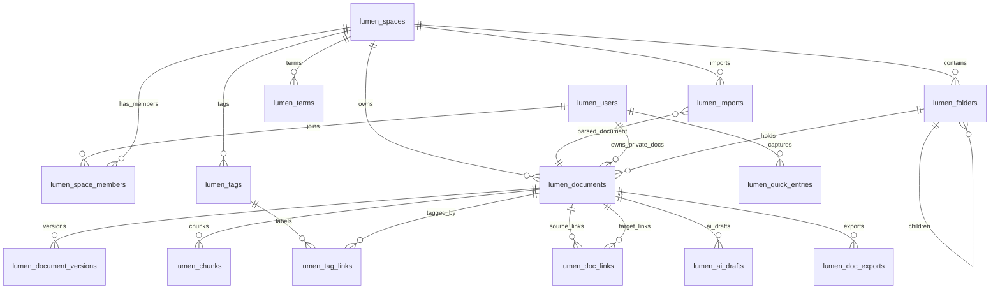

# 06 数据库设计

> 按「完整骨架 + 阶段增量」演进（global-rules §8）。铺出**完整愿景**的全部表；
> `[P1]` 表写全字段 / 索引，`[P2]` / `[愿景]` 表留骨架。
> 表前缀 `lumen_`；每张表可追溯到 REQ。

## 0. 文档元信息

| 项 | 内容 |
|---|---|
| 保留 / 省略决策 | 保留 |
| 决策来源 | `ai/project-rules.md` §3（项目有 PostgreSQL + pgvector 持久化存储） |
| 覆盖 REQ / 模块 | Phase1：空间 / 权限、文档、版本、导入、检索向量、术语管理；Phase1.5A：批量导入与 `.md` / ZIP 导出备份（REQ-037/038）；Phase1.5B：PDF 导出任务契约（REQ-027）；Phase2A：标签、内链 / 反链、快速录入（REQ-012/025/026）；Phase2B：AI 润色草稿（REQ-014）、**主题时间线（REQ-013a/024）**、文档目录树（REQ-039，第三 slice 候选）；愿景保留骨架 |
| 当前状态 | P1 表结构**已落地 PostgreSQL**（Sprint-8 / task-008 T1–T5：8 张 `lumen_*` 表由 `migrations/001-005` 建，后端切 `PgRepository`；`lumen_chunks.embedding vector(512)` + hnsw + ts_vector 由 T4/T6 启用；migration 006 为 search 增加可选 zhparser / `simple` 回退配置）。内存 `demo_repository` 保留为单测 fake。Phase1.5A 的 REQ-037/038 已复用既有表完成、不新增迁移；Phase1.5B PDF 导出已落地 `lumen_doc_exports`（migration 013 + DocExport entity/ORM + Demo/Pg repository）；Phase2A 的标签、反链与快速录入表已落地；真实 Word/PDF 文本提取与 OCR 仍降级（RG-007 / RG-003）。2026-07-21 按 ADR-010 补“DB 权威运行态 + 衍生数据可重建”原则 |
| 最后更新 | 2026-08-04（Sprint-18 PDF 导出 DB 契约落地：migration 013 `lumen_doc_exports` + TC-P1-017 通过） |

## 1. 表清单（完整）

| 表 | 用途 | 阶段 | 设计状态 | 当前实现状态 | 追溯 |
|---|---|---|---|---|---|
| lumen_users | 账号 | [P1] | P1-已实现 | 已落地 PostgreSQL（migration 001；PgRepository 接入） | REQ-001 基础 |
| lumen_spaces | 空间 | [P1] | P1-已实现 | 已落地 PostgreSQL（migration 001；PgRepository 接入） | REQ-001 |
| lumen_space_members | 成员-空间-角色 | [P1] | P1-已实现 | 已落地 PostgreSQL（migration 001；PgRepository 接入） | REQ-001/002 |
| lumen_documents | 文档 | [P1] | P1-已实现 | 已落地 PostgreSQL（migration 001；PgRepository 接入） | REQ-003/004 |
| lumen_document_versions | 版本历史 | [P1] | P1-已实现 | 已落地 PostgreSQL（migration 002；PgRepository 接入） | REQ-006 |
| lumen_chunks | 切块 + Embedding 向量 + 全文向量 | [P1] | P1-已实现 | 已落地 PostgreSQL（migration 003；T6 起写入 embedding 并用于 RAG 向量召回） | REQ-007/008 |
| lumen_imports | 导入任务 | [P1] | P1-已实现；Phase1.5A 复用 | 已落地 PostgreSQL（migration 004；当前导入仅 `.md`/`.txt` 已提取文本；批量导入默认逐文件复用此表） | REQ-009/010/037 |
| lumen_terms | 空间级术语表 | [P1] | P1-已实现 | 已落地 PostgreSQL（migration 004；PgRepository 接入） | REQ-036 |
| lumen_tags | 标签 | [P2] | Phase2A-已实现 | 迁移 008 已落地（Task A `1e4cf48`）；扁平标签（无层级） | REQ-012 |
| lumen_tag_links | 标签-文档关联 | [P2] | Phase2A-已实现 | 迁移 008 已落地（Task A `1e4cf48`）；最小版仅写入 link_source='manual'，其余值预留 | REQ-012 |
| lumen_doc_links | 内部链接与反向链接索引 | [P2] | Phase2A-已实现 | 已落地（migration 007；fc2b869 Task A） | REQ-026 |
| lumen_quick_entries | 快速录入索引条目 | [P2] | Phase2A-已实现 | 迁移 009 已落地（Task A `f771e02`）；draft 默认 owner 私有 | REQ-025 |
| lumen_ai_drafts | AI 润色 / 写作引用草稿 | [P2] | Phase2B·MVP 级已设计 | 已落地 PostgreSQL（migration 010；后端 service / API / tests 已实现，见 §6） | REQ-014 |
| lumen_folders | 文档目录树（嵌套文件夹） | [P2] | Phase2B·第三 slice·已实现（后端/API + 导入归属 + 单文档移动） | migration 011 已落地 + 后端 service/API/tests 已实现（task-027，19 folder + 45 回归 tests OK）；API-029 `preserve_structure` 已实现建/复用 folder + 回填 `folder_id`（task-028）；API-038 单文档移动 + 前端文件管理器基础能力已实现（task-029，后端 38 tests + frontend build OK；v1.5.2 浏览器自动化 smoke 已补） | REQ-039 |
| lumen_doc_exports | 单文档导出 PDF 任务 | [P1] | Phase1.5B-已实现 | migration 013 已落地；DocExport entity/ORM + Demo/Pg repository 已接入 | REQ-027 |
| lumen_push_copies | 跨空间推送只读副本 | [P2] | 骨架 | — | REQ-015 |
| lumen_vault_mounts | Vault 挂载配置 / 本地连接器元数据 | [愿景] | 已确认方向·待技术验证 | 仅记录用户 / 设备 / 来源类型 / 授权状态等元数据候选；本地目录句柄、绝对路径与文件正文默认保留在客户端本地，不作为服务端 DB 权威内容 | REQ-018 |
| lumen_audio_records | 录音转写记录 | [愿景] | 骨架 | — | REQ-019 |
| lumen_brief_links | 对外只读简报链接 | [愿景] | 骨架 | — | REQ-022 |
| lumen_external_sync | 外部源同步配置（飞书等） | [愿景] | 骨架 | — | REQ-028 |
| lumen_doc_participants | 文档参与人物（实体抽取） | [愿景] | 骨架 | — | REQ-031 |
| lumen_hypotheses | 假设检验记录 | [愿景] | 骨架 | — | REQ-033 |
| lumen_evidence | 证据条目（支持 / 反对） | [愿景] | 骨架 | — | REQ-033 |
| lumen_signal_subscriptions | 信号追踪主题订阅 | [愿景] | 骨架 | — | REQ-034 |
| lumen_analysis_kits | 分析包（A Kit）配置 | [愿景] | 骨架 | — | REQ-035 |

> 当前实现说明（Sprint-8 / task-008 T1–T5 后）：Phase1 Demo 后端已切 `PgRepository`，**全部 P1 表（8 张）已落地 PostgreSQL**（lumen-pg 容器）。`migrations/001-005` 建表 + demo seed（`db.init_db` 幂等执行）；`lumen_chunks` 含 `embedding vector(512)` + hnsw + ts_vector（T4/T6 启用 embedding 写入与向量召回）。内存 `demo_repository` 保留为单测 fake（不落 PG）。真实 PDF/OCR 仍降级（RG-003）。

### 1.1 数据权威与派生可重建原则（ADR-010）

LUMEN 采用 `docs/decisions/ADR-010-db-authority-derived-data-rebuildability.md` 定义的 **DB 权威运行态 + 衍生数据可重建** 模型：

- **权威运行态数据**：`lumen_users`、`lumen_spaces`、`lumen_space_members`、`lumen_documents`、`lumen_document_versions`、`lumen_terms`、`lumen_tags`、`lumen_quick_entries` 等承载用户、空间、权限、正文、版本、术语、标签定义和快速录入业务事实，PostgreSQL 是权威来源。
- **可重建派生数据**：`lumen_chunks.text` / `embedding` / `ts_vector`、`lumen_doc_links` 中由 `[[wikilink]]` 解析出的出链 / 反链索引，以及 `document_count` 等计数类结果，必须可从权威文档内容、文档元数据、标签关系和权限边界重新生成或校验。
- **不采纳项**：不采纳 `.md` / frontmatter 是唯一权威、DB 是可丢弃缓存的原始 OB-01 模型。`.md` 在 LUMEN 中是导入源、导出格式和迁出载体，不替代 DB 权威。
- **实现边界**：本原则不声明当前已有全量重建脚本；后续新增索引 / 缓存 / 计数字段时，必须在本文件说明来源、重建触发和权限过滤口径。

## 2. 表结构（[P1] 已设计）

### lumen_users
| 字段 | 类型 | 说明 |
|---|---|---|
| id | bigint PK | |
| external_id | varchar | 外部账号标识 |
| name | varchar | 显示名 |
| created_at | timestamptz | |

### lumen_spaces
| 字段 | 类型 | 说明 |
|---|---|---|
| id | bigint PK | |
| code | varchar UK | 如 `nova-internal` / `brightlite-team` |
| name | varchar | 显示名 |
| created_at | timestamptz | |

### lumen_space_members
| 字段 | 类型 | 说明 |
|---|---|---|
| user_id | bigint FK→users | |
| space_id | bigint FK→spaces | |
| role | varchar | admin / member |
| | PK(user_id, space_id) | |

### lumen_documents
| 字段 | 类型 | 说明 |
|---|---|---|
| id | bigint PK | |
| space_id | bigint FK→spaces | 隔离边界 |
| title | varchar | |
| content_md | text | Markdown 正文 |
| owner_id | bigint FK→users | |
| permission | varchar | private / team / external |
| type | varchar | markdown / index_entry（P1 默认 markdown；P2 快速录入用 index_entry，见 REQ-025） |
| current_version | int | 当前版本号 |
| folder_id | bigint FK→folders, nullable | 文档所属文件夹（空=空间根；Phase2B·REQ-039，FT-C-006 向后兼容） |
| created_at / updated_at | timestamptz | |
- 索引：`(space_id, permission)` 复合——支撑隔离 + 权限过滤

### lumen_document_versions
| 字段 | 类型 | 说明 |
|---|---|---|
| id | bigint PK | |
| document_id | bigint FK→documents | |
| version_no | int | |
| content_md | text | 该版本正文 |
| editor_id | bigint FK→users | |
| created_at | timestamptz | |
- 约束：`UNIQUE(document_id, version_no)`

### lumen_chunks（pgvector，检索核心 · P1-已实现）
| 字段 | 类型 | 说明 |
|---|---|---|
| id | bigint PK | |
| document_id | bigint FK→documents | |
| ordinal | int | 块序号 |
| text | text | 块原文 |
| embedding | vector(512) | pgvector 向量，对应本机 `bge-small-zh` Embedding（512 维，T6 起写入；用于 RAG 向量召回，task-009 起也用于 `/api/search` 语义召回；RG-001/002 Go） |
| ts_vector | tsvector | 全文检索向量；migration 006 通过 `lumen_search_regconfig()` 选择可选 `lumen_zh` / 默认 `simple` 配置 |
- 索引：hnsw `vector_cosine_ops`（参数见 05）+ `ts_vector` GIN；`zhparser` 当前不是硬依赖

### lumen_imports
| 字段 | 类型 | 说明 |
|---|---|---|
| id | bigint PK | |
| space_id | bigint FK→spaces | |
| source_filename | varchar | |
| mime | varchar | docx / pdf / image / txt / md（目标态；当前降级导入仅 .txt/.md，可空） |
| status | varchar | processing / done / failed |
| parsed_doc_id | bigint FK→documents | 解析生成/关联的文档 |
| created_by | bigint FK→users | 发起导入的用户（导入状态机审计） |
| chunk_count | int | 成功切块数（complete_import_job 写入） |
| error | text | 失败原因（fail_import_job 写入，可空） |
| created_at | timestamptz | |

### lumen_terms
| 字段 | 类型 | 说明 |
|---|---|---|
| id | bigint PK | |
| space_id | bigint FK→spaces, nullable | 为空表示全局术语；非空表示空间级术语 |
| term | varchar | 标准名称 |
| definition | text | 术语定义 |
| aliases | jsonb | 客户习惯用语 / 非标准称呼 / 偏差说明 |
| owner_id | bigint FK→users | 负责人 |
| status | varchar | confirmed / pending |
| source_document_id | bigint FK→documents, nullable | 术语来源文档 |
| created_at / updated_at | timestamptz | |
- 约束：`UNIQUE(space_id, term)`；同名术语查询时空间级优先于全局术语

### 字段级契约矩阵（[P1]）

> 9 列字段级契约（对照 `ai/doc-standards/06-db-design.md §4.2`）。字段语义说明见上方各表简表。Sprint-8 后 P1 表已由 `migrations/001-005` 落地 PostgreSQL；真实 Word / PDF 解析与 OCR 仍按 RG-003 降级。

| 表 | 字段 | 类型 | 必填 | 默认值 | 约束 | 来源 REQ | 敏感性 | 留存 / 删除 |
|---|---|---|---|---|---|---|---|---|
| lumen_users | id | bigint PK | 是 | — | PK | REQ-001 | 低 | 随账号删除 |
| lumen_users | external_id | varchar | 是 | — | 唯一（登录标识） | REQ-001 | 中 | 随账号删除 |
| lumen_users | name | varchar | 是 | — | — | REQ-001 | 低 | 随账号删除 |
| lumen_users | created_at | timestamptz | 是 | now() | — | REQ-001 | 低 | 随账号删除 |
| lumen_spaces | id | bigint PK | 是 | — | PK | REQ-001 | 低 | 随空间删除 |
| lumen_spaces | code | varchar | 是 | — | UK | REQ-001 | 低 | 随空间删除 |
| lumen_spaces | name | varchar | 是 | — | — | REQ-001 | 低 | 随空间删除 |
| lumen_spaces | created_at | timestamptz | 是 | now() | — | REQ-001 | 低 | 随空间删除 |
| lumen_space_members | user_id | bigint FK | 是 | — | FK→users, PK(user,space) | REQ-001/002 | 低 | 随成员关系删除 |
| lumen_space_members | space_id | bigint FK | 是 | — | FK→spaces | REQ-001/002 | 低 | 随成员关系删除 |
| lumen_space_members | role | varchar | 是 | — | admin / member | REQ-001/002 | 低 | 随成员关系删除 |
| lumen_documents | id | bigint PK | 是 | — | PK | REQ-004 | 低 | 随文档删除 |
| lumen_documents | space_id | bigint FK | 是 | — | FK→spaces, 索引(space,permission) | REQ-003/004 | 低 | 隔离边界 |
| lumen_documents | title | varchar | 是 | — | — | REQ-004 | 低 | 随文档删除 |
| lumen_documents | content_md | text | 是 | — | — | REQ-004/008 | 中 | 随文档；目标切块发外部 LLM |
| lumen_documents | owner_id | bigint FK | 是 | — | FK→users | REQ-003 | 低 | 随文档删除 |
| lumen_documents | permission | varchar | 是 | — | private / team / external | REQ-003 | 低 | 随文档删除 |
| lumen_documents | type | varchar | 是 | markdown | markdown / index_entry | REQ-004/025 | 低 | 随文档删除 |
| lumen_documents | current_version | int | 是 | 1 | — | REQ-006 | 低 | 随文档删除 |
| lumen_documents | folder_id | bigint FK | 否 | — | FK→folders, nullable（空=空间根） | REQ-039 | 低 | 随文档删除 |
| lumen_documents | created_at / updated_at | timestamptz | 是 | now() | — | REQ-004 | 低 | 随文档删除 |
| lumen_document_versions | id | bigint PK | 是 | — | PK | REQ-006 | 低 | 随版本删除 |
| lumen_document_versions | document_id | bigint FK | 是 | — | FK→documents | REQ-006 | 低 | 随文档删除 |
| lumen_document_versions | version_no | int | 是 | — | UNIQUE(document_id, version_no) | REQ-006 | 低 | 随版本删除 |
| lumen_document_versions | content_md | text | 是 | — | — | REQ-006 | 中 | 随版本；目标发外部 LLM |
| lumen_document_versions | editor_id | bigint FK | 是 | — | FK→users | REQ-006 | 低 | 随版本删除 |
| lumen_document_versions | created_at | timestamptz | 是 | now() | — | REQ-006 | 低 | 随版本删除 |
| lumen_chunks | id | bigint PK | 是 | — | PK | REQ-007/008 | 低 | 随文档删除 |
| lumen_chunks | document_id | bigint FK | 是 | — | FK→documents | REQ-007/008 | 低 | 随文档删除 |
| lumen_chunks | ordinal | int | 是 | — | — | REQ-007 | 低 | 随文档删除 |
| lumen_chunks | text | text | 是 | — | — | REQ-007/008 | 中 | 随文档；目标召回片段发外部 LLM |
| lumen_chunks | embedding | vector(512) | 是 | — | pgvector 近邻索引 | REQ-008 | 中 | 随文档；Sprint-8 T6 起已落地并用于 RAG 向量召回 |
| lumen_chunks | ts_vector | tsvector | 目标 | — | GIN（目标） | REQ-007 | 低 | 随文档；目标态未落地 |
| lumen_imports | id | bigint PK | 是 | — | PK | REQ-009 | 低 | 随导入任务删除 |
| lumen_imports | space_id | bigint FK | 是 | — | FK→spaces | REQ-009 | 低 | 随导入任务删除 |
| lumen_imports | source_filename | varchar | 是 | — | — | REQ-009 | 低 | 随导入任务删除 |
| lumen_imports | mime | varchar | 否 | — | docx / pdf / image / txt / md（目标态；当前降级不用） | REQ-009 | 低 | 随导入任务删除 |
| lumen_imports | status | varchar | 是 | processing | processing / done / failed（见 07 §3.6） | REQ-009 | 低 | 随导入任务删除 |
| lumen_imports | parsed_doc_id | bigint FK | 否 | — | FK→documents | REQ-009 | 低 | 随导入任务删除 |
| lumen_imports | created_by | bigint FK | 是 | — | FK→users | REQ-009 | 低 | 随导入任务删除 |
| lumen_imports | chunk_count | int | 是 | 0 | — | REQ-009 | 低 | 随导入任务删除 |
| lumen_imports | error | text | 否 | — | — | REQ-009 | 低 | 随导入任务删除 |
| lumen_imports | created_at | timestamptz | 是 | now() | — | REQ-009 | 低 | 随导入任务删除 |
| lumen_terms | id | bigint PK | 是 | — | PK | REQ-036 | 低 | 随术语删除 |
| lumen_terms | space_id | bigint FK | 否 | — | FK→spaces, nullable（空=全局术语） | REQ-036 | 低 | 随术语删除 |
| lumen_terms | term | varchar | 是 | — | UNIQUE(space_id, term) | REQ-036 | 低 | 随术语删除 |
| lumen_terms | definition | text | 是 | — | — | REQ-036 | 中 | 随术语；目标注入 RAG 发外部 LLM |
| lumen_terms | aliases | jsonb | 否 | — | — | REQ-036 | 低 | 随术语删除 |
| lumen_terms | owner_id | bigint FK | 是 | — | FK→users | REQ-036 | 低 | 随术语删除 |
| lumen_terms | status | varchar | 是 | pending | confirmed / pending | REQ-036 | 低 | 随术语删除 |
| lumen_terms | source_document_id | bigint FK | 否 | — | FK→documents, nullable | REQ-036 | 低 | 随术语删除 |
| lumen_terms | created_at / updated_at | timestamptz | 是 | now() | — | REQ-036 | 低 | 随术语删除 |

### [Phase1.5A/B / Phase2A/B] 导入、导出与后续表契约状态

> 本节记录 Phase1.5A/B 与 Phase2A/B 数据契约状态。Phase1.5A 的 REQ-037 / 038 已复用既有表与标准库 ZIP 完成，不新增 DB 表；Phase1.5B 的 REQ-027 已落地 `lumen_doc_exports` 导出任务表；Phase2A 的 REQ-012 / 025 / 026 已落地最小表结构与权限过滤；后续 Phase2B 扩展仍需确认对应 Sprint / vertical slice、迁移 / seed / 回滚策略和 `docs/09-verification.md` 对应用例。

**Phase1.5A 无新增表实现结论**：

| REQ | DB 策略 | 说明 | 追溯 |
|---|---|---|---|
| REQ-037 批量 / 文件夹导入 | 复用 `lumen_imports`、`lumen_documents`、`lumen_chunks` | 每个文件独立生成导入记录或等价逐条结果；`relative_path` 不落真实目录表，只用于标题前缀 / `source_filename` / API 返回；成功项不因其他文件失败回滚 | API-029、TC-P1-015、Flow-006 |
| REQ-038 单文档 `.md` + 空间 ZIP 导出 | 复用 `lumen_documents`、`lumen_document_versions` | 单文档导出读取当前版本或指定版本；空间 ZIP 查询当前用户可见文档后流式 / 临时打包，不写 `lumen_doc_exports`，不生成长期公开链接 | API-030、TC-P1-016、Flow-007 |

| 表 | 字段草案 | 关键约束 | 权限 / 数据边界 | 追溯 |
|---|---|---|---|---|
| `lumen_tags` | `id`、`space_id`、`name`、`normalized_name`、`color`、`description`、`status`、`created_by`、`created_at`、`updated_at` | `UNIQUE(space_id, normalized_name)`；`status in ('active','archived')` | 标签属于单一空间；仅空间成员可见 / 编辑 | REQ-012、TC-P2-TAG-001 |
| `lumen_tag_links` | `tag_id`、`document_id`、`link_source`、`created_by`、`created_at` | `PRIMARY KEY(tag_id, document_id)`；`link_source in ('manual','quick_entry','import','ai_suggested')` | 文档可见性仍由 `lumen_documents.permission` + `space_id` 过滤 | REQ-012、TC-P2-TAG-001 |
| `lumen_doc_links` | `id`、`space_id`、`source_document_id`、`target_document_id`、`target_title`、`link_text`、`link_type`、`status`、`created_at`、`updated_at` | `link_type in ('wikilink','manual')`；`status in ('resolved','unresolved','no_access')`；`source_document_id != target_document_id` | 反向链接查询必须过滤当前空间与目标文档权限；无权限目标显示为 `no_access` 而不泄露标题 / 摘要 | REQ-026、TC-P2-LINK-001 |
| `lumen_quick_entries` | `id`、`space_id`、`owner_id`、`title`、`content_md`、`source`、`target_document_id`、`created_document_id`、`status`、`created_at`、`updated_at` | `status in ('draft','converted','discarded')`；转换后写入 `created_document_id` 或追加到 `target_document_id` | 私有草稿默认仅 owner 可见；转成文档后继承目标文档权限 | REQ-025、TC-P2-QUICK-001 |
| `lumen_ai_drafts` | `id`、`space_id`、`document_id`、`user_id`、`mode`、`input_excerpt_hash`、`prompt_summary`、`output_md`、`cited_chunk_ids`、`status`、`created_at` | `mode in ('polish','citation')`；`status in ('generated','applied','discarded','failed')`；`cited_chunk_ids` 为 JSONB 数组 | 不存真实 API key；**真实文档外发风险已接受（RG-008）**，草稿只存 `input_excerpt_hash` + `prompt_summary`、不存完整敏感原文；引用仅可来自当前用户有权限 chunks | REQ-014、TC-P2-AI-001（Phase2B·MVP 级已设计；migration 010 待编码） |
| `lumen_doc_exports` | `id`、`space_id`、`document_id`、`requested_by`、`format`、`status`、`version_no`、`artifact_path`、`error_message`、`created_at`、`finished_at` | `format='pdf'`；`status in ('queued','running','done','failed')`；导出任务与文档版本绑定；migration 013 已落地 | 导出前校验文档可见性；导出产物不得绕过文档权限长期公开；首版 artifact 落 `tmp/pdf_exports`；不用于 REQ-038 的 `.md` / ZIP 流式导出 | REQ-027、TC-P1-017（Phase1.5B，已通过） |
| `lumen_folders` | `id`、`space_id`、`parent_id`、`name`、`order`、`created_by`、`created_at`、`updated_at` | `UNIQUE(space_id, parent_id, name)`；`parent_id` FK→self nullable（空=根）；只 `active` 无 `archived`（FT-C-010）；删 folder 必须先移空（防连带删文档）；文档首版不加 `order`，folder 内按 `title` 默认排序（FT-C-009） | folder 属单一空间，**不独立设权限**（FT-C-003）；folder 内文档可见性仍按 `lumen_documents.permission` + `space_id` 过滤，不泄露越权文档；单文档移动只更新 `lumen_documents.folder_id` | REQ-039、TC-P2-FOLDER-001（Phase2B·第三 slice；migration 011 已落地；后端/API + 导入归属 + API-038 单文档移动已实现） |

### [P2 后续] / [愿景] 表（骨架·待该阶段细化）

- `lumen_push_copies`：跨空间只读副本与权限同步待后续 Phase 细化（REQ-015，不进 Phase2B 首批）。
- `lumen_vault_mounts`：Vault 兼容（REQ-018）待愿景验证。设计方向为“数据库权威 + 个人本地连接器”：导入数据库的内容写 `lumen_documents` / `lumen_chunks` / `lumen_folders`；仅本地挂载的内容默认不落服务端正文，不进入团队权限链，服务端最多记录用户 / 设备 / 授权状态等非正文元数据，具体字段待 RG-009。
- `lumen_audio_records`：录音转写记录待愿景验证（REQ-019）。
- `lumen_brief_links`：对外简报（token、有效期、AI 可问不可看原文）待愿景验证（REQ-022）。
- `lumen_external_sync`：外部源（飞书等）同步配置与摘要同步（愿景，REQ-028）。
- `lumen_doc_participants`：文档参与人物、共现统计（愿景，REQ-031）。
- `lumen_hypotheses` / `lumen_evidence`：假设检验与正反证据（愿景，REQ-033）。
- `lumen_signal_subscriptions`：信号追踪主题订阅（愿景，REQ-034）。
- `lumen_analysis_kits`：分析包 A Kit 配置（愿景，REQ-035）。

## 3. 索引设计

- `lumen_chunks`：向量近邻索引 + `ts_vector` GIN（全文）——检索双路召回的基础
- `lumen_documents`：`(space_id, permission)` 复合——隔离 + 权限过滤；`(space_id, created_at)`、`(space_id, updated_at)`——Phase2B **主题时间线**实时聚合（候选 A，REQ-013a/024，migration 012，见 `docs/design/timeline.md`）
- `lumen_document_versions`：`UNIQUE(document_id, version_no)`
- `lumen_terms`：`UNIQUE(space_id, term)` + `term` 前缀 / trigram 索引（具体索引待 05 钉）——支撑文档术语识别
- `lumen_tags`：`UNIQUE(space_id, normalized_name)`；`(space_id, status)` 用于标签视图过滤。
- `lumen_tag_links`：`PRIMARY KEY(tag_id, document_id)`；`document_id` 单列索引用于文档详情展示标签。
- `lumen_doc_links`：`(space_id, source_document_id)`、`(space_id, target_document_id)` 支撑出链 / 反链；`(space_id, target_title)` 支撑 unresolved wikilink 匹配。
- `lumen_quick_entries`：`(space_id, owner_id, status, updated_at)` 支撑个人快速录入列表。
- `lumen_ai_drafts`：`(space_id, document_id, created_at)` 支撑文档写作草稿历史；`cited_chunk_ids` 暂不建 GIN，待真实查询需求确认。
- `lumen_doc_exports`：`(space_id, document_id, created_at)` 与 `(status, created_at)` 支撑文档导出历史和任务轮询。
- `lumen_folders`：`UNIQUE(space_id, parent_id, name)` + `(space_id, parent_id)` 支撑树查询与重名校验；`parent_id` 自引用支撑嵌套（Phase2B·REQ-039）。
- `lumen_documents.folder_id`：索引 `(folder_id)` 支撑按文件夹过滤文档（Phase2B·REQ-039）。
- REQ-037 / REQ-038 默认不新增索引；批量导入沿用 `lumen_imports(space_id, created_by, created_at)` / `lumen_documents(space_id, title)` 查询路径；ZIP 导出沿用文档可见性查询。

## 4. 表间关系

`lumen_documents.permission` / `owner_id` 与 `lumen_space_members` 共同决定可见性（见 `docs/design/permissions.md`）；`lumen_terms` 中空间术语优先于全局术语。

## 5. 数据安全与留存

> 对照 `ai/doc-standards/06-db-design.md §4.5`（吸收 `docs/05-tech-spec.md` 数据安全面）。
> **外部传输限制总则**：Sprint-7 起 RAG **已调用外部 LLM**（GLM 中转，RG-004 Go；可配置 Mock 降级），故召回片段（`lumen_chunks.text` / 术语定义）**会发往 LLM**。发往模型前须过滤敏感片段、优先避免发送真实团队文档（见 `ai/project-rules.md §2.5`、`docs/05-tech-spec.md`）。Embedding 为本机 `bge-small-zh`，**不外发**（RG-002）。

| 数据 / 表 / 字段 | 敏感性 | 访问控制 | 脱敏 / 加密 | 留存 / 删除 | 外部传输限制 | 验证入口 |
|---|---|---|---|---|---|---|
| lumen_documents.content_md | 中 | space + permission 过滤 | 明文存储（不脱敏） | 随文档删除 | 切块后作为召回片段发外部 LLM（RG-004；可配 Mock 不发） | TC-P1-008 |
| lumen_document_versions.content_md | 中 | space + permission | 明文 | 随版本 / 文档删除 | 同上（仅当前版本参与召回） | TC-P1-006 |
| lumen_chunks.text | 中 | 经 document_id 间接受 space + permission 过滤 | 明文 | 随文档删除 | 召回片段发外部 LLM（RAG 向量 + 关键词召回，PG 存储） | TC-P1-007/008 |
| lumen_chunks.embedding | 中 | 同 text | 向量（非原文） | 随文档删除 | 不外发（本机 bge-small-zh 生成，RG-002；T6 起写入此列） | TC-P1-008 |
| lumen_terms.definition | 中 | space 成员可见 | 明文 | 随术语删除 | 已注入 RAG prompt；Sprint-7 起可随召回上下文发往外部 LLM（RG-004；可配 Mock 不发） | TC-P1-012 |
| lumen_terms.aliases | 低 | space 成员可见 | — | 随术语删除 | 同 definition | TC-P1-012 |
| lumen_users.external_id | 中 | 仅本人 / 系统 | — | 账号删除时清理 | 不外发 | TC-P1-001 |
| lumen_tags / lumen_tag_links | 低-中 | space 成员；文档权限过滤优先 | — | 随标签或文档删除 | 不外发，除非作为用户问题上下文被召回 | TC-P2-TAG-001 |
| lumen_doc_links | 中 | source / target 文档均需权限过滤 | 无权限 target 不显示标题 / 摘要 | 随文档删除 | 不外发，除非作为 RAG / AI 引用上下文且有权限 | TC-P2-LINK-001 |
| lumen_quick_entries.content_md | 中 | 默认 owner 私有；转文档后按文档权限 | 明文 | discard / 转换后按策略清理 | 不外发，除非用户触发 AI 写作且确认风险 | TC-P2-QUICK-001 |
| lumen_ai_drafts.output_md / prompt_summary | 中 | space + document 权限 + user | 不存 API key；只存 prompt 摘要（不存完整敏感 prompt）与 `input_excerpt_hash` | 随文档或用户清理 | 可能来自外部 LLM 返回；**真实文档外发风险已接受（RG-008，2026-07-30）** | TC-P2-AI-001 |
| lumen_doc_exports.artifact_path | 中 | 与源文档权限一致 | 不公开长期链接 | 首版写入 `tmp/pdf_exports`；过期清理 job 待后续 | 不外发；导出库本机执行优先 | TC-P1-017 |
| API-029 relative_path / source_filename | 低 | space 成员 / 导入者可见 | 不保存本机绝对路径；仅保留相对路径或标题前缀 | 随导入任务 / 文档删除 | 不外发 | TC-P1-015 |
| lumen_folders / lumen_documents.folder_id | 低 | space 成员；folder **不独立设权限**，文档可见性仍按 permission 过滤 | 不保存路径敏感信息 | 随空间或 folder 删除 | 不外发 | TC-P2-FOLDER-001 |
| API-030 ZIP 临时产物 | 中 | 与包含文档的可见性一致 | 不公开长期链接；默认流式响应或临时文件 | 响应结束或过期清理 | 不外发；标准库 `zipfile` 本机执行 | TC-P1-016 |

## 6. REQ → 表 / TC / Sprint 追溯矩阵

> 在原 REQ→表 正向追溯上补 `TC-ID`（见 09 §2）与 `Sprint`（见 08 当前进度记录）反向列，闭合 `REQ → 表/字段 → TC → Sprint` 追溯链。

| REQ | 相关表 | TC-ID | Sprint | 说明 |
|---|---|---|---|---|
| REQ-001 / 002 | `lumen_users`、`lumen_spaces`、`lumen_space_members` | TC-P1-001 / 002 | Sprint-1 | 账号、空间与成员关系支撑隔离和切换 |
| REQ-003 | `lumen_documents`、`lumen_space_members` | TC-P1-003 | Sprint-1 | 文档权限、作者与空间成员共同决定可见性 |
| REQ-004 / 005 | `lumen_documents` | TC-P1-004 / 005 | Sprint-2 | 文档 CRUD 与行内编辑持久化 |
| REQ-006 | `lumen_document_versions` | TC-P1-006 | Sprint-2 | 保存历史版本并支持恢复 |
| REQ-007 / 008 | `lumen_documents`、`lumen_chunks` | TC-P1-007 / 008 | Sprint-4 | 全文 / 向量检索与 RAG 来源引用 |
| REQ-009 / 010 | `lumen_imports`、`lumen_documents`、`lumen_chunks` | TC-P1-009 / 010 | Sprint-3 | 导入任务、解析产物与切块索引 |
| REQ-011 | 全部 P1 表 | TC-P1-011 | Sprint-6 | 桌面端通过 API 覆盖全部 P1 功能 |
| REQ-036 | `lumen_terms`、`lumen_documents`、`lumen_chunks` | TC-P1-012 | Sprint-5 | 空间术语维护、识别与问答口径对齐 |
| REQ-037 | `lumen_imports`、`lumen_documents`、`lumen_chunks` | TC-P1-015 | Sprint-16（Phase1.5A） | 批量 / 文件夹 `.md` / `.txt` 导入；逐文件结果、同名跳过；默认不新增表（Phase2B·folder-tree 第三 slice 候选扩展 `preserve_structure` 建 `lumen_folders`，见 REQ-039 / API-029） |
| REQ-038 | `lumen_documents`、`lumen_document_versions` | TC-P1-016 | Sprint-17（Phase1.5A） | 单文档 `.md` 与空间 ZIP 导出备份；默认流式 / 临时产物，不写导出表 |
| REQ-027 | `lumen_doc_exports`、`lumen_documents`、`lumen_document_versions` | TC-P1-017 | Sprint-18（Phase1.5B·已实现） | 单文档 PDF 导出任务、版本绑定和权限继承已落地 |
| REQ-012 | `lumen_tags`、`lumen_tag_links`、`lumen_documents` | TC-P2-TAG-001 | Phase2A-已实现（Task A `1e4cf48`） | 标签视图、标签筛选与标签-文档关联已落地 |
| REQ-025 | `lumen_quick_entries`、`lumen_documents`、`lumen_tag_links` | TC-P2-QUICK-001 | Phase2A-已实现（Task A `f771e02` + Task B `bad8fe5`） | 快速录入 draft/转文档/追加/tag_ids/丢弃；API-017 |
| REQ-026 | `lumen_doc_links`、`lumen_documents` | TC-P2-LINK-001 | Phase2A-已实现（Task A `fc2b869` + Task B `6228f3f`） | `[[wikilink]]` 出链 / 反链索引与权限过滤已落地 |
| REQ-014 | `lumen_ai_drafts`、`lumen_documents`、`lumen_chunks` | TC-P2-AI-001 | Phase2B 首批核心（Sprint-19，RG-008 升 Go） | AI 润色草稿、写作引用和来源 chunk 追溯；**MVP 级已设计（migration 010 已落地，后端已实现）** |
| REQ-013a / 024 | `lumen_documents`(created_at/updated_at/owner_id) + `lumen_tag_links`(created_at/created_by) + `lumen_doc_links`(created_at) + `lumen_chunks.ts_vector`（关键词命中）实时聚合（**候选 A 已定，不建表**，见 `docs/design/timeline.md` TL-C-001） | TC-P2-TL-001 | Phase2B 首批·第二 slice（task-030 本地实现完成） | **主题时间线** / 密度热条，关键词/标签驱动 + actor + 密度 ratio；migration 012 已落地 `lumen_documents(space_id, created_at/updated_at)` 时间索引；运行态 API smoke / Edge headless 浏览器 smoke / 真实 PG 大数据性能 smoke 已通过 |
| REQ-039 | `lumen_folders`、`lumen_documents`（folder_id） | TC-P2-FOLDER-001 | Phase2B 第三 slice（Sprint-22） | 文档目录树：嵌套文件夹 CRUD / 移动 / 排序 + 单文档移动 + 导入保留结构（扩展 REQ-037 / API-029）；migration 011 已落地，后端/API + 导入归属 + 前端文件管理器基础能力已实现，浏览器自动化 smoke 已补 |
| REQ-015 / 016 / 017 | 后续 Phase 骨架 | — | — | 推送 / 协作 / 移动端不进 Phase2B 首批 |
| REQ-018..023 / 028..035 | 愿景表骨架 | — | — | 技术验证通过后细化字段与索引 |

## 7. 待人工确认项

- Phase1.5A 的 REQ-037 / REQ-038 已按不新增 DB 表完成；若后续需要批次表、目录表或长期导出产物表，必须先回到本文、`07`、`08/09` 修订契约。
- PDF 导出（REQ-027）属于 Phase1.5B，已随 Sprint-18 落地 `lumen_doc_exports`、API-019 写入策略和 `tmp/pdf_exports` 首版产物路径；v1.7.0 已补下载端点并复用导出任务记录，不新增 DB 表；过期清理 job / 异步队列如需扩展需另行设计。
- Phase2A 标签、反链与快速录入 DB 契约已实现；**Phase2B REQ-014 `lumen_ai_drafts` 已推进到 MVP 级已设计**（字段 / 约束 / 索引草案齐备，数据外发风险已接受 RG-008），migration 010 已落地（Sprint-19），后端 service / API / tests 已实现；**REQ-013/024 时间轴数据来源已定候选 A并随 task-030 本地实现（实时聚合不建表，migration 012 仅加时间索引，见 `docs/design/timeline.md` TL-C-001），运行态 API / Edge headless 浏览器 / 真实 PG 大数据性能 smoke 已通过**；**REQ-039 文档目录树（Phase2B 第三 slice）已落地 `lumen_folders` + `lumen_documents.folder_id` 契约：folder 后端核心、API-029 导入保留结构、API-038 单文档移动与前端文件管理器基础能力已实现；浏览器自动化 smoke 已补**。
