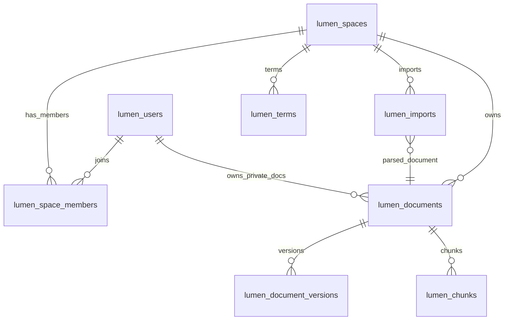

# 06 数据库设计

> 按「完整骨架 + 阶段增量」演进（global-rules §8）。铺出**完整愿景**的全部表；
> `[P1]` 表写全字段 / 索引，`[P2]` / `[愿景]` 表留骨架。
> 表前缀 `lumen_`；每张表可追溯到 REQ。

## 0. 文档元信息

| 项 | 内容 |
|---|---|
| 保留 / 省略决策 | 保留 |
| 决策来源 | `ai/project-rules.md` §3（项目有 PostgreSQL + pgvector 持久化存储） |
| 覆盖 REQ / 模块 | Phase1：空间 / 权限、文档、版本、导入、检索向量、术语管理 |
| 当前状态 | P1 表结构**已落地 PostgreSQL**（Sprint-8 / task-008 T1–T5：8 张 `lumen_*` 表由 `migrations/001-005` 建，后端切 `PgRepository`；`lumen_chunks.embedding vector(512)` + hnsw + ts_vector 由 T4/T6 启用）。内存 `demo_repository` 保留为单测 fake。真实 PDF/OCR 仍降级（RG-003） |
| 最后更新 | 2026-07-10 |

## 1. 表清单（完整）

| 表 | 用途 | 阶段 | 设计状态 | 当前实现状态 | 追溯 |
|---|---|---|---|---|---|
| lumen_users | 账号 | [P1] | P1-已实现 | 已落地 PostgreSQL（migration 001；PgRepository 接入） | REQ-001 基础 |
| lumen_spaces | 空间 | [P1] | P1-已实现 | 已落地 PostgreSQL（migration 001；PgRepository 接入） | REQ-001 |
| lumen_space_members | 成员-空间-角色 | [P1] | P1-已实现 | 已落地 PostgreSQL（migration 001；PgRepository 接入） | REQ-001/002 |
| lumen_documents | 文档 | [P1] | P1-已实现 | 已落地 PostgreSQL（migration 001；PgRepository 接入） | REQ-003/004 |
| lumen_document_versions | 版本历史 | [P1] | P1-已实现 | 已落地 PostgreSQL（migration 002；PgRepository 接入） | REQ-006 |
| lumen_chunks | 切块 + Embedding 向量 + 全文向量 | [P1] | P1-已实现 | 已落地 PostgreSQL（migration 003；T6 起写入 embedding 并用于 RAG 向量召回） | REQ-007/008 |
| lumen_imports | 导入任务 | [P1] | P1-已实现 | 已落地 PostgreSQL（migration 004；当前导入仅 `.md`/`.txt` 已提取文本） | REQ-009/010 |
| lumen_terms | 空间级术语表 | [P1] | P1-已实现 | 已落地 PostgreSQL（migration 004；PgRepository 接入） | REQ-036 |
| lumen_tags | 标签 | [P2] | 骨架 | — | REQ-012 |
| lumen_tag_links | 标签-文档关联 | [P2] | 骨架 | — | REQ-012 |
| lumen_push_copies | 跨空间推送只读副本 | [P2] | 骨架 | — | REQ-015 |
| lumen_vault_mounts | Vault 挂载配置 | [愿景] | 骨架 | — | REQ-018 |
| lumen_audio_records | 录音转写记录 | [愿景] | 骨架 | — | REQ-019 |
| lumen_brief_links | 对外只读简报链接 | [愿景] | 骨架 | — | REQ-022 |
| lumen_doc_links | 文档间内部链接 / 反向链接 | [P2] | 骨架 | — | REQ-026 |
| lumen_external_sync | 外部源同步配置（飞书等） | [愿景] | 骨架 | — | REQ-028 |
| lumen_doc_participants | 文档参与人物（实体抽取） | [愿景] | 骨架 | — | REQ-031 |
| lumen_hypotheses | 假设检验记录 | [愿景] | 骨架 | — | REQ-033 |
| lumen_evidence | 证据条目（支持 / 反对） | [愿景] | 骨架 | — | REQ-033 |
| lumen_signal_subscriptions | 信号追踪主题订阅 | [愿景] | 骨架 | — | REQ-034 |
| lumen_analysis_kits | 分析包（A Kit）配置 | [愿景] | 骨架 | — | REQ-035 |

> 当前实现说明（Sprint-8 / task-008 T1–T5 后）：Phase1 Demo 后端已切 `PgRepository`，**全部 P1 表（8 张）已落地 PostgreSQL**（lumen-pg 容器）。`migrations/001-005` 建表 + demo seed（`db.init_db` 幂等执行）；`lumen_chunks` 含 `embedding vector(512)` + hnsw + ts_vector（T4/T6 启用 embedding 写入与向量召回）。内存 `demo_repository` 保留为单测 fake（不落 PG）。真实 PDF/OCR 仍降级（RG-003）。

## 2. 表结构（[P1] 已设计）

### lumen_users
| 字段 | 类型 | 说明 |
|---|---|---|
| id | bigint PK | |
| external_id | varchar | 外部账号标识 |
| name | varchar | 显示名 |
| created_at | timestamptz | |

### lumen_spaces
| 字段 | 类型 | 说明 |
|---|---|---|
| id | bigint PK | |
| code | varchar UK | 如 `nova-internal` / `brightlite-team` |
| name | varchar | 显示名 |
| created_at | timestamptz | |

### lumen_space_members
| 字段 | 类型 | 说明 |
|---|---|---|
| user_id | bigint FK→users | |
| space_id | bigint FK→spaces | |
| role | varchar | admin / member |
| | PK(user_id, space_id) | |

### lumen_documents
| 字段 | 类型 | 说明 |
|---|---|---|
| id | bigint PK | |
| space_id | bigint FK→spaces | 隔离边界 |
| title | varchar | |
| content_md | text | Markdown 正文 |
| owner_id | bigint FK→users | |
| permission | varchar | private / team / external |
| type | varchar | markdown / index_entry（P1 默认 markdown；P2 快速录入用 index_entry，见 REQ-025） |
| current_version | int | 当前版本号 |
| created_at / updated_at | timestamptz | |
- 索引：`(space_id, permission)` 复合——支撑隔离 + 权限过滤

### lumen_document_versions
| 字段 | 类型 | 说明 |
|---|---|---|
| id | bigint PK | |
| document_id | bigint FK→documents | |
| version_no | int | |
| content_md | text | 该版本正文 |
| editor_id | bigint FK→users | |
| created_at | timestamptz | |
- 约束：`UNIQUE(document_id, version_no)`

### lumen_chunks（pgvector，检索核心 · P1-已实现）
| 字段 | 类型 | 说明 |
|---|---|---|
| id | bigint PK | |
| document_id | bigint FK→documents | |
| ordinal | int | 块序号 |
| text | text | 块原文 |
| embedding | vector(512) | pgvector 向量，对应本机 `bge-small-zh` Embedding（512 维，T6 起写入并用于 RAG 向量召回；RG-001/002 Go） |
| ts_vector | tsvector | 全文检索向量 |
- 索引：hnsw `vector_cosine_ops`（参数见 05）+ `ts_vector` GIN

### lumen_imports
| 字段 | 类型 | 说明 |
|---|---|---|
| id | bigint PK | |
| space_id | bigint FK→spaces | |
| source_filename | varchar | |
| mime | varchar | docx / pdf / image / txt / md（目标态；当前降级导入仅 .txt/.md，可空） |
| status | varchar | processing / done / failed |
| parsed_doc_id | bigint FK→documents | 解析生成/关联的文档 |
| created_by | bigint FK→users | 发起导入的用户（导入状态机审计） |
| chunk_count | int | 成功切块数（complete_import_job 写入） |
| error | text | 失败原因（fail_import_job 写入，可空） |
| created_at | timestamptz | |

### lumen_terms
| 字段 | 类型 | 说明 |
|---|---|---|
| id | bigint PK | |
| space_id | bigint FK→spaces, nullable | 为空表示全局术语；非空表示空间级术语 |
| term | varchar | 标准名称 |
| definition | text | 术语定义 |
| aliases | jsonb | 客户习惯用语 / 非标准称呼 / 偏差说明 |
| owner_id | bigint FK→users | 负责人 |
| status | varchar | confirmed / pending |
| source_document_id | bigint FK→documents, nullable | 术语来源文档 |
| created_at / updated_at | timestamptz | |
- 约束：`UNIQUE(space_id, term)`；同名术语查询时空间级优先于全局术语

### 字段级契约矩阵（[P1]）

> 9 列字段级契约（对照 `ai/doc-standards/06-db-design.md §4.2`）。字段语义说明见上方各表简表。Sprint-8 后 P1 表已由 `migrations/001-005` 落地 PostgreSQL；真实 Word / PDF 解析与 OCR 仍按 RG-003 降级。

| 表 | 字段 | 类型 | 必填 | 默认值 | 约束 | 来源 REQ | 敏感性 | 留存 / 删除 |
|---|---|---|---|---|---|---|---|---|
| lumen_users | id | bigint PK | 是 | — | PK | REQ-001 | 低 | 随账号删除 |
| lumen_users | external_id | varchar | 是 | — | 唯一（登录标识） | REQ-001 | 中 | 随账号删除 |
| lumen_users | name | varchar | 是 | — | — | REQ-001 | 低 | 随账号删除 |
| lumen_users | created_at | timestamptz | 是 | now() | — | REQ-001 | 低 | 随账号删除 |
| lumen_spaces | id | bigint PK | 是 | — | PK | REQ-001 | 低 | 随空间删除 |
| lumen_spaces | code | varchar | 是 | — | UK | REQ-001 | 低 | 随空间删除 |
| lumen_spaces | name | varchar | 是 | — | — | REQ-001 | 低 | 随空间删除 |
| lumen_spaces | created_at | timestamptz | 是 | now() | — | REQ-001 | 低 | 随空间删除 |
| lumen_space_members | user_id | bigint FK | 是 | — | FK→users, PK(user,space) | REQ-001/002 | 低 | 随成员关系删除 |
| lumen_space_members | space_id | bigint FK | 是 | — | FK→spaces | REQ-001/002 | 低 | 随成员关系删除 |
| lumen_space_members | role | varchar | 是 | — | admin / member | REQ-001/002 | 低 | 随成员关系删除 |
| lumen_documents | id | bigint PK | 是 | — | PK | REQ-004 | 低 | 随文档删除 |
| lumen_documents | space_id | bigint FK | 是 | — | FK→spaces, 索引(space,permission) | REQ-003/004 | 低 | 隔离边界 |
| lumen_documents | title | varchar | 是 | — | — | REQ-004 | 低 | 随文档删除 |
| lumen_documents | content_md | text | 是 | — | — | REQ-004/008 | 中 | 随文档；目标切块发外部 LLM |
| lumen_documents | owner_id | bigint FK | 是 | — | FK→users | REQ-003 | 低 | 随文档删除 |
| lumen_documents | permission | varchar | 是 | — | private / team / external | REQ-003 | 低 | 随文档删除 |
| lumen_documents | type | varchar | 是 | markdown | markdown / index_entry | REQ-004/025 | 低 | 随文档删除 |
| lumen_documents | current_version | int | 是 | 1 | — | REQ-006 | 低 | 随文档删除 |
| lumen_documents | created_at / updated_at | timestamptz | 是 | now() | — | REQ-004 | 低 | 随文档删除 |
| lumen_document_versions | id | bigint PK | 是 | — | PK | REQ-006 | 低 | 随版本删除 |
| lumen_document_versions | document_id | bigint FK | 是 | — | FK→documents | REQ-006 | 低 | 随文档删除 |
| lumen_document_versions | version_no | int | 是 | — | UNIQUE(document_id, version_no) | REQ-006 | 低 | 随版本删除 |
| lumen_document_versions | content_md | text | 是 | — | — | REQ-006 | 中 | 随版本；目标发外部 LLM |
| lumen_document_versions | editor_id | bigint FK | 是 | — | FK→users | REQ-006 | 低 | 随版本删除 |
| lumen_document_versions | created_at | timestamptz | 是 | now() | — | REQ-006 | 低 | 随版本删除 |
| lumen_chunks | id | bigint PK | 是 | — | PK | REQ-007/008 | 低 | 随文档删除 |
| lumen_chunks | document_id | bigint FK | 是 | — | FK→documents | REQ-007/008 | 低 | 随文档删除 |
| lumen_chunks | ordinal | int | 是 | — | — | REQ-007 | 低 | 随文档删除 |
| lumen_chunks | text | text | 是 | — | — | REQ-007/008 | 中 | 随文档；目标召回片段发外部 LLM |
| lumen_chunks | embedding | vector(512) | 目标 | — | pgvector 近邻索引（目标） | REQ-008 | 中 | 随文档；目标态未落地 |
| lumen_chunks | ts_vector | tsvector | 目标 | — | GIN（目标） | REQ-007 | 低 | 随文档；目标态未落地 |
| lumen_imports | id | bigint PK | 是 | — | PK | REQ-009 | 低 | 随导入任务删除 |
| lumen_imports | space_id | bigint FK | 是 | — | FK→spaces | REQ-009 | 低 | 随导入任务删除 |
| lumen_imports | source_filename | varchar | 是 | — | — | REQ-009 | 低 | 随导入任务删除 |
| lumen_imports | mime | varchar | 否 | — | docx / pdf / image / txt / md（目标态；当前降级不用） | REQ-009 | 低 | 随导入任务删除 |
| lumen_imports | status | varchar | 是 | processing | processing / done / failed（见 07 §3.6） | REQ-009 | 低 | 随导入任务删除 |
| lumen_imports | parsed_doc_id | bigint FK | 否 | — | FK→documents | REQ-009 | 低 | 随导入任务删除 |
| lumen_imports | created_by | bigint FK | 是 | — | FK→users | REQ-009 | 低 | 随导入任务删除 |
| lumen_imports | chunk_count | int | 是 | 0 | — | REQ-009 | 低 | 随导入任务删除 |
| lumen_imports | error | text | 否 | — | — | REQ-009 | 低 | 随导入任务删除 |
| lumen_imports | created_at | timestamptz | 是 | now() | — | REQ-009 | 低 | 随导入任务删除 |
| lumen_terms | id | bigint PK | 是 | — | PK | REQ-036 | 低 | 随术语删除 |
| lumen_terms | space_id | bigint FK | 否 | — | FK→spaces, nullable（空=全局术语） | REQ-036 | 低 | 随术语删除 |
| lumen_terms | term | varchar | 是 | — | UNIQUE(space_id, term) | REQ-036 | 低 | 随术语删除 |
| lumen_terms | definition | text | 是 | — | — | REQ-036 | 中 | 随术语；目标注入 RAG 发外部 LLM |
| lumen_terms | aliases | jsonb | 否 | — | — | REQ-036 | 低 | 随术语删除 |
| lumen_terms | owner_id | bigint FK | 是 | — | FK→users | REQ-036 | 低 | 随术语删除 |
| lumen_terms | status | varchar | 是 | pending | confirmed / pending | REQ-036 | 低 | 随术语删除 |
| lumen_terms | source_document_id | bigint FK | 否 | — | FK→documents, nullable | REQ-036 | 低 | 随术语删除 |
| lumen_terms | created_at / updated_at | timestamptz | 是 | now() | — | REQ-036 | 低 | 随术语删除 |

### [P2] / [愿景] 表（骨架·待该阶段细化）
- `lumen_tags` / `lumen_tag_links`：标签模型与聚合规则待 P2 细化（REQ-012）
- `lumen_push_copies`：跨空间只读副本与权限同步待 P2 细化（REQ-015）
- `lumen_vault_mounts`：Vault 挂载（路径、账号绑定、只读索引）待愿景验证（REQ-018）
- `lumen_audio_records`：录音转写记录待愿景验证（REQ-019）
- `lumen_brief_links`：对外简报（token、有效期、AI 可问不可看原文）待愿景验证（REQ-022）
- `lumen_doc_links`：内部链接 `[[文件名]]` 与反向链接索引（P2，REQ-026）
- `lumen_external_sync`：外部源（飞书等）同步配置与摘要同步（愿景，REQ-028）
- `lumen_doc_participants`：文档参与人物、共现统计（愿景，REQ-031）
- `lumen_hypotheses` / `lumen_evidence`：假设检验与正反证据（愿景，REQ-033）
- `lumen_signal_subscriptions`：信号追踪主题订阅（愿景，REQ-034）
- `lumen_analysis_kits`：分析包 A Kit 配置（愿景，REQ-035）

## 3. 索引设计

- `lumen_chunks`：向量近邻索引 + `ts_vector` GIN（全文）——检索双路召回的基础
- `lumen_documents`：`(space_id, permission)` 复合——隔离 + 权限过滤
- `lumen_document_versions`：`UNIQUE(document_id, version_no)`
- `lumen_terms`：`UNIQUE(space_id, term)` + `term` 前缀 / trigram 索引（具体索引待 05 钉）——支撑文档术语识别

## 4. 表间关系

`lumen_documents.permission` / `owner_id` 与 `lumen_space_members` 共同决定可见性（见 `docs/design/permissions.md`）；`lumen_terms` 中空间术语优先于全局术语。

## 5. 数据安全与留存

> 对照 `ai/doc-standards/06-db-design.md §4.5`（吸收 `docs/05-tech-spec.md` 数据安全面）。
> **外部传输限制总则**：Sprint-7 起 RAG **已调用外部 LLM**（GLM 中转，RG-004 Go；可配置 Mock 降级），故召回片段（`lumen_chunks.text` / 术语定义）**会发往 LLM**。发往模型前须过滤敏感片段、优先避免发送真实团队文档（见 `ai/project-rules.md §2.5`、`docs/05-tech-spec.md`）。Embedding 为本机 `bge-small-zh`，**不外发**（RG-002）。

| 数据 / 表 / 字段 | 敏感性 | 访问控制 | 脱敏 / 加密 | 留存 / 删除 | 外部传输限制 | 验证入口 |
|---|---|---|---|---|---|---|
| lumen_documents.content_md | 中 | space + permission 过滤 | 明文存储（不脱敏） | 随文档删除 | 切块后作为召回片段发外部 LLM（RG-004；可配 Mock 不发） | TC-P1-008 |
| lumen_document_versions.content_md | 中 | space + permission | 明文 | 随版本 / 文档删除 | 同上（仅当前版本参与召回） | TC-P1-006 |
| lumen_chunks.text | 中 | 经 document_id 间接受 space + permission 过滤 | 明文 | 随文档删除 | 召回片段发外部 LLM（RAG 向量 + 关键词召回，PG 存储） | TC-P1-007/008 |
| lumen_chunks.embedding | 中 | 同 text | 向量（非原文） | 随文档删除 | 不外发（本机 bge-small-zh 生成，RG-002；T6 起写入此列） | TC-P1-008 |
| lumen_terms.definition | 中 | space 成员可见 | 明文 | 随术语删除 | 已注入 RAG prompt；Sprint-7 起可随召回上下文发往外部 LLM（RG-004；可配 Mock 不发） | TC-P1-012 |
| lumen_terms.aliases | 低 | space 成员可见 | — | 随术语删除 | 同 definition | TC-P1-012 |
| lumen_users.external_id | 中 | 仅本人 / 系统 | — | 账号删除时清理 | 不外发 | TC-P1-001 |

## 6. REQ → 表 / TC / Sprint 追溯矩阵

> 在原 REQ→表 正向追溯上补 `TC-ID`（见 09 §2）与 `Sprint`（见 08 当前进度记录）反向列，闭合 `REQ → 表/字段 → TC → Sprint` 追溯链。

| REQ | 相关表 | TC-ID | Sprint | 说明 |
|---|---|---|---|---|
| REQ-001 / 002 | `lumen_users`、`lumen_spaces`、`lumen_space_members` | TC-P1-001 / 002 | Sprint-1 | 账号、空间与成员关系支撑隔离和切换 |
| REQ-003 | `lumen_documents`、`lumen_space_members` | TC-P1-003 | Sprint-1 | 文档权限、作者与空间成员共同决定可见性 |
| REQ-004 / 005 | `lumen_documents` | TC-P1-004 / 005 | Sprint-2 | 文档 CRUD 与行内编辑持久化 |
| REQ-006 | `lumen_document_versions` | TC-P1-006 | Sprint-2 | 保存历史版本并支持恢复 |
| REQ-007 / 008 | `lumen_documents`、`lumen_chunks` | TC-P1-007 / 008 | Sprint-4 | 全文 / 向量检索与 RAG 来源引用 |
| REQ-009 / 010 | `lumen_imports`、`lumen_documents`、`lumen_chunks` | TC-P1-009 / 010 | Sprint-3 | 导入任务、解析产物与切块索引 |
| REQ-011 | 全部 P1 表 | TC-P1-011 | Sprint-6 | 桌面端通过 API 覆盖全部 P1 功能 |
| REQ-036 | `lumen_terms`、`lumen_documents`、`lumen_chunks` | TC-P1-012 | Sprint-5 | 空间术语维护、识别与问答口径对齐 |
| REQ-012..017 / 024..027 | P2 表骨架 | — | — | 升 Phase2 时细化字段与索引 |
| REQ-018..023 / 028..035 | 愿景表骨架 | — | — | 技术验证通过后细化字段与索引 |

## 7. 待人工确认项

- 无新增确认项；P2 / 愿景表仅保留骨架，不进入 Phase1 迁移实现。
