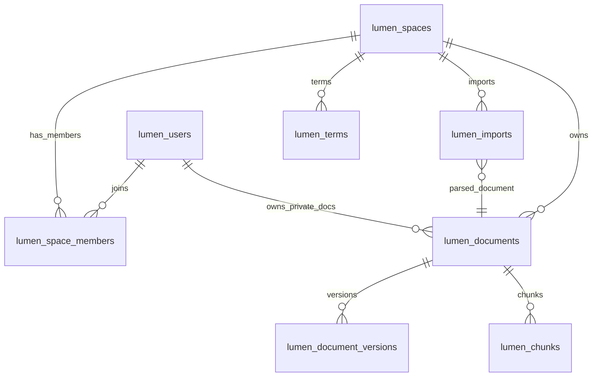

# 06 数据库设计

> 按「完整骨架 + 阶段增量」演进（global-rules §8）。铺出**完整愿景**的全部表；
> `[P1]` 表写全字段 / 索引，`[P2]` / `[愿景]` 表留骨架。
> 表前缀 `lumen_`；每张表可追溯到 REQ。

## 0. 文档元信息

| 项 | 内容 |
|---|---|
| 保留 / 省略决策 | 保留 |
| 决策来源 | `ai/project-rules.md` §3（项目有 PostgreSQL + pgvector 持久化存储） |
| 覆盖 REQ / 模块 | Phase1：空间 / 权限、文档、版本、导入、检索向量、术语管理 |
| 当前状态 | P1 表结构为**目标设计**；当前实现为内存 `demo_repository`，**全部 P1 表均未在 PostgreSQL 落地**（迁移 `001/002` 已写未接线，`lumen_chunks`/`lumen_imports`/`lumen_terms` 无迁移）。真实化见 `docs/05-tech-spec.md §5.1` RG-001/002，移至 Phase2/MVP |
| 最后更新 | 2026-07-09 |

## 1. 表清单（完整）

| 表 | 用途 | 阶段 | 设计状态 | 当前实现状态 | 追溯 |
|---|---|---|---|---|---|
| lumen_users | 账号 | [P1] | P1-已设计 | 目标设计（迁移 001 已写未接线；当前内存） | REQ-001 基础 |
| lumen_spaces | 空间 | [P1] | P1-已设计 | 目标设计（迁移 001 已写未接线；当前内存） | REQ-001 |
| lumen_space_members | 成员-空间-角色 | [P1] | P1-已设计 | 目标设计（迁移 001 已写未接线；当前内存） | REQ-001/002 |
| lumen_documents | 文档 | [P1] | P1-已设计 | 目标设计（迁移 001 已写未接线；当前内存） | REQ-003/004 |
| lumen_document_versions | 版本历史 | [P1] | P1-已设计 | 目标设计（迁移 002 已写未接线；当前内存） | REQ-006 |
| lumen_chunks | 切块 + Embedding 向量 + 全文向量 | [P1] | P1-已设计 | **目标设计（未迁移；依赖 pgvector + Embedding，当前无向量检索）** | REQ-007/008 |
| lumen_imports | 导入任务 | [P1] | P1-已设计 | **目标设计（未迁移；当前导入仅 `.md`/`.txt` 已提取文本）** | REQ-009/010 |
| lumen_terms | 空间级术语表 | [P1] | P1-已设计 | 目标设计（未迁移；当前内存） | REQ-036 |
| lumen_tags | 标签 | [P2] | 骨架 | — | REQ-012 |
| lumen_tag_links | 标签-文档关联 | [P2] | 骨架 | — | REQ-012 |
| lumen_push_copies | 跨空间推送只读副本 | [P2] | 骨架 | — | REQ-015 |
| lumen_vault_mounts | Vault 挂载配置 | [愿景] | 骨架 | — | REQ-018 |
| lumen_audio_records | 录音转写记录 | [愿景] | 骨架 | — | REQ-019 |
| lumen_brief_links | 对外只读简报链接 | [愿景] | 骨架 | — | REQ-022 |
| lumen_doc_links | 文档间内部链接 / 反向链接 | [P2] | 骨架 | — | REQ-026 |
| lumen_external_sync | 外部源同步配置（飞书等） | [愿景] | 骨架 | — | REQ-028 |
| lumen_doc_participants | 文档参与人物（实体抽取） | [愿景] | 骨架 | — | REQ-031 |
| lumen_hypotheses | 假设检验记录 | [愿景] | 骨架 | — | REQ-033 |
| lumen_evidence | 证据条目（支持 / 反对） | [愿景] | 骨架 | — | REQ-033 |
| lumen_signal_subscriptions | 信号追踪主题订阅 | [愿景] | 骨架 | — | REQ-034 |
| lumen_analysis_kits | 分析包（A Kit）配置 | [愿景] | 骨架 | — | REQ-035 |

> 当前实现说明：Phase1 Demo 后端为内存 `demo_repository`，**全部 P1 表均未在 PostgreSQL 落地**。`backend/migrations/001_sprint1_space_permissions.sql`、`002_sprint2_document_versions.sql` 已编写（users / spaces / members / documents、versions）但未接线（后端仍走内存仓储）；`lumen_chunks` / `lumen_imports` / `lumen_terms` 无迁移。pgvector + Embedding 真实化见 `docs/05-tech-spec.md §5.1` RG-001/002，移至 Phase2/MVP。

## 2. 表结构（[P1] 已设计）

### lumen_users
| 字段 | 类型 | 说明 |
|---|---|---|
| id | bigint PK | |
| external_id | varchar | 外部账号标识 |
| name | varchar | 显示名 |
| created_at | timestamptz | |

### lumen_spaces
| 字段 | 类型 | 说明 |
|---|---|---|
| id | bigint PK | |
| code | varchar UK | 如 `nova-internal` / `brightlite-team` |
| name | varchar | 显示名 |
| created_at | timestamptz | |

### lumen_space_members
| 字段 | 类型 | 说明 |
|---|---|---|
| user_id | bigint FK→users | |
| space_id | bigint FK→spaces | |
| role | varchar | admin / member |
| | PK(user_id, space_id) | |

### lumen_documents
| 字段 | 类型 | 说明 |
|---|---|---|
| id | bigint PK | |
| space_id | bigint FK→spaces | 隔离边界 |
| title | varchar | |
| content_md | text | Markdown 正文 |
| owner_id | bigint FK→users | |
| permission | varchar | private / team / external |
| type | varchar | markdown / index_entry（P1 默认 markdown；P2 快速录入用 index_entry，见 REQ-025） |
| current_version | int | 当前版本号 |
| created_at / updated_at | timestamptz | |
- 索引：`(space_id, permission)` 复合——支撑隔离 + 权限过滤

### lumen_document_versions
| 字段 | 类型 | 说明 |
|---|---|---|
| id | bigint PK | |
| document_id | bigint FK→documents | |
| version_no | int | |
| content_md | text | 该版本正文 |
| editor_id | bigint FK→users | |
| created_at | timestamptz | |
- 约束：`UNIQUE(document_id, version_no)`

### lumen_chunks（pgvector，检索核心 · 目标设计，当前未落地）
| 字段 | 类型 | 说明 |
|---|---|---|
| id | bigint PK | |
| document_id | bigint FK→documents | |
| ordinal | int | 块序号 |
| text | text | 块原文 |
| embedding | vector(512) | pgvector 向量，对应本机 `bge-small-zh` Embedding |
| ts_vector | tsvector | 全文检索向量 |
- 索引：向量近邻（ivfflat / hnsw，参数待 05）+ `ts_vector` GIN

### lumen_imports
| 字段 | 类型 | 说明 |
|---|---|---|
| id | bigint PK | |
| space_id | bigint FK→spaces | |
| source_filename | varchar | |
| mime | varchar | docx / pdf / image |
| status | varchar | processing / done / failed |
| parsed_doc_id | bigint FK→documents | 解析生成/关联的文档 |
| created_at | timestamptz | |

### lumen_terms
| 字段 | 类型 | 说明 |
|---|---|---|
| id | bigint PK | |
| space_id | bigint FK→spaces, nullable | 为空表示全局术语；非空表示空间级术语 |
| term | varchar | 标准名称 |
| definition | text | 术语定义 |
| aliases | jsonb | 客户习惯用语 / 非标准称呼 / 偏差说明 |
| owner_id | bigint FK→users | 负责人 |
| status | varchar | confirmed / pending |
| source_document_id | bigint FK→documents, nullable | 术语来源文档 |
| created_at / updated_at | timestamptz | |
- 约束：`UNIQUE(space_id, term)`；同名术语查询时空间级优先于全局术语

### [P2] / [愿景] 表（骨架·待该阶段细化）
- `lumen_tags` / `lumen_tag_links`：标签模型与聚合规则待 P2 细化（REQ-012）
- `lumen_push_copies`：跨空间只读副本与权限同步待 P2 细化（REQ-015）
- `lumen_vault_mounts`：Vault 挂载（路径、账号绑定、只读索引）待愿景验证（REQ-018）
- `lumen_audio_records`：录音转写记录待愿景验证（REQ-019）
- `lumen_brief_links`：对外简报（token、有效期、AI 可问不可看原文）待愿景验证（REQ-022）
- `lumen_doc_links`：内部链接 `[[文件名]]` 与反向链接索引（P2，REQ-026）
- `lumen_external_sync`：外部源（飞书等）同步配置与摘要同步（愿景，REQ-028）
- `lumen_doc_participants`：文档参与人物、共现统计（愿景，REQ-031）
- `lumen_hypotheses` / `lumen_evidence`：假设检验与正反证据（愿景，REQ-033）
- `lumen_signal_subscriptions`：信号追踪主题订阅（愿景，REQ-034）
- `lumen_analysis_kits`：分析包 A Kit 配置（愿景，REQ-035）

## 3. 索引设计

- `lumen_chunks`：向量近邻索引 + `ts_vector` GIN（全文）——检索双路召回的基础
- `lumen_documents`：`(space_id, permission)` 复合——隔离 + 权限过滤
- `lumen_document_versions`：`UNIQUE(document_id, version_no)`
- `lumen_terms`：`UNIQUE(space_id, term)` + `term` 前缀 / trigram 索引（具体索引待 05 钉）——支撑文档术语识别

## 4. 表间关系

`lumen_documents.permission` / `owner_id` 与 `lumen_space_members` 共同决定可见性（见 `docs/design/permissions.md`）；`lumen_terms` 中空间术语优先于全局术语。

## 5. REQ → 表追溯矩阵

| REQ | 相关表 | 说明 |
|---|---|---|
| REQ-001 / 002 | `lumen_users`、`lumen_spaces`、`lumen_space_members` | 账号、空间与成员关系支撑隔离和切换 |
| REQ-003 | `lumen_documents`、`lumen_space_members` | 文档权限、作者与空间成员共同决定可见性 |
| REQ-004 / 005 | `lumen_documents` | 文档 CRUD 与行内编辑持久化 |
| REQ-006 | `lumen_document_versions` | 保存历史版本并支持恢复 |
| REQ-007 / 008 | `lumen_documents`、`lumen_chunks` | 全文 / 向量检索与 RAG 来源引用 |
| REQ-009 / 010 | `lumen_imports`、`lumen_documents`、`lumen_chunks` | 导入任务、解析产物与切块索引 |
| REQ-011 | 全部 P1 表 | 桌面端通过 API 覆盖全部 P1 功能 |
| REQ-036 | `lumen_terms`、`lumen_documents`、`lumen_chunks` | 空间术语维护、识别与问答口径对齐 |
| REQ-012..017 / 024..027 | P2 表骨架 | 升 Phase2 时细化字段与索引 |
| REQ-018..023 / 028..035 | 愿景表骨架 | 技术验证通过后细化字段与索引 |

## 6. 待人工确认项

- 无新增确认项；P2 / 愿景表仅保留骨架，不进入 Phase1 迁移实现。
