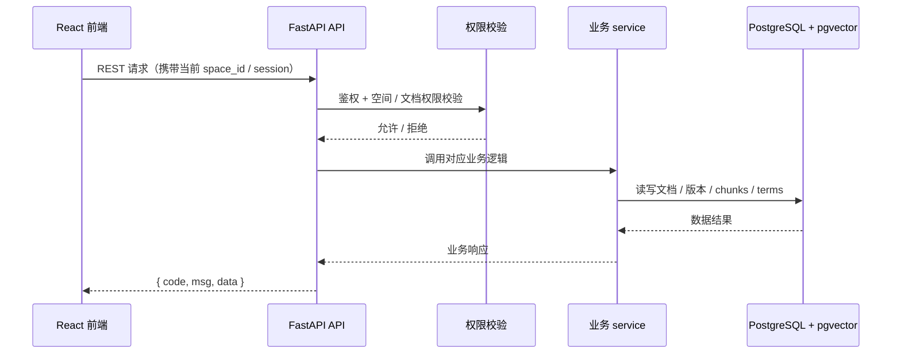

# 07 API设计

> RESTful，统一响应格式。按「完整骨架 + 阶段增量」：铺**完整**接口清单，`[P1]` 写细，其余骨架。
> 每个接口对应一个功能点 / REQ。

## 0. 文档元信息

| 项 | 内容 |
|---|---|
| 保留 / 省略决策 | 保留 |
| 接口形态 | REST API |
| 覆盖 REQ / 模块 | Phase1：REQ-001..REQ-011、REQ-036；P2 / 愿景接口保留骨架 |
| 当前状态 | P1 接口契约已用于 Phase1 Demo；Sprint-8 后 P1 主要接口已接 PostgreSQL 表，RAG 已接 pgvector 向量召回 + GLM LLM。仍降级：API-011 仅 `.md`/`.txt` 已提取文本，API-009 search 向量化留后续 |
| 最后更新 | 2026-07-10 |

## 1. 统一约定

- **鉴权**：Phase1 使用 Demo Bearer Token；`POST /api/auth/login` 返回 HMAC-SHA256 签名 token，前端通过 `Authorization: Bearer <token>` 传递；token 载荷包含 `user_id`、`current_space_id`、`exp`，默认有效期 8 小时。`POST /api/spaces/switch` 校验成员关系后返回带新 `current_space_id` 的 token。
- **权限**：空间 + 文档两级校验；列表 / 搜索 / RAG 均按 `current_space_id` 与文档 `permission` 过滤。
- **响应**：统一 `{ code, msg, data }`；成功 `code=0`；列表分页 `{ items, total, page }`。
- **错误码体系**：HTTP 状态码表达协议层结果，`code` 表达业务结果：`0` 成功，`4001` 未登录 / token 无效，`4003` 无权限，`4004` 资源不存在，`4090` 业务冲突，`4220` 参数校验失败，`5000` 服务端错误，`5030` 外部 AI / OCR 服务不可用。

## 2. 接口清单（完整）

> 每个接口有稳定 `API-ID`（连续编号，阶段列区分 `[P1]`/`[P2]`/`[愿景]`，ID 不随阶段变更）。字段级契约见 §3。

| API-ID | 方法 | 路径 | 用途 | 阶段 | 设计状态 | 当前实现状态 | 追溯 REQ |
|---|---|---|---|---|---|---|---|
| API-001 | POST | /api/auth/login | 登录 | [P1] | P1-已实现 | 已实现（PG 用户 / 空间关系；Demo token） | REQ-001 基础 |
| API-002 | GET | /api/spaces | 列出我的空间 | [P1] | P1-已实现 | 已实现（PG 空间 / 成员） | REQ-001/002 |
| API-003 | POST | /api/spaces/switch | 切换当前空间 | [P1] | P1-已实现 | 已实现（PG 成员校验） | REQ-002 |
| API-004 | GET | /api/documents | 文档列表 | [P1] | P1-已实现 | 已实现（PG 文档 + 权限过滤） | REQ-004 |
| API-005 | POST | /api/documents | 创建文档 | [P1] | P1-已实现 | 已实现（PG 文档持久化） | REQ-004 |
| API-006 | GET/PUT/DELETE | /api/documents/{id} | 读/改/删 | [P1] | P1-已实现 | 已实现（PG 文档 + 权限过滤） | REQ-004/005 |
| API-007 | GET | /api/documents/{id}/versions | 版本列表 | [P1] | P1-已实现 | 已实现（PG 版本历史） | REQ-006 |
| API-008 | POST | /api/documents/{id}/versions/{v}/restore | 恢复版本 | [P1] | P1-已实现 | 已实现（PG 版本恢复） | REQ-006 |
| API-009 | GET | /api/search?q= | 全文搜索 | [P1] | P1-部分实现 | 已实现（关键词检索·PG；向量搜索留后续） | REQ-007 |
| API-010 | POST | /api/query | RAG 问答 | [P1] | P1-已实现 | 已实现（pgvector 向量召回 + GLM LLM；可配 Mock） | REQ-008 |
| API-011 | POST | /api/import | 导入文件 | [P1] | P1-已设计 | **降级实现（仅 `.md`/`.txt` 已提取文本；无 PDF/OCR）** | REQ-009/010 |
| API-012 | GET/POST | /api/terms | 术语列表 / 创建术语 | [P1] | P1-已实现 | 已实现（PG 术语存储） | REQ-036 |
| API-013 | GET/PUT/DELETE | /api/terms/{id} | 术语详情 / 更新 / 删除 | [P1] | P1-已实现 | 已实现（PG 术语存储） | REQ-036 |
| API-014 | GET/POST | /api/tags | 标签列表 / 创建标签 | [P2] | 契约草案 | — | REQ-012 |
| API-015 | POST | /api/spaces/push | 跨空间推送 | [P2] | 骨架 | — | REQ-015 |
| API-016 | GET | /api/briefs/{token} | 对外只读简报 | [愿景] | 骨架 | — | REQ-022 |
| API-017 | POST | /api/quick-entry | 快速录入索引条目 | [P2] | 契约草案 | — | REQ-025 |
| API-018 | GET/POST | /api/doc-links | 内部链接 / 反向链接 | [P2] | 契约草案 | — | REQ-026 |
| API-019 | POST | /api/export-pdf | 单文档导出 PDF | [P2] | 契约草案 | — | REQ-027 |
| API-020 | POST | /api/sync/feishu | 飞书同步（webhook/拉取） | [愿景] | 骨架 | — | REQ-028 |
| API-021 | POST | /api/path | 路径推理（多跳） | [愿景] | 骨架 | — | REQ-030 |
| API-022 | GET | /api/people/{name} | 人物关系网络 | [愿景] | 骨架 | — | REQ-031 |
| API-023 | GET | /api/conflicts | 矛盾检测 | [愿景] | 骨架 | — | REQ-032 |
| API-024 | POST | /api/hypotheses | 假设检验 / 证据地图 | [愿景] | 骨架 | — | REQ-033 |
| API-025 | GET/POST | /api/signal-tracks | 信号追踪 | [愿景] | 骨架 | — | REQ-034 |
| API-026 | POST | /api/kits | 分析包 A Kit | [愿景] | 骨架 | — | REQ-035 |
| API-027 | GET/PUT/DELETE | /api/tags/{id} | 标签详情 / 更新 / 归档 | [P2] | 契约草案 | — | REQ-012 |
| API-028 | POST | /api/documents/{id}/polish | AI 润色 / 写作引用 | [P2] | 契约草案 | — | REQ-014 |

## 3. 请求 / 响应契约（[P1]）

> 以下为 P1 Demo 接口契约：`/api/query` 已接 pgvector 向量召回 + GLM LLM；`/api/search` 已落 PG 关键词检索，向量搜索留后续；`/api/import` 仅 `.md`/`.txt` 已提取文本（无真实 PDF/OCR）。逐接口状态见 §2「当前实现状态」。`[P2]`/`[愿景]` 接口保留骨架，升阶段时补字段级契约。

### 3.1 Endpoint contract matrix

> P1 接口契约状态按 §2 当前实现状态区分 `P1-已实现` / `P1-部分实现` / `降级实现`。请求/响应契约列指向字段级（§3.2/3.3）或示例（§3.7）。

| API-ID | 契约状态 | 请求/响应契约 | 错误契约 | 权限契约 | 验证项 (TC) | 是否可实现 |
|---|---|---|---|---|---|---|
| API-001 | P1-已实现 | §3.2 / §3.3 | 4001 | 鉴权基线 | TC-P1-001 | 是 |
| API-002 | P1-已实现 | §3.7 示例 | 4001 | 空间成员 | TC-P1-001/002 | 是 |
| API-003 | P1-已实现 | §3.7 示例 | 4001/4003 | 空间成员 | TC-P1-002 | 是 |
| API-004 | P1-已实现 | §3.7 示例 | 4001 | 空间过滤 | TC-P1-004 | 是 |
| API-005 | P1-已实现 | §3.2 | 4001/4220 | 空间过滤 | TC-P1-004 | 是 |
| API-006 | P1-已实现 | §3.7 示例 | 4001/4004 | 空间+权限 | TC-P1-004/005 | 是 |
| API-007 | P1-已实现 | §3.7 示例 | 4001/4004 | 空间+权限 | TC-P1-006 | 是 |
| API-008 | P1-已实现 | §3.7 示例 | 4001/4004 | 空间+权限 | TC-P1-006 | 是 |
| API-009 | 已实现（关键词检索·PG 落地；向量搜索留后续小 PR） | §3.7 示例 | 4001/4220 | 空间过滤 | TC-P1-007 | 是 |
| API-010 | 已实现（向量召回 + GLM LLM；可配 Mock 降级） | §3.2 / §3.3 | 4001/4220 | 空间过滤 | TC-P1-008 | 是 |
| API-011 | 降级实现（仅 `.md`/`.txt`） | §3.2 / §3.3 | 4001/4003/4220 | 空间过滤 | TC-P1-009/010 | 是 |
| API-012 | P1-已实现 | §3.2 / §3.3 | 4001/4003/4220 | 空间成员 | TC-P1-012 | 是 |
| API-013 | P1-已实现 | §3.7 示例 | 4001/4003/4004 | 空间+权限 | TC-P1-012 | 是 |

### 3.1.1 Phase2 MVP endpoint contract matrix（Batch B 草案）

> 本节只补 Phase2 MVP 核心 5 项契约草案，不代表已实现。正式编码前需与 `docs/06-db-design.md` 的 P2 表契约、`docs/09-verification.md` 的 TC-P2-* 用例和首个 vertical slice 选择对齐。

| API-ID | 契约状态 | 请求 / 响应契约 | 错误契约 | 权限契约 | 验证项 (TC) | 是否可实现 |
|---|---|---|---|---|---|---|
| API-014 | P2-契约草案 | §3.9 | 4001/4003/4090/4220 | 空间成员；标签仅当前空间可见 | TC-P2-TAG-001 | 待阶段确认 |
| API-027 | P2-契约草案 | §3.9 | 4001/4003/4004/4090/4220 | 空间成员；归档不删除历史关联 | TC-P2-TAG-001 | 待阶段确认 |
| API-017 | P2-契约草案 | §3.9 | 4001/4003/4220 | 默认 owner 私有；转换后继承文档权限 | TC-P2-QUICK-001 | 待阶段确认 |
| API-018 | P2-契约草案 | §3.9 | 4001/4003/4004/4220 | source / target 文档均需权限过滤；无权限反链不泄露 | TC-P2-LINK-001 | 待阶段确认 |
| API-028 | P2-契约草案 | §3.9 | 4001/4003/4004/4220/5030 | 文档可写权限；引用 chunk 必须当前用户可见 | TC-P2-AI-001 | 待阶段确认 |
| API-019 | P2-契约草案 | §3.9 | 4001/4003/4004/4220/5030 | 导出前校验源文档可见 / 可导出 | TC-P2-PDF-001 | 待 RG-006 |

### 3.2 请求 / 输入契约（字段级·核心接口）

> 其余接口请求字段见 §3.7 示例 payload。

| API-ID | 字段 / 参数 | 位置 | 类型 | 必填 | 校验 | 示例 | 来源 REQ |
|---|---|---|---|---|---|---|---|
| API-001 | account | body | string | 是 | 非空 | `"nova"` | REQ-001 |
| API-001 | password | body | string | 是 | 非空 | `"***"` | REQ-001 |
| API-005 | space_id | token | string | 是 | 当前空间 | `"brightlite-team"` | REQ-004 |
| API-005 | title | body | string | 是 | 非空 | `"场景联动分析"` | REQ-004 |
| API-005 | content_md | body | string | 是 | Markdown | `"# …"` | REQ-004 |
| API-005 | permission | body | enum | 是 | private/team/external | `"team"` | REQ-003/004 |
| API-010 | space_id | token | string | 是 | 当前空间 | `"brightlite-team"` | REQ-008 |
| API-010 | question | body | string | 是 | 非空、≤上限 | `"场景联动延迟？"` | REQ-008 |
| API-011 | space_id | form | string | 是 | 当前空间 | `"brightlite-team"` | REQ-009 |
| API-011 | file | form | file | 是 | `.md`/`.txt`（目标含 .docx/.pdf/图片） | `notes.md` | REQ-009/010 |
| API-012 | space_id | query | string | 是 | 当前空间 | `"brightlite-team"` | REQ-036 |
| API-012 | q | query | string | 否 | 可选筛选 | `"触发"` | REQ-036 |
| API-012 | status | query | enum | 否 | confirmed/pending | `"confirmed"` | REQ-036 |
| API-012 | term | body | string | 是（POST） | 非空、空间内唯一 | `"触发延迟"` | REQ-036 |
| API-012 | definition | body | string | 是（POST） | 非空 | `"从触发到指令发出"` | REQ-036 |
| API-012 | aliases | body | string[] | 否 | 习惯用语 | `["开关延迟"]` | REQ-036 |

### 3.3 响应 / 输出契约（字段级·核心接口）

| API-ID | 字段 | 类型 | 必填 | 数据来源 / 表字段 | 敏感性 | 脱敏 / 过滤 |
|---|---|---|---|---|---|---|
| API-001 | token | string | 是 | HMAC 签名生成 | 高 | 仅返回一次，前端内存保存 |
| API-001 | current_space_id | string | 是 | token 载荷 | 中 | — |
| API-010 | answer | string | 是 | adapter（配 .env → LLM 生成；默认降级模板） | 中 | 库外返回「未找到」，不编造 |
| API-010 | sources[].doc_id | string | 是 | lumen_documents.id | 低 | 权限过滤后返回 |
| API-010 | sources[].snippet | string | 是 | lumen_chunks.text（目标）/ content_md 切片 | 中 | 仅当前空间、权限可见文档 |
| API-011 | import_id | string | 是 | lumen_imports.id | 低 | — |
| API-011 | status | enum | 是 | lumen_imports.status（见 §3.6） | 低 | — |
| API-011 | parsed_doc_id | string | done 时 | lumen_imports.parsed_doc_id | 低 | — |
| API-012 | term/definition/aliases | string/string[] | 是 | lumen_terms | 中 | definition 会注入 RAG（目标发往 LLM） |

### 3.4 错误码与异常处理

> 业务码体系见 §1。「实现状态」据 `backend/api/*.py` 实证：`0/4001/4003/4004/4220` 已实现；`4090/5000/5030` 为声明预留，当前无调用路径。

| 错误码 | HTTP | 触发条件 | 用户可见信息 | 客户端处理 | 日志/审计 | 可重试 | 实现状态 |
|---|---|---|---|---|---|---|---|
| 0 | 200 | 成功 | 成功 | — | — | — | 已实现（全接口） |
| 4001 | 401 | 未登录 / token 无效 / 无可用空间 | 未登录 | 重新登录 | 记录 | 否（重登） | 已实现（auth/terms/rag/spaces/imports/search/documents） |
| 4003 | 403 | 非空间成员 / 无权限 | 无权限 | 提示无权限 | 记录 | 否 | 已实现（auth/terms/spaces/imports） |
| 4004 | 404 | 文档 / 版本 / 术语不存在 | 不存在 | — | — | 否 | 已实现（terms/documents） |
| 4220 | 422 | 参数校验失败（空字段、类型、超长） | 参数错误 | 修正后重试 | — | 是（修正后） | 已实现（terms/rag/imports/search） |
| 4090 | 409 | 业务冲突（如唯一约束） | 冲突 | — | — | — | 声明未实现 / 预留 |
| 5000 | 500 | 服务端错误 | 服务异常 | 稍后重试 | 记录 | 是 | 声明未实现 / 预留 |
| 5030 | 503 | 外部 AI / OCR 不可用 | 服务暂不可用 | 稍后重试 | 记录 | 是 | 声明未实现 / 预留（降级基线：当前无外部调用路径） |

> 注：文档级越权（`GET/PUT/DELETE /api/documents/{id}`）在查询层吸收为 4004 或空结果，不返回 4003，避免暴露资源存在性（见 `docs/design/permissions.md`）。

### 3.5 权限、安全与限流

> Phase1（Demo）口径：无限流、无审计日志（标「Phase1 不启用」）；权限隔离由后端 service / 查询层执行，不依赖前端隐藏。

| API-ID | 鉴权 | 空间边界 | 资源权限 | 敏感字段 | 限流 | 审计日志 | 越权失败策略 |
|---|---|---|---|---|---|---|---|
| API-001..013 | Bearer Token（HMAC） | current_space_id 过滤 | 文档 permission: private/team/external | content_md / chunks.text / terms.definition（目标发往外部 LLM） | Phase1 不启用 | Phase1 不启用 | 越权吸收为空结果 / 4004 |
| API-016（愿景） | 临时 token（独立） | 简报 token 隔离 | 外部只读 | 简报内容裁剪 | 待愿景验证 | 待愿景验证 | token 失效 → 401 |

### 3.6 异步任务 / 状态机（`lumen_imports.status`）

> 当前导入为**同步完成**（单请求内 processing→done/failed），无 queued 中间态；目标态预留异步重试。状态值见 `backend/model/entities.py` `ImportJob.status`，当前由 `PgRepository` 持久化；`DemoRepository` 仅作单测 fake。

| 状态 | 含义 | 进入条件 | 退出条件 | 用户可见信息 | 可重试 | 终态 |
|---|---|---|---|---|---|---|
| processing | 解析中 | API-011 接受文件 | 解析完成 → done / 失败 → failed | "导入中" | 否（同步等待） | 否 |
| done | 解析成功 | 文本提取 + 切块 +（目标）Embedding 完成 | — | parsed_doc_id 可检索 | — | 是 |
| failed | 解析失败 | 解析异常（不支持的格式 / 提取失败） | — | 错误原因 | 可重新上传 | 是 |

### 3.7 请求 / 响应示例（[P1]）

> 以下为 P1 Demo 契约示例：`/api/query` 已接 pgvector 向量召回 + GLM LLM；`/api/search` 为 PG 关键词检索；`/api/import` 仅 `.md`/`.txt` 已提取文本（无真实 PDF/OCR）。逐接口状态见 §2。

#### POST /api/query （RAG 问答）
- 请求：`{ "space_id": "brightlite-team", "question": "场景联动触发延迟是多少？" }`
- 成功：`{ "code":0, "data": { "answer": "实测 280ms，理论下限 230ms…", "sources": [ { "doc_id": "..", "title": "场景联动性能分析", "snippet": "…" } ] } }`
- 无相关内容：`{ "code":0, "data": { "answer": "未在当前空间知识库找到相关内容", "sources": [] } }`

#### POST /api/import
- 请求：multipart，`space_id` + `file`（Phase1 当前 `.md` / `.txt`；.docx / .pdf / .png 为后续真实解析 / OCR）
- 响应：`{ "code":0, "data": { "import_id": "..", "status": "processing" } }`
- 完成后：`parsed_doc_id` 可用于搜索 / 问答；失败时 `status:"failed"` + 原因

#### GET /api/search?q=关键词
- 响应：`{ "items": [ { "doc_id":"..", "title":"..", "snippet":".." } ], "total": N, "page": 1 }`

#### GET /api/terms
- 请求参数：`space_id`、可选 `q`、`status`
- 响应：`{ "items": [ { "id":"..", "term":"触发延迟", "definition":"从触发条件满足到指令发出", "aliases":["开关延迟"], "status":"confirmed" } ], "total": N, "page": 1 }`

#### POST /api/terms
- 请求：`{ "space_id":"brightlite-team", "term":"触发延迟", "definition":"从触发条件满足到指令发出", "aliases":["开关延迟"], "status":"confirmed" }`
- 响应：`{ "code":0, "data": { "id":"..", "term":"触发延迟" } }`

#### POST /api/documents/{id}/versions/{v}/restore
- 响应：`{ "code":0, "data": { "current_version": v } }`

### 3.8 交互时序图（P1 当前架构）

> 注：上图为 P1 当前架构时序。Sprint-8 后 DB 节点为 PostgreSQL+pgvector；`POST /api/query` 已走向量召回 + GLM LLM（可配 Mock 降级）；`POST /api/import` 当前仅接受 `.md`/`.txt` 已提取文本。

### 3.9 Phase2 MVP 请求 / 响应契约草案（Batch B）

> 草案约束：P2 API 均沿用统一 `{ code, msg, data }`；列表响应使用 `{ items, total, page }`；所有查询默认以 token 中 `current_space_id` 为边界。以下字段名用于后续实现对齐，不代表当前接口已存在。

| API-ID | 请求字段 | 响应字段 | 权限 / 降级 | 关联 DB | 备注 |
|---|---|---|---|---|---|
| API-014 `GET /api/tags` | `q?`、`status?=active`、`page?` | `items[{id,name,color,description,document_count,status}]`、`total` | 仅当前空间标签；`document_count` 只统计当前用户可见文档 | `lumen_tags`、`lumen_tag_links`、`lumen_documents` | 支撑标签视图与筛选 |
| API-014 `POST /api/tags` | `name`、`color?`、`description?` | `{id,name,color,description,status}` | 空间成员可创建；同空间 `normalized_name` 冲突返回 4090 | `lumen_tags` | 不自动跨空间复制 |
| API-027 `/api/tags/{id}` | `PUT`: `name?`、`color?`、`description?`、`status?`；`DELETE`: 归档 | `{id,name,color,description,status}` | 仅当前空间标签；删除采用 `archived`，不硬删历史 | `lumen_tags` | 避免破坏文档历史关联 |
| API-017 `POST /api/quick-entry` | `title`、`content_md`、`target_document_id?`、`tag_ids?`、`mode=create_document / append_document / draft` | `{id,status,created_document_id?,target_document_id?}` | 草稿默认 owner 私有；转换为文档时继承目标文档权限或新文档默认 private | `lumen_quick_entries`、`lumen_documents`、`lumen_tag_links` | 不触发 AI；不绕过文档权限 |
| API-018 `GET /api/doc-links` | `document_id`、`direction=outbound / backlink`、`status?` | `items[{id,source_document_id,target_document_id?,target_title?,link_text,status}]` | source / target 均按空间 + 权限过滤；无权限 target 返回 `status=no_access` 且不泄露标题 | `lumen_doc_links`、`lumen_documents` | 支撑内部链接与反向链接 |
| API-018 `POST /api/doc-links` | `source_document_id`、`target_document_id?`、`target_title?`、`link_text`、`link_type=wikilink / manual` | `{id,status}` | 需可编辑 source；target 缺失时 `unresolved` | `lumen_doc_links` | 后续可由 Markdown 解析器批量维护 |
| API-028 `POST /api/documents/{id}/polish` | `mode=polish / citation`、`selection_md?`、`instruction?`、`use_sources?=true` | `{draft_id,output_md,sources[{chunk_id,document_id,title,snippet}],status}` | 需文档可写；sources 必须来自当前用户可见 chunk；LLM 不可用返回 5030 或 Mock 降级 | `lumen_ai_drafts`、`lumen_chunks`、`lumen_documents` | 不存 API key；真实文档外发需风险接受 |
| API-019 `POST /api/export-pdf` | `document_id`、`version_no?`、`options?{include_sources,theme}` | `{export_id,status,artifact_path?}` | 需可读 / 可导出文档；导出产物继承文档权限，不生成公开长期链接 | `lumen_doc_exports`、`lumen_documents`、`lumen_document_versions` | 受 RG-006；PDF 库未验证前不得实现 |

**P2 错误码补充**：

| code | 场景 | 适用 API |
|---|---|---|
| 4090 | 标签重名、快速录入重复转换、导出任务重复提交等业务冲突 | API-014/017/019/027 |
| 4220 | 字段缺失、非法状态、无效 tag_ids / document_id / mode | 全部 P2 API |
| 5030 | LLM / PDF 导出 / 外部依赖不可用 | API-019/028 |

### [P2] / [愿景] 接口（骨架·待该阶段细化）
- `/api/tags`、`/api/tags/{id}`、`/api/quick-entry`、`/api/doc-links`、`/api/documents/{id}/polish`、`/api/export-pdf`：P2 MVP 核心 5 项契约草案见 §3.9，尚未实现。
- `/api/spaces/push`：跨空间推送不进 Phase2 MVP 核心 5 项，请求 / 响应待 P2 后续细化。
- `/api/briefs/{token}`：简报隔离与有效期待愿景验证（REQ-022）

## 4. REQ → 接口追溯矩阵

| REQ | 接口 | 说明 |
|---|---|---|
| REQ-001 | `POST /api/auth/login`、`GET /api/spaces` | 登录后只列出所属空间 |
| REQ-002 | `POST /api/spaces/switch` | 切换当前空间上下文 |
| REQ-003 | `GET /api/documents`、`POST /api/query`、`GET /api/search` | 文档列表、检索、问答均执行权限过滤 |
| REQ-004 / 005 | `GET/POST /api/documents`、`GET/PUT/DELETE /api/documents/{id}` | 文档 CRUD 与行内编辑保存 |
| REQ-006 | `GET /api/documents/{id}/versions`、`POST /api/documents/{id}/versions/{v}/restore` | 版本查看与恢复 |
| REQ-007 | `GET /api/search?q=` | 全文搜索 |
| REQ-008 | `POST /api/query` | RAG 问答与来源引用 |
| REQ-009 / 010 | `POST /api/import` | Word / PDF / 图片导入与解析任务 |
| REQ-011 | 全部 P1 接口 | 桌面端通过浏览器覆盖全部 P1 功能 |
| REQ-036 | `GET/POST /api/terms`、`GET/PUT/DELETE /api/terms/{id}` | 术语列表、创建、更新、删除 |
| REQ-012 | `GET/POST /api/tags`、`GET/PUT/DELETE /api/tags/{id}` | 标签视图、标签创建 / 归档与标签-文档统计契约草案 |
| REQ-014 | `POST /api/documents/{id}/polish` | AI 润色 / 写作引用，复用 RAG 来源与 LLM adapter，需权限过滤和降级 |
| REQ-025 | `POST /api/quick-entry` | 快速录入索引条目，可转文档 / 追加文档 / 保留草稿 |
| REQ-026 | `GET/POST /api/doc-links` | 内部链接与反向链接索引，需空间和文档权限过滤 |
| REQ-027 | `POST /api/export-pdf` | 单文档导出 PDF，受 RG-006 与导出库验证约束 |
| REQ-013 / 015 / 016 / 017 / 024 | P2 后续接口骨架 | 不进 Phase2 MVP 核心 5 项；后续单独细化 |
| REQ-018..023 / 028..035 | 愿景接口骨架 | 技术验证通过后细化契约 |

## 5. API ↔ DB / Service / Test 交叉追溯

> P1 接口的 API-ID ↔ Service ↔ 数据表 ↔ 权限 ↔ 错误码 ↔ TC 双向追溯。Service 实现于 `backend/service/*`，数据表见 `docs/06-db-design.md`，TC 见 `docs/09-verification.md §2`。

| API-ID | Service | 数据来源 / 表 | 权限规则 | 错误码 | 关联 TC | 状态 |
|---|---|---|---|---|---|---|
| API-001 | auth.create_demo_token | lumen_users | 账号校验 | 4001 | TC-P1-001 | P1-已实现 |
| API-002 | space.list_user_spaces | lumen_spaces, lumen_space_members | 仅本人所属空间 | 4001 | TC-P1-001/002 | P1-已实现 |
| API-003 | space.switch_space | lumen_space_members | 成员关系校验 | 4001/4003 | TC-P1-002 | P1-已实现 |
| API-004 | document.list_visible_documents | lumen_documents | space + permission 过滤 | 4001 | TC-P1-004 | P1-已实现 |
| API-005 | document.create_document | lumen_documents | space 归属 | 4001/4220 | TC-P1-004 | P1-已实现 |
| API-006 | document.get/update/delete_document | lumen_documents | space + permission（越权→空/404） | 4001/4004 | TC-P1-004/005 | P1-已实现 |
| API-007 | document.list_versions | lumen_document_versions | space + permission | 4001/4004 | TC-P1-006 | P1-已实现 |
| API-008 | document.restore_version | lumen_document_versions | space + permission | 4001/4004 | TC-P1-006 | P1-已实现 |
| API-009 | search.search_documents | lumen_chunks（PG）/ lumen_documents | space + permission 过滤 | 4001/4220 | TC-P1-007 | 已实现（关键词检索·PG；向量搜索留后续） |
| API-010 | rag.answer_question | lumen_chunks（向量+关键词召回）/ lumen_documents / lumen_terms | space + permission 过滤 | 4001/4220 | TC-P1-008 | 已实现（向量召回 + GLM LLM；可配 Mock） |
| API-011 | imports.import_extracted_text | lumen_imports, lumen_documents | space 过滤 | 4001/4003/4220 | TC-P1-009/010 | 降级实现（仅 .md/.txt） |
| API-012 | term.list_visible_terms / create_term | lumen_terms | space 成员 | 4001/4003/4220 | TC-P1-012 | P1-已实现 |
| API-013 | term.get/update/delete_term | lumen_terms | space + owner | 4001/4003/4004 | TC-P1-012 | P1-已实现 |
| API-014 / API-027 | tag.list_tags / create_tag / update_tag / archive_tag | lumen_tags, lumen_tag_links | space 成员 + 文档权限统计 | 4001/4003/4004/4090/4220 | TC-P2-TAG-001 | P2-契约草案 |
| API-017 | quick_entry.capture_quick_entry | lumen_quick_entries, lumen_documents, lumen_tag_links | owner 私有 + 转文档后继承权限 | 4001/4003/4220 | TC-P2-QUICK-001 | P2-契约草案 |
| API-018 | doc_links.list_links / upsert_link | lumen_doc_links, lumen_documents | source / target 双向权限过滤 | 4001/4003/4004/4220 | TC-P2-LINK-001 | P2-契约草案 |
| API-028 | writing.polish_document | lumen_ai_drafts, lumen_chunks, lumen_documents | 文档可写 + 来源 chunk 可见 | 4001/4003/4004/4220/5030 | TC-P2-AI-001 | P2-契约草案 |
| API-019 | export.create_pdf_export | lumen_doc_exports, lumen_documents, lumen_document_versions | 文档可读 / 可导出 | 4001/4003/4004/4220/5030 | TC-P2-PDF-001 | P2-契约草案（待 RG-006） |

**权限场景矩阵**（权限隔离由 DB 过滤 + service/查询层执行，不依赖前端）：

| 权限场景 | DB 过滤 / 约束 | API 校验 | 错误码 | 测试 / TC |
|---|---|---|---|---|
| 跨空间隔离 | `WHERE space_id = current_space_id` | space_id 取自 token | 空结果（不报错） | TC-P1-001 |
| 私有文档对他人不可见 | `permission='private' AND owner_id != user` → 排除 | 查询层过滤 | 空结果 / 404 | TC-P1-003 |
| 团队共享对成员可见 | `permission='team'` 且为 space 成员 | 成员校验 | — | TC-P1-003 |
| 外部只读 | `permission='external'` | 只读 | — | TC-P1-003 |
| P2 标签统计 | `tag_links -> documents` join 后继续套用文档权限 | 仅统计可见文档 | 不泄露隐藏文档数量 | TC-P2-TAG-001 |
| P2 反向链接 | target 文档不可见时不返回标题 / 摘要 | 查询层返回 `no_access` 或过滤 | 4003 / 空结果 | TC-P2-LINK-001 |
| P2 AI 润色引用 | sources 仅来自当前用户可见 chunks | LLM 调用前过滤上下文 | 5030 可降级 Mock | TC-P2-AI-001 |
| P2 PDF 导出 | 导出前复用文档可见性校验 | 导出产物继承源文档权限 | 5030 依赖不可用 | TC-P2-PDF-001 |

## 6. 待人工确认项

- Batch B 已补 P2 核心 5 项 API 契约草案，但尚未实现接口、未新增依赖、未创建任务；正式编码前需确认首个 vertical slice 与 `docs/09-verification.md` TC-P2-* 用例。
- `API-019` PDF 导出受 `docs/05-tech-spec.md` RG-006 与 tech-env 草案约束；导出库未安装 / 未验证前不得进入实现。
