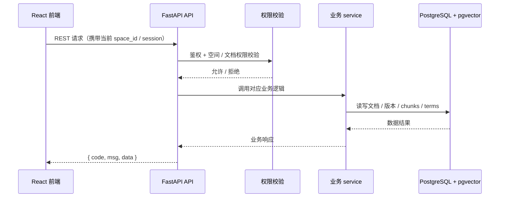

# 07 API设计

> RESTful，统一响应格式。按「完整骨架 + 阶段增量」：铺**完整**接口清单，`[P1]` 写细，其余骨架。
> 每个接口对应一个功能点 / REQ。

## 0. 文档元信息

| 项 | 内容 |
|---|---|
| 保留 / 省略决策 | 保留 |
| 接口形态 | REST API |
| 覆盖 REQ / 模块 | Phase1：REQ-001..REQ-011、REQ-036；P2 / 愿景接口保留骨架 |
| 当前状态 | 已确认（P1 接口；错误码 / 鉴权细节待 05 / 实现期细化） |
| 最后更新 | 2026-07-03 |

## 1. 统一约定

- **鉴权**：会话 / Token（具体方式待 05 细化）；权限在空间 + 文档两级校验。
- **响应**：`{ code, msg, data }`；列表分页 `{ items, total, page }`。
- **错误码体系**：待 05 细化（如 `0`=成功、`4xx`=客户端、`5xx`=服务端）。

## 2. 接口清单（完整）

| 方法 | 路径 | 用途 | 阶段 | 状态 | 追溯 |
|---|---|---|---|---|---|
| POST | /api/auth/login | 登录 | [P1] | P1-已设计 | REQ-001 基础 |
| GET | /api/spaces | 列出我的空间 | [P1] | P1-已设计 | REQ-001/002 |
| POST | /api/spaces/switch | 切换当前空间 | [P1] | P1-已设计 | REQ-002 |
| GET | /api/documents | 文档列表 | [P1] | P1-已设计 | REQ-004 |
| POST | /api/documents | 创建文档 | [P1] | P1-已设计 | REQ-004 |
| GET/PUT/DELETE | /api/documents/{id} | 读/改/删 | [P1] | P1-已设计 | REQ-004/005 |
| GET | /api/documents/{id}/versions | 版本列表 | [P1] | P1-已设计 | REQ-006 |
| POST | /api/documents/{id}/versions/{v}/restore | 恢复版本 | [P1] | P1-已设计 | REQ-006 |
| GET | /api/search?q= | 全文搜索 | [P1] | P1-已设计 | REQ-007 |
| POST | /api/query | RAG 问答 | [P1] | P1-已设计 | REQ-008 |
| POST | /api/import | 导入文件 | [P1] | P1-已设计 | REQ-009/010 |
| GET/POST | /api/terms | 术语列表 / 创建术语 | [P1] | P1-已设计 | REQ-036 |
| GET/PUT/DELETE | /api/terms/{id} | 术语详情 / 更新 / 删除 | [P1] | P1-已设计 | REQ-036 |
| GET | /api/tags | 标签视图 | [P2] | 骨架 | REQ-012 |
| POST | /api/spaces/push | 跨空间推送 | [P2] | 骨架 | REQ-015 |
| GET | /api/briefs/{token} | 对外只读简报 | [愿景] | 骨架 | REQ-022 |
| POST | /api/quick-entry | 快速录入索引条目 | [P2] | 骨架 | REQ-025 |
| GET/POST | /api/doc-links | 内部链接 / 反向链接 | [P2] | 骨架 | REQ-026 |
| POST | /api/export-pdf | 单文档导出 PDF | [P2] | 骨架 | REQ-027 |
| POST | /api/sync/feishu | 飞书同步（webhook/拉取） | [愿景] | 骨架 | REQ-028 |
| POST | /api/path | 路径推理（多跳） | [愿景] | 骨架 | REQ-030 |
| GET | /api/people/{name} | 人物关系网络 | [愿景] | 骨架 | REQ-031 |
| GET | /api/conflicts | 矛盾检测 | [愿景] | 骨架 | REQ-032 |
| POST | /api/hypotheses | 假设检验 / 证据地图 | [愿景] | 骨架 | REQ-033 |
| GET/POST | /api/signal-tracks | 信号追踪 | [愿景] | 骨架 | REQ-034 |
| POST | /api/kits | 分析包 A Kit | [愿景] | 骨架 | REQ-035 |
| … | （其余 P2 / 愿景接口骨架） | | | | |

## 3. 请求 / 响应示例（[P1]）

### POST /api/query （RAG 问答）
- 请求：`{ "space_id": "brightlite-team", "question": "场景联动触发延迟是多少？" }`
- 成功：`{ "code":0, "data": { "answer": "实测 280ms，理论下限 230ms…", "sources": [ { "doc_id": "..", "title": "场景联动性能分析", "snippet": "…" } ] } }`
- 无相关内容：`{ "code":0, "data": { "answer": "未在当前空间知识库找到相关内容", "sources": [] } }`

### POST /api/import
- 请求：multipart，`space_id` + `file`（.docx / .pdf / .png）
- 响应：`{ "code":0, "data": { "import_id": "..", "status": "processing" } }`
- 完成后：`parsed_doc_id` 可用于搜索 / 问答；失败时 `status:"failed"` + 原因

### GET /api/search?q=关键词
- 响应：`{ "items": [ { "doc_id":"..", "title":"..", "snippet":".." } ], "total": N, "page": 1 }`

### GET /api/terms
- 请求参数：`space_id`、可选 `q`、`status`
- 响应：`{ "items": [ { "id":"..", "term":"触发延迟", "definition":"从触发条件满足到指令发出", "aliases":["开关延迟"], "status":"confirmed" } ], "total": N, "page": 1 }`

### POST /api/terms
- 请求：`{ "space_id":"brightlite-team", "term":"触发延迟", "definition":"从触发条件满足到指令发出", "aliases":["开关延迟"], "status":"confirmed" }`
- 响应：`{ "code":0, "data": { "id":"..", "term":"触发延迟" } }`

### POST /api/documents/{id}/versions/{v}/restore
- 响应：`{ "code":0, "data": { "current_version": v } }`

### [P2] / [愿景] 接口（骨架·待该阶段细化）
- `/api/tags`、`/api/spaces/push`：请求 / 响应待 P2 细化
- `/api/briefs/{token}`：简报隔离与有效期待愿景验证（REQ-022）

## 4. REQ → 接口追溯矩阵

| REQ | 接口 | 说明 |
|---|---|---|
| REQ-001 | `POST /api/auth/login`、`GET /api/spaces` | 登录后只列出所属空间 |
| REQ-002 | `POST /api/spaces/switch` | 切换当前空间上下文 |
| REQ-003 | `GET /api/documents`、`POST /api/query`、`GET /api/search` | 文档列表、检索、问答均执行权限过滤 |
| REQ-004 / 005 | `GET/POST /api/documents`、`GET/PUT/DELETE /api/documents/{id}` | 文档 CRUD 与行内编辑保存 |
| REQ-006 | `GET /api/documents/{id}/versions`、`POST /api/documents/{id}/versions/{v}/restore` | 版本查看与恢复 |
| REQ-007 | `GET /api/search?q=` | 全文搜索 |
| REQ-008 | `POST /api/query` | RAG 问答与来源引用 |
| REQ-009 / 010 | `POST /api/import` | Word / PDF / 图片导入与解析任务 |
| REQ-011 | 全部 P1 接口 | 桌面端通过浏览器覆盖全部 P1 功能 |
| REQ-036 | `GET/POST /api/terms`、`GET/PUT/DELETE /api/terms/{id}` | 术语列表、创建、更新、删除 |
| REQ-012..017 / 024..027 | P2 接口骨架 | 升 Phase2 时细化契约 |
| REQ-018..023 / 028..035 | 愿景接口骨架 | 技术验证通过后细化契约 |

## 5. 待人工确认项

- 鉴权方式与错误码体系仍按 `docs/05-tech-spec.md` 的“待确认”版本约束，在开发前钉死。
