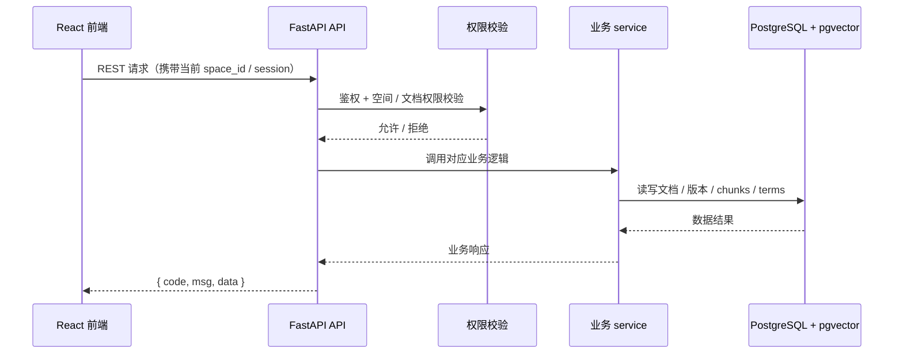

# 07 API设计

> RESTful，统一响应格式。按「完整骨架 + 阶段增量」：铺**完整**接口清单，`[P1]` 写细，其余骨架。
> 每个接口对应一个功能点 / REQ。

## 0. 文档元信息

| 项 | 内容 |
|---|---|
| 保留 / 省略决策 | 保留 |
| 接口形态 | REST API |
| 覆盖 REQ / 模块 | Phase1：REQ-001..REQ-011、REQ-036；Phase1.5A：REQ-037/038（API-029/030）；Phase1.5B：REQ-027（API-019）；Phase2A：REQ-012/025/026；Phase2B：REQ-014（API-028）、REQ-013/024（API-033）、REQ-039（API-034..038，第三 slice）；后续 / 愿景接口保留骨架 |
| 当前状态 | P1 接口契约已用于 Phase1 Demo；Sprint-8 后 P1 主要接口已接 PostgreSQL 表，RAG 已接 pgvector 向量召回 + GLM LLM；task-009 后 API-009 search 已为 substring + ts_vector + pgvector 语义召回的 hybrid search（zhparser 可选）。API-029/030 已随 Phase1.5A 完成；API-019 已随 Sprint-18 完成并补齐 PDF artifact 下载端点；Phase2A 标签、快速录入、内链 / 反链接口已完成；Phase2B API-028、API-033、API-034..038 已进入实现态。仍降级：API-011 仅 `.md`/`.txt` 已提取文本；真实 Word/PDF 解析与 OCR 留后续 |
| 最后更新 | 2026-08-04（v1.7.0：API-019 PDF 下载端点 + 前端下载闭环通过） |

## 1. 统一约定

- **鉴权**：Phase1 使用 Demo Bearer Token；`POST /api/auth/login` 返回 HMAC-SHA256 签名 token，前端通过 `Authorization: Bearer <token>` 传递；token 载荷包含 `user_id`、`current_space_id`、`exp`，默认有效期 8 小时。`POST /api/spaces/switch` 校验成员关系后返回带新 `current_space_id` 的 token。
- **权限**：空间 + 文档两级校验；列表 / 搜索 / RAG 均按 `current_space_id` 与文档 `permission` 过滤。
- **响应**：统一 `{ code, msg, data }`；成功 `code=0`；列表分页 `{ items, total, page }`。
- **错误码体系**：HTTP 状态码表达协议层结果，`code` 表达业务结果：`0` 成功，`4001` 未登录 / token 无效，`4003` 无权限，`4004` 资源不存在，`4090` 业务冲突，`4220` 参数校验失败，`5000` 服务端错误，`5030` 外部 AI / OCR 服务不可用。

## 2. 接口清单（完整）

> 每个接口有稳定 `API-ID`（连续编号，阶段列区分 `[P1]`/`[P2]`/`[愿景]`，ID 不随阶段变更）。字段级契约见 §3。

| API-ID | 方法 | 路径 | 用途 | 阶段 | 设计状态 | 当前实现状态 | 追溯 REQ |
|---|---|---|---|---|---|---|---|
| API-001 | POST | /api/auth/login | 登录 | [P1] | P1-已实现 | 已实现（PG 用户 / 空间关系；Demo token） | REQ-001 基础 |
| API-002 | GET | /api/spaces | 列出我的空间 | [P1] | P1-已实现 | 已实现（PG 空间 / 成员） | REQ-001/002 |
| API-003 | POST | /api/spaces/switch | 切换当前空间 | [P1] | P1-已实现 | 已实现（PG 成员校验） | REQ-002 |
| API-004 | GET | /api/documents | 文档列表 | [P1] | P1-已实现 | 已实现（PG 文档 + 权限过滤） | REQ-004 |
| API-005 | POST | /api/documents | 创建文档 | [P1] | P1-已实现 | 已实现（PG 文档持久化） | REQ-004 |
| API-006 | GET/PUT/DELETE | /api/documents/{id} | 读/改/删 | [P1] | P1-已实现 | 已实现（PG 文档 + 权限过滤） | REQ-004/005 |
| API-007 | GET | /api/documents/{id}/versions | 版本列表 | [P1] | P1-已实现 | 已实现（PG 版本历史） | REQ-006 |
| API-008 | POST | /api/documents/{id}/versions/{v}/restore | 恢复版本 | [P1] | P1-已实现 | 已实现（PG 版本恢复） | REQ-006 |
| API-009 | GET | /api/search?q= | 全文 / 语义混合搜索 | [P1] | P1-已实现 | 已实现（substring + ts_vector + pgvector 语义召回；zhparser 可选） | REQ-007 |
| API-010 | POST | /api/query | RAG 问答 | [P1] | P1-已实现 | 已实现（pgvector 向量召回 + GLM LLM；可配 Mock） | REQ-008 |
| API-011 | POST | /api/import | 导入文件 | [P1] | P1-已设计 | **降级实现（仅 `.md`/`.txt` 已提取文本；无 PDF/OCR）** | REQ-009/010 |
| API-012 | GET/POST | /api/terms | 术语列表 / 创建术语 | [P1] | P1-已实现 | 已实现（PG 术语存储） | REQ-036 |
| API-013 | GET/PUT/DELETE | /api/terms/{id} | 术语详情 / 更新 / 删除 | [P1] | P1-已实现 | 已实现（PG 术语存储） | REQ-036 |
| API-029 | POST | /api/import/batch | 批量导入（多文件 + 文件夹，标题前缀，同名跳过） | [P1] | Phase1.5A-已实现 | — | REQ-037 |
| API-030 | GET | /api/documents/{id}/export · /api/export/space | 单文档 .md 下载 / 空间 ZIP 导出 | [P1] | Phase1.5A-已实现 | — | REQ-038 |
| API-014 | GET/POST | /api/tags | 标签列表 / 创建标签 | [P2] | Phase2A-已实现 | — | REQ-012 |
| API-031 | GET/POST/DELETE | /api/documents/{id}/tags | 文档-标签关联（列 / 打 / 移除） | [P2] | Phase2A-已实现 | — | REQ-012 |
| API-032 | GET | /api/tags/{id}/documents | 标签下可见文档列表 | [P2] | Phase2A-已实现 | — | REQ-012 |
| API-015 | POST | /api/spaces/push | 跨空间推送 | [P2] | 骨架 | — | REQ-015 |
| API-016 | GET | /api/briefs/{token} | 对外只读简报 | [愿景] | 骨架 | — | REQ-022 |
| API-017 | POST/DELETE | /api/quick-entry | 快速录入索引条目（capture / discard） | [P2] | Phase2A-已实现 | — | REQ-025 |
| API-018 | GET/POST | /api/doc-links | 内部链接 / 反向链接 | [P2] | Phase2A-已实现 | — | REQ-026 |
| API-019 | POST/GET | `/api/export-pdf`、`/api/export-pdf/{export_id}/download` | 单文档导出 / 下载 PDF | [P1] | Phase1.5B-已实现 | 已实现（Sprint-18：同步生成任务结果；v1.7.0：artifact 下载闭环） | REQ-027 |
| API-020 | POST | /api/sync/feishu | 飞书同步（webhook/拉取） | [愿景] | 骨架 | — | REQ-028 |
| API-021 | POST | /api/path | 路径推理（多跳） | [愿景] | 骨架 | — | REQ-030 |
| API-022 | GET | /api/people/{name} | 人物关系网络 | [愿景] | 骨架 | — | REQ-031 |
| API-023 | GET | /api/conflicts | 矛盾检测 | [愿景] | 骨架 | — | REQ-032 |
| API-024 | POST | /api/hypotheses | 假设检验 / 证据地图 | [愿景] | 骨架 | — | REQ-033 |
| API-025 | GET/POST | /api/signal-tracks | 信号追踪 | [愿景] | 骨架 | — | REQ-034 |
| API-026 | POST | /api/kits | 分析包 A Kit | [愿景] | 骨架 | — | REQ-035 |
| API-027 | GET/PUT/DELETE | /api/tags/{id} | 标签详情 / 更新 / 归档 | [P2] | Phase2A-已实现 | — | REQ-012 |
| API-028 | POST | /api/documents/{id}/polish | AI 润色 / 写作引用 | [P2] | MVP 级已设计 | — | REQ-014 |
| API-033 | GET | /api/spaces/{id}/timeline | **主题时间线 / 密度热条**（REQ-013a 重定位） | [P2] | Phase2B·第二 slice·本地实现完成 | task-030；运行态 API smoke / Edge headless 浏览器 smoke / 真实 PG 大数据性能 smoke 已通过 | REQ-013a/024 |
| API-034 | GET | /api/folders | 文件夹树查询（嵌套；token current_space_id；`parent_id` query，空=根层） | [P2] | Phase2B·第三 slice·已实现 | 后端已实现（task-027；路径裁定 /api/folders，2026-08-02） | REQ-039 |
| API-035 | POST | /api/folders | 新建文件夹 | [P2] | Phase2B·第三 slice·已实现 | 后端已实现（task-027） | REQ-039 |
| API-036 | PATCH/DELETE | /api/folders/{folder_id} | 移动 / 改名 / 删除文件夹（PATCH body `name`/`parent_id`，`parent_id=null`=移到根） | [P2] | Phase2B·第三 slice·已实现 | 后端已实现（task-027） | REQ-039 |
| API-037 | POST | /api/folders/reorder | 文件夹排序（body `parent_id`+`ordered_ids`，须等于该层全部子 folder） | [P2] | Phase2B·第三 slice·已实现 | 后端已实现（task-027） | REQ-039 |
| API-038 | PATCH | /api/documents/{document_id}/folder | 移动单个文档到目标文件夹或根目录（body `folder_id`，`null`=根目录） | [P2] | Phase2B·第三 slice·已实现 | 本地已实现（task-029；不新增版本 / 不重建索引） | REQ-039 |

## 3. 请求 / 响应契约（[P1]）

> 以下为 P1 Demo 接口契约：`/api/query` 已接 pgvector 向量召回 + GLM LLM；`/api/search` 已升级为 substring + `ts_vector` + pgvector 语义召回的 hybrid search；`/api/import` 仅 `.md`/`.txt` 已提取文本（无真实 PDF/OCR）。Phase1.5A 的 API-029/030 已完成；Phase2A 标签、快速录入、内链 / 反链接口已完成；`[愿景]` 与 Phase2B 接口保留骨架，升阶段时补字段级契约。

### 3.1 Endpoint contract matrix

> P1 接口契约状态按 §2 当前实现状态区分 `P1-已实现` / `P1-部分实现` / `降级实现`。请求/响应契约列指向字段级（§3.2/3.3）或示例（§3.7）。

| API-ID | 契约状态 | 请求/响应契约 | 错误契约 | 权限契约 | 验证项 (TC) | 是否可实现 |
|---|---|---|---|---|---|---|
| API-001 | P1-已实现 | §3.2 / §3.3 | 4001 | 鉴权基线 | TC-P1-001 | 是 |
| API-002 | P1-已实现 | §3.7 示例 | 4001 | 空间成员 | TC-P1-001/002 | 是 |
| API-003 | P1-已实现 | §3.7 示例 | 4001/4003 | 空间成员 | TC-P1-002 | 是 |
| API-004 | P1-已实现 | §3.7 示例 | 4001 | 空间过滤 | TC-P1-004 | 是 |
| API-005 | P1-已实现 | §3.2 | 4001/4220 | 空间过滤 | TC-P1-004 | 是 |
| API-006 | P1-已实现 | §3.7 示例 | 4001/4004 | 空间+权限 | TC-P1-004/005 | 是 |
| API-007 | P1-已实现 | §3.7 示例 | 4001/4004 | 空间+权限 | TC-P1-006 | 是 |
| API-008 | P1-已实现 | §3.7 示例 | 4001/4004 | 空间+权限 | TC-P1-006 | 是 |
| API-009 | 已实现（hybrid search：substring + ts_vector + pgvector） | §3.7 示例 | 4001/4220 | 空间过滤 | TC-P1-007 | 是 |
| API-010 | 已实现（向量召回 + GLM LLM；可配 Mock 降级） | §3.2 / §3.3 | 4001/4220 | 空间过滤 | TC-P1-008 | 是 |
| API-011 | 降级实现（仅 `.md`/`.txt`） | §3.2 / §3.3 | 4001/4003/4220 | 空间过滤 | TC-P1-009/010 | 是 |
| API-012 | P1-已实现 | §3.2 / §3.3 | 4001/4003/4220 | 空间成员 | TC-P1-012 | 是 |
| API-013 | P1-已实现 | §3.7 示例 | 4001/4003/4004 | 空间+权限 | TC-P1-012 | 是 |
| API-029 | Phase1.5A-已实现 | §3.9 | 4001/4003/4090/4220 | 空间成员；逐文件写入当前空间 | TC-P1-015 | 已实现（Sprint-16） |
| API-030 | Phase1.5A-已实现 | §3.9 | 4001/4003/4004/4220/5000 | 文档 / 空间可见性过滤；ZIP 只含可见文档 | TC-P1-016 | 已实现（Sprint-17） |

### 3.1.1 Phase1.5 / Phase2 endpoint contract matrix（草案）

> 本节记录 Phase1.5A 导入 / 导出、Phase1.5B PDF 与 Phase2A/B 契约状态。Phase1.5A API-029/030、Phase1.5B API-019 与 Phase2A 标签、快速录入、内链 / 反链接口已完成；后续 Phase2B 扩展正式编码前仍需与 `docs/06-db-design.md` 的表契约、`docs/09-verification.md` 的对应 TC 和首个 vertical slice 选择对齐。

| API-ID | 契约状态 | 请求 / 响应契约 | 错误契约 | 权限契约 | 验证项 (TC) | 是否可实现 |
|---|---|---|---|---|---|---|
| API-029 | Phase1.5A-已实现 | §3.9 | 4001/4003/4090/4220 | 空间成员；逐文件写入当前空间；同名默认跳过 | TC-P1-015 | 已实现（Sprint-16） |
| API-030 | Phase1.5A-已实现 | §3.9 | 4001/4003/4004/4220/5000 | 单文档可读；空间 ZIP 只包含当前用户可见文档 | TC-P1-016 | 已实现（Sprint-17） |
| API-019 | Phase1.5B-已实现 | §3.9 | 4001/4004/4090/4220/5000/5030 | 导出 / 下载前校验源文档可见；下载端点不公开越权 artifact，任务未完成返回 4090 | TC-P1-017 | 已实现（Sprint-18 + v1.7.0 下载闭环） |
| API-014 | Phase2A-已实现 | §3.9 | 4001/4003/4090/4220 | 空间成员；标签仅当前空间可见 | TC-P2-TAG-001 | 已实现（Task A 1e4cf48） |
| API-027 | Phase2A-已实现 | §3.9 | 4001/4003/4004/4090/4220 | 空间成员；归档不删除历史关联 | TC-P2-TAG-001 | 已实现（Task A 1e4cf48） |
| API-017 | Phase2A-已实现 | §3.9 | 4001/4003/4004/4220 | 空间成员；draft 默认 owner 私有；转换继承文档权限 | TC-P2-QUICK-001 | 已实现（Task A `f771e02` + Task B `bad8fe5`） |
| API-018 | Phase2A-已实现 | §3.9 | 4001/4003/4004/4220 | source / target 文档均需权限过滤；无权限反链不泄露 | TC-P2-LINK-001 | 已实现（Task A fc2b869 + Task B 6228f3f） |
| API-028 | Phase2B·后端已实现（MVP 级） | §3.9 | 4001/4003/4004/4220/5030 | 文档可写权限；引用 chunk 必须当前用户可见；数据外发风险已接受（RG-008 Go） | TC-P2-AI-001 | 后端已实现（RG-008 Go，Sprint-19） |
| API-033 | Phase2B·第二 slice·本地实现完成（**主题时间线 REQ-013a 重定位**） | §3.9（已定稿并落地，加 `q`/`actor`/`ratio`/`degraded`/`window`） | 4001/4003/4004/4220 | 空间成员；仅返回当前用户可见文档的事件；`q` 命中仅可见集内（候选 A 实时聚合 + 标题 ILIKE/chunk.ts_vector） | TC-P2-TL-001 | 已实现（task-030，后端自动化 + frontend build + 运行态 API smoke + Edge headless 浏览器 smoke 通过；v1.5.2 补真实 PG 大数据性能 smoke） |
| API-034 | Phase2B·第三 slice·已实现 | §3.9（路径已定 /api/folders） | 4001/4003 | 空间成员；folder 不独立设权限，文档可见性仍按 permission 过滤 | TC-P2-FOLDER-001 | 后端已实现（task-027，19 tests OK） |
| API-035 | Phase2B·第三 slice·已实现 | §3.9 | 4001/4003/4090/4220 | 空间成员；同 parent 重名→4090 | TC-P2-FOLDER-001 | 后端已实现（task-027） |
| API-036 | Phase2B·第三 slice·已实现 | §3.9 | 4001/4003/4004/4090/4220 | 空间成员；防环 / 跨空间→4220；删非空→4090 | TC-P2-FOLDER-001 | 后端已实现（task-027） |
| API-037 | Phase2B·第三 slice·已实现 | §3.9 | 4001/4003/4220 | 空间成员 | TC-P2-FOLDER-001 | 后端已实现（task-027） |
| API-038 | Phase2B·第三 slice·已实现 | §3.9 | 4001/4003/4004/4220 | 文档可见且可写；目标 folder 必须属于当前空间；`folder_id=null` 移到根目录 | TC-P2-FOLDER-001 | 已实现（task-029） |

### 3.2 请求 / 输入契约（字段级·核心接口）

> 其余接口请求字段见 §3.7 示例 payload。

| API-ID | 字段 / 参数 | 位置 | 类型 | 必填 | 校验 | 示例 | 来源 REQ |
|---|---|---|---|---|---|---|---|
| API-001 | account | body | string | 是 | 非空 | `"nova"` | REQ-001 |
| API-001 | password | body | string | 是 | 非空 | `"***"` | REQ-001 |
| API-005 | space_id | token | string | 是 | 当前空间 | `"brightlite-team"` | REQ-004 |
| API-005 | title | body | string | 是 | 非空 | `"场景联动分析"` | REQ-004 |
| API-005 | content_md | body | string | 是 | Markdown | `"# …"` | REQ-004 |
| API-005 | permission | body | enum | 是 | private/team/external | `"team"` | REQ-003/004 |
| API-010 | space_id | token | string | 是 | 当前空间 | `"brightlite-team"` | REQ-008 |
| API-010 | question | body | string | 是 | 非空、≤上限 | `"场景联动延迟？"` | REQ-008 |
| API-011 | space_id | form | string | 是 | 当前空间 | `"brightlite-team"` | REQ-009 |
| API-011 | file | form | file | 是 | `.md`/`.txt`（目标含 .docx/.pdf/图片） | `notes.md` | REQ-009/010 |
| API-029 | files[] | form | file[] | 是 | `.md` / `.txt`；至少 1 个 | `docs/a.md` | REQ-037 |
| API-029 | relative_paths[] | form | string[] | 否 | 与 files 顺序对齐；用于标题前缀 | `docs/team/readme.md` | REQ-037 |
| API-029 | conflict_policy | form | enum | 否 | `skip`（默认）；不支持静默覆盖 | `skip` | REQ-037 |
| API-029 | preserve_structure | form | bool | 否 | 默认 `true`；Phase2B 扩展（FT-C-008）：保留真实目录结构建/复用 folder；`false` 退回标题前缀向后兼容 | `true` | REQ-037/039 |
| API-030 | id | path | string | 是（单文档） | 当前空间可见文档 | `123` | REQ-038 |
| API-030 | format | query | enum | 否 | `md`；P1.5A 不支持 PDF | `md` | REQ-038 |
| API-030 | include_versions | query | bool | 否 | 默认 false | `false` | REQ-038 |
| API-012 | space_id | query | string | 是 | 当前空间 | `"brightlite-team"` | REQ-036 |
| API-012 | q | query | string | 否 | 可选筛选 | `"触发"` | REQ-036 |
| API-012 | status | query | enum | 否 | confirmed/pending | `"confirmed"` | REQ-036 |
| API-012 | term | body | string | 是（POST） | 非空、空间内唯一 | `"触发延迟"` | REQ-036 |
| API-012 | definition | body | string | 是（POST） | 非空 | `"从触发到指令发出"` | REQ-036 |
| API-012 | aliases | body | string[] | 否 | 习惯用语 | `["开关延迟"]` | REQ-036 |

### 3.3 响应 / 输出契约（字段级·核心接口）

| API-ID | 字段 | 类型 | 必填 | 数据来源 / 表字段 | 敏感性 | 脱敏 / 过滤 |
|---|---|---|---|---|---|---|
| API-001 | token | string | 是 | HMAC 签名生成 | 高 | 仅返回一次，前端内存保存 |
| API-001 | current_space_id | string | 是 | token 载荷 | 中 | — |
| API-010 | answer | string | 是 | adapter（配 .env → LLM 生成；默认降级模板） | 中 | 库外返回「未找到」，不编造 |
| API-010 | sources[].doc_id | string | 是 | lumen_documents.id | 低 | 权限过滤后返回 |
| API-010 | sources[].snippet | string | 是 | lumen_chunks.text（目标）/ content_md 切片 | 中 | 仅当前空间、权限可见文档 |
| API-011 | import_id | string | 是 | lumen_imports.id | 低 | — |
| API-011 | status | enum | 是 | lumen_imports.status（见 §3.6） | 低 | — |
| API-011 | parsed_doc_id | string | done 时 | lumen_imports.parsed_doc_id | 低 | — |
| API-029 | batch_id | string | 是 | 请求级临时 ID / 首个 import id | 低 | 不含原文 |
| API-029 | items[].import_id | string | 否 | lumen_imports.id | 低 | — |
| API-029 | items[].relative_path | string | 否 | 上传相对路径 / 文件名 | 低 | 不含本机绝对路径 |
| API-029 | items[].status | enum | 是 | done / failed / skipped | 低 | — |
| API-029 | items[].parsed_doc_id | string | done 时 | lumen_imports.parsed_doc_id | 低 | — |
| API-029 | items[].folder_id | string | 否 | lumen_documents.folder_id（preserve_structure=true 时回填） | 低 | — |
| API-030 | content | file/blob | 是（单文档） | lumen_documents / versions | 中 | 仅当前用户可见文档 |
| API-030 | zip | file/blob | 是（空间） | 当前用户可见 documents | 中 | ZIP 不含不可见文档 |
| API-012 | term/definition/aliases | string/string[] | 是 | lumen_terms | 中 | definition 会注入 RAG（目标发往 LLM） |

### 3.4 错误码与异常处理

> 业务码体系见 §1。「实现状态」据 `backend/api/*.py` 实证：`0/4001/4003/4004/4090/4220` 已实现；`5030` 已由 API-019 / API-028 依赖不可用路径覆盖；`5000` 为服务端异常兜底。

| 错误码 | HTTP | 触发条件 | 用户可见信息 | 客户端处理 | 日志/审计 | 可重试 | 实现状态 |
|---|---|---|---|---|---|---|---|
| 0 | 200 | 成功 | 成功 | — | — | — | 已实现（全接口） |
| 4001 | 401 | 未登录 / token 无效 / 无可用空间 | 未登录 | 重新登录 | 记录 | 否（重登） | 已实现（auth/terms/rag/spaces/imports/search/documents） |
| 4003 | 403 | 非空间成员 / 无权限 | 无权限 | 提示无权限 | 记录 | 否 | 已实现（auth/terms/spaces/imports） |
| 4004 | 404 | 文档 / 版本 / 术语不存在 | 不存在 | — | — | 否 | 已实现（terms/documents） |
| 4220 | 422 | 参数校验失败（空字段、类型、超长） | 参数错误 | 修正后重试 | — | 是（修正后） | 已实现（terms/rag/imports/search） |
| 4090 | 409 | 业务冲突（如唯一约束、批量导入同名且策略不允许覆盖、PDF 导出任务未就绪） | 冲突 | — | — | — | 已实现（tags / folders / PDF 下载未就绪） |
| 5000 | 500 | 服务端错误 | 服务异常 | 稍后重试 | 记录 | 是 | 已实现为部分接口兜底 |
| 5030 | 503 | 外部 AI / OCR / PDF 导出依赖不可用 | 服务暂不可用 | 稍后重试 | 记录 | 是 | 已实现（API-019 PDF 依赖不可用；API-028 LLM 不可用） |

> 注：文档级越权（`GET/PUT/DELETE /api/documents/{id}`）在查询层吸收为 4004 或空结果，不返回 4003，避免暴露资源存在性（见 `docs/design/permissions.md`）。

### 3.5 权限、安全与限流

> Phase1（Demo）口径：无限流、无审计日志（标「Phase1 不启用」）；权限隔离由后端 service / 查询层执行，不依赖前端隐藏。

| API-ID | 鉴权 | 空间边界 | 资源权限 | 敏感字段 | 限流 | 审计日志 | 越权失败策略 |
|---|---|---|---|---|---|---|---|
| API-001..013 | Bearer Token（HMAC） | current_space_id 过滤 | 文档 permission: private/team/external | content_md / chunks.text / terms.definition（目标发往外部 LLM） | Phase1 不启用 | Phase1 不启用 | 越权吸收为空结果 / 4004 |
| API-029 | Bearer Token（HMAC） | 写入 current_space_id | 仅空间成员可导入；生成文档默认沿用当前导入口径 | 上传文本内容 / relative_path | P1.5A 不启用 | 逐条记录结果 | 单文件失败不影响其他成功项；同名默认 skipped |
| API-030 | Bearer Token（HMAC） | current_space_id 过滤 | 单文档可读；空间 ZIP 仅打包可见文档 | 导出的 `.md` 内容 / ZIP | P1.5A 不启用 | 可记录下载行为（后续） | 不可见文档返回 4004 或不进入 ZIP |
| API-016（愿景） | 临时 token（独立） | 简报 token 隔离 | 外部只读 | 简报内容裁剪 | 待愿景验证 | 待愿景验证 | token 失效 → 401 |

### 3.6 异步任务 / 状态机（`lumen_imports.status`）

> 当前单文件导入为**同步完成**（单请求内 processing→done/failed），无 queued 中间态；目标态预留异步重试。Phase1.5A 批量导入默认逐文件复用同一状态机：请求级返回 `batch_id`，每个文件独立返回 `done / failed / skipped`，成功项不因其他文件失败回滚。状态值见 `backend/model/entities.py` `ImportJob.status`，当前由 `PgRepository` 持久化；`DemoRepository` 仅作单测 fake。

| 状态 | 含义 | 进入条件 | 退出条件 | 用户可见信息 | 可重试 | 终态 |
|---|---|---|---|---|---|---|
| processing | 解析中 | API-011 接受文件 | 解析完成 → done / 失败 → failed | "导入中" | 否（同步等待） | 否 |
| done | 解析成功 | 文本提取 + 切块 +（目标）Embedding 完成 | — | parsed_doc_id 可检索 | — | 是 |
| failed | 解析失败 | 解析异常（不支持的格式 / 提取失败） | — | 错误原因 | 可重新上传 | 是 |
| skipped | 批量导入跳过 | 同名冲突 / 不支持格式且策略为跳过 | — | 跳过原因 | 可修改后重新上传 | 是 |

### 3.7 请求 / 响应示例（[P1]）

> 以下为 P1 Demo 契约示例：`/api/query` 已接 pgvector 向量召回 + GLM LLM；`/api/search` 为 hybrid search；`/api/import` 仅 `.md`/`.txt` 已提取文本（无真实 PDF/OCR）。逐接口状态见 §2。

#### POST /api/query （RAG 问答）
- 请求：`{ "space_id": "brightlite-team", "question": "场景联动触发延迟是多少？" }`
- 成功：`{ "code":0, "data": { "answer": "实测 280ms，理论下限 230ms…", "sources": [ { "doc_id": "..", "title": "场景联动性能分析", "snippet": "…" } ] } }`
- 无相关内容：`{ "code":0, "data": { "answer": "未在当前空间知识库找到相关内容", "sources": [] } }`

#### POST /api/import
- 请求：multipart，`space_id` + `file`（Phase1 当前 `.md` / `.txt`；.docx / .pdf / .png 为后续真实解析 / OCR）
- 响应：`{ "code":0, "data": { "import_id": "..", "status": "processing" } }`
- 完成后：`parsed_doc_id` 可用于搜索 / 问答；失败时 `status:"failed"` + 原因

#### GET /api/search?q=关键词
- 响应：`{ "items": [ { "doc_id":"..", "title":"..", "snippet":".." } ], "total": N, "page": 1 }`

#### GET /api/terms
- 请求参数：`space_id`、可选 `q`、`status`
- 响应：`{ "items": [ { "id":"..", "term":"触发延迟", "definition":"从触发条件满足到指令发出", "aliases":["开关延迟"], "status":"confirmed" } ], "total": N, "page": 1 }`

#### POST /api/terms
- 请求：`{ "space_id":"brightlite-team", "term":"触发延迟", "definition":"从触发条件满足到指令发出", "aliases":["开关延迟"], "status":"confirmed" }`
- 响应：`{ "code":0, "data": { "id":"..", "term":"触发延迟" } }`

#### POST /api/documents/{id}/versions/{v}/restore
- 响应：`{ "code":0, "data": { "current_version": v } }`

### 3.8 交互时序图（P1 当前架构）

> 注：上图为 P1 当前架构时序。Sprint-8 后 DB 节点为 PostgreSQL+pgvector；`POST /api/query` 已走向量召回 + GLM LLM（可配 Mock 降级）；`POST /api/import` 当前仅接受 `.md`/`.txt` 已提取文本。

### 3.9 Phase1.5 / Phase2 请求 / 响应契约草案

> 草案约束：Phase1.5 / Phase2 API 均沿用统一 `{ code, msg, data }`；列表响应使用 `{ items, total, page }`；所有查询默认以 token 中 `current_space_id` 为边界。以下字段名用于后续实现对齐，不代表当前接口已存在。

| API-ID | 请求字段 | 响应字段 | 权限 / 降级 | 关联 DB | 备注 |
|---|---|---|---|---|---|
| API-029 `POST /api/import/batch` | multipart：`files[]`、`relative_paths[]?`、`conflict_policy=skip`、`preserve_structure?=true`（Phase2B 扩展 FT-C-008） | `{batch_id,total,success_count,failed_count,skipped_count,items[{filename,relative_path,title,folder_id?,status,import_id?,parsed_doc_id?,error?}]}` | 需当前空间成员；仅支持 `.md` / `.txt`；逐文件处理，部分成功不回滚；同名默认 skipped（`preserve_structure=true` 时按同 folder 下标题判断） | `lumen_imports`、`lumen_documents`、`lumen_chunks`、`lumen_folders`（preserve_structure=true 时） | Phase1.5A-已实现；**Phase2B 扩展已实现（task-028）**：`preserve_structure=true` 按 `relative_paths` 建/复用 `lumen_folders`（幂等）并回填 `folder_id`，标题取文件名；`=false` 保留标题前缀向后兼容；推翻 ingestion ING-C-001「不建 folder 表」 |
| API-030 `GET /api/documents/{id}/export` | `format=md`、`version_no?` | file/blob：`text/markdown`，文件名由文档标题安全化 | 需可读文档；不可见返回 4004；P1.5A 不支持 PDF | `lumen_documents`、`lumen_document_versions` | Phase1.5A-已实现；单文档 `.md` 下载，不写 `lumen_doc_exports` |
| API-030 `GET /api/export/space` | `format=zip`、`include_versions?=false` | file/blob：ZIP，内含当前用户可见文档 `.md` | 仅打包当前空间且当前用户可见文档；不可见文档不进入 ZIP | `lumen_documents`、`lumen_document_versions` | Phase1.5A-已实现；使用 Python `zipfile`，默认流式 / 临时产物，不生成长期公开链接 |
| API-019 `POST /api/export-pdf` | `document_id`、`version_no?`、`options?{include_sources,theme}` | `{export_id,status,artifact_path?}` | 需可读 / 可导出文档；导出产物继承文档权限，不生成公开长期链接 | `lumen_doc_exports`、`lumen_documents`、`lumen_document_versions` | Phase1.5B；已按 ReportLab 路线实现（Sprint-18，同步生成任务结果） |
| API-019 `GET /api/export-pdf/{export_id}/download` | path：`export_id` | file/blob：`application/pdf`，文件名由 artifact 文件名安全化并带 `filename*` | 需当前 token 空间匹配导出记录，且源文档当前仍可读；任务未完成 / failed / 无 artifact 返回 4090；artifact 不存在或越界返回 4004 | `lumen_doc_exports`、`lumen_documents` | Phase1.5B；v1.7.0 已实现，前端生成后直接下载 |
| API-014 `GET /api/tags` | `q?`、`status?=active`、`page?` | `items[{id,name,color,description,document_count,status}]`、`total` | 仅当前空间标签；`document_count` 只统计当前用户可见文档 | `lumen_tags`、`lumen_tag_links`、`lumen_documents` | 支撑标签视图与筛选 |
| API-014 `POST /api/tags` | `name`、`color?`、`description?` | `{id,name,color,description,status}` | 空间成员可创建；同空间 `normalized_name` 冲突返回 4090 | `lumen_tags` | 不自动跨空间复制 |
| API-027 `/api/tags/{id}` | `PUT`: `name?`、`color?`、`description?`、`status?`；`DELETE`: 归档 | `{id,name,color,description,status}` | 仅当前空间标签；删除采用 `archived`，不硬删历史 | `lumen_tags` | 避免破坏文档历史关联 |
| API-031 `GET /api/documents/{id}/tags` | — | `items[{tag_id,name,color,link_source}]` | 需可读文档；仅返回同空间 active 标签 | `lumen_tag_links`、`lumen_tags` | 文档详情展示标签 |
| API-031 `POST /api/documents/{id}/tags` | `tag_id` | `{tag_id,document_id,link_source:'manual'}` | 需文档可写；标签须同空间 active；重复打幂等返回既有 | `lumen_tag_links` | `link_source` 固定 manual（quick_entry / import / ai_suggested 预留） |
| API-031 `DELETE /api/documents/{id}/tags/{tag_id}` | — | `{deleted:true}` | 需文档可写；移除关联不删标签本身 | `lumen_tag_links` | 归档标签不自动移除既有 link |
| API-032 `GET /api/tags/{id}/documents` | `status?=active` | `items[{id,title,permission,...}]`、`total` | 仅当前空间标签；文档按当前用户可见性过滤 | `lumen_tag_links`、`lumen_documents` | 标签视图点标签看文档 |
| API-017 `POST /api/quick-entry` | `title`、`content_md`、`source?`、`target_document_id?`、`tag_ids?`、`mode=draft / create_document / append_document` | `{id,status,created_document_id?,target_document_id?,title,owner_id}` | 草稿默认 owner 私有；转换为文档时继承目标文档权限或新文档默认 private | `lumen_quick_entries`、`lumen_documents`、`lumen_tag_links` | 不触发 AI；不绕过文档权限 |
| API-017 `DELETE /api/quick-entry/{id}` | — | `{id,status,created_document_id?,target_document_id?,title,owner_id}` | 仅 `status=draft` 且属于当前用户可丢弃 → `discarded`；非 owner / 跨空间按不存在（4004，不泄露）；非 draft → 4220 | `lumen_quick_entries` | 最小版不暴露 list endpoint |
| API-018 `GET /api/doc-links` | `document_id`、`direction=outbound / backlink`、`status?` | `data:[{id,source_document_id,target_document_id?,target_title?,link_text,link_type,status}]` | source / target 均按空间 + 权限过滤；无权限 target 返回 `status=no_access` 且不泄露标题 | `lumen_doc_links`、`lumen_documents` | 支撑内部链接与反向链接 |
| API-018 `POST /api/doc-links` | `source_document_id`、`target_document_id?`、`target_title?`、`link_text`、`link_type=manual`（wikilink 由文档正文解析，不接受手动 POST） | `{id,status}` | 需可编辑 source；target 缺失时 `unresolved` | `lumen_doc_links` | 后续可由 Markdown 解析器批量维护 |
| API-028 `POST /api/documents/{id}/polish` | `mode=polish / citation`、`selection_md?`、`instruction?`、`use_sources?=true` | `{draft_id,output_md,sources[{chunk_id,document_id,title,snippet}],status}` | 需文档可写；sources 必须来自当前用户可见 chunk；LLM 不可用返回 5030 或 Mock 降级 | `lumen_ai_drafts`、`lumen_chunks`、`lumen_documents` | **vertical slice**：`polish` 同步返回；`citation` 复用 RAG 检索 + LLM（首版同步，超时降 5030；若实测延迟过高再补异步 job 状态机）；数据外发风险已接受（RG-008）；不存 API key；草稿只存 hash + 摘要 |
| API-033 `GET /api/spaces/{id}/timeline` | `q?`（关键词，不传=空间总览）、`from?`、`to?`、`tag_ids?`（标签主题入口）、`density?=true` | `{items[{date,document_id,title,event_type,permission,actor}],density?[{window_start,window_end,event_count,level,ratio}],degraded,window}`；`event_type`∈{created,updated,tagged,linked}；`actor`：created/updated=`owner_id`（updated 近似）/ tagged=`created_by` / **linked=`null`**（`lumen_doc_links` 无 created_by）；`density.level`∈{0,1,2,3}；`ratio`=相对均值倍数；`degraded`/`window`=day\|week | 空间成员；仅返回当前用户可见文档事件；**`q` 命中仅可见集内（标题 ILIKE + chunk.ts_vector）**；候选 A 实时聚合 UNION ALL 4 类事件；零命中空态；大集合降级 `degraded=true`（见 `docs/design/timeline.md`） | `lumen_documents`(created_at/updated_at/owner_id) + `lumen_tag_links`(created_at/created_by) + `lumen_doc_links`(created_at) + `lumen_chunks.ts_vector`（命中） | **主题时间线（REQ-013a 重定位）**·Phase2B 第二 slice·已实现（task-030；后端自动化 + frontend build + 运行态 API smoke + Edge headless 浏览器 smoke 通过；v1.5.2 真实 PG 大数据性能 smoke 通过） |
| API-034 `GET /api/folders` | `parent_id?`（空=根层） | `items[{id,name,parent_id,order,document_count,child_folder_count,created_at,updated_at}]` | 空间成员；folder 不独立设权限（FT-C-003），文档可见性仍按 `permission` 过滤 | `lumen_folders` | Phase2B 第三 slice·已实现（task-027）；文档归属 folder 不影响检索 |
| API-035 `POST /api/folders` | `parent_id?`（空=根）、`name` | `{id,name,parent_id,order,created_at,updated_at}` | 空间成员；同 parent 重名→4090；order 取末尾 | `lumen_folders` | Phase2B 第三 slice·已实现；`UNIQUE(space_id,parent_id,name)` + 根层 service 兜底 |
| API-036 `PATCH /api/folders/{folder_id}` | `parent_id?`（移动，`null`=根）、`name?`（改名） | `{id,name,parent_id,order,created_at,updated_at}` | 空间成员；防环（target 非源后代）→4220；跨空间→4220；改名重名→4090 | `lumen_folders` | Phase2B 第三 slice·已实现；单文档移动由 API-038 处理 |
| API-036 `DELETE /api/folders/{folder_id}` | — | `{deleted:true}` | 空间成员；**删非空 folder→4090**（FT-C-010：必须先移空，防连带删文档） | `lumen_folders` | Phase2B 第三 slice·已实现；只 `active` 无 `archived` |
| API-037 `POST /api/folders/reorder` | `parent_id?`、`ordered_ids[]`（须等于该层全部子 folder） | `{updated:true}` | 空间成员 | `lumen_folders` | Phase2B 第三 slice·已实现；文档首版不加 `order`（FT-C-009），folder 内按 `title` 默认排序 |
| API-038 `PATCH /api/documents/{document_id}/folder` | `folder_id`（number / `null`，`null`=根目录） | `{id,space_id,folder_id,title,permission,type,current_version,owner_id,content_md}` | 文档需当前用户可见且可写；目标 folder 必须属于当前空间；跨空间 / 不存在目标→4220；文档不存在或不可见→4004；只移动归属，不新增版本 / 不重建索引 | `lumen_documents.folder_id`、`lumen_folders` | Phase2B 第三 slice·已实现（task-029）；支撑前端文档右键“移动到” |

**Phase1.5 / Phase2 错误码补充**：

| code | 场景 | 适用 API |
|---|---|---|
| 4090 | 标签重名、快速录入重复转换、PDF 导出任务未就绪、批量导入同名且策略不允许跳过、folder 重名 / 删非空 folder 等业务冲突 | API-014/017/019/027/029/031/035/036 |
| 4220 | 字段缺失、非法状态、无效 tag_ids / document_id / mode、文件类型不支持、relative_paths 与 files 数量不匹配、folder 防环 / 跨空间移动、文档移动目标 folder 不属于当前空间 | 全部 Phase1.5 / Phase2 API |
| 5030 | LLM / PDF 导出 / 外部依赖不可用 | API-019/028 |

### [Phase1.5] / [P2] / [愿景] 接口（骨架·待该阶段细化）
- `/api/import/batch`、`/api/documents/{id}/export`、`/api/export/space`：Phase1.5A 已实现；默认不引新依赖、不建真实目录表。
- `/api/export-pdf`：Phase1.5B PDF 导出见 §3.9，已随 Sprint-18 实现；v1.7.0 已补 `GET /api/export-pdf/{export_id}/download`，前端可生成后直接下载。
- `/api/tags`、`/api/tags/{id}`：Phase2A 已实现（Task A `1e4cf48`）。扁平标签 CRUD（API-014/027）：空间隔离、`UNIQUE(space_id, normalized_name)` 重名 4090、`DELETE` 归档不硬删；`document_count` 只统计当前用户可见文档。
- `/api/documents/{id}/tags`（API-031）+ `/api/tags/{id}/documents`（API-032）：Phase2A 已实现（Task A `1e4cf48`）。文档-标签关联（列 / 打 `link_source=manual` / 移除，需文档可写 + 标签同空间）；标签下可见文档列表（按文档可见性过滤）。
- `/api/quick-entry`：Phase2A 已实现（Task A `f771e02` + Task B `bad8fe5`）。POST capture（mode=draft/create_document/append_document + `tag_ids` + `source`）+ DELETE discard（仅 draft）；draft 默认 owner 私有，最小版不暴露 list endpoint。
- `/api/doc-links`：Phase2A 已实现（Task A `fc2b869` + Task B `6228f3f`）。GET 返回 `data` 直接数组（出链 target 不可见→`status=no_access` 且不泄露标题；反链来源不可见过滤）；POST 仅 `link_type=manual`（wikilink 由文档保存时正文解析，拒手动 POST）。
- `/api/documents/{id}/polish`（API-028）：Phase2B 首批核心，**数据外发风险已接受（RG-008 Go）**，vertical slice 已定（polish 同步 / citation 首版同步），后端 + 前端已实现，TC-P2-AI-001 live UI smoke 2026-07-31 通过。
- `/api/spaces/{id}/timeline`（API-033）：**主题时间线（REQ-013a 重定位）**·Phase2B 第二 slice·已实现（候选 A 实时聚合不建表；关键词/标签驱动 `q`/`tag_ids` + 标题 ILIKE/chunk.ts_vector 命中 + actor + 密度 ratio；TL-C-001..011 已确认，见 `docs/design/timeline.md`；task-030 本地自动化、运行态 API smoke、Edge headless 浏览器 smoke、真实 PG 大数据性能 smoke 均已通过）。
- `/api/folders`（API-034..037）+ `/api/documents/{document_id}/folder`（API-038）：Phase2B 第三 slice 已实现（folder-tree，REQ-039），文件夹树查询 / 新建 / 移动·改名·删除 / 排序 + 单文档移动；folder 不独立设权限（FT-C-003），删非空 folder→4090（FT-C-010）；导入保留结构扩展 API-029 `preserve_structure` 已实现。
- REQ-018 Vault 兼容暂无稳定服务端 API：导入数据库路径复用 API-029（建议未来前端分批上传，避免 multipart 1000 files/fields 限制）；仅本地挂载路径优先走浏览器 / 桌面本地连接器，本地内容默认不上传服务端、不进入团队 RAG。若 RG-009 后需要同步元数据，再新增 API。
- `/api/spaces/push`：跨空间推送不进 Phase2B 首批，请求 / 响应待后续细化。
- `/api/briefs/{token}`：简报隔离与有效期待愿景验证（REQ-022）

## 4. REQ → 接口追溯矩阵

| REQ | 接口 | 说明 |
|---|---|---|
| REQ-001 | `POST /api/auth/login`、`GET /api/spaces` | 登录后只列出所属空间 |
| REQ-002 | `POST /api/spaces/switch` | 切换当前空间上下文 |
| REQ-003 | `GET /api/documents`、`POST /api/query`、`GET /api/search` | 文档列表、检索、问答均执行权限过滤 |
| REQ-004 / 005 | `GET/POST /api/documents`、`GET/PUT/DELETE /api/documents/{id}` | 文档 CRUD 与行内编辑保存 |
| REQ-006 | `GET /api/documents/{id}/versions`、`POST /api/documents/{id}/versions/{v}/restore` | 版本查看与恢复 |
| REQ-007 | `GET /api/search?q=` | 全文搜索 |
| REQ-008 | `POST /api/query` | RAG 问答与来源引用 |
| REQ-009 / 010 | `POST /api/import` | Word / PDF / 图片导入与解析任务 |
| REQ-011 | 全部 P1 接口 | 桌面端通过浏览器覆盖全部 P1 功能 |
| REQ-036 | `GET/POST /api/terms`、`GET/PUT/DELETE /api/terms/{id}` | 术语列表、创建、更新、删除 |
| REQ-037 | `POST /api/import/batch` | Phase1.5A 批量 / 文件夹 `.md` / `.txt` 导入，逐条结果、同名跳过（Phase2B folder-tree 扩展 `preserve_structure` 建 `lumen_folders`，见 REQ-039 / API-029） |
| REQ-038 | `GET /api/documents/{id}/export`、`GET /api/export/space` | Phase1.5A 单文档 `.md` 下载与空间 ZIP 导出备份，权限过滤 |
| REQ-027 | `POST /api/export-pdf`、`GET /api/export-pdf/{export_id}/download` | Phase1.5B 单文档导出 PDF，已随 Sprint-18 实现并通过 TC-P1-017；v1.7.0 补齐下载闭环 |
| REQ-012 | `GET/POST /api/tags`、`GET/PUT/DELETE /api/tags/{id}`、`GET/POST/DELETE /api/documents/{id}/tags`、`GET /api/tags/{id}/documents` | Phase2A 标签视图（扁平标签 + 独立视图 + 单标签筛选 + 文档详情打标签）已实现 |
| REQ-025 | `POST /api/quick-entry` | Phase2A 快速录入索引条目，可转文档 / 追加文档 / 保留草稿 |
| REQ-026 | `GET/POST /api/doc-links` | Phase2A 内部链接与反向链接索引，需空间和文档权限过滤 |
| REQ-014 | `POST /api/documents/{id}/polish` | Phase2B 首批核心 AI 润色 / 写作引用，复用 RAG 来源与 LLM adapter，需权限过滤和降级；数据外发风险已接受（RG-008） |
| REQ-013 / 024 | `GET /api/spaces/{id}/timeline`（API-033） | Phase2B 首批·第二 slice 主题时间线 / 密度热条·已实现（候选 A + TL-C-001..011 已确认，契约见 §3.9；运行态 API smoke / Edge headless 浏览器 smoke / 真实 PG 大数据性能 smoke 已通过） |
| REQ-039 | `GET/POST /api/folders`、`PATCH/DELETE /api/folders/{folder_id}`、`POST /api/folders/reorder`、`PATCH /api/documents/{document_id}/folder`（API-034..038） | Phase2B 第三 slice（folder-tree）文档目录树：嵌套文件夹 CRUD / 移动 / 排序 + 单文档移动 + 导入保留结构（扩展 REQ-037 / API-029）；后端/API + 前端文件管理器基础能力已实现，浏览器自动化 smoke 已补 |
| REQ-015 / 016 / 017 | 后续 Phase 接口骨架 | 推送 / 协作 / 移动端不进 Phase2B 首批 |
| REQ-018 | 无稳定服务端 API；导入数据库时复用 `POST /api/import/batch` | Vault 兼容：导入数据库走 API-029 并成为正式 LUMEN 文档；仅本地挂载为个人 / 当前设备连接器，默认不上传正文、不进入团队 RAG；技术验证通过后再决定是否新增元数据同步 API |
| REQ-019..023 / 028..035 | 愿景接口骨架 | 技术验证通过后细化契约 |

## 5. API ↔ DB / Service / Test 交叉追溯

> P1 接口的 API-ID ↔ Service ↔ 数据表 ↔ 权限 ↔ 错误码 ↔ TC 双向追溯。Service 实现于 `backend/service/*`，数据表见 `docs/06-db-design.md`，TC 见 `docs/09-verification.md §2`。

| API-ID | Service | 数据来源 / 表 | 权限规则 | 错误码 | 关联 TC | 状态 |
|---|---|---|---|---|---|---|
| API-001 | auth.create_demo_token | lumen_users | 账号校验 | 4001 | TC-P1-001 | P1-已实现 |
| API-002 | space.list_user_spaces | lumen_spaces, lumen_space_members | 仅本人所属空间 | 4001 | TC-P1-001/002 | P1-已实现 |
| API-003 | space.switch_space | lumen_space_members | 成员关系校验 | 4001/4003 | TC-P1-002 | P1-已实现 |
| API-004 | document.list_visible_documents | lumen_documents | space + permission 过滤 | 4001 | TC-P1-004 | P1-已实现 |
| API-005 | document.create_document | lumen_documents | space 归属 | 4001/4220 | TC-P1-004 | P1-已实现 |
| API-006 | document.get/update/delete_document | lumen_documents | space + permission（越权→空/404） | 4001/4004 | TC-P1-004/005 | P1-已实现 |
| API-007 | document.list_versions | lumen_document_versions | space + permission | 4001/4004 | TC-P1-006 | P1-已实现 |
| API-008 | document.restore_version | lumen_document_versions | space + permission | 4001/4004 | TC-P1-006 | P1-已实现 |
| API-009 | search.search_documents | lumen_chunks（substring + ts_vector + pgvector）/ lumen_documents | space + permission 过滤 | 4001/4220 | TC-P1-007 | 已实现（hybrid search；zhparser 可选） |
| API-010 | rag.answer_question | lumen_chunks（向量+关键词召回）/ lumen_documents / lumen_terms | space + permission 过滤 | 4001/4220 | TC-P1-008 | 已实现（向量召回 + GLM LLM；可配 Mock） |
| API-011 | imports.import_extracted_text | lumen_imports, lumen_documents | space 过滤 | 4001/4003/4220 | TC-P1-009/010 | 降级实现（仅 .md/.txt） |
| API-012 | term.list_visible_terms / create_term | lumen_terms | space 成员 | 4001/4003/4220 | TC-P1-012 | P1-已实现 |
| API-013 | term.get/update/delete_term | lumen_terms | space + owner | 4001/4003/4004 | TC-P1-012 | P1-已实现 |
| API-029 | imports.import_batch | lumen_imports, lumen_documents, lumen_chunks | 空间成员；逐文件导入当前空间 | 4001/4003/4090/4220 | TC-P1-015 | Phase1.5A-已实现 |
| API-030 | export.export_document_md / export.export_space_zip | lumen_documents, lumen_document_versions | 文档可读；ZIP 只含当前用户可见文档 | 4001/4003/4004/4220/5000 | TC-P1-016 | Phase1.5A-已实现 |
| API-019 | export.create_pdf_export / export.download_pdf_export | lumen_doc_exports, lumen_documents, lumen_document_versions | 文档可读 / 可导出；下载时复验权限与 artifact 目录边界 | 4001/4004/4090/4220/5000/5030 | TC-P1-017 | Phase1.5B-已实现（Sprint-18 + v1.7.0 下载闭环） |
| API-014 / API-027 | tag.list_tags / create_tag / update_tag / archive_tag | lumen_tags, lumen_tag_links | space 成员 + 文档权限统计 | 4001/4003/4004/4090/4220 | TC-P2-TAG-001 | Phase2A-已实现 |
| API-031 / API-032 | tag.list_document_tags / add_document_tag / remove_document_tag / list_documents_by_tag | lumen_tag_links, lumen_tags, lumen_documents | 文档可写 + 标签同空间；document_count / 筛选按文档可见性 | 4001/4003/4004/4090/4220 | TC-P2-TAG-001 | Phase2A-已实现 |
| API-017 | quick_entry.capture_quick_entry / discard_quick_entry | lumen_quick_entries, lumen_documents, lumen_tag_links | owner 私有 + 转文档后继承权限 | 4001/4003/4004/4220 | TC-P2-QUICK-001 | Phase2A-已实现 |
| API-018 | doc_links.list_links / upsert_link | lumen_doc_links, lumen_documents | source / target 双向权限过滤 | 4001/4003/4004/4220 | TC-P2-LINK-001 | Phase2A-已实现 |
| API-028 | writing.polish_document | lumen_ai_drafts, lumen_chunks, lumen_documents | 文档可写 + 来源 chunk 可见 | 4001/4003/4004/4220/5030 | TC-P2-AI-001 | Phase2B-契约草案 |
| API-034 | folder.list_folders | lumen_folders | 空间成员；folder 不独立设权限，文档可见性按 permission | 4001/4003 | TC-P2-FOLDER-001 | Phase2B-第三 slice·已实现 |
| API-035 | folder.create_folder | lumen_folders | 空间成员；同 parent 重名→4090 | 4001/4003/4090/4220 | TC-P2-FOLDER-001 | Phase2B-第三 slice·已实现 |
| API-036 | folder.move_folder / rename_folder / delete_folder | lumen_folders | 空间成员；防环 / 跨空间→4220；删非空→4090 | 4001/4003/4004/4090/4220 | TC-P2-FOLDER-001 | Phase2B-第三 slice·已实现 |
| API-037 | folder.reorder_folders | lumen_folders | 空间成员 | 4001/4003/4220 | TC-P2-FOLDER-001 | Phase2B-第三 slice·已实现 |
| API-038 | document.move_document_to_folder | lumen_documents.folder_id, lumen_folders | 文档可见且可写；目标 folder 同空间；`folder_id=null`=根目录 | 4001/4003/4004/4220 | TC-P2-FOLDER-001 | Phase2B-第三 slice·已实现 |

**权限场景矩阵**（权限隔离由 DB 过滤 + service/查询层执行，不依赖前端）：

| 权限场景 | DB 过滤 / 约束 | API 校验 | 错误码 | 测试 / TC |
|---|---|---|---|---|
| 跨空间隔离 | `WHERE space_id = current_space_id` | space_id 取自 token | 空结果（不报错） | TC-P1-001 |
| 私有文档对他人不可见 | `permission='private' AND owner_id != user` → 排除 | 查询层过滤 | 空结果 / 404 | TC-P1-003 |
| 团队共享对成员可见 | `permission='team'` 且为 space 成员 | 成员校验 | — | TC-P1-003 |
| 外部只读 | `permission='external'` | 只读 | — | TC-P1-003 |
| Phase1.5A 批量导入 | 逐文件写入 current_space_id；默认生成当前空间文档 | 空间成员可导入 | 4003 / 4220 / skipped | TC-P1-015 |
| Phase1.5A `.md` / ZIP 导出 | 单文档按文档权限过滤；ZIP 查询只取当前用户可见文档 | 不可见文档不进入 ZIP | 4004 / 空 ZIP 提示 | TC-P1-016 |
| Phase1.5B PDF 导出 / 下载 | 导出与下载前复用文档可见性校验 | 导出产物继承源文档权限；下载任务 ID 不作为公开链接 | 4090 未就绪、5030 依赖不可用、4004 不泄露越权 artifact | TC-P1-017 |
| Phase2A 标签统计 | `tag_links -> documents` join 后继续套用文档权限 | 仅统计可见文档 | 不泄露隐藏文档数量 | TC-P2-TAG-001 |
| Phase2A 反向链接 | target 文档不可见时不返回标题 / 摘要 | 查询层返回 `no_access` 或过滤 | 4003 / 空结果 | TC-P2-LINK-001 |
| Phase2B AI 润色引用 | sources 仅来自当前用户可见 chunks | LLM 调用前过滤上下文 | 5030 可降级 Mock | TC-P2-AI-001 |
| Phase2B 文档目录树 | folder 查询过滤 `space_id`；folder 内文档仍按 `permission` 过滤 | folder 不独立设权限（FT-C-003） | 4003 / 不泄露越权文档 | TC-P2-FOLDER-001 |

## 6. 待人工确认项

- Phase1.5A API-029 / API-030 已实现并通过 TC-P1-015/016；若后续扩展真实目录表、长期导出产物或新依赖，需同步 `docs/design/ingestion.md`、导出详细设计与 `docs/09-verification.md` TC-P1-015/016。
- `API-019` PDF 导出属于 Phase1.5B，已随 Sprint-18 实现，并在 v1.7.0 补齐下载端点；后续若新增异步队列、过期清理 job 或水印，需先同步 `05/06/08/09`。
- Phase2A 标签 / 快速录入 / 内链 API 已实现；**Phase2B API-028 后端已实现**（vertical slice 已定：polish 同步 / citation 首版同步；数据外发风险已接受 RG-008 Go）；**API-033 时间线为第二 slice·已实现（候选 A + TL-C-001..011 已确认，task-030 本地自动化、运行态 API smoke、Edge headless 浏览器 smoke、真实 PG 大数据性能 smoke 均已通过）**；**API-034..038 文档目录树已实现（folder-tree，REQ-039）；导入保留结构扩展 API-029 `preserve_structure` 已实现（推翻 ingestion ING-C-001）；前端文件管理器基础能力已实现，浏览器自动化 smoke 已补**。
