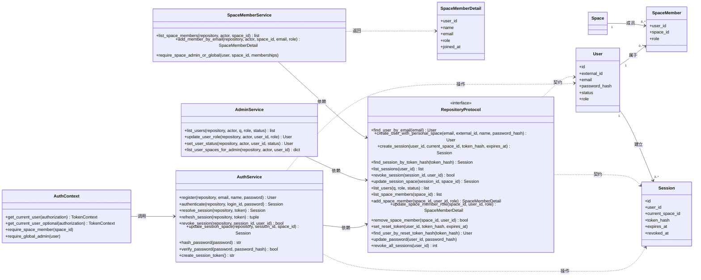
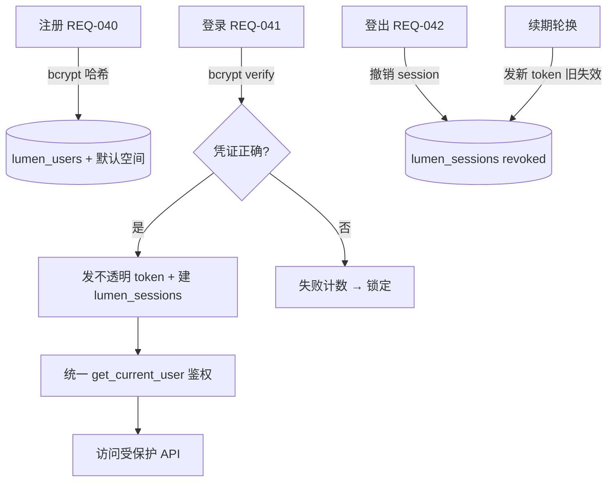
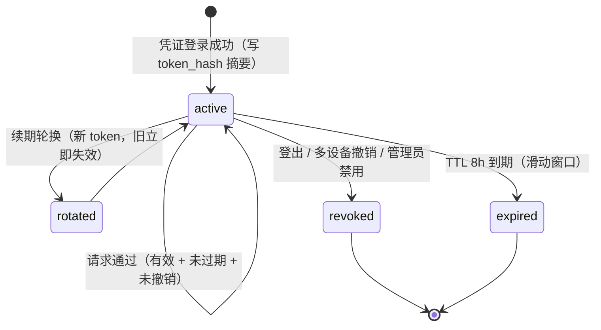

# 账户与认证设计（accounts-auth）

> 定位声明：本文是 Phase2D「账户与多人权限」的详细设计（`docs/design/*`，非平凡子系统 + 安全边界），覆盖 Sprint-26 账号体系基础 / Sprint-27 权限多人化 / Sprint-28 角色分层 + 用户管理 + 团队空间加入。承接 REQ-040..047（U-45..52），不新增 `03` 未批准需求、`06` 未同步表、`07` 未同步接口。状态：**已实现**（Phase2D 三 slice 已完成并收口 2026-08-07；实现偏差见 §15 / §18.9）。

## 0. 元信息

| 项 | 值 |
|---|---|
| 阶段 | Phase2D（账户与多人权限 · 团队验证） |
| 覆盖 REQ | REQ-040 账户注册 / REQ-041 凭证登录 / REQ-042 登出·会话管理（§1~§16）；REQ-043/044 权限多人化（§17 增量）；REQ-045/046/047 角色分层 + 用户管理 + 团队空间加入（§18 增量）；REQ-050/051 维护态批5（§19 增量，2026-08-08） |
| 覆盖 U-ID | U-45 / U-46 / U-47 |
| 验收 | TC-P2-AUTH-001（§1~§16，AC-P2-AUTH-001 / 002 / 003）/ TC-P2-ACC-001（§17）/ TC-P2-ACC-002（§18）/ TC-P2-ACC-003 + TC-P2-AUTH-002（§19） |
| 状态 | **已实现**（Phase2D 三 slice 收口 2026-08-07：Sprint-26 TC-P2-AUTH-001 / Sprint-27 TC-P2-ACC-001 / Sprint-28 TC-P2-ACC-002；维护态批5 Sprint-30 TC-P2-ACC-003 + TC-P2-AUTH-002，2026-08-08）；实现偏差见 §15 / §18.9 / §19.8。2026-08-17 新增 §3.5 会话生命周期状态机 DIAG-STATE-SESSION-01（OO 覆盖度补全 Batch A2）；2026-08-19 docs-system-audit 回梳 §0 元信息（见 `docs/research/2026-08-19-docs-system-audit-04-07-design.md` B7） |
| 上游依据 | `docs/03-prd.md` §3 Phase2D 子节、`docs/02-srs.md` REQ-040..042、`ai/project-rules.md` §1 |
| 下游影响 | `docs/05-tech-spec.md` readiness gate（RG 待补）+ 认证技术栈、`docs/06-db-design.md` `lumen_users` 扩列 + `lumen_sessions` + migration 014、`docs/07-api-spec.md` auth API、`docs/08-dev-plan.md` Sprint-26、`docs/09-verification.md` TC-P2-AUTH-001 |
| 范围外 | REQ-016 多人实时协作（候选 / 不做）；权限多人化（owner_id 跨用户过滤）、全局角色分层、用户管理后台已随 Sprint-27/28 落地，不再列为范围外 |

### 0.5 详细类图（DIAG-CLS-AUTH-01）

> 图纸驱动编码：账户与认证子系统的类级视图（实体 + `RepositoryProtocol` 契约 + 服务层函数）。类图挂 REQ-040/041/042/045/046/047/050/051；方法签名以 `backend/service/*.py` 与 `backend/repository/protocol.py` 为准；编码时按本图落 service 函数与 repository 方法，验收按 §14/§17/§18/§19 追溯。



## 1. 背景与目标

**现状（盘点已确认，详见 §1.1）**：项目已有完整的「空间 + 文档三级权限」过滤底座（DB 字段 + service 谓词 + SQL/检索层过滤），但**账号侧是 Demo 占位**——`lumen_users` 只有 `id / external_id / name`、登录只传 `external_id` 不要密码（`backend/api/auth.py:30`）、token 是手撸 HMAC 非 JWT（`backend/service/auth.py:25`）、3 用户 seed 硬编码 alice=1 / kira=2 / brightlite-member=3、前端默认填 alice 直接进。**无密码 / 无注册 / 无登出 / 无用户管理 / 无全局角色 / 零 auth 库依赖**。

**目标**：把 Demo 占位账号侧升级为真实多用户账号体系，为团队验证和 Sprint-27/28 多人权限打基础。从「无密码直登 + 手撸 token」升级到「bcrypt 凭证 + 不透明 token session + 统一鉴权 + demo 模式物理隔离」。

### 1.1 关键硬约束（基于代码事实）

| # | 约束 | 锚点 |
|---|---|---|
| 1 | `lumen_users` 缺 `password_hash / email / status / 全局 role`，`external_id` 同时充当登录标识 + 显示名 | `backend/model/orm.py:25` |
| 2 | login 零秘密校验（只查 external_id 存在就发 token） | `backend/api/auth.py:30` |
| 3 | token 手撸 HMAC，签名密钥默认 `"local-demo-signing-key"`，无库 / 无 refresh / 无撤销 | `backend/service/auth.py:25`、`backend/api/auth.py:11` |
| 4 | **13 个 router 各自复制 `_read_token_payload`，无中心 `get_current_user`** | `backend/api/spaces.py:69` 等 13 处 |
| 5 | 3 用户 ID 被 seed 冻结（alice=1/kira=2/brightlite-member=3），被 demo token 流程和测试契约依赖 | `backend/migrations/005_sprint8_seed_demo.sql:14`、`backend/repository/demo_repository.py:33` |
| 6 | role 模型是空间级（`lumen_space_members.role: admin/member`），无全局角色 | `backend/model/orm.py:48` |
| 7 | 风险 / Gate 评估空白：无 RG/RISK 覆盖真实账号 / 凭证 / 多用户隔离 | `docs/05/09` |

## 2. 范围边界（Sprint-26 做什么 / 不做什么）

**做（Sprint-26 账号体系基础）**：
- 账户注册（REQ-040）：登录标识 + 密码 → bcrypt 哈希 → 建 `lumen_users` + 默认个人空间
- 凭证登录（REQ-041）：bcrypt verify → 发不透明 token + 建 `lumen_sessions`；失败锁定
- 登出 / 会话管理（REQ-042）：撤销 session、TTL 过期、续期轮换、多设备会话查询/撤销
- `lumen_users` 扩列 + `lumen_sessions` 新表（migration 014）
- 统一 `get_current_user`（FastAPI `Depends`，收敛 13 router）
- 基础登录 / 注册页（独立路由，替换内联表单）
- 登录失败锁定 + 审计日志 + 密钥 env 注入
- **demo 模式保留为 env 开关 + 物理隔离护栏**（PG 强制真实认证，内存仓储允许 demo）

**不做（Sprint-27/28+）**：权限多人化实质改造（owner_id 跨用户过滤回归）、全局角色分层、用户管理后台 UI、REQ-016 多人实时协作。

## 3. 认证流程



### 3.1 注册（REQ-040）
1. 客户端提交 `{ login_id, password, name? }`（`login_id` = email 或 external_id，见 §15 C-AUTH-002）。
2. 后端校验：`login_id` 不重复、`password` 满足最小长度（见 §15 C-AUTH-005）；不满足返回 4220（参数错误）。
3. `passlib.hash.bcrypt.hash(password)`（cost=12）→ 存 `lumen_users.password_hash`（带 `$2b$` 前缀，passlib 自动识别算法）。
4. 建 `lumen_users` 行（status=active）+ 默认个人空间（`lumen_spaces` 一行 + `lumen_space_members` role=admin，见 §15 C-AUTH-001）。
5. 注册成功直接发登录会话（复用 §3.2 登录发 token 逻辑），返回 `{ token, user, current_space_id }`。
6. 审计日志：`register_success` / `register_duplicate`。

### 3.2 凭证登录（REQ-041）
1. 客户端提交 `{ login_id, password, current_space_id? }`。
2. 查 `lumen_users`（by login_id）；**无论账号是否存在，都走 bcrypt 计算**（恒定时序，防账号枚举）。
3. 账号不存在或 `bcrypt.verify` 失败 → 失败计数 +1（`failed_login_count`），达阈值锁定（`locked_until`，见 §15 C-AUTH-003）；返回统一错误「凭证错误或账号不存在」（不区分，防枚举）。
4. 成功 → 清零失败计数、刷 `last_login_at`、发不透明 token + 建 `lumen_sessions`（§5）。
5. 审计日志：`login_success` / `login_failed` / `login_locked`。

### 3.3 登出 / 会话撤销（REQ-042）
1. `POST /api/auth/logout`：置当前 session `revoked_at = now`（或删行）→ token 立即失效。
2. 多设备会话：`GET /api/auth/sessions` 列当前用户活跃会话；`DELETE /api/auth/sessions/{id}` 撤销指定会话。

### 3.4 续期轮换
1. token 将过期时（或显式 `POST /api/auth/refresh`）：校验当前 session 有效 → 发新 token（新 `lumen_sessions` 行或轮换 token_hash）→ 旧 token 失效。
2. **轮换（rotation）**：每次续期发新 token，旧 token 立即失效；**重用检测（reuse detection）留 P3**（被撤销 token 再用 → 全家族撤销，Sprint-26 不做）。

### 3.5 会话生命周期状态机（DIAG-STATE-SESSION-01）

> 详细设计层对象状态图（对照 OO 方法论转换⑧：交互图 → 活动 / 状态图）。`lumen_sessions` 有效期语义（TTL 8h 滑动 + `revoked_at` / `expires_at`），挂 REQ-041 / REQ-042；异常路径：过期 / 撤销 token 再用 → 401，不区分「过期 / 撤销 / 不存在」（防枚举）。



## 4. 密码哈希

- **算法**：bcrypt（`passlib[bcrypt]`），cost factor = 12。
- **存储**：`lumen_users.password_hash` 存 passlib 标准串（`$2b$12$...`），带算法前缀，passlib 自动识别。
- **rehash-on-login 迁移路径**：将来升级 Argon2id 时，登录 `bcrypt.verify` 成功后检测 `password_hash` 前缀，若为旧算法则用新算法 rehash 回写——无缝迁移。
- **不存明文、不日志记录密码**。
- **为什么 bcrypt 而非 Argon2id**：bcrypt 成熟、FastAPI/passlib 一等支持、生态最广；OWASP 列为可接受替代。Argon2id 面向未来但本阶段无刚需（见 §15 C-AUTH-006）。

## 5. token 机制（不透明 token + session 表）

- **生成**：`secrets.token_urlsafe(32)`（256bit，Python 标准库，**零新 token 依赖**）。
- **存储**：`lumen_sessions.token_hash`（存 SHA-256 hash 不存明文，防 DB 泄露后 token 可用）；明文 token 只返回给客户端一次。
- **载荷**：token 本身不携带 claims（不透明）；服务端查 `lumen_sessions` 得 `user_id / current_space_id / session_id`。等价于当前 `TokenPayload`（user_id / current_space_id / exp）由 session 行承载。
- **TTL**：8h（沿用现有），滑动续期（§3.4）。
- **撤销**：`revoked_at` 置位或删行 → 下次请求查库即失效。
- **为什么不用 JWT / 手撸 HMAC**：见 `docs/03-prd.md` Phase2D 进入标准评估记录——手撸 HMAC 是自实现密码学协议（OWASP 反模式）；JWT 的 stateless 优势在「撤销表」存在时白费。不透明 token 最简最稳最易撤销，单体 FastAPI + PG 最务实（PG 单行索引查询，demo 规模无压力；大规模加 Redis 留后续）。

## 6. 统一 `get_current_user`

- 新增 `backend/service/auth_context.py`：提供 FastAPI 依赖项 `get_current_user`（必选）/ `get_current_user_optional`（可选）/ `require_space_member(space_id)`。
- 从 `Authorization: Bearer <token>` 解析 → 查 `lumen_sessions`（有效 + 未过期 + 未撤销）→ 返回 `TokenContext(user_id, current_space_id, session_id, user)`。
- **收敛 13 router**：spaces / documents / rag / search / terms / imports / export / folders / doc_links / tags / quick_entry / timeline 等全部改用 `Depends(get_current_user)`，删除各自复制的 `_read_token_payload`。
- demo 模式下（§7），`get_current_user` 走 demo 快捷分支（直接信任 `external_id`，不查 session），仅在内存仓储生效。

## 7. demo 模式 + 物理隔离护栏

- **实现口径**（偏差 D-3/D-4，见 §15）：demo 模式由**仓储类型**决定（`DemoRepository.is_demo=True`），未实现设计中的 `LUMEN_ENABLE_DEMO_AUTH` env 开关；生产护栏为启动断言 fail-fast。
- **物理隔离**（最稳，根治生产旁路风险）：
  - **PG 仓储（`PgRepository`）**：强制真实认证——所有登录必须 bcrypt 凭证；`get_current_user` 不解析 HMAC demo token（仅内存仓储走 demo 快捷分支）。
  - **内存仓储（`demo_repository`，`run-sprint16-demo` 用）**：允许 demo 快速登录（seed 用户无密码 + 兼容旧 HMAC demo token），用于本地演示 / 测试。
- **启动护栏**：`main.py` lifespan 断言 `LUMEN_ENV=production` 时不得使用 demo 仓储，否则 fail-fast（`RuntimeError: [AUTH] LUMEN_ENV=production must not use the demo repository`）。
- **seed 用户处置**（偏差 D-2）：migration 014 统一为 alice/kira/brightlite-member 设置 demo 密码 `demo-pass-1234` + email（PG 强制凭证登录）；内存仓储保留 `password_hash=None` 的无密码快捷登录语义。
- **密钥**：`LUMEN_DEMO_TOKEN_KEY` 仅用于内存仓储的 HMAC demo token 兼容（保留本地默认值；PG 模式不使用该路径）。

## 8. 数据契约（migration 014）

> 正式回写 `docs/06-db-design.md` 在编码 Sprint-26；此处为设计层字段契约。

### 8.1 `lumen_users` 扩列
```sql
ALTER TABLE lumen_users ADD COLUMN password_hash VARCHAR(255);      -- bcrypt $2b$12$...，demo seed = NULL
ALTER TABLE lumen_users ADD COLUMN email VARCHAR(255);              -- 登录标识候选（见 C-AUTH-002）
ALTER TABLE lumen_users ADD COLUMN status VARCHAR(20) DEFAULT 'active';  -- active / disabled / pending
ALTER TABLE lumen_users ADD COLUMN last_login_at TIMESTAMPTZ;
ALTER TABLE lumen_users ADD COLUMN failed_login_count INT DEFAULT 0;
ALTER TABLE lumen_users ADD COLUMN locked_until TIMESTAMPTZ;
CREATE UNIQUE INDEX IF NOT EXISTS idx_lumen_users_email ON lumen_users(email) WHERE email IS NOT NULL;
```
- 全局角色（role）**本阶段不加**（所有人普通用户）；Sprint-28 角色分层时加 `role` 列或 `lumen_user_roles` 关联表。

### 8.2 `lumen_sessions` 新表
```sql
CREATE TABLE lumen_sessions (
  id BIGSERIAL PRIMARY KEY,
  user_id BIGINT NOT NULL REFERENCES lumen_users(id) ON DELETE CASCADE,
  token_hash VARCHAR(64) NOT NULL UNIQUE,   -- SHA-256(token) hex
  expires_at TIMESTAMPTZ NOT NULL,
  created_at TIMESTAMPTZ NOT NULL DEFAULT now(),
  revoked_at TIMESTAMPTZ,                    -- NULL = 活跃
  last_used_at TIMESTAMPTZ,
  client_ua TEXT,                            -- 审计/多设备识别
  client_ip VARCHAR(64)
);
CREATE INDEX idx_lumen_sessions_user ON lumen_sessions(user_id) WHERE revoked_at IS NULL;
```
- 不存明文 token；撤销 = `revoked_at` 置位（保留审计行）或 TTL 过期清理 job（留后续）。

## 9. API 契约（auth API）

> 正式回写 `docs/07-api-spec.md` 在编码 Sprint-26；编号待分配（现有 auth 域仅 API-001 login）。

| endpoint | 方法 | 用途 | 权限 | 关键错误 |
|---|---|---|---|---|
| `/api/auth/register` | POST | 注册（§3.1） | 公开 | 4220 参数 / 4090 重复标识 |
| `/api/auth/login` | POST | 凭证登录（§3.2，替换现无密码 login） | 公开 | 4010 凭证错误（统一，防枚举）/ 4030 锁定 |
| `/api/auth/logout` | POST | 登出当前会话（§3.3） | 已认证 | — |
| `/api/auth/refresh` | POST | 续期轮换（§3.4） | 已认证（有效 session） | 4010 session 无效 |
| `/api/auth/sessions` | GET | 列当前用户活跃会话 | 已认证 | — |
| `/api/auth/sessions/{id}` | DELETE | 撤销指定会话 | 已认证（owner） | 4004 不存在 / 4030 越权 |

- **契约变更**：现 `POST /api/auth/login`（API-001，入参 `{external_id, current_space_id?}`，不要密码）→ 改为 `{login_id, password, current_space_id?}` + bcrypt verify。属于对外契约破坏性变更，呼应 Phase 跨越 MAJOR 版本（§13）。
- 错误码沿用现有体系（4010 鉴权失败 / 4030 锁定 / 4004 不存在 / 4090 冲突 / 4220 参数），正式映射在编码时回写 `docs/07`。

## 10. 安全控制

| 控制 | 措施 | 阶段 |
|---|---|---|
| 密码哈希 | bcrypt cost 12 | Sprint-26 |
| 登录失败锁定 | `failed_login_count` / `locked_until`（阈值见 C-AUTH-003） | Sprint-26 |
| 审计日志 | register / login_success / login_failed / login_locked / logout（粒度见 C-AUTH-004） | Sprint-26 |
| 密钥管理 | 签名/会话密钥 env 注入，禁默认值，生产 fail-fast | Sprint-26 |
| HTTPS | token 必须走 HTTPS（生产）；本机 demo HTTP 可接受，文档标注 | Sprint-26（生产部署） |
| CSRF | Bearer header 天然免疫 CSRF（沿用现有 `Authorization` header，不入 cookie） | 已满足 |
| 速率限制 | 登录端点速率限制（防暴力）——复用锁定机制兜底；独立 rate limiter（如 slowapi）留 P2 | 锁定 Sprint-26 / limiter P2 |
| 账号枚举 | 登录失败统一错误，恒定时序 bcrypt 计算 | Sprint-26 |

## 11. readiness gate

进入编码 Sprint-26 前，以下 gate 需 Go（正式 RG-ID 在 `docs/05` 分配，候选 RG-011..013）：

| 候选 RG | 主题 | 验证方式 | 结论 |
|---|---|---|---|
| RG-011 | 密码哈希选型（bcrypt，不采用 passlib） | 本机 `pip install bcrypt` + hash/verify 最小验证 | **Go（2026-08-07 PoC）**：bcrypt 5.0.0 / Python 3.14.3，cost 12 ≈0.21s，恒定时序 |
| RG-012 | token session 安全（密钥 env、TTL、撤销、续期轮换、恒定时序） | 单测覆盖撤销/过期/续期轮换/枚举 | **Go（2026-08-07 单测）**：`tests/backend/test_auth.py` |
| RG-013 | 跨用户隔离回归 | 注册两个真实用户，验证私有文档仅 owner 可见、跨用户不泄露 | **Go（2026-08-07）**：test_auth.py 注册用户 + 个人空间隔离断言 |

> RG-011 已作为编码第一步完成本机 PoC（2026-08-07）；RG-012/013 靠单测 + 回归 TC 覆盖，均 Go。

## 12. 失败 / 降级

- **DB 不可用**：注册/登录/会话查询返回 5000，不静默降级（认证失败必须明确）。
- **密钥缺失**：启动 fail-fast，不发 token。
- **bcrypt 库不可用**：登录/注册返回 5030（依赖不可用），不降级为明文。
- **LLM 无关**：本子系统不涉及 LLM，无 LLM 降级路径。

## 13. 版本与契约影响

- **版本**：Phase2C → Phase2D 是 Phase 跨越 + 对外契约破坏性变更（login 入参改、API-001 契约变），按 `ai/project-rules.md` §2.4.1 应 **bump MAJOR v3.0**，时机为 Sprint-26 验收发布。
- **migration**：014 = `lumen_users` 扩列 + `lumen_sessions`；`lumen_vault_mounts`（原 Wave 3 预占 014）顺延 015，回写 `docs/06`。

## 14. 验收追溯

- **TC-P2-AUTH-001**（`docs/09` 待定义，批次 3）：覆盖 AC-P2-AUTH-001/002/003——
  1. 注册新账号 → 凭证登录成功 → 鉴权访问受保护 API；重复标识拒绝；密码 bcrypt 哈希存储（查库非明文）。
  2. 错误密码失败；连续失败 N 次锁定；登录失败不区分账号是否存在。
  3. 登出后原 token 再用被拒；session TTL 过期失效；续期轮换后旧 token 失效；多设备会话可查询/撤销。
  4. demo 模式开关：PG 强制真实 / 内存允许 demo；生产环境 fail-fast。
- 自动化位置：后端 `tests/backend/test_auth.py`（待建）；浏览器 smoke 覆盖登录/注册页。

## 15. 实现偏差 / 设计回写

> Sprint-26（2026-08-07）编码后回填。偏差均未越出 Phase2D 边界；正式契约以 `docs/06-db-design.md` / `docs/07-api-spec.md` 为准。

| # | 设计（§章节） | 实际实现 | 原因 / 影响 |
|---|---|---|---|
| D-1 | §8.2 `lumen_sessions` 无 `current_space_id` 列 | migration 014 补入 `current_space_id BIGINT REFERENCES lumen_spaces(id) ON DELETE SET NULL` | §5 会话载荷需承载当前空间；登录 / 切空间写会话行 |
| D-2 | §7 seed 用户 `password_hash = NULL`（demo-only） | migration 014 为 3 个 seed 用户统一设置 bcrypt demo 密码（`demo-pass-1234`）并补 email | PG 集成测试 / 真实路径需凭证；NULL 语义仅保留在内存仓储 |
| D-3 | §7 env 开关 `LUMEN_ENABLE_DEMO_AUTH` | **未实现**；demo 模式由仓储类型决定（`DemoRepository.is_demo=True`） | 更简且更硬的物理隔离：PG 仓储天然强制真实凭证 |
| D-4 | §7 启动告警日志 `[DEMO AUTH ENABLED — NOT FOR PRODUCTION]` | 未单独实现日志告警；改为启动期断言 fail-fast（`LUMEN_ENV=production` + demo 仓储拒绝启动） | 护栏更硬；demo 可见性靠仓储类型 + 文档标注 |
| D-5 | §7 密钥「禁默认值」 | `LUMEN_DEMO_TOKEN_KEY` 保留本地默认值（仅内存仓储 HMAC 兼容使用；PG 模式不走该路径） | demo 兼容所需；生产路径不依赖默认密钥 |
| D-6 | §9 login 入参 `{login_id, password, current_space_id?}` | 实现为 `login_id` + `password` + 可选 `external_id`（demo 别名）+ 可选 `current_space_id`；错误码 4010（凭证）/ 4030（锁定/禁用）/ 4090（重复 email）/ 4220（参数）/ 4004（会话不存在） | `external_id` 兼容旧 demo 客户端；错误码与 §10 对齐 |
| D-7 | 前端「独立登录/注册页（独立路由）」 | 实现为 `App.tsx` 登录面板内登录/注册 **tab 切换**（`authMode`），未引入 router | 最小改动、不引路由依赖；页面形态留 Sprint-27/28 前端收口 |
| D-8 | §14「浏览器 smoke 覆盖登录/注册页」 | 后端自动化已通过；浏览器 smoke 与 demo 启动验证**待用户确认**（RISK-P2-AUTH-001） | 本机环境限制；后续补 headless / 人工 smoke |
| D-9 | §6 收敛 13 router | 已收敛：spaces / documents / rag / search / terms / imports / export / folders / doc_links / tags / quick_entry / timeline 等改用 `Depends(get_current_user)`；内存仓储保留 HMAC demo token 兼容分支 | `get_current_user` 先查 session、demo 仓储再回退 demo token |


## 16. 待确认项（编码前需拍板）

| ID | 待确认项 | AI 建议 | 依据 | 备选 | 取舍 / 阻塞 |
|---|---|---|---|---|---|
| C-AUTH-001 | 注册空间归属 | 自建个人空间（每新用户一个默认私有空间，role=admin） | 最简、不阻塞；团队空间邀请留 Sprint-27/28 | 邀请码加入 / 管理员分配 | 影响注册流程；不阻塞设计 |
| C-AUTH-002 | 登录标识 | email（用户友好、可找回） | 主流；external_id 现状作显示名/句柄 | external_id（现状）/ username | 影响 `login_id` 字段；不阻塞 |
| C-AUTH-003 | 登录失败锁定阈值 | 5 次 / 15min 锁定 15min | 主流默认 | 3 次 / 10 次 | 调参项；不阻塞 |
| C-AUTH-004 | 审计日志粒度 | 最小：register / login_success / login_failed / login_locked / logout | 安全合规最小集 | 更细（session 续期/撤销） | 影响 `lumen_audit_log` 是否新建表（建议先用日志，表留后续） |
| C-AUTH-005 | 密码策略 | 最小长度 8（NIST 长度优先，不强制复杂度） | NIST 2017 主流 | 长度 12 / 加复杂度 / HIBP breach 检查（P3） | 调参项；不阻塞 |
| C-AUTH-006 | bcrypt vs Argon2id | bcrypt 起步 | 成熟、生态广；rehash 路径可后续升 Argon2id | 直接 Argon2id | 不阻塞；差异小 |

> **确认记录（2026-08-07 编码前）**：C-AUTH-001..006 均按 AI 建议落地——C-AUTH-001 注册自建个人空间（role=admin）；C-AUTH-002 登录标识 email（兼容 external_id 别名）；C-AUTH-003 锁定阈值 5 次 / 15min；C-AUTH-004 审计最小集（register / login_success / login_failed / login_locked / logout，结构化日志，不新建表）；C-AUTH-005 密码策略 8–64 字符；C-AUTH-006 bcrypt（cost 12，不采用 passlib）。`docs/01 §4` 的 U-45「注册空间归属待确认」随之关闭。

## 17. Sprint-27 权限多人化设计（增量·已实现 2026-08-07）

> 定位：Phase2D「账户与多人权限」Sprint-27 增量设计（2026-08-07 立项；**已实现 2026-08-07**）。承接 REQ-043 / REQ-044（REQ-001/002/003 扩展，U-48 / U-49），在 Sprint-26 账号体系之上做权限过滤实质改造与回归。C-ACC-001..003 已确认（2026-08-07 按 AI 建议执行）。

### 17.1 目标与范围

- **目标**：在真实多用户账号体系上验证并补全权限过滤底座——任何用户只能看到其所属空间的可见文档；私有文档仅 owner 可见；外部只读仅 owner 可写；列表 / 搜索 / 问答 / 时间线 / 目录树 / 标签 / 导出 / 链接 / 快速录入等全部查询路径跨用户零泄露。
- **做（Sprint-27）**：owner_id 跨用户过滤全路径审计与回归、私有按 owner 过滤回归、外部只读仅 owner 可写回归、跨用户隔离自动化回归、空间隔离 / 切换回归（REQ-001/002/003 扩展）。
- **不做（Sprint-28+）**：全局角色分层 / 用户管理后台 UI（Sprint-28）、REQ-016 多人实时协作；不引新依赖；预期零 migration（`lumen_documents.owner_id` 等字段已存在）。

### 17.2 现状（代码事实锚点，2026-08-07 盘点）

| # | 事实 | 锚点 |
|---|---|---|
| 1 | 权限谓词已集中：`can_view_document`（space_id 相等 + 空间成员 + PRIVATE→owner_id == user_id）、`can_write_document`（external 仅 owner 可写）、`filter_visible_documents`、`visible_document_where_clause`（SQL 层） | `backend/service/permission.py` |
| 2 | 文档 CRUD / 链接 / folder document_count / quick_entry 已走可见性谓词 | `backend/service/document.py`、`backend/service/doc_links.py`、`backend/service/folder.py` |
| 3 | 空间成员校验：`ensure_space_access` + `list_memberships()`；`lumen_space_members.role` 为空间级 admin/member | `backend/service/space.py`、`backend/model/orm.py:48` |
| 4 | 鉴权已收敛：`get_current_user` / `get_current_user_optional` / `require_space_member` | `backend/service/auth_context.py` |
| 5 | RG-013（跨用户隔离回归）Go（2026-08-07）：注册用户 + 个人空间隔离断言 | `tests/backend/test_auth.py`、`docs/05-tech-spec.md` RG-013 |

### 17.3 设计决策（草案）

| # | 决策 | AI 建议 | 依据 / 备选 |
|---|---|---|---|
| D-ACC-001 | owner 过滤统一 | 全查询路径统一复用 `can_view_document` / `visible_document_where_clause`（列表 / 搜索 hybrid / RAG 候选 / 时间线 / 目录树计数 / 标签 document_count / 导出 ZIP / 链接 / 快速录入），逐路径审计并修复遗漏 | 谓词已集中，审计成本低；避免路径级复制导致漂移 |
| D-ACC-002 | 私有按 owner 过滤 | PRIVATE → `owner_id == user_id`（含同空间成员）；external 仅 owner 可写（写路径 4003） | 已实现（permission.py）；Sprint-27 补回归断言 |
| D-ACC-003 | 空间隔离 / 切换回归 | 真实账号下回归 REQ-001/002：仅能访问所属空间；切换后上下文只反映目标空间 | 已有 `is_space_member` / `ensure_space_access` / `current_space_id` 会话承载 |
| D-ACC-004 | 隔离回归测试形态 | 扩展 `tests/backend/test_permission.py` + 新增多用户隔离用例（注册 2-3 真实用户，逐路径断言零泄露） | RG-013 已铺底；全路径矩阵比单路径更可信 |
| D-ACC-005 | 团队空间加入机制 | **Sprint-27 不做**，留 Sprint-28 与角色 / 用户管理 UI 一起；Sprint-27 隔离回归使用注册自建个人空间 + seed 同空间成员数据 | C-AUTH-001 备选（邀请码加入 / 管理员分配）；保持 Sprint-27 聚焦隔离可信 |
| D-ACC-006 | 前端改动 | 预期零前端改动（过滤在 service/SQL 层）；若回归暴露前端可见性问题，最小修复并记录 | 隔离是服务端职责；前端只消费过滤后结果 |

### 17.4 验证方案（已执行 2026-08-07）

- 后端：`tests/backend/test_permission.py` 扩展（MultiUserIsolationTest：注册双用户 10 路径零泄露 + external 只读 4003 + 跨空间）+ `test_doc_links.py` 4004 用例；既有权限 TC（TC-P1-001/002/003）回归不破；backend discover **229 OK（skipped=2）**。
- 浏览器 smoke：`scripts/smoke-sprint27-isolation-browser.mjs` PASS——注册 A/B 跨空间零泄露（列表/搜索/doc-links 404）；seed alice+kira 同空间 PRIVATE 列表/搜索/读取/导出零命中 + doc-links 404 + external 4003；浏览器 kira 目录树无私有文档 / alice 可见。
- 零 migration / 零新依赖确认：`06` / `07` 无契约变更；前端零改动。

### 17.5 待确认项（编码前拍板）

| ID | 待确认项 | AI 建议 | 依据 | 备选 | 取舍 / 阻塞 |
|---|---|---|---|---|---|
| C-ACC-001 | 团队空间加入机制（邀请码 / 管理员分配）是否进 Sprint-27 | 不进，留 Sprint-28 与角色 / 用户管理 UI 一起 | 主流（Notion / 语雀 / 飞书知识库 / Confluence）：空间成员由创建者或管理员主动添加 / 邀请链接加入，与成员管理页强绑定；只做邀请不做管理页 = 孤儿 UI；邀请码有枚举 / 过期 / 滥用成本；3-5 人团队最简路径 = 空间设置加成员 | 进 Sprint-27（范围扩大） | 影响范围与验收；不阻塞隔离回归 |
| C-ACC-002 | 全路径审计中发现的既有泄露缺口处理 | 分档：P0 跨用户泄露必修（阻塞退出）；P1 越权写 / 元数据可见修复；P2 已知降级记录并由用户确认接受；契约变更先停下确认 | 安全隔离按 fail-closed，发现即修；不得把「已审计未修复」写成已通过 | 全部记录为已知风险推迟 | 安全边界；P0 阻塞退出标准 |
| C-ACC-003 | 是否新增用户列表 / 空间成员类 API（团队空间加入时用） | Sprint-27 不加；预留契约方向（空间成员 CRUD 走 space 域、用户管理走 admin 域），Sprint-28 立项时定稿 | 消费者是 Sprint-28 成员管理 UI（YAGNI）；提前暴露用户信息面有枚举风险；避免两轮破坏性契约变更 | 提前加 | 范围蔓延 |

> **确认记录（2026-08-07）**：用户按 AI 建议执行——C-ACC-001 不进 Sprint-27（留 Sprint-28 与角色 / 用户管理 UI 一起）；C-ACC-002 按 P0/P1/P2 分档修复，P0 阻塞退出标准；C-ACC-003 Sprint-27 不加（契约方向预留：空间成员 CRUD 走 space 域、用户管理走 admin 域）。可选增强（文档列表「创建者」列 / tooltip 强化归属认知）不纳入本 Sprint，另行评估。

### 17.6 实现结果与偏差（2026-08-07）

- **审计结论**：20 条查询路径全检，P0 1 处、P1 0 处、P2 2 处（见下）。
- **P0 修复（跨用户泄露，已修）**：`GET /api/doc-links` 查询前未校验源文档可见性——同空间成员可枚举他人 PRIVATE 文档 id，从出链 `link_text` 泄露私有正文片段；修复为 `list_links` 先 `get_visible_document`（不可见→4004），API 层映射 4004（提交 `6c293a0`）。
- **P2 记录（待用户确认接受）**：① `visible_document_where_clause` 全仓仅定义未使用（过滤收敛在 Python 层，无 SQL 下沉；安全无泄露，属事实漂移——`test_permission.py` 同名用例仅断言字符串字面量，测试名与实现不符）；② `upsert_link` 按标题解析目标可指向同空间不可见文档（仅记录链接行，不向请求者返回解析结果，无读泄露）。
- **实现偏差**：预期零——未新增依赖 / migration / API 契约变更 / 前端改动；P0 修复为 service + API 层最小改动。

## 18. Sprint-28 角色分层 + 用户管理 + 团队空间加入（增量设计·草案）

> 定位：Phase2D「账户与多人权限」Sprint-28 增量设计（2026-08-07 立项）。承接 REQ-045 / REQ-046 / REQ-047（U-50 / U-51 / U-52），在 Sprint-26 账号体系 + Sprint-27 权限过滤底座之上补齐团队治理能力。C-ROLE-001..004 已确认（2026-08-07 用户按 AI 建议执行，主流设计评估见 handoff / 立项对话）。

### 18.1 目标与范围

- **目标**：完成「账号 → 权限 → 团队协作」的 Phase2D 闭环——全局角色分层（admin / member）、用户管理后台（admin 域）、团队空间加入机制（space 域成员管理）。
- **范围**：REQ-045 全局角色分层（`lumen_users.role`，默认 member）；REQ-046 用户管理后台（用户列表 / 过滤 / 改角色 / 禁用启用）；REQ-047 团队空间加入（按 email 搜索添加成员 / 改空间角色 / 移除）。migration 016；零新依赖。
- **不做（Sprint-28 外，留候选 / 后续）**：移除用户 / 重置密码 / 邀请码与邀请链接 / REQ-016 多人实时协作 / 角色矩阵化（`lumen_user_roles` 关联表）；管理鉴权不因 demo 仓储类型旁路。

### 18.2 设计决策（已确认 2026-08-07）

| ID | 决策 | 依据（主流设计与交互） | 备选（未采） |
|---|---|---|---|
| C-ROLE-001 | 全局角色单列 `lumen_users.role`（admin / member，`DEFAULT 'member'` + `CHECK`） | Notion / GitHub 组织均为单值枚举角色；3–5 人团队无需多角色矩阵；与 `lumen_space_members.role` 同构 | `lumen_user_roles` 关联表（权限矩阵化时才需要，远期迁移路径明确） |
| C-ROLE-002 | 用户管理最小集：用户列表 + 按角色 / 状态过滤 + 改全局角色 + 禁用 / 启用；不做移除用户 / 重置密码 | 主流管理页标配列表 + 角色 + 禁用；重置密码走用户自助（管理员强改会绕过安全链路）；移除用户触发文档转交 / 孤儿策略，超出团队验证 | 移除用户（级联处理文档，产品级决策）；重置密码（需邮件基础设施） |
| C-ROLE-003 | 团队空间加入 = 空间设置按 email 搜索用户添加（含空间角色）；不做邀请码 / 邀请链接 | Notion / 语雀 / Confluence / GitHub 私有仓库均为管理员主动添加；邀请链接需过期 / 吊销 / 审批管理，小团队过度设计 | 邀请码（枚举 / 过期 / 滥用成本高）；邀请链接（公开加入场景，留候选） |
| C-ROLE-004 | demo seed：alice=admin、kira / brightlite-member=member（内存 / PG 一致）；管理入口前端按角色显隐 + 后端强制鉴权 | 演示环境覆盖「管理员操作 + 普通成员被限制」两条路径；显隐是体验、校验是安全，两者不互相替代 | seed 全 member（demo 无法演示管理路径） |

### 18.3 数据契约（migration 016）

```sql
ALTER TABLE lumen_users ADD COLUMN role VARCHAR(20) NOT NULL DEFAULT 'member';
ALTER TABLE lumen_users ADD CONSTRAINT chk_lumen_users_role CHECK (role IN ('admin','member'));
-- seed 对齐：alice → 'admin'；kira / brightlite-member → 'member'
```

- 沿用 Sprint-26 的 `status`（active / disabled / pending）语义：禁用 = `status='disabled'`，登录 4030（复用既有 `login` 锁定 / 禁用分支），既有会话失效；**不删除用户、不迁移文档**（私有文档仅 owner 可见，禁用不改变可见性，不泄露）。
- migration 编号：014 已用（Sprint-26），015 预留给 vault_mounts（Wave 3），本 Sprint 用 **016**。

### 18.4 API 契约（草案，编号编码 Sprint 时分配）

| 域 | endpoint | 方法 | 用途 | 权限 | 关键错误 |
|---|---|---|---|---|---|
| admin | `/api/admin/users` | GET | 用户列表（id / name / email / role / status / last_login_at；支持 `q` / `role` / `status` 过滤） | 全局 admin | 4030 非 admin / 4220 参数 |
| admin | `/api/admin/users/{id}` | PATCH | 改全局角色 / 禁用 / 启用（`role` / `status`） | 全局 admin | 4030 / 4004 不存在 / 4220 |
| space | `/api/spaces/{id}/members` | GET | 空间成员列表（user_id / name / email / role / joined_at） | 空间成员 | 4001 / 4003 / 4004 |
| space | `/api/spaces/{id}/members` | POST | 按 email 添加成员（`{email, role}`，role 默认 member） | 空间 admin | 4030 / 4004 用户不存在 / 4090 已是成员 |
| space | `/api/spaces/{id}/members/{user_id}` | PATCH | 改空间角色（admin / member） | 空间 admin | 4030 / 4004 / 4220 |
| space | `/api/spaces/{id}/members/{user_id}` | DELETE | 移除成员（文档归属不变） | 空间 admin | 4030 / 4004 |
| shared | `/api/users/search?q=` | GET | 添加成员时的用户搜索（返回 id / name / email 最小字段） | 空间 admin 或全局 admin | 4030 / 4220 |

- **契约方向**（C-ACC-003 已预留）：用户管理走 **admin 域**、空间成员 CRUD 走 **space 域**；用户搜索为受限共享端点。
- **隐私护栏**：所有用户信息端点不返回 `password_hash` / `external_id` 之外敏感字段；用户搜索仅管理上下文可用（防普通用户枚举账号）。
- **管理鉴权**：admin / space-member 校验在 service 层统一实现（类似 `get_current_user` / `require_space_member`），不因仓储类型（PG / demo）旁路。

### 18.5 前端交互（草案）

- **用户管理页（admin 域）**：全局 admin 可见「用户管理」入口（TopBar / Nav Rail 项，member 不可见）；页内用户列表（头像 / 姓名 / email / 角色徽标 / 状态 / 最后登录）+ 角色 / 状态过滤 + 行内操作（角色下拉、禁用开关）；禁用操作二次确认并说明影响（"该用户将无法登录，文档保留不删除"）；空态「暂无用户」。
- **空间设置成员管理（space 域）**：空间 admin 在空间设置 / 成员 tab 添加成员（email 搜索输入 → 结果选择 → 空间角色下拉 → 添加）、行内改角色、移除（确认弹窗说明"将失去该空间访问，文档归属不变"）；非空间 admin 无成员管理入口。
- 交互基线沿用现有工作台（无新组件库 / router 依赖，保持 WSG 与既有 CSS token 体系）。

### 18.6 安全控制

- 管理 API 一律后端强制鉴权（4030），前端显隐仅为体验；用户列表 / 搜索不暴露 `password_hash`；禁用不删数据、不改变既有文档可见性。
- 越权矩阵（编码 Sprint 测试覆盖）：全局 member 调 admin API → 4030；空间普通成员调成员管理 → 4030；非空间成员访问空间成员列表 → 4003 / 4004；demo 仓储不旁路以上任何校验。

### 18.7 验证方案（编码 Sprint）

- 后端：`tests/backend/test_role.py`（角色默认值 / CHECK / seed 对齐）+ `test_admin_users.py`（admin 域列表 / 过滤 / 改角色 / 禁用启用 / 4030 越权 / 不泄露 password_hash）+ `test_space_members.py`（成员 CRUD / email 添加 / 4090 重复 / 4030 越权 / 移除后失权）；既有 `test_auth.py` / `test_permission.py` 回归不破；全量 backend discover。
- 前端：`volta run --node 22.17.1 npm run build` + 浏览器 smoke（用户管理页 + 空间设置成员管理，admin / member 双视角）。
- 验收：TC-P2-ACC-002（`docs/09-verification.md` §2）。

### 18.8 待确认项（编码前拍板）

| ID | 待确认项 | AI 建议 | 依据 | 备选 | 取舍 / 阻塞 |
|---|---|---|---|---|---|
| C-ROLE-005 ✅已确认（2026-08-07） | admin 域用户列表是否包含 `last_login_at` 展示 | 包含（只读展示，仅 admin 域可见，可排序） | 主流管理页标配最后活跃 / 最后登录（GitHub / Slack / Google Workspace），便于识别僵尸账号 | 不展示 | 低风险，仅元数据；未来强隐私诉求可降级 |
| C-ROLE-006 ✅已确认（2026-08-07） | 空间 admin 能否移除 / 降级最后一个空间 admin | 禁止（至少保留 1 个 admin，后端强制拒绝 **4090** + 前端禁用按钮并提示） | 主流（GitHub org owner / Notion / Google Workspace）防止自锁；无管理员空间不可治理 | 允许（留下无管理员空间） | 会导致空间失控；4090 语义「操作会导致空间无管理员」 |
| C-ROLE-007 ✅已确认（2026-08-07） | 全局 admin 与空间 admin 交叉时是否允许全局 admin 管理任意空间成员 | 允许（全局 admin 拥有空间成员管理同权；鉴权谓词统一 `is_global_admin OR is_space_admin`；成员管理操作写审计日志） | 平台级管理员兜底语义（GitHub org owner / Confluence system admin / Google super admin）；全局角色无全局能力则形同虚设 | 仅空间 admin | 权限面大但由 admin 校验 + 审计兜底 |

> **确认记录（2026-08-07）**：用户按 AI 建议执行——C-ROLE-005 显示 `last_login_at`（admin 域只读列）；C-ROLE-006 禁止移除 / 降级最后一个空间 admin（后端 4090 + 前端防呆）；C-ROLE-007 全局 admin 对任意空间成员管理同权（统一鉴权谓词 + 审计事件 `member_added / member_role_changed / member_removed`）。

### 18.9 完成记录与实现偏差（2026-08-07 编码 Sprint 验收）

**完成记录**：TC-P2-ACC-002 通过（backend discover 275 OK（skipped=2）+ 浏览器双视角 smoke PASS）。migration 016（`lumen_users.role` + CHECK + seed 对齐 alice=admin / kira·brightlite-member=member + `lumen_space_members.created_at`）；admin 域（API-044/045：列表 / 过滤 / 改角色 / 禁用启用，禁用后登录 4030 且会话失效，不泄露 `password_hash`）；space 域（API-046..049：按 email 添加 / 改空间角色 / 移除，移除后失权 4003，最后一个 admin 4090）；受限用户搜索（API-050，member 4030）；鉴权谓词统一 `is_global_admin OR is_space_admin`（C-ROLE-007）；审计事件 user_role_changed / user_status_changed / member_added / member_role_changed / member_removed；前端用户管理页 + 空间设置成员管理（入口按角色显隐，member 不可见）。详见 `docs/07-api-spec.md` API-044..050 与 `docs/09-verification.md` §5。

**实现偏差（相对 §18.4 / `docs/07` §3.9 契约草案）**：
1. **未实现分页**：API-044/046 契约草案含 `page?` / `{items,total,page}`，实现为扁平 `{code,msg,data:[...]}`（3-5 人团队规模，未分页；`docs/07` 契约按实际回写）。
2. **响应字段差异**：API-045/048 响应不含 `updated_at`（admin 用 `last_login_at`、成员用 `joined_at`）；API-049 删除返回 `data:null`。
3. **未实现 `last_login_at` 显式排序**（C-ROLE-005 草案「可排序」）：当前按仓储返回顺序展示，仅作只读列。
4. **refresh 响应不含 `role`**：登录响应新增 `role`（additive，支撑前端管理入口显隐）；刷新 token 后角色不刷新（前端以登录时角色为准，属已知边界）。
5. 其余与契约一致：seed、鉴权谓词、最后一个 admin 4090、审计事件、demo 仓储不旁路。

## 19. Sprint-30 忘记密码 + 登录密码显隐（增量设计·已实现 2026-08-09）

> 定位：维护态批5（Sprint-30）增量设计（2026-08-08 立项 / 2026-08-09 编码）。承接 REQ-051（U-54），在 Sprint-26 账号体系底座上补齐「忘记密码自助重置 + 登录密码显隐」。C-PWD-001..004 已确认（2026-08-08/09）。同批 REQ-050（成员空间可见性）见 `docs/design/batch-maintenance-2026-08-08.md` §3 + 本仓 commit 2（API-054）。

### 19.1 目标与范围

- **目标**：① 登录 / 注册密码框支持「小眼睛」显隐；② 提供「忘记密码」自助重置流程（reset token 一次性、TTL 30min、重置成功吊销全部活跃 session）。
- **范围**：REQ-051 忘记密码后端（migration 018 `lumen_users` reset 3 列 + service `auth_reset.py` + API-055/056）+ 前端（`PasswordInput` 小眼睛 + `PasswordResetModal` 两步重置 + 登录 form 入口）；登录 / 注册密码框统一换 `PasswordInput`。零新依赖（bcrypt / hashlib / secrets 均已有）。
- **不做（留候选 / 后续）**：SMTP 真实邮件投递（demo 降级 token 写日志）、邮箱验证、OAuth、邀请码、独立限流（接受风险，登录失败锁定兜底）。

### 19.2 设计决策（已确认）

| ID | 决策 | 依据 | 备选（未采） |
|---|---|---|---|
| C-PWD-001 | reset token = `secrets.token_urlsafe(32)`，DB 只存 `sha256_hex(token)`，明文仅进后端 WARNING 日志 | 与 `lumen_sessions.token_hash` 同口径（不存明文 token）；demo 无 SMTP，运维从日志取 token 人工下发 | 明文入库（不可接受） |
| C-PWD-002 | `/request` 恒响应「若该邮箱已注册，重置链接已发送」；账号不存在时对 dummy bcrypt hash 做 `verify_password` 保恒时时序 | 主流防枚举（GitHub / Google）；不泄露账号是否存在 | 区分响应（泄露账号枚举面） |
| C-PWD-003 | token 一次性（`reset_used_at`）+ TTL 30min；重置成功吊销该用户全部活跃 session | 一次性防重放；30min 平衡可用与安全；吊销全部 session 对齐跨设备安全（密码已变，旧 session 须失效） | 仅吊销当前 session / 不吊销 |
| C-PWD-004 | demo 降级 token 写结构化 JSON WARNING 日志（`lumen.auth.reset` logger），注释明示生产接 SMTP | demo 规模 + 无 SMTP；结构化日志便于运维提取 | 接 SMTP（demo 无邮件基础设施） |

### 19.3 数据契约（migration 018）

```sql
ALTER TABLE lumen_users ADD COLUMN reset_token_hash VARCHAR(64);   -- sha256_hex(token)；NULL = 无进行中重置
ALTER TABLE lumen_users ADD COLUMN reset_expires_at TIMESTAMPTZ;   -- 签发 +30min
ALTER TABLE lumen_users ADD COLUMN reset_used_at TIMESTAMPTZ;      -- NULL = 未使用；重置成功置位，留审计
CREATE INDEX idx_lumen_users_reset_token ON lumen_users(reset_token_hash)
  WHERE reset_used_at IS NULL AND reset_token_hash IS NOT NULL;    -- 稀疏索引（仅有效 token）
```

- 不加 UNIQUE：同一用户可多次 `/request`（后者覆盖前者 hash + 清 `used_at`），已用 token 不删行、只置 `used_at` 保留审计。
- `update_password` 顺带 reset 失败计数 + 解锁（重置成功后不应仍处锁定态）。

### 19.4 API 契约（API-055 / API-056）

| 域 | endpoint | 方法 | 用途 | 权限 | 关键错误 |
|---|---|---|---|---|---|
| auth | `/api/auth/password-reset/request` | POST | 申请重置（`{email}`）；**恒响应** `{message}` | 公开 | 恒 200（不泄露） |
| auth | `/api/auth/password-reset/confirm` | POST | 确认重置（`{token, new_password}`）；改密 + 吊销全部 session | 公开（凭 token） | 4220 密码 <8 / >64；4010 token 无效 / 过期 / 已用 |

- 恒响应口径（C-PWD-002）：`/request` 无论账号是否存在，返回同一 `{message: "若该邮箱已注册，重置链接已发送（demo 模式请从后端日志取 token）。"}`。
- token 失败统一 4010（不区分「不存在 / 已用 / 过期」防信息泄露）。
- 重置成功 `data:null`，审计事件 `password_reset_requested` / `password_reset_confirmed`（含 `revoked_sessions` 计数）。

### 19.5 前端交互

- **`PasswordInput`**（`features/auth/PasswordInput.tsx`）：受控密码框 + 「显示 / 隐藏」toggle，复用于登录 / 注册 / 重置（降 `App.tsx` 负载）。
- **`PasswordResetModal`**（`features/auth/PasswordResetModal.tsx`）：居中弹窗两步——① email 申请（提示 demo 从日志取 token）→ ② token + 新密码确认 → 成功提示「全部会话已失效，请用新密码登录」。
- 登录 form 密码框下加「忘记密码？」链接式按钮打开 modal；登录 / 注册两处密码框统一换 `PasswordInput`。
- 交互基线沿用现有 CSS token 体系（新 `styles/auth.css`，<100 行）；回车天然支持（`<form onSubmit>`）、注册已有长度提示、loading 复用 `runAction` / 按钮 disabled。

### 19.6 安全控制

- reset token 只存 `sha256_hex`，明文仅进日志（demo 降级，生产须接 SMTP 并移除明文日志）。
- 防枚举：`/request` 恒响应 + dummy bcrypt 恒时序（复用 `_get_dummy_hash`）。
- 一次性 + TTL：`reset_used_at` 置位后不可重放；过期 30min。
- 重置吊销全部 session：`revoke_all_sessions(user_id)` 对齐跨设备安全。
- 无独立限流（接受风险）：恒响应降低暴力价值，登录侧 5 次失败锁定兜底。

### 19.7 验证方案（commit 4）

- 后端：`tests/backend/test_auth.py` 加 reset 用例——request 恒响应 + 日志有 token + DB 存 hash 非明文 / confirm 成功新密码登录旧密码失败 / 过期 4010 / 二次使用 4010 / 重置后活跃 session 全吊销（`resolve_session`→None）/ 密码 <8 → 4220 / 防枚举响应一致；内存 + PG 仓储一致；全量 backend discover 不回归。
- 前端：`volta run --node 22.17.1 npm run build`（绿，commit 3 已验 301 modules）+ 新 `scripts/smoke-batch5-auth-admin-browser.mjs`（小眼睛 + 忘记密码全流程 + admin 空间可见性授予 / 撤销 + 最后一个 space admin 保护）。
- 真 PG：`lumen-pg` 容器应用 migration 018（schema 校验）。
- 验收：TC-P2-AUTH-002（`docs/09-verification.md`）。

### 19.8 实现结果与偏差（2026-08-09 commit 3 编码完成，测试 / smoke / 版本留 commit 4）

**完成记录（commit 3）**：migration 018（`lumen_users` reset 3 列 + 稀疏索引）；entities / orm User +3 字段；pg + demo repository 各 +5 方法（`set_reset_token` / `find_user_by_reset_token_hash` / `update_password` / `clear_reset_token` / `revoke_all_sessions`）；service `auth_reset.py`（从 `auth.py` 拆出，复用 bcrypt / sha256 / session / 审计 helper，auth.py 不增长）；api/auth API-055/056；前端 `PasswordInput` + `PasswordResetModal` + `api/auth.ts` client + `App.tsx` 两处密码框替换 + 忘记密码入口 + `styles/auth.css`。验证：后端 264 tests OK（零回归，与 commit 2 持平）+ 前端 build 301 modules 绿。

**实现偏差 / 决策落地**：
1. **service 拆分**：`auth.py` 已 333 行（超 service 250 阈值），reset 拆到新 `auth_reset.py`（用户确认）；从 `auth.py` import `_get_dummy_hash` / `sha256_hex` / `create_session_token` / `_audit` 等 helper。
2. **`update_password` 顺带解锁**：改密同时 `failed_login_count=0` + `locked_until=None`（重置后不应仍锁定；草案未明示，安全最佳实践）。
3. **reset 用独立 logger**：token 明文走 `lumen.auth.reset` WARNING（与审计 `_audit` 的 `lumen.auth` info 分离），便于生产单独关闭 / 脱敏。
4. **登录标准优化范围**：commit 3 仅 plan §C 核心（小眼睛 + modal + 替换 + client）；错误内联 / 独立 loading 留候选（当前 runAction 全局 notice + isBusy 已可用）。
5. 测试 / smoke / v3.7.0 三件套 / 真 PG migration 验证 / 开 PR 全部留 commit 4。
