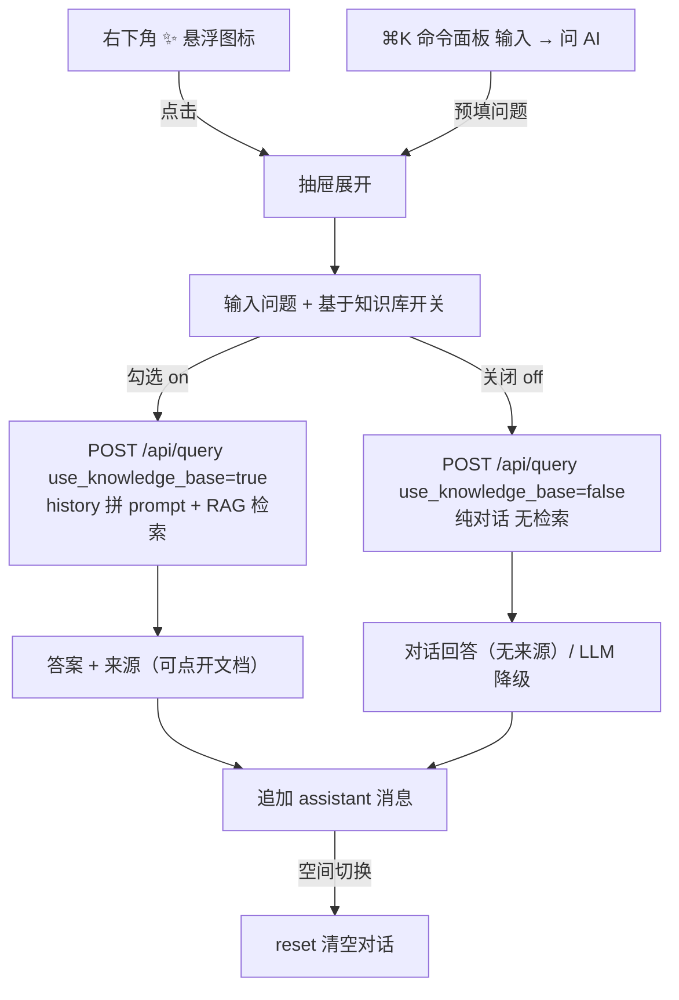

# 详细设计：AI 助手子系统（ai-assistant）

> 子系统内部逻辑详细设计。总体定位见 `docs/04-architecture.md`（MOD-004 问答扩展 / Flow-D-004 沿用）；数据无新表；接口见 `docs/07-api-spec.md`（API-010 请求体扩展，向后兼容）。
> 按「完整骨架 + 阶段增量」：本设计为**维护态 UI 改进批次·批3**（2026-08-07）落地，承接已确认需求 REQ-008 与输入材料 UI 方向，不新增未批准需求。
> 对应需求：REQ-008（AI 问答·RAG）扩展——「基于知识库」范围开关（RAG vs 通用对话）+ 多轮对话。

## 0. 文档元信息

| 项 | 内容 |
|---|---|
| 设计对象 | AI 助手悬浮窗（右下角）+ 「基于知识库」开关 + 多轮对话（路径 A：前端管理 history） |
| 文档路径 | `docs/design/ai-assistant.md` |
| 输入来源 | `docs/inputs/知识库Wiki前端交互设计需求说明.md` §4.5/§6.3（AI 助手悬浮窗 + 范围开关）；`docs/design/frontend-interaction.md` PG-P2-005（独立问答承载历史上下文）/ UXD-P2-ASK / FEI-C-006；`docs/design/rag-retrieval.md`（Flow-D-004）；`07`（API-010）；`03`（REQ-008） |
| 覆盖 REQ / NFR | REQ-008（AI 问答·RAG 扩展）、NFR-004（数据安全，通用对话外发走 RG-008 护栏） |
| 所属阶段 | 维护态（demo 目标达成后 UI 改进批次·批3） |
| 交付物形态 | Demo |
| 当前状态 | **已编码 + 验证通过，待人工浏览器验收**（2026-08-08：后端 310 tests OK / 前端 build 294 modules 绿 / `scripts/smoke-ai-assistant-browser.mjs` PASS；含 LLM 多配置切换：deepseek 通道真实出文） |
| 流程 ID | Flow-D-ASSIST-01（多轮对话 / RAG），见 §3 |
| 最后更新 | 2026-08-08 |
| 下游影响 | `07`（API-010 请求体扩 history + use_knowledge_base）、`09`（验收记录待回写）、`08`（维护态批次进度）、`frontend/src`（useAiAssistant / AiAssistant / App 接线） |

## 1. 职责与边界

| 项 | 内容 |
|---|---|
| 本设计负责 | 右下角 AI 助手悬浮窗（展开 = 对话抽屉）：多轮对话展示与发送、「基于知识库」开关（勾选 = RAG 检索增强问答；关闭 = 通用对话）、答案来源展示与文档跳转、命令面板「问 AI」入口改开抽屉并预填 |
| 本设计不负责 | RAG 检索核心（复用 `docs/design/rag-retrieval.md` Flow-D-004，不改召回逻辑）；术语注入（复用 term-management）；AI 润色 / 写作引用（REQ-014，独立 `docs/design/ai-polish.md`）；现有 `QueryFeature` 问答页（保留为完整视图，不移除） |
| 不新增内容 | 不新增 REQ（通用对话视为 REQ-008 的范围开关扩展，是否新 REQ 编号待确认）；**不新增数据表 / 迁移**（零 migration）；不新增独立接口（扩展现有 API-010 请求体，向后兼容）；不做后端会话持久化（多轮由前端管理） |
| 权限边界 | 通用对话与 RAG 均经 `get_current_user` + 当前空间；RAG 检索沿用 `filter_visible_documents` 越权过滤；通用对话不检索知识库故无来源。前端抽屉可见性不替代后端边界 |
| 依赖前置 | LLM 通道（RG-004 既有）+ 数据外发护栏（RG-008 用户显式触发口径，2026-07-30 已接受） |

## 2. 上游依据与追溯

| 来源 | 章节 / ID | 本设计承接内容 | 下游影响 |
|---|---|---|---|
| `docs/inputs/知识库Wiki前端交互设计需求说明.md` | §4.5（右下角 AI 助手悬浮窗：标题栏 / 对话区 / 输入框 / 发送）、§6.3（AI 助手双入口 + 知识库范围开关） | 悬浮窗形态、「基于知识库」勾选开关（RAG vs 通用） | Flow-D-ASSIST-01 |
| `frontend-interaction.md` | PG-P2-005（独立问答承载历史上下文）、UXD-P2-ASK（高频 AI 助手）、FEI-C-006（须显示范围与来源，避免变通用聊天） | 多轮上下文；范围提示（scope 徽标）；RAG 答案带来源 | 抽屉 UI |
| `03-prd.md` | REQ-008（AI 问答 RAG） | 基于知识库 = 既有 RAG；通用对话 = 范围开关扩展 | API-010 |
| `05-tech-spec.md` | RG-004（LLM 通道）、RG-008（数据外发护栏） | 通用对话走 LLM adapter；单条显式触发外发 | 降级路径 |
| `07-api-spec.md` | API-010 `POST /api/query` | 请求体扩 `history` + `use_knowledge_base`（向后兼容） | API 层 |
| 用户决策（2026-08-07） | 批3 方案三项确认 | ① 通用对话后端扩展 ② 保留问答页 + 抽屉快捷入口 ③ 多轮由前端管理（路径 A） | 实现边界 |

最低追溯链：`REQ-008 → API-010（扩展） → 本设计 → 批3 → smoke-ai-assistant-browser.mjs / 304 tests → 09 验收记录（待回写）`。

## 3. 核心流程 / 状态机

### Flow-D-ASSIST-01：AI 助手多轮对话（路径 A：前端管理 history）

- 触发：右下角悬浮图标 `✨` → 展开抽屉；或命令面板（⌘K）输入问题 →「问 AI」→ 开抽屉预填问题（批2a 原跳问答视图改为开抽屉）
- 参与者：`AiAssistant` 抽屉、`useAiAssistant`（前端）、API-010（后端）、LLM adapter、RAG service
- 输入：用户问题 + 开关状态（基于知识库 on/off）+ 前端累计的对话历史
- 步骤：
  1. 前端 `useAiAssistant` 维护 `messages[]`（user/assistant 轮次）；发送时把「当前问题 + 历史 history[]」POST `/api/query`。
  2. 后端 `answer_question` 分流：
     - `use_knowledge_base=true`（默认，勾选）：走既有 RAG（`docs/design/rag-retrieval.md` Flow-D-004），`history` 以文本拼进 LLM system prompt 作对话上下文；检索仍只基于当前问题；返回答案 + 来源。
     - `use_knowledge_base=false`（关闭）：**通用对话**，不检索知识库、无来源；直接 LLM 纯对话；LLM 未配置 / 失败 / 空返回 → 降级「通用对话不可用」。
  3. 前端把回复追加为 assistant 消息；RAG 模式回复下方展示来源（doc 可点开跳文档；term 来源不可跳）。
  4. 空间切换 → 清空对话（避免跨空间上下文串扰）。
- 输出：多轮消息列表（含答案 / 来源 / 错误占位）
- 成功条件：RAG 命中返回带来源答案；通用对话 LLM 可用返回对话回答
- 失败 / 降级路径：LLM 未配置 → 通用对话「降级模式：未配置 LLM，通用对话不可用。请开启「基于知识库」问答。」；LLM 调用失败 → 「降级模式：LLM 调用失败…」；RAG 沿用既有 NOT_FOUND / 降级（不编造）
- 关联：REQ-008 / API-010 / TC（09 验收待回写）

## 4. 数据、接口与权限契约

| 能力 / 流程 | 数据表 / 字段 | API-ID / 命令 | 权限规则 | 错误码 | 契约状态 |
|---|---|---|---|---|---|
| 基于知识库问答（RAG） | 无新表（复用 `lumen_chunks` / `lumen_documents` / `lumen_terms`） | API-010 `POST /api/query`，`use_knowledge_base=true` | 当前空间 + 越权过滤 | 4010/4030/4220 | **已实现（扩展后）** |
| 通用对话（开关关闭） | 无新表 | API-010，`use_knowledge_base=false` | 当前空间；不检索无来源 | 4010/4030/4220 | **已实现（扩展后）** |
| 多轮历史 | 无后端持久化（前端 messages） | API-010 请求体 `history: [{role, content}]` | 同 RAG | — | **已实现（扩展后）** |
| LLM 通道切换（2026-08-08） | 无新表（`llm_adapter` 多配置读 env） | API-010 请求体 `llm_provider`（命名配置名）+ 新增 `GET /api/llm-configs`（脱敏元信息） | 登录可查 / 切换 = 用户显式选择外发目标（RG-008） | 4010/4030 | **已实现** |

- **API-010 请求体扩展（向后兼容）**：`{ question, history?: [{role: 'user'|'assistant', content: string}], use_knowledge_base?: boolean, llm_provider?: string }`（`history` 默认 `[]`，`use_knowledge_base` 默认 `true`，`llm_provider` 默认后端默认通道；旧客户端不传字段行为不变）。
- **`GET /api/llm-configs`**（新增，`config_router`）：返回 `[{name, provider, model, base_url, enabled}]`，**不含 api_key**（脱敏），供前端抽屉下拉。
- 多配置来源：`.env` 的 `LLM_PROVIDERS=name1,name2`（第一个为默认）+ 每项 `LLM_<NAME>_PROVIDER/BASE_URL/MODEL/API_KEY`；旧 `LLM_PROVIDER` 单配置兼容为 `default`。`llm_adapter` 新增 `deepseek` provider（`api.deepseek.com` / `deepseek-v4-flash`）。
- 不新增 `06` 表 / 字段、不新增 migration。
- 权限由后端执行；前端抽屉可见性仅体验层。

## 5. 失败、异常与降级路径

| 场景 | 触发条件 | 系统行为 | 用户可见 | 记录 | 阻塞验收 | 关联 TC |
|---|---|---|---|---|---|---|
| 通用对话 LLM 未配置 | `use_knowledge_base=false` 且 provider=mock / 无 API key | 不调 LLM，返回降级文案 | 「通用对话不可用，请开启基于知识库问答」 | service 日志 | 否（demo 无 LLM 时降级可演示） | 09 待回写 |
| 通用对话 LLM 调用失败 / 空返回 | 网络 / 5xx / 空输出 | 返回降级文案（不编造） | 「降级模式：LLM 调用失败 / 返回为空」 | service 日志 | 否 | 09 待回写 |
| RAG 无命中 | 当前空间无相关 chunk | 沿用既有 NOT_FOUND | 「未在当前空间知识库找到相关内容」 | — | 否（既有） | TC-P1-008 延续 |
| 越权来源 | RAG 召回含不可见 chunk | `filter_visible_documents` 剔除，不进 prompt / 不返回 | 不泄露 | — | 否（红线） | TC-P1-008 延续 |
| 前端请求失败 | 网络 / 登录失效 | assistant 消息就地显示错误文案 | 错误气泡 | — | 否 | 09 待回写 |

数据外发护栏（RG-008，权威源 `ai/project-rules.md §2.1`）：通用对话为**用户单条显式触发**，符合「由用户自判是否触发」护栏；不携带 API key；`history` 仅当前会话前端内存，不落库。

## 6. 阶段增量、readiness gate 与实现状态

阶段增量：

| 阶段 | 功能范围 | 交付物形态 | 设计状态 | 实现状态 | 备注 |
|---|---|---|---|---|---|
| 维护态·批3 | AI 抽屉 + 基于知识库开关 + 多轮（REQ-008 扩展） | Demo | 已设计（本文） | **已编码 + 验证通过（待人工验收）** | 2026-08-07 |

readiness gate：

| 能力 | 当前状态 | 解锁条件 | 验证证据 | 降级路径 | 阻塞 |
|---|---|---|---|---|---|
| 通用对话外发 | Go（沿用 RG-008 用户显式触发口径） | 2026-07-30 已人工接受 | `tests/backend/test_rag.py` 通用对话降级 / 拼 prompt 用例 | 通用对话不可用 | 否 |
| 多轮 history | 已实现 | — | `test_rag.py` history 拼 prompt + 多轮不干扰检索 | — | 否 |

## 7. 验证与验收追溯

| 设计点 | 关联 REQ | 批次 | TC | 验证方式 | 状态 |
|---|---|---|---|---|---|
| 后端 history + use_knowledge_base | REQ-008 | 批3 | 09 待回写 | `tests/backend/test_rag.py` +6（通用降级 / 拼 prompt / RAG 不受 history 影响），后端全量 304 OK | 通过 |
| 前端抽屉 + 开关 + 多轮 | REQ-008 | 批3 | 09 待回写 | `npm run build` 294 modules 绿；`scripts/smoke-ai-assistant-browser.mjs` PASS（fab→抽屉→RAG 降级+来源→通用降级→多轮→Esc→问 AI 开抽屉预填；API 双模式） | 通过 |
| 命令面板「问 AI」改开抽屉 | REQ-008 | 批3 | 09 待回写 | smoke 第 7 步断言抽屉打开 + 输入框预填 | 通过 |

正式验收证据以 `docs/09-verification.md` 为准（批3 浏览器人工验收 + §5.1 记录待用户确认后回写）。

## 8. 与其他子系统交互

| 方向 | 子系统 / 文档 | 交互内容 | 契约来源 | 风险 |
|---|---|---|---|---|
| 依赖 | `rag-retrieval.md` | 基于知识库 = 复用 RAG 检索 + 来源过滤 | Flow-D-004 | 召回质量影响 RAG 答案 |
| 依赖 | `term-management.md` | RAG 问答术语口径注入（既有） | TCD-005 | — |
| 依赖 | LLM adapter（ADR-002） | 通用对话 + RAG 回答走同一通道 | RG-004 | 不可用 → 降级 |
| 影响 | `frontend-interaction.md` | 问答入口（命令面板 / 抽屉）与 PG-P2-005 候选对齐 | UF-005 | — |
| 影响 | `07-api-spec.md` | API-010 请求体扩展 | — | 需与 09 验收同步 |

## 9. 实现偏差 / 设计回写

| 偏差 ID | 代码 / 配置事实 | 原设计 | 偏差类型 | 处理结论 | 回写目标 | 验证 |
|---|---|---|---|---|---|---|
| D-impl-1 | `history` 以**文本拼进 system prompt**（`_format_history`），未改 `llm_adapter.chat` 签名 / 未用独立多轮 messages | 方案曾考虑扩展 `llm_adapter.chat` 支持 messages 列表 | 实现选择（最小改动） | 保持 `chat_fn(system, user)` 两参兼容，既有测试注入 lambda 不受影响；LLM 效果等价 | 本文 §3/§4 | `test_rag` 拼 prompt 断言通过 |
| D-impl-2 | `useAiAssistant` 用 **ref 镜像最新值**（draft/kb/messages/sending）防闭包陈旧 | 初始 useCallback 依赖捕获 | 实现加固 | 勾选开关后立即发送等连续操作读最新值；smoke 曾复现闭包陈旧（generic 断言抓到旧 RAG 回复） | 本文 §3 | smoke generic 降级断言通过 |
| D-impl-3 | 抽屉 Esc 用 **window 级 keydown**（任意焦点收起），非仅输入框 | 初版仅 textarea onKeyDown Esc | 实现选择（更符合悬浮窗直觉） | 全局 Esc 收起为图标 | 本文 §1/§3 | smoke Esc 收起断言通过 |
| D-impl-4 | `_resolve_chat_fn(llm_provider)` 返回**绑定指定 config 的两参闭包** `lambda s,u: chat(s,u,cfg)` | 初版返回 `llm_adapter.chat`（下游两参调用时 `chat` 内部重 `load_config()` 丢失切换） | 缺陷修复 | 显式指定 deepseek 却仍走默认 glm_a（无效 key）→ 全降级；改为闭包绑定 cfg 后 deepseek 真实出文 | 本文 §4 | demo 后端 `llm_provider=deepseek` 通用对话真实出文 |
| D-impl-5 | `llm_adapter` 多配置读 env（`_read_env_configs`/`list_configs` 脱敏），`load_config(name)` 选配置；`LLM_PROVIDERS` 行内注释经 `_strip_inline_comment` 剥离 | 方案为单 provider | 实现选择（多配置扩展） | 命名配置 + 旧单配置兼容；deepseek 加入 `_PROVIDER_DEFAULTS` | 本文 §4 | `tests/backend/test_llm_adapter.py` +6 |

## 10. 待人工确认项

| ID | 待确认项 | AI 建议 | 建议依据 | 备选方案 | 取舍影响 / 阻塞关系 |
|---|---|---|---|---|---|
| A-C-001 | 批3 是否 bump 版本（及 MINOR / PATCH） | **已确认（2026-08-08）：MINOR v3.3.0**（新增可演示能力「AI 抽屉 + 通用对话 + 多轮 + 多通道切换」） | `project-rules §2.8.2`：合并用户可感知能力变化 → 至少 MINOR | PATCH | 已拍板 |
| A-C-002 | 通用对话是否新 REQ 编号（如 REQ-049）还是 REQ-008 扩展 | **已确认（2026-08-08）：REQ-008 扩展**（同一 AI 问答能力的范围开关，无独立数据 / 接口），07 标注扩展 | 避免编号碎片化 | 新编号 | 已拍板 |
| A-C-003 | 浏览器人工验收 | **已确认（2026-08-08）：用户验收通过**（AI 抽屉 / 开关 / 多轮 / 通道切换 deepseek 真实出文），已回写 09 TC-P2-ASSIST-001 | smoke PASS + 用户浏览器复核 | — | 已回写 09/08 |
