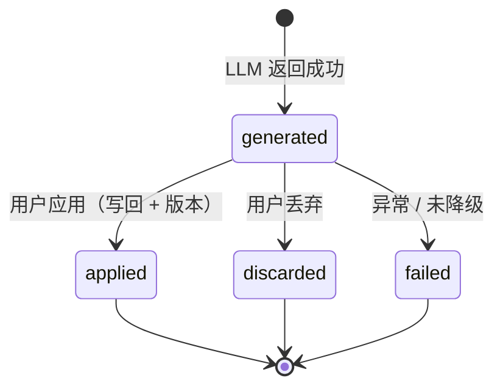

# 详细设计：AI 润色 / 写作引用子系统（ai-polish）

> 子系统内部逻辑详细设计。总体定位见 `docs/04-architecture.md`（MOD-007 / Flow-005）；数据见 `docs/06-db-design.md`（`lumen_ai_drafts`）；接口见 `docs/07-api-spec.md`（API-028）。
> 按「完整骨架 + 阶段增量」：本文为 Phase2B 首批核心 `[P2]` 设计，承接已确认需求 REQ-014，不新增需求。
> 对应需求：REQ-014（AI 润色 + 写作侧边栏引用）。

## 0. 文档元信息

| 项 | 内容 |
|---|---|
| 设计对象 | AI 润色 / 写作引用子系统（MOD-007，Flow-005） |
| 文档路径 | `docs/design/ai-polish.md` |
| 输入来源 | `02`（REQ-014 / U-16 / U-17 / NFR-004）、`03`（Phase2B 首批核心）、`04`（MOD-007 / Flow-005 / §1.1 数据外发边界）、`05`（TCD-010 / RG-004 / **RG-008** / §5.2）、`06`（`lumen_ai_drafts`）、`07`（API-028）、`docs/research/2026-07-30-phase2b-kickoff-decision.md` |
| 覆盖 REQ / NFR | REQ-014、NFR-004（数据安全） |
| 所属 Phase | `[P2]` Phase2B 团队 MVP（首批核心） |
| 交付物形态 | MVP |
| 当前状态 | **Phase2B·已实现（MVP 级）**（Sprint-19 后端 + 前端 vertical slice 均闭环：PR#89–95 / v1.1.0；RG-008 升 Go 2026-07-30；前端 UI smoke 2026-07-31 live 通过）；数据外发风险已人工接受（2026-07-30） |
| 流程 ID | Flow-D-POLISH-01（润色）/ Flow-D-POLISH-02（写作引用），见 §3 |
| 最后更新 | 2026-07-31（回写前端 vertical slice 闭环） |
| 下游影响 | `08` Sprint-19、`09` TC-P2-AI-001、`backend/service/ai_polish`、`lumen_ai_drafts` migration 010 |

## 1. 职责与边界

| 项 | 内容 |
|---|---|
| 本设计负责 | polish / citation 两种模式的请求 → 权限校验 → 上下文构造 → LLM 调用 → 草稿落库 → 预览 / 应用 / 丢弃；数据外发护栏与 5030 降级 |
| 本设计不负责 | 文档 CRUD / 版本（复用 `lumen_documents` / `lumen_document_versions`，REQ-004/005/006）；RAG 问答（REQ-008，独立子系统 `docs/design/rag-retrieval.md`，citation 模式仅复用其检索）；术语注入逻辑（复用 `docs/design/term-management.md`） |
| 不新增内容 | 不新增 REQ、不新增 `06` 外的表 / 字段、不新增 `07` 外的接口；不实现 REQ-015/016/017 |
| 权限边界 | 前端侧边栏入口仅可见性控制；**权限由后端 API-028 鉴权 + service 层「文档可写」+ sources「当前用户可见 chunk」过滤执行**，前端隐藏不替代后端边界 |
| 依赖前置 | RG-004（LLM 通道，已 Go）+ **RG-008（数据外发风险接受，Conditional Go）**；migration 010 已落地（lumen_ai_drafts） |

## 2. 上游依据与追溯

| 来源 | 章节 / ID | 本设计承接内容 | 下游影响 |
|---|---|---|---|
| `02-srs.md` | REQ-014（骨架，触发方式 / 引用块格式待细化）、NFR-004 | 润色触发方式 = 用户显式选中 + instruction；引用块格式 = `sources[]` 含 chunk_id/document_id/title/snippet | TC-P2-AI-001 |
| `03-prd.md` | Phase2B 首批核心、退出标准（数据外发风险已接受） | 首批范围、风险接受口径 | 08 Sprint-19 |
| `04-architecture.md` | MOD-007 / Flow-005、§1.1 数据外发边界 | 子系统定位、外发护栏 | 04 追溯 |
| `05-tech-spec.md` | TCD-010（复用 ADR-002 LLM adapter）、RG-004、**RG-008**、§5.2 数据外发过滤 | LLM 通道、数据外发 gate 与护栏 | 05 RG-008 升 Go |
| `06-db-design.md` | `lumen_ai_drafts`（字段 / 约束 / 索引 / 数据安全） | 草稿持久化与留存 | migration 010 |
| `07-api-spec.md` | API-028（请求 / 响应 / 错误 / 权限 / vertical slice） | 接口契约 | API 层实现 |
| `08-dev-plan.md` | Sprint-19（待补） | 首个 vertical slice | 编码 |
| `09-verification.md` | TC-P2-AI-001 | 验收 | 验证证据 |

最低追溯链：`REQ-014 / NFR-004 → Phase2B → MOD-007 / Flow-005 → lumen_ai_drafts → API-028 / 4001/4003/4004/4220/5030 → 本设计 → Sprint-19 → TC-P2-AI-001`。

## 3. 核心流程 / 状态机

### Flow-D-POLISH-01：AI 润色（mode=polish，同步）

- 触发：用户在文档编辑器选中片段 `selection_md` + 可选 `instruction` → `POST /api/documents/{id}/polish`（mode=polish）
- 参与者：前端写作侧边栏、API-028、`ai_polish` service、LLM adapter（ADR-002）、`lumen_ai_drafts`
- 输入：`document_id`（路径）、`selection_md`、`instruction?`
- 步骤：
  1. 鉴权 + 权限：Bearer Token → 当前空间 → 校验「文档可写」（不可写 → 4003/4004）。
  2. 术语上下文：按当前空间加载 `lumen_terms` 命中片段 / instruction 的术语（复用 term-management，空间术语优先）。
  3. 构造 Prompt：`selection_md` + `instruction` + 术语上下文 +「仅改写给定片段、保持事实、不编造、返回 Markdown」约束。
  4. 调用 LLM（内网中转 GLM-5.2，RG-004）；**真实片段外发，风险已接受（RG-008）**，不携带 API key。
  5. 落库 `lumen_ai_drafts`：`input_excerpt_hash`（片段哈希）、`prompt_summary`（摘要，不存完整 prompt）、`output_md`、`mode=polish`、`status=generated`、`cited_chunk_ids=[]`。
  6. 返回 `{draft_id, output_md, sources:[], status:'generated'}`。
- 输出：润色后片段 + draft_id
- 成功条件：LLM 返回非空 output_md；草稿 status=generated；用户可预览
- 失败 / 降级路径：LLM 不可用 / 超时 → 5030 或 Mock（返回占位提示，**不编造**，status 不落 generated）；片段为空 → 4220
- 关联：REQ-014 / API-028 / TC-P2-AI-001

### Flow-D-POLISH-02：写作引用（mode=citation，复用 RAG 检索，首版同步）

- 触发：`selection_md` + `use_sources=true` + `instruction?` → `POST /api/documents/{id}/polish`（mode=citation）
- 步骤：
  1. 鉴权 + 文档可写校验（同 POLISH-01）。
  2. **RAG 检索**（复用 `docs/design/rag-retrieval.md` Flow-D-004）：据 instruction / selection 关键词 → 向量 + 全文召回 → **权限收敛到当前用户可见 chunk** → topN。
  3. 构造 Prompt：`selection_md` + 召回 chunk 文本 + 术语上下文 + 约束（仅依据给定来源、标注来源、无依据告知）。
  4. 调用 LLM；落库 `lumen_ai_drafts`（`cited_chunk_ids`=JSONB 召回 chunk_id 数组，`mode=citation`，`status=generated`）。
  5. 返回 `{draft_id, output_md, sources[{chunk_id,document_id,title,snippet}], status:'generated'}`。
- 成功条件：sources 全部来自当前用户可见 chunk；引用可追溯 chunk / document
- 失败 / 降级路径：LLM 不可用 → 5030 / Mock；无可见来源 → sources=[] 且 output 提示「未找到可引用来源」（守产品红线，不编造）
- 关联：REQ-014 / API-028 / TC-P2-AI-001
- 异步备注：首版同步返回；若 citation 实测延迟过高（检索 + LLM），再在 `07 §3.6` 补 polish job 状态机（当前 §3.6 仅覆盖 imports），属待确认项 D-C-001。

### 草稿生命周期状态机（`lumen_ai_drafts.status`）

| 状态 | 含义 | 进入条件 | 退出条件 | 用户可见 | 终态 |
|---|---|---|---|---|---|
| generated | LLM 已生成草稿 | polish / citation 返回成功 | 用户应用 / 丢弃 | 草稿预览（未写回正文） | 否 |
| applied | 已写回文档 | 用户确认应用 → 追加 / 替换片段，触发文档版本（REQ-006） | — | 正文已更新 | 是 |
| discarded | 用户丢弃 | 用户放弃草稿 | — | 草稿移除 | 是 |
| failed | 生成失败 | LLM 不可用且未降级 / 异常 | — | 错误提示 | 是 |

## 4. 数据、接口与权限契约

| 能力 / 流程 | 数据表 / 字段 | API-ID / 命令 | 权限规则 | 错误码 | 契约状态 |
|---|---|---|---|---|---|
| 润色（POLISH-01） | `lumen_ai_drafts`（input_excerpt_hash / prompt_summary / output_md / status） | API-028 mode=polish | 文档可写 | 4001/4003/4004/4220/5030 | 已实现（TC-P2-AI-001 通过） |
| 写作引用（POLISH-02） | `lumen_ai_drafts`（cited_chunk_ids）+ `lumen_chunks` + `lumen_documents` | API-028 mode=citation | 文档可写；sources 仅当前用户可见 chunk | 4001/4003/4004/4220/5030 | 已实现（TC-P2-AI-001 通过） |
| 草稿应用 | `lumen_documents` + `lumen_document_versions`（复用） | （走文档更新 API-005/006，非新接口） | 文档可写 | 4003/4004 | 复用既有 |

- 字段 / 接口 / 错误码 / 权限以 `06/07` 为权威，本文只引用与组合。
- 敏感字段边界：`lumen_ai_drafts` 不存 API key、不存完整敏感 prompt（只存 hash + 摘要）；权限由后端执行，前端侧边栏禁用仅为可见性。

## 5. 失败、异常与降级路径

| 场景 | 触发条件 | 系统行为 | 用户可见 | 记录 | 阻塞验收 | 关联 TC |
|---|---|---|---|---|---|---|
| LLM 不可用 | 中转超时 / 5xx | 返回 5030 或 Mock 占位（不编造，不落 generated） | 「AI 暂不可用，可重试」 | service 日志 | 否（降级可接受） | TC-P2-AI-001 |
| 无可引用来源 | citation 召回为空（权限过滤后） | sources=[]，output 提示未找到 | 「未找到可引用来源」 | — | 否 | TC-P2-AI-001 |
| 越权 chunk | sources 含不可见 chunk | 查询层过滤剔除，不进入 prompt / 不返回 | 不泄露 | — | 否（红线） | TC-P2-AI-001 |
| 片段为空 / mode 非法 | selection_md 空、mode ∉ {polish,citation} | 4220 | 字段错误提示 | — | 否 | TC-P2-AI-001 |

数据外发护栏（RG-008，权威源 `ai/project-rules.md §2.5` / `05 RG-008`）：

| 护栏 | 说明 |
|---|---|
| sources 权限过滤 | citation 召回仅当前用户可见 chunk，越权内容不进入 prompt、不返回 |
| 最小化留存 | 草稿只存 `input_excerpt_hash` + `prompt_summary`，不存完整敏感原文 / 完整 prompt |
| 不自动过滤敏感字段 | **用户自判是否触发润色**（风险接受决策，2026-07-30）；系统不做敏感字段自动剔除 |
| 降级 | LLM 不可用 → 5030 / Mock，不编造 |
| 不携带凭据 | prompt / 落库均不含 API key |

## 6. 阶段增量、readiness gate 与实现状态

阶段增量：

| 阶段 | 功能范围 | 交付物形态 | 设计状态 | 实现状态 | 备注 |
|---|---|---|---|---|---|
| Phase2B | REQ-014 polish + citation | MVP | P2B-已设计 | 已实现（Sprint-19；前端闭环与 TC-P2-AI-001 live UI smoke 2026-07-31 通过） | 首批核心 |

readiness gate：

| 能力 | 当前状态 | 解锁条件 | 验证证据 | 降级路径 | 阻塞 Sprint |
|---|---|---|---|---|---|
| AI 润色数据外发（RG-008） | **Go（vertical slice 通过，2026-07-31 前端闭环）** | ~~Sprint-19 实跑升 Go~~ → 已通过：权限过滤（越权 chunk 不进 prompt / 不返回）、5030 不落库不编造、hash 留存均经 `tests.backend.test_ai_polish` 验证；前端 live UI smoke 已通过 | TC-P2-AI-001 通过 | 5030 | ~~阻塞 REQ-014 编码~~ → 已解锁 |

## 7. 验证与验收追溯

| 设计点 | 关联 REQ | Sprint / Task | TC | 验证方式 | 状态 |
|---|---|---|---|---|---|
| polish 生成草稿 | REQ-014 | Sprint-19 | TC-P2-AI-001 | 后端 service tests + 2026-07-31 真 GLM live polish 200 | 通过 |
| citation 引用可追溯 + 权限过滤 | REQ-014 | Sprint-19 | TC-P2-AI-001 | 后端越权过滤 tests + 2026-07-31 真 PG / 真 GLM citation sources 仅可见 chunk | 通过 |
| citation 同步延迟量化（D-C-001） | REQ-014 | Sprint-19 follow-up | TC-P2-AI-001 | `scripts/smoke-ai-citation-latency.py --runs 3 --max-seconds 15`（真 PG + 真 GLM） | 通过（p50=5041.79ms，max=5914.06ms） |
| 5030 / Mock 降级不编造 | REQ-014 | Sprint-19 | TC-P2-AI-001 | LLM 失败 / 未配置断路测试，失败不落库不编造 | 通过 |
| 数据外发护栏（hash / 无 key） | NFR-004 | Sprint-19 | TC-P2-AI-001 | service tests + live DB 检查 `input_excerpt_hash` / `prompt_summary` / `cited_chunk_ids` | 通过 |
| 侧边栏 UI smoke | REQ-014 | Sprint-19 | TC-P2-AI-001 + TC-P2-UI | 2026-07-31 alice 浏览器交互点击流：选区、草稿、sources、应用、版本 +1 | 通过 |

正式验收证据以 `09-verification.md` 为准。2026-08-04 状态同步：本节仅把 `09` 已记录的 TC-P2-AI-001 通过事实同步回设计追溯表，不新增验收目标。

## 8. 与其他子系统交互

| 方向 | 子系统 / 文档 | 交互内容 | 契约来源 | 风险 |
|---|---|---|---|---|
| 依赖 | `rag-retrieval.md` | citation 复用向量 + 全文召回 | Flow-D-004、RG-001/002 | 召回质量影响引用 |
| 依赖 | `term-management.md` | 术语上下文注入 | TCD-005 | — |
| 依赖 | LLM adapter（ADR-002） | LLM 调用 | TCD-002/010、RG-004 | 不可用 → 5030 |
| 影响 | `lumen_documents` / 版本 | applied 写回正文 + 版本 | REQ-004/005/006 | — |

## 9. 实现偏差 / 设计回写

| 偏差 ID | 代码 / 配置事实 | 原设计 | 偏差类型 | 处理结论 | 回写目标 | 验证 |
|---|---|---|---|---|---|---|
| D-impl-1 | `PolishView`/`PolishRequest`/`PolishSource` 定义在 service `ai_polish.py`；entities.py 只放持久化 `AiDraft` | task 表曾把 view/request 列在 entities.py | 实现选择（对齐 `quick_entry.py` 既有 DTO 拆分） | 与既有模式一致，无需改设计 | 本文件 §4；`tasks/task-019` 完成记录 | service 9/9 |
| D-impl-2 | LLM 不可用走「抛 `LlmUnavailableError`→5030、不落库」，未做 Mock 占位 | §5「5030 或 Mock」二选一 | 实现选择（取更严的 5030） | 失败时一行草稿都不存，更安全；§5 已覆盖 | 本文件 §5 | `test_ai_polish` LLM 失败 / 未配置均不落库 |
| D-impl-3 | citation 复用 `rag._find_candidate_chunks`/`_extract_terms`/`MAX_CANDIDATES`（跨模块 import 私有函数） | §3「复用 RAG 检索」 | 实现选择（task 授权复用） | 不动 RAG 问答行为；耦合可接受 | 本文件 §3、§8 | `test_ai_polish` citation 越权不进 prompt |

## 10. 待人工确认项

| ID | 待确认项 | AI 建议 | 建议依据 | 备选方案 | 取舍影响 / 阻塞关系 |
|---|---|---|---|---|---|
| D-C-001 | citation 是否需要异步 job 状态机 | **关闭：首版继续同步，不做异步 job**；仅当后续生产级慢 LLM / 大来源集重新量化超阈值再评估 | `scripts/smoke-ai-citation-latency.py --runs 3 --max-seconds 15` 真 PG + 真 GLM 通过：sources=3，p50=5041.79ms，p95/max=5914.06ms；当前团队 MVP 可接受 | 直接异步（增 `lumen_ai_drafts` job 状态 + `07 §3.6`） | 同步链路简单且已量化通过；异步会扩大 API/DB/前端状态机，不值得为当前 MVP 引入 |
| D-C-002 | polish「应用」是替换选区还是追加 | 替换选区（选中即替换）+ 保留版本可回滚 | 符合常见润色交互；版本历史兜底 | 仅追加 | 影响前端交互与 TC 步骤，Sprint-19 前确认 |
