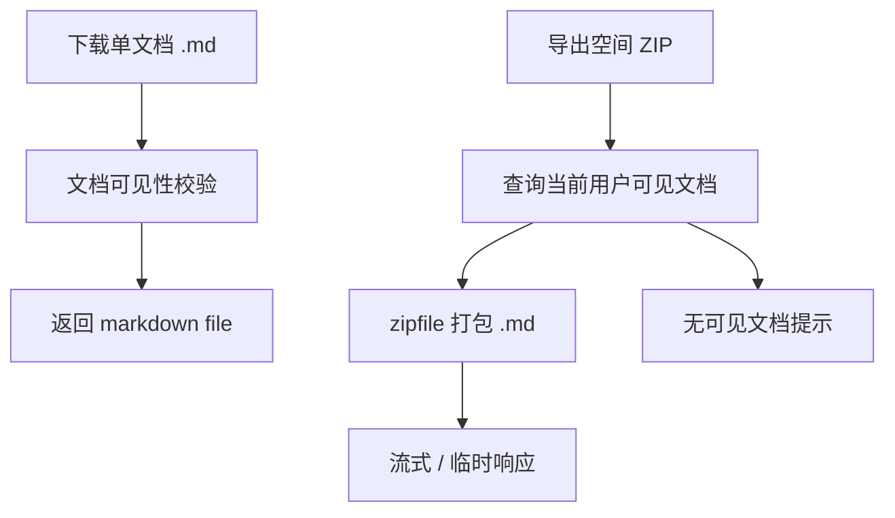

# 详细设计：导出交付子系统（export-delivery）

> 对应 MOD-007 的导出交付部分。本文细化 Phase1.5A 的单文档 `.md` 下载与空间 ZIP 导出备份，以及 Phase1.5B 已落地的单文档 PDF 导出与下载闭环。API-019 已随 Sprint-18 完成，并在 v1.7.0 补齐 artifact 下载端点；后续若要异步队列、过期清理、水印或 Word/PDF 解析，需要另起设计。

## 0. 文档元信息

| 项 | 内容 |
|---|---|
| 设计对象 | 导出交付子系统（MOD-007：`.md` / ZIP / PDF 导出） |
| 文档路径 | `docs/design/export-delivery.md` |
| 输入来源 | `docs/01-user-requirements.md` U-43 / U-33、`docs/02-srs.md` REQ-038 / REQ-027、`docs/03-prd.md` Phase1.5A/B、`docs/04-architecture.md` Flow-007 / Flow-008、`docs/05-tech-spec.md` TCD-008 / TCD-009 / RG-006、`docs/06-db-design.md`、`docs/07-api-spec.md` API-030 / API-019 |
| 覆盖 REQ | REQ-038（Phase1.5A）、REQ-027（Phase1.5B） |
| 所属 Phase | [P1]（Phase1.5A / Phase1.5B 已完成） |
| 交付物形态 | 个人可用 Alpha / 个人增强 Beta |
| 当前状态 | Phase1.5A `.md` / ZIP 导出已完成并通过 TC-P1-016；Phase1.5B PDF 已随 Sprint-18 完成并通过 TC-P1-017，v1.7.0 已补下载端点 + 前端下载闭环 |
| 流程 ID | Flow-007（`.md` / ZIP 导出备份）/ Flow-008（PDF 导出） |
| 最后更新 | 2026-08-04（v1.7.0：API-019 `GET /api/export-pdf/{export_id}/download` + 前端下载闭环已实现，TC-P1-017 补充通过） |
| 下游影响 | 08 Sprint-17 / Sprint-18、09 TC-P1-016 / TC-P1-017、07 API-030 / API-019 |

## 1. 职责与边界

| 项 | 内容 |
|---|---|
| 本设计负责 | 单文档 `.md` 下载、空间 ZIP 导出备份、PDF 导出的阶段边界、权限过滤、失败态和验证追溯 |
| 本设计不负责 | 真实 Word/PDF 文本提取、OCR、外部分享链接、团队协作、移动端导出、长期公开文件托管 |
| 不新增内容 | Phase1.5A 不新增 DB 表、不引 PDF 库、不做真实目录树、不做长期公开链接 |
| 权限边界 | 前端入口只做可见性；后端 API 必须按 token 当前空间、文档权限和空间成员关系过滤 |
| 依赖前置 | Phase1.5A 仅用既有栈 + Python 标准库 `zipfile`；Phase1.5B PDF 首版依赖 ReportLab，RG-006 已 Go，产物校验使用 `pypdf` / `pdfplumber` / `Pillow` |

## 2. 上游依据与追溯

| 来源 | 章节 / ID | 本设计承接内容 | 下游影响 |
|---|---|---|---|
| `docs/01-user-requirements.md` | U-43 / AC-P1-011 | 个人可迁出、可备份；ZIP 不泄露无权限文档 | TC-P1-016 |
| `docs/02-srs.md` | REQ-038 / REQ-027 | `.md` / ZIP 导出与 PDF 导出 | API-030 / API-019 |
| `docs/03-prd.md` | Phase1.5A / Phase1.5B | ZIP 优先于 PDF；PDF 不阻塞 Alpha | 08 Sprint-17 / 18 |
| `docs/04-architecture.md` | MOD-007、Flow-007 / Flow-008 | 导出交付模块与流程 | 本文流程设计 |
| `docs/05-tech-spec.md` | TCD-008 / TCD-009 / RG-006 | ZIP 用 `zipfile`，PDF 首版采用 ReportLab；RG-006 已 Go | 依赖门禁 |
| `docs/06-db-design.md` | REQ-038 无新增表结论、`lumen_doc_exports` | `.md` / ZIP 不写导出表；PDF 可用导出任务表 | DB 边界 |
| `docs/07-api-spec.md` | API-030 / API-019 | 请求 / 响应 / 错误 / 权限契约 | API 实现与测试 |
| `docs/09-verification.md` | TC-P1-016 / TC-P1-017 | 导出验收路径 | TC-P1-016 已通过后端 tests + 端到端 HTTP smoke；TC-P1-017 已通过后端 tests + 前端 build + 产品 PDF 样例 |

## 3. 核心流程

### 3.1 Flow-007：`.md` / ZIP 导出备份（Phase1.5A）

1. 用户在文档详情点击“下载 `.md`”，前端调用 `GET /api/documents/{id}/export?format=md`。
2. 后端按 token 当前空间与文档权限读取文档当前版本或指定版本；不可见返回 4004。
3. 后端以 `text/markdown` 或下载附件响应，文件名由文档标题安全化，不包含本机路径。
4. 用户在空间工具栏点击“导出空间 ZIP”，前端调用 `GET /api/export/space?format=zip`。
5. 后端查询当前空间内当前用户可见文档，逐篇生成 `.md` 文件并用标准库 `zipfile` 打包。
6. ZIP 默认流式响应或使用临时文件；不写 `lumen_doc_exports`，不生成长期公开链接。
7. 若空间无可见文档，返回空 ZIP 或业务提示；不得提示不可见文档数量。

### 3.2 Flow-008：PDF 导出（Phase1.5B）

1. 用户对可读文档指定版本发起 `POST /api/export-pdf`。
2. 后端先按 token 当前空间与文档可见性读取源文档；不可见 / 不存在返回 4004，且不创建导出记录。
3. 后端读取指定版本或当前版本，创建 `lumen_doc_exports` 任务并绑定 `document_id`、`version_no` 与 `requested_by`，状态进入 `running`。
4. ReportLab 将 Markdown 子集渲染为 PDF artifact；成功后任务标记 `done` 并写入 `artifact_path`。
5. 前端使用 `export_id` 请求 `GET /api/export-pdf/{export_id}/download`，后端复验当前空间、源文档可见性、任务状态与 artifact 目录边界后返回 `application/pdf`。
6. PDF 渲染库不可用、字体缺失或导出失败时返回 5030 / failed，不生成坏文件；下载任务未完成 / failed / 无 artifact 返回 4090。
7. 导出产物首版写入 `tmp/pdf_exports`，继承源文档权限，不生成公开长期链接；过期清理 job 留后续。

## 4. 数据、接口与权限契约

| 能力 | API | DB / 数据来源 | 权限规则 | 产物策略 | 关联 TC |
|---|---|---|---|---|---|
| 单文档 `.md` 下载 | API-030 `GET /api/documents/{id}/export` | `lumen_documents`、`lumen_document_versions` | 文档可读；不可见返回 4004 | 直接 file/blob 响应；不写导出表 | TC-P1-016 |
| 空间 ZIP 导出 | API-030 `GET /api/export/space` | 当前用户可见 `lumen_documents` | ZIP 只含当前用户可见文档；不泄露不可见数量 | `zipfile` 打包；流式 / 临时响应；不长期公开 | TC-P1-016 |
| 单文档 PDF | API-019 `POST /api/export-pdf` + `GET /api/export-pdf/{export_id}/download` | `lumen_doc_exports`、`lumen_documents`、`lumen_document_versions` | 文档可读 / 可导出；下载时复验权限；产物继承权限 | 同步导出任务 + artifact 写入 `tmp/pdf_exports`；浏览器下载；过期清理 job 留后续 | TC-P1-017 |

## 5. 失败、异常与降级路径

| 场景 | API 行为 | 用户可见口径 | 处理原则 |
|---|---|---|---|
| 文档不存在或不可见 | 4004 | 文档不存在或无权限 | 不区分不存在 / 越权，避免泄露 |
| 空间无可见文档 | 200 + 空结果提示或空 ZIP | 当前空间暂无可导出文档 | 不提示隐藏文档数量 |
| ZIP 打包失败 | 5000 | 导出失败，请稍后重试 | 记录错误；不返回半截 ZIP |
| PDF 依赖不可用 | 5030 | PDF 导出依赖不可用 | 已实现依赖 / 字体检测；失败标记 `failed` 并返回 5030 |
| PDF 中文字体缺失 | 5030 / failed | PDF 导出失败 | 不生成乱码 PDF |
| PDF 下载未就绪 | 4090 | PDF 导出任务尚未完成 | 不返回半成品；前端显示失败消息 |
| PDF artifact 不存在 / 越界 | 4004 | PDF 文件不存在 | 不泄露越权或服务器路径，可重新发起导出 |

## 6. 阶段增量、readiness gate 与实现状态

| 阶段 | 能力 | 状态 | Gate / 禁止项 |
|---|---|---|---|
| Phase1.5A | 单文档 `.md` 下载、空间 ZIP 导出 | 已实现（TC-P1-016 通过） | 不引 PDF 库；不写长期导出表；不建公开链接 |
| Phase1.5B | 单文档 PDF 导出 / 下载 | 已实现（Sprint-18，TC-P1-017 通过；v1.7.0 下载闭环补齐） | 首版同步生成；不含异步队列 / 过期清理 job / 水印 / Word-PDF 解析 / zhparser |
| Phase2B / 后续 | 对外分享链接、团队交付包 | 骨架 | 需重新确认权限、有效期、审计与外部访问边界 |

## 7. 验证与验收追溯

| 设计点 | 关联 REQ | 关联 Sprint | 关联 TC | 验证方式 | 状态 |
|---|---|---|---|---|---|
| 单文档 `.md` 下载 | REQ-038 | Sprint-17 | TC-P1-016 | 后端 tests + 端到端 HTTP smoke 已通过 | Phase1.5A-已实现 |
| 空间 ZIP 导出 | REQ-038 | Sprint-17 | TC-P1-016 | 权限过滤后端 tests + 端到端 HTTP smoke 已通过 | Phase1.5A-已实现 |
| 单文档 PDF 导出 / 下载 | REQ-027 | Sprint-18 | TC-P1-017 | API-019 后端 tests + 前端 build + 产品 PDF 样例渲染 / 抽文本 / 非白像素检查已通过；v1.7.0 下载闭环 `test_export` 27/27 OK + backend discover 203 OK(skipped=2) + frontend build + 运行态 demo API smoke 通过 | Phase1.5B-已实现 |

## 8. 与其他子系统交互

- **依赖** `docs/design/permissions.md`：所有导出入口必须复用空间 / 文档权限过滤。
- **依赖** `docs/design/frontend-interaction.md`：提供文档详情下载按钮与空间工具栏导出入口。
- **依赖** `docs/07-api-spec.md`：API-030 / API-019 契约。
- **影响** `docs/06-db-design.md`：REQ-038 默认不新增表；REQ-027 使用 `lumen_doc_exports`。

## 9. 实现偏差 / 设计回写

| 偏差 ID | 代码 / 配置事实 | 原设计 | 偏差类型 | 处理结论 | 回写目标 | 验证 / 证据 |
|---|---|---|---|---|---|---|
| DEV-EXP-001 | `.md` / ZIP 导出已实现 | Phase1.5A 目标 | 已完成 | Sprint-17 已按标准库 zipfile 与权限过滤完成 | API-030、TC-P1-016 | TC-P1-016 通过 |
| DEV-EXP-002 | ReportLab / pypdf / pdfplumber / Pillow 已安装并锁入依赖；中文 PDF 样例通过 | Phase1.5B 技术前置 | RG 已关闭 | 已进入 Sprint-18 并完成 API-019 产品实现 | API-019、TC-P1-017 | `scripts/smoke-pdf-rg006.py` + RG-006 tech-env 报告 |
| DEV-EXP-003 | `POST /api/export-pdf`、`lumen_doc_exports`、前端"导出 PDF"入口已实现；artifact 写入 `tmp/pdf_exports` | Phase1.5B 目标 | 已完成 | 首版同步生成并返回任务结果；异步队列 / 过期清理 job 留后续 | API-019、TC-P1-017 | `tests.backend.test_export` 20/20 OK + backend discover 196 OK + frontend build + 产品 PDF 样例 |
| DEV-EXP-004 | `GET /api/export-pdf/{export_id}/download` 与前端生成后下载闭环已实现 | Sprint-18 下载残留 | 已完成 | 下载端点复验权限、任务状态与 artifact 目录边界；不生成公开长期链接 | API-019、TC-P1-017 | `tests.backend.test_export` 27/27 OK + backend discover 203 OK(skipped=2) + frontend build 259 modules + runtime smoke prefix `%PDF` |

## 10. 待人工确认项

| ID | 待确认项 | AI 建议 | 建议依据 | 备选方案 | 取舍影响 / 阻塞关系 |
|---|---|---|---|---|---|
| EXP-C-001 | ZIP 是否长期落盘 | 建议不长期落盘，优先流式 / 临时响应 | P1.5A 目标是低依赖备份，不做分享链接 | 写 `lumen_doc_exports` | 增加清理和权限复杂度 |
| EXP-C-002 | ZIP 文件内路径规则 | 建议使用安全化标题；若有相对路径前缀则保留目录感 | 与 API-029 标题前缀策略一致 | 全部平铺 | 平铺可能丢目录感；保留路径需防路径穿越 |
| EXP-C-003 | PDF 是否提前到 Alpha | 已裁定为 Phase1.5B 并完成 Sprint-18；不回填 Alpha 范围 | PDF 依赖 / 字体 / 中文排版风险已通过 RG-006 与 TC-P1-017 验证 | 与 Sprint-17 同做 | 已避免阻塞个人可用 Alpha；后续只补增强项 |
