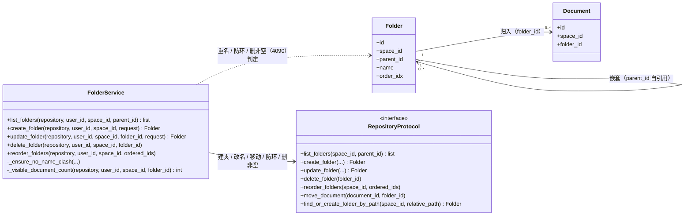
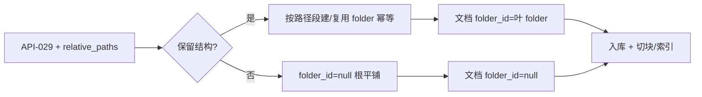

# 详细设计：文档目录树子系统（folder-tree）

> 对应 **REQ-039（文档目录树，新增候选）** + 扩展 **REQ-037（导入保留目录结构）**。
> 架构（用户 2026-08-02 定）：**空间 → 文件夹树（嵌套）→ 文档**，不引入独立仓库层；导入的 Obsidian vault = 空间内根文件夹。
> 按「完整骨架 + 阶段增量」：Phase2B 第三 slice（候选）写细。

## 0. 文档元信息

| 项 | 内容 |
|---|---|
| 设计对象 | 文档目录树子系统（MOD-006 候选，待 04 确认） |
| 文档路径 | docs/design/folder-tree.md |
| 输入来源 | 02/03（REQ-039 新增 + REQ-037 扩展）、04（MOD/Flow 待补）、05、06（lumen_folders 新增 + lumen_documents.folder_id）、07（文件夹 API 候选 + API-029 改造）、`docs/design/ingestion.md` Flow-006 改造 |
| 覆盖 REQ | REQ-039（新增候选）、REQ-037（扩展）、REQ-004（文档归属） |
| 所属 Phase | `[P2]` Phase2B 第三 slice（候选，FT-C-007） |
| 交付物形态 | Demo / 个人可用 |
| 当前状态 | **Phase2B·第三 slice·基础能力已实现并补齐浏览器自动化 smoke**：FT-C-001..013 已确认；后端核心（API-034..037 + migration 011）已实现并合入 main（task-027 / PR #103）；导入保留结构（API-029 `preserve_structure`）已实现（task-028）；前端文件管理器基础树 / 受控右键菜单 / inline 新建重命名 / 单文档移动（API-038）已实现并通过 build、运行态 API smoke、用户浏览器 smoke（2026-08-03）与浏览器自动化 smoke（2026-08-04） |
| 流程 ID | Flow-D-010..013（建文件夹 / 移动 / 导入保留结构 / 排序） |
| 最后更新 | 2026-08-17（新增 §0.5 详细类图 DIAG-CLS-FOLDER-01，OO 覆盖度补全 Batch A2）；前次 2026-08-03 |
| 下游影响 | 08 Sprint（候选）、09 TC（候选 TC-P2-FOLDER-001）、06 lumen_folders + folder_id、07 文件夹 API + API-029 改造、ingestion Flow-006、frontend 文件管理器 |
| 视觉参考 | `docs/research/prototypes/2026-07-31-obsidian-inspired-classic-tree.html` / `doc-tree-open.html` |

### 0.5 详细类图（DIAG-CLS-FOLDER-01）

> 图纸驱动编码：文档目录树子系统的类级视图（实体 + `RepositoryProtocol` 契约 + 服务层函数）。类图挂 REQ-039 / REQ-037（`preserve_structure`）/ REQ-004；方法签名以 `backend/service/folder.py` 与 `backend/repository/protocol.py` 为准。目录树与 `ingestion` 子系统的协作（导入建夹）见 `docs/design/ingestion.md` Flow-006。

## 1. 职责与边界

| 项 | 内容 |
|---|---|
| 本设计负责 | `lumen_folders` 嵌套树 + 文档归属（`folder_id`）+ 文件夹 CRUD / 移动 / 排序 + 导入保留目录结构（API-029 改造）+ 前端文件管理器 |
| 本设计不负责 | 文件夹独立权限（FT-C-003：继承空间，文档可见性仍看 `lumen_documents.permission`）；仓库级独立图谱 / 分享（愿景出口）；真实 Word/PDF 解析（属 ingestion Phase1.5B） |
| 不新增内容 | 不引入独立仓库层（架构已定）；不新增权限维度；不新增 Phase 外能力 |
| 权限边界 | 前端树显隐只作可见性；文件夹 / 文档可见性由后端 service 按 `space_id` + `lumen_documents.permission` 过滤；folder 不独立设权限 |
| 依赖前置 | DB migration（`lumen_folders` + `lumen_documents.folder_id`）；现有文档向后兼容（`folder_id=null`，FT-C-006） |

## 2. 上游依据与追溯

| 来源 | 章节 / ID | 本设计承接 | 下游影响 |
|---|---|---|---|
| `docs/02-srs.md` | REQ-039（新候选）、REQ-037（扩展）、REQ-004 | 目录树组织 + 导入保留结构 + 文档归属 | 02 加 REQ-039 |
| `docs/03-prd.md` | Phase2B 范围、SC-008 | 第三 slice 候选 | 03 §3 Phase2B 加 REQ-039 |
| `docs/04-architecture.md` | MOD-006（候选）、Flow-D-010..013 | 子系统模块 + 流程 | 04 加 MOD-006 / Flow |
| `docs/05-tech-spec.md` | 资源 / 无新依赖 | 复用 PG + 现有栈，无新依赖 | 05 无新 Risk |
| `docs/06-db-design.md` | `lumen_folders`（新）、`lumen_documents.folder_id`（新） | 表 / 字段契约 | 06 加表 + 字段 + migration |
| `docs/07-api-spec.md` | 文件夹 API（API-034+ 候选）、API-029（改造） | 接口契约 | 07 加 API + 改 API-029 |
| `docs/design/ingestion.md` | Flow-006（改造：标题前缀 → 真 folder） | 导入保留结构 | ingestion §9 回写（推翻 ING-C-001「不建 folder 表」） |
| `docs/08-dev-plan.md` | Sprint（候选） | slice 拆分（见 §11） | 08 加 Sprint |
| `docs/09-verification.md` | TC-P2-FOLDER-001（候选）、TC-P1-015（扩展） | 验收 | 09 加 TC |

最低追溯链：`REQ-039/037 → Phase2B → MOD-006/Flow-D-010..013 → lumen_folders/folder_id → 文件夹 API/API-029 → Design Point → Sprint → TC`

## 3. 核心流程

### Flow-D-010：新建文件夹
- 触发：文件管理器「新建文件夹」
- 输入：`space_id`, `parent_id`（可空=根）, `name`
- 步骤：校验 space 成员 + parent 存在且同 space → 写 `lumen_folders`（order=末尾）
- 输出：`folder_id`
- 错误：4003 非成员、4220 name 空 / 4090 同 parent 下重名
- 关联：REQ-039 / 文件夹 API / TC

### Flow-D-011：移动文档 / 子夹
- 触发：拖拽 / 移动
- 输入：文档移动为 `document_id` + `target_folder_id`（可空=根）；文件夹移动为 `folder_id` + `target_parent_id`（可空=根）
- 步骤：校验源 + 目标同 space + **防环**（target 不能是源的后代）→ 更新 `folder_id` / `parent_id`
- 错误：4003、4004、4220 防环 / 跨空间
- 关联：REQ-039 / 移动 API / TC

### Flow-D-012：导入保留目录结构（改造 ingestion Flow-006）
- 触发：API-029 批量导入带 `relative_paths[]`
- 输入：`files[]` + `relative_paths[]` + `preserve_structure`（默认 true，FT-C-008）
- 步骤：解析 `relative_path` → 按路径段建 / 复用 `lumen_folders`（**幂等**：同 space+parent+name 复用）→ 文档 `folder_id` 指向叶 folder；`preserve_structure=false` 则 `folder_id=null`（根平铺，后置）
- 输出：`success/failed/skipped` + `items[]`（沿用 API-029）
- 关联：REQ-037 / API-029 / TC-P1-015 扩展

### Flow-D-013：排序
- 触发：拖拽排序
- 输入：`folder_id`/`document_id` + `new_order`
- 步骤：更新 `lumen_folders.order` / 文档 order（FT-C-004 / FT-C-009 待定）
- 关联：REQ-039 / 排序 API / TC

## 4. 数据、接口与权限契约

| 能力 / 流程 | 数据表 / 字段 | API-ID（候选） | 权限规则 | 错误码 | 契约状态 |
|---|---|---|---|---|---|
| 文件夹树查询 | `lumen_folders` | API-034 `GET /api/folders` | space 成员，按 space 过滤 | 4003 | 已实现（task-027） |
| 新建文件夹 | `lumen_folders` | API-035 `POST /api/folders` | space 成员 | 4003/4090（重名） | 已实现（task-027） |
| 移动 / 改名 | `lumen_folders` / `lumen_documents` | API-036 | space 成员 + 防环 | 4003/4004/4090（改名重名）/4220（防环 / 跨空间） | 已实现（task-027） |
| 排序 | `lumen_folders.order` | API-037 | space 成员 | 4003 | 已实现（task-027） |
| 导入保留结构 | `lumen_folders` + `lumen_documents.folder_id` | API-029 改造 | space 成员 | 同 API-029 | 已实现（task-028） |
| 文档归属 | `lumen_documents.folder_id` | API-038 `PATCH /api/documents/{document_id}/folder` | 文档可见且可写；目标 folder 同空间；`folder_id=null`=根目录 | 4003/4004/4220 | 已实现（task-029） |

数据契约（待回填 `06`，权威以 06 为准）：
- **`lumen_folders`（新）**：`id` PK / `space_id` FK→spaces / `parent_id` FK→self（可空=根）/ `name` varchar / `order` int / `created_by` FK→users / `created_at` / `updated_at`；约束 `UNIQUE(space_id, parent_id, name)`；索引 `(space_id, parent_id)`。
- **`lumen_documents.folder_id`（新字段）**：FK→lumen_folders，可空（根）；索引 `(folder_id)`。
- **migration**：建 `lumen_folders` + `lumen_documents` 加 `folder_id`（null）；现有文档 `folder_id=null`（空间根，向后兼容）。
- FT-C-009（已确认 2026-08-02）：文档**首版不加 `order`**，folder 内按 `title` 默认排序（`ORDER BY title`）；手动 order 后置。
- FT-C-010（已确认 2026-08-02）：folder **只 `active`，无 `archived`**；删 folder **必须先移空**（移出 / 删子内容），后端拒绝删非空 folder（防连带删文档）。

权限：folder 不独立设权限（FT-C-003）；文档可见性仍看 `lumen_documents.permission` + `space_id`（folder 查询过滤 space，folder 内文档仍按 permission 过滤，不泄露越权文档）。
- **树查询口径（API-034，钉死 2026-08-02）**：懒加载为主——`GET /folders?parent_id=` 返回该 parent 的直接子层（folder + 可见文档数）；`parent_id` 空=根层。整树 / 后代查询用 **PG `WITH RECURSIVE`（递归 CTE）** / **demo 内存递归**，**避免 N+1**。Demo 量级（<500 folder）递归 CTE 性能足够。

## 5. 失败、异常与降级

| 场景 | 触发 | 行为 | 用户可见 | 阻塞验收 |
|---|---|---|---|---|
| 跨空间移动 | target 不同 space | 拒绝 4220 | 提示 | 否 |
| 环 | target 是源后代 | 拒绝 4220 | 提示 | 否 |
| 重名 folder | 同 parent+name | 拒绝 4090（手动）/ 幂等复用（导入） | 提示 | 否 |
| 空文件夹 | folder 无文档/子夹 | 允许（folder 是实体，可空） | 显示空 | 否 |
| 深度过大 | UI 性能 | 懒加载 / 折叠兜底（FT-C-002） | 折叠 | 否 |

## 6. 阶段增量、readiness gate

| 阶段 | 功能范围 | 交付物 | 设计状态 | 实现状态 |
|---|---|---|---|---|
| Phase2B 第三 slice | `lumen_folders` + 文件夹 CRUD/移动/排序 + 导入保留结构 + 前端文件管理器 | Demo / 个人可用 | 已设计 | 后端核心 + 导入保留结构 + 前端文件管理器基础能力（含单文档移动）已实现；运行态 API smoke + 用户浏览器 smoke + 浏览器自动化 smoke 已通过 |

readiness gate：DB migration（`lumen_folders` + `folder_id`）+ 向后兼容（现有文档 `folder_id=null`）。无新依赖（PG + 现有栈），无 RG 阻塞。

邻接表性能出口（FT-C-005）：单空间 folder >2000 或树深度 >10 且查后代 >200ms 时，评估升级物化路径（`path` 字段 + `LIKE` 查询）；Demo 量级不触发，递归 CTE 足够（见 §4 树查询口径）。

## 7. 验证与验收追溯

| 设计点 | REQ | Sprint（候选） | TC（候选） | 验证 | 状态 |
|---|---|---|---|---|---|
| 文件夹树查询 / CRUD | REQ-039 | Sprint-22 | TC-P2-FOLDER-001 | `tests.backend.test_folder` + 临时 PG smoke；用户浏览器 smoke 2026-08-03 通过 | 后端/API + 前端基础能力已实现 |
| 移动 / 防环 | REQ-039 | Sprint-22 | TC-P2-FOLDER-001 | `tests.backend.test_folder` + 临时 PG smoke；单文档移动 `tests.backend.test_document` | 文件夹后端/API + 单文档移动 API 已实现 |
| 导入保留结构 | REQ-037 | Sprint-22 | TC-P1-015 扩展 | `tests.backend.test_imports` / `test_import_api` + 临时 PG import smoke | 后端/API 已实现 |
| 排序 | REQ-039 | Sprint-22 | TC-P2-FOLDER-001 | `tests.backend.test_folder`；用户浏览器 smoke 2026-08-03 通过 | 后端/API + 前端基础能力已实现 |

## 8. 与其他子系统交互

| 方向 | 子系统 | 交互 | 契约 | 风险 |
|---|---|---|---|---|
| 依赖 | `permissions` | 文档可见性过滤 | `lumen_documents.permission` | 低 |
| 改造 | `ingestion`（Flow-006） | 导入建 folder 结构 | API-029 | 中（向后兼容） |
| 影响 | `frontend-interaction` | 文件管理器 UI | classic-tree / doc-tree-open 原型 | 中 |
| 影响 | `doc_links` / `rag` | 文档归属 folder 不影响检索 | 复用 `lumen_documents` | 低 |

## 9. 实现偏差 / 设计回写

（设计阶段，暂无实现偏差。实现后回写。ingestion `ING-C-001`「不建 folder 表」被本设计推翻，待回写 ingestion §9 + 06。）

## 10. 待人工确认项

> FT-C-001..008 用户 2026-08-02 已初步确认（见各节）；FT-C-009..011 为草案细化新增。

| ID | 待确认项 | AI 建议 | 建议依据 | 备选方案 | 取舍影响 / 阻塞关系 |
|---|---|---|---|---|---|
| FT-C-001 | REQ 归属 | 新 REQ-039 + 扩展 REQ-037 | 追溯链要求 | 仅扩展 REQ-004 | 影响 02/03 回填 |
| FT-C-002 | 目录深度 | 不限，UI 懒加载兜底 | Obsidian 不限 | 限层 | 过度限制反不便 |
| FT-C-003 | 文件夹权限 | 不独立设，继承空间 | 当前权限模型文档级 | 独立权限 | 新维度，非首批必需 |
| FT-C-004 | 排序持久化 | folder + 文档各 `order` 字段 | Obsidian 支持手动排序 | 仅默认排序 | 影响 06（加 order） |
| FT-C-005 | 路径策略 | `parent_id` 邻接表 | 量级够用，简单 | 物化路径 | 性能问题再升级 |
| FT-C-006 | 现有文档迁移 | `folder_id=null`（空间根） | 向后兼容 | 强制归类 | 兼容性 |
| FT-C-007 | Phase 归属 | Phase2B 第三 slice | Phase2B 进行中 + 解决导入痛点 | 新 Phase / Phase2C | 影响 03/08 |
| FT-C-008 | 导入改造 | API-029 加 `folder_id` + 自动建结构，保留「标题前缀」向后兼容 | 复用 API-029 | 新端点 | 影响 07/ingestion |
| FT-C-009 ✅已确认（2026-08-02） | 文档排序字段 | **首版不加 `order`**，folder 内按 `title` 默认排序；手动 order 后置 | Obsidian 默认按名称；LUMEN 检索为主；省字段 + 向后兼容 | 加 `order` 字段 | 未来平滑升级；不阻塞 |
| FT-C-010 ✅已确认（2026-08-02） | folder 生命周期 | **只 `active` 无 `archived`**；删 folder **必须先移空**（防连带删文档） | 文件系统 / Obsidian 删 folder 须空 / 确认；folder 归档语义弱；防误删 | `archived` 状态 | 未来加；不阻塞 |
| FT-C-011 ✅已确认（2026-08-02；2026-08-03 扩展） | API-ID 编号 | **API-034..038** + API-029 改造（`preserve_structure`）；API-038 用于单文档移动 | 07 原最大 API-033，顺序递增；单文档移动不适合塞入 folder PATCH | — | 已采；不阻塞 |
| FT-C-012 ✅已记录（2026-08-02） | REQ-039 编号占用 | **REQ-039 已正式分配给 folder-tree**（02-srs 收录）；`docs/inputs/2026-07-21-doc-format-conversion-requirements.md` / `docs/research/2026-07-21-format-conversion-input-review.md` 原"建议 REQ-039"（office/wps→MD 格式转换）需重新编号 | 输入材料自声明"建议编号，不污染正式编号"（FCR-C-005）；02-srs 权威最新 REQ-038，REQ-039 可用 | office→MD 若立项用 REQ-041+（REQ-040 亦被输入建议给独立工具） | 不阻塞 folder-tree；office→MD 立项时重新编号 |
| FT-C-013（2026-08-02 记录） | folder 软删除 / 回收站 | **MVP 不做**（维持 `active` 硬删 + 删非空→4090，FT-C-010）；未来加 `archived`/`deleted_at` + 回收站防误删 | 现代 UX（Google Drive / OneDrive）倾向回收站；MVP 克制先硬删 | 现在加 soft delete（扩字段 + service 改造，扩范围） | 不阻塞 MVP；未来增强项 |

## 11. slice 拆分建议（→ `docs/08-dev-plan.md`）

1. **后端契约**：migration `lumen_folders` + `folder_id`（+ 文档 `order` 若 FT-C-004/009 确认）+ 文件夹 service / API（API-034..037）+ 单文档移动 API-038 + tests；
2. **导入改造**：API-029 `preserve_structure` + 建 folder 结构（Flow-D-012）+ tests + TC-P1-015 扩展；
3. **前端文件管理器**：树渲染 + CRUD + 移动 + 排序（参考 classic-tree / doc-tree-open 原型）+ 浏览器 smoke；基础树 / 受控菜单 / inline 文件夹编辑 / 单文档移动已由 task-029 本地实现，并通过用户浏览器 smoke（2026-08-03）；
4. **回写**：06（表/字段/migration）+ 07（API）+ 02/03（REQ-039）+ 08（Sprint）+ 09（TC）+ ingestion §9（推翻 ING-C-001）。

---

> 本设计已推进到 **Phase2B·第三 slice·基础能力已实现**：后端核心（task-027 / PR #103）、API-029 导入保留结构（task-028）和前端文件管理器基础能力（task-029，含 API-038 单文档移动）已完成本地实现、自动化验证、运行态 API smoke、用户浏览器 smoke与浏览器自动化 smoke。folder 不独立设权限、文档可见性按 `permission` 的边界不变。
