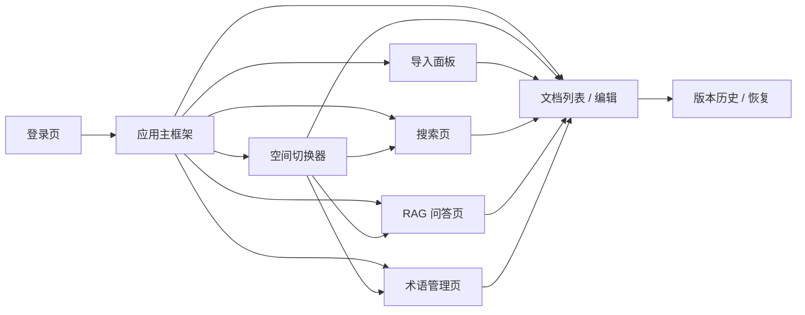
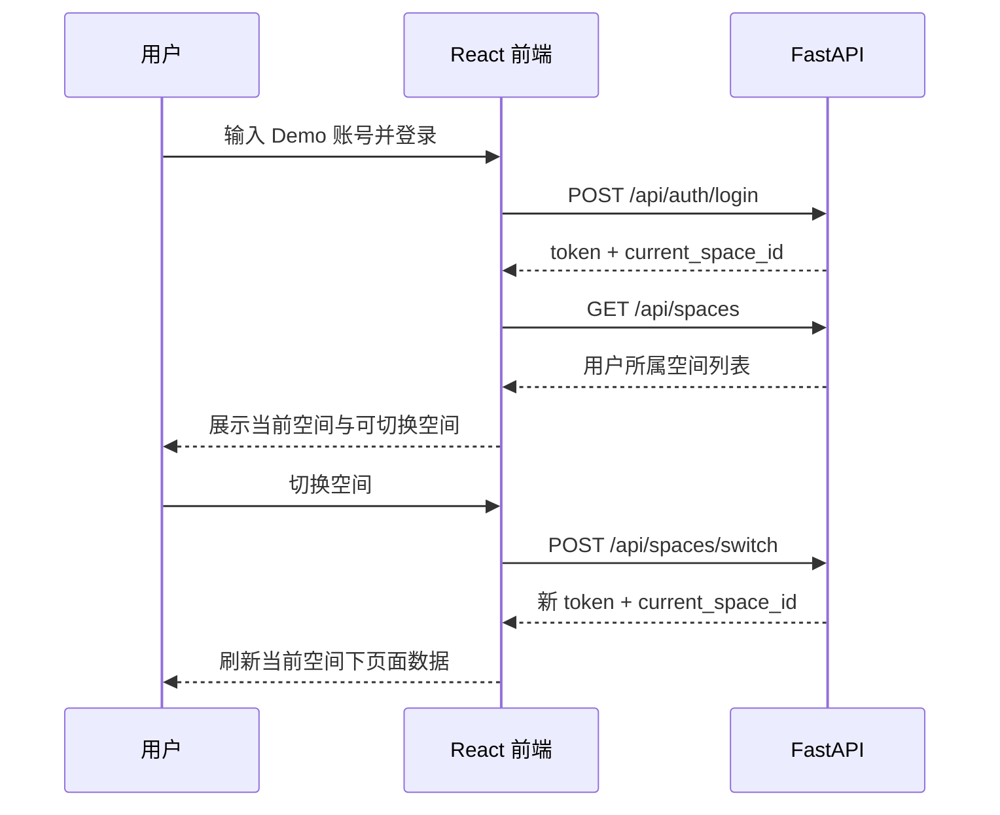

# 详细设计：前端交互与桌面端界面（frontend-interaction）

> 本文是 Phase1（功能范围 `[P1]` · 交付物形态 Demo）的前端交互详细设计，承接 `docs/03-prd.md`、`docs/04-architecture.md`、`docs/05-tech-spec.md`、`docs/07-api-spec.md`、`docs/08-dev-plan.md` 与 `docs/09-verification.md`。
> 本文只定义既有 P1 需求在 React 桌面浏览器中的呈现方式，不新增需求、接口、权限规则或验收目标。

## 1. 职责与边界

### 1.1 职责

- 为 REQ-001..REQ-011、REQ-036 提供统一页面结构、导航、状态反馈与桌面端交互口径。
- 明确前端如何调用 `docs/07-api-spec.md` 已定义接口，避免各 Sprint 分散生成不一致页面。
- 明确权限、空态、错误态在界面上的呈现，但权限判断仍以后端为准。
- 支撑 `docs/08-dev-plan.md` Sprint-2 / 4 / 5 / 6 的前端实现与集成验收。

### 1.2 不做事项

- 不把前端隐藏入口作为安全边界；权限过滤必须由后端 API 和 service 层执行。
- 不新增 P2 标签视图、时间轴、关联图、AI 润色、跨空间推送、多人协作或移动端能力。
- 不新增 `docs/07-api-spec.md` 未定义的接口；实现期如必须新增接口，应先同步修订 API 文档。
- 不定义视觉品牌、精细动效或移动端响应式规范；Phase1 只保证 Chrome / Edge 桌面端可演示。

## 2. 页面信息架构（[P1]）

### 2.1 全局框架

- **顶部栏**：产品名、当前空间、空间切换入口、当前用户、登录状态。
- **侧边导航**：文档、导入、搜索、问答、术语管理；P2 / 愿景入口不显示。
- **主内容区**：承载当前页面；同一页面内使用加载态、空态、错误态保持反馈一致。
- **当前空间上下文**：所有页面必须展示当前 `space_id` 对应空间名；空间切换后刷新文档、搜索、问答与术语上下文。

### 2.2 页面清单

| 页面 | 对应 REQ | 主要接口 | Phase1 Demo 要点 |
|---|---|---|---|
| 登录页 | REQ-001 基础 | `POST /api/auth/login` | 使用 Demo 账号登录并获得 token |
| 空间切换器 | REQ-001 / 002 | `GET /api/spaces`、`POST /api/spaces/switch` | 只展示用户所属空间，切换后全局上下文改变 |
| 文档列表 / 编辑 | REQ-003 / 004 / 005 / 006 / 036 | `/api/documents*` | 文档 CRUD、行内编辑、权限标识、版本入口、术语提示 |
| 导入面板 | REQ-009 / 010 | `POST /api/import` | 上传 .docx / .pdf / 图片，显示处理状态与失败原因 |
| 搜索页 | REQ-003 / 007 / 036 | `GET /api/search?q=` | 关键词搜索、结果摘要、来源跳转、权限过滤空态 |
| RAG 问答页 | REQ-003 / 008 / 036 | `POST /api/query` | 答案带来源；库外问题显示“未在知识库找到” |
| 术语管理页 | REQ-036 | `/api/terms*` | 空间级术语列表、创建、编辑、状态展示 |
| 桌面端集成 | REQ-011 | 全部 P1 接口 | Chrome / Edge 下跑通全部 P1 功能 |

## 3. 核心用户流（[P1]）

### 3.1 登录与空间切换

- 登录成功后，前端保存 token 到运行态会话中，并在请求头传 `Authorization: Bearer <token>`。
- 空间切换成功后，必须清空当前页面缓存结果并重新请求目标空间数据。
- 空间切换失败时保持原空间上下文不变，并显示错误提示。

### 3.2 文档管理与版本

- 文档列表默认只显示当前空间下用户可见文档；私有文档仅作者可见。
- 文档卡片 / 表格至少展示标题、权限级别、更新时间、作者、是否来自导入。
- 创建 / 编辑文档时必须选择或保留权限级别：私有、团队共享、外部只读。
- 保存成功后显示成功反馈并刷新版本入口；保存失败时保留未保存内容，不静默丢弃。
- 版本历史以列表展示版本号、保存时间、作者；恢复版本前二次确认。

### 3.3 导入

- 导入入口支持 .docx / .pdf / 图片文件选择；Phase1 可使用按钮上传，不要求拖拽。
- 上传后显示任务状态：处理中、成功、失败；成功后提供跳转到生成文档的入口。
- 失败时显示可读原因；OCR 或外部服务不可用时按 `docs/07-api-spec.md` 错误码展示降级提示。
- 导入生成内容仍受当前空间与文档权限约束。

### 3.4 搜索

- 搜索框位于搜索页主区域，输入关键词后调用 `GET /api/search?q=`。
- 搜索结果展示标题、摘要、定位信息与来源文档入口。
- 无结果时区分“当前空间无匹配内容”与“请求失败”；不暗示其他空间存在内容。
- 结果只呈现后端返回的可见范围，不在前端拼接跨空间数据。

### 3.5 RAG 问答

- 问答页包含问题输入框、提交按钮、答案区域、来源引用区域。
- 答案必须展示来源文档；无相关内容时展示“未在知识库找到”类提示，不渲染编造答案。
- 来源引用可点击跳转到文档详情；跳转后仍由文档读取接口校验权限。
- 当前空间术语命中时，在答案旁展示术语解释来源或提示“按当前空间术语解释”。

### 3.6 术语管理与术语提示

- 术语管理页按当前空间列出术语，字段包含标准名称、定义、客户习惯用语、负责人、状态。
- 支持创建、编辑、删除术语；删除前二次确认。
- 文档阅读 / 编辑时对已识别术语提供轻量提示；`pending` 状态必须显示“待确认”，但不阻断编辑。
- RAG 问答中同名术语以当前空间术语优先，不被同名全局术语覆盖。

## 4. 状态、空态与错误态

| 场景 | UI 表现 | 约束 |
|---|---|---|
| 未登录 / token 无效 | 返回登录页或显示重新登录提示 | 对应业务码 `4001` |
| 无权限 | 显示“无权限或资源不存在” | 不泄露其他空间或私有文档是否存在 |
| 当前空间无文档 | 显示空态与创建 / 导入入口 | 仅在用户具备入口权限时显示操作按钮 |
| 搜索无结果 | 显示当前空间无匹配结果 | 不提示跨空间搜索 |
| RAG 无答案 | 显示“未在知识库找到” | 不编造，不展示无来源答案 |
| 导入处理中 | 显示处理中状态 | 可刷新状态，不要求实时推送 |
| 外部 AI / OCR 不可用 | 显示服务暂不可用或降级说明 | 对应业务码 `5030` |
| 参数校验失败 | 标记字段错误并保留输入 | 对应业务码 `4220` |
| 服务端错误 | 显示通用错误和重试入口 | 不展示堆栈或敏感信息 |

## 5. 权限与可见性原则

- 前端可隐藏用户不可操作的入口，但不得作为权限判断依据。
- 所有文档列表、搜索结果、问答来源、版本读取均以后端返回为准。
- 私有文档对非作者不可见：列表不出现，搜索不命中，问答不引用。
- 空间切换后必须重新拉取当前空间的文档、术语、搜索与问答结果。
- 错误提示不得泄露其他空间名称、私有文档标题或不可见来源。

## 6. 桌面端适配（REQ-011）

- 支持 Chrome / Edge 桌面端主流宽度；Phase1 不承诺移动端体验。
- 页面应在单屏内清晰呈现主操作：登录、空间切换、文档 CRUD、导入、搜索、问答、术语维护。
- 长文档、长答案、长搜索结果使用滚动区域，不遮挡顶部当前空间与导航。
- 关键操作按钮、错误提示、来源引用在桌面端可见且可点击。
- Sprint-6 做跨页面集成走查，不新增功能。

## 7. 与 API / Sprint / 验证追溯

| UI 能力 | API 来源 | Sprint 来源 | 验证来源 |
|---|---|---|---|
| 登录、空间列表、空间切换 | `POST /api/auth/login`、`GET /api/spaces`、`POST /api/spaces/switch` | Sprint-1 | REQ-001 / 002 |
| 权限过滤呈现 | `/api/documents`、`/api/search`、`/api/query` | Sprint-1 / 2 / 4 | REQ-003 |
| 文档 CRUD / 编辑 / 删除 | `/api/documents*` | Sprint-2 | REQ-004 / 005 |
| 版本历史 / 恢复 | `/api/documents/{id}/versions*` | Sprint-2 | REQ-006 |
| 导入 | `POST /api/import` | Sprint-3 | REQ-009 / 010 |
| 搜索 | `GET /api/search?q=` | Sprint-4 | REQ-007 |
| RAG 问答 | `POST /api/query` | Sprint-4 | REQ-008 |
| 术语管理 / 提示 | `/api/terms*` + 文档 / RAG 呈现 | Sprint-5 | REQ-036 |
| 桌面端集成 | 全部 P1 接口 | Sprint-6 | REQ-011 |

## 8. UI 原型策略与可视化证据

> 本节为 P1 回梳新增（对照 `ai/doc-standards/ui-prototype-strategy.md` + `ai/project-rules.md §2.7`）。本项目前端已实现完毕（Sprint-2~6），原型策略为「代码原型 + mock 数据 + 浏览器 smoke」，不引入 Figma 等外部设计工具。

| 项 | 内容 |
|---|---|
| 是否涉及可点击 UI | 是（React 桌面端） |
| 是否需要开发前可视化原型 | 已完成（Sprint-2~6）；后续新 UI Sprint 沿用代码原型 + mock |
| 原型形式 | 代码原型 + mock 数据 + 浏览器 smoke / 截图证据 |
| 原型权威位置 | `frontend/` 实现代码 + `docs/09-verification.md §5` 浏览器 smoke 记录 |
| 覆盖页面 | 登录、空间切换、文档 CRUD / 行内编辑、版本恢复、导入、搜索、RAG 问答、术语管理、桌面端集成（见 §2.2 全部 P1 页面） |
| 覆盖主流程 | 登录 → 空间切换 → 文档 CRUD / 版本 → 导入 → 搜索 → RAG 问答 → 术语管理（见 §3） |
| 覆盖状态 | 加载 / 空态 / 错误 / 权限拒绝 / 降级提示（见 §4） |
| 未覆盖项 | 真实 PDF / Word 解析、图片 OCR（REQ-009 真实化 / REQ-010 移至后续阶段）；移动端（Phase1 禁止） |
| 确认状态 | 已评审（降级口径）：Sprint-6 Edge Headless + Chrome 人工 smoke 通过（见 `docs/09-verification.md §5`） |
| 与文档关系 | 承接 §2.2 页面清单与 §3 用户流；不新增需求 / 接口 / 验收目标；权限以后端为准（见 §5） |
| 设备 / 浏览器范围 | Chrome / Edge 桌面端主流宽度（REQ-011，见 §6） |

> 约束：原型只表达已授权 P1 需求的界面与交互，不作为新增需求来源；原型发现的问题回 §3 / §4 修订，不直接进入实现。

## 9. 阶段增量

| 阶段 | 状态 | 说明 |
|---|---|---|
| Phase1 Demo `[P1]` | P1-已设计 | 覆盖 P1 桌面端页面、核心用户流、状态与权限呈现 |
| Phase2 MVP `[P2]` | 骨架 | 标签视图、时间轴 / 关联图、AI 润色、跨空间推送、协作、移动端待升阶段细化 |
| 愿景产品 `[愿景]` | 骨架 | 情报分析、多维图谱、信号追踪等高级界面待技术验证后设计 |

## 10. 待人工确认项

- Phase1 是否需要在 Sprint-1 即提供最小空间切换 UI，还是按当前计划仅完成后端与数据库底座，前端从 Sprint-2 开始接入。
- Phase1 文档编辑器是否使用纯文本 Markdown textarea，还是在不新增依赖的前提下实现更接近行内编辑的最小交互。
