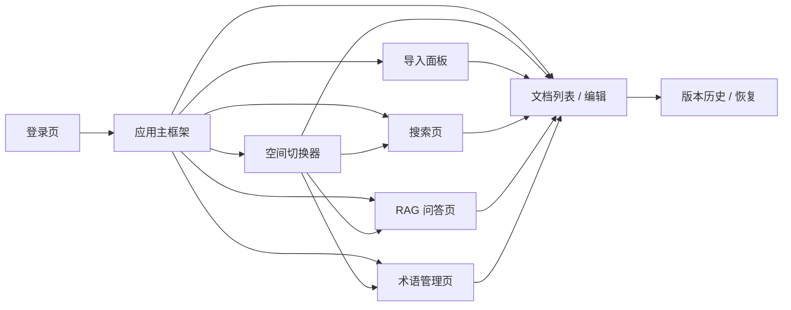
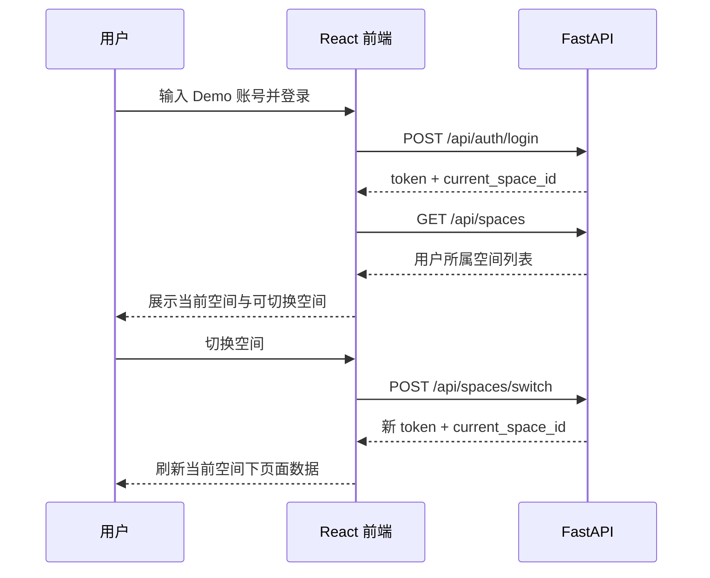

# 详细设计：前端交互与桌面端界面（frontend-interaction）

> 本文是 Phase1（功能范围 `[P1]` · 交付物形态 Demo）的前端交互详细设计，承接 `docs/03-prd.md`、`docs/04-architecture.md`、`docs/05-tech-spec.md`、`docs/07-api-spec.md`、`docs/08-dev-plan.md` 与 `docs/09-verification.md`。
> 本文只定义既有 P1 需求在 React 桌面浏览器中的呈现方式，不新增需求、接口、权限规则或验收目标。

## 0. 文档元信息

| 项 | 内容 |
|---|---|
| 设计对象 | 前端交互与桌面端界面（COMP-001） |
| 文档路径 | docs/design/frontend-interaction.md |
| 输入来源 | 03、04 §1.2 / §5（Flow-001/002）、05、07、08、09；`docs/design/frontend-experience-brief.md`（Phase2 / 愿景体验方向） |
| 覆盖 REQ | REQ-001..011、REQ-036 |
| 所属 Phase | [P1] |
| 交付物形态 | Demo |
| 当前状态 | P1-已实现（Sprint-2~6 代码原型；Sprint-7/8 后 RAG 路径已接真实 LLM + 向量召回；导入 PDF/OCR 仍降级）；P1A 结构优化已实现并通过构建与 Chrome / Edge 900px smoke |
| 页面 / 流程 ID | Page-ID（§2.2）/ UF 用户流（§3） |
| UI 原型策略 | 代码原型 + mock（见 §8、project-rules §2.7） |
| 最后更新 | 2026-07-13（补充 Phase2 / 愿景前端体验方向与实现前确认稿草案） |
| 下游影响 | 08 Sprint-2/4/5/6 + Sprint-9（P1A 结构聚焦重构）、09 TC-P1-001~013；Phase2 若排期需新增 08/09 |

## 1. 职责与边界

### 1.1 职责

- 为 REQ-001..REQ-011、REQ-036 提供统一页面结构、导航、状态反馈与桌面端交互口径。
- 明确前端如何调用 `docs/07-api-spec.md` 已定义接口，避免各 Sprint 分散生成不一致页面。
- 明确权限、空态、错误态在界面上的呈现，但权限判断仍以后端为准。
- 支撑 `docs/08-dev-plan.md` Sprint-2 / 4 / 5 / 6 的前端实现与集成验收。

### 1.2 不做事项

- 不把前端隐藏入口作为安全边界；权限过滤必须由后端 API 和 service 层执行。
- 不新增 P2 标签视图、时间轴、关联图、AI 润色、跨空间推送、多人协作或移动端能力。
- 不新增 `docs/07-api-spec.md` 未定义的接口；实现期如必须新增接口，应先同步修订 API 文档。
- 不定义视觉品牌、精细动效或移动端响应式规范；Phase1 只保证 Chrome / Edge 桌面端可演示。
- P1A 只做桌面端结构聚焦与 768px+ 不破版；不承诺移动端适配，不新增 P2 / Phase2 能力。

## 2. 页面信息架构（[P1]）

### 2.1 全局框架

- **顶部栏**：产品名、当前空间、空间切换入口、当前用户、登录状态。
- **侧边导航**：文档、导入、搜索、问答、术语管理；P2 / 愿景入口不显示。P1A 使用本地 `activeView` 在文档 / 搜索 / 问答 / 术语之间切换，不引入路由。
- **主内容区**：承载当前页面；同一页面内使用加载态、空态、错误态保持反馈一致。P1A 下搜索 / 问答 / 术语不再挤在全局右栏，而是进入各自主视图。
- **当前空间上下文**：所有页面必须展示当前 `space_id` 对应空间名；空间切换后刷新文档、搜索、问答与术语上下文。

### 2.2 页面清单

| Page-ID | 页面 | 对应 REQ | 主要接口 | Phase1 Demo 要点 |
|---|---|---|---|---|
| PG-001 | 登录页 | REQ-001 基础 | `POST /api/auth/login` | 使用 Demo 账号登录并获得 token |
| PG-002 | 空间切换器 | REQ-001 / 002 | `GET /api/spaces`、`POST /api/spaces/switch` | 只展示用户所属空间，切换后全局上下文改变 |
| PG-003 | 文档列表 / 编辑 | REQ-003 / 004 / 005 / 006 / 036 | `/api/documents*` | 文档 CRUD、行内编辑、权限标识、版本入口、术语提示 |
| PG-004 | 导入面板 | REQ-009 / 010 | `POST /api/import` | 上传 .docx / .pdf / 图片，显示处理状态与失败原因 |
| PG-005 | 搜索页 | REQ-003 / 007 / 036 | `GET /api/search?q=` | 关键词搜索、结果摘要、来源跳转、权限过滤空态 |
| PG-006 | RAG 问答页 | REQ-003 / 008 / 036 | `POST /api/query` | 答案带来源；库外问题显示“未在知识库找到” |
| PG-007 | 术语管理页 | REQ-036 | `/api/terms*` | 空间级术语列表、创建、编辑、状态展示 |
| PG-008 | 桌面端集成 | REQ-011 | 全部 P1 接口 | Chrome / Edge 下跑通全部 P1 功能 |

### 2.3 P1A 结构聚焦设计（已实现）

> 来源：`docs/research/2026-07-11-frontend-p1-structure-exploration.md`。P1A 不新增业务 REQ，只修正现有 P1 桌面端体验：任务聚焦、右栏拥挤、桌面窄窗口横滚与单文件可维护性。

| 设计项 | P1A 决策 | 约束 |
|---|---|---|
| 视图切换 | 使用 React 本地状态 `activeView` 切换 `documents` / `search` / `query` / `terms` | 不引入 `react-router`；刷新后回默认文档视图可接受 |
| 左侧导航 | 左侧保留空间切换、一级视图导航与文档列表入口 | P2 / Phase2 入口不显示；权限仍以后端返回为准 |
| 文档视图 | 文档列表 / 编辑 / Markdown 预览为主；版本历史归入文档视图侧栏或折叠区 | 版本不再作为全局右栏常驻面板 |
| 搜索视图 | 搜索框、结果列表、来源打开能力占据主区宽度 | 保留 P0 Markdown 摘要渲染与结果点击打开文档 |
| 问答视图 | 问题输入、Markdown 答案、来源列表占据主区宽度 | 保留文档来源点击；术语来源不可跳文档时给出提示 |
| 术语视图 | 左侧术语列表，右侧编辑表单；新建 / 编辑 / 删除在同一任务视图内完成 | 删除仍需二次确认；不做跨空间术语同步 |
| 桌面响应式 | 去掉全局固定最小宽；`>=1200px` 常规侧栏 + 主区，`768-1199px` 压缩侧栏或单列主区 | `<768px` 不承诺移动端体验，只避免关键内容破版 |
| 组件拆分 | 拆出 `Sidebar`、`DocumentView`、`SearchView`、`QueryView`、`TermsView`、`StatusBar` 等轻量组件 | 不引入全局状态管理，不重写 `frontend/src/api.ts` |

P1A 验收以 `docs/09-verification.md` TC-P1-013 为准：视图切换保持当前空间上下文；搜索 / 问答 / 术语各自主视图不再被无关面板挤压；900px 桌面宽度不出现全局横向滚动；P0 能力不回退。

## 3. 核心用户流（[P1]）

> 用户流稳定 ID（**UF = 前端用户流 User Flow**，与 04 系统级 Flow-ID 命名空间独立）：UF-001 登录与空间切换 / UF-002 文档与版本 / UF-003 导入 / UF-004 搜索 / UF-005 RAG 问答 / UF-006 术语管理，对应 §3.1~§3.6。

### 3.1 登录与空间切换

- 登录成功后，前端保存 token 到运行态会话中，并在请求头传 `Authorization: Bearer <token>`。
- 空间切换成功后，必须清空当前页面缓存结果并重新请求目标空间数据。
- 空间切换失败时保持原空间上下文不变，并显示错误提示。

### 3.2 文档管理与版本

- 文档列表默认只显示当前空间下用户可见文档；私有文档仅作者可见。
- 文档卡片 / 表格至少展示标题、权限级别、更新时间、作者、是否来自导入。
- 创建 / 编辑文档时必须选择或保留权限级别：私有、团队共享、外部只读。
- 保存成功后显示成功反馈并刷新版本入口；保存失败时保留未保存内容，不静默丢弃。
- 版本历史以列表展示版本号、保存时间、作者；恢复版本前二次确认。

### 3.3 导入

- 导入入口支持 .docx / .pdf / 图片文件选择；Phase1 可使用按钮上传，不要求拖拽。
- 上传后显示任务状态：处理中、成功、失败；成功后提供跳转到生成文档的入口。
- 失败时显示可读原因；OCR 或外部服务不可用时按 `docs/07-api-spec.md` 错误码展示降级提示。
- 导入生成内容仍受当前空间与文档权限约束。

### 3.4 搜索

- 搜索框位于搜索页主区域，输入关键词后调用 `GET /api/search?q=`。
- 搜索结果展示标题、摘要、定位信息与来源文档入口。
- 无结果时区分“当前空间无匹配内容”与“请求失败”；不暗示其他空间存在内容。
- 结果只呈现后端返回的可见范围，不在前端拼接跨空间数据。

### 3.5 RAG 问答

- 问答页包含问题输入框、提交按钮、答案区域、来源引用区域。
- 答案必须展示来源文档；无相关内容时展示“未在知识库找到”类提示，不渲染编造答案。
- 来源引用可点击跳转到文档详情；跳转后仍由文档读取接口校验权限。
- 当前空间术语命中时，在答案旁展示术语解释来源或提示“按当前空间术语解释”。

### 3.6 术语管理与术语提示

- 术语管理页按当前空间列出术语，字段包含标准名称、定义、客户习惯用语、负责人、状态。
- 支持创建、编辑、删除术语；删除前二次确认。
- 文档阅读 / 编辑时对已识别术语提供轻量提示；`pending` 状态必须显示“待确认”，但不阻断编辑。
- RAG 问答中同名术语以当前空间术语优先，不被同名全局术语覆盖。

## 4. 状态、空态与错误态

| 场景 | UI 表现 | 约束 |
|---|---|---|
| 未登录 / token 无效 | 返回登录页或显示重新登录提示 | 对应业务码 `4001` |
| 无权限 | 显示“无权限或资源不存在” | 不泄露其他空间或私有文档是否存在 |
| 当前空间无文档 | 显示空态与创建 / 导入入口 | 仅在用户具备入口权限时显示操作按钮 |
| 搜索无结果 | 显示当前空间无匹配结果 | 不提示跨空间搜索 |
| RAG 无答案 | 显示“未在知识库找到” | 不编造，不展示无来源答案 |
| 导入处理中 | 显示处理中状态 | 可刷新状态，不要求实时推送 |
| 外部 AI / OCR 不可用 | 显示服务暂不可用或降级说明 | 对应业务码 `5030` |
| 参数校验失败 | 标记字段错误并保留输入 | 对应业务码 `4220` |
| 服务端错误 | 显示通用错误和重试入口 | 不展示堆栈或敏感信息 |

## 5. 权限与可见性原则

- 前端可隐藏用户不可操作的入口，但不得作为权限判断依据。
- 所有文档列表、搜索结果、问答来源、版本读取均以后端返回为准。
- 私有文档对非作者不可见：列表不出现，搜索不命中，问答不引用。
- 空间切换后必须重新拉取当前空间的文档、术语、搜索与问答结果。
- 错误提示不得泄露其他空间名称、私有文档标题或不可见来源。

## 6. 桌面端适配（REQ-011）

- 支持 Chrome / Edge 桌面端主流宽度；Phase1 不承诺移动端体验。
- 页面应在单屏内清晰呈现主操作：登录、空间切换、文档 CRUD、导入、搜索、问答、术语维护。
- P1A 后，文档 / 搜索 / 问答 / 术语使用主区视图切换，避免全功能同屏常驻。
- 长文档、长答案、长搜索结果使用滚动区域，不遮挡顶部当前空间与导航。
- P1A 桌面响应式目标：Chrome / Edge 在 768px 及以上宽度不出现全局横向滚动；`<768px` 不作为移动端验收范围。
- 关键操作按钮、错误提示、来源引用在桌面端可见且可点击。
- Sprint-6 做跨页面集成走查，不新增功能。

## 7. 与 API / Sprint / 验证追溯

| UI 能力 | API 来源 | Sprint 来源 | 关联 TC | 验证来源 |
|---|---|---|---|---|
| 登录、空间列表、空间切换 | `POST /api/auth/login`、`GET /api/spaces`、`POST /api/spaces/switch` | Sprint-1 | TC-P1-001/002 | REQ-001 / 002 |
| 权限过滤呈现 | `/api/documents`、`/api/search`、`/api/query` | Sprint-1 / 2 / 4 | TC-P1-003 | REQ-003 |
| 文档 CRUD / 编辑 / 删除 | `/api/documents*` | Sprint-2 | TC-P1-004/005 | REQ-004 / 005 |
| 版本历史 / 恢复 | `/api/documents/{id}/versions*` | Sprint-2 | TC-P1-006 | REQ-006 |
| 导入 | `POST /api/import` | Sprint-3 | TC-P1-009/010 | REQ-009 / 010 |
| 搜索 | `GET /api/search?q=` | Sprint-4 | TC-P1-007 | REQ-007 |
| RAG 问答 | `POST /api/query` | Sprint-4 | TC-P1-008 | REQ-008 |
| 术语管理 / 提示 | `/api/terms*` + 文档 / RAG 呈现 | Sprint-5 | TC-P1-012 | REQ-036 |
| 桌面端集成 | 全部 P1 接口 | Sprint-6 | TC-P1-011 | REQ-011 |
| P1A 结构聚焦 / 桌面响应式 | 现有 P1 接口（不新增 API） | Sprint-9（已完成） | TC-P1-013 | REQ-011 / 既有 P1 页面 |

## 8. UI 原型策略与可视化证据

> 本节为 P1 回梳新增（对照 `ai/doc-standards/ui-prototype-strategy.md` + `ai/project-rules.md §2.7`）。本项目前端已实现完毕（Sprint-2~6），原型策略为「代码原型 + mock 数据 + 浏览器 smoke」，不引入 Figma 等外部设计工具。

| 项 | 内容 |
|---|---|
| 是否涉及可点击 UI | 是（React 桌面端） |
| 是否需要开发前可视化原型 | 已完成（Sprint-2~6）；P1A 沿用代码原型 + 研究对齐稿，不引入 Figma |
| 原型形式 | 代码原型 + mock 数据 + 浏览器 smoke / 截图证据 |
| 原型权威位置 | `frontend/` 实现代码 + `docs/09-verification.md §5` 浏览器 smoke 记录 |
| 覆盖页面 | 登录、空间切换、文档 CRUD / 行内编辑、版本恢复、导入、搜索、RAG 问答、术语管理、桌面端集成（见 §2.2 全部 P1 页面） |
| 覆盖主流程 | 登录 → 空间切换 → 文档 CRUD / 版本 → 导入 → 搜索 → RAG 问答 → 术语管理（见 §3） |
| 覆盖状态 | 加载 / 空态 / 错误 / 权限拒绝 / 降级提示（见 §4） |
| 未覆盖项 | 真实 PDF / Word 解析、图片 OCR（REQ-009 真实化 / REQ-010 移至后续阶段）；移动端（Phase1 禁止） |
| 确认状态 | Phase1 Demo 已评审（降级口径）；P1A 结构优化已完成探索、设计回填、代码实现与 Chrome / Edge 900px smoke |
| 与文档关系 | 承接 §2.2 页面清单与 §3 用户流；不新增需求 / 接口 / 验收目标；权限以后端为准（见 §5） |
| 设备 / 浏览器范围 | Chrome / Edge 桌面端主流宽度（REQ-011，见 §6） |

> 约束：原型只表达已授权 P1 需求的界面与交互，不作为新增需求来源；原型发现的问题回 §3 / §4 修订，不直接进入实现。

### 8.1 Phase2 / 实现前 UI 原型门禁

| 项 | 内容 |
|---|---|
| 当前探索原型 | `docs/research/2026-07-13-frontend-experience-prototype.html`，用于确认主题风格、信息架构和主要页面切换方向 |
| 当前确认状态 | 主题风格已确认可沿用；具体界面布局、内容呈现、信息密度和交互细节编码前再单独原型确认 |
| 是否可直接编码 | 否；当前原型是需求探索 / 设计澄清材料，不是实现前定稿 |
| 实现前原型要求 | 基于 §9.2 Page-ID / Flow-ID 草案，覆盖首页、经典目录、文档、搜索、问答、术语与关键状态 |
| 实现前需补 | Page-ID / Flow-ID / 状态 / 权限 / 接口依赖 / TC 定稿；必要时补 `08-dev-plan.md` Sprint 与 `09-verification.md` TC |
| 禁止项 | 不用当前探索原型直接新增 REQ、API、DB、08 Sprint 或 09 必过 TC；不直接编码 Phase2 |

## 9. 阶段增量

| 阶段 | 状态 | 说明 |
|---|---|---|
| Phase1 Demo `[P1]` | P1-已实现 | 覆盖 P1 桌面端页面、核心用户流、状态与权限呈现；RAG 路径已真实化，PDF/OCR 仍按降级提示 |
| P1A 结构优化 `[P1]` | P1A-已实现 | 仅修正既有 P1 前端体验：导航 / 视图聚焦、右栏拆分、桌面 768px+ 不破版、组件拆分；不新增业务 REQ；构建与 Chrome / Edge 900px smoke 通过 |
| Phase2 MVP `[P2]` | 骨架·待正式设计 | 承接 `docs/design/frontend-experience-brief.md`：候选方向为分层空间总览、经典 / 探索双模式、标签 / 反链 / 快速录入 / 推荐问题等体验增强；若排期，需先补 Page-ID / Flow-ID / 状态 / 接口依赖 / TC，不直接进入实现 |
| 愿景产品 `[愿景]` | 骨架·待技术验证 | 承接 `docs/design/frontend-experience-brief.md`：受限局部情报墙、证据地图、矛盾检测、路径推理等仅作为愿景方向；不得作为全空间默认首页，待情报分析技术验证与权限边界设计后再细化 |

### 9.1 Phase2 / 愿景体验方向骨架（待确认后细化）

> UI pipeline 回梳口径：本节只承接 `docs/design/frontend-experience-brief.md` 的候选体验方向，作为 Phase2 / 愿景骨架和待确认项；未完成人工确认、Phase2 排期、Page-ID / Flow-ID / TC 细化前，不得进入实现计划或验收必过项。

| 方向 ID | 方向 | 阶段口径 | 设计状态 | 回填前置 |
|---|---|---|---|---|
| UXD-P2-HOME | 简洁 Wiki 风格首页：欢迎语 + 知识图谱可视化 + 快捷操作工具栏 + AI 助手入口 | `[P2]` 候选·用户已确认方向 | 骨架 | 参考 `知识库Wiki前端交互设计需求说明.md`；补 Page-ID / 状态 / AI 范围提示 / 权限口径 / TC |
| UXD-P2-IA | 分层空间总览：空间 → 项目 / 主题 → 子目录 → 叶子文档列表 → 单篇文档 | `[P2]` 候选·用户已确认方向 | 骨架·HTML 原型已演示目录折叠 / 页面联动 | 补页面 / 视图清单、面包屑、经典目录树入口；第一眼保持简洁，复杂项目瓦片后置 |
| UXD-P2-MODE | 经典 / 探索双模式并存 | `[P2]` 候选 | 骨架·HTML 原型已演示经典目录多层折叠 / 展开 | 确认模式切换、用户偏好记忆、经典模式逃生舱、默认视图和目录展开状态 |
| UXD-P2-DEGRADE | 节点规模视图降级：小集合可探索，中集合聚类，大集合先筛选 | `[P2]` 候选 | 骨架·待验证 | 用 mock / 真实样本标定阈值；未验证前不作为验收标准 |
| UXD-P2-ASK | 高频 AI 助手 / 问答推荐问题 / 示例问题 | `[P2]` 候选·用户已确认需要 | 骨架 | 补 AI 助手入口位置、推荐问题来源、空间 / 文档范围提示、来源可追溯和无来源兜底 |
| UXD-VISION-BOARD | 受限局部情报墙 / 关系图 | `[愿景]` 候选 | 骨架·待技术验证 | 情报分析相关能力验证通过；权限过滤、候选关系、待核实文案和节点规模规则明确 |
| UXD-VISUAL | 明亮蓝白 + 现代靛蓝点缀的数字原生视觉方向 | `[P2]` / `[愿景]` 候选 | 骨架·主题风格已确认可沿用 | HTML 原型已按用户反馈移除最左侧黑色导航条；当前主题风格可沿用；若进入实现，需补视觉规范或实现前 UI 原型，不直接写入必过 TC |

### 9.2 Phase2 实现前确认稿草案（待编码前单独原型确认）

> 本节只把已确认的主题风格和体验方向细化为实现前确认稿草案，用于后续 UI 原型确认与 Page-ID / Flow-ID / TC 追溯。当前不新增 REQ、API、DB、08 Sprint 或 09 必过 TC；若进入实现，必须先完成单独原型确认并更新 `08-dev-plan.md` / `09-verification.md`。

#### 9.2.1 Page-ID 草案

| Page-ID | 页面 / 视图 | 入口 | 角色 | 来源依据 | Phase | 状态 | 编码前确认点 |
|---|---|---|---|---|---|---|---|
| PG-P2-001 | LUMEN 首页 / 简洁空间入口 | 登录后默认页、左侧总览入口 | 已登录空间成员 | `FEB-P-007`、`UXD-P2-HOME`、用户确认主题风格可沿用 | `[P2]` 候选 | 草案·待实现前原型确认 | 欢迎语、知识图谱展示层级、快捷操作、AI 助手入口位置、首屏信息密度 |
| PG-P2-002 | 经典目录 / 分层导航列 | 全局左侧目录、文档页左侧栏 | 已登录空间成员 | `FEB-P-003`、`PX-R-002`、HTML 原型目录折叠演示 | `[P2]` 候选 | 草案·待实现前原型确认 | 多层目录默认展开层级、折叠状态记忆、目录到页面 / 文档联动、空目录文案 |
| PG-P2-003 | 文档阅读 / 编辑 / 预览工作区 | 目录叶子、搜索来源、问答来源、术语引用 | 具备文档可见权限的成员 | `FEB-P-005`、`PX-R-004`、P1 `PG-003` | `[P1]` 延续 / `[P2]` 细化 | 草案·待实现前原型确认 | 阅读 / 编辑 / 预览切换、版本来源位置、保存反馈、只读 / 无权限表现 |
| PG-P2-004 | 搜索工作区增强 | 左侧搜索入口、首页快捷操作、目录待核实入口 | 已登录空间成员 | P1 `PG-005`、`PX-R-006` | `[P2]` 候选 | 草案·待实现前原型确认 | 筛选项、结果密度、来源打开路径、无结果与权限过滤提示 |
| PG-P2-005 | 问答 / AI 助手工作区 | 首页 AI 入口、左侧问答入口、搜索加入问答 | 已登录空间成员 | P1 `PG-006`、`FEB-P-008`、`UXD-P2-ASK` | `[P2]` 候选 | 草案·待实现前原型确认 | 推荐问题来源、回答范围提示、来源引用、库外问题兜底、首页入口形态 |
| PG-P2-006 | 术语工作区增强 | 左侧术语入口、文档术语提示、问答来源 | 已登录空间成员 | P1 `PG-007`、REQ-036、`PX-R-006` | `[P2]` 候选 | 草案·待实现前原型确认 | 术语筛选、编辑入口、待确认术语、文档 / 问答联动 |
| PG-P2-007 | 局部关系图 / 情报墙候选视图 | 项目 / 主题 / 叶子文件夹内可选视图 | 已登录空间成员 | `UXD-VISION-BOARD`、`FEB-P-004` | `[愿景]` 候选 | 草案·待技术验证 | 节点规模阈值、权限过滤、待核实文案、与列表 / 文档互跳 |

#### 9.2.2 Flow-ID 草案

| Flow-ID | 用户目标 | 入口页面 | 步骤摘要 | 成功条件 | 异常 / 降级 | 关联 TC |
|---|---|---|---|---|---|---|
| FL-P2-001 | 从首页快速进入知识工作 | PG-P2-001 | 打开首页 → 查看欢迎语 / 图谱摘要 → 点击导入 / 搜索 / 提问 / 文档入口 | 用户能在首屏理解当前空间并进入主任务 | 无文档时显示创建 / 导入入口；无权限操作隐藏或禁用 | 待 09 新增，暂不写入必过 TC |
| FL-P2-002 | 使用经典目录定位文档 | PG-P2-002 | 展开项目 → 展开子目录 → 点击叶子文档 → 进入 PG-P2-003 | 多层目录不迷路，文档路径清晰 | 空目录显示空态；无权限文档不出现 | 待 09 新增，暂不写入必过 TC |
| FL-P2-003 | 阅读、编辑并预览单篇文档 | PG-P2-003 | 进入文档 → 切换阅读 / 编辑 / 预览 → 保存或查看版本来源 | 内容可读、编辑反馈清晰、预览与保存口径一致 | 只读文档禁用编辑；保存失败保留输入并可重试 | P1 TC-P1-004/005/006 延续；P2 细化待新增 |
| FL-P2-004 | 搜索并打开来源 | PG-P2-004 | 输入关键词 → 切换筛选 → 打开来源文档或加入问答 | 搜索结果密度可读，来源可追溯 | 无结果提示当前空间无匹配；权限过滤不泄露不可见文档 | P1 TC-P1-007 延续；P2 细化待新增 |
| FL-P2-005 | 使用推荐问题进行问答 | PG-P2-005 | 选择推荐问题 → 查看答案 → 打开来源 → 回到文档或术语 | 答案限定当前空间并带来源 | 库外问题显示未找到；AI / 向量不可用时显示降级 | P1 TC-P1-008 延续；P2 细化待新增 |
| FL-P2-006 | 管理并引用术语 | PG-P2-006 | 筛选术语 → 编辑 / 确认术语 → 在文档或问答中引用 | 术语状态、来源和使用位置清楚 | 待确认术语不阻断编辑；无权限编辑时只读 | P1 TC-P1-012 延续；P2 细化待新增 |
| FL-P2-007 | 在局部关系图中探索材料 | PG-P2-007 | 从项目 / 文件夹进入关系图 → 查看节点 → 打开文档 / 术语 / 待核实问题 | 只展示局部、可控规模节点，不替代经典列表 | 超阈值时回到筛选 / 聚类 / 列表；愿景能力未验证不进入实现 | 待技术验证后再定 TC |

#### 9.2.3 状态 / 权限 / 接口 / 验收草案

| 对象 | 状态 / 权限 / 数据依赖 | 用户可见口径 | API / 数据来源 | 验收草案 | 编码前确认点 |
|---|---|---|---|---|---|
| 主题风格 | 当前主题风格可沿用；具体页面布局未锁死 | 明亮蓝白为默认方向，米白 / 浅青作为可选参考 | 前端样式 / 设计 token，暂不新增 API | 视觉 smoke 待实现前原型确认后再补 TC | 是否需要主题切换成为产品功能，或仅保留设计备选 |
| 首页首屏 | 加载、空空间、有文档、无权限快捷操作 | “从当前空间开始”“暂无文档，先导入或新建” | `GET /api/spaces`、`GET /api/documents`、统计可来自既有列表 / 搜索结果 | 待 09 新增 UI smoke，不进入当前必过项 | 首屏模块顺序、图谱是核心还是摘要、AI 助手位置 |
| 经典目录 | 展开 / 折叠、空目录、无权限过滤 | “该目录暂无可见文档” | `/api/documents*`，按当前空间和权限返回 | 待 09 新增目录点击路径 | 默认展开几层、是否记忆用户偏好 |
| 文档工作区 | 阅读 / 编辑 / 预览 / 版本来源、保存中、保存失败、只读 | “已保存”“保存失败，可重试”“只读文档不可编辑” | `/api/documents*`、`/api/documents/{id}/versions*` | P1 TC-P1-004/005/006 延续；P2 UI 细化待新增 | 编辑器高度、预览并排或切换、版本入口位置 |
| 搜索工作区 | 加载、筛选、无结果、权限过滤 | “当前空间无匹配结果” | `GET /api/search?q=` | P1 TC-P1-007 延续；P2 UI 细化待新增 | 筛选维度、结果摘要密度、来源动作文案 |
| 问答工作区 | 推荐问题、回答中、无来源、库外问题、AI 降级 | “仅基于当前空间回答”“未在知识库找到” | `POST /api/query` | P1 TC-P1-008 延续；P2 UI 细化待新增 | 推荐问题出现位置、范围提示、来源卡片样式 |
| 术语工作区 | 全部 / 已确认 / 待确认、编辑、只读 | “待确认术语不阻断编辑” | `/api/terms*` | P1 TC-P1-012 延续；P2 UI 细化待新增 | 术语筛选、文档内提示、问答引用样式 |
| 局部关系图 | 小集合可探索、中集合聚类、大集合先筛选 | “当前集合过大，请先筛选” | 后续能力待技术验证；不得假设新 API | 愿景项，待技术验证后定 TC | 阈值、节点类型、权限过滤和待核实文案 |

### 9.3 编码前原型确认稿 v0.1（待用户审阅）

> 本节是编码前确认稿，不是实现任务单。它把 §9.2 草案进一步收敛为“实现前要让用户看的页面布局 / 内容呈现 / 点击路径 / 状态确认清单”。主题风格已确认可沿用；下表只确认具体界面结构与内容组织方式。用户确认后，才能把相关内容回写到 `08-dev-plan.md` / `09-verification.md` 并进入实现排期。

#### 9.3.1 确认范围与非确认范围

| 类别 | 本稿确认 | 本稿不确认 | 编码前门禁 |
|---|---|---|---|
| 主题风格 | 沿用明亮蓝白 + 现代蓝 / 靛蓝点缀；米白 / 浅青保留为设计参考 | 不确认主题切换是否成为产品功能 | 若产品化主题切换，需另补设置入口和持久化策略 |
| 页面布局 | 首页、经典目录、文档、搜索、问答、术语、评审页的区域结构和信息优先级 | 不确认精确像素、动效、图标库、组件库 | 实现前原型需展示桌面主宽度与 900px 拥挤状态 |
| 内容呈现 | 标题、摘要、来源、状态徽章、推荐问题、术语状态、待核实文案 | 不确认真实统计计算、图谱算法、推荐问题生成逻辑 | 真实数据字段 / 统计口径需回到 API / DB / service 设计 |
| 点击路径 | 目录展开、页面切换、文档阅读 / 编辑 / 预览、搜索筛选、问答来源跳转、术语筛选 | 不确认浏览器路由、深链、历史栈 | 若需要 URL 深链，需另开 P1.5 / Phase2 路由策略确认 |
| 验收边界 | 形成后续 TC 草案输入 | 不新增当前 `09` 必过 TC | 用户确认后再更新 `09-verification.md` |

#### 9.3.2 页面布局确认稿

| Page-ID | 页面 | 布局区域 | 首屏内容 | 主操作 | 次级信息 | 待用户确认 |
|---|---|---|---|---|---|---|
| PG-P2-001 | 首页 / 简洁空间入口 | TopBar + 左侧 Nav Rail + 经典目录列 + 主首页 + 右侧评审 / 状态栏 | 欢迎语、知识图谱摘要、快捷操作、AI 助手入口、空间概要指标 | 导入文档、搜索、提问、进入文档、切换主题 | 当前空间、候选状态、演示路径 | 首页是否足够简洁；知识图谱是否作为摘要而非复杂主画面 |
| PG-P2-002 | 经典目录 / 分层导航 | 左侧固定目录列，支持多层展开 / 折叠 | 全空间总览、项目 / 主题、子目录、叶子文档 | 展开 / 折叠、选择目录、打开文档、跳转搜索 / 术语 | 文档数量、空目录提示、权限过滤结果 | 默认展开层级；是否需要记忆用户上次展开状态 |
| PG-P2-003 | 文档工作区 | 文档列表列 + 文档主区 + 模式切换 | 当前文件夹文档列表、标题、路径、状态徽章、正文 | 阅读、编辑、预览、查看版本 / 来源、保存 / 重试 | 来源、权限、版本记录、术语提示 | 编辑 / 预览是切换还是并排；版本来源入口是否明显 |
| PG-P2-004 | 搜索工作区 | 搜索输入 + 筛选条 + 高密度结果列表 | 当前查询、全部 / 文档 / 术语 / 待核实筛选、结果列表 | 筛选、打开来源、加入问答、查看术语 | 范围、命中类型、权限状态、摘要 | 结果密度是否合适；筛选维度是否够用 |
| PG-P2-005 | 问答 / AI 助手 | 推荐问题区 + 答案卡 + 来源卡 | 推荐问题、回答范围提示、示例回答、来源引用 | 切换推荐问题、提问、打开来源、查看术语 | 库外问题兜底、AI 降级提示、来源命中 | 首页 AI 入口和独立问答页如何衔接 |
| PG-P2-006 | 术语工作区 | 筛选条 + 术语列表 + 编辑入口 | 全部 / 已确认 / 待确认筛选、术语、别名、状态、使用位置 | 筛选、编辑术语、查引用、加入问答 | 空态、只读态、删除二次确认 | 待确认术语在文档 / 问答里如何提示 |
| PG-P2-007 | 局部关系图候选视图 | 仅在项目 / 主题 / 文件夹内作为可选视图 | 局部节点、来源、术语、待核实问题、降级提示 | 打开节点、回到列表、筛选集合 | 节点数、权限过滤、待技术验证提示 | 是否进入近期实现；若进入，阈值和算法需先验证 |

#### 9.3.3 组件 / 内容呈现确认稿

| Component-ID | 所属页面 | 展示内容 | 交互行为 | 状态覆盖 | 确认问题 |
|---|---|---|---|---|---|
| CMP-P2-THEME | 全局 | 默认蓝白主题，米白 / 浅青参考 | 当前原型支持切换；产品化前不默认做设置项 | 主题已确认、可选主题待策略确认 | 是否只保留默认主题，还是保留用户可切换主题 |
| CMP-P2-NAV | 全局 | 总览、文档、搜索、问答、术语、评审 | 点击切换主页面，保持当前空间 | 当前页、高亮、不可见入口 | 是否需要更多一级入口，还是保持克制 |
| CMP-P2-TREE | 经典目录 | 空间、项目 / 主题、子目录、文档、数量 | 展开 / 折叠、点击跳转、权限过滤后隐藏不可见项 | 空目录、折叠、无权限、长名称 | 目录列宽和默认层级是否合适 |
| CMP-P2-HOME-GRAPH | 首页图谱摘要 | 项目 / 文档 / 术语 / 问题关系摘要 | 仅作摘要入口，不默认铺开全空间图谱 | 无数据、节点过多、权限过滤 | 首页图谱是核心视觉还是辅助入口 |
| CMP-P2-QUICK | 首页快捷操作 | 导入、搜索、提问、新建知识条目、待核实问题 | 跳转对应页面或打开对应任务 | 无权限禁用、服务降级 | 快捷操作数量是否过多 |
| CMP-P2-DOC-MODE | 文档工作区 | 阅读 / 编辑 / 预览 / 版本来源 tabs | 切换模式，编辑内容可预览 | 保存中、保存失败、只读、版本恢复 | 编辑与预览是否需要并排显示 |
| CMP-P2-SEARCH-FILTER | 搜索页 | 全部、文档、术语、待核实问题 | 过滤结果列表 | 无结果、权限过滤、加载中 | 筛选名称是否符合用户理解 |
| CMP-P2-QA-SOURCE | 问答页 | 答案、来源卡、术语来源 | 打开来源文档 / 术语 | 无来源、库外问题、AI 降级 | 来源卡数量与密度是否合适 |
| CMP-P2-TERM-LIST | 术语页 | 术语、别名、状态、使用位置 | 筛选、编辑、查引用 | 已确认、待确认、只读、空态 | 术语是否应该在文档编辑中常驻提示 |

#### 9.3.4 编码前点击路径确认稿

| Path-ID | 演示路径 | 用户操作 | 预期结果 | 失败 / 降级口径 | 确认结论 |
|---|---|---|---|---|---|
| PATH-P2-001 | 首页到主任务 | 打开首页 → 点击导入 / 搜索 / 提问 / 文档 | 用户能从首屏进入核心任务 | 无权限按钮禁用或隐藏，服务不可用显示降级 | 待用户确认 |
| PATH-P2-002 | 经典目录定位文档 | 展开 A 客户 → 展开方案文档 → 打开交付方案 | 文档路径、标题、状态和内容一致 | 空目录显示空态，不显示不可见文档 | 待用户确认 |
| PATH-P2-003 | 文档编辑预览 | 打开文档 → 编辑 → 预览 → 查看版本来源 | 编辑不破坏阅读体验，来源 / 版本可追溯 | 保存失败保留输入并可重试，只读文档禁用编辑 | 待用户确认 |
| PATH-P2-004 | 搜索到来源 | 搜索预算 → 切换筛选 → 打开来源文档 | 搜索结果高密度但可读，来源跳转清楚 | 无结果不提示跨空间内容 | 待用户确认 |
| PATH-P2-005 | 问答到来源 | 选择推荐问题 → 查看答案 → 打开来源 | 答案范围清楚，来源可回看 | 库外问题显示未找到，AI 降级不编造 | 待用户确认 |
| PATH-P2-006 | 术语联动 | 筛选待确认术语 → 查看引用 → 回到文档 / 问答 | 术语状态能影响阅读和问答口径 | 待确认术语提示但不阻断编辑 | 待用户确认 |

#### 9.3.5 编码前确认门禁

| Gate-ID | 门禁项 | 通过条件 | 未通过处理 |
|---|---|---|---|
| P2-UI-G-001 | 用户确认页面布局 | 用户明确确认 PG-P2-001..006 的区域结构、主操作和信息密度 | 回到 HTML 原型调整，不进入实现 |
| P2-UI-G-002 | 用户确认内容呈现 | 标题、摘要、状态徽章、来源、术语、待核实文案均无明显误导 | 修改 `frontend-interaction` 与原型文案 |
| P2-UI-G-003 | 权限 / 降级口径确认 | 无权限、只读、AI 降级、搜索无结果、库外问答均有用户可见口径 | 补状态表和 API 错误映射 |
| P2-UI-G-004 | 验收追溯准备 | Page-ID / Flow-ID 能映射到后续 Sprint 和 TC 草案 | 暂不写 `08/09`，继续细化设计 |
| P2-UI-G-005 | 实现排期确认 | 用户确认进入 Phase2 实现，并同意更新 `08-dev-plan.md` / `09-verification.md` | 保持为设计草案，不编码 |

## 实现偏差 / 设计回写

> 对照 `ai/doc-standards/design-doc.md` §4.10。前端业务能力已完整实现（Sprint-2~6 代码原型）；Sprint-7/8 后 RAG 后端路径已真实化（GLM LLM + pgvector 向量召回）。P1A 仅处理结构体验偏差，不新增业务能力。

| 偏差 ID | 代码 / 配置事实 | 原设计 | 偏差类型 | 处理结论 | 回写目标 | 验证 / 证据 |
|---|---|---|---|---|---|---|
| DEV-001 | 前端调用后端：**RAG 已调真实 LLM（GLM-5.2，Sprint-7）+ 向量召回（Sprint-8）**；导入仍仅 `.md`/`.txt`（真实 PDF/Word/OCR 未接入，RG-003） | 前端呈现真实 RAG / PDF / OCR 结果 | 部分实现 | RAG 路径已真实化（#45 回填遗漏，本次补）；导入 PDF/OCR 仍降级。前端 UI 披露口径见 §4 业务码 5030、§8 | 07 API-009/010/011、05 RG-003 | TC-P1-008/009/011 |
| DEV-002 | PR #76 已实现 `activeView` 四视图切换、右栏拆回相关主视图、桌面响应式 CSS 与轻量组件拆分；#72 P0 修复项继续保留 | §2.1 已定义侧边导航 + 主内容区 | 结构体验偏差 | 已按 P1A 设计收口；不引入 `react-router` / 组件库 / 新 API / 移动端适配 | 08 Sprint-9、09 TC-P1-013 | #74 探索；PR #76 `9ede5b6`；`npm.cmd run build` + Chrome / Edge 900px smoke 通过 |

## 10. 待人工确认项

| ID | 待确认项 | AI 建议 | 建议依据 | 备选方案 | 取舍影响 / 阻塞关系 |
|---|---|---|---|---|---|
| FEI-C-001 | P1A 实现后是否继续评估 P1.5：URL 深链 / 浏览器前进后退 | 暂缓到 Phase2 前评估 | P1A 已满足当前 Demo；引入 `react-router` 属新依赖 / 路由策略变化 | 立即做 P1.5 | 可提升可分享性，但增加依赖与测试面 |
| FEI-C-002 | 是否将分层空间总览纳入 Phase2 前端正式设计 | 建议纳入 Phase2 设计候选，不直接排期 | `frontend-experience-brief` 已将分层 IA 收敛为候选方向，且大规模文档下全空间图谱存在可读性风险 | 保持当前工作台首页 | 更保守但缺少空间全貌；不阻塞 P1 |
| FEI-C-003 | 是否继续用静态 HTML 低保真原型验证空间总览 / 配色 / 双模式 / 主要页面交互 | 本轮探索原型可收口：主题风格已确认可沿用；具体界面布局与内容呈现方式编码前再单独原型确认 | 用户明确确认当前主题风格可沿用，并要求界面细节后续编码前再确认 | 直接进入编码 | 直接编码会跳过实现前确认稿；下一步应进入正式设计细化与实现前原型确认，不新增 08/09 必过项 |
| FEI-C-004 | 是否把局部情报墙写入愿景体验方向 | 建议写入愿景但标明待技术验证 | 情报分析是差异化方向，但 REQ-032/033 等高风险 | 不写入 | 不写入会丢失长期 UI 叙事；写入但不实现风险可控 |
| FEI-C-005 | LUMEN 第一眼是否采用简洁 Wiki 风格首页 | 用户已确认方向，建议进入正式设计细化 | 用户反馈“第一眼不要太复杂”，并指定参考 Wiki 输入材料的欢迎语 / 知识图谱 / 快捷操作 / AI 助手布局 | 继续项目瓦片型空间总览首页 | 简洁首页更适合第一眼和演示；项目瓦片可下移或作为空间总览二级内容 |
| FEI-C-006 | AI 助手是否作为首页高频入口 | 用户已确认需要，建议进入正式设计细化 | 用户明确 AI 助手需要频繁使用；P1 已有问答主流程 | 仅保留问答独立页面入口 | 首页入口更直接，但必须显示范围和来源要求，避免变成通用聊天 |
