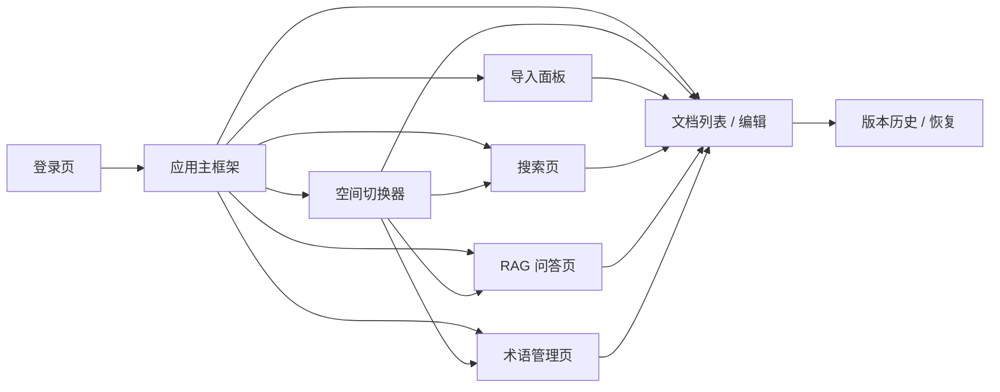
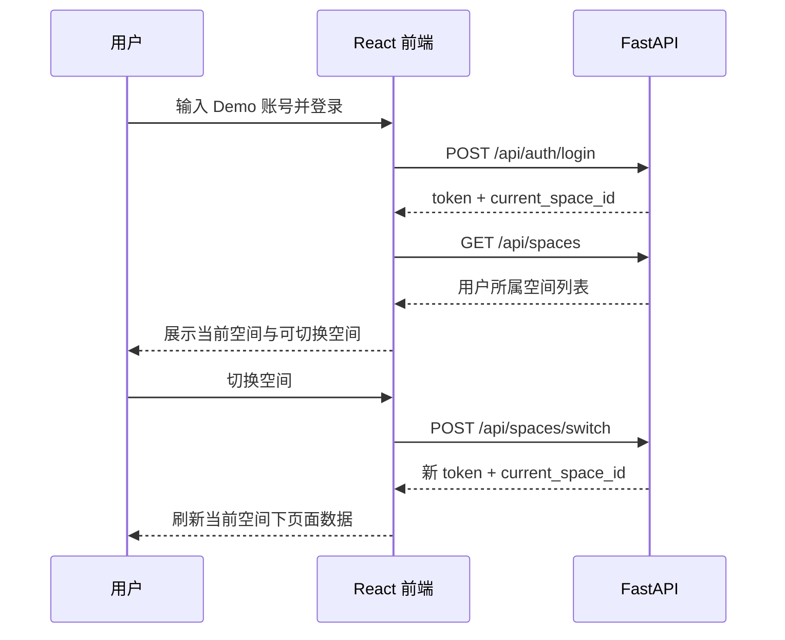

# 详细设计：前端交互与桌面端界面（frontend-interaction）

> 本文同时承担三层职责：一是记录 Phase1（功能范围 `[P1]` · 交付物形态 Demo）已实现的前端交互基线；二是记录 Phase1.5A 批量导入与导出备份、Phase1.5B PDF 导出的已实现交互路径；三是记录 Phase2A 已实现基线并沉淀 Phase2B UI 实现前确认稿候选。
> 当前少容器清爽稿已作为实现前 UI 确认版候选回填到 `docs/08-dev-plan.md` Sprint-11 与 `docs/09-verification.md` TC-P2-WSG / TC-P2-UI 草案；Phase2A 已完成（REQ-026/012/025 vertical slice，TC-P2-LINK/TAG/QUICK-001 通过），Phase2B 已完成 AI 润色 / 写作引用首版与主题时间线 slice；本文 Phase2A 部分对应已实现基线，Phase2B 新 UI slice 仍需按门禁另行确认。
> 交叉引用：`docs/design/frontend-workspace-redesign.md` 已承接并实现 P1B 工作台视觉密度、布局与组件拆分口径；本文仍保留页面职责、UF 用户流、接口依赖与状态边界的权威口径。

## 0. 文档元信息

| 项 | 内容 |
|---|---|
| 设计对象 | 前端交互与桌面端界面（COMP-001） |
| 文档路径 | docs/design/frontend-interaction.md |
| 输入来源 | 03、04 §1.2 / §5（Flow-001/002/006/007/008）、05、07、08、09；`docs/design/ingestion.md`；`docs/design/export-delivery.md`；`docs/design/frontend-experience-brief.md`；`docs/research/2026-07-13-ui-prototype-exploration.md`；`docs/research/prototypes/2026-07-14-frontend-ui-reference-absorbed-prototype.html` |
| 覆盖 REQ | P1：REQ-001..011、REQ-036；Phase1.5A：REQ-037/038；Phase1.5B：REQ-027（PDF 导出入口已随 Sprint-18 实现）；Phase2A 已实现追溯：REQ-012/025/026；Phase2B UI 候选追溯：REQ-013/014/024（后续新 UI slice 仍需实现前门禁） |
| 所属 Phase | [P1] 已实现基线 + Phase1.5A 已实现交互 + Phase2A 已实现基线 + Phase2B UI Gate 草案 |
| 交付物形态 | Demo / 个人可用 Alpha |
| 当前状态 | P1-已实现；P1A / P1B 前端体验收口已实现并通过构建与 Chrome / Edge 900px smoke；Phase1.5A 批量导入与 `.md` / ZIP 导出交互路径已实现并通过 TC-P1-015/016；Phase1.5B PDF 导出入口已实现并通过 TC-P1-017；P2 少容器清爽稿作为后续 Phase2B UI / WSG 门禁候选保留；Phase2A 已完成（REQ-026/012/025，TC-P2-LINK/TAG/QUICK-001 通过）；**Phase2B 首批 REQ-014 AI 润色/写作引用 vertical slice 已闭环（PR#89–95 / v1.1.0，TC-P2-AI-001 live UI smoke 2026-07-31 通过）**，主题时间线（REQ-013/024）第二 slice 已完成并通过 smoke |
| 页面 / 流程 ID | Page-ID（§2.2）/ UF 用户流（§3） |
| UI 原型策略 | P1 / P1.5A：代码原型 + smoke；P2A/B：静态 HTML 实现前确认稿 + 后续 Chrome / Edge smoke 草案（见 §8 / §9） |
| 最后更新 | 2026-08-04（**timeline task-030 / v1.5.2：PG-P2-008 主题时间线视图已实现并通过运行态 API smoke、Edge headless 浏览器 smoke 与真实 PG 大数据性能 smoke；folder-tree 浏览器自动化 smoke 已补**）；前版回写 REQ-014 闭环 + §9.5 Doc-First 候选基线 |
| 下游影响 | 08 Sprint-2/4/5/6/9/10/16/17/18；08 Sprint-11（P2-UI-Gate / WSG 候选）；09 TC-P1-001~017、TC-P2-WSG-001 与 TC-P2-UI-001~005 草案；Phase2B 编码仍需另行确认任务 |

### 0.1 阅读索引与当前结论

| 阅读目的 | 先看章节 | 当前结论 |
|---|---|---|
| 了解已实现前端基线 | §2~§7、§10 | P1 / P1A / P1B 已完成并有 09 smoke 证据；RAG 已真实化，Word/PDF 解析与 OCR 仍降级，PDF 导出见 Phase1.5B |
| 确认 Phase1.5A/B UI 路径 | §9.0、08 Sprint-16/17/18、09 TC-P1-015/016/017 | 批量 / 文件夹导入、`.md` / ZIP 导出与 PDF 导出入口已实现并通过验证 |
| 确认 Phase2 UI 方向 | §8.1、§9.1~§9.3 | 少容器清爽稿暂定按当前稿继续；Phase2A 聚焦标签 / 反链 / 快速录入，Phase2B 再考虑 AI 润色 / 时间轴 |
| 判断是否可编码 | §9.4、08 Sprint-16/17/18 或 Sprint-11、09 TC | Phase1.5A/B 与 Phase2A 已完成；Phase2B 后续新 slice 需另行确认范围、任务和验证包 |
| 查待确认项 | §11 | Word/PDF 解析、zhparser、后续 Phase2B 范围、图谱 / 情报墙等仍需人工确认；已完成项不得回退为待确认 |
## 1. 职责与边界

### 1.1 职责

- 为 REQ-001..REQ-011、REQ-036 提供统一页面结构、导航、状态反馈与桌面端交互口径。
- 明确前端如何调用 `docs/07-api-spec.md` 已定义接口，避免各 Sprint 分散生成不一致页面。
- 明确权限、空态、错误态在界面上的呈现，但权限判断仍以后端为准。
- 支撑 `docs/08-dev-plan.md` Sprint-2 / 4 / 5 / 6 的前端实现与集成验收。

### 1.2 不做事项

- 不把前端隐藏入口作为安全边界；权限过滤必须由后端 API 和 service 层执行。
- 不新增 P2 标签视图、时间轴、关联图、AI 润色、跨空间推送、多人协作或移动端能力。
- 不新增 `docs/07-api-spec.md` 未定义的接口；实现期如必须新增接口，应先同步修订 API 文档。
- 不定义视觉品牌、精细动效或移动端响应式规范；Phase1 只保证 Chrome / Edge 桌面端可演示。
- P1A 只做桌面端结构聚焦与 768px+ 不破版；不承诺移动端适配，不新增 P2 / Phase2 能力。

## 2. P1 已实现页面信息架构

### 2.1 全局框架

- **顶部栏**：产品名、当前空间、空间切换入口、当前用户、登录状态。
- **侧边导航**：文档、导入、搜索、问答、术语管理；P2 / 愿景入口不显示。P1A 使用本地 `activeView` 在文档 / 搜索 / 问答 / 术语之间切换，不引入路由。
- **主内容区**：承载当前页面；同一页面内使用加载态、空态、错误态保持反馈一致。P1A 下搜索 / 问答 / 术语不再挤在全局右栏，而是进入各自主视图。
- **当前空间上下文**：所有页面必须展示当前 `space_id` 对应空间名；空间切换后刷新文档、搜索、问答与术语上下文。

### 2.2 页面清单

| Page-ID | 页面 | 对应 REQ | 主要接口 | Phase1 Demo 要点 |
|---|---|---|---|---|
| PG-001 | 登录页 | REQ-001 基础 | `POST /api/auth/login` | 使用 Demo 账号登录并获得 token |
| PG-002 | 空间切换器 | REQ-001 / 002 | `GET /api/spaces`、`POST /api/spaces/switch` | 只展示用户所属空间，切换后全局上下文改变 |
| PG-003 | 文档列表 / 编辑 | REQ-003 / 004 / 005 / 006 / 036 | `/api/documents*` | 文档 CRUD、行内编辑、权限标识、版本入口、术语提示 |
| PG-004 | 导入面板 | REQ-009 / 010 | `POST /api/import` | 上传 .docx / .pdf / 图片，显示处理状态与失败原因 |
| PG-005 | 搜索页 | REQ-003 / 007 / 036 | `GET /api/search?q=` | 关键词搜索、结果摘要、来源跳转、权限过滤空态 |
| PG-006 | RAG 问答页 | REQ-003 / 008 / 036 | `POST /api/query` | 答案带来源；库外问题显示“未在知识库找到” |
| PG-007 | 术语管理页 | REQ-036 | `/api/terms*` | 空间级术语列表、创建、编辑、状态展示 |
| PG-008 | 桌面端集成 | REQ-011 | 全部 P1 接口 | Chrome / Edge 下跑通全部 P1 功能 |

### 2.3 P1A 结构聚焦设计（已实现）

> 来源：`docs/research/2026-07-11-frontend-p1-structure-exploration.md`。P1A 不新增业务 REQ，只修正现有 P1 桌面端体验：任务聚焦、右栏拥挤、桌面窄窗口横滚与单文件可维护性。

| 设计项 | P1A 决策 | 约束 |
|---|---|---|
| 视图切换 | 使用 React 本地状态 `activeView` 切换 `documents` / `search` / `query` / `terms` | 不引入 `react-router`；刷新后回默认文档视图可接受 |
| 左侧导航 | 左侧保留空间切换、一级视图导航与文档列表入口 | P2 / Phase2 入口不显示；权限仍以后端返回为准 |
| 文档视图 | 文档列表 / 编辑 / Markdown 预览为主；版本历史归入文档视图侧栏或折叠区 | 版本不再作为全局右栏常驻面板 |
| 搜索视图 | 搜索框、结果列表、来源打开能力占据主区宽度 | 保留 P0 Markdown 摘要渲染与结果点击打开文档 |
| 问答视图 | 问题输入、Markdown 答案、来源列表占据主区宽度 | 保留文档来源点击；术语来源不可跳文档时给出提示 |
| 术语视图 | 左侧术语列表，右侧编辑表单；新建 / 编辑 / 删除在同一任务视图内完成 | 删除仍需二次确认；不做跨空间术语同步 |
| 桌面响应式 | 去掉全局固定最小宽；`>=1200px` 常规侧栏 + 主区，`768-1199px` 压缩侧栏或单列主区 | `<768px` 不承诺移动端体验，只避免关键内容破版 |
| 组件拆分 | 拆出 `Sidebar`、`DocumentView`、`SearchView`、`QueryView`、`TermsView`、`StatusBar` 等轻量组件 | 不引入全局状态管理，不重写 `frontend/src/api.ts` |

P1A 验收以 `docs/09-verification.md` TC-P1-013 为准：视图切换保持当前空间上下文；搜索 / 问答 / 术语各自主视图不再被无关面板挤压；900px 桌面宽度不出现全局横向滚动；P0 能力不回退。

### 2.4 P1B 工作台系统化重设计（已实现）

> 来源：`docs/design/frontend-workspace-redesign.md`、`docs/design/frontend-workspace-redesign-prototype.html`、`docs/08-dev-plan.md` Sprint-10、`docs/09-verification.md` TC-P1-014。P1B 不新增业务 REQ，只把 P1/P1A 前端收敛为更稳定的生产力工作台结构。

| 设计项 | P1B 决策 | 约束 / 证据 |
|---|---|---|
| 全局骨架 | TopBar + Nav Rail + Context Pane + Workspace 三层工作台 | 不新增 router / 组件库 / 新 API；TC-P1-014 已通过 |
| 上下文面板 | 文档、搜索、问答、术语视图各自切换上下文，不常驻无关面板 | 解决 P1A 后仍可能出现的任务混杂与信息挤压 |
| 视觉密度 | 使用 pane / toolbar / list-row / inspector 等分层样式，弱化大卡片堆叠 | Chrome / Edge 900px smoke 通过，无全局横向滚动 |
| P0/P1 回归 | 文档 CRUD、版本恢复、Markdown 预览、搜索来源打开、问答、术语管理不回退 | `npm.cmd run build` + Chrome / Edge headless smoke 通过 |
## 3. P1 核心用户流（已实现）

> 用户流稳定 ID（**UF = 前端用户流 User Flow**，与 04 系统级 Flow-ID 命名空间独立）：UF-001 登录与空间切换 / UF-002 文档与版本 / UF-003 导入 / UF-004 搜索 / UF-005 RAG 问答 / UF-006 术语管理，对应 §3.1~§3.6。

### 3.1 登录与空间切换

- 登录成功后，前端保存 token 到运行态会话中，并在请求头传 `Authorization: Bearer <token>`。
- 空间切换成功后，必须清空当前页面缓存结果并重新请求目标空间数据。
- 空间切换失败时保持原空间上下文不变，并显示错误提示。

### 3.2 文档管理与版本

- 文档列表默认只显示当前空间下用户可见文档；私有文档仅作者可见。
- 文档卡片 / 表格至少展示标题、权限级别、更新时间、作者、是否来自导入。
- 创建 / 编辑文档时必须选择或保留权限级别：私有、团队共享、外部只读。
- 保存成功后显示成功反馈并刷新版本入口；保存失败时保留未保存内容，不静默丢弃。
- 版本历史以列表展示版本号、保存时间、作者；恢复版本前二次确认。

### 3.3 导入

- 导入入口支持 .docx / .pdf / 图片文件选择；Phase1 可使用按钮上传，不要求拖拽。
- 上传后显示任务状态：处理中、成功、失败；成功后提供跳转到生成文档的入口。
- 失败时显示可读原因；OCR 或外部服务不可用时按 `docs/07-api-spec.md` 错误码展示降级提示。
- 导入生成内容仍受当前空间与文档权限约束。

### 3.4 搜索

- 搜索框位于搜索页主区域，输入关键词后调用 `GET /api/search?q=`。
- 搜索结果展示标题、摘要、定位信息与来源文档入口。
- 无结果时区分“当前空间无匹配内容”与“请求失败”；不暗示其他空间存在内容。
- 结果只呈现后端返回的可见范围，不在前端拼接跨空间数据。

### 3.5 RAG 问答

- 问答页包含问题输入框、提交按钮、答案区域、来源引用区域。
- 答案必须展示来源文档；无相关内容时展示“未在知识库找到”类提示，不渲染编造答案。
- 来源引用可点击跳转到文档详情；跳转后仍由文档读取接口校验权限。
- 当前空间术语命中时，在答案旁展示术语解释来源或提示“按当前空间术语解释”。

### 3.6 术语管理与术语提示

- 术语管理页按当前空间列出术语，字段包含标准名称、定义、客户习惯用语、负责人、状态。
- 支持创建、编辑、删除术语；删除前二次确认。
- 文档阅读 / 编辑时对已识别术语提供轻量提示；`pending` 状态必须显示“待确认”，但不阻断编辑。
- RAG 问答中同名术语以当前空间术语优先，不被同名全局术语覆盖。

## 4. P1 状态、空态与错误态

| 场景 | UI 表现 | 约束 |
|---|---|---|
| 未登录 / token 无效 | 返回登录页或显示重新登录提示 | 对应业务码 `4001` |
| 无权限 | 显示“无权限或资源不存在” | 不泄露其他空间或私有文档是否存在 |
| 当前空间无文档 | 显示空态与创建 / 导入入口 | 仅在用户具备入口权限时显示操作按钮 |
| 搜索无结果 | 显示当前空间无匹配结果 | 不提示跨空间搜索 |
| RAG 无答案 | 显示“未在知识库找到” | 不编造，不展示无来源答案 |
| 导入处理中 | 显示处理中状态 | 可刷新状态，不要求实时推送 |
| 外部 AI / OCR 不可用 | 显示服务暂不可用或降级说明 | 对应业务码 `5030` |
| 参数校验失败 | 标记字段错误并保留输入 | 对应业务码 `4220` |
| 服务端错误 | 显示通用错误和重试入口 | 不展示堆栈或敏感信息 |

## 5. P1 权限与可见性原则

- 前端可隐藏用户不可操作的入口，但不得作为权限判断依据。
- 所有文档列表、搜索结果、问答来源、版本读取均以后端返回为准。
- 私有文档对非作者不可见：列表不出现，搜索不命中，问答不引用。
- 空间切换后必须重新拉取当前空间的文档、术语、搜索与问答结果。
- 错误提示不得泄露其他空间名称、私有文档标题或不可见来源。

## 6. P1 / P1A / P1B 桌面端适配（REQ-011）

- 支持 Chrome / Edge 桌面端主流宽度；Phase1 不承诺移动端体验。
- 页面应在单屏内清晰呈现主操作：登录、空间切换、文档 CRUD、导入、搜索、问答、术语维护。
- P1A 后，文档 / 搜索 / 问答 / 术语使用主区视图切换，避免全功能同屏常驻。
- 长文档、长答案、长搜索结果使用滚动区域，不遮挡顶部当前空间与导航。
- P1A 桌面响应式目标：Chrome / Edge 在 768px 及以上宽度不出现全局横向滚动；`<768px` 不作为移动端验收范围。
- 关键操作按钮、错误提示、来源引用在桌面端可见且可点击。
- Sprint-6 做跨页面集成走查，不新增功能。

## 7. API / Sprint / 验证追溯

| UI 能力 | API 来源 | Sprint 来源 | 关联 TC | 验证来源 |
|---|---|---|---|---|
| 登录、空间列表、空间切换 | `POST /api/auth/login`、`GET /api/spaces`、`POST /api/spaces/switch` | Sprint-1 | TC-P1-001/002 | REQ-001 / 002 |
| 权限过滤呈现 | `/api/documents`、`/api/search`、`/api/query` | Sprint-1 / 2 / 4 | TC-P1-003 | REQ-003 |
| 文档 CRUD / 编辑 / 删除 | `/api/documents*` | Sprint-2 | TC-P1-004/005 | REQ-004 / 005 |
| 版本历史 / 恢复 | `/api/documents/{id}/versions*` | Sprint-2 | TC-P1-006 | REQ-006 |
| 导入 | `POST /api/import` | Sprint-3 | TC-P1-009/010 | REQ-009 / 010 |
| 搜索 | `GET /api/search?q=` | Sprint-4 | TC-P1-007 | REQ-007 |
| RAG 问答 | `POST /api/query` | Sprint-4 | TC-P1-008 | REQ-008 |
| 术语管理 / 提示 | `/api/terms*` + 文档 / RAG 呈现 | Sprint-5 | TC-P1-012 | REQ-036 |
| 桌面端集成 | 全部 P1 接口 | Sprint-6 | TC-P1-011 | REQ-011 |
| P1A 结构聚焦 / 桌面响应式 | 现有 P1 接口（不新增 API） | Sprint-9（已完成） | TC-P1-013 | REQ-011 / 既有 P1 页面 |
| P1B 工作台系统化重设计 | 现有 P1 接口（不新增 API） | Sprint-10（已完成） | TC-P1-014 | REQ-011 / 既有 P1 页面 |

## 8. 原型策略、可视化证据与实现前门禁

> 本节为 P1 回梳新增（对照 `ai/doc-standards/ui-prototype-strategy.md` + `ai/project-rules.md §2.7`）。本项目前端已实现完毕（Sprint-2~6），原型策略为「代码原型 + mock 数据 + 浏览器 smoke」，不引入 Figma 等外部设计工具。

| 项 | 内容 |
|---|---|
| 是否涉及可点击 UI | 是（React 桌面端） |
| 是否需要开发前可视化原型 | 已完成（Sprint-2~6）；P1A 沿用代码原型 + 研究对齐稿，不引入 Figma |
| 原型形式 | 代码原型 + mock 数据 + 浏览器 smoke / 截图证据 |
| 原型权威位置 | `frontend/` 实现代码 + `docs/09-verification.md §5` 浏览器 smoke 记录 |
| 覆盖页面 | 登录、空间切换、文档 CRUD / 行内编辑、版本恢复、导入、搜索、RAG 问答、术语管理、桌面端集成（见 §2.2 全部 P1 页面） |
| 覆盖主流程 | 登录 → 空间切换 → 文档 CRUD / 版本 → 导入 → 搜索 → RAG 问答 → 术语管理（见 §3） |
| 覆盖状态 | 加载 / 空态 / 错误 / 权限拒绝 / 降级提示（见 §4） |
| 未覆盖项 | 真实 PDF / Word 解析、图片 OCR（REQ-009 真实化 / REQ-010 移至后续阶段）；移动端（Phase1 禁止） |
| 确认状态 | Phase1 Demo 已评审（降级口径）；P1A / P1B 已完成探索、设计回填、代码实现与 Chrome / Edge 900px smoke；P2 少容器清爽稿暂定为实现前确认版候选 |
| 与文档关系 | 承接 §2.2 页面清单与 §3 用户流；不新增需求 / 接口 / 验收目标；权限以后端为准（见 §5） |
| 设备 / 浏览器范围 | Chrome / Edge 桌面端主流宽度（REQ-011，见 §6） |

> 约束：原型只表达已授权 P1 需求的界面与交互，不作为新增需求来源；原型发现的问题回 §3 / §4 修订，不直接进入实现。

### 8.1 Phase2 / 实现前 UI 原型门禁

| 项 | 内容 |
|---|---|
| 需求探索记录 | `docs/research/2026-07-13-ui-prototype-exploration.md`，用于记录早期方向探索、用户反馈和候选回填项 |
| 实现前 UI 确认版 | `docs/research/prototypes/2026-07-14-frontend-ui-confirmation-prototype.html`，用于在编码前看实际页面效果、点击路径和成熟默认交互 |
| 参考原型吸收对比版 | `docs/research/prototypes/2026-07-14-frontend-ui-reference-absorbed-prototype.html`，用于对比评估是否吸收 `docs/inputs/参考原型.html` 中的面包屑、经典 / 探索切换、分层搜索和图谱降级经验 |
| 当前确认状态 | 主题风格已确认可沿用；参考吸收版少容器清爽稿暂定按当前稿继续；08/09 已回填 Sprint-11 与 TC-P2-UI 草案，仍需人工确认 Phase2 与实现任务后再编码 |
| 是否可直接编码 | 否；08/09 已回填 Sprint-11 与 TC-P2-UI 草案，但仍需人工确认 Phase2 范围、进入 / 退出标准和具体实现任务后再编码 |
| 实现前原型要求 | 基于 §9.2 Page-ID / Flow-ID 草案，覆盖首页、经典目录、文档、搜索、问答、术语、关键状态和可调宽布局 |
| 实现前需补 | Sprint-11 / TC-P2-UI 已为草案；正式实现前需把 Page-ID / Flow-ID / 状态 / 权限 / 接口依赖 / TC 从草案定稿，并确认具体代码任务 |
| 禁止项 | 不用原型直接新增 REQ、API、DB；Sprint-11 / TC-P2-UI 只是门禁草案，不直接编码 Phase2 |

## 9. Phase1.5A / Phase2 UI 候选设计与实现前确认稿

| 阶段 | 状态 | 说明 |
|---|---|---|
| Phase1 Demo `[P1]` | P1-已实现 | 覆盖 P1 桌面端页面、核心用户流、状态与权限呈现；RAG 路径已真实化，Word/PDF 解析与 OCR 仍按降级提示 |
| P1A 结构优化 `[P1]` | P1A-已实现 | 仅修正既有 P1 前端体验：导航 / 视图聚焦、右栏拆分、桌面 768px+ 不破版、组件拆分；不新增业务 REQ；构建与 Chrome / Edge 900px smoke 通过 |
| Phase1.5A `[P1]` | UI 路径已实现 | 批量 / 文件夹导入复用 Context Pane 导入区，增加 drop zone、多文件 / 文件夹选择、批量进度与逐条结果；导出复用文档详情 / 空间工具栏，增加 `.md` 下载与空间 ZIP 导出入口；TC-P1-015/016 已通过 |
| Phase1.5B `[P1]` | UI 路径已实现 | 文档详情工具栏新增"导出 PDF"入口，调用 API-019 同步生成中文 PDF artifact；TC-P1-017 已通过 |
| Phase2A `[P2]` | 已实现最小闭环 | 标签、内链 / 反链、快速录入已完成并通过 TC-P2-TAG/LINK/QUICK-001；经典 / 探索双模式等更大 UI 方向仍按候选处理，不自动扩大 Phase2A 范围 |
| Phase2B `[P2]` | **已完成（2026-08-05 收口）** | AI 润色 / 写作引用（REQ-014 首批核心，已落地）、**主题时间线 / 密度热条（REQ-013a/024 第二 slice·PG-P2-008 已实现，候选 A + 关键词/标签驱动 + actor + 密度 ratio，TL-C-001..011 已确认；运行态 API smoke / Edge headless 浏览器 smoke / 真实 PG 大数据性能 smoke 已通过）**；数据外发已接受（RG-008）、AI 降级 5030 已定 |
| 愿景产品 `[愿景]` | 骨架·待技术验证 | 承接 `docs/design/frontend-experience-brief.md`：受限局部情报墙、证据地图、矛盾检测、路径推理等仅作为愿景方向；不得作为全空间默认首页，待情报分析技术验证与权限边界设计后再细化 |

### 9.0 Phase1.5A/B 已实现交互路径

> 本节覆盖 Sprint-16 / Sprint-17 已落地的个人可用 Alpha 路径，以及 Sprint-18 已落地的 PDF 导出路径；API 依据 `docs/07-api-spec.md` API-029 / API-030 / API-019，详细设计依据 `docs/design/ingestion.md` Flow-006 与 `docs/design/export-delivery.md` Flow-007 / Flow-008。

| Path-ID | 关联 REQ / TC | 页面 / 入口 | 用户操作 | 预期结果 | 失败 / 降级口径 | 编码前确认点 |
|---|---|---|---|---|---|---|
| PATH-P15A-001 | REQ-037 / TC-P1-015 | Context Pane 导入区 | 拖入多个 `.md` / `.txt`，或点击“选择文件夹” | 显示批量进度与逐条结果；成功项可进入文档列表并可搜索 / 问答 | 不支持格式显示 failed；同名显示 skipped；其他成功项不回滚 | 是否同时保留单文件导入入口；文件夹按钮文案 |
| PATH-P15A-002 | REQ-037 / TC-P1-015 | 批量结果面板 | 查看成功 / 失败 / 跳过列表，点击成功项打开文档 | 标题保留相对路径前缀，能定位导入来源 | 失败项显示简短原因，不暴露本机绝对路径 | 结果列表是否可折叠、是否保留最近一次导入结果 |
| PATH-P15A-003 | REQ-038 / TC-P1-016 | 文档详情 / 工具栏 | 点击“下载 .md” | 下载当前可见文档 Markdown | 无权限或文档不存在显示 4004 等价提示 | 文件名安全化规则；版本下载是否进入首批 |
| PATH-P15A-004 | REQ-038 / TC-P1-016 | 空间工具栏 | 点击“导出空间 ZIP” | 下载只包含当前用户可见文档的 ZIP | 无可见文档显示空态；导出失败显示可重试 | 入口放在空间工具栏还是设置菜单；是否显示导出范围说明 |
| PATH-P15B-001 | REQ-027 / TC-P1-017 | 文档详情 / 工具栏 | 点击“导出 PDF” | 生成当前可见文档 PDF artifact 并触发浏览器下载 | 无权限或文档不存在显示 4004 等价提示；PDF 依赖 / 字体不可用显示 5030；下载未就绪显示 4090 | 首版同步生成；下载端点已由 v1.7.0 补齐，异步队列与清理 job 留后续 |

| 组件 / 状态 | UI 口径 | API / 数据来源 | 验收 |
|---|---|---|---|
| 批量导入 drop zone | “拖入 .md / .txt 或选择文件夹” | API-029 | TC-P1-015 Chrome smoke |
| 批量结果列表 | done / failed / skipped 三态，失败不影响成功 | API-029 response `items[]` | TC-P1-015 |
| 单文档 `.md` 下载 | 文档详情轻量按钮，不占主流程 | API-030 document export | TC-P1-016 |
| 空间 ZIP 导出 | 明确“仅导出当前可见文档” | API-030 space export | TC-P1-016 |
| 单文档 PDF 导出 | 文档详情轻量按钮，成功后直接下载 PDF | API-019 PDF export + download | TC-P1-017 |

**P1.5A/B 编码边界**：默认不引 router / 组件库 / 全局状态库；若批量结果跨组件复用，优先抽 feature state / hook；导出不实现长期公开链接，PDF 首版不做异步队列 / 过期清理 job。

### 9.1 Phase2 / 愿景体验方向池

> UI pipeline 回梳口径：本节承接 `docs/design/frontend-experience-brief.md` 与实现前原型反馈。Phase2A 已由标签、内链 / 反链、快速录入三个 vertical slice 完成；Sprint-11 / TC-P2-UI 作为 Phase2B 启动前门禁草案保留，未重新确认范围、进入 / 退出标准和具体实现任务前，不得进入 Phase2B 编码。

| 方向 ID | 方向 | 阶段口径 | 设计状态 | 回填前置 |
|---|---|---|---|---|
| UXD-P2-HOME | 简洁 Wiki 风格首页：欢迎语 + 知识图谱可视化 + 快捷操作工具栏 + AI 助手入口 | `[P2]` 候选·用户已确认方向 | 骨架 | Phase2A 只承接个人知识组织入口；AI 写作能力留 Phase2B |
| UXD-P2-IA | 分层空间总览：空间 → 项目 / 主题 → 子目录 → 叶子文档列表 → 单篇文档 | Phase2A 候选·用户已确认方向 | 骨架·HTML 原型已演示目录折叠 / 页面联动 | 补页面 / 视图清单、面包屑、经典目录树入口；第一眼保持简洁，复杂项目瓦片后置 |
| UXD-P2-MODE | 经典 / 探索双模式并存 | Phase2A 候选 | 骨架·HTML 原型已演示经典目录多层折叠 / 展开 | 确认模式切换、用户偏好记忆、经典模式逃生舱、默认视图和目录展开状态 |
| UXD-P2-DEGRADE | 节点规模视图降级：小集合可探索，中集合聚类，大集合先筛选 | Phase2A / Phase2B 候选 | 骨架·待验证 | 用 mock / 真实样本标定阈值；未验证前不作为验收标准 |
| UXD-P2-ASK | 高频 AI 助手 / 问答推荐问题 / 示例问题 | P1 RAG 延续；**Phase2B AI 润色 / 写作引用（REQ-014）已确认首批** | 已细化（§9.2/§9.3） | 问答入口沿用 P1；AI 润色数据外发已接受（RG-008）、降级 5030 已定；详见 `docs/design/ai-polish.md` |
| UXD-VISION-BOARD | 受限局部情报墙 / 关系图 | `[愿景]` 候选 | 骨架·待技术验证 | 情报分析相关能力验证通过；权限过滤、候选关系、待核实文案和节点规模规则明确 |
| UXD-VISUAL | 明亮蓝白 + 现代靛蓝点缀的数字原生视觉方向 | `[P2]` / `[愿景]` 候选 | 骨架·主题风格已确认可沿用 | HTML 原型已按用户反馈移除最左侧黑色导航条；当前主题风格可沿用；若进入实现，需补视觉规范或实现前 UI 原型，不直接写入必过 TC |

### 9.2 Phase2A/B 实现前追溯草案（已回填 08/09 草案）

> 本节只把已确认的主题风格和体验方向细化为实现前确认稿草案，用于后续 UI 原型确认与 Page-ID / Flow-ID / TC 追溯。当前不新增 REQ、API、DB、08 Sprint 或 09 必过 TC；若进入实现，必须先完成单独原型确认并更新 `08-dev-plan.md` / `09-verification.md`。

#### 9.2.1 Page-ID 草案

| Page-ID | 页面 / 视图 | 入口 | 角色 | 来源依据 | Phase | 状态 | 编码前确认点 |
|---|---|---|---|---|---|---|---|
| PG-P2-001 | LUMEN 首页 / 简洁空间入口 | 登录后默认页、左侧总览入口 | 已登录空间成员 | `FEB-P-007`、`UXD-P2-HOME`、用户确认主题风格可沿用 | `[P2]` 候选 | 已实现（落地形态见 §9.5 偏差） | 欢迎语、知识图谱展示层级、快捷操作、AI 助手入口位置、首屏信息密度 |
| PG-P2-002 | 经典目录 / 分层导航列 | 全局左侧目录、文档页左侧栏 | 已登录空间成员 | `FEB-P-003`、`PX-R-002`、HTML 原型目录折叠演示 | `[P2]` 候选 | 已实现（落地形态见 §9.5 偏差） | 多层目录默认展开层级、折叠状态记忆、目录到页面 / 文档联动、空目录文案 |
| PG-P2-003 | 文档预览 / 编辑 / 并排工作区 | 目录叶子、搜索来源、问答来源、术语引用 | 具备文档可见权限的成员 | `FEB-P-005`、`PX-R-004`、P1 `PG-003` | `[P1]` 延续 / `[P2]` 细化 | 已实现（落地形态见 §9.5 偏差） | 预览 / 编辑 / 编辑+预览并排切换、可调宽区域、版本来源位置、保存反馈、只读 / 无权限表现 |
| PG-P2-004 | 搜索工作区增强 | 左侧搜索入口、首页快捷操作、目录待核实入口 | 已登录空间成员 | P1 `PG-005`、`PX-R-006` | `[P2]` 候选 | 已实现（落地形态见 §9.5 偏差） | 筛选项、结果密度、来源打开路径、无结果与权限过滤提示 |
| PG-P2-005 | 问答 / AI 助手工作区 | 首页 AI 入口、左侧问答入口、搜索加入问答 | 已登录空间成员 | P1 `PG-006`、`FEB-P-008`、`UXD-P2-ASK` | `[P2]` 候选 | 已实现（落地形态见 §9.5 偏差） | 推荐问题来源、回答范围提示、来源引用、库外问题兜底、首页入口形态 |
| PG-P2-006 | 术语工作区增强 | 左侧术语入口、文档术语提示、问答来源 | 已登录空间成员 | P1 `PG-007`、REQ-036、`PX-R-006` | `[P2]` 候选 | 已实现（落地形态见 §9.5 偏差） | 术语筛选、编辑入口、待确认术语、文档 / 问答联动 |
| PG-P2-007 | 局部关系图 / 情报墙候选视图 | 项目 / 主题 / 叶子文件夹内可选视图 | 已登录空间成员 | `UXD-VISION-BOARD`、`FEB-P-004` | `[愿景]` 候选 | 草案·待技术验证 | 节点规模阈值、权限过滤、待核实文案、与列表 / 文档互跳 |
| PG-P2-008 | **主题时间线** / 密度热条视图 | 空间内可选视图、首页快捷入口 | 已登录空间成员 | REQ-013a/024、`docs/design/timeline.md`（候选 A 实时聚合） | `[P2]` Phase2B 第二 slice | 已实现（task-030；运行态 API smoke + Edge headless 浏览器 smoke + 真实 PG 大数据性能 smoke 通过） | **两种主题入口（关键词搜索框 + 标签选择，并列）** + 顶部密度热条（4 档色阶 **+ 量化 ratio 悬停提示**）+ 下方事件列表（带 **actor**；linked 显示「未知」）+ 零命中空态 + 大集合聚合提示；越权事件不显示 |

#### 9.2.2 Flow-ID 草案

| Flow-ID | 用户目标 | 入口页面 | 步骤摘要 | 成功条件 | 异常 / 降级 | 关联 TC |
|---|---|---|---|---|---|---|
| FL-P2-001 | 从首页快速进入知识工作 | PG-P2-001 | 打开首页 → 查看欢迎语 / 图谱摘要 → 点击导入 / 搜索 / 提问 / 文档入口 | 用户能在首屏理解当前空间并进入主任务 | 无文档时显示创建 / 导入入口；无权限操作隐藏或禁用 | TC-P2-UI-001 / 004（草案·未执行） |
| FL-P2-002 | 使用经典目录定位文档 | PG-P2-002 | 展开项目 → 展开子目录 → 点击叶子文档 → 进入 PG-P2-003 | 多层目录不迷路，文档路径清晰 | 空目录显示空态；无权限文档不出现 | TC-P2-UI-002（草案·未执行） |
| FL-P2-003 | 预览、编辑并并排查看单篇文档 | PG-P2-003 | 进入文档 → 查看预览 → 编辑 → 切到编辑+预览并排 → 保存或查看版本来源 | 内容可读、编辑反馈清晰、预览与保存口径一致，主要区域可调宽 | 只读文档禁用编辑；保存失败保留输入并可重试 | P1 TC-P1-004/005/006 延续；TC-P2-UI-003（草案·未执行） |
| FL-P2-004 | 搜索并打开来源 | PG-P2-004 | 输入关键词 → 切换筛选 → 打开来源文档或加入问答 | 搜索结果密度可读，来源可追溯 | 无结果提示当前空间无匹配；权限过滤不泄露不可见文档 | P1 TC-P1-007 延续；TC-P2-UI-004（草案·未执行） |
| FL-P2-005 | 使用推荐问题进行问答 | PG-P2-005 | 选择推荐问题 → 查看答案 → 打开来源 → 回到文档或术语 | 答案限定当前空间并带来源 | 库外问题显示未找到；AI / 向量不可用时显示降级 | P1 TC-P1-008 延续；TC-P2-UI-004（草案·未执行） |
| FL-P2-006 | 管理并引用术语 | PG-P2-006 | 筛选术语 → 编辑 / 确认术语 → 在文档或问答中引用 | 术语状态、来源和使用位置清楚 | 待确认术语不阻断编辑；无权限编辑时只读 | P1 TC-P1-012 延续；TC-P2-UI-004（草案·未执行） |
| FL-P2-007 | 在局部关系图中探索材料 | PG-P2-007 | 从项目 / 文件夹进入关系图 → 查看节点 → 打开文档 / 术语 / 待核实问题 | 只展示局部、可控规模节点，不替代经典列表 | 超阈值时回到筛选 / 聚类 / 列表；愿景能力未验证不进入实现 | TC-P2-UI-005（草案·未执行）；真实算法待技术验证 |
| FL-P2-008 | AI 润色 / 写作引用（REQ-014，Phase2B 首批） | PG-P2-003（文档工作区） | 选中正文片段 → 打开 AI 润色侧边栏（CMP-P2-AI-POLISH）→ 选 mode=polish / citation + 可选 instruction → 触发 → 预览草稿 + sources → 应用（写回正文 + 版本）/ 丢弃 | 草稿生成（generated）；引用可追溯到 chunk / 文档；应用写回并留版本 | LLM 不可用 → 5030 / Mock 占位（不编造）；无可见来源 → sources=[] 提示未找到；越权 chunk 不进入 prompt / 不返回；文档只读 → 禁用润色 | TC-P2-AI-001（待 Sprint-19 实现） |

#### 9.2.3 状态 / 权限 / 接口 / 验收草案

| 对象 | 状态 / 权限 / 数据依赖 | 用户可见口径 | API / 数据来源 | 验收草案 | 编码前确认点 |
|---|---|---|---|---|---|
| 主题风格 | 当前主题风格可沿用；具体页面布局未锁死 | 明亮蓝白为默认方向，米白 / 浅青作为可选参考 | 前端样式 / 设计 token，暂不新增 API | 视觉 smoke 待实现前原型确认后再补 TC | 是否需要主题切换成为产品功能，或仅保留设计备选 |
| 首页首屏 | 加载、空空间、有文档、无权限快捷操作 | “从当前空间开始”“暂无文档，先导入或新建” | `GET /api/spaces`、`GET /api/documents`、统计可来自既有列表 / 搜索结果 | TC-P2-UI-001（草案·未执行） | 首屏模块顺序、图谱是核心还是摘要、AI 助手位置 |
| 经典目录 | 展开 / 折叠、空目录、无权限过滤 | “该目录暂无可见文档” | `/api/documents*`，按当前空间和权限返回 | TC-P2-UI-002（草案·未执行） | 默认展开几层、是否记忆用户偏好 |
| 文档工作区 | 预览 / 编辑 / 编辑+预览并排 / 版本来源、保存中、保存失败、只读 | “已保存”“保存失败，可重试”“只读文档不可编辑” | `/api/documents*`、`/api/documents/{id}/versions*` | P1 TC-P1-004/005/006 延续；P2 UI 细化待新增 | 目录区、文档列表、编辑预览区、右侧状态区的可调宽口径；版本入口位置 |
| 搜索工作区 | 加载、筛选、无结果、权限过滤 | “当前空间无匹配结果” | `GET /api/search?q=` | P1 TC-P1-007 延续；P2 UI 细化待新增 | 筛选维度、结果摘要密度、来源动作文案 |
| 问答工作区 | 推荐问题、回答中、无来源、库外问题、AI 降级 | “仅基于当前空间回答”“未在知识库找到” | `POST /api/query` | P1 TC-P1-008 延续；P2 UI 细化待新增 | 推荐问题出现位置、范围提示、来源卡片样式 |
| 术语工作区 | 全部 / 已确认 / 待确认、编辑、只读 | “待确认术语不阻断编辑” | `/api/terms*` | P1 TC-P1-012 延续；P2 UI 细化待新增 | 术语筛选、文档内提示、问答引用样式 |
| 局部关系图 | 小集合可探索、中集合聚类、大集合先筛选 | “当前集合过大，请先筛选” | 后续能力待技术验证；不得假设新 API | 愿景项，待技术验证后定 TC | 阈值、节点类型、权限过滤和待核实文案 |
| AI 润色侧边栏（REQ-014） | generated / applied / discarded / failed；文档可写方可触发；sources 仅当前用户可见 chunk | “AI 润色”“引用来源”“未找到可引用来源”“AI 暂不可用，可重试” | API-028（mode=polish / citation）；草稿 `lumen_ai_drafts` | TC-P2-AI-001（待 Sprint-19）；UI smoke 待门禁重跑 | 应用 = 替换选区还是追加（D-C-002）；citation 异步与否（D-C-001） |

### 9.3 实现前 UI 确认稿 v0.2（少容器清爽稿暂定）

> 本节是编码前确认稿，不是实现任务单。它把 §9.2 草案进一步收敛为“实现前要让用户看的页面布局 / 内容呈现 / 点击路径 / 状态确认清单”。主题风格已确认可沿用；对尚未人工锁定的细节，本节给出 AI 推荐默认稿，作为原型和后续实现前的约束基线，避免“未确认 = 可自由发挥”。用户确认或调整后，才能把相关内容回写到 `08-dev-plan.md` / `09-verification.md` 并进入实现排期。

#### 9.3.1 确认范围与推荐约束

| 类别 | 本稿确认 | 不锁死但受推荐稿约束 | 编码前门禁 |
|---|---|---|---|
| 主题风格 | 沿用明亮蓝白 + 现代蓝 / 靛蓝点缀；米白 / 浅青保留为设计参考 | 主题切换暂不作为产品功能；原型可保留切换按钮用于比较视觉，不进入设置 / 持久化 | 若产品化主题切换，需另补设置入口和持久化策略 |
| 页面布局 | 首页、经典目录、文档、搜索、问答、术语、评审页的区域结构和信息优先级 | 精确像素、动效、图标库、组件库先按 §9.3.1.1 默认稿呈现；不得另起一套视觉 / 交互体系 | 实现前原型需展示桌面主宽度与 900px 拥挤状态 |
| 内容呈现 | 标题、摘要、来源、状态徽章、推荐问题、术语状态、待核实文案 | 真实统计计算、图谱算法、推荐问题生成逻辑暂不锁定；原型先用静态 Mock 与明确待验证文案 | 真实数据字段 / 统计口径需回到 API / DB / service 设计 |
| 点击路径 | 目录展开、页面切换、文档预览 / 编辑 / 并排预览、搜索筛选、问答来源跳转、术语筛选 | 浏览器路由、深链、历史栈先不锁死；原型使用页内状态切换，但必须保留可映射到 Page-ID / Path-ID 的路径 | 若需要 URL 深链，需另开 P1.5 / Phase2 路由策略确认 |
| 验收边界 | 形成后续 TC 草案输入 | 不新增当前 `09` 必过 TC；原型证据先只作为确认材料，不写成验收通过 | 用户确认后再更新 `09-verification.md` |

##### 9.3.1.1 AI 推荐默认稿（未确认细节的约束基线）

> 下表用于约束“尚未最终确认但可以按行业通用做法先出一稿”的细节。若后续原型或实现未获得用户进一步确认，应优先沿用本默认稿；若发现不适配，必须回到待确认项，不得由实现过程自由改写。

| 维度 | AI 推荐默认稿 | 依据 | 仍需确认 / 不得越界 |
|---|---|---|---|
| 桌面布局尺度 | 以 1440px 桌面为主展示宽度；TopBar 约 56px，Nav Rail 约 64-72px，目录列约 280px，右侧评审 / 状态栏约 300-340px，主内容自适应；900px 拥挤态优先收起右侧栏，再允许目录折叠 | 企业知识库 / SaaS 控制台常见三栏工作台布局，兼顾导航、阅读和状态反馈 | 精确像素可在原型中微调；不得把移动端适配写入 Phase1 |
| 间距与层级 | 使用 8px 间距体系；卡片内边距 16-24px；主标题、段落摘要、状态徽章、来源元信息形成 4 层信息层级 | 通用设计系统的密度与可读性基线，适合文档 / 搜索 / 问答高信息密度页面 | 不锁定具体 CSS token；实现前应与现有前端样式对齐 |
| 动效 | 只使用轻量过渡：hover / focus / 页面切换 150-200ms，目录展开 180-240ms；不做复杂动画、视差或图谱飞线 | Demo / 企业工具优先稳定、低干扰、可演示 | 若动效影响性能或截图稳定性，优先降级为无动效 |
| 图标与组件 | 图标采用线性、单色、语义化占位；组件沿用现有前端能力或原生样式，不因原型新增图标库 / 组件库依赖 | 减少视觉噪声和依赖风险，符合“新增依赖须确认”约束 | 若实现需新增图标库或组件库，必须先确认依赖与用途 |
| 统计与摘要 | 首页统计、图谱摘要、推荐问题先用静态 Mock；文案明确“候选 / 示例 / 待验证”，不暗示真实算法已启用 | 原型用于确认信息组织，不替代真实统计、推荐或图算法设计 | 真实统计口径、字段和 API 必须回到 `06/07` 与 service 设计 |
| 路由与导航 | 原型使用页内切换模拟页面；实现前可先采用简单路由映射 Page-ID，不承诺深链、历史栈恢复或多标签状态同步 | 编码前确认关注点击路径和信息结构，不提前锁死路由方案 | 深链 / 历史栈属于后续路由策略确认项 |
| 可访问性与状态 | 保留可见 focus、禁用态、加载态、空态、错误态、无权限态和降级提示；按钮命中区域不小于约 40px | 企业工具基础可用性与验收可观察性要求 | 前端状态不替代后端权限；无权限必须对应 API / 服务层边界 |
| 局部关系图 | 默认不进入近期实现；仅作为局部、可选、待技术验证的候选视图，在原型中可用静态图说明方向 | Phase1 明确禁止高级关联图；高风险能力需 readiness gate | 不得新增图谱算法、接口、TC 或实现排期 |
| 参考原型吸收 | 可在对比版中吸收面包屑、经典 / 探索双模式、分层搜索和图谱阈值降级；同时采用少容器、少圆角、分隔线优先的清爽信息流表达，吸收交互点但不吸收“卡片铺满”的呈现；先作为 UI 默认稿候选，不直接进入实现 | `docs/inputs/参考原型.html` 的结构经验与当前分层 IA 方向一致 | 少容器清爽稿暂定按当前稿继续；阈值、模式开关位置和搜索范围已进入 Sprint-11 / TC-P2-UI 草案，正式实现前仍需人工确认；不得把随机关系图或强“冲突检测”照搬为真实算法 |

##### 9.3.1.2 待确认项处理口径

| 待确认类型 | 处理口径 | 示例 | 进入实现前要求 |
|---|---|---|---|
| 成熟 UI 经验可判断 | AI 给出推荐默认稿，用户审阅原型时可整体接受或局部调整；未反对时按默认稿继续 | 阅读与预览合并为一个预览视图；编辑时提供并排预览；主要工作区可调宽；搜索结果密度；来源列表 / 折叠数量；容器视觉克制（少圆角、少边框、少胶囊、少阴影） | 原型中可见并标注默认行为 |
| 产品策略或阶段范围 | 必须人工显式确认，不因默认稿自动进入实现 | 主题切换是否产品化；局部关系图是否近期实现；移动端适配 | 未确认则保持候选 / 后续阶段 |
| 新接口 / 新依赖 / 新算法 | 必须回到 `06/07`、技术评估或依赖确认，不得由 UI 原型单独决定 | 真实统计口径、推荐问题生成、图谱算法、组件库 / 图标库引入 | 未确认则使用静态 Mock 或现有能力 |
| 权限 / 降级 / 验收 | 必须能映射到 API / 服务层边界和 `09` 验证，不得只靠前端表现 | 无权限按钮、库外问答、AI 降级、保存失败 | 用户可见文案与后端边界一致 |

#### 9.3.2 页面布局确认稿

| Page-ID | 页面 | 布局区域 | 首屏内容 | 主操作 | 次级信息 | AI 推荐默认稿 / 待确认 |
|---|---|---|---|---|---|---|
| PG-P2-001 | 首页 / 简洁空间入口 | TopBar + 左侧 Nav Rail + 经典目录列 + 主首页 + 右侧评审 / 状态栏 | 欢迎语、知识图谱摘要、快捷操作、AI 助手入口、空间概要指标 | 导入文档、搜索、提问、进入文档、切换主题 | 当前空间、候选状态、演示路径 | 推荐：保持首页克制，首屏只保留 2-3 个主信息区；知识图谱只做摘要入口，不做复杂主画面；参考吸收点用轻量文字标签呈现，项目 / 主题采用 2 个重点信息块 + 其余紧凑列表；以留白和细分隔线表达层级，避免大面积圆角矩形；快捷操作控制在 3-4 个；主题切换仅作原型对比 |
| PG-P2-002 | 经典目录 / 分层导航 | 左侧可调宽目录列，支持多层展开 / 折叠；Phase2C REQ-018 下分为上层“LUMEN 知识库”和下层“本地挂载” | 全空间总览、项目 / 主题、子目录、叶子文档；本地挂载 vault / 文件夹入口 | 展开 / 折叠、选择目录、打开文档、跳转搜索 / 术语；本地挂载可按需导入到 LUMEN | 文档数量、空目录提示、权限过滤结果、本地授权状态 | 推荐：默认展开空间 + 最近 / 当前项目两层；目录宽度可拖拽调整；记忆展开状态先用前端本地状态。Vault 兼容时用明确分隔线 / 标题 / 图标区分 DB 文档与本地挂载，避免用户误以为本地文件已进入团队知识库 |
| PG-P2-003 | 文档工作区 | 可调宽文档列表列 + 可调宽文档主区 + 可调宽右侧状态区（含 AI 润色侧边栏 CMP-P2-AI-POLISH） | 当前文件夹文档列表、标题、路径、状态徽章、正文预览 | 预览、编辑、编辑+预览并排、查看版本 / 来源、保存 / 重试、AI 润色 / 写作引用 | 来源、权限、版本记录、术语提示、AI 草稿（generated / applied / discarded / failed） | 推荐：默认预览；阅读与预览合并为一个视图；编辑时提供“编辑 + 预览并排”；目录区、文档列表、编辑预览区和右侧状态区都应可调宽；**Phase2B：右侧状态区承载 AI 润色侧边栏（选中文本触发，草稿预览不直接改原文，应用才写回 + 版本，见 FL-P2-008 / CMP-P2-AI-POLISH）** |
| PG-P2-009 | 面包屑 / 分层搜索吸收项 | TopBar 可点击面包屑 + 左侧当前层级搜索 | 当前空间、项目 / 主题、当前页面路径、当前筛选状态 | 返回空间总览、回到文档层级、过滤当前层级可见内容 | 不跨空间泄露、空结果提示、权限过滤 | 推荐：吸收参考原型的可点击面包屑与层级内搜索；搜索默认只过滤当前空间 / 当前层级可见内容（**2026-08-02：编号 PG-P2-008 → PG-P2-009，消除与主题时间线视图的 ID 冲突**） |
| PG-P2-004 | 搜索工作区 | 搜索输入 + 筛选条 + 高密度结果列表 | 当前查询、全部 / 文档 / 术语 / 待核实筛选、结果列表 | 筛选、打开来源、加入问答、查看术语 | 范围、命中类型、权限状态、摘要 | 推荐：保留全部 / 文档 / 术语 / 待核实四类筛选；结果摘要 2-3 行，打开来源为主操作，加入问答为次操作 |
| PG-P2-005 | 问答 / AI 助手 | 推荐问题区 + 答案卡 + 来源卡 | 推荐问题、回答范围提示、示例回答、来源引用 | 切换推荐问题、提问、打开来源、查看术语 | 库外问题兜底、AI 降级提示、来源命中 | 推荐：首页保留轻量提问入口和推荐问题，提交后进入独立问答页；独立页承载完整答案、来源卡和历史上下文 |
| PG-P2-006 | 术语工作区 | 筛选条 + 术语列表 + 编辑入口 | 全部 / 已确认 / 待确认筛选、术语、别名、状态、使用位置 | 筛选、编辑术语、查引用、加入问答 | 空态、只读态、删除二次确认 | 推荐：术语页集中管理；文档 / 问答内只做非阻断徽标、hover 卡或侧栏提示，不常驻打断阅读 |
| PG-P2-007 | 局部关系图候选视图 | 仅在项目 / 主题 / 文件夹内作为可选视图 | 局部节点、来源、术语、待核实问题、降级提示 | 打开节点、回到列表、筛选集合 | 节点数、权限过滤、待技术验证提示 | 推荐：近期不实现；原型只用静态候选卡说明方向，待技术验证阈值、算法和权限过滤后再决定是否进入排期 |

#### 9.3.3 组件 / 内容呈现确认稿

| Component-ID | 所属页面 | 展示内容 | 交互行为 | 状态覆盖 | AI 推荐默认稿 / 待确认 |
|---|---|---|---|---|---|
| CMP-P2-THEME | 全局 | 默认蓝白主题，米白 / 浅青参考 | 当前原型支持切换；产品化前不默认做设置项 | 主题已确认、可选主题待策略确认 | 推荐：产品默认只保留蓝白主题；原型保留主题切换用于比较，不进入设置 / 持久化 |
| CMP-P2-NAV | 全局 | 总览、文档、搜索、问答、术语、评审 | 点击切换主页面，保持当前空间 | 当前页、高亮、不可见入口 | 推荐：一级入口保持 5-6 个以内；高级视图放在目录 / 页面上下文，不新增一级导航 |
| CMP-P2-TREE | 经典目录 / 文件管理器 | 上层：LUMEN 数据库知识库（空间、项目 / 主题、子目录、文档、数量）；下层：本地挂载（vault / 本地文件夹、授权状态、未入库标记；Phase2C·已设计，浏览器 File System Access 句柄 + 刷新恢复 granted 已 RG-009 验证） | 展开 / 折叠、点击跳转、权限过滤后隐藏不可见项；本地挂载条目可打开、重新授权、按需导入到 LUMEN | 空目录、折叠、无权限、长名称、本地授权失效、未入库 | 推荐：目录列约 280px，支持折叠与拖拽调整宽度；默认展开两层并记忆本地展开状态。两个来源必须视觉分区：LUMEN DB 内容在上，本地挂载在下；本地挂载使用“本地 / 未入库”状态，不参与团队权限和服务端 RAG |
| CMP-P2-BREADCRUMB | 全局 | 空间、项目 / 主题、页面路径 | 点击返回上级或空间总览 | 当前页、高亮、路径过长 | 推荐：吸收参考原型的可点击面包屑；路径过长时截断中间层级但保留当前页 |
| CMP-P2-LAYER-SEARCH | 全局 / 目录 | 当前层级搜索框、命中数量、当前筛选状态 | 输入即过滤当前层级列表 / 目录 / 术语 / 搜索结果 | 无结果、权限过滤、空层级 | 推荐：默认当前空间 / 当前层级搜索，不做跨空间搜索；无结果不暴露不可见内容 |
| CMP-P2-HOME-GRAPH | 首页图谱摘要 | 项目 / 文档 / 术语 / 问题关系摘要 | 仅作摘要入口，不默认铺开全空间图谱 | 无数据、节点过多、权限过滤 | 推荐：作为辅助摘要入口，不作为首页核心视觉；优先用轻量图块 / 分隔线而非大卡片铺满；点击后仍回到列表 / 搜索 / 问答主流程 |
| CMP-P2-QUICK | 首页快捷操作 | 导入、搜索、提问、新建知识条目、待核实问题 | 跳转对应页面或打开对应任务 | 无权限禁用、服务降级 | 推荐：主快捷操作最多 4 个，导入 / 搜索 / 提问 / 最近文档优先；低频操作放二级入口 |
| CMP-P2-DOC-MODE | 文档工作区 | 预览 / 编辑 / 编辑+预览并排 / 版本来源 tabs | 切换模式，编辑内容可预览；拖拽调整目录区、文档列表、编辑区、预览区和右侧状态区宽度 | 保存中、保存失败、只读、版本恢复 | 推荐：阅读与预览合并为“预览”；编辑态提供并排预览；窄屏或空间不足时回退为 tab 切换 |
| CMP-P2-SEARCH-FILTER | 搜索页 | 全部、文档、术语、待核实问题 | 过滤结果列表 | 无结果、权限过滤、加载中 | 推荐：筛选名称保持业务直白；默认“全部”，筛选状态可见但不过度占首屏 |
| CMP-P2-QA-SOURCE | 问答页 | 答案、来源列表、术语来源 | 打开来源文档 / 术语 | 无来源、库外问题、AI 降级 | 推荐：默认显示前 3-5 条来源列表行，其余折叠；每行展示标题、片段、权限 / 范围提示，避免问答页继续堆小卡或胶囊标签 |
| CMP-P2-TERM-LIST | 术语页 | 术语、别名、状态、使用位置 | 筛选、编辑、查引用 | 已确认、待确认、只读、空态 | 推荐：术语编辑集中在术语页；文档内用轻量徽标 / popover 提示，避免常驻面板挤压编辑区 |
| CMP-P2-AI-POLISH | PG-P2-003 文档工作区（REQ-014，Phase2B 首批） | 选区触发入口、mode 切换（polish / citation）、instruction 输入、草稿预览（output_md）、来源列表（sources[]）、应用 / 丢弃按钮、5030 / Mock 降级提示 | 选中文本 → 打开侧边栏 → 触发 polish / citation → 预览草稿 → 应用（写回 + 版本）/ 丢弃；来源可点击跳转 chunk / 文档 | generated / applied / discarded / failed；加载中、LLM 不可用、无来源、只读禁用、越权来源不出现 | 推荐：侧边栏挂文档工作区右侧状态区，约 320-360px；默认折叠，选中文本时展开；草稿与正文区分（不直接改原文，应用才写回）；来源列表 ≤3-5 条折叠；降级文案「AI 暂不可用，可重试」不编造；只读文档禁用触发 |

#### 9.3.4 编码前点击路径确认稿

| Path-ID | 演示路径 | 用户操作 | 预期结果 | 失败 / 降级口径 | AI 推荐默认稿 / 确认结论 |
|---|---|---|---|---|---|
| PATH-P2-001 | 首页到主任务 | 打开首页 → 点击导入 / 搜索 / 提问 / 文档 | 用户能从首屏进入核心任务 | 无权限按钮禁用或隐藏，服务不可用显示降级 | 推荐：首屏保留 3-4 个主入口；首页提问提交后进入独立问答页 |
| PATH-P2-002 | 经典目录定位文档 | 展开 A 客户 → 展开方案文档 → 打开交付方案 | 文档路径、标题、状态和内容一致 | 空目录显示空态，不显示不可见文档 | 推荐：默认两层展开 + 本地记忆；长路径用面包屑 / title 提示保持定位 |
| PATH-P2-002A | 面包屑返回与层级搜索 | 打开文档 → 点击面包屑返回空间 / 项目 → 输入关键词过滤当前层级 | 用户能清楚理解当前位置，并快速缩小当前层级内容 | 无结果显示当前层级无匹配，不提示跨空间内容 | 推荐：吸收参考原型做法；对比版先验证是否比仅目录树更清楚 |
| PATH-P2-003 | 文档编辑预览 | 打开文档 → 查看预览 → 编辑 → 切到编辑+预览并排 → 查看版本来源 | 编辑不破坏阅读体验，来源 / 版本可追溯，区域宽度可按用户习惯调整 | 保存失败保留输入并可重试，只读文档禁用编辑 | 推荐：阅读与预览合并；保留编辑+预览并排；版本来源从标题区或右侧元信息进入 |
| PATH-P2-004 | 搜索到来源 | 搜索预算 → 切换筛选 → 打开来源文档 | 搜索结果高密度但可读，来源跳转清楚 | 无结果不提示跨空间内容 | 推荐：结果列表先高密度展示，来源打开为主动作；筛选变化即时更新列表并保留查询词 |
| PATH-P2-005 | 问答到来源 | 选择推荐问题 → 查看答案 → 打开来源 | 答案范围清楚，来源可回看 | 库外问题显示未找到，AI 降级不编造 | 推荐：推荐问题用于降低输入门槛；答案区默认展示 3-5 条来源列表行，更多折叠 |
| PATH-P2-006 | 术语联动 | 筛选待确认术语 → 查看引用 → 回到文档 / 问答 | 术语状态能影响阅读和问答口径 | 待确认术语提示但不阻断编辑 | 推荐：术语状态以轻量徽标 / popover 影响阅读与问答提示，不阻断编辑主流程 |
| PATH-P2-007 | AI 润色 / 写作引用（REQ-014） | 打开文档 → 选中文本 → 触发 polish / citation → 预览草稿 + 来源 → 应用 / 丢弃 | 草稿生成可预览；引用可追溯；应用写回并留版本 | LLM 不可用 → 5030 / Mock 占位（不编造）；无可见来源提示未找到；只读禁用润色 | 推荐：侧边栏挂文档工作区右侧；草稿预览不直接改原文，应用才写回；来源列表折叠 ≤3-5 条 |
| PATH-P2-008 | Vault 兼容来源（REQ-018，Phase2C） | 选择本地 vault → 选择“导入数据库”或“仅本地挂载” → 左侧文件管理器显示上下两层 | 导入数据库后出现在上层 LUMEN 知识库并获得完整能力；仅本地挂载出现在下层“本地挂载”，只对本人 / 当前设备可见 | 浏览器授权失败、权限失效、文件删除 / 重命名、未支持格式均给出本地状态；仅本地挂载不进入团队搜索 / RAG | 推荐：RG-009 已 Go（2026-08-05），Phase2C 已完成（Sprint-23C TC-P2-VAULT-001 通过 / PR#108 v2.0.0）；交互上明确“本地挂载 != 已入库” |

#### 9.3.5 编码前确认门禁

| Gate-ID | 门禁项 | 通过条件 | 未通过处理 |
|---|---|---|---|
| P2-UI-G-001 | 用户确认页面布局 | 用户明确确认 PG-P2-001..006 的区域结构、主操作和信息密度 | 回到 HTML 原型调整，不进入实现 |
| P2-UI-G-002 | 用户确认内容呈现 | 标题、摘要、状态徽章、来源、术语、待核实文案均无明显误导 | 修改 `frontend-interaction` 与原型文案 |
| P2-UI-G-003 | 权限 / 降级口径确认 | 无权限、只读、AI 降级、搜索无结果、库外问答均有用户可见口径 | 补状态表和 API 错误映射 |
| P2-UI-G-004 | 验收追溯准备 | Page-ID / Flow-ID 已映射到 Sprint-11 与 TC-P2-UI-001~005 草案 | 若 Page / Flow / 范围变更，同步修订 `08-dev-plan.md` / `09-verification.md` 草案 |
| P2-UI-G-005 | 实现排期确认 | 用户确认 Phase2 范围、进入 / 退出标准和具体代码任务 | 未确认前保持为设计 / 验证草案，不编码 |
| P2-UI-G-006 | 推荐默认稿一致性 | 未人工锁定的细节已按 §9.3.1.1 / §9.3.1.2 默认稿呈现，且未扩大为新需求 / 新接口 / 新依赖 | 回退默认稿、补待确认项或另开设计确认 |

#### 9.3.6 WSG 对齐补充（Batch A）

| WSG-ID | 与前端交互的关系 | 本文锚点 | 编码前要求 |
|---|---|---|---|
| WSG-001 | App Shell 与页面入口必须先被用户确认 | §9.3.2 PG-P2-001..008、§9.3.5 P2-UI-G-001 | 用户确认首页、目录、文档工作区、搜索、问答、术语与评审入口的信息密度 |
| WSG-002 | 目录 / API client / state / 样式边界影响实现拆分 | §9.4 代码边界；`docs/05-tech-spec.md` §4.1 | 若新增页面或 API，先确认是否拆 `app/pages/features/api/state/styles` 等边界 |
| WSG-003 | 首个 P2 vertical slice 决定先实现哪条业务纵切 | §9.3.4 PATH-P2-001..006 | 用户先选首个纵切（建议标签 / 内链或 AI 润色之一），未选前不一次性实现全部 P2 UI |
| WSG-004 | 文件膨胀阈值约束实现方式 | §9.4 代码边界；`docs/05-tech-spec.md` §4.1 | 若 `App.*`、页面、CSS、service 或测试超过阈值，先拆分再继续 |
| WSG-005 | 浏览器 smoke 证据必须能映射到 TC | §9.3.5 P2-UI-G-004；`docs/09-verification.md` TC-P2-WSG-001 / TC-P2-UI-001~005 | Phase2A 已由各 slice smoke 覆盖；Phase2B 启动后需重新执行 Chrome / Edge smoke，并记录证据路径 |
| WSG-006 | UI 输入链路不得绕过 brief / 原型 / 08 / 09 | §8.1、§9.2、§9.3；`docs/design/frontend-experience-brief.md` | 用户确认候选体验方向后，才能从设计草案转为实现任务 |

### 9.4 编码边界与进入实现条件

| 项 | 当前结论 | 进入实现前要求 |
|---|---|---|
| Phase2 是否已启动 | 是（Phase2B 已启动；Sprint-19 AI 润色已完成 v1.1.0）；本节为 UI 实现前门禁口径，按 §9.5 Doc-First 基线每个 UI slice 前重跑（DF-C-001，2026-07-31 已确认） | 用户明确确认 Phase2 范围、进入 / 退出标准和首个实现任务 |
| 08 / 09 状态 | 已回填 Sprint-11 与 TC-P2-UI-001~005 草案 | 若范围、Page-ID、Flow-ID 或验收口径变化，先同步修订 08/09 |
| 原型状态 | 少容器清爽稿暂定按当前稿继续 | 若用户再次反馈视觉 / 信息架构问题，先改 HTML 原型与本节默认稿 |
| 代码边界 | 当前不得修改 `frontend/` | 开实现任务后，优先限制在 `frontend/src/App.tsx`、`frontend/src/styles.css` 与少量轻量组件 |
| 禁止扩展 | 不新增 API / DB / 权限模型 / 图谱算法 / 冲突检测 / 组件库 / router | 如确需新增，先回到 05 / 06 / 07 / 08 / 09 和依赖确认流程 |
| WSG 状态 | WSG-001..006 已在 04/05/08/09 与本文形成草案锚点 | TC-P2-WSG-001 已静态评审条件通过；门禁口径（DF-C-001，2026-07-31 已确认）：Phase2B 每个 UI slice 前重跑 UI / WSG 门禁，不得一次性实现全部 P2 UI |

### 9.5 Doc-First 候选基线（Obsidian-inspired，2026-07-31）

> 定位：§9.3 少容器清爽稿之上的体验方向升级；**候选基线，不授权编码**。视觉锚点：`docs/research/prototypes/2026-07-31-obsidian-inspired-*.html`（A 文档阅读为主 / B 经典目录树 / C 关系图谱，用户已认可风格）。进入实现前需 Sprint-11 UI/WSG 门禁按此基线重确认。

#### 9.5.1 核心原则
1. **文档优先**：正文阅读列限宽 ~800–880px 居中（16px 中文每行约 50–55 字）；代码块 / 宽表格可放到 ~960–1040px 容器，不强制限宽。
2. **左目录 / 右栏默认隐藏**：宽屏也默认收起（区别于 P1B 仅窄屏折叠）。
3. **三路唤出**：顶栏图标 + 快捷键（Ctrl+B 左目录 / Ctrl+R 右栏）+ 边沿热区或选区触发。
4. **记忆偏好**：用户手动展开后本地存储记忆。
5. **团队上下文常驻**：当前空间 / 用户 / 权限态在顶栏始终可见，不牺牲给极简（LUMEN 是团队多空间知识库，不可照搬 Obsidian 个人极简）。

#### 9.5.2 默认落地页
登录后 = **首页 / 空间总览 / 欢迎页**（用户 2026-07-31 决策；不直接进上次文档）。
> 已实现（Sprint-21 slice 3c，2026-08-01）：`home` 欢迎引导页（欢迎语 + 4 功能卡片 + 轻指引，纯引导无数据——用户 2026-08-01 决策，偏离 §9.5.3 空间总览数据形态，见 §9.5.7 F-impl-5）。

#### 9.5.3 各视图默认密度预设
| 视图 | 左目录 | 右栏 | 说明 |
|---|---|---|---|
| 文档阅读 / 编辑（PG-P2-003） | 默认收起 | 默认收起（选区 / AI 才唤出） | 沉浸阅读写作 |
| 空间总览 / 首页（PG-P2-001） | 默认展开（目录树） | 收起 | 看全局、跨文档导航 |
| 搜索 / 术语 | 可展开（列表态） | 收起 | 列表是主任务 |
| 关系图谱（愿景候选） | — | — | 独立全屏鸟瞰 |

#### 9.5.4 编辑 / 预览模式（用户 2026-07-31 确认）
- 从「编辑+预览并排两列」改为**单列为主**：右上角图标切「阅读 / 编辑」；编辑态 = Markdown 源码，阅读态 = 渲染。
- 并排两列降为「宽屏可选手动开启」，不作默认（与正文限宽冲突）。
- **Live Preview（行级实时编辑，Obsidian / Typora 式）**：列为**远期候选**，需评估富文本编辑器依赖（技术 Spike），不在 Phase2B 首批。
- AI 润色选区：维持 textarea selection 机制不变（近期单列切换不影响 REQ-014 已实现）。
- 同步调整：§9.3 CMP-P2-DOC-MODE「编辑+预览并排」口径 → **默认单列切换，并排为可选**（以本节为准）。

#### 9.5.5 关系图谱 / 时间轴（独立视图）
- **关系图谱**：独立 secondary view，**浅色背景**（参考 `docs/inputs/images/obsidian-graph-*.png`），**愿景候选**（Phase2B 不含，先时间轴后关联图）；团队多空间权限过滤是它比 Obsidian 复杂的原因。
- **主题时间线**（REQ-013a/024，第二 slice，task-030 本地实现）：独立视图，**关键词搜索框 + 标签主题入口**驱动（不输入=空间总览），主体时间线优先；PG-P2-008 已接入左侧导航与首页快捷入口，TL-C-001..011 已确认；运行态 API smoke、Edge headless 浏览器 smoke 与真实 PG 大数据性能 smoke 已通过。

#### 9.5.6 进入实现条件
- 候选基线，**不授权编码**。
- **门禁口径（DF-C-001，2026-07-31 已确认）：Phase2B 每个 UI slice 前重跑 Sprint-11 UI/WSG 门禁**；Step 3 初始拆为 3a（栏隐藏 / 默认收起 / 三路唤出 / 记忆）与 3b（单列阅读 / 编辑切换）两 slice。**执行中追加（用户 2026-08-01 决策）：3c（默认落地欢迎页 + 主区少容器视觉收口 + documents 空态引导）与 3d（导入入口弹窗化，见 §9.5.8）**；每个 slice 各自门禁重确认 + Chrome/Edge smoke + TC-P1-014 回归（3d 另加 TC-P1-015 导入入口形态回归）。
- 窄范围 UX 重构（栏可隐藏 + 默认收起 + 唤出 + 单列编辑切换）启动前：需 Sprint-11 UI/WSG 门禁按此基线重确认 + Chrome/Edge smoke 回归（触及 P1B REQ-011 已验收默认行为，需 TC-P1-014 回归）。
- 不新增 REQ/API/DB/TC；不动 P1B 三层骨架（在 Context Pane / Inspector 上加可隐藏能力，不重构）。

#### 9.5.7 实现偏差与进展（Sprint-21）

> 编码进展（2026-08-01）：slice 3a（栏显隐机制）+ slice 3c（欢迎页首屏 + 少容器视觉收口）编码完成，`volta run --node 22.17.1 npm run build` 绿（246 modules），WSG-004 行数达标（workspace.css 263 / App.tsx 253 / WorkspaceMain 140 / DocumentsFeature 300 未动）。Chrome/Edge smoke + TC-P1-014 回归待 PG+LLM 栈（本会话起不了完整 demo）。slice 3b（单列阅读/编辑切换，§9.5.4）未启动。**更新（Phase2B 收口后）：slice 3a/3c 的 Chrome/Edge smoke + TC-P1-014 回归已在 PG+LLM 栈就绪后通过。**

| 偏差 ID | 代码事实 | 原设计（§9.5） | 偏差类型 | 处理结论 | 验证 |
|---|---|---|---|---|---|
| F-impl-1 | Ctrl+R 右栏唤出加守卫：input/textarea/contenteditable 聚焦时不拦截（仍走浏览器刷新） | §9.5.1 Ctrl+R 唤右栏 | 部分实现 | smoke 定夺：接受守卫 vs 右栏换键（Alt+R） | 待 smoke |
| F-impl-2 | 边沿热区唤出未做，只顶栏图标 + 快捷键两路 | §9.5.1 三路唤出（含边沿热区） | 部分实现 | minimal 首版，边沿热区留后续 | 待 smoke |
| F-impl-3 | 左右栏切换图标均用 ☰，靠 title/aria/位置/active 区分 | — | 实现 | smoke 后如需不同图标再换 | 待 smoke |
| F-impl-4 | DocumentsFeature 318 行超 WSG-004 阈值（slice 3c 空态 + onExpandLeftPane + onExitToEmpty 后） | — | 技术债 | slice 3b 启动前先抽 inspector（versions-panel）降行数 | 阻塞 3b |
| F-impl-5 | 首页用「欢迎引导页」（欢迎语 + 4 功能卡片 + 轻指引，无数据列表） | §9.5.2/§9.5.3 空间总览（目录树 + 数据） | 范围调整 | 用户 2026-08-01 决策：纯引导定位；smoke 嫌空再补最近文档 | 待 smoke |
| F-impl-6 | 首页左目录保持 slice 3a 记忆偏好（默认收起），未展开 | §9.5.3 PG-P2-001 空间总览左目录默认展开 | 部分实现 | 用户决策：3c 不碰 paneLayout；首页展开留 smoke 定夺 | 待 smoke |
| F-impl-7 | 正文限宽作用于 `.markdown-preview .markdown-body`，双列预览列内层 | §9.5.1 正文限宽 ~800–880px（单列阅读） | 部分实现 | 双列下无害，单列切换（3b）后真正生效 | 待 3b |
| F-impl-8 | 视觉收口主区：workspace-main 透明底 + editor-panel/inspector-pane/task/term 去卡片框（border+radius+白底）融入主区 + markdown-preview 去框 + 正文限宽；保留 toolbar/inspector-header 分隔线 + textarea 边界。ContextPane/ViewNav/TopBar 未动 | §9.5.1 少容器清爽 | 范围调整 | 用户 Q2「主区为主」+ smoke #3 深化（去两大卡片框）；全局收口留后续 | 待 smoke |
| F-impl-9 | pane-left-collapsed 显式锁定 grid 列（view-nav/context-pane/workspace-main = 1/2/3） | §9.5 栏显隐（3a 原实现 auto-placement） | bug 修复 | 3a smoke（slice 3c 期间）发现：context-pane 用 display:none 收起移出 grid，auto-placement 把 workspace-main 错填到 0 宽列 2 → 中间区整体消失；已显式 grid-column 修复（layout.css） | 已修复（2026-08-01，build 绿，待 smoke 复核） |
| F-impl-10 | documents 视图无选中 + 非新建时渲染引导卡；toolbar 加「返回」按钮（新建态/文档页退回引导卡）；reloadDocuments 不再自动选首篇（刷新/登录回引导卡，保留已选） | §9.5.2/§9.5.3 + smoke 反馈 | 范围扩展 | 用户 2026-08-01 决策 A 方案 + 返回能力；避免「主体空」+ 编辑态/文档页回不去 | 待 smoke |
| F-impl-11 | ContextPane 常驻导入区（import-panel section）抽为按钮触发的居中弹窗（ImportFeature），DocumentsFeature toolbar 加「导入」触发；复用 useImport + api/imports，不改导入契约 | §9.5.8（frontend-workspace-redesign §L90 方向建议） | 范围扩展 | 用户 2026-08-01 决策：modal + toolbar 触发；ContextPane 减负贴合 §9.5.1 少容器；触及 REQ-037/TC-P1-015 已验收入口形态，需回归 | 已实现（ImportFeature） |

#### 9.5.8 导入入口弹窗化（Doc-First slice 3d，已实现）

> 状态：**已实现**（ImportFeature modal + DocumentsFeature toolbar「导入」触发；用户 2026-08-01 决策容器形态与触发位置，后续编码落地）。追溯：REQ-037（Phase1.5A `[P1]`）→ Sprint-16 已实现 → 本 slice 改入口形态 → task-025 → TC-P1-015 回归。

**动机**：ContextPane 当前常驻导入区（`<section className="import-panel context-footer">`：drag/drop + 文件夹选择 + 权限 + 文件列表 + 结果摘要/逐条）使左栏承担「导航 + 文档上下文 + 导入入口」三种角色（`frontend-workspace-redesign` §L28/§L90），与 §9.5.1 少容器清爽冲突；导入是低频操作，常驻抢屏。方向依据：`frontend-workspace-redesign:90`「导入入口不再常驻全局侧栏，建议放文档视图 toolbar 的『导入』次级按钮」。

**交互（用户 2026-08-01 确认）**：
1. 容器 = **居中弹窗 modal + 半透明遮罩**（遮罩罩住主区，导入聚焦）；放弃右侧抽屉方案。
2. 触发 = **DocumentsFeature `workspace-toolbar` 加「导入」次级按钮**（与 返回 / 新建 / 下载 / 删除 同列）；放弃 ContextPane 列表底部 / TopBar 全局方案。
3. 弹窗内容 = 移植现有 import-panel 表单结构（drop-zone + 文件夹选择 + 权限 + 已选文件列表 + 「批量导入」按钮 + 结果摘要 / 逐条）。

**组件与复用**：
- 新建 `features/ImportFeature.tsx`（modal 容器 + 表单），承载现有导入表单 JSX。
- **复用 `app/useImport.ts` hook + `api/imports.ts` `importBatchDocuments`**，不改导入逻辑与 API 契约（API-029 / REQ-037 不动）。
- `ContextPane.tsx` 移除 import-panel section 及其导入相关 props（`importDraft` / `onImportDraftChange` / `importFiles` / `onImportFilesChange` / `importInputKey` / `lastImportSummary` / `lastImportItems` / `onImport`）→ ContextPane 减负。
- 导入 state/hook 归属随 props 链调整（App → ImportFeature），`onImported` 跨域回调语义不变。

**状态**：modal open/close（toolbar 按钮触发 open；ESC / 点遮罩 / 完成后关闭，AI 建议见待确认）；importing 复用全局 `isBusy`；result 复用 `lastImportSummary` / `lastImportItems`。

**权限可见性**：导入权限仍由表单 `permission` 字段（team / private / external-read）控制，后端 `service/imports` 权限校验不变；**前端 modal 触发可见性不替代后端权限边界**（§5.3）。

**验收路径**：
- **TC-P1-015 回归**（批量导入入口形态从常驻改为弹窗，导入能力本身不变）：拖拽 / 文件夹选择 / 权限 / 逐条结果 / 同名跳过 全部在 modal 内可用。
- **TC-P1-014 回归**（ContextPane 结构变更，确认栏显隐行为不受影响）。
- DF-C-001 门禁：编码前重跑 Sprint-11 UI/WSG；Chrome/Edge smoke。

**不改（越界检查）**：导入 API 契约（`importBatchDocuments` / API-029）、useImport 逻辑、P1B 三层骨架（导入入口从 section 抽成 modal 是组件抽取，非骨架重构）；不新增 REQ/API/DB/TC；不动后端。

**待确认（§6.1）**：

| ID | 待确认 | AI 建议 | 依据 | 取舍 |
|---|---|---|---|---|
| F-impl-11-C1 | 导入成功后是否自动关闭 modal | 自动关闭 + toast 摘要（沿用 lastImportSummary） | 导入是离散动作，完成后回主流程 | 不自动关闭则用户手动关，结果停留可复核 |
| F-impl-11-C2 | 导入进行中（isBusy）是否禁用关闭 | 禁用 ESC / 遮罩关闭，防中断批量写入 | 批量导入中途关闭状态不明 | 不禁用则依赖后端幂等 |
| F-impl-11-C3 | 与 slice 3b 前置 F-impl-4（拆 inspector 降 DocumentsFeature 行数）的顺序 | 3d 先于 3b；3d 给 toolbar 加按钮（少量增行），3b 拆 inspector 时一并评估 | DocumentsFeature 已 312 行超 WSG-004 | 若 3d 让行数再增，3b 拆分压力加大 |

## 10. 实现偏差 / 设计回写

> 对照 `ai/doc-standards/design-doc.md` §4.10。前端业务能力已完整实现（Sprint-2~6 代码原型）；Sprint-7/8 后 RAG 后端路径已真实化（GLM LLM + pgvector 向量召回）。P1A 仅处理结构体验偏差，不新增业务能力。

| 偏差 ID | 代码 / 配置事实 | 原设计 | 偏差类型 | 处理结论 | 回写目标 | 验证 / 证据 |
|---|---|---|---|---|---|---|
| DEV-001 | 前端调用后端：**RAG 已调真实 LLM（GLM-5.2，Sprint-7）+ 向量召回（Sprint-8）**；导入仍仅 `.md`/`.txt`（真实 PDF/Word/OCR 未接入，RG-003） | 前端呈现真实 RAG / PDF / OCR 结果 | 部分实现 | RAG 路径已真实化（#45 回填遗漏，本次补）；导入 PDF/OCR 仍降级。前端 UI 披露口径见 §4 业务码 5030、§8 | 07 API-009/010/011、05 RG-003 | TC-P1-008/009/011 |
| DEV-002 | PR #76 已实现 `activeView` 四视图切换、右栏拆回相关主视图、桌面响应式 CSS 与轻量组件拆分；#72 P0 修复项继续保留 | §2.1 已定义侧边导航 + 主内容区 | 结构体验偏差 | 已按 P1A 设计收口；不引入 `react-router` / 组件库 / 新 API / 移动端适配 | 08 Sprint-9、09 TC-P1-013 | #74 探索；PR #76 `9ede5b6`；`npm.cmd run build` + Chrome / Edge 900px smoke 通过 |

## 11. 待人工确认项

| ID | 待确认项 | AI 建议 | 建议依据 | 备选方案 | 取舍影响 / 阻塞关系 |
|---|---|---|---|---|---|
| FEI-C-001 | P1A 实现后是否继续评估 P1.5：URL 深链 / 浏览器前进后退 | 暂缓到 Phase2 前评估 | P1A 已满足当前 Demo；引入 `react-router` 属新依赖 / 路由策略变化 | 立即做 P1.5 | 可提升可分享性，但增加依赖与测试面 |
| FEI-C-002 | 是否将分层空间总览纳入 Phase2 前端正式设计 | 建议纳入 Phase2 设计候选，不直接排期 | `frontend-experience-brief` 已将分层 IA 收敛为候选方向，且大规模文档下全空间图谱存在可读性风险 | 保持当前工作台首页 | 更保守但缺少空间全貌；不阻塞 P1 |
| FEI-C-003 | 是否继续用静态 HTML 原型验证空间总览 / 配色 / 双模式 / 主要页面交互 | 已收口到少容器清爽稿并暂定按当前稿继续；08/09 已回填 Sprint-11 与 TC-P2-UI 草案 | 用户确认暂时按当前稿；实现前仍需确认 Phase2 范围与具体代码任务 | 直接进入编码 | 直接编码会跳过 Phase2 范围与实现任务确认；当前仍不可编码 |
| FEI-C-004 | 是否把局部情报墙写入愿景体验方向 | 建议写入愿景但标明待技术验证 | 情报分析是差异化方向，但 REQ-032/033 等高风险 | 不写入 | 不写入会丢失长期 UI 叙事；写入但不实现风险可控 |
| FEI-C-005 | LUMEN 第一眼是否采用简洁 Wiki 风格首页 | 用户已确认方向，建议进入正式设计细化 | 用户反馈“第一眼不要太复杂”，并指定参考 Wiki 输入材料的欢迎语 / 知识图谱 / 快捷操作 / AI 助手布局 | 继续项目瓦片型空间总览首页 | 简洁首页更适合第一眼和演示；项目瓦片可下移或作为空间总览二级内容 |
| FEI-C-006 | AI 助手是否作为首页高频入口 | 用户已确认需要，建议进入正式设计细化 | 用户明确 AI 助手需要频繁使用；P1 已有问答主流程 | 仅保留问答独立页面入口 | 首页入口更直接，但必须显示范围和来源要求，避免变成通用聊天 |
| FEI-C-007 | 首个 Phase2 vertical slice 选哪条 | 建议先从标签 / 内链或 AI 润色中选一个最小纵切 | WSG-003 要求前端视图 → API client → 后端接口 → service / persistence → smoke 有最小闭环 | 一次实现全部 P2 UI | 一次实现会扩大范围并跳过契约 / TC；阻塞 P2 实现任务 |
| FEI-C-008 | WSG / UI-G 是否通过 | Phase2B 启动前建议重新执行 TC-P2-WSG-001 与 TC-P2-UI-001~005 | TC-P2-WSG-001 已静态评审条件通过；Phase2A 已以独立 slice 完成，Phase2B 尚未重新确认 | 人工风险接受后先做极小 Spike | Phase2B 未通过前不得把草案写成已确认实现门禁；阻塞 Phase2B UI 编码 |
