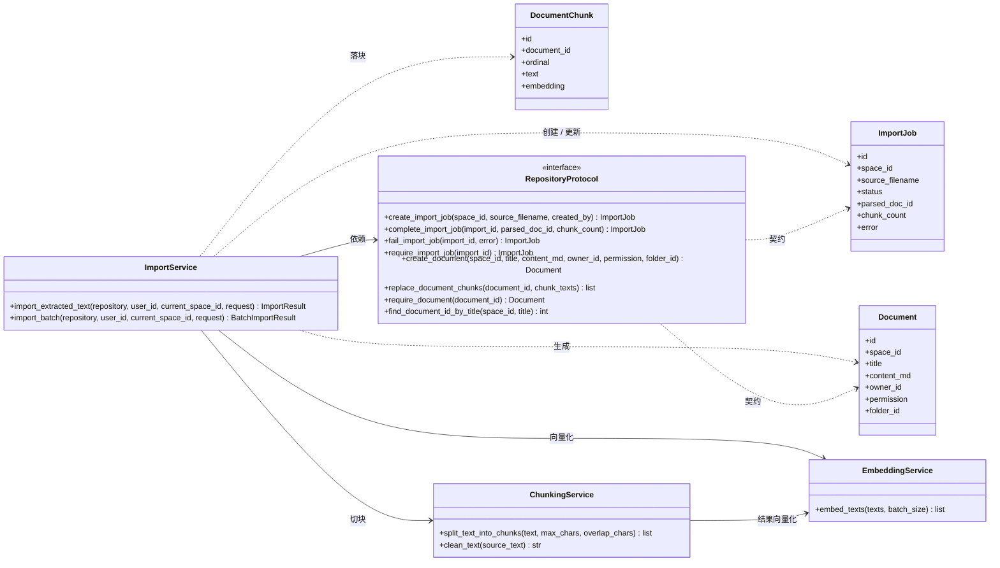
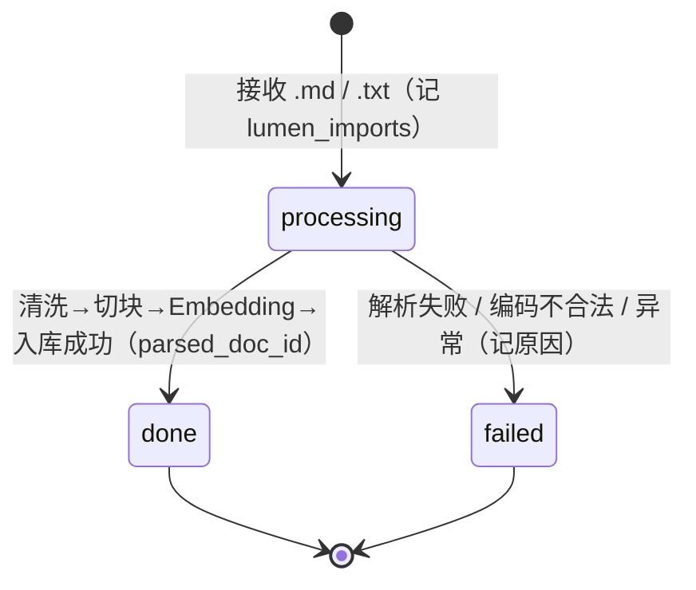
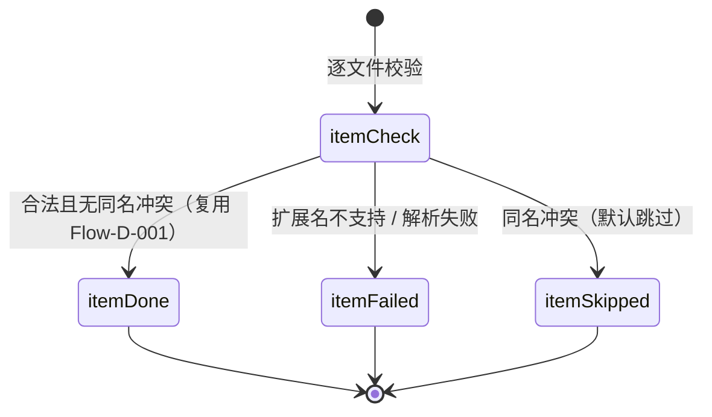
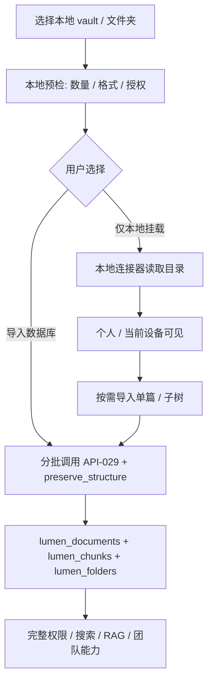

# 详细设计：内容导入子系统（ingestion）

> 对应 REQ-009（内容导入）、REQ-010（OCR 后续）与 REQ-037（批量 / 文件夹 `.md` / `.txt` 导入）。总体定位见 04；数据见 06（lumen_imports / lumen_chunks）。
> 按「完整骨架 + 阶段增量」：`[P1]` / Phase1.5A 写细，Phase1.5B / 后续骨架。

## 0. 文档元信息

| 项 | 内容 |
|---|---|
| 设计对象 | 内容导入子系统（MOD-003） |
| 文档路径 | docs/design/ingestion.md |
| 输入来源 | 02/03、04 §2 / §5.4（MOD-003 / Flow-006）、05（TCD-007、RG-002/003/007）、06（lumen_imports / lumen_chunks）、07（API-011 / API-029） |
| 覆盖 REQ | REQ-009、REQ-010、REQ-037（Phase2B folder-tree 扩展 `preserve_structure`，见 REQ-039）；REQ-018 Vault 兼容愿景 |
| 所属 Phase | [P1] + Phase1.5A 已完成；Phase1.5B / 后续 / 愿景保留骨架 |
| 交付物形态 | Demo / 个人可用 Alpha |
| 当前状态 | P1 已降级实现（`.md`/`.txt` + Embedding/pgvector 已落地；真实 Word/PDF/OCR 未实现）；Phase1.5A 批量 / 文件夹导入已完成并通过 TC-P1-015；Phase2B folder-tree 扩展 `preserve_structure=true` 已完成后端/API（task-028，真实 PG smoke 通过），前端文件管理器基础能力已由 task-029 补齐 |
| 流程 ID | Flow-D-001（单文件导入主流水线）/ Flow-006（批量 / 文件夹导入，见 §3.2）/ Flow-D-012（导入保留目录结构，Phase2B 候选，见 `docs/design/folder-tree.md`）/ Flow-D-014（Vault 兼容双模式，见 §3.3） |
| 最后更新 | 2026-08-18（Wave 3 收口：FileSystemObserver 自动重扫落地（TC-P2-VAULT-003，v3.12.0）；前次同日跨设备挂载元数据（v3.11.0））；前次 2026-08-18（对齐 design-doc 标准结构）；前次 2026-08-17（§3.4 导入任务状态机）；前次 2026-08-04（REQ-018 双模式方向确认） |
| 下游影响 | 08 Sprint-3、Sprint-16；09 TC-P1-009/010/015；07 API-011 / API-029 |

### 0.5 详细类图（DIAG-CLS-INGEST-01）

> 图纸驱动编码：内容导入子系统的类级视图（实体 + `RepositoryProtocol` 契约 + 服务层函数）。类图挂 REQ-009/010/037/018/049；方法签名以 `backend/service/imports.py`、`chunking.py`、`embedding.py` 与 `backend/repository/protocol.py` 为准。



## 1. 职责与边界

`.md` / `.txt` 文本文件 → 清洗 → 切块 → Embedding → 入库，供检索问答；Phase1.5A 扩展为多文件 / 文件夹批量导入。真实 Word/PDF 文本提取属于 Phase1.5B 候选（RG-007），OCR 属后续（RG-003）。

- **不做**：检索 / 问答（MOD-004 负责）；真实 Word/PDF 文本提取（Phase1.5B 候选，RG-007）；OCR（后续，RG-003）；录音转写入库（愿景，REQ-019）；飞书自动同步（愿景，REQ-028）。
- **权限边界**：导入写入当前空间，按空间成员校验；文档 `permission` 由导入请求指定；仅本地挂载（REQ-018 模式 B）内容默认个人 / 当前设备可见，不写入团队知识库、不进服务端 RAG / 权限链。

## 2. 上游依据与追溯

| 来源 | 章节 / ID | 本设计承接 | 下游影响 |
|---|---|---|---|
| `docs/02-srs.md` | REQ-009（内容导入）、REQ-010（OCR 后续）、REQ-037（批量 / 文件夹）、REQ-018（Vault 兼容愿景）、REQ-019/028（愿景） | 导入流水线 + 批量 + Vault 双模式 | 02 已含 |
| `docs/03-prd.md` | Phase1 / Phase1.5A、SC-005 | 导入能力范围 | 03 已含 |
| `docs/04-architecture.md` | MOD-003、Flow-006、Flow-D-001/012/014 | 子系统模块 + 流程 | 04 已含 |
| `docs/05-tech-spec.md` | TCD-007、RG-002/003/007 | 技术状态 / readiness gate | 05 已含 |
| `docs/06-db-design.md` | `lumen_imports` / `lumen_chunks` / `lumen_documents.folder_id` | 数据契约 | 06 已含 |
| `docs/07-api-spec.md` | API-011（import）/ API-029（batch，`preserve_structure`） | 接口契约 | 07 已含 |
| `docs/08-dev-plan.md` | Sprint-3 / Sprint-16 / Sprint-22 / Sprint-23A..C | 实现计划 | 08 已含 |
| `docs/09-verification.md` | TC-P1-009/010/015、TC-P2-FOLDER-001、TC-P2-VAULT-001 | 验收 | 09 已含 |

最低追溯链：`REQ-009/010/037/018 → Phase1/1.5A/2B/2C → MOD-003/Flow-D-001/006/012/014 → lumen_imports/lumen_chunks/lumen_folders → API-011/029 → Design Point → Sprint-3/16/22/23 → TC-P1-009/010/015/TC-P2-FOLDER-001/TC-P2-VAULT-001`

## 3. 核心流程 / 状态机
### 3.1 Flow-D-001：单文件导入（[P1]）

1. 接收单个 `.md` / `.txt` 文件，记 `lumen_imports(status=processing)`
2. **文本读取**：读取已提取文本；`.docx` / `.pdf` / 图片不在 P1 / P1.5A 实现范围内
3. **清洗**：去乱码 / 分页符，保留段落结构
4. **切块**：同 docs/design/rag-retrieval 的切块策略（~512 token、重叠 64）
5. **Embedding**：批量调用本机 `bge-small-zh` adapter（512 维）
6. **入库**：写 `lumen_chunks`（text / embedding / ts_vector）+ 关联 `document`
7. 更新 `lumen_imports(status=done, parsed_doc_id)`


### 3.2 Flow-006：批量 / 文件夹导入（Phase1.5A）

1. 前端通过多文件选择或 `webkitdirectory` 提交 `files[]` 与可选 `relative_paths[]` 到 API-029。
2. 后端逐文件校验扩展名，仅接受 `.md` / `.txt`；不支持格式返回该项 `failed` 或 `skipped`，不影响其他文件。
3. 标题生成 / 目录归属：Phase1.5A 使用相对路径去扩展名后的安全化标题（如 `docs/team/readme`）。**Phase2B folder-tree 扩展（FT-C-008，已实现 task-028）**：`preserve_structure=true`（默认）按 `relative_path` 路径段建/复用 `lumen_folders`（幂等）并回填 `folder_id`，文档标题只取文件名去扩展名；`=false` 只模拟目录感（标题前缀）、不创建真实 folder 表（向后兼容）。
4. 冲突处理：同名默认 `skipped` 并返回原因；P1.5A 不静默覆盖已有文档。
5. 每个成功文件复用 Flow-D-001 的读取、清洗、切块、Embedding、入库流程。
6. 响应汇总 `success_count / failed_count / skipped_count` 与逐条 `items[]`；成功项保留，失败项不回滚。

```mermaid
flowchart TB
  batch[files[] + relative_paths[]] --> validate[逐文件校验 .md / .txt]
  validate -->|合法| ps{preserve_structure?}
  validate -->|不合法| failed[items[].status=failed]
  ps -->|true 默认| folder[建/复用 lumen_folders 幂等 + folder_id]
  ps -->|false 向后兼容| title[相对路径标题前缀]
  title --> conflict{同名?}
  folder --> conflict
  conflict -->|是| skipped[items[].status=skipped]
  conflict -->|否| single[复用 Flow-D-001]
  single --> done[done + parsed_doc_id + folder_id?]
  failed --> summary[批量结果汇总]
  skipped --> summary
  done --> summary
```

### 3.3 Flow-D-014：Vault 兼容双模式（[P2]，REQ-018，Phase2C·已设计）

> 状态：Phase2C·已设计（RG-009 PoC Go 2026-08-05）；模式 B 浏览器 File System Access MVP 路线采纳；不代表当前已实现。

### 3.4 导入任务状态机（DIAG-STATE-IMPORT-01）

> 详细设计层对象状态图（对照 OO 方法论转换⑧：交互图 → 活动 / 状态图）。`lumen_imports.status` 单文件任务态；批量导入（Flow-006）的逐文件结果（`items[].status`：`done / failed / skipped`）是响应级汇总，不落 `lumen_imports`，见 §3.2。挂 REQ-009 / REQ-037；异常路径：解析失败 / 编码不合法 → `failed` 并记原因，不生成脏文档（EX-003）；同名冲突默认 `skipped` 不静默覆盖（EX-006）。



> 批量级逐文件结果（不落库，随响应返回）：


>
> 已知天花板：浏览器 File System Access 句柄只活在浏览器进程、后端读不到，仅本地挂载内容无法进服务端 RAG / 全文搜索；要进 RAG 必须 (a) 本地 agent / 桌面端增量索引 或 (b) 导入数据库（见 §3 关键决策 Vault 兼容策略）。

1. 用户在 LUMEN 选择本地 Obsidian vault / Markdown 文件夹。
2. 系统先做本地预检：文件数量、支持格式、总大小、目录层级、浏览器 / 桌面授权状态。
3. 用户选择模式：
   - **导入数据库**：复用 Flow-006 / API-029，按批次把 `.md` / `.txt` 写入 `lumen_documents`、`lumen_chunks`，并在 `preserve_structure=true` 时写入 `lumen_folders`。导入后获得完整 LUMEN 权限、搜索、RAG、标签、链接、版本与团队共享能力。
   - **仅本地挂载**：文件正文仍留在本地文件夹；默认只对当前用户 / 当前设备可见；不写入团队空间、不进入服务端 RAG / LLM、不参与团队权限链。LUMEN 前端可在本地连接器中展示目录树、打开文件、做本地索引或按需导入单篇 / 子树。
4. 左侧文件管理器视觉分区：上层“LUMEN 知识库”（数据库内容），下层“本地挂载”（个人本地来源）。两个区块用标题、图标 / 状态徽标、分隔线和不同空态文案区分；仅本地挂载条目不得伪装成团队文档。
5. 挂载内容可升级为正式知识：用户可对单篇、文件夹或整 vault 执行“导入到 LUMEN”，此时转入数据库路径并接受权限选择。



### 关键决策（[P1]）
- **OCR 引擎**：PaddleOCR 仍为后续候选，当前 RG-003 No-Go；不得阻塞 Phase1.5A
- **切块 / Embedding 参数与检索侧共用**：避免 train/serve 偏差（块大小、Embedding 维度必须一致）；Phase1 使用本机 `bge-small-zh`，写入 `vector(512)`
- **批量失败隔离**：单文件解析失败记 `status=failed` + 原因，不阻塞其他文件；同名冲突默认 `skipped`
- **目录策略**：Phase1.5A 不建真实目录表，`relative_path` 仅用于标题前缀 / API 返回 / 导入记录说明；**Phase2B folder-tree 扩展（推翻 ING-C-001，已实现 task-028）**：`preserve_structure=true` 建/复用 `lumen_folders` 保留真实目录结构，`=false` 退回标题前缀（向后兼容）
- **Vault 兼容策略**：LUMEN 数据库仍是正式知识库权威；本地 Vault 仅挂载是个人连接器，不默认共享、不默认服务端索引；用户显式选择导入后才进入 DB 权限与 RAG 链。

## 4. 数据、接口与权限契约

| 能力 / 流程 | 数据表 / 字段 | API-ID | 权限规则 | 错误码 / 边界 | 契约状态 |
|---|---|---|---|---|---|
| 单文件导入 | `lumen_imports` / `lumen_documents` / `lumen_chunks` | API-011 `POST /api/import` | 空间成员 | 同名默认 skipped（不静默覆盖） | 已实现（降级：仅 `.md`/`.txt`） |
| 批量 / 文件夹导入 | `lumen_imports` / `lumen_documents` / `lumen_chunks` / `lumen_folders` | API-029 `POST /api/import/batch` | 空间成员 | 逐文件 failed / skipped 隔离，不回滚 | 已实现（Sprint-16；`preserve_structure` task-028） |
| Vault 导入数据库（模式 A） | 同批量导入 | API-029 | 空间成员 | 同 API-029 | 已实现（Phase2B） |
| Vault 仅本地挂载（模式 B） | 浏览器 File System Access + IndexedDB 本地索引 | —（本地连接器） | 个人 / 当前设备 | 不进服务端 RAG / 权限链 | 已实现（Phase2C，Sprint-23C） |
| 跨设备挂载元数据（Wave 3） | `lumen_vault_mounts`（migration 015）：挂载上报 granted / 卸载 revoked / 登录拉取跨设备清单 | API-059 `GET/POST /api/vault-mounts` | 仅登录本人（无空间维度） | 4220 参数非法；revoked 软撤销保留行；**仅元数据**（不存句柄/路径/正文） | 已实现（2026-08-18，TC-P2-VAULT-004 通过） |
| 挂载目录自动重扫（Wave 3） | `FileSystemObserver` per-mount 观察 + 变更 1.5s 防抖合并 → 复用 `reindex` 全量重扫（不做增量 diff）；手动「重扫」按钮兜底 | —（纯前端，浏览器 API） | 个人 / 当前设备 | needs-auth 挂载不观察；无 API 浏览器静默降级；观察期随会话（RG-010-N2） | 已实现（2026-08-18，TC-P2-VAULT-003 通过，RG-010 Go） |

数据契约（权威以 06 为准）：
- **`lumen_imports`**：`id / space_id / source_filename / status（processing / done / failed）/ parsed_doc_id / chunk_count / error`（migration 004）。
- **`lumen_chunks`**：`text / embedding（vector(512)）/ ts_vector`；`replace_document_chunks` 幂等替换。
- **`lumen_documents.folder_id`**（Phase2B，migration 011）：FK→`lumen_folders`，可空（根）；`preserve_structure=false` 时 `folder_id=null`（标题前缀向后兼容）。
- **批量结果**：`success_count / failed_count / skipped_count` + `items[]`（`done / failed / skipped`），响应级汇总不落 `lumen_imports`。

权限：导入写入当前空间，按空间成员校验；文档 `permission` 由导入请求指定；仅本地挂载内容不进入团队权限链（REQ-018 模式 B）。

## 5. 失败、异常与降级路径

| 场景 | 触发条件 | 系统行为 | 用户可见信息 | 记录 / 日志 | 是否阻塞验收 | 关联 TC |
|---|---|---|---|---|---|---|
| 解析失败 / 编码不合法 | 单文件读取 / 清洗异常 | 任务 `status=failed` 并记原因，不生成脏文档 | 逐条 failed 原因 | `lumen_imports.error` | 否 | TC-P1-009 |
| 不支持格式 | 非 `.md` / `.txt` 文件 | 该项 `failed` / `skipped`，不影响其他文件 | 逐条状态 | 响应 `items[]` | 否 | TC-P1-015 |
| 同名冲突 | 同空间已存在同名文档 | 默认 `skipped` 并返回原因，不静默覆盖 | skipped + 原因 | 响应 `items[]` | 否 | TC-P1-015 |
| 批量部分失败 | 批量中部分文件失败 | 成功项保留，失败项不回滚 | 汇总计数 + 逐条结果 | 响应 `items[]` | 否 | TC-P1-015 |
| 真实 Word/PDF / OCR | 文件为 `.docx` / `.pdf` / 图片 | 不在 P1 / P1.5A 范围（降级） | 提示不支持 | 05 RG-003/007 | 否（非 P1 必过） | TC-P1-010 |
| 仅本地挂载进 RAG | 模式 B 内容请求服务端检索 | 不支持（硬天花板），须导入数据库 | 提示需导入 | 设计已声明 | 否 | TC-P2-VAULT-001 |

## 6. 阶段增量、readiness gate 与实现状态

- `[P1]` 已实现 / 降级：`.md` / `.txt` 已提取文本导入、切块、Embedding / pgvector 入库；真实 Word/PDF/OCR 不作为 P1 必过
- `Phase1.5A` 已完成：多文件 + 文件夹 `.md` / `.txt` 批量导入（REQ-037 / API-029 / TC-P1-015 通过）
- `Phase2B 第三 slice`（folder-tree，后端/API + 前端基础能力已实现）：导入保留真实目录结构（`preserve_structure` 建/复用 `lumen_folders`），扩展 REQ-037 / API-029；推翻 ING-C-001；详见 `docs/design/folder-tree.md` Flow-D-012。前端文件管理器基础能力已由 task-029 补齐。
- `Phase1.5B` 待 RG-007：真实 Word / PDF 文本提取（python-docx / pdfplumber 候选），不得阻塞 Phase1.5A
- `后续` 待 RG-003：图片 / 白板 OCR
- `[愿景]` 待验证：录音转写入库（REQ-019，转写引擎与摘要质量待验证）
- `[愿景]` 待验证：飞书自动同步（REQ-028）——外部源（飞书）文档更新后自动拉取摘要，原文留外部源，LUMEN 只更新索引条目摘要字段
- `[P2]` Phase2C·已确认（RG-009 Go 2026-08-05）：Obsidian Vault 兼容（REQ-018）模式 B 仅本地挂载浏览器 MVP 路线采纳（File System Access + IndexedDB）；模式 A 导入数据库已随 Phase2B 实现；仅本地挂载保持个人 / 当前设备边界。

readiness gate：

| 能力 | 当前状态 | 解锁条件 | 验证证据 | 降级路径 | 是否阻塞 Sprint / Phase |
|---|---|---|---|---|---|
| `.md` / `.txt` 文本导入 | 已实现（P1 降级基线） | — | TC-P1-009 | — | 否 |
| 批量 / 文件夹导入 | 已实现（Phase1.5A） | — | TC-P1-015 | 逐文件失败隔离 | 否 |
| 导入保留目录结构 | 已实现（Phase2B，task-028） | folder-tree 立项（REQ-039） | TC-P2-FOLDER-001 | `preserve_structure=false` 标题前缀 | 否 |
| Vault 模式 B 本地挂载 | Phase2C 已设计（RG-009 PoC Go） | 浏览器 FSA + IndexedDB 路线 | TC-P2-VAULT-001 | 仅浏览 / 按需导入 | 否 |
| 跨设备挂载元数据 | **已实现（Wave 3，2026-08-18）** | 账户体系（Sprint-26 已完成）+ migration 015 | TC-P2-VAULT-004 | 同步失败不阻塞本地挂载（console.warn 降级） | 否 |
| 挂载目录自动重扫 | **已实现（Wave 3，2026-08-18）** | RG-010 Go（Edge 139 实测）；Chromium 系浏览器 | TC-P2-VAULT-003 | 无 FileSystemObserver / observe 失败 → 手动重扫兜底 | 否 |
| 真实 Word/PDF 提取 | 后续（RG-007 待评估） | Phase1.5B 立项 | — | 维持 `.md` / `.txt` | 否 |
| OCR（REQ-010） | 后续（RG-003 No-Go） | 立项 | — | 维持降级 | 否 |

## 7. 验证与验收追溯

| 设计点 | 关联 REQ | 关联 Sprint | 关联 TC | 验证方式 | 状态 |
|---|---|---|---|---|---|
| 文本导入可检索 | REQ-009 | Sprint-3 | TC-P1-009 | `tests/backend/test_imports.py` | 条件通过（仅 `.md`/`.txt`） |
| 图片 OCR 导入 | REQ-010 | Sprint-3 | TC-P1-010 | — | 后续阶段（OCR 未实现） |
| Flow-D-001 导入主流水线 | REQ-009/010 | Sprint-3 | TC-P1-009/010 | 见上 | 降级实现 |
| Flow-006 批量 / 文件夹导入 | REQ-037 | Sprint-16 | TC-P1-015 | 后端 tests + Chrome headless drop-zone smoke 已通过 | Phase1.5A-已实现 |
| Flow-D-012 导入保留目录结构（folder-tree） | REQ-037/039 | Sprint-22 | TC-P2-FOLDER-001 + TC-P1-015 扩展 | `tests.backend.test_imports` / `test_import_api` + 临时 PG smoke：`preserve_structure` 建/复用 `lumen_folders` | Phase2B 第三 slice·后端/API 已实现；前端文件管理器待实现 |
| Flow-D-014 Vault 兼容双模式 | REQ-018 | Phase2C | TC-P2-VAULT-001 | 浏览器 File System Access 授权 + IndexedDB 本地索引 + 1000+ 文件本地树 / 按需导入 smoke（RG-009 PoC Go 2026-08-05） | Phase2C·已完成（Sprint-23C TC-P2-VAULT-001 通过 / PR#108 v2.0.0） |
| Flow-D-014 增强·跨设备挂载元数据 | REQ-018 | Wave 3 | TC-P2-VAULT-004 | `tests/backend/test_vault_mounts.py`（10 用例）+ 真实 PG migration 015 + API smoke + `scripts/smoke-vault-mounts-browser.mjs`（设备 B 侧可见 + revoked 过滤） | Wave 3·已完成（2026-08-18，v3.11.0，migration 015 + API-059；本机挂载即上报留用户人工可选验收） |
| Flow-D-014 增强·挂载目录自动重扫 | REQ-018 | Wave 3 | TC-P2-VAULT-003 | lint/build/file-size/css + CDP 冒烟（observerSupported + 重扫按钮显隐 + 无运行时错误）；真实挂载变更→自动刷新留用户人工 smoke（RG-010-N1） | Wave 3·已完成（2026-08-18，v3.12.0，useVaultAutoRescan + 手动重扫按钮；Wave 3 收口） |

## 8. 与其他子系统交互

| 方向 | 子系统 | 交互 | 契约 | 风险 |
|---|---|---|---|---|
| 影响 | `rag-retrieval` | 供 `lumen_chunks` 检索 | 06 `lumen_chunks` | 低 |
| 改造 | `folder-tree`（Flow-D-012） | 导入保留目录结构（建 / 复用 `lumen_folders`） | API-029 / 06 `lumen_folders` | 中（向后兼容） |
| 影响 | `frontend-interaction` | Sprint-16 drop zone、多文件 / 文件夹选择、批量进度与逐条结果 UI | 前端交互设计 | 低 |
| 被调用 | `07 /api/import`、`/api/import/batch` | 导入入口 | API-011 / API-029 | 低 |
| 写 | `06 lumen_imports` / `lumen_chunks` / `lumen_folders` | 数据契约 | 06 | 低 |

## 9. 实现偏差 / 设计回写

> 对照 `ai/doc-standards/design-doc.md` §4.10。仅记录已实现的降级事实，不推测目标。

| 偏差 ID | 代码 / 配置事实 | 原设计 | 偏差类型 | 处理结论 | 回写目标 | 验证 / 证据 |
|---|---|---|---|---|---|---|
| DEV-001 | `backend/service/imports.py` 仅支持 `.md`/`.txt` 已提取文本 | .docx / .pdf / 图片三路解析 | Mock/降级 | Phase1 接受降级基线；真实 Word/PDF 文本提取移 Phase1.5B（RG-007）；OCR 后续（RG-003） | 06 lumen_imports、05 RG-003/RG-007 | TC-P1-009 |
| DEV-002 | 未接入 PaddleOCR；无 OCR | 图片 → PaddleOCR 中文 OCR | 后续阶段 | REQ-010 移出 P1 / P1.5A 必过 | 05 RG-003、09 §6 | TC-P1-010 |
| DEV-003 | ~~未接入 `bge-small-zh`；`lumen_chunks` 无向量落地~~ → **已实现（Sprint-8 T6）**：`pg_repository.replace_document_chunks` 写 `lumen_chunks.embedding`（bge-small-zh 512 维 float32） | 切块 → bge-small-zh 512 维 → embedding/ts_vector | 已实现 | 向量已落地 PG；ts_vector（zhparser 中文分词）留后续。DEV-001（真实 PDF/Word）/ DEV-002（OCR）仍降级 | 06 lumen_chunks、05 RG-001/002 | TC-P1-009 |
| DEV-004 | API-029 / 批量导入已实现 | Flow-006 批量 / 文件夹导入 | 已完成 | Sprint-16 已按不新增真实目录表、不引新依赖完成 | 07 API-029、06 REQ-037 | TC-P1-015 通过 |
| DEV-005 | **已实现（2026-08-03，task-028）**：folder-tree 接入后 API-029 `preserve_structure=true` 建/复用 `lumen_folders` 并回填 `lumen_documents.folder_id` | Flow-006 / API-029 原设计"不建真实目录表" | 已实现 | **推翻 ING-C-001**：Phase1.5A 结论维持（P1.5A 不建表），Phase2B 第三 slice（folder-tree）起允许建 `lumen_folders`；`preserve_structure=false` 保留标题前缀向后兼容 | 06 lumen_folders/folder_id、07 API-029/API-034..037、design/folder-tree Flow-D-012 | TC-P2-FOLDER-001（后端/API 通过；前端文件管理器待 slice 3） |

## 10. 待人工确认项
| ID | 待确认项 | AI 建议 | 建议依据 | 备选方案 | 取舍影响 / 阻塞关系 |
|---|---|---|---|---|---|
| ING-C-001 | Sprint-16 是否允许新增真实目录表 | ~~不允许；只用标题前缀模拟目录感~~ **已被 folder-tree 设计推翻（Phase2B 第三 slice，2026-08-02）** | P1.5A 结论不变（04/05/06/07 约束 P1.5A 不新增表）；Phase2B folder-tree 已回填 06/07/02/03/08/09 | 新建 folder 表（Phase2B 已采纳，REQ-039） | P1.5A 不受影响；Phase2B `preserve_structure` 扩展见 DEV-005 / `docs/design/folder-tree.md` |
| ING-C-002 | 同名冲突默认策略 | 默认 skipped 并逐条提示 | 用户目标是快速入库，避免静默覆盖 | 覆盖 / 自动重命名 | 覆盖有数据风险；自动重命名会影响搜索标题一致性 |
| ING-C-003 | 真实 Word/PDF 解析是否提前 | 不提前；放 Phase1.5B + RG-007 | 05 已声明不阻塞 P1.5A | 与 Sprint-16 同做 | 会引依赖与隐私验证风险 |
