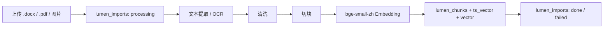

# 详细设计：内容导入子系统（ingestion）

> 对应 REQ-009（Word / PDF）/ REQ-010（OCR）。总体定位见 04；数据见 06（lumen_imports / lumen_chunks）。
> 按「完整骨架 + 阶段增量」：`[P1]` 写细，`[愿景]` 骨架。

## 1. 职责

异构文件 → 纯文本 → 切块 → Embedding → 入库，供检索问答。

## 2. 流程（[P1]）

1. 接收文件（.docx / .pdf / 图片），记 `lumen_imports(status=processing)`
2. **文本提取**：.docx → python-docx；.pdf → pdfplumber；图片 → PaddleOCR（中文）
3. **清洗**：去乱码 / 分页符，保留段落结构
4. **切块**：同 docs/design/rag-retrieval 的切块策略（~512 token、重叠 64）
5. **Embedding**：批量调用本机 `bge-small-zh` adapter（512 维）
6. **入库**：写 `lumen_chunks`（text / embedding / ts_vector）+ 关联 `document`
7. 更新 `lumen_imports(status=done, parsed_doc_id)`

## 3. 关键决策

- **OCR 引擎**：建议 PaddleOCR（中文友好），待 05 确认
- **切块 / Embedding 参数与检索侧共用**：避免 train/serve 偏差（块大小、Embedding 维度必须一致）；Phase1 使用本机 `bge-small-zh`，写入 `vector(512)`
- **失败处理**：单文件解析失败记 `status=failed` + 原因，不阻塞其他文件

## 4. 阶段增量

- `[P1]` 已设计：Word / PDF / 图片三路
- `[愿景]` 待验证：录音转写入库（REQ-019，转写引擎与摘要质量待验证）
- `[愿景]` 待验证：飞书自动同步（REQ-028）——外部源（飞书）文档更新后自动拉取摘要，原文留外部源，LUMEN 只更新索引条目摘要字段

## 5. 与其他子系统交互

- **为** docs/design/rag-retrieval 供 `lumen_chunks`
- **被** 07 `/api/import` 调用
- **写** 06 lumen_imports / lumen_chunks
