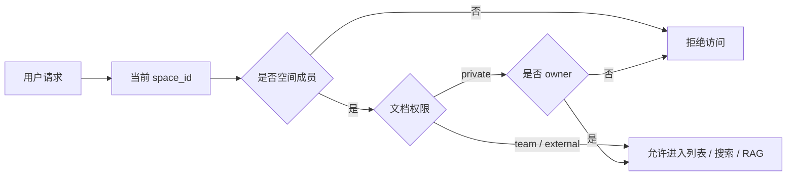

# 详细设计：空间与权限子系统（permissions）

> 对应 REQ-001 / 002 / 003。总体定位见 04；数据见 06（lumen_spaces / members / documents.permission）。
> 按「完整骨架 + 阶段增量」：`[P1]` 写细，`[P2]` 骨架。

## 0. 文档元信息

| 项 | 内容 |
|---|---|
| 设计对象 | 空间与权限子系统（MOD-001） |
| 文档路径 | docs/design/permissions.md |
| 输入来源 | 02/03、04 §2/§5（Flow-002）、06（lumen_spaces / members / documents.permission）、07（API-001..013 入口校验） |
| 覆盖 REQ | REQ-001、REQ-002、REQ-003 |
| 所属 Phase | [P1] |
| 交付物形态 | Demo |
| 当前状态 | P1-已设计；权限逻辑已实现（内存），存储层为降级（见 §6） |
| 流程 ID | Flow-D-002（权限过滤决策流，见 §2） |
| 最后更新 | 2026-07-09 |
| 下游影响 | 08 Sprint-1、09 TC-P1-001/002/003 |

## 1. 模型

- **空间（space）**：隔离边界，成员关系在 `lumen_space_members`
- **文档权限（permission）**：`private`（仅作者）/ `team`（空间内可见）/ `external`（外部只读；P1 支持字段存在，对外发布走 P2）
- **隔离原则**：任何查询 / 检索 / 问答先按 `space_id` 收敛，再按 `permission` 过滤

## 2. 过滤点（[P1]，三处统一）

权限过滤下沉到 SQL / 检索层，不依赖应用层记忆（防漏过滤）：

1. **列表 / CRUD**：`WHERE space_id=? AND (permission<>'private' OR owner_id=current_user)`
2. **全文搜索**：`ts_vector` 检索 + 同上过滤
3. **RAG**：候选块生成时只取可见文档的 `lumen_chunks`

## 3. 关键决策

- **过滤下沉**：权限条件进 SQL / 检索 where 子句，不在应用层事后裁剪
- **私有文档是否入索引**：P1 决策——仍入 `lumen_chunks` 索引，但检索时按 `owner_id` 过滤（实现简单）；P2 可评估"私有不入索引"以更强隔离
- **空间切换**：切换即换 session 当前 `space_id`，后续所有操作以此为上下文（REQ-002）

## 4. 阶段增量

- `[P1]` 已设计：隔离 + 三级权限 + 三处过滤
- `[P2]` 待细化：跨空间推送的只读副本权限同步（REQ-015）

## 5. 与其他子系统交互

- **被** docs/design/rag-retrieval、文档 / 搜索 service 调用做过滤
- **被** 07 各接口在入口校验（鉴权 + 空间 + 文档权限）

## 6. 实现偏差 / 设计回写

> 对照 `ai/doc-standards/design-doc.md` §4.10。仅记录已实现的降级事实。

| 偏差 ID | 代码 / 配置事实 | 原设计 | 偏差类型 | 处理结论 | 回写目标 | 验证 / 证据 |
|---|---|---|---|---|---|---|
| DEV-001 | 权限过滤逻辑在 Python service 层（`backend/service/permission.py`：is_space_member / can_view_document / filter_visible_documents）；存储已切 PG（`PgRepository`，Sprint-8） | SQL where 子句过滤（`visible_document_where_clause` 目标设计） | 部分实现 | 过滤逻辑等价已验证；存储已落地 PostgreSQL，可见文档集在 recall 时以 `document_id IN (...)` 下推 SQL。`visible_document_where_clause` 的纯 SQL 下推留作未来优化（正确性等价） | 06、05 RG-001 | TC-P1-001/003 |

## 7. 验收追溯

| 设计点 | 关联 REQ | 关联 Sprint | 关联 TC | 验证方式 | 状态 |
|---|---|---|---|---|---|
| 跨空间隔离 | REQ-001 | Sprint-1 | TC-P1-001 | `tests/backend/test_permission.py`、`test_space.py` | 条件通过（内存） |
| 空间切换 | REQ-002 | Sprint-1 | TC-P1-002 | `tests/backend/test_space.py`、`test_api_routes.py` | 条件通过 |
| 私有文档对他人不可见 | REQ-003 | Sprint-1 | TC-P1-003 | `tests/backend/test_permission.py` | 条件通过 |
| Flow-D-002 权限过滤决策流 | REQ-001/002/003 | Sprint-1 | TC-P1-001/002/003 | 见上 | 降级实现（逻辑等价） |
