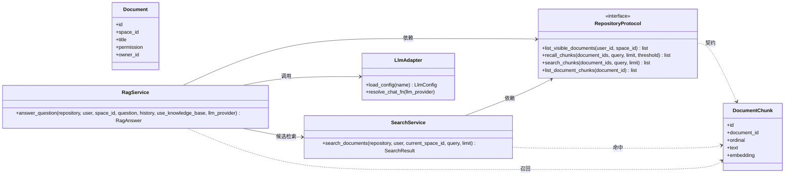
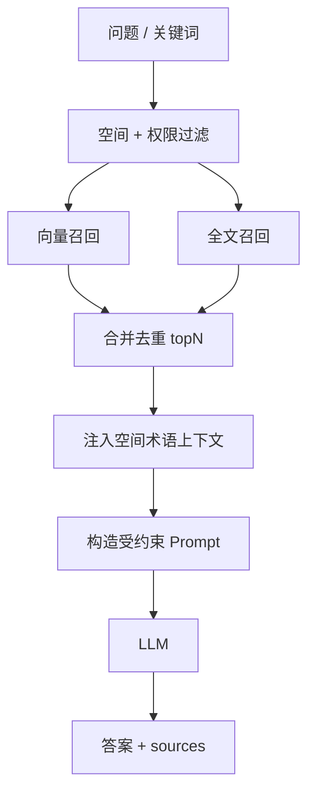

# 详细设计：检索问答子系统（rag-retrieval）

> 子系统内部逻辑详细设计。总体定位见 04；数据见 06（lumen_chunks）；接口见 07（/api/search、/api/query）。
> 按「完整骨架 + 阶段增量」：`[P1]` 写细，`[P2]` / `[愿景]` 骨架。
> 对应需求：REQ-007（搜索）/ REQ-008（RAG）。

## 0. 文档元信息

| 项 | 内容 |
|---|---|
| 设计对象 | 检索问答子系统（MOD-004） |
| 文档路径 | docs/design/rag-retrieval.md |
| 输入来源 | 02/03、04 §2/§5（Flow-002）、05（RG-001/002/004）、06（lumen_chunks）、07（API-009 / API-010） |
| 覆盖 REQ | REQ-007、REQ-008 |
| 所属 Phase | [P1] |
| 交付物形态 | Demo |
| 当前状态 | P1-已实现（Sprint-7/8 + task-009）：RAG 走真实 LLM（GLM-5.2）+ 向量召回（pgvector ANN，加法式叠加关键词，threshold 0.6）；search 已升级为 substring + `ts_vector` SQL 候选 + pgvector 语义召回的 hybrid 搜索。`zhparser` 可选，当前镜像无扩展时回退 `simple`。见 §6/§7/§8/§9 |
| 流程 ID | Flow-D-003（全文搜索）/ Flow-D-004（RAG 问答），见 §3 |
| 最后更新 | 2026-08-18（对齐 design-doc 标准结构：新增 §2 上游依据与追溯 / §4 数据、接口与权限契约 / §6 阶段增量与 readiness gate / §10 待人工确认项，章节按标准重排）；前次 2026-07-10 |
| 下游影响 | 08 Sprint-4、09 TC-P1-007/008 |

### 0.5 详细类图（DIAG-CLS-RAG-01）

> 图纸驱动编码：检索问答子系统的类级视图（实体 + `RepositoryProtocol` 契约 + 服务层函数）。类图挂 REQ-007/008；方法签名以 `backend/service/rag.py`、`search.py`、`llm_adapter.py` 与 `backend/repository/protocol.py` 为准。

## 1. 职责与边界
- **输入**：用户问题 / 关键词 + 当前空间 + 用户权限
- **输出**：搜索结果列表 / 问答答案 + 来源文档引用
- **不做**：跨空间检索、越权内容、库外编造

## 2. 上游依据与追溯

| 来源 | 章节 / ID | 本设计承接 | 下游影响 |
|---|---|---|---|
| `docs/02-srs.md` | REQ-007（搜索）、REQ-008（RAG 问答） | 全文搜索 + RAG 问答（带来源引用，库外不编造） | 02 已含 |
| `docs/03-prd.md` | Phase1 / SC-004 | 检索问答能力范围 | 03 已含 |
| `docs/04-architecture.md` | MOD-004、Flow-002 / Flow-D-003 / Flow-D-004 | 子系统模块 + 流程 | 04 已含 |
| `docs/05-tech-spec.md` | RG-001/002/004 | 向量召回 / 全文检索 / LLM 真实化技术状态 | 05 已含 |
| `docs/06-db-design.md` | `lumen_chunks`（text / embedding / ts_vector） | 数据契约 | 06 已含 |
| `docs/07-api-spec.md` | API-009（search）/ API-010（query） | 接口契约 | 07 已含 |
| `docs/08-dev-plan.md` | Sprint-4 / Sprint-7 / Sprint-8 / task-009 | 实现计划 | 08 已含 |
| `docs/09-verification.md` | TC-P1-007 / TC-P1-008 | 验收 | 09 已含 |

最低追溯链：`REQ-007/008 → Phase1 → MOD-004/Flow-D-003/004 → lumen_chunks → API-009/010 → Design Point → Sprint-4/7/8 → TC-P1-007/008`

## 3. 核心流程 / 状态机
**全文搜索（/api/search）**
1. 权限收敛：据 `space_id` + 用户角色 + 文档 `permission`，得到"可检索文档集"
2. 关键词 → ts_query → `lumen_chunks.ts_vector` 命中（关键词召回）
3. 返回命中文档的标题 / 片段 / 定位

**RAG 问答（/api/query）**
1. 权限收敛（同上，与 docs/design/permissions 共用过滤）
2. **向量检索**：问题 → Embedding → `lumen_chunks.embedding` 近邻 topK
3. **全文检索**：问题关键词 → `ts_vector` 命中
4. 合并去重 → 取 topN 候选块
5. 术语上下文：按当前空间加载 `lumen_terms`，命中问题或候选块中的术语时注入定义（空间术语优先，详见 docs/design/term-management）
6. 构造 Prompt：候选块 + 术语上下文 + 问题 → LLM，要求"仅依据给定内容回答、标注来源；无依据则告知未找到"
7. 返回 `answer` + `sources[]`

### 关键决策（[P1]）
- **切块**：按段落 / 固定长度（参数待 05 定，初值 ~512 token、重叠 ~64），与 docs/design/ingestion 共用
- **Embedding**：本机 `bge-small-zh`，512 维，写入 `lumen_chunks.embedding`（`vector(512)`）；后续可通过 adapter 迁移到内网 Embedding 服务
- **检索**：向量 + 全文双路召回再合并（P1 即做基础版，不调权重）
- **术语口径**：RAG 回答优先采用当前空间术语定义；术语来源作为回答来源之一，但不得替代文档证据编造答案
- **来源标注**：LLM 输出引用候选块序号 → 映射回 `doc_id` + `snippet`

## 4. 数据、接口与权限契约

| 能力 / 流程 | 数据表 / 字段 | API-ID | 权限规则 | 错误码 / 边界 | 契约状态 |
|---|---|---|---|---|---|
| 全文搜索 | `lumen_chunks.ts_vector` + `lumen_documents` | API-009 `GET /api/search` | 空间成员 + 文档 `permission` 过滤 | 无候选 → 空结果 | 已实现（Sprint-4 + Sprint-8 + task-009） |
| RAG 问答 | `lumen_chunks.embedding`（vector(512)）+ `lumen_terms` | API-010 `POST /api/query` | 空间成员 + 文档 `permission` 过滤 | 无候选 → 不调 LLM 编造 | 已实现（Sprint-7 LLM + Sprint-8 向量） |

数据契约（权威以 06 为准）：
- **`lumen_chunks`**：`text`（切块文本）/ `embedding`（`vector(512)`，bge-small-zh）/ `ts_vector`（关键词索引；zhparser 可选，无扩展回退 `simple`）。
- **切块参数**：~512 token、重叠 ~64（与 docs/design/ingestion 共用，避免 train/serve 偏差）。
- **检索门控**：向量召回 threshold 0.6（防库外编造红线）。
- **术语注入**：读取 `lumen_terms` 空间优先（详见 docs/design/term-management）。

权限：检索 / 问答一律先按 `space_id` + 用户角色 + 文档 `permission` 收敛可见文档集（复用 docs/design/permissions 过滤）；不跨空间检索、不泄露越权内容。

## 5. 失败、异常与降级路径

| 场景 | 触发条件 | 系统行为 | 用户可见信息 | 记录 / 日志 | 是否阻塞验收 | 关联 TC |
|---|---|---|---|---|---|---|
| 无候选块 | 问题 / 关键词在可见文档集无命中或向量 threshold < 0.6 | 直接回复「未在当前空间知识库找到」，不调 LLM 编造 | 未找到提示 | 无（正常路径） | 否 | TC-P1-008 |
| 候选块跨文档矛盾 | 多个候选块结论冲突 | 答案点明分歧并分别引用 | 分歧说明 + 引用 | 无 | 否 | TC-P1-008 |
| LLM 超时 / 失败 | LLM 通道超时 / 异常 | 降级：返回候选块原文摘要 + 来源 | 摘要 + 来源 | 记失败原因（不静默） | 否 | TC-P1-008 |
| Embedding 不可用 | 本机 embedding 服务 / 模型异常 | 检索侧按错误返回，不伪造结果 | 错误提示 | 记失败原因 | 否 | TC-P1-007 |

## 6. 阶段增量、readiness gate 与实现状态

- `[P1]` 已设计：上述流程（基础向量 + 全文，不重排）
- `[P2]` 待细化：重排序模型、混合检索权重调优、查询改写（REQ-014 相关）
- `[愿景]` 待验证：跨文档因果推理（REQ-021，高风险，不承诺）

readiness gate：

| 能力 | 当前状态 | 解锁条件 | 验证证据 | 降级路径 | 是否阻塞 Sprint / Phase |
|---|---|---|---|---|---|
| 真实 LLM 问答 | 已实现（GLM-5.2，RG-004 Go） | RG-004 通过 | TC-P1-008 + GLM-5.2 真实问答 | mock LLM 可切 | 否 |
| 向量召回 | 已实现（pgvector ANN，RG-001/002 Go） | bge-small-zh + pgvector | TC-P1-008 + PG 集成测试 | 关键词 / `ts_vector` 召回兜底 | 否 |
| zhparser 中文分词 | 可选（镜像无扩展时回退 `simple`） | 镜像安装扩展后启用 | task-009 验证 | `simple` 分词 | 否 |
| [P2] 重排 / 权重调优 | 待细化 | 立项后 RG | — | 维持基础双路召回 | 否 |

## 7. 验证与验收追溯

| 设计点 | 关联 REQ | 关联 Sprint | 关联 TC | 验证方式 | 状态 |
|---|---|---|---|---|---|
| 全文搜索 | REQ-007 | Sprint-4（+ Sprint-8 PG 落地 + task-009 search 向量化） | TC-P1-007 | `tests/backend/test_search.py`（+ `test_api_routes.py` PG 语义搜索） | 条件通过（hybrid：关键词 / ts_vector / pgvector） |
| RAG 问答带来源 | REQ-008 | Sprint-4（+ Sprint-7 LLM / Sprint-8 向量） | TC-P1-008 | `tests/backend/test_rag.py`（+ PG 集成）+ GLM-5.2 真实问答 | 通过（真实 LLM + 向量召回） |
| 库外不编造 | REQ-008 | Sprint-4（+ Sprint-8 threshold 门控） | TC-P1-008 | `tests/backend/test_rag.py` | 通过（向量 threshold 0.6 保红线） |
| Flow-D-003 搜索 / Flow-D-004 RAG | REQ-007/008 | Sprint-4 / 7 / 8 / task-009 | TC-P1-007/008 | 见上 | RAG 与 search 均已接入向量召回；zhparser 可选 |

## 8. 与其他子系统交互

| 方向 | 子系统 | 交互 | 契约 | 风险 |
|---|---|---|---|---|
| 依赖 | `permissions` | 空间 + 文档权限过滤 | `lumen_documents.permission` | 低 |
| 依赖 | `ingestion` | `lumen_chunks` 由导入流水线生成 | 06 `lumen_chunks` | 低 |
| 依赖 | `term-management` | 问答术语上下文注入（空间优先） | `lumen_terms` | 低 |
| 被调用 | `ai-assistant` | 复用检索 / RAG（citation 模式仅复用检索） | API-009/010 | 低 |
| 被调用 | `ai-polish` | 复用 RAG 检索（Flow-D-004） | API-010 | 低 |
| 被调用 | `intelligence-analysis` | 证据搜集 / 路径检索复用检索能力 | API-009/010 | 低 |

## 9. 实现偏差 / 设计回写

> 对照 `ai/doc-standards/design-doc.md` §4.10。仅记录已实现的降级事实。

| 偏差 ID | 代码 / 配置事实 | 原设计 | 偏差类型 | 处理结论 | 回写目标 | 验证 / 证据 |
|---|---|---|---|---|---|---|
| DEV-001 | `backend/service/search.py` hybrid search：substring / title + `PgRepository.search_chunks` (`ts_vector`) + `recall_chunks` (pgvector)；`demo_repository` 保留 fake 降级 | ts_vector 全文检索 + 向量近邻 | 已实现（task-009） | search 向量化已接入；zhparser 作为可选扩展，当前 pgvector 镜像无扩展时回退 `simple`，不作为硬依赖 | 06 lumen_chunks、05 RG-001/002 | TC-P1-007 |
| DEV-002 | `backend/service/rag.py` 接入 `llm_adapter`（Sprint-7）；GLM-5.2 真实问答已验证 | 候选块 + 术语 → LLM 生成 | 已实现（GLM-5.2 验证） | 默认 mock 降级可切；GPT/ollama 待验证 | 07 API-010、05 RG-004 | TC-P1-008 |
| DEV-003 | ~~无向量检索（embedding 未生成）~~ → **已实现（Sprint-8 T6）**：`pg_repository.recall_chunks` pgvector ANN + `replace_document_chunks` 写 embedding | 问题 → Embedding → `lumen_chunks.embedding` 近邻 topK | 已实现 | 向量召回已上线（bge-small-zh 512 维 float32，加法式叠加关键词，threshold 0.6）；RG-001/002 Go | 06 lumen_chunks、05 RG-001/002 | TC-P1-008 |

## 10. 待人工确认项

| ID | 待确认项 | AI 建议 | 建议依据 | 备选方案 | 取舍影响 / 阻塞关系 |
|---|---|---|---|---|---|
| RAG-C-001 | [P2] 重排 / 混合权重调优是否立项 | 维持待细化，立项时评估 | 基础双路召回已满足 P1 验收（TC-P1-007/008） | 立即实现 | 非阻塞维护态 |
| RAG-C-002 | zhparser 是否作为硬依赖启用 | 保持可选（无扩展回退 `simple`） | 避免镜像缺扩展造成硬依赖 | 装扩展后启用 | 非阻塞 |
