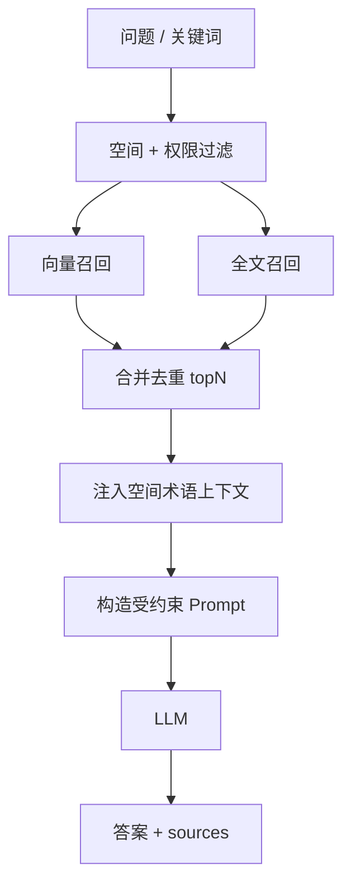

# 详细设计：检索问答子系统（rag-retrieval）

> 子系统内部逻辑详细设计。总体定位见 04；数据见 06（lumen_chunks）；接口见 07（/api/search、/api/query）。
> 按「完整骨架 + 阶段增量」：`[P1]` 写细，`[P2]` / `[愿景]` 骨架。
> 对应需求：REQ-007（搜索）/ REQ-008（RAG）。

## 0. 文档元信息

| 项 | 内容 |
|---|---|
| 设计对象 | 检索问答子系统（MOD-004） |
| 文档路径 | docs/design/rag-retrieval.md |
| 输入来源 | 02/03、04 §2/§5（Flow-002）、05（RG-001/002/004）、06（lumen_chunks）、07（API-009 / API-010） |
| 覆盖 REQ | REQ-007、REQ-008 |
| 所属 Phase | [P1] |
| 交付物形态 | Demo |
| 当前状态 | P1-已设计；实现为降级（内存关键词检索；RAG 不调 LLM，见 §6） |
| 流程 ID | Flow-D-003（全文搜索）/ Flow-D-004（RAG 问答），见 §2 |
| 最后更新 | 2026-07-09 |
| 下游影响 | 08 Sprint-4、09 TC-P1-007/008 |

## 1. 职责与边界

- **输入**：用户问题 / 关键词 + 当前空间 + 用户权限
- **输出**：搜索结果列表 / 问答答案 + 来源文档引用
- **不做**：跨空间检索、越权内容、库外编造

## 2. 核心流程（[P1]）

**全文搜索（/api/search）**
1. 权限收敛：据 `space_id` + 用户角色 + 文档 `permission`，得到"可检索文档集"
2. 关键词 → ts_query → `lumen_chunks.ts_vector` 命中（关键词召回）
3. 返回命中文档的标题 / 片段 / 定位

**RAG 问答（/api/query）**
1. 权限收敛（同上，与 docs/design/permissions 共用过滤）
2. **向量检索**：问题 → Embedding → `lumen_chunks.embedding` 近邻 topK
3. **全文检索**：问题关键词 → `ts_vector` 命中
4. 合并去重 → 取 topN 候选块
5. 术语上下文：按当前空间加载 `lumen_terms`，命中问题或候选块中的术语时注入定义（空间术语优先，详见 docs/design/term-management）
6. 构造 Prompt：候选块 + 术语上下文 + 问题 → LLM，要求"仅依据给定内容回答、标注来源；无依据则告知未找到"
7. 返回 `answer` + `sources[]`

## 3. 关键决策（[P1]）

- **切块**：按段落 / 固定长度（参数待 05 定，初值 ~512 token、重叠 ~64），与 docs/design/ingestion 共用
- **Embedding**：本机 `bge-small-zh`，512 维，写入 `lumen_chunks.embedding`（`vector(512)`）；后续可通过 adapter 迁移到内网 Embedding 服务
- **检索**：向量 + 全文双路召回再合并（P1 即做基础版，不调权重）
- **术语口径**：RAG 回答优先采用当前空间术语定义；术语来源作为回答来源之一，但不得替代文档证据编造答案
- **来源标注**：LLM 输出引用候选块序号 → 映射回 `doc_id` + `snippet`

## 4. 失败 / 边界

- **无候选块** → 直接回复"未在当前空间知识库找到"，不调 LLM 编造
- **候选块跨多文档矛盾** → 答案点明分歧并分别引用
- **LLM 超时 / 失败** → 降级：返回候选块原文摘要 + 来源

## 5. 阶段增量

- `[P1]` 已设计：上述流程（基础向量 + 全文，不重排）
- `[P2]` 待细化：重排序模型、混合检索权重调优、查询改写（REQ-014 相关）
- `[愿景]` 待验证：跨文档因果推理（REQ-021，高风险，不承诺）

## 6. 与其他子系统交互

- **依赖** docs/design/permissions：权限过滤
- **依赖** docs/design/ingestion：`lumen_chunks` 由导入流水线生成
- **依赖** docs/design/term-management：问答术语上下文注入
- **被** 07 `/api/search`、`/api/query` 调用

## 7. 实现偏差 / 设计回写

> 对照 `ai/doc-standards/design-doc.md` §4.10。仅记录已实现的降级事实。

| 偏差 ID | 代码 / 配置事实 | 原设计 | 偏差类型 | 处理结论 | 回写目标 | 验证 / 证据 |
|---|---|---|---|---|---|---|
| DEV-001 | `backend/service/search.py` 内存关键词匹配（`_chunk_matches` / `_title_matches`） | ts_vector 全文检索 + 向量近邻 | Mock/降级 | 内存关键词检索；pgvector/Embedding 真实化移 Phase2 | 06 lumen_chunks、05 RG-001/002 | TC-P1-007 |
| DEV-002 | `backend/service/rag.py` 不调 LLM（`_build_degraded_answer` / `_build_term_only_answer`） | 候选块 + 术语 → LLM 生成 | Mock/降级 | RAG 返回检索结果 + 模板（不调 LLM）；真实 LLM 移 Phase2 | 07 API-010、05 RG-004 | TC-P1-008 |
| DEV-003 | 无向量检索（embedding 未生成） | 问题 → Embedding → `lumen_chunks.embedding` 近邻 topK | Mock/降级 | 向量召回未实现；当前仅关键词 | 06 lumen_chunks、05 RG-002 | TC-P1-008 |

## 8. 验收追溯

| 设计点 | 关联 REQ | 关联 Sprint | 关联 TC | 验证方式 | 状态 |
|---|---|---|---|---|---|
| 全文搜索 | REQ-007 | Sprint-4 | TC-P1-007 | `tests/backend/test_search.py` | 条件通过（内存关键词） |
| RAG 问答带来源 | REQ-008 | Sprint-4 | TC-P1-008 | `tests/backend/test_rag.py` | 条件通过（不调 LLM） |
| 库外不编造 | REQ-008 | Sprint-4 | TC-P1-008 | `tests/backend/test_rag.py` | 条件通过 |
| Flow-D-003 搜索 / Flow-D-004 RAG | REQ-007/008 | Sprint-4 | TC-P1-007/008 | 见上 | 降级实现 |
