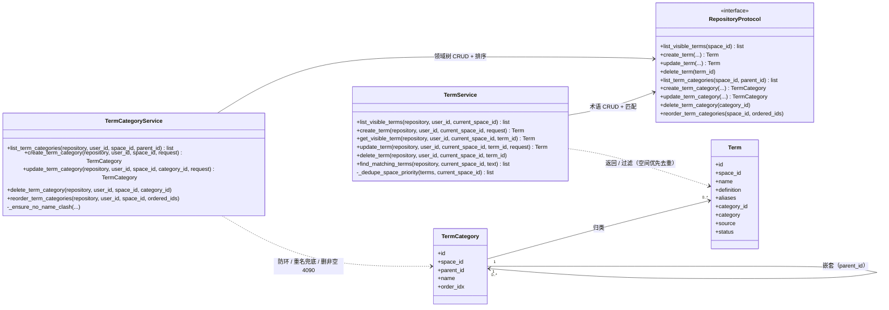

# 详细设计：术语管理子系统（term-management）

> 对应 REQ-036（+ REQ-048 领域树增强，2026-08-07）。总体定位见 04；数据见 06（lumen_terms / lumen_term_categories）；接口见 07（/api/terms + /api/term-categories）。
> 按「完整骨架 + 阶段增量」：`[P1]` 写最小 Demo 能力，后续能力原位追加。

## 0. 文档元信息

| 项 | 内容 |
|---|---|
| 设计对象 | 术语管理子系统（MOD-005） |
| 文档路径 | docs/design/term-management.md |
| 输入来源 | 02/03、04 §2、06（lumen_terms / lumen_term_categories）、07（API-012 / API-013 / API-051..053）、`docs/research/2026-08-07-term-domain-tree-analysis.md` |
| 覆盖 REQ | REQ-036（+ REQ-048 领域树增强） |
| 所属 Phase | [P1] |
| 交付物形态 | Demo |
| 当前状态 | P1-已实现（Sprint-5 降级实现，Sprint-7/8 后术语存储切 PostgreSQL 且问答口径注入真实 LLM；见 §6）；**REQ-048 领域树已实现（2026-08-07，migration 017 + API-051..053，TC-P2-TERM-001 通过）** |
| 流程 ID | Flow-D-005（术语维护）/ Flow-D-006（文档术语识别）/ Flow-D-007（问答口径对齐），见 §2 |
| 最后更新 | 2026-08-17（新增 §0.5 详细类图 DIAG-CLS-TERM-01，OO 覆盖度补全 Batch A2）；前次 2026-08-07（REQ-048 领域树增强回写） |
| 下游影响 | 08 Sprint-5 / Sprint-29、09 TC-P1-012 / TC-P2-TERM-001 |

### 0.5 详细类图（DIAG-CLS-TERM-01）

> 图纸驱动编码：术语管理子系统的类级视图（实体 + `RepositoryProtocol` 契约 + 服务层函数）。类图挂 REQ-036 / REQ-048；方法签名以 `backend/service/term.py`、`term_category.py` 与 `backend/repository/protocol.py` 为准。`TermStatus`（active / archived）见 `backend/model/entities.py`。



## 0.1 领域树增强（REQ-048，2026-08-07）

> 设计依据：`docs/research/2026-08-07-term-domain-tree-analysis.md`（输入材料评审 + TM-C-001..007 用户确认）。**领域树方向 + 全局术语固定区 + demo 粗粒度 3-4 领域 + 阅读/编辑态分离**。

### 0.1.1 目录形态
- **左栏**：全局术语固定区（顶部，系统级，仅 admin 可改——本轮保留只读）+ 空间领域树（`lumen_term_categories`，嵌套邻接表 `parent_id` 自引用，仿 folder-tree）。
- **主区**：单一详情面板（阅读态 / 编辑态），不再有第二栏列表（用户验收反馈，符合「左树导航 + 右详情」主流模式）。

### 0.1.2 数据模型
- `lumen_term_categories`：`id / space_id / parent_id(self, 空=根) / name / order_idx / created_by / created_at / updated_at`；`UNIQUE(space_id, parent_id, name)`（根层重名 service 兜底）。
- `lumen_terms` 扩 3 可空字段：`category_id`（FK→lumen_term_categories，空=未分类）、`category`（内容分类，14 类候选自由输入非枚举）、`source`（术语来源）。
- 领域树**不独立设权限**（复用 folder 口径）；删非空（有子领域或术语）→ 4090；无 archived。

### 0.1.3 API
- API-051 `GET/POST /api/term-categories`（懒加载 `?parent_id=`，仿 API-034）；API-052 `PATCH/DELETE /api/term-categories/{id}`（改名 / 移动防环 / 删非空 4090）；API-053 `POST /api/term-categories/reorder`。
- API-012/013 扩 `category_id` / `category` / `source` 请求·响应字段；`category_id` 跨空间 → 4220。

### 0.1.4 交互
- 右键领域节点：「在此新建术语」（预填该领域）/「新建子领域」/「重命名」/「上移 / 下移」/「删除空领域」。
- 点术语叶子 → 主区阅读态（名称 + 状态/全局/领域/分类徽标 + 定义/别名/来源 + 编辑按钮）；点「编辑」→ 编辑表单（领域下拉 / 内容分类 datalist / 来源字段）；点「新建」→ 编辑态空表单。
- 左栏上下分区（全局术语区 / 空间领域树区）可拖拽调高（`usePaneSectionHeight` 通用 hook，独立 storageKey）。
- 标签 CRUD 前端接线（API-027）：标签项 hover「✎」→ 内联编辑（名称 / 描述 / 颜色 + 保存 / 取消 / 归档），归档确认后移除列表、关联文档保留。

## 1. 职责

维护空间级术语表，并在阅读、编辑与 RAG 问答中统一关键术语口径。

## 2. 核心流程（[P1]）

**术语维护（/api/terms）**
1. 用户在当前空间创建术语，填写标准名称、定义、客户习惯用语、负责人和状态。
2. 保存到 `lumen_terms`；`space_id` 非空时为当前空间术语，`space_id` 为空时为全局术语。
3. 同名术语读取时优先返回当前空间术语，再回退全局术语。

**文档术语识别**
1. 打开文档或编辑保存后，按当前空间术语 + 全局术语做轻量匹配。
2. 命中术语时在阅读 / 编辑界面显示悬浮提示，内容包含定义、负责人、状态和客户习惯用语。
3. P1 只做提示，不自动改写正文。

**RAG 问答口径对齐**
1. `/api/query` 收到问题后，按当前空间加载候选术语。
2. 命中问题或候选块中的术语时，将术语定义注入 Prompt 的上下文约束。
3. 回答中优先采用空间术语定义，并在来源中包含术语表引用；无相关文档时仍按 REQ-008 回复未找到，不因术语存在编造答案。

```mermaid
flowchart TB
  edit[术语创建 / 更新] --> terms[(lumen_terms)]
  terms --> recognize[文档阅读 / 编辑轻量匹配]
  recognize --> tooltip[悬浮提示]
  terms --> query[/api/query 加载候选术语]
  query --> inject[术语定义注入 Prompt]
  inject --> answer[RAG 回答优先采用空间定义]
```

## 3. 关键决策（[P1]）

- **空间优先**：空间术语优先级高于同名全局术语，避免客户项目语境被通用定义覆盖。
- **状态不阻断**：`pending` 术语可用于提示，但 UI 需显示待确认状态；P1 不因待确认术语阻断编辑。
- **轻量匹配**：P1 先用术语表字符串匹配，复杂的候选术语发现、冲突检测和聚合视图后续再细化。

## 4. 阶段增量

- `[P1]` 已设计：术语 CRUD、空间优先、文档悬浮提示、RAG 术语上下文注入。
- `[P2]` 待细化：AI 建议术语、术语冲突检测、术语聚合视图与批量核对工作流。
- `[愿景]` 待验证：跨组织术语复用与行业术语库沉淀。

## 5. 与其他子系统交互

- **依赖** docs/design/permissions：术语接口按空间成员权限校验。
- **影响** docs/design/rag-retrieval：构造 Prompt 前注入术语上下文。
- **写** 06 `lumen_terms`。
- **被** 07 `/api/terms`、`/api/query` 调用。

## 6. 实现偏差 / 设计回写

> 对照 `ai/doc-standards/design-doc.md` §4.10。记录 Sprint-5 降级实现与 Sprint-7/8 真实化后的偏差关闭事实。

| 偏差 ID | 代码 / 配置事实 | 原设计 | 偏差类型 | 处理结论 | 回写目标 | 验证 / 证据 |
|---|---|---|---|---|---|---|
| DEV-001 | ~~术语存储在内存 `demo_repository`~~ → **已实现（Sprint-8）**：术语落地 `lumen_terms` 表（PostgreSQL，`PgRepository`） | `lumen_terms` 表（PostgreSQL） | 已实现 | 术语 CRUD 已切 PG 存储；内存 `demo_repository` 仅作单测 fake | 06 lumen_terms、05 RG-001 | TC-P1-012 |
| DEV-002 | ~~问答口径注入不调 LLM~~ → **已实现（Sprint-7）**：术语定义注入 Prompt → 调真实 LLM（GLM-5.2，RG-004 Go） | 术语定义注入 Prompt → LLM | 已实现 | 与 rag-retrieval DEV-002 同源；RAG 已调真实 LLM，术语定义正常注入 | 07 API-010、05 RG-004 | TC-P1-012 |

## 7. 验收追溯

| 设计点 | 关联 REQ | 关联 Sprint | 关联 TC | 验证方式 | 状态 |
|---|---|---|---|---|---|
| 术语 CRUD + 空间优先 | REQ-036 | Sprint-5（+ Sprint-8 PG 存储） | TC-P1-012 | `tests/backend/test_term.py`（PG 真实化见 `test_api_routes.py` / Sprint-8 74 tests） | 条件通过（Demo）；存储已切 PostgreSQL |
| 问答口径对齐 | REQ-036 | Sprint-5（+ Sprint-7 LLM） | TC-P1-012 | `tests/backend/test_rag.py` + GLM-5.2 真实问答验证 | 条件通过（Demo）；LLM 已真实化 |
| Flow-D-005/006/007 | REQ-036 | Sprint-5 / Sprint-7 / Sprint-8 | TC-P1-012 | 见上 | P1-已实现（Demo 口径） |
