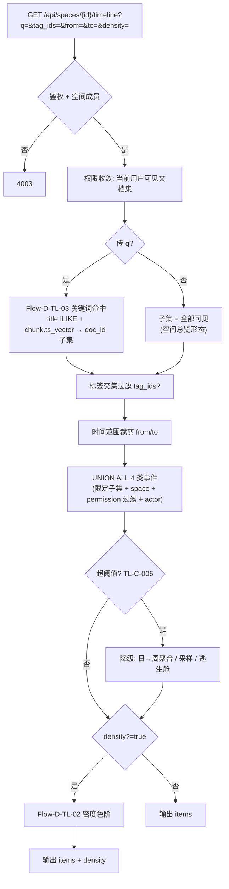

# 详细设计：主题时间线 / 密度热条子系统（timeline）

> 子系统内部逻辑详细设计。总体定位见 `docs/04-architecture.md`（MOD-006 / Flow-009）；接口见 `docs/07-api-spec.md`（API-033）。
> 按「完整骨架 + 阶段增量」：本文为 Phase2B 首批·**第二 slice** `[P2]`，承接已确认需求 REQ-013（重定位为主题时间线）/ REQ-024，不新增需求。
> 对应需求：REQ-013a（主题时间线·P2）、REQ-024（时间轴密度热条）；REQ-013b（关联图视图）留愿景，本文不含。

> **2026-08-02 重定位说明**：本文前身把「时间轴」设计为**空间活动流**（`GET /spaces/{id}/timeline` 返回整个空间的事件总览）。经评审对照 `docs/vision/product-vision.md` 场景1（「搜索框输入关键词 → 纵向时间线 → 主题发展脉络」）与场景覆盖索引「时间轴视图：按项目/关键词生成事件卡片时间线」，确认原设计偏离了愿景核心——**关键词驱动的主题时间线**。本次重定位为：时间轴 = **关键词 / 标签驱动的主题时间线**；原空间活动流收编为「不传 `q` 时的默认总览形态」（候选 A 聚合 / 密度 / 权限内核全部复用）。详见 §9 实现偏差。

## 0. 文档元信息

| 项 | 内容 |
|---|---|
| 设计对象 | 主题时间线 / 密度热条子系统（MOD-006，Flow-009，REQ-013 重定位） |
| 文档路径 | `docs/design/timeline.md` |
| 输入来源 | `02`（REQ-013 重定位 / REQ-024）、`03`（Phase2B 第二 slice）、`04`（MOD-006 / Flow-009）、`05`、`06`（`lumen_documents` 时间字段 / 标签 / 内链 + ADR-010 派生可重建）、`07`（API-033 改造）、`docs/vision/product-vision.md` 场景1 / 场景5、`docs/design/intelligence-analysis.md`（关联图 / 联动愿景） |
| 覆盖 REQ | REQ-013a（主题时间线·P2）、REQ-024（密度热条）；REQ-013b（关联图）愿景，本文不含 |
| 所属 Phase | `[P2]` Phase2B 团队 MVP（首批·第二 slice，紧随 REQ-014） |
| 交付物形态 | MVP |
| 当前状态 | **Phase2B·第二 slice·本地实现完成（task-030）**：候选 A 实时聚合、不建 timeline 事件表；API-033 + 前端时间线视图已落地；后端自动化验证 + frontend build 通过，运行态 API smoke / 浏览器 smoke 待补 |
| 流程 ID | Flow-D-TL-01（主题时间线数据装配）、Flow-D-TL-02（密度热条计算）、Flow-D-TL-03（关键词命中，本次新增） |
| 图 ID | DIAG-TL-FLOW-01（关键词命中 → 装配 → 降级，见 §3） |
| 最后更新 | 2026-08-03 |
| 下游影响 | `02`（REQ-013 重定位）、`03`（第二 slice 表述）、`06`（时间索引 migration 012 已落地）、`07`（API-033 加 `q` + `actor` 并实现）、`08`（Sprint-20 task-030 状态）、`09`（TC-P2-TL-001 本地验证记录）、`frontend-interaction`（PG-P2-008 实现状态） |

## 1. 职责与边界

| 项 | 内容 |
|---|---|
| 本设计负责 | 按**关键词 / 标签**筛选当前用户可见文档子集 → 聚合 4 类事件（created/updated/tagged/linked）→ 装配主题时间线 items + 密度热条 density；每条事件带 `actor`（数据可得时）；大集合降级；权限过滤 |
| 本设计不负责 | 关联图视图（REQ-013b，愿景，见 `intelligence-analysis.md`）；因果推理 / 热力矩阵（愿景 REQ-020/021）；时间轴↔关联图多视角联动（愿景 REQ-029）；文档 CRUD（复用既有）；**搜索结果摘要 / 排序 / 向量召回**（搜索页 MOD-004 的职责，时间轴只复用其「可见文档口径」，不抢其搜索结果形态） |
| 不新增内容 | 不新增 REQ（REQ-013a/b 为既有 REQ-013 的重定位拆分）；**不加 `lumen_doc_links.created_by`**（linked 事件 actor 留 null，TL-C-011）；不建实体表（候选 A，TL-C-001） |
| 权限边界 | 时间轴 / 密度只含当前用户可见文档事件；前端视图仅展示，权限由 API-033 + service 查询层按 `space_id` + `lumen_documents.permission` 过滤（复用 `visible_document_where_clause`，与 `doc_links` / `search` 同口径） |
| 依赖前置 | REQ-014 Sprint-19 先行（**已落地**）；事件源表（`lumen_documents` / `lumen_tags` / `lumen_tag_links` / `lumen_doc_links`）均 Phase2A 已实现；关键词命中复用 `search` 的可见文档收敛口径 |

## 2. 上游依据与追溯

| 来源 | 章节 / ID | 本设计承接内容 | 下游影响 |
|---|---|---|---|
| `docs/vision/product-vision.md` | 场景1（关键词 → 纵向时间线 → 主题脉络）、场景5（时间轴↔关联图联动）、场景覆盖索引 line 819「按项目/关键词生成事件卡片时间线」 | **重定位依据**：时间轴的核心是关键词驱动的主题时间线 | REQ-013 重定位（02/03） |
| `docs/02-srs.md` | REQ-013（重定位为 REQ-013a 主题时间线 P2 + REQ-013b 关联图愿景）/ REQ-024 | 时间轴数据来源、关键词命中、密度色阶映射 | TC-P2-TL-001 |
| `docs/03-prd.md` | Phase2B 首批第二 slice（紧随 REQ-014） | 排序与范围 | Sprint-20 |
| `docs/04-architecture.md` | MOD-006 / Flow-009 | 子系统定位 | 04 追溯 |
| `docs/05-tech-spec.md` | 资源 / 无新依赖（候选 A） | 复用 PG + 现有栈 | 05 无新 Risk |
| `docs/06-db-design.md` | `lumen_documents`(created_at/updated_at/owner_id)、`lumen_tag_links`(created_at/created_by)、`lumen_doc_links`(created_at，**无 created_by**)；ADR-010 派生可重建；REQ-013/024 行 | 事件数据来源候选 A + actor 可得性 | 已回填 06（数据来源 + 时间索引） |
| `docs/07-api-spec.md` | API-033（**改造：加 `q` + `actor`**） | 接口契约 | API-033 已实现（task-030） |
| `docs/08-dev-plan.md` | Sprint-20（重定位为主题时间线；task-030 本地实现） | 第二 slice | 编码完成记录 |
| `docs/09-verification.md` | TC-P2-TL-001（**改造：加关键词命中 + actor + 越权零泄露**） | 验收 | 本地验证证据 |
| `docs/design/intelligence-analysis.md` | REQ-029 多视角联动 / REQ-013b 关联图（愿景） | 主题时间线是关联图 / 联动的**前置视图载体**（共享「关键词 → 文档子集」） | 关联图预留出口 |

最低追溯链：`product-vision 场景1 → REQ-013a / 024 → Phase2B → MOD-006 / Flow-009 → lumen_documents(+tags/tag_links/doc_links) → API-033 → 本设计 → Sprint-20 → TC-P2-TL-001`。

## 3. 核心流程 / 状态机

### Flow-D-TL-03：关键词命中（本次新增）

- 触发：API-033 传入 `q`（非空）
- 参与者：`timeline` service、`lumen_documents`（title / content_md）
- 输入：`q`、当前用户可见文档集
- 步骤：
  1. 归一化 `q`（strip + lower）；空或过短 → 4220（TL 命中校验）。
  2. 在**可见文档集**上判定命中（TL-C-010，**复用现成全文索引**）：**标题命中**=`title ILIKE`（标题短，可接受）；**正文命中**=`lumen_chunks.ts_vector @@ websearch_to_tsquery(lumen_search_regconfig(), q)`（zhparser 中文分词，migration 006 已建，`search` 在用）→ 命中 chunk 的 `distinct document_id`。两者取并集为主题子集。
  3. 返回命中的 `document_id` 集（主题子集）；`q` 未传时返回 `None`（表示不过滤 = 全部可见）。
- 输出：命中 `document_id` 集 或 `None`
- 成功条件：仅返回当前用户可见文档中的命中项；越权文档不进入子集
- 失败 / 降级路径：`q` 非法 → 4220；零命中 → 子集为空 → items=[]，空态引导（见 §5）
- 关联：REQ-013a / API-033 `q` / TC-P2-TL-001

### Flow-D-TL-01：主题时间线数据装配（重定位）

- 触发：进入时间轴视图 → `GET /api/spaces/{id}/timeline?q=&tag_ids=&from=&to=&density=`
- 参与者：前端时间轴视图（PG-P2-008，含搜索框）、API-033、`timeline` service、`lumen_documents` / `lumen_tag_links` / `lumen_doc_links`（候选 A）
- 输入：`space_id`、`q?`（关键词）、`tag_ids?`（标签过滤）、时间范围（`from?`/`to?`，默认近 90 天）、`density?`
- 步骤：
  1. 鉴权（4001）+ 空间成员校验（4003）。
  2. 权限收敛：查询层限定当前用户可见文档集（`space_id` + `permission` 过滤，复用 `document.list_visible_documents` / `visible_document_where_clause` 口径）。
  3. **关键词命中**（Flow-D-TL-03）：若传 `q`，将可见集收窄到命中子集；不传则子集 = 全部可见（空间总览形态）。
  4. 标签主题入口（与关键词并列，TL-C-008）：若传 `tag_ids`（用户按**标签选主题**——标签是用户主动打的语义分类，比关键词子串更"主题"），子集再与 `lumen_tag_links` 交集；可与 `q` 组合（关键词 ∩ 标签）。
  5. 时间范围裁剪：按 `from`/`to` 裁剪，缩小扫描集（候选 A 性能关键）。
  6. 事件装配（数据来源候选 A，见 §4）：UNION ALL 4 类事件子查询，**每子查询限定在子集 `document_id` 内** + 自带 `space_id` + `permission` 过滤，取各自时间字段为 `event_time`，并附 `actor`（见事件类型矩阵）。
  7. 密度计算（REQ-024，`density?=true` 时，见 Flow-D-TL-02）。
  8. 大集合降级（见 §5 / TL-C-006）。
  9. 返回 `{items[{date,document_id,title,event_type,permission,actor}], density?, degraded, window}`。
- 输出：主题时间线 items + 可选 density
- 成功条件：仅含可见文档事件；`q` 命中口径正确；越权事件零泄露（红线）；actor 字段正确（linked=null）
- 失败 / 降级路径：零命中 → items=[] 空态；事件数超阈值 → 时间窗口聚合（日→周）/ 采样 / 提示切经典列表（逃生舱）
- 关联：REQ-013a / REQ-024 / API-033 / TC-P2-TL-001

### Flow-D-TL-02：密度热条计算（不变）

- 触发：Flow-D-TL-01 步骤 7，`density?=true`
- 输入：装配后的全量事件集（裁剪 + 过滤后）、时间窗口粒度（日 / 周，TL-C-005）
- 步骤：
  1. 按时间窗口（默认日；超阈值或跨度>180 天自动切周，TL-C-005）分桶。
  2. 统计每窗口事件计数（TL-C-004 口径：密度按事件数；渲染按"有事件文档数"去重，避免单文档频繁更新刷屏）。
  3. 色阶映射（TL-C-003：4 档 0 无 / 1 低 / 2 中 / 3 高，按窗口事件数分位或固定阈值）。
  4. 输出 `density[{window_start,window_end,event_count,level,ratio}]`；`ratio` = 该窗口 `event_count` ÷ 全空间日均 `event_count`（相对活跃倍数；前端悬停显示「高于平均 X 倍」，对齐 product-vision 场景1）。
- 输出：density 数组
- 成功条件：窗口边界正确；空 / 满窗口色阶正确；与 items 时间范围一致；传 `q` 时密度反映**主题**活跃节奏（非全空间）
- 失败 / 降级：超阈值时按聚合后密度映射；色阶仍可辨
- 关联：REQ-024 / API-033 / TC-P2-TL-001



> 图 ID `DIAG-TL-FLOW-01`：主题时间线装配与降级（候选 A 主路径）。时间轴为只读视图，**无独立状态机**（事件来自既有表的不可变历史 / 时间字段，不引入新状态）。

### 事件类型矩阵（含 actor，TL-C-002 / TL-C-011）

| event_type | 来源表 | 时间字段 | 文档键 | actor | 说明 |
|---|---|---|---|---|---|
| `created` | `lumen_documents` | `created_at` | `id` | `owner_id` | 文档创建 |
| `updated` | `lumen_documents` | `updated_at`（且 ≠ `created_at`） | `id` | `owner_id`（近似，TL-C-009） | 文档内容更新；真正编辑者需查版本表，最小版用 owner 近似 |
| `tagged` | `lumen_tag_links` | `created_at` | `document_id` | `tag_link.created_by` | 文档被打标签 |
| `linked` | `lumen_doc_links` | `created_at` | `source_document_id` | **`null`**（TL-C-011） | 文档建立内链（**仅 source 侧**；反链不计入）；`lumen_doc_links` 无 `created_by`，actor 数据不可得 |

> 4 类事件源表均带 `created_at`（`lumen_documents` 另有 `updated_at` + `owner_id`；`lumen_tag_links` 有 `created_by`），候选 A 实时聚合技术上可行。`linked` 的 actor 缺数据是已知取舍（不为最小版加字段）。

## 4. 数据、接口与权限契约

### 4.1 数据来源方案（候选 A，TL-C-001 已确认）

- 实现：UNION ALL 4 类事件子查询（见事件类型矩阵），每子查询 `WHERE space_id = ? AND document_id IN (子集) AND (permission <> 'private' OR owner_id = ?) AND event_time BETWEEN ? AND ?`，外层按 `event_time` 排序 / 窗口聚合。
- 索引需求（候选 A 性能前提，回填 06 §3 / migration 012）：`lumen_documents(space_id, created_at)`、`lumen_documents(space_id, updated_at)`；`lumen_tag_links(document_id)` 已有；`lumen_doc_links(space_id, source_document_id)` 已有。
- 关键词命中索引（TL-C-010，**口径修订 2026-08-02**）：**标题命中**=`title ILIKE`（短文本，零新索引）；**正文命中**=复用 `lumen_chunks.ts_vector`（zhparser 中文分词，migration 006 已建，`search` 在用）→ `distinct document_id`。**复用现成全文索引，非新增工作**；纯 `content_md` ILIKE 被否决（中文不分词 + 全表扫，漏命中致主题时间线空）。
- 优点：零实体表 migration（仅加 2 个时间索引）；ADR-010「派生可重建」天然满足；无写入一致性维护；事件实时；与 folder-tree「能不加表就不加」克制一致。
- 缺点：每次查询都要 UNION 4 表 + 聚合 + 关键词命中，扫描量随事件数 / 文档正文长度增长；依赖时间范围裁剪 + 索引 + 关键词命中收窄 + 降级阈值四层控制。
- 性能口径（Demo 本机 PG，候选 A）：单空间 <500 文档 / <2000 事件、带时间范围 + 索引 +（传 `q` 时子集收窄），聚合查询预期 <200ms；超阈值触发窗口聚合 / 采样（TL-C-006）。task-030 已由单测覆盖 degraded 逻辑；真实 PG 大数据性能实测待后续补。

### 4.2 接口与权限契约

| 能力 / 流程 | 数据表 / 字段 | API-ID | 权限规则 | 错误码 | 契约状态 |
|---|---|---|---|---|---|
| 主题时间线 items（含 `q` 筛选 + `actor`） | 候选 A：`lumen_documents`(created_at/updated_at/owner_id) + `lumen_tag_links`(created_at/created_by) + `lumen_doc_links`(created_at) | API-033 | 空间成员；仅可见文档事件（`space_id` + `permission` 过滤）；`q` 命中仅在可见集内 | 4001/4003/4004/4220 | 已实现（task-030） |
| 密度热条 | 同上事件按时间窗口聚合 | API-033 `density?=true` | 同上 | 同上 | 已实现（task-030） |

**API-033 响应契约（task-030 已落地，见 07 §3.9）**：

```text
items[{date, document_id, title, event_type, permission, actor}]
density?[{window_start, window_end, event_count, level, ratio}]
degraded: bool          # 是否触发大集合降级
window: "day" | "week"  # 当前密度窗口粒度
```

- `event_type` enum：`created` / `updated` / `tagged` / `linked`（TL-C-002）。
- `actor`：操作者 user_id；`created`/`updated` = `owner_id`（updated 近似，TL-C-009）；`tagged` = `tag_link.created_by`；`linked` = **`null`**（数据不可得，TL-C-011）。仅前端展示用。
- `permission`（TL-C-007 已确认·暴露）：文档权限（`private` / `team` / `external`），仅展示（图标 / 可见性标记），**不替代后端过滤**。
- `density.level`：0 无 / 1 低 / 2 中 / 3 高（TL-C-003）。
- `density.ratio`：该窗口 `event_count` ÷ 全空间日均值的倍数（如 3.2 = 高于平均 3.2 倍）；前端悬停量化提示，对齐 product-vision 场景1。
- `q` 语义：不传 = 空间总览（子集 = 全部可见）；传 = 主题子集（仅命中文档的事件）。

权限红线：每个子查询（候选 A）均按 `space_id` + 当前用户可见文档集 +（传 `q` 时）命中子集三重过滤；越权文档事件不返回、不泄露（TC-P2-TL-001 红线项）。

## 5. 失败、异常与降级路径

| 场景 | 触发条件 | 系统行为 | 用户可见 | 阻塞验收 | 关联 TC |
|---|---|---|---|---|---|
| 大集合 | 文档 / 事件数超阈值（TL-C-006：>500 文档或 >2000 事件） | 时间窗口聚合（日→周）/ 采样；提示切经典列表；`degraded=true` | 「数据较多，已聚合 / 切换列表视图」 | 否（降级） | TC-P2-TL-001 |
| 空时间范围 | 无可见事件 | `items=[]`，空态引导 | 空态 | 否 | TC-P2-TL-001 |
| **零命中**（本次新增） | 传 `q` 但可见集无命中 | 子集为空 → `items=[]`，空态引导「未找到含『q』的文档」 | 空态 + 建议改词 | 否 | TC-P2-TL-001 |
| **关键词非法**（本次新增） | `q` 为空串 / 过短 / 非法 | 4220 | 「关键词无效」 | 否（参数校验） | TC-P2-TL-001 |
| 越权事件 | 不可见文档事件 | 查询层过滤剔除，零泄露 | 不泄露 | 否（红线） | TC-P2-TL-001 |
| 长跨度查询 | `from`/`to` 跨度 > 180 天 | 自动切周窗口（TL-C-005） | 密度按周显示 | 否 | TC-P2-TL-001 |

密度热条降级：超阈值时按聚合后密度映射，避免渲染卡顿；提供经典列表逃生舱（对齐 `frontend-interaction` 多文档信号下的「经典路径 / 逃生舱」口径）。

## 6. 阶段增量、readiness gate 与实现状态

阶段增量：

| 阶段 | 功能范围 | 交付物形态 | 设计状态 | 实现状态 | 备注 |
|---|---|---|---|---|---|
| Phase2B | REQ-013a 主题时间线（关键词驱动）+ REQ-024 密度热条 | MVP | 已设计（重定位） | 本地实现完成（task-030；API-033 + 前端视图） | 后端自动化验证 + frontend build 通过；运行态 API smoke / 浏览器 smoke 待补 |
| 愿景 | REQ-013b 关联图视图、REQ-029 多视角联动、REQ-021 因果展开 | 产品 | 骨架（见 `intelligence-analysis.md`） | 不实现 | 主题时间线是其前置视图载体，预留「关键词 → 文档子集」出口 |

readiness gate：

| 能力 | 当前状态 | 解锁条件 | 验证证据 | 降级路径 | 阻塞 Sprint |
|---|---|---|---|---|---|
| 时间轴数据来源（TL-C-001） | ✅ 已实现候选 A（task-030） | 已回写 06/07；migration 012 已落地 | `test_timeline` 6/6 OK | 大集合聚合 | 不阻塞 |
| 关键词命中口径（TL-C-010） | ✅ 已实现 title ILIKE + chunk.ts_vector 路径（2026-08-03） | PG 路径复用 `search_chunks` 全文索引；内存 fake 覆盖 chunk fallback | `test_timeline` 关键词 / 越权用例 | 降级 + 子集收窄 | 不阻塞 |
| actor 可得性（TL-C-011） | ✅ 已实现 linked=null（task-030） | 全 actor 需 `lumen_doc_links.created_by`（后续 migration） | `test_timeline` 4 类事件 actor 用例 | linked 显示「未知」 | 不阻塞 |
| REQ-013 重定位（02/03 修订） | ✅ 已完成配套修订（2026-08-02） | 02/03 REQ-013 拆分为 REQ-013a（P2）/ REQ-013b（愿景）+ 补用户故事 | 本设计 §9 已记录 | — | 不阻塞 |
| 大集合阈值（TL-C-006） | 已固化（>500 文档 / >2000 事件） | 后续真实 PG 大数据性能实测可微调 | `test_timeline` degraded 用例 | 聚合 / 采样 / 列表 | 不阻塞 |

> 时间轴为只读视图，复用既有 PG / 前端栈，**不引入新 RG**（无新真实依赖）；候选 A 仅加 2 个时间索引（migration 012），不建实体表。task-030 已完成本地实现；剩余验收缺口是运行态 API smoke / Chrome / Edge smoke 与真实 PG 大数据性能实测。

## 7. 验证与验收追溯

| 设计点 | 关联 REQ | Sprint / Task | TC | 验证方式 | 状态 |
|---|---|---|---|---|---|
| 主题时间线渲染 + 权限过滤 | REQ-013a | Sprint-20 / task-030 | TC-P2-TL-001 | 后端 tests（越权不返回）+ frontend build；Chrome / Edge smoke 待补 | 本地实现完成 |
| **关键词命中准确**（本次新增） | REQ-013a | Sprint-20 / task-030 | TC-P2-TL-001 | 后端 tests（title/chunk 命中、越权不命中）| 本地实现完成 |
| **actor 正确 + linked=null**（本次新增） | REQ-013a | Sprint-20 / task-030 | TC-P2-TL-001 | 后端 tests（4 类事件 actor；linked=null） | 本地实现完成 |
| 密度热条色阶 | REQ-024 | Sprint-20 / task-030 | TC-P2-TL-001 | 后端 density 用例 + frontend build；浏览器渲染 smoke 待补 | 本地实现完成 |
| 大集合降级 | REQ-013a | Sprint-20 / task-030 | TC-P2-TL-001 | 后端 degraded 用例；真实大数据性能待补 | 本地实现完成 |

正式验收证据以 `09-verification.md` 为准。

## 8. 与其他子系统交互

| 方向 | 子系统 / 文档 | 交互内容 | 契约来源 | 风险 |
|---|---|---|---|---|
| 依赖 | 检索（`search`） | 复用「可见文档收敛口径」（`filter_visible_documents`）+ **`lumen_chunks.ts_vector` 命中拿 `document_id` 集**（TL-C-010）；不复制其搜索结果 / 摘要 / 向量召回形态 | REQ-008 / MOD-004 | 低（口径一致，复用现成） |
| 依赖 | 标签（`lumen_tags` / `lumen_tag_links`） | tagged 事件来源 + actor（created_by）+ tag_ids 过滤 | REQ-012（Phase2A 已实现） | 低 |
| 依赖 | 内链（`lumen_doc_links`） | linked 事件来源（source 侧）；actor 不可得（null） | REQ-026（Phase2A 已实现） | 中（actor 缺数据，TL-C-011） |
| 依赖 | 文档权限（`permissions`） | 可见文档集过滤 | REQ-003 / `lumen_documents.permission` | 低 |
| 影响 | `frontend-interaction.md` | 时间轴 Page-ID（PG-P2-008，**加搜索框**）/ 密度热条布局 / 逃生舱 | §9.2.1 | 低（TL-C-008 已确认，补搜索框） |
| 关联 | 关联图视图（REQ-013b 候选 / 愿景） | 共享「关键词 → 文档子集」出口；本设计预留 | `intelligence-analysis.md` | 关联图仍愿景，后续单独设计 |
| 关联 | 多视角联动（REQ-029 愿景） | 时间轴↔关联图切换的状态保持 | `intelligence-analysis.md` | 愿景，不进本 slice |

## 9. 实现偏差 / 设计回写

| 偏差 ID | 代码 / 配置事实 | 原设计 | 偏差类型 | 处理结论 | 回写目标 | 验证 |
|---|---|---|---|---|---|---|
| TL-DEV-001（2026-08-02 → 2026-08-03 回填） | task-030 已编码：`backend/service/timeline.py` + `backend/api/timeline.py` + `frontend/src/features/TimelineFeature.tsx` | 前身设计为「空间活动流」（`GET /spaces/{id}/timeline` 返回整个空间事件总览，无关键词驱动） | 设计滞后（设计偏离 product-vision 场景1 愿景） | **已按主题时间线落地**：关键词 / 标签驱动；空间活动流收编为「`q` 不传时的默认总览形态」；候选 A 聚合 / 密度 / 权限内核全部复用；不建事件表 | `06/07/08/09/frontend-interaction` 状态推进；task-030 | `test_timeline` 6/6 OK；timeline/document/tag/doc_links 回归 37/37 OK；frontend build 通过；浏览器 smoke 待补 |

> 重定位依据：`docs/vision/product-vision.md` 场景1（「搜索框输入关键词 → 纵向时间线铺开 → 主题发展脉络」）+ 场景覆盖索引「时间轴视图：按项目/关键词生成事件卡片时间线」。原 REQ-013 拆解时窄化为空间活动流，偏离愿景核心；本次纠正。关联图（REQ-013b）、因果展开（REQ-021）、多视角联动（REQ-029）仍为愿景，不在本 slice。

## 10. 待人工确认项

> TL-C-001..011 **已确认并随 task-030 本地实现（2026-08-03）**：候选 A、4 类事件、密度 4 档、密度口径、时间窗口、大集合阈值、permission 暴露、前端布局 PG-P2-008、关键词命中口径、actor 与 linked=null 均已进入代码和测试；运行态 API smoke / 浏览器 smoke 待补。

| ID | 待确认项 | AI 建议 | 建议依据 | 备选方案 | 取舍影响 / 阻塞关系 |
|---|---|---|---|---|---|
| TL-C-001 ✅ | 数据来源：候选 A（不建表，实时聚合） | 已选候选 A | 4 事件源表均有 created_at；ADR-010 派生可重建；零实体表 migration；与 folder-tree 克制一致 | 候选 B（事件表，migration 012 + 写入一致性 + 重建脚本） | 不阻塞；候选 B 留作 >5000 文档性能优化出口 |
| TL-C-002 ✅ | 4 类事件；linked 仅 source 侧 | 4 类 + linked 仅 source | 全部有 created_at；反链计入会重复 + 权限复杂 | 含反链 / 仅 created+updated | 影响 API-033 event_type 枚举 |
| TL-C-003 ✅ | 密度色阶 4 档 | 4 档（0/1/2/3） | 视觉可辨 + 色盲友好 | 5 档 / 连续色 | 影响 TC 边界 |
| TL-C-004 ✅ | 密度按事件数 + 渲染去重 | 事件数计密度 + 渲染去重 | 避免单文档频繁更新刷屏 | 全事件数 / 全文档数 | 影响密度数值 |
| TL-C-005 ✅ | 时间窗口粒度 | 默认日；跨度>180 天 / 超阈值切周 | Demo 量级日粒度可读 | 固定日 / 周 / 用户切换 | 影响 density 分桶 |
| TL-C-006 ✅ | 大集合降级阈值 | >500 文档或 >2000 事件 | Demo 本机资源软上限 | 固定 / 动态 | 不阻塞启动；编码中实测微调 |
| TL-C-007 ✅ | API-033 暴露 `permission` | 暴露（仅展示） | 前端区分私密 / 共享图标 | 不暴露 | 隐私口径；后端已过滤 |
| TL-C-008 ✅（**2026-08-02 补主题入口 + 密度量化**） | 前端布局 / Page-ID | PG-P2-008：**两种主题入口（关键词搜索框 + 标签选择，并列）** + 顶部密度热条（**含量化提示 `ratio`**）+ 下方事件列表 + 经典列表逃生舱 | 标签=用户自定义主题（比关键词子串准），场景9「标签建立主题全貌」；后端 `tag_ids` 已支持，**零后端改动**；密度量化对齐场景1「高于平均 3.2 倍」 | 仅关键词入口 / 标签仅作过滤 / 仅色阶无量值 | 已回填 frontend-interaction §9.2.1（补搜索框 + 标签入口 + 密度量化） |
| **TL-C-009** ✅（2026-08-02 新增） | `updated` 事件 actor | 用 `owner_id` 近似（真正编辑者需查版本表） | 候选 A 实时聚合不 join 版本表，保持简单；owner 近似可接受 | 查 `lumen_document_versions` 拿最后 editor_id | 影响响应字段 + 查询复杂度；最小版用近似，全量留优化 |
| **TL-C-010** ✅（2026-08-02 新增·**口径修订**） | 关键词命中实现 | **标题 `title ILIKE` + 正文复用 `lumen_chunks.ts_vector`（zhparser 中文分词，现成）→ distinct document_id** | 项目已有 zhparser + chunk 全文索引（`search` 在用）；中文分词匹配质量远优于 `content_md` ILIKE；标题短可 ILIKE | 纯 `content_md` ILIKE（**否决**：中文不分词 + 全表扫，漏命中致主题时间线空） | 复用现成能力，非新增；性能靠子集收窄 + 降级 |
| **TL-C-011** ✅（2026-08-02 新增） | `linked` 事件 actor 数据不可得 | 返回 `null`，**不为最小版加 `lumen_doc_links.created_by`** | doc_links 表无 created_by；加字段需 migration + 写入侧改造，超最小版范围；诚实标注「未知」 | 加 created_by 字段（后续 migration，全量 actor） | 影响 linked 事件展示；全量 actor 留后续 |
| **TL-C-012**（2026-08-02 新增） | REQ-013 重定位需 02/03 配套修订 | 拆分 REQ-013a（主题时间线 P2）/ REQ-013b（关联图愿景），原位细化，不新增 REQ 编号；补用户故事（原骨架级） | product-vision 场景1 为重定位依据；02/03 当前把 REQ-013 表述为「时间轴视图/关联图视图」捆一起 | 不拆分、整体改写 REQ-013 | 阻塞编码（编码前 02/03 需修订到位）；不阻塞本设计落盘 |
| **TL-C-013**（2026-08-02 新增） | 关联图（REQ-013b）何时立项 | 主题时间线落地 + 试用反馈后评估；关联图共享「关键词→文档子集」出口 | 关联图依赖主题时间线的子集能力 + 图算法可解释性（REQ-030 高风险） | 关联图与主题时间线同步做 | 愿景级；不阻塞本 slice |

## 11. slice 拆分建议（→ `docs/08-dev-plan.md`）

> task-030 已按以下 slice 合并落地；剩运行态 API smoke / 浏览器 smoke 待补：

1. **后端契约 + service**（候选 A）：关键词命中（Flow-D-TL-03，ILIKE）+ timeline service（UNION ALL 4 类事件 + 子集过滤 + 权限 + actor）+ 索引（migration 012：`lumen_documents(space_id, created_at/updated_at)`）+ API-033 改造（加 `q` + `actor`）+ tests（关键词命中准确 / 越权零泄露 / actor 正确 / linked=null / 空态 / 零命中 / 大集合降级）。
2. **密度热条**：Flow-D-TL-02 窗口聚合 + 色阶映射 + tests（空 / 满 / 边界窗口）。（可与 slice 1 合并为同一后端 task，因密度即 service 一部分。）
3. **前端主题时间线视图**：PG-P2-008 搜索框 + 密度热条 + 事件列表 + 经典列表逃生舱（参考 `frontend-interaction` §9.2.1）+ 浏览器 smoke。
4. **回写**：02（REQ-013 重定位）、03（第二 slice 表述）、06（索引 migration 012 落地）、07（API-033 §3.9 契约定稿 + `q` + `actor`）、08（Sprint-20 状态）、09（TC-P2-TL-001 详情）、frontend-interaction（PG-P2-008 加搜索框）、design（本文 §9 实现偏差回填代码事实）已完成本轮状态推进。

---

> 本设计已从 **空间活动流** 重定位为 **Phase2B·第二 slice·主题时间线（task-030 本地实现完成）**：关键词 / 标签驱动（`q` 可选，不传=空间总览）+ 4 类事件 + actor（linked=null）+ 密度热条 + 大集合降级。候选 A 聚合 / 密度 / 权限内核全部复用，不建 timeline 事件表。关联图（REQ-013b）/ 多视角联动（REQ-029）/ 因果展开（REQ-021）仍为愿景，预留「关键词 → 文档子集」出口；剩运行态 API smoke / 浏览器 smoke 待补。
