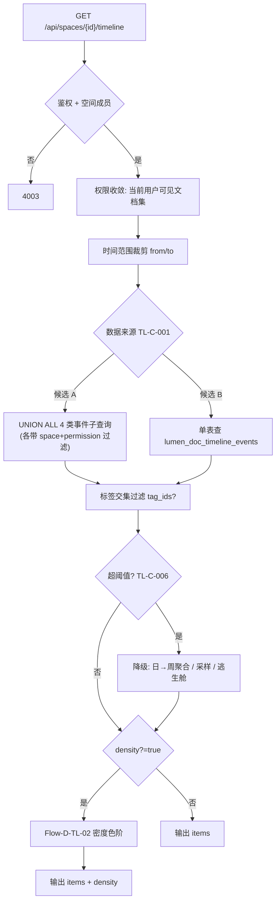

# 详细设计：时间轴 / 密度热条子系统（timeline）

> 子系统内部逻辑详细设计。总体定位见 `docs/04-architecture.md`（MOD-006 / Flow-009）；接口见 `docs/07-api-spec.md`（API-033）。
> 按「完整骨架 + 阶段增量」：本文为 Phase2B 首批·**第二 slice** `[P2]`，承接已确认需求 REQ-013 / REQ-024，不新增需求。
> 对应需求：REQ-013（时间轴视图 / 关联图视图）、REQ-024（时间轴密度热条）。

## 0. 文档元信息

| 项 | 内容 |
|---|---|
| 设计对象 | 时间轴 / 密度热条子系统（MOD-006，Flow-009） |
| 文档路径 | `docs/design/timeline.md` |
| 输入来源 | `02`（REQ-013 / REQ-024，骨架）、`03`（Phase2B 首批第二 slice）、`04`（MOD-006 / Flow-009）、`05`、`06`（`lumen_documents` 时间字段 / 标签 / 内链 + ADR-010 派生可重建）、`07`（API-033）、`docs/research/2026-07-30-phase2b-kickoff-decision.md` |
| 覆盖 REQ | REQ-013（时间轴；关联图仍候选，本文不含）、REQ-024（密度热条） |
| 所属 Phase | `[P2]` Phase2B 团队 MVP（首批·第二 slice，紧随 REQ-014 Sprint-19） |
| 交付物形态 | MVP |
| 当前状态 | **Phase2B·第二 slice·已设计**：TL-C-001..008 已确认（2026-08-02，**TL-C-001 选候选 A** 实时聚合不建表）；06/07/02/03/08/09/frontend-interaction 已回填，待 REQ-014 Sprint-19 落地后进入编码（Sprint-20） |
| 流程 ID | Flow-D-TL-01（时间轴数据装配）、Flow-D-TL-02（密度热条计算），见 §3 |
| 图 ID | DIAG-TL-FLOW-01（数据装配 / 降级，见 §3） |
| 最后更新 | 2026-08-02 |
| 下游影响 | `08` Sprint-20、`09` TC-P2-TL-001、`07` API-033 契约定稿、`06` 数据来源定稿（TL-C-001 候选 A）、前端时间轴视图（PG-P2-008，见 `frontend-interaction` §9.2.1） |

## 1. 职责与边界

| 项 | 内容 |
|---|---|
| 本设计负责 | 按时间维度聚合同空间文档事件（创建 / 更新 / 打标签 / 内链）→ 装配时间轴 items + 密度热条 density；大集合降级；权限过滤 |
| 本设计不负责 | 关联图视图（REQ-013 中「关联图」仍候选，本文不含）；因果推理 / 热力矩阵（愿景 REQ-020/021，禁止当前阶段）；文档 CRUD（复用既有） |
| 不新增内容 | 不新增 REQ；数据表方案在 TL-C-001 未定稿前不擅自建表（见 §4） |
| 权限边界 | 时间轴 / 密度只含当前用户可见文档事件；前端视图仅展示，权限由 API-033 + service 查询层按 `space_id` + `lumen_documents.permission` 过滤 |
| 依赖前置 | REQ-014 Sprint-19 先行（首批排序）；REQ-013/024 紧随 Sprint-20；事件源表（`lumen_documents` / `lumen_tags` / `lumen_tag_links` / `lumen_doc_links`）均 Phase2A 已实现 |

## 2. 上游依据与追溯

| 来源 | 章节 / ID | 本设计承接内容 | 下游影响 |
|---|---|---|---|
| `02-srs.md` | REQ-013 / REQ-024（骨架，数据来源 / 布局算法待细化） | 时间轴数据来源、密度色阶映射 | TC-P2-TL-001 |
| `03-prd.md` | Phase2B 首批第二 slice（紧随 REQ-014） | 排序与范围 | Sprint-20 |
| `04-architecture.md` | MOD-006 / Flow-009 | 子系统定位 | 04 追溯 |
| `05-tech-spec.md` | 资源 / 无新依赖（候选 A） | 复用 PG + 现有栈 | 05 无新 Risk（候选 A） |
| `06-db-design.md` | `lumen_documents`(created_at/updated_at)、`lumen_tags`、`lumen_tag_links`(created_at)、`lumen_doc_links`(created_at)；ADR-010 派生可重建；REQ-013/024 行「候选 A 已定」 | 事件数据来源候选 A（已定） | 已回填 06（数据来源 + 时间索引） |
| `07-api-spec.md` | API-033（骨架，§3.9 待细化） | 接口契约 | API-033 定稿 |
| `08-dev-plan.md` | Sprint-20（待补） | 第二 slice | 编码 |
| `09-verification.md` | TC-P2-TL-001（待新增） | 验收 | 验证证据 |

最低追溯链：`REQ-013 / 024 → Phase2B → MOD-006 / Flow-009 → lumen_documents(+tags/tag_links/doc_links) → API-033 → 本设计 → Sprint-20 → TC-P2-TL-001`。

## 3. 核心流程 / 状态机

### Flow-D-TL-01：时间轴数据装配

- 触发：进入时间轴视图 → `GET /api/spaces/{id}/timeline`（带 `from?` / `to?` / `tag_ids?` / `density?`）
- 参与者：前端时间轴视图（PG-P2-008）、API-033、`timeline` service、`lumen_documents` / `lumen_tag_links` / `lumen_doc_links`（候选 A）；或 `lumen_doc_timeline_events`（候选 B，见 §4 / TL-C-001）
- 输入：`space_id`、时间范围（`from?`/`to?`，默认近 90 天）、标签过滤（`tag_ids?`）、是否返回密度（`density?=true`）
- 步骤：
  1. 鉴权（4001）+ 空间成员校验（4003）。
  2. 权限收敛：查询层限定当前用户可见文档集（`space_id` + `permission` 过滤，复用 `document.list_visible_documents` 口径）。
  3. 时间范围裁剪：按 `from`/`to` 裁剪，缩小扫描集（候选 A 性能关键）。
  4. 事件装配（数据来源见 §4 / TL-C-001）：
     - 候选 A：UNION ALL 4 类事件子查询（见事件类型矩阵），每子查询自带 `space_id` + `permission` 过滤，取各自时间字段为 `event_time`。
     - 候选 B：单表查 `lumen_doc_timeline_events`（已由写入侧维护）。
  5. 标签过滤：若传 `tag_ids`，对 items 按文档 ↔ `lumen_tag_links` 交集过滤。
  6. 密度计算（REQ-024，`density?=true` 时，见 Flow-D-TL-02）。
  7. 大集合降级（见 §5 / TL-C-006）。
  8. 返回 `{items[{date,document_id,title,event_type,permission}], density?[]}`。
- 输出：时间轴 items + 可选 density
- 成功条件：仅含可见文档事件；密度色阶正确；越权事件零泄露（红线）
- 失败 / 降级路径：事件数超阈值 → 时间窗口聚合（日→周）/ 采样 / 提示切经典列表（逃生舱）
- 关联：REQ-013 / REQ-024 / API-033 / TC-P2-TL-001

### Flow-D-TL-02：密度热条计算

- 触发：Flow-D-TL-01 步骤 6，`density?=true`
- 输入：装配后的全量事件集（裁剪 + 过滤后）、时间窗口粒度（日 / 周，TL-C-005）
- 步骤：
  1. 按时间窗口（默认日；超阈值或跨度>180 天自动切周，TL-C-005）分桶。
  2. 统计每窗口事件计数（TL-C-004 口径：密度按事件数；渲染按"有事件文档数"去重，避免单文档频繁更新刷屏）。
  3. 色阶映射（TL-C-003：4 档 0 无 / 1 低 / 2 中 / 3 高，按窗口事件数分位或固定阈值）。
  4. 输出 `density[{window_start,window_end,event_count,level}]`。
- 输出：density 数组
- 成功条件：窗口边界正确；空 / 满窗口色阶正确；与 items 时间范围一致
- 失败 / 降级：超阈值时按聚合后密度映射；色阶仍可辨
- 关联：REQ-024 / API-033 / TC-P2-TL-001



> 图 ID `DIAG-TL-FLOW-01`：时间轴数据装配与降级（候选 A 主路径，候选 B 替换虚线分支为单表查）。时间轴为只读视图，**无独立状态机**（事件来自既有表的不可变历史 / 时间字段，不引入新状态）。

### 事件类型矩阵（TL-C-002 待确认）

| event_type | 来源表 | 时间字段 | 文档键 | 说明 |
|---|---|---|---|---|
| `created` | `lumen_documents` | `created_at` | `id` | 文档创建 |
| `updated` | `lumen_documents` | `updated_at`（且 ≠ `created_at`） | `id` | 文档内容更新 |
| `tagged` | `lumen_tag_links` | `created_at` | `document_id` | 文档被打标签 |
| `linked` | `lumen_doc_links` | `created_at` | `source_document_id` | 文档建立内链（**仅 source 侧**；反链不计入，TL-C-002） |

> 4 类事件源表均带 `created_at`（`lumen_documents` 另有 `updated_at`），候选 A 实时聚合技术上可行（见 §4）。

## 4. 数据、接口与权限契约

### 4.1 数据来源方案（TL-C-001 待用户确认，A/B 对比）

> 06-db-design.md REQ-013/024 行已并列两候选：「基于 lumen_documents 时间字段 + 标签 + 内链聚合，或新增轻量 lumen_doc_timeline_events 视图表」。本节展开两方案契约与取舍，**不替用户拍板**。

**候选 A（已选定，2026-08-02 TL-C-001 确认）——不建表，实时聚合**

- 实现：UNION ALL 4 类事件子查询（见事件类型矩阵），每子查询 `WHERE space_id = ? AND document_id IN (可见集) AND event_time BETWEEN ? AND ?`，外层按 `event_time` 排序 / 窗口聚合。
- 索引需求（候选 A 性能前提，回填 06 §3）：`lumen_documents(space_id, created_at)`、`lumen_documents(space_id, updated_at)`；`lumen_tag_links(document_id)` 已有（join documents 过滤 space）；`lumen_doc_links(space_id, source_document_id)` 已有。
- 优点：零 migration；ADR-010「派生可重建」天然满足（items 可从权威表重建，无需重建脚本）；无写入一致性维护；事件实时（无延迟）；与 folder-tree「能不加表就不加」克制一致。
- 缺点：每次查询都要 UNION 4 表 + 聚合，扫描量随事件数线性增长；依赖时间范围裁剪 + 索引 + 降级阈值三层控制。
- 性能口径（Demo 本机 PG，候选 A）：单空间 <500 文档 / <2000 事件、带时间范围 + 索引，聚合查询预期 <200ms；超阈值触发窗口聚合 / 采样（TL-C-006）。编码中本机实测确认（不阻塞启动）。

**候选 B——新增 `lumen_doc_timeline_events` 视图表**

- 表结构（草案，回填 06 §2 若选定）：`id` PK / `space_id` FK / `document_id` FK / `event_type` enum(created/updated/tagged/linked) / `event_time` timestamp / `created_at`；索引 `(space_id, event_time)`、`(document_id)`。
- 写入：document CRUD（create/update）/ `lumen_tag_links` insert / `lumen_doc_links` insert 时由 service 层或 DB 触发器同步写事件；删文档级联删事件。
- 优点：单表查询，大集合性能稳定；可缓存 / 预算密度；查询逻辑简单。
- 缺点：migration 012；**写入一致性维护**（每次 CRUD 都要维护，漏写 = 事件缺失）；ADR-010 下属派生数据，必须可从权威表重建（需补重建脚本）；`permission` 变更时无 snapshot 问题（不固化 permission，查询时仍 join 过滤，否则与候选 A 权限口径分叉）。
- 适用：未来单空间 >5000 文档、实时聚合性能不达标时，再评估物化视图 / 事件表（愿景级出口）。

**AI 建议（已确认 2026-08-02 TL-C-001）**：选定 **候选 A**。依据：① 4 事件源表均有 `created_at`，实时聚合可行；② ADR-010 派生可重建原则天然支持不建实体表（时间轴 items 是只读派生视图，与 folder-tree 的 `lumen_folders` 权威组织结构性质不同——后者是用户直接 CRUD 的权威实体，必须建表）；③ 零 migration 降低 Phase2B 首批复杂度；④ 大集合性能靠"时间范围裁剪 + 索引 + 降级阈值"三层控制，Demo 量级够用。候选 B 留作大空间性能优化出口。

### 4.2 接口与权限契约

| 能力 / 流程 | 数据表 / 字段 | API-ID | 权限规则 | 错误码 | 契约状态 |
|---|---|---|---|---|---|
| 时间轴 items | 候选 A：`lumen_documents`(created_at/updated_at) + `lumen_tag_links`(created_at) + `lumen_doc_links`(created_at)；候选 B：`lumen_doc_timeline_events` | API-033 | 空间成员；仅可见文档事件（`space_id` + `permission` 过滤） | 4001/4003/4004 | 草案·待 TL-C-001 定稿 |
| 密度热条 | 同上事件按时间窗口聚合 | API-033 `density?=true` | 同上 | 同上 | 草案 |

**API-033 响应契约（草案，待回填 07 §3.9）**：

```text
items[{date, document_id, title, event_type, permission}]
density?[{window_start, window_end, event_count, level}]
```

- `event_type` enum：`created` / `updated` / `tagged` / `linked`（TL-C-002）。
- `permission`（TL-C-007 已确认·暴露）：文档权限（`private` / `shared` / `public`），仅作前端展示（图标 / 可见性标记），**不替代后端过滤**（后端查询层已剔除越权事件）。
- `density.level`：0 无 / 1 低 / 2 中 / 3 高（TL-C-003）。

权限红线：每个子查询（候选 A）或单表查询（候选 B）均按 `space_id` + 当前用户可见文档集过滤；越权文档事件不返回、不泄露（TC-P2-TL-001 红线项）。

## 5. 失败、异常与降级路径

| 场景 | 触发条件 | 系统行为 | 用户可见 | 阻塞验收 | 关联 TC |
|---|---|---|---|---|---|
| 大集合 | 文档 / 事件数超阈值（TL-C-006：建议文档 > 500 或事件 > 2000） | 时间窗口聚合（日→周）/ 采样；提示切经典列表 | 「数据较多，已聚合 / 切换列表视图」 | 否（降级） | TC-P2-TL-001 |
| 空时间范围 | 无可见事件 | `items=[]`，空态引导 | 空态 | 否 | TC-P2-TL-001 |
| 越权事件 | 不可见文档事件 | 查询层过滤剔除，零泄露 | 不泄露 | 否（红线） | TC-P2-TL-001 |
| 长跨度查询 | `from`/`to` 跨度 > 180 天 | 自动切周窗口（TL-C-005） | 密度按周显示 | 否 | TC-P2-TL-001 |

密度热条降级：超阈值时按聚合后密度映射，避免渲染卡顿；提供经典列表逃生舱（对齐 `frontend-interaction` 多文档信号下的「经典路径 / 逃生舱」口径）。

## 6. 阶段增量、readiness gate 与实现状态

阶段增量：

| 阶段 | 功能范围 | 交付物形态 | 设计状态 | 实现状态 | 备注 |
|---|---|---|---|---|---|
| Phase2B | REQ-013 时间轴 + REQ-024 密度热条 | MVP | 已设计 | 待编码（Sprint-20，第二 slice） | 依赖 REQ-014 Sprint-19 先行；TL-C-001..008 已确认（候选 A） |

readiness gate：

| 能力 | 当前状态 | 解锁条件 | 验证证据 | 降级路径 | 阻塞 Sprint |
|---|---|---|---|---|---|
| 时间轴数据来源（TL-C-001，原 D-T-001） | ✅ 已确认候选 A（2026-08-02） | 已回写 06/07 | — | 大集合聚合 | ~~阻塞编码~~ 仅待 Sprint-19 落地 |
| 大集合阈值（TL-C-006，原 D-T-002） | 草案（文档 > 500 / 事件 > 2000） | 本机 Demo 实测渲染性能 → 定阈值 | — | 聚合 / 采样 / 列表 | 不阻塞启动，编码中定 |

> 时间轴为只读视图，复用既有 PG / 前端栈，**不引入新 RG**（无新真实依赖）；候选 A 零 migration，候选 B 需 migration 012。阻塞项是数据来源定稿（TL-C-001），非 readiness gate 意义上的外部依赖门禁。

## 7. 验证与验收追溯

| 设计点 | 关联 REQ | Sprint / Task | TC | 验证方式 | 状态 |
|---|---|---|---|---|---|
| 时间轴渲染 + 权限过滤 | REQ-013 | Sprint-20 | TC-P2-TL-001 | 后端 tests（越权不返回）+ Chrome / Edge smoke | 待实现 |
| 密度热条色阶 | REQ-024 | Sprint-20 | TC-P2-TL-001 | 渲染 + 边界（空 / 满窗口） | 待实现 |
| 大集合降级 | REQ-013 | Sprint-20 | TC-P2-TL-001 | 超阈值聚合 / 逃生舱 | 待实现 |

正式验收证据以 `09-verification.md` 为准。

## 8. 与其他子系统交互

| 方向 | 子系统 / 文档 | 交互内容 | 契约来源 | 风险 |
|---|---|---|---|---|
| 依赖 | 标签（`lumen_tags` / `lumen_tag_links`） | tagged 事件来源 | REQ-012（Phase2A 已实现） | 低 |
| 依赖 | 内链（`lumen_doc_links`） | linked 事件来源（source 侧） | REQ-026（Phase2A 已实现） | 反链是否计入待定（TL-C-002） |
| 依赖 | 文档权限（`permissions`） | 可见文档集过滤 | REQ-003 / `lumen_documents.permission` | 低（复用既有口径） |
| 影响 | `frontend-interaction.md` | 时间轴 Page-ID（PG-P2-008）/ 密度热条布局 / 逃生舱 | §9.2.1（已补） | 低（TL-C-008 已确认） |
| 关联 | 关联图视图（REQ-013 候选部分） | 不在本文 | — | 关联图仍候选，后续单独设计 |

## 9. 实现偏差 / 设计回写

| 偏差 ID | 代码 / 配置事实 | 原设计 | 偏差类型 | 处理结论 | 回写目标 | 验证 |
|---|---|---|---|---|---|---|
| — | 尚未编码 | — | — | Sprint-20 编码后回填 | — | — |

## 10. 待人工确认项

> TL-C-001..008 **已确认（2026-08-02 用户"按建议执行"）**：TL-C-001 选候选 A，TL-C-002..008 照建议。TL-C-006 / 003 对应原 D-T-002 / D-T-003。06/07/02/03/08/09/frontend-interaction 已回填。

| ID | 待确认项 | AI 建议 | 建议依据 | 备选方案 | 取舍影响 / 阻塞关系 |
|---|---|---|---|---|---|
| TL-C-001（原 D-T-001）✅已确认（2026-08-02） | 数据来源：候选 A（不建表，实时聚合）vs 候选 B | **已选候选 A** | 4 事件源表均有 created_at；ADR-010 派生可重建；零 migration；与 folder-tree 克制一致；大集合靠裁剪+索引+降级三层控制 | 候选 B（大集合预算 / 缓存更快，但加 migration 012 + 写入一致性维护 + 重建脚本） | ~~阻塞 Sprint-20 编码~~；06/07 已按候选 A 回填。A/B 详对比见 §4。候选 B 留作大空间（>5000 文档）性能优化出口 |
| TL-C-002 | 事件类型范围：4 类（created/updated/tagged/linked）；linked 仅 source 侧，反链不计入 | 4 类 + linked 仅 source | 全部有 created_at；反链计入会重复 + 权限复杂 | 含反链 / 仅 created+updated 两类 | 影响 API-033 `event_type` 枚举与 TC 边界 |
| TL-C-003（原 D-T-003） | 密度色阶档位 | 4 档（0 无 / 1 低 / 2 中 / 3 高），按窗口事件数分位 | 视觉可辨 + 色盲友好 | 5 档 / 连续色 | 影响 TC 边界，编码前定 |
| TL-C-004 | 密度统计口径：密度按事件数，渲染按"有事件文档数"去重 | 事件数计密度 + 渲染去重 | 避免单文档频繁更新刷屏 | 全按事件数 / 全按文档数 | 影响密度数值与色阶映射 |
| TL-C-005 | 时间窗口粒度 | 默认日；跨度 > 180 天或超阈值自动切周 | Demo 量级日粒度可读；长跨度周粒度降噪 | 固定日 / 固定周 / 用户切换 | 影响 density 分桶与渲染 |
| TL-C-006（原 D-T-002） | 大集合降级阈值 | 文档 > 500 或事件 > 2000 触发聚合 | Demo 本机资源软上限 | 固定阈值 / 动态按窗口 | 不阻塞启动；编码中本机实测微调 |
| TL-C-007 | API-033 响应是否暴露 `permission` 字段 | 暴露（仅展示用，后端已过滤） | 前端区分私密 / 共享图标 | 不暴露（前端不区分） | 隐私口径；影响 API-033 响应契约 |
| TL-C-008 ✅已确认（2026-08-02） | 前端布局 / Page-ID | PG-P2-008：顶部密度热条 + 下方事件列表 + 经典列表逃生舱 | 对齐 frontend-interaction 多文档信号口径 | 仅列表 / 仅热条 | 已回填 frontend-interaction §9.2.1；不阻塞后端 |

## 11. slice 拆分建议（→ `docs/08-dev-plan.md`）

> TL-C 确认后回填 08 Sprint-20，候选 slice 划分（不抢做，依赖 REQ-014 Sprint-19 先行）：

1. **后端契约 + service**（候选 A 时）：timeline service 聚合查询（UNION ALL 4 类事件 + 权限过滤 + 时间裁剪）+ 索引（`lumen_documents(space_id, created_at/updated_at)`）+ API-033 + tests（越权零泄露 / 空态 / 大集合降级）；
   - 若 TL-C-001 选候选 B：先 migration 012 `lumen_doc_timeline_events` + 写入侧（service / 触发器）+ 重建脚本，再 service 查询。
2. **密度热条**：Flow-D-TL-02 窗口聚合 + 色阶映射 + tests（空 / 满 / 边界窗口）。
3. **前端时间轴视图**：PG-P2-008 密度热条 + 事件列表 + 逃生舱（参考 `frontend-interaction` §9.2.1）+ 浏览器 smoke。
4. **回写**：06（数据来源定稿 + 索引 / 候选 B 表）、07（API-033 §3.9 契约定稿）、02/03（REQ-013/024 细化口径）、08（Sprint-20）、09（TC-P2-TL-001 详情）、frontend-interaction（PG-P2-008）。

---

> 本设计已从 **设计骨架** 推进到 **Phase2B·第二 slice·已设计**：事件类型矩阵 / 密度算法（Flow-D-TL-02）/ 降级 / 布局 / slice 拆分已定稿，TL-C-001..008 已确认（2026-08-02，TL-C-001 选候选 A）；06/07/02/03/08/09/frontend-interaction 已回填。待 REQ-014 Sprint-19 落地后进入 Sprint-20 编码。
