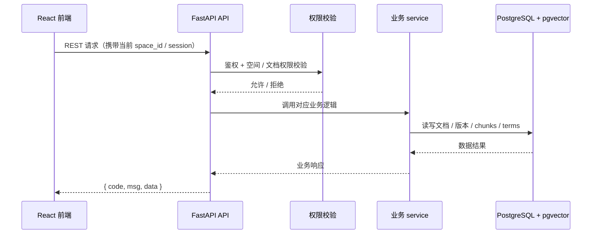

# DIAG-API-SEQ-01 · P1 交互时序图（API 视角）

> **生成式镜像**（`scripts/extract-diagrams.mjs` 产物，不手改）。
> 唯一权威源：`docs/07-api-spec.md`（本图所在块）。阶段：详细设计；类型：顺序图；追溯：07 §3.8 API-ID；渲染：GitHub 原生。

```mermaid
sequenceDiagram
  participant UI as React 前端
  participant API as FastAPI API
  participant Auth as 权限校验
  participant Service as 业务 service
  participant DB as PostgreSQL + pgvector
  UI->>API: REST 请求（携带当前 space_id / session）
  API->>Auth: 鉴权 + 空间 / 文档权限校验
  Auth-->>API: 允许 / 拒绝
  API->>Service: 调用对应业务逻辑
  Service->>DB: 读写文档 / 版本 / chunks / terms
  DB-->>Service: 数据结果
  Service-->>API: 业务响应
  API-->>UI: { code, msg, data }
```
