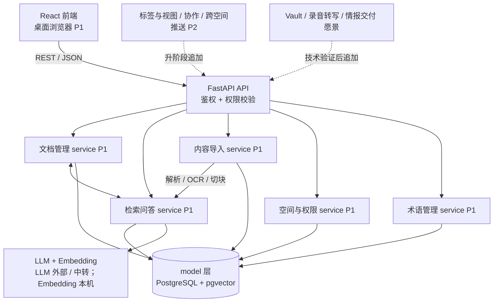

# DIAG-ARCH-01 · 整体架构图

> **生成式镜像**（`scripts/extract-diagrams.mjs` 产物，不手改）。
> 唯一权威源：`docs/04-architecture.md`（本图所在块）。阶段：概要设计；类型：架构图；追溯：REQ / MOD；渲染：GitHub 原生。

```mermaid
flowchart TB
  browser[React 前端<br/>桌面浏览器 P1] -->|REST / JSON| api[FastAPI API<br/>鉴权 + 权限校验]
  api --> docs[文档管理 service P1]
  api --> retrieval[检索问答 service P1]
  api --> ingestion[内容导入 service P1]
  api --> permissions[空间与权限 service P1]
  api --> terms[术语管理 service P1]
  docs <--> retrieval
  ingestion -->|解析 / OCR / 切块| retrieval
  docs --> db[(model 层<br/>PostgreSQL + pgvector)]
  retrieval --> db
  ingestion --> db
  permissions --> db
  terms --> db
  retrieval --> ai[LLM + Embedding<br/>LLM 外部 / 中转；Embedding 本机]
  p2[标签与视图 / 协作 / 跨空间推送 P2] -.升阶段追加.-> api
  vision[Vault / 录音转写 / 情报交付 愿景] -.技术验证后追加.-> api
```
