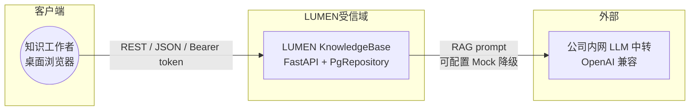

# DIAG-ARCH-01a · 系统上下文图（信任边界）

> **生成式镜像**（`scripts/extract-diagrams.mjs` 产物，不手改）。
> 唯一权威源：`docs/04-architecture.md`（本图所在块）。阶段：概要设计；类型：上下文图；追溯：04 §1.1 外部系统状态；渲染：GitHub 原生。

```mermaid
flowchart LR
  subgraph 客户端
    user((知识工作者<br/>桌面浏览器))
  end
  subgraph LUMEN受信域
    system[LUMEN KnowledgeBase<br/>FastAPI + PgRepository]
  end
  subgraph 外部
    llm[公司内网 LLM 中转<br/>OpenAI 兼容]
  end
  user -->|REST / JSON / Bearer token| system
  system -->|RAG prompt<br/>可配置 Mock 降级| llm
```
