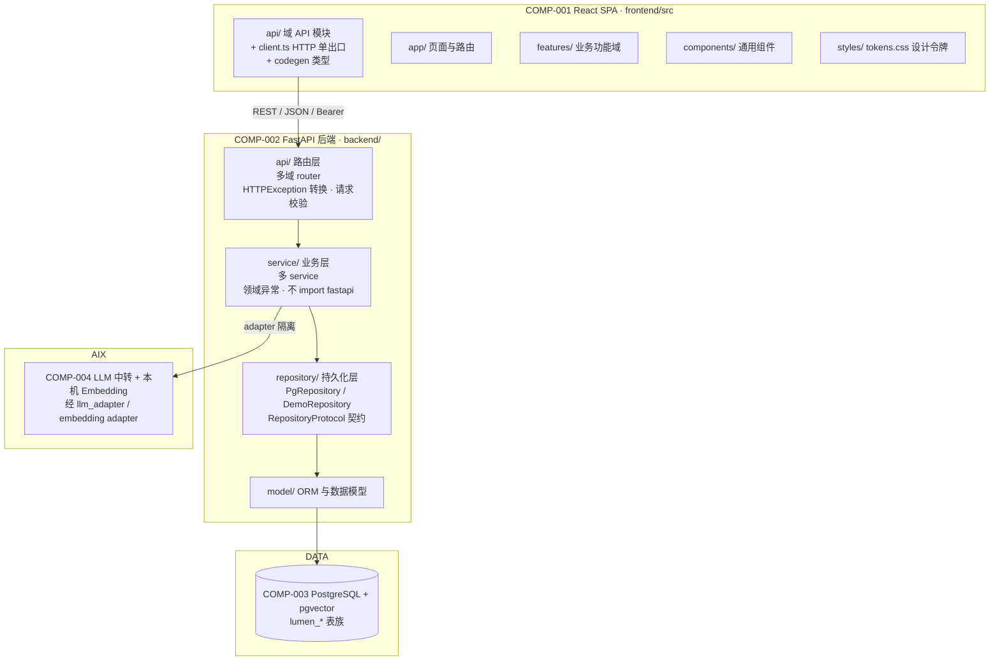

# DIAG-ARCH-01b · 分层架构视图

> **生成式镜像**（`scripts/extract-diagrams.mjs` 产物，不手改）。
> 唯一权威源：`docs/04-architecture.md`（本图所在块）。阶段：概要设计；类型：分层图；追溯：project-rules §5.1 四层；渲染：GitHub 原生。

```mermaid
flowchart TB
  subgraph FE[COMP-001 React SPA · frontend/src]
    direction TB
    feApi[api/ 域 API 模块<br/>+ client.ts HTTP 单出口<br/>+ codegen 类型]
    feApp[app/ 页面与路由]
    feFeat[features/ 业务功能域]
    feComp[components/ 通用组件]
    feStyle[styles/ tokens.css 设计令牌]
  end
  subgraph BE[COMP-002 FastAPI 后端 · backend/]
    direction TB
    beApi[api/ 路由层<br/>多域 router<br/>HTTPException 转换 · 请求校验]
    beSvc[service/ 业务层<br/>多 service<br/>领域异常 · 不 import fastapi]
    beRepo[repository/ 持久化层<br/>PgRepository / DemoRepository<br/>RepositoryProtocol 契约]
    beModel[model/ ORM 与数据模型]
  end
  subgraph DATA
    pg[(COMP-003 PostgreSQL + pgvector<br/>lumen_* 表族)]
  end
  subgraph AIX
    ai[COMP-004 LLM 中转 + 本机 Embedding<br/>经 llm_adapter / embedding adapter]
  end
  feApi -->|REST / JSON / Bearer| beApi
  beApi --> beSvc
  beSvc --> beRepo
  beRepo --> beModel
  beModel --> pg
  beSvc -->|adapter 隔离| ai
```
