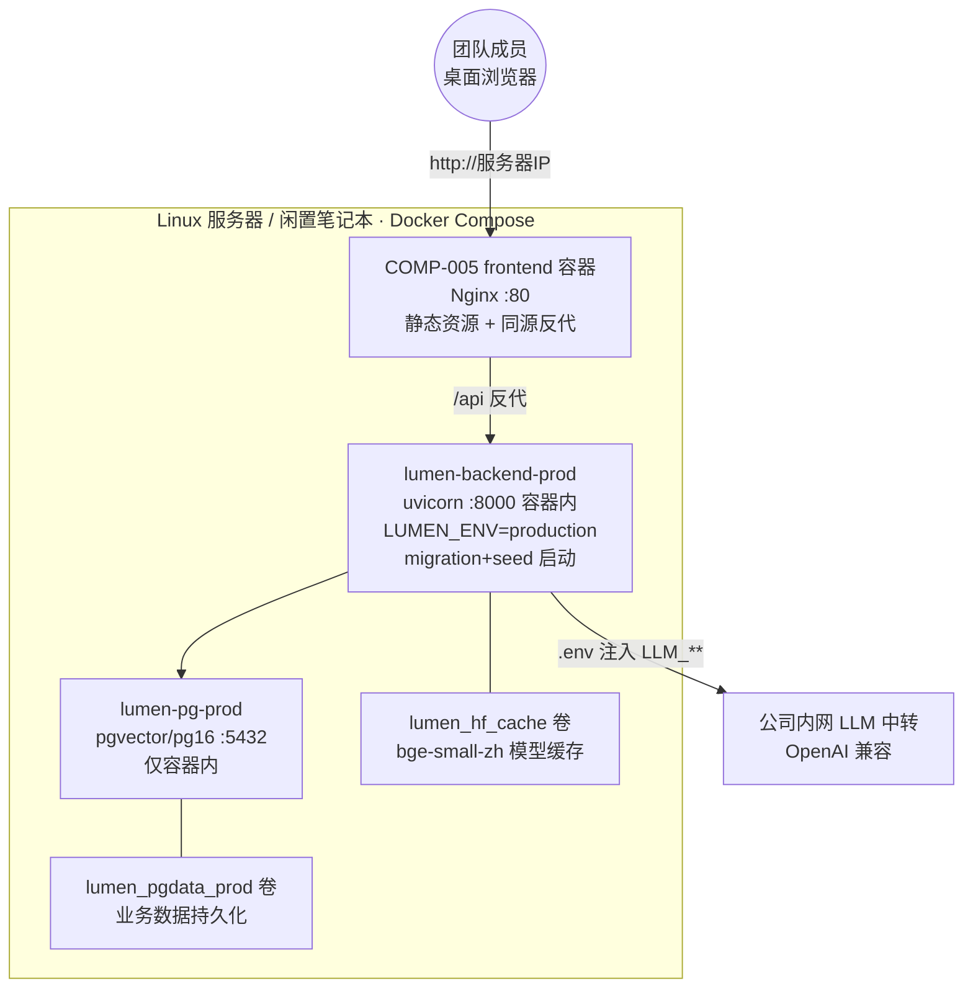

# DIAG-ARCH-02 · 生产部署拓扑图（⑪ 方案 A）

> **生成式镜像**（`scripts/extract-diagrams.mjs` 产物，不手改）。
> 唯一权威源：`docs/04-architecture.md`（本图所在块）。阶段：概要设计；类型：部署图；追溯：04 §4 运行形态；渲染：GitHub 原生。

```mermaid
flowchart TB
  users((团队成员<br/>桌面浏览器)) -->|http://服务器IP| nginx
  subgraph server[Linux 服务器 / 闲置笔记本 · Docker Compose]
    nginx[COMP-005 frontend 容器<br/>Nginx :80<br/>静态资源 + 同源反代]
    backend[lumen-backend-prod<br/>uvicorn :8000 容器内<br/>LUMEN_ENV=production<br/>migration+seed 启动]
    pg[lumen-pg-prod<br/>pgvector/pg16 :5432<br/>仅容器内]
    hf[lumen_hf_cache 卷<br/>bge-small-zh 模型缓存]
    pgdata[lumen_pgdata_prod 卷<br/>业务数据持久化]
  end
  llm[公司内网 LLM 中转<br/>OpenAI 兼容]
  nginx -->|/api 反代| backend
  backend --> pg
  backend --- hf
  pg --- pgdata
  backend -->|.env 注入 LLM_**| llm
```
