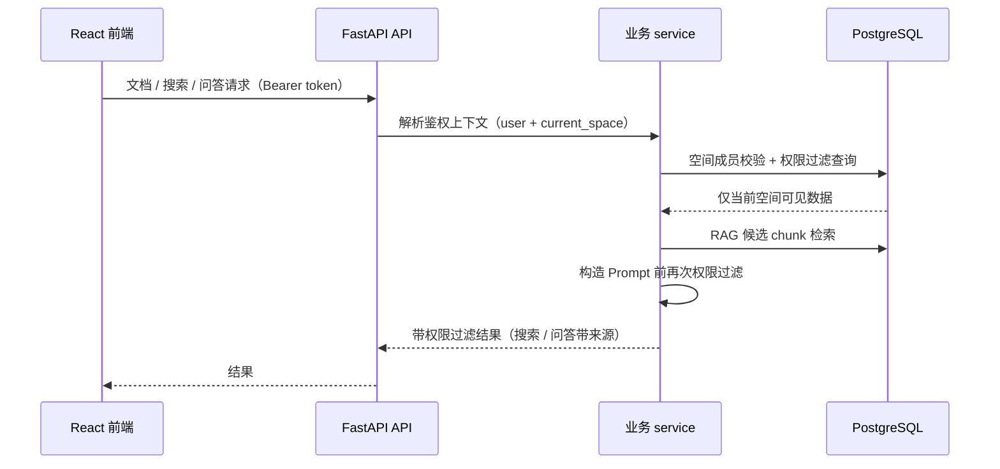

# DIAG-ARCH-SEQ-01 · SEQ-01 文档访问 / 搜索 / RAG 统一过滤

> **生成式镜像**（`scripts/extract-diagrams.mjs` 产物，不手改）。
> 唯一权威源：`docs/04-architecture.md`（本图所在块）。阶段：概要设计；类型：顺序图；追溯：Flow-002；渲染：GitHub 原生。

```mermaid
sequenceDiagram
  participant Browser as React 前端
  participant API as FastAPI API
  participant Service as 业务 service
  participant DB as PostgreSQL

  Browser->>API: 文档 / 搜索 / 问答请求（Bearer token）
  API->>Service: 解析鉴权上下文（user + current_space）
  Service->>DB: 空间成员校验 + 权限过滤查询
  DB-->>Service: 仅当前空间可见数据
  Service->>DB: RAG 候选 chunk 检索
  Service->>Service: 构造 Prompt 前再次权限过滤
  Service-->>API: 带权限过滤结果（搜索 / 问答带来源）
  API-->>Browser: 结果
```
