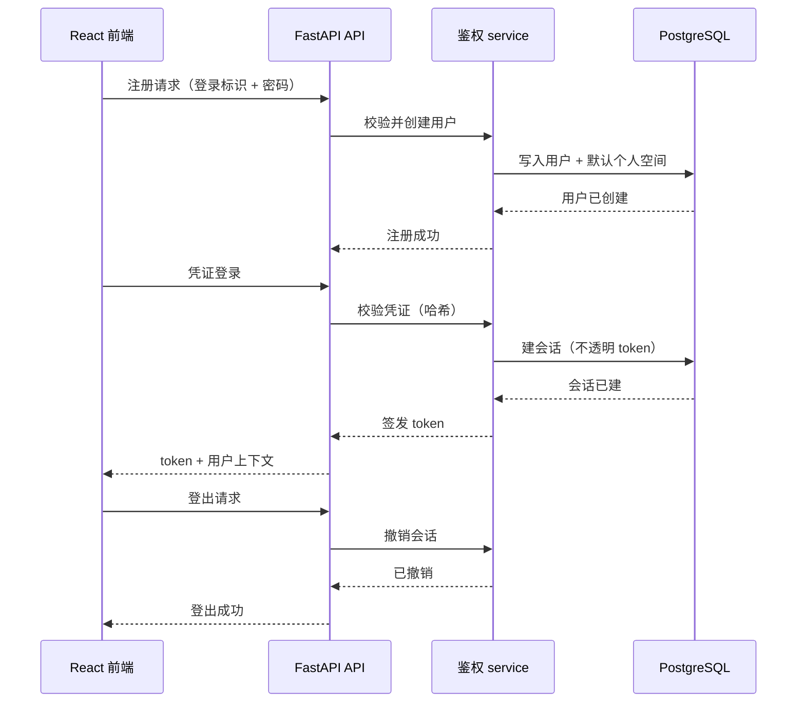

# DIAG-ARCH-SEQ-02 · SEQ-02 Phase2D 认证升级

> **生成式镜像**（`scripts/extract-diagrams.mjs` 产物，不手改）。
> 唯一权威源：`docs/04-architecture.md`（本图所在块）。阶段：概要设计；类型：顺序图；追溯：REQ-040..042；渲染：GitHub 原生。

```mermaid
sequenceDiagram
  participant Browser as React 前端
  participant API as FastAPI API
  participant Auth as 鉴权 service
  participant DB as PostgreSQL

  Browser->>API: 注册请求（登录标识 + 密码）
  API->>Auth: 校验并创建用户
  Auth->>DB: 写入用户 + 默认个人空间
  DB-->>Auth: 用户已创建
  Auth-->>API: 注册成功
  Browser->>API: 凭证登录
  API->>Auth: 校验凭证（哈希）
  Auth->>DB: 建会话（不透明 token）
  DB-->>Auth: 会话已建
  Auth-->>API: 签发 token
  API-->>Browser: token + 用户上下文
  Browser->>API: 登出请求
  API->>Auth: 撤销会话
  Auth-->>API: 已撤销
  API-->>Browser: 登出成功
```
