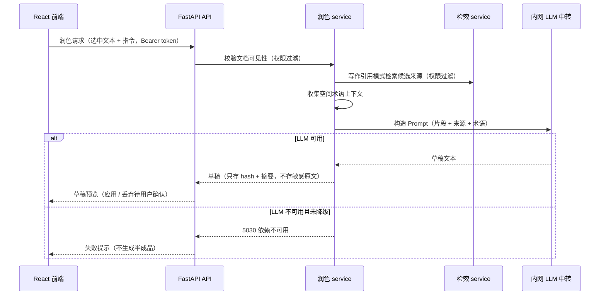

# DIAG-ARCH-SEQ-03 · SEQ-03 AI 润色 / 写作引用

> **生成式镜像**（`scripts/extract-diagrams.mjs` 产物，不手改）。
> 唯一权威源：`docs/04-architecture.md`（本图所在块）。阶段：概要设计；类型：顺序图；追溯：Flow-005 / RG-008；渲染：GitHub 原生。

```mermaid
sequenceDiagram
  participant Browser as React 前端
  participant API as FastAPI API
  participant Polish as 润色 service
  participant RAG as 检索 service
  participant LLM as 内网 LLM 中转

  Browser->>API: 润色请求（选中文本 + 指令，Bearer token）
  API->>Polish: 校验文档可见性（权限过滤）
  Polish->>RAG: 写作引用模式检索候选来源（权限过滤）
  Polish->>Polish: 收集空间术语上下文
  Polish->>LLM: 构造 Prompt（片段 + 来源 + 术语）
  alt LLM 可用
    LLM-->>Polish: 草稿文本
    Polish-->>API: 草稿（只存 hash + 摘要，不存敏感原文）
    API-->>Browser: 草稿预览（应用 / 丢弃待用户确认）
  else LLM 不可用且未降级
    Polish-->>API: 5030 依赖不可用
    API-->>Browser: 失败提示（不生成半成品）
  end
```
