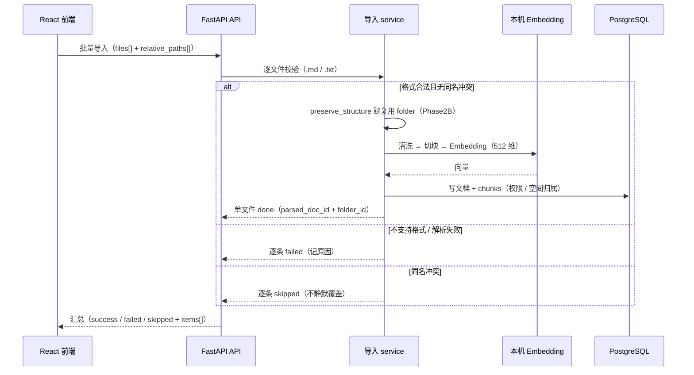

# DIAG-ARCH-SEQ-04 · SEQ-04 批量 / 文件夹导入

> **生成式镜像**（`scripts/extract-diagrams.mjs` 产物，不手改）。
> 唯一权威源：`docs/04-architecture.md`（本图所在块）。阶段：概要设计；类型：顺序图；追溯：Flow-006 / EX-006；渲染：GitHub 原生。

```mermaid
sequenceDiagram
  participant Browser as React 前端
  participant API as FastAPI API
  participant Ingest as 导入 service
  participant Emb as 本机 Embedding
  participant DB as PostgreSQL

  Browser->>API: 批量导入（files[] + relative_paths[]）
  API->>Ingest: 逐文件校验（.md / .txt）
  alt 格式合法且无同名冲突
    Ingest->>Ingest: preserve_structure 建复用 folder（Phase2B）
    Ingest->>Emb: 清洗 → 切块 → Embedding（512 维）
    Emb-->>Ingest: 向量
    Ingest->>DB: 写文档 + chunks（权限 / 空间归属）
    Ingest-->>API: 单文件 done（parsed_doc_id + folder_id）
  else 不支持格式 / 解析失败
    Ingest-->>API: 逐条 failed（记原因）
  else 同名冲突
    Ingest-->>API: 逐条 skipped（不静默覆盖）
  end
  API-->>Browser: 汇总（success / failed / skipped + items[]）
```
