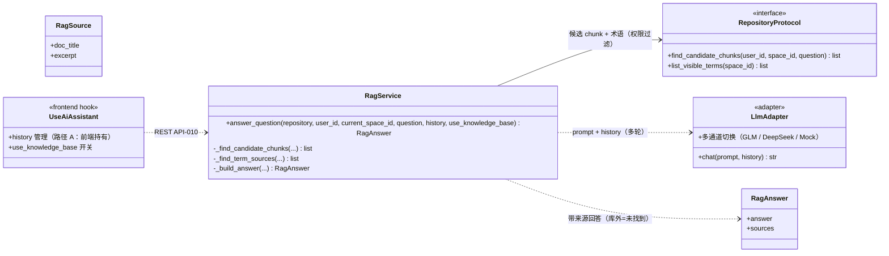

# DIAG-CLS-AI-01 · 详细类图 · AI 助手

> **生成式镜像**（`scripts/extract-diagrams.mjs` 产物，不手改）。
> 唯一权威源：`docs/design/ai-assistant.md`（本图所在块）。阶段：详细设计；类型：类图（详细）；追溯：REQ-008；渲染：GitHub 原生。

```mermaid
classDiagram
  direction LR
  class RagSource {
    +doc_title
    +excerpt
  }
  class RagAnswer {
    +answer
    +sources
  }
  class RepositoryProtocol {
    <<interface>>
    +find_candidate_chunks(user_id, space_id, question) list
    +list_visible_terms(space_id) list
  }
  class RagService {
    +answer_question(repository, user_id, current_space_id, question, history, use_knowledge_base) RagAnswer
    -_find_candidate_chunks(...) list
    -_find_term_sources(...) list
    -_build_answer(...) RagAnswer
  }
  class LlmAdapter {
    <<adapter>>
    +chat(prompt, history) str
    +多通道切换（GLM / DeepSeek / Mock）
  }
  class UseAiAssistant {
    <<frontend hook>>
    +history 管理（路径 A：前端持有）
    +use_knowledge_base 开关
  }

  RagService --> RepositoryProtocol : 候选 chunk + 术语（权限过滤）
  RagService ..> LlmAdapter : prompt + history（多轮）
  RagService ..> RagAnswer : 带来源回答（库外=未找到）
  UseAiAssistant ..> RagService : REST API-010
```
