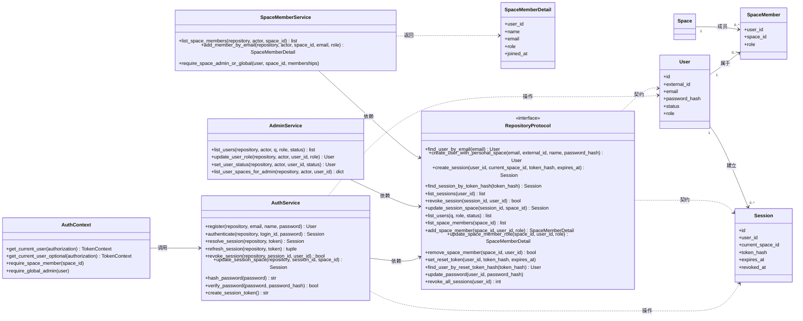

# DIAG-CLS-AUTH-01 · 详细类图 · 账户与认证

> **生成式镜像**（`scripts/extract-diagrams.mjs` 产物，不手改）。
> 唯一权威源：`docs/design/accounts-auth.md`（本图所在块）。阶段：详细设计；类型：类图（详细）；追溯：REQ-040..047/050/051；渲染：GitHub 原生。

```mermaid
classDiagram
  direction LR
  class User {
    +id
    +external_id
    +email
    +password_hash
    +status
    +role
  }
  class Session {
    +id
    +user_id
    +current_space_id
    +token_hash
    +expires_at
    +revoked_at
  }
  class Space
  class SpaceMember {
    +user_id
    +space_id
    +role
  }
  class SpaceMemberDetail {
    +user_id
    +name
    +email
    +role
    +joined_at
  }
  class RepositoryProtocol {
    <<interface>>
    +find_user_by_email(email) User
    +create_user_with_personal_space(email, external_id, name, password_hash) User
    +create_session(user_id, current_space_id, token_hash, expires_at) Session
    +find_session_by_token_hash(token_hash) Session
    +list_sessions(user_id) list
    +revoke_session(session_id, user_id) bool
    +update_session_space(session_id, space_id) Session
    +list_users(q, role, status) list
    +list_space_members(space_id) list
    +add_space_member(space_id, user_id, role) SpaceMemberDetail
    +update_space_member_role(space_id, user_id, role) SpaceMemberDetail
    +remove_space_member(space_id, user_id) bool
    +set_reset_token(user_id, token_hash, expires_at)
    +find_user_by_reset_token_hash(token_hash) User
    +update_password(user_id, password_hash)
    +revoke_all_sessions(user_id) int
  }
  class AuthService {
    +register(repository, email, name, password) User
    +authenticate(repository, login_id, password) Session
    +resolve_session(repository, token) Session
    +refresh_session(repository, token) tuple
    +revoke_session(repository, session_id, user_id) bool
    +update_session_space(repository, session_id, space_id) Session
    +hash_password(password) str
    +verify_password(password, password_hash) bool
    +create_session_token() str
  }
  class AdminService {
    +list_users(repository, actor, q, role, status) list
    +update_user_role(repository, actor, user_id, role) User
    +set_user_status(repository, actor, user_id, status) User
    +list_user_spaces_for_admin(repository, actor, user_id) dict
  }
  class SpaceMemberService {
    +list_space_members(repository, actor, space_id) list
    +add_member_by_email(repository, actor, space_id, email, role) SpaceMemberDetail
    +require_space_admin_or_global(user, space_id, memberships)
  }
  class AuthContext {
    +get_current_user(authorization) TokenContext
    +get_current_user_optional(authorization) TokenContext
    +require_space_member(space_id)
    +require_global_admin(user)
  }

  AuthService --> RepositoryProtocol : 依赖
  AdminService --> RepositoryProtocol : 依赖
  SpaceMemberService --> RepositoryProtocol : 依赖
  AuthContext --> AuthService : 调用
  AuthService ..> User : 操作
  AuthService ..> Session : 操作
  SpaceMemberService ..> SpaceMemberDetail : 返回
  RepositoryProtocol ..> User : 契约
  RepositoryProtocol ..> Session : 契约
  User "1" --> "0..*" Session : 建立
  User "1" --> "0..*" SpaceMember : 属于
  Space "1" --> "0..*" SpaceMember : 成员
```
