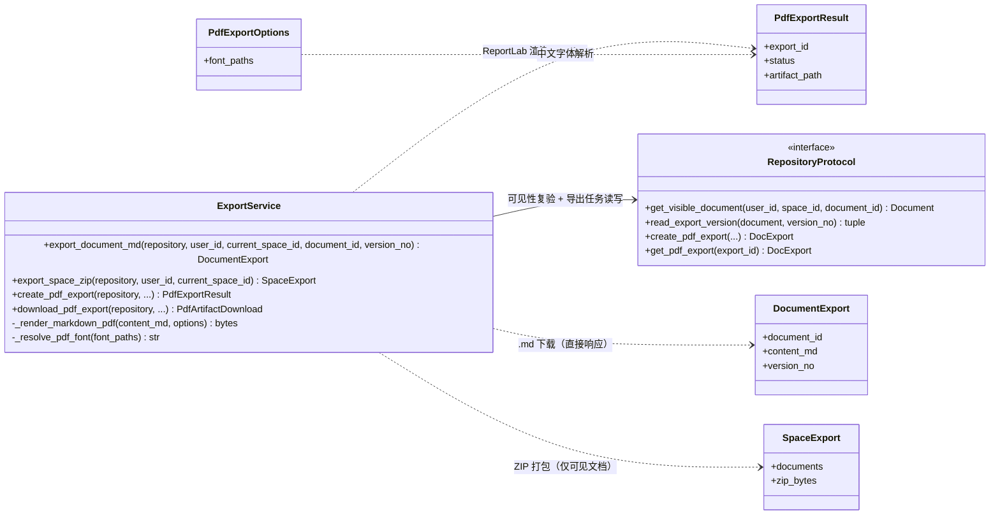

# DIAG-CLS-EXPORT-01 · 详细类图 · 导出交付

> **生成式镜像**（`scripts/extract-diagrams.mjs` 产物，不手改）。
> 唯一权威源：`docs/design/export-delivery.md`（本图所在块）。阶段：详细设计；类型：类图（详细）；追溯：REQ-038/027；渲染：GitHub 原生。

```mermaid
classDiagram
  direction LR
  class DocumentExport {
    +document_id
    +content_md
    +version_no
  }
  class SpaceExport {
    +documents
    +zip_bytes
  }
  class PdfExportOptions {
    +font_paths
  }
  class PdfExportResult {
    +export_id
    +status
    +artifact_path
  }
  class RepositoryProtocol {
    <<interface>>
    +get_visible_document(user_id, space_id, document_id) Document
    +read_export_version(document, version_no) tuple
    +create_pdf_export(...) DocExport
    +get_pdf_export(export_id) DocExport
  }
  class ExportService {
    +export_document_md(repository, user_id, current_space_id, document_id, version_no) DocumentExport
    +export_space_zip(repository, user_id, current_space_id) SpaceExport
    +create_pdf_export(repository, ...) PdfExportResult
    +download_pdf_export(repository, ...) PdfArtifactDownload
    -_render_markdown_pdf(content_md, options) bytes
    -_resolve_pdf_font(font_paths) str
  }

  ExportService --> RepositoryProtocol : 可见性复验 + 导出任务读写
  ExportService ..> DocumentExport : .md 下载（直接响应）
  ExportService ..> SpaceExport : ZIP 打包（仅可见文档）
  ExportService ..> PdfExportResult : ReportLab 渲染 + artifact
  PdfExportOptions ..> PdfExportResult : 中文字体解析
```
