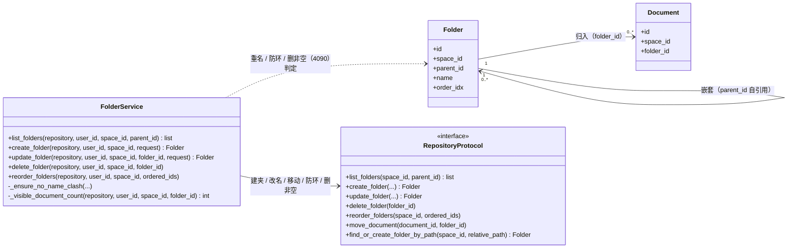

# DIAG-CLS-FOLDER-01 · 详细类图 · 文档目录树

> **生成式镜像**（`scripts/extract-diagrams.mjs` 产物，不手改）。
> 唯一权威源：`docs/design/folder-tree.md`（本图所在块）。阶段：详细设计；类型：类图（详细）；追溯：REQ-039/037；渲染：GitHub 原生。

```mermaid
classDiagram
  direction LR
  class Folder {
    +id
    +space_id
    +parent_id
    +name
    +order_idx
  }
  class Document {
    +id
    +space_id
    +folder_id
  }
  class RepositoryProtocol {
    <<interface>>
    +list_folders(space_id, parent_id) list
    +create_folder(...) Folder
    +update_folder(...) Folder
    +delete_folder(folder_id)
    +reorder_folders(space_id, ordered_ids)
    +move_document(document_id, folder_id)
    +find_or_create_folder_by_path(space_id, relative_path) Folder
  }
  class FolderService {
    +list_folders(repository, user_id, space_id, parent_id) list
    +create_folder(repository, user_id, space_id, request) Folder
    +update_folder(repository, user_id, space_id, folder_id, request) Folder
    +delete_folder(repository, user_id, space_id, folder_id)
    +reorder_folders(repository, user_id, space_id, ordered_ids)
    -_ensure_no_name_clash(...)
    -_visible_document_count(repository, user_id, space_id, folder_id) int
  }

  FolderService --> RepositoryProtocol : 建夹 / 改名 / 移动 / 防环 / 删非空
  Folder "1" --> "0..*" Folder : 嵌套（parent_id 自引用）
  Folder "1" --> "0..*" Document : 归入（folder_id）
  FolderService ..> Folder : 重名 / 防环 / 删非空（4090）判定
```
