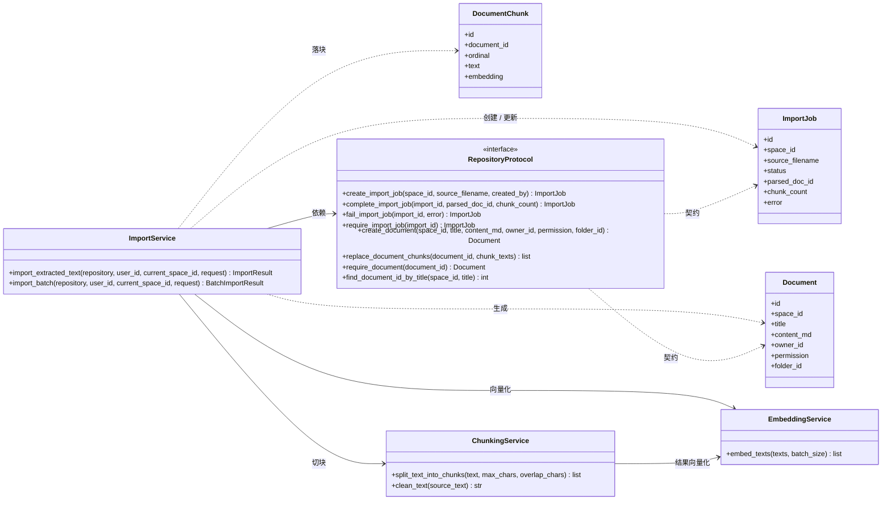

# DIAG-CLS-INGEST-01 · 详细类图 · 内容导入

> **生成式镜像**（`scripts/extract-diagrams.mjs` 产物，不手改）。
> 唯一权威源：`docs/design/ingestion.md`（本图所在块）。阶段：详细设计；类型：类图（详细）；追溯：REQ-009/010/037；渲染：GitHub 原生。

```mermaid
classDiagram
  direction LR
  class ImportJob {
    +id
    +space_id
    +source_filename
    +status
    +parsed_doc_id
    +chunk_count
    +error
  }
  class Document {
    +id
    +space_id
    +title
    +content_md
    +owner_id
    +permission
    +folder_id
  }
  class DocumentChunk {
    +id
    +document_id
    +ordinal
    +text
    +embedding
  }
  class RepositoryProtocol {
    <<interface>>
    +create_import_job(space_id, source_filename, created_by) ImportJob
    +complete_import_job(import_id, parsed_doc_id, chunk_count) ImportJob
    +fail_import_job(import_id, error) ImportJob
    +require_import_job(import_id) ImportJob
    +create_document(space_id, title, content_md, owner_id, permission, folder_id) Document
    +replace_document_chunks(document_id, chunk_texts) list
    +require_document(document_id) Document
    +find_document_id_by_title(space_id, title) int
  }
  class ImportService {
    +import_extracted_text(repository, user_id, current_space_id, request) ImportResult
    +import_batch(repository, user_id, current_space_id, request) BatchImportResult
  }
  class ChunkingService {
    +split_text_into_chunks(text, max_chars, overlap_chars) list
    +clean_text(source_text) str
  }
  class EmbeddingService {
    +embed_texts(texts, batch_size) list
  }

  ImportService --> RepositoryProtocol : 依赖
  ImportService --> ChunkingService : 切块
  ImportService --> EmbeddingService : 向量化
  ChunkingService --> EmbeddingService : 结果向量化
  ImportService ..> ImportJob : 创建 / 更新
  ImportService ..> Document : 生成
  ImportService ..> DocumentChunk : 落块
  RepositoryProtocol ..> ImportJob : 契约
  RepositoryProtocol ..> Document : 契约
```
