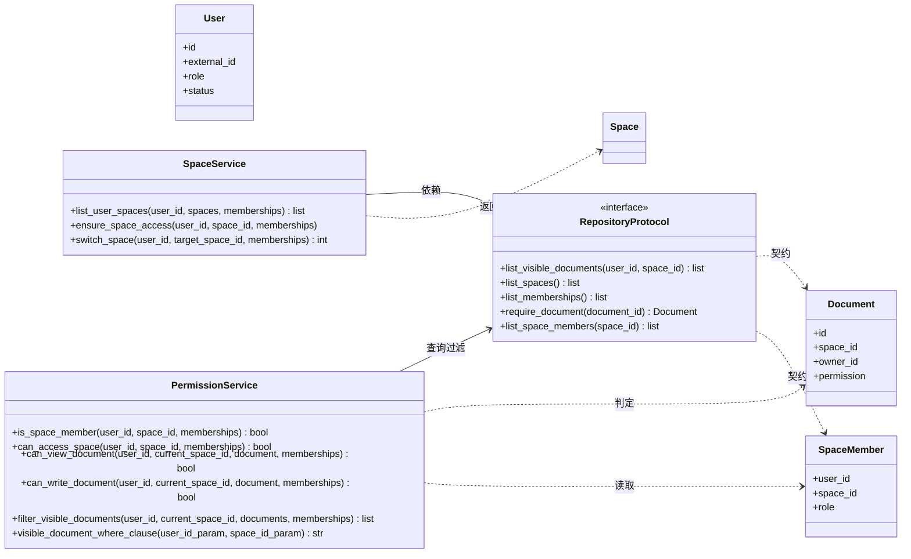

# DIAG-CLS-PERM-01 · 详细类图 · 空间与权限

> **生成式镜像**（`scripts/extract-diagrams.mjs` 产物，不手改）。
> 唯一权威源：`docs/design/permissions.md`（本图所在块）。阶段：详细设计；类型：类图（详细）；追溯：REQ-001/002/003；渲染：GitHub 原生。

```mermaid
classDiagram
  direction LR
  class User {
    +id
    +external_id
    +role
    +status
  }
  class Space
  class SpaceMember {
    +user_id
    +space_id
    +role
  }
  class Document {
    +id
    +space_id
    +owner_id
    +permission
  }
  class RepositoryProtocol {
    <<interface>>
    +list_visible_documents(user_id, space_id) list
    +list_spaces() list
    +list_memberships() list
    +require_document(document_id) Document
    +list_space_members(space_id) list
  }
  class PermissionService {
    +is_space_member(user_id, space_id, memberships) bool
    +can_access_space(user_id, space_id, memberships) bool
    +can_view_document(user_id, current_space_id, document, memberships) bool
    +can_write_document(user_id, current_space_id, document, memberships) bool
    +filter_visible_documents(user_id, current_space_id, documents, memberships) list
    +visible_document_where_clause(user_id_param, space_id_param) str
  }
  class SpaceService {
    +list_user_spaces(user_id, spaces, memberships) list
    +ensure_space_access(user_id, space_id, memberships)
    +switch_space(user_id, target_space_id, memberships) int
  }

  PermissionService --> RepositoryProtocol : 查询过滤
  SpaceService --> RepositoryProtocol : 依赖
  PermissionService ..> Document : 判定
  PermissionService ..> SpaceMember : 读取
  SpaceService ..> Space : 返回
  RepositoryProtocol ..> Document : 契约
  RepositoryProtocol ..> SpaceMember : 契约
```
