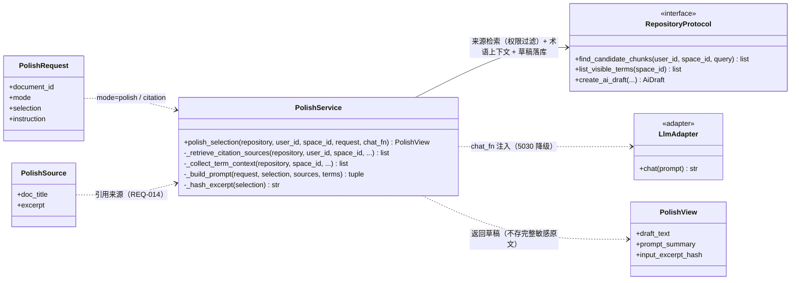

# DIAG-CLS-POLISH-01 · 详细类图 · AI 润色 / 写作引用

> **生成式镜像**（`scripts/extract-diagrams.mjs` 产物，不手改）。
> 唯一权威源：`docs/design/ai-polish.md`（本图所在块）。阶段：详细设计；类型：类图（详细）；追溯：REQ-014；渲染：GitHub 原生。

```mermaid
classDiagram
  direction LR
  class PolishRequest {
    +document_id
    +mode
    +selection
    +instruction
  }
  class PolishSource {
    +doc_title
    +excerpt
  }
  class PolishView {
    +draft_text
    +prompt_summary
    +input_excerpt_hash
  }
  class RepositoryProtocol {
    <<interface>>
    +find_candidate_chunks(user_id, space_id, query) list
    +list_visible_terms(space_id) list
    +create_ai_draft(...) AiDraft
  }
  class PolishService {
    +polish_selection(repository, user_id, space_id, request, chat_fn) PolishView
    -_retrieve_citation_sources(repository, user_id, space_id, ...) list
    -_collect_term_context(repository, space_id, ...) list
    -_build_prompt(request, selection, sources, terms) tuple
    -_hash_excerpt(selection) str
  }
  class LlmAdapter {
    <<adapter>>
    +chat(prompt) str
  }

  PolishService --> RepositoryProtocol : 来源检索（权限过滤）+ 术语上下文 + 草稿落库
  PolishService ..> LlmAdapter : chat_fn 注入（5030 降级）
  PolishService ..> PolishView : 返回草稿（不存完整敏感原文）
  PolishRequest ..> PolishService : mode=polish / citation
  PolishSource ..> PolishService : 引用来源（REQ-014）
```
