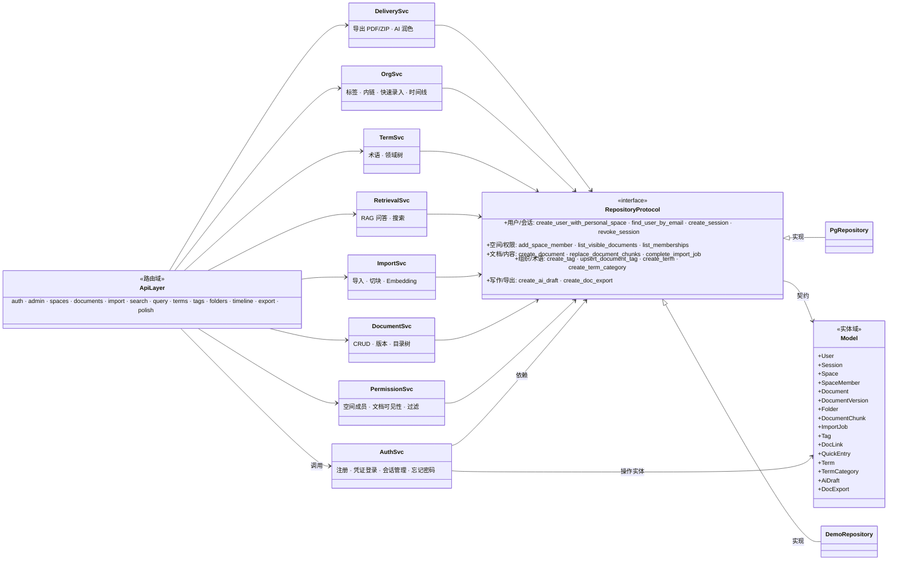

# DIAG-CLS-PRELIM-01 · 概设类图（后端四层关键类）

> **生成式镜像**（`scripts/extract-diagrams.mjs` 产物，不手改）。
> 唯一权威源：`docs/04-architecture.md`（本图所在块）。阶段：概要设计；类型：类图（概设）；追溯：→ 详细类图 DIAG-CLS-*；渲染：GitHub 原生。

```mermaid
classDiagram
  direction LR
  class Model {
    <<实体域>>
    +User
    +Session
    +Space
    +SpaceMember
    +Document
    +DocumentVersion
    +Folder
    +DocumentChunk
    +ImportJob
    +Tag
    +DocLink
    +QuickEntry
    +Term
    +TermCategory
    +AiDraft
    +DocExport
  }
  class RepositoryProtocol {
    <<interface>>
    +用户/会话: create_user_with_personal_space · find_user_by_email · create_session · revoke_session
    +空间/权限: add_space_member · list_visible_documents · list_memberships
    +文档/内容: create_document · replace_document_chunks · complete_import_job
    +组织/术语: create_tag · upsert_document_tag · create_term · create_term_category
    +写作/导出: create_ai_draft · create_doc_export
  }
  class PgRepository
  class DemoRepository
  class AuthSvc {
    注册 · 凭证登录 · 会话管理 · 忘记密码
  }
  class PermissionSvc {
    空间成员 · 文档可见性 · 过滤
  }
  class DocumentSvc {
    CRUD · 版本 · 目录树
  }
  class ImportSvc {
    导入 · 切块 · Embedding
  }
  class RetrievalSvc {
    RAG 问答 · 搜索
  }
  class TermSvc {
    术语 · 领域树
  }
  class OrgSvc {
    标签 · 内链 · 快速录入 · 时间线
  }
  class DeliverySvc {
    导出 PDF/ZIP · AI 润色
  }
  class ApiLayer {
    <<路由域>>
    auth · admin · spaces · documents · import · search · query · terms · tags · folders · timeline · export · polish
  }

  ApiLayer --> AuthSvc : 调用
  ApiLayer --> PermissionSvc
  ApiLayer --> DocumentSvc
  ApiLayer --> ImportSvc
  ApiLayer --> RetrievalSvc
  ApiLayer --> TermSvc
  ApiLayer --> OrgSvc
  ApiLayer --> DeliverySvc
  AuthSvc --> RepositoryProtocol : 依赖
  PermissionSvc --> RepositoryProtocol
  DocumentSvc --> RepositoryProtocol
  ImportSvc --> RepositoryProtocol
  RetrievalSvc --> RepositoryProtocol
  TermSvc --> RepositoryProtocol
  OrgSvc --> RepositoryProtocol
  DeliverySvc --> RepositoryProtocol
  RepositoryProtocol <|-- PgRepository : 实现
  RepositoryProtocol <|-- DemoRepository : 实现
  AuthSvc --> Model : 操作实体
  RepositoryProtocol --> Model : 契约
```
