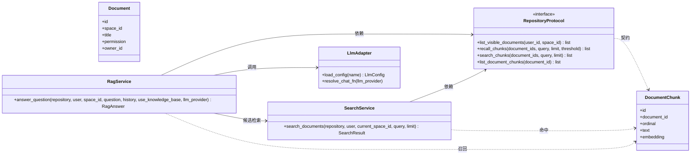

# DIAG-CLS-RAG-01 · 详细类图 · 检索问答

> **生成式镜像**（`scripts/extract-diagrams.mjs` 产物，不手改）。
> 唯一权威源：`docs/design/rag-retrieval.md`（本图所在块）。阶段：详细设计；类型：类图（详细）；追溯：REQ-007/008；渲染：GitHub 原生。

```mermaid
classDiagram
  direction LR
  class Document {
    +id
    +space_id
    +title
    +permission
    +owner_id
  }
  class DocumentChunk {
    +id
    +document_id
    +ordinal
    +text
    +embedding
  }
  class RepositoryProtocol {
    <<interface>>
    +list_visible_documents(user_id, space_id) list
    +recall_chunks(document_ids, query, limit, threshold) list
    +search_chunks(document_ids, query, limit) list
    +list_document_chunks(document_id) list
  }
  class RagService {
    +answer_question(repository, user, space_id, question, history, use_knowledge_base, llm_provider) RagAnswer
  }
  class SearchService {
    +search_documents(repository, user, current_space_id, query, limit) SearchResult
  }
  class LlmAdapter {
    +load_config(name) LlmConfig
    +resolve_chat_fn(llm_provider)
  }

  RagService --> RepositoryProtocol : 依赖
  RagService --> LlmAdapter : 调用
  RagService --> SearchService : 候选检索
  SearchService --> RepositoryProtocol : 依赖
  RagService ..> DocumentChunk : 召回
  SearchService ..> DocumentChunk : 命中
  RepositoryProtocol ..> DocumentChunk : 契约
```
