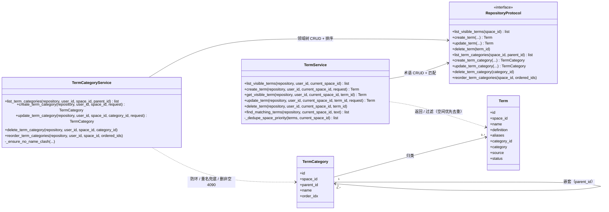

# DIAG-CLS-TERM-01 · 详细类图 · 术语管理

> **生成式镜像**（`scripts/extract-diagrams.mjs` 产物，不手改）。
> 唯一权威源：`docs/design/term-management.md`（本图所在块）。阶段：详细设计；类型：类图（详细）；追溯：REQ-036/048；渲染：GitHub 原生。

```mermaid
classDiagram
  direction LR
  class Term {
    +id
    +space_id
    +name
    +definition
    +aliases
    +category_id
    +category
    +source
    +status
  }
  class TermCategory {
    +id
    +space_id
    +parent_id
    +name
    +order_idx
  }
  class RepositoryProtocol {
    <<interface>>
    +list_visible_terms(space_id) list
    +create_term(...) Term
    +update_term(...) Term
    +delete_term(term_id)
    +list_term_categories(space_id, parent_id) list
    +create_term_category(...) TermCategory
    +update_term_category(...) TermCategory
    +delete_term_category(category_id)
    +reorder_term_categories(space_id, ordered_ids)
  }
  class TermService {
    +list_visible_terms(repository, user_id, current_space_id) list
    +create_term(repository, user_id, current_space_id, request) Term
    +get_visible_term(repository, user_id, current_space_id, term_id) Term
    +update_term(repository, user_id, current_space_id, term_id, request) Term
    +delete_term(repository, user_id, current_space_id, term_id)
    +find_matching_terms(repository, current_space_id, text) list
    -_dedupe_space_priority(terms, current_space_id) list
  }
  class TermCategoryService {
    +list_term_categories(repository, user_id, space_id, parent_id) list
    +create_term_category(repository, user_id, space_id, request) TermCategory
    +update_term_category(repository, user_id, space_id, category_id, request) TermCategory
    +delete_term_category(repository, user_id, space_id, category_id)
    +reorder_term_categories(repository, user_id, space_id, ordered_ids)
    -_ensure_no_name_clash(...)
  }

  TermService --> RepositoryProtocol : 术语 CRUD + 匹配
  TermCategoryService --> RepositoryProtocol : 领域树 CRUD + 排序
  TermCategory "1" --> "0..*" Term : 归类
  TermCategory "1" --> "0..*" TermCategory : 嵌套（parent_id）
  TermService ..> Term : 返回 / 过滤（空间优先去重）
  TermCategoryService ..> TermCategory : 防环 / 重名兜底 / 删非空 4090
```
