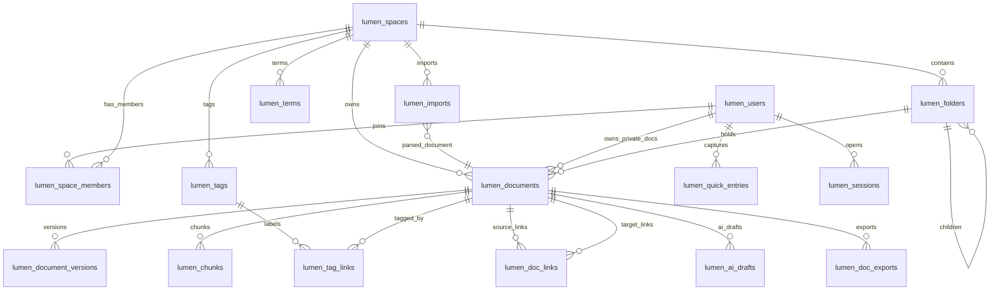

# DIAG-DB-ER-01 · 物理 ERD（表间关系）

> **生成式镜像**（`scripts/extract-diagrams.mjs` 产物，不手改）。
> 唯一权威源：`docs/06-db-design.md`（本图所在块）。阶段：详细设计；类型：ER 图；追溯：06 §1/§6；渲染：GitHub 原生。

```mermaid
erDiagram
  lumen_users ||--o{ lumen_space_members : joins
  lumen_spaces ||--o{ lumen_space_members : has_members
  lumen_spaces ||--o{ lumen_documents : owns
  lumen_documents ||--o{ lumen_document_versions : versions
  lumen_documents ||--o{ lumen_chunks : chunks
  lumen_spaces ||--o{ lumen_imports : imports
  lumen_imports }o--|| lumen_documents : parsed_document
  lumen_spaces ||--o{ lumen_terms : terms
  lumen_users ||--o{ lumen_documents : owns_private_docs
  lumen_spaces ||--o{ lumen_tags : tags
  lumen_tags ||--o{ lumen_tag_links : labels
  lumen_documents ||--o{ lumen_tag_links : tagged_by
  lumen_documents ||--o{ lumen_doc_links : source_links
  lumen_documents ||--o{ lumen_doc_links : target_links
  lumen_users ||--o{ lumen_quick_entries : captures
  lumen_users ||--o{ lumen_sessions : opens
  lumen_documents ||--o{ lumen_ai_drafts : ai_drafts
  lumen_documents ||--o{ lumen_doc_exports : exports
  lumen_spaces ||--o{ lumen_folders : contains
  lumen_folders ||--o{ lumen_folders : children
  lumen_folders ||--o{ lumen_documents : holds
```
