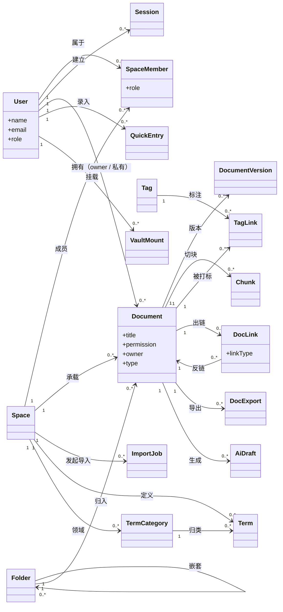

# DIAG-DOM-01 · 领域模型（分析类图 / 概念 ERD）

> **生成式镜像**（`scripts/extract-diagrams.mjs` 产物，不手改）。
> 唯一权威源：`docs/06-db-design.md`（本图所在块）。阶段：需求分析；类型：类图（概念）；追溯：06 §6 REQ→表；渲染：GitHub 原生。

```mermaid
classDiagram
  direction LR
  class User {
    +name
    +email
    +role
  }
  class Space
  class SpaceMember {
    +role
  }
  class Session
  class Document {
    +title
    +permission
    +owner
    +type
  }
  class DocumentVersion
  class Chunk
  class Folder
  class Tag
  class TagLink
  class DocLink {
    +linkType
  }
  class QuickEntry
  class ImportJob
  class Term
  class TermCategory
  class DocExport
  class AiDraft
  class VaultMount

  User "1" --> "0..*" SpaceMember : 属于
  Space "1" --> "0..*" SpaceMember : 成员
  User "1" --> "0..*" Session : 建立
  User "1" --> "0..*" Document : 拥有（owner / 私有）
  Space "1" --> "0..*" Document : 承载
  Document "1" --> "0..*" DocumentVersion : 版本
  Document "1" --> "0..*" Chunk : 切块
  Folder "1" --> "0..*" Folder : 嵌套
  Folder "1" --> "0..*" Document : 归入
  Tag "1" --> "0..*" TagLink : 标注
  Document "1" --> "0..*" TagLink : 被打标
  Document "1" --> "0..*" DocLink : 出链
  Document "1" <-- "0..*" DocLink : 反链
  User "1" --> "0..*" QuickEntry : 录入
  Space "1" --> "0..*" ImportJob : 发起导入
  Space "1" --> "0..*" Term : 定义
  TermCategory "1" --> "0..*" Term : 归类
  Space "1" --> "0..*" TermCategory : 领域
  Document "1" --> "0..*" DocExport : 导出
  Document "1" --> "0..*" AiDraft : 生成
  User "1" --> "0..*" VaultMount : 挂载
```
